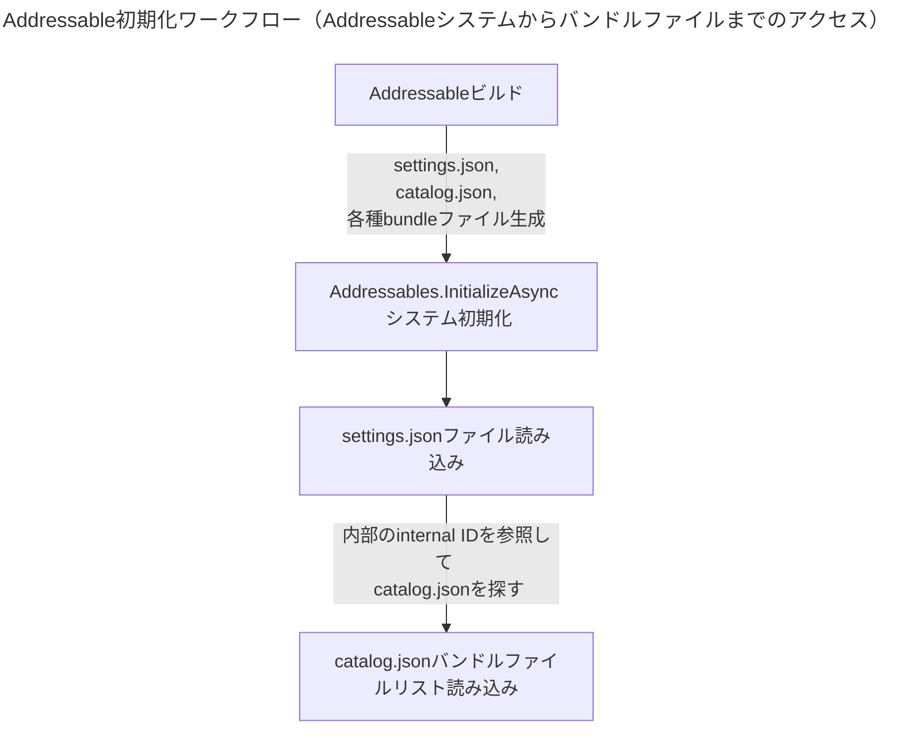
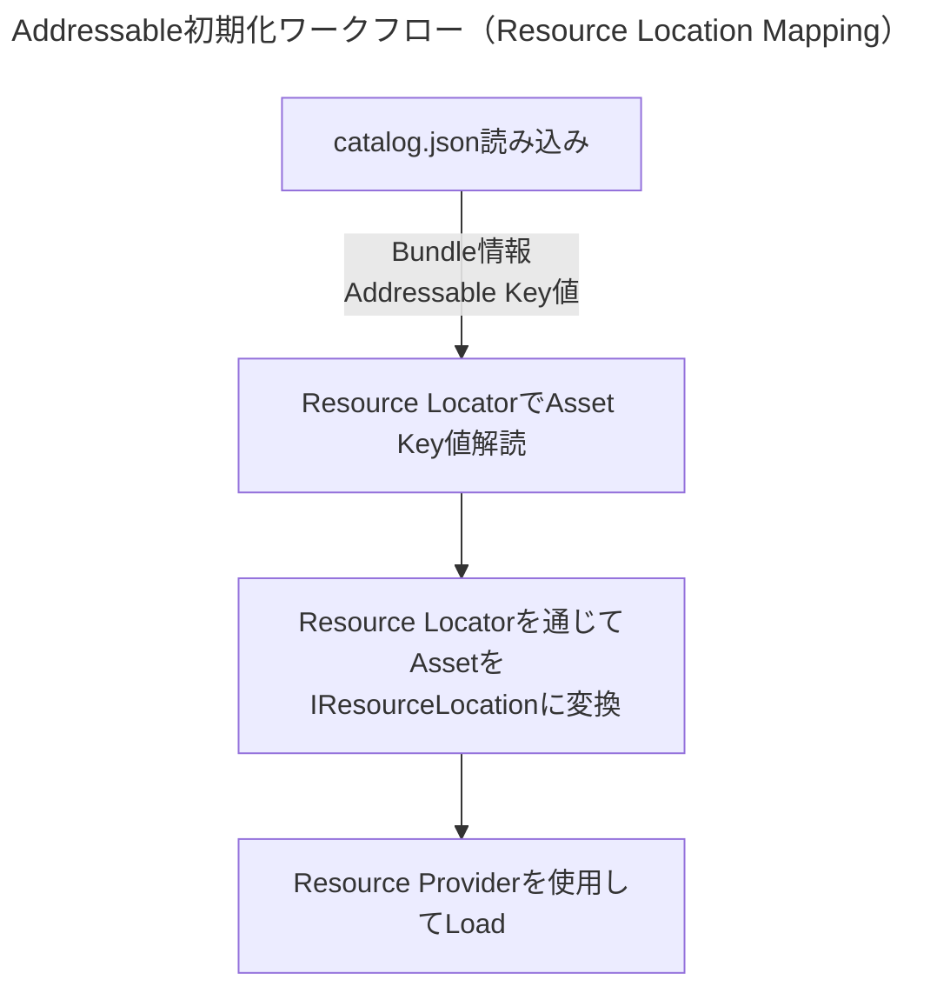

## 目次

> [Addressables とは？](#addressables-とは)      
> [Addressable Group の作成とアセット参照](#addressable-group-の作成とアセット参照)     
> [Addressable のロード/アンロードとメモリ構造](#addressable-のロードアンロードとメモリ構造)     
> [Unity は AssetBundle をどう識別するのか？](#unity-は-assetbundle-をどう識別するのか)  
> [Addressable API (Script)](#addressable-api-script)  
> [Addressable Tool - Event Viewer](#addressable-tool---event-viewer)  
> [Addressable の核心ファイル](#addressable-の核心ファイル)  

---

## Addressables とは？

- **Addressable Asset System** のことで、実行時にリソースファイルをアプリビルドを経由せず、リソースビルドのみを通じてアップデート（ダウンロード）できるようにするシステムです。
- また、メモリ効率や利便性がAssetBundleに比べて優れています。重複依存性の解決や、AssetBundleを丸ごとロードしない点などが挙げられます。

{: : width="300" .normal }      
_アドレッサブルバンドルとアセットの構造_

<br>

- **Resources, AssetBundle, Addressable の比較**
- 従来の **Resources** は、アプリビルド時にアプリの容量に含まれる形態でした。これではアプリの容量が大きくなり、起動時のロード時間も長くなります。
- **AssetBundle** の場合、先述した重複依存性により、バンドルAとBで同じテクスチャを使用する場合、AとBの両方でメモリに常駐させてしまう（つまり二重にロードする）問題が発生します。
- 一方、 **Addressables** はすべてのアセットをバンドルとしてグループ化して重複依存性を解決し、実行時にカタログを比較して更新されたバンドルをダウンロードできます。アセットロード時には `Resources.Load` の代わりに `LoadAssetAsync` などを使用して非同期的にハンドラを通じてロードできます。

<br>

- Addressableは内部的には依然としてAssetBundle単位でグルーピングして使用しています。
- AssetBundleをエディタレベルでラッピングすることで、Addressable Group -> AssetBundle への変換時に様々なカスタマイズが可能です。
- AssetBundleの最大の欠点であった依存性の問題（重複参照）を解決するように設計されています。

<br>
<br>

## Addressable Group の作成とアセット参照

- まず、パッケージマネージャーから **Addressables** パッケージをインストールする必要があります。（現在のバージョン '1.21.19'）

{: : width="800" .normal }

<br>

- インストールが完了したら、Addressable関連の主要な2つのポイントを把握しておきましょう。
1. **Addressable Groups**（パス：Window - Asset Management - Addressables - Groups）
2. **Addressable Folder**

{: : width="600" .normal }     
_Addressable Groups のパス_

<br>

{: : width="800" .normal }      

- 初めてAddressableを導入すると、グループウィンドウは上記の状態になります。 **Create Addressables Settings** をクリックします。
- すると、Assetsフォルダ内にAddressable関連の設定とスキーマを設定するScriptable Objectとフォルダ構造が生成されます。

{: : width="800" .normal }      

<br>

- そしてAddressable Groupsを見ると、 **Default Local Group** というグループが生成されたことが確認できます。

{: : width="800" .normal }

> **ここで押さえておくべき点**     
> Addressable Groupという概念はエディタ上でのみ有効な概念です。Addressable Groupはバンドルだと考えれば良いでしょう。各種プレハブ、マテリアル、テクスチャ、画像、サウンド、アニメーション、アニメーター、メッシュなどのアセットを、各Addressを持つキー値としてバンドルに従属させ、Addressableビルド時にバンドルファイルとして圧縮（LZ4, LZMAなど）します。     
{: .prompt-info}

<br>

- Projectフォルダでアセットをクリックすると、インスペクターウィンドウにAddressableに登録できるチェックボックスが表示されます。

{: : width="800" .normal }

{: : width="800" .normal }
_チェックするとAddressable Groupに自動的に登録されます_

<br>

- チェックを入れると、自動的に Default Local Group の下位に登録されます。
- Addressable Nameがキー値となるため、単純化することをお勧めします。Addressable Groupを直接右クリックしてネーミングを単純化する機能もあります。
> {: : width="800" .normal }

<br>

- ここで Default Local Group の Build & Load Path はデフォルトで 'Local' に設定されています。
> {: : width="800" .normal }
>      
> 詳細は後日、Addressableリモートビルドの記事で扱う予定です。

<br>

> ここで非常に重要なポイントは、Addressableロードの対象となるアセットが従属するグループを分離する構造を設計することです。（バンドリング）         
> グループ（以下バンドル）を分離する際、あまりに細かく分離（Pack Separately）しすぎるとバンドルの数が増え、バンドルのメタデータのサイズが線形に増加する原因になります。      
> また、アセットバンドルメタデータのメモリオーバーヘッドが頻繁に発生することになります。
> かといって、あまりに大きくまとめてしまうと、バンドルの重複依存性の問題や、使用していないアセットのメモリが解放されない問題が発生します。     
{: .prompt-tip}

<br>

- したがって、プロジェクトに合わせて柔軟なバンドル分離構造を設計する必要があります。
> Toyverseの場合：UI Prefab, Sprite(UI), Sprite(Sticker), Clip Prefab, Character Prefab, Animation, Animator, Data Table, Sound, Particle System, Scene(Lighting Data, Light map, Scene Asset), Texture, Material...

- ドラッグ＆ドロップでアセットを希望のバンドルに移動させることができます。

{: : width="800" .normal }
_グループは右クリック - Create New Group - Packed Asset で生成できます_

<br>
<br>

## Addressable のロード/アンロードとメモリ構造

- Addressableバンドルに属しているアセットは、個別に **参照カウント（Reference Count）** 値を持ちます。これはC#のGarbage Collectionにおける参照カウントと同じ概念です。
- Addressable APIを通じてバンドルに登録したアセットのキー値を「ロード」すると、そのバンドルのメタデータと共にアセットの参照カウントが増加します。
- この参照カウントが1以上であれば、そのアセットは使用中と判定され、アセットを含むバンドルのメタデータとアセットがメモリにロードされ維持されます。
- 特にバンドルからアセットをロードするたびに、バンドルのメタデータをロードする必要があります。（バンドルに含まれるアセットが多いほど、このメタデータは大きくなります。）

> **バンドルのメタデータとは？**     
> メタデータの一部には、バンドルのすべてのアセットがリストアップされた情報が含まれています。     
>      
> ここで、アセットとUnityオブジェクトの違いを確認しておきましょう。      
> **アセットはディスク上のファイル**です（PNG, JPG...）。一方、**UnityエンジンオブジェクトはUnityがシリアライズしたデータの集合**です（Sprite, Mesh, Texture, Material...）。    
> そのため、Unityにアセットを追加するとインポート（Importing）の過程を経ることになります。この過程でアセットをプラットフォームに合わせて適切なオブジェクトに変換します。     
> この過程は時間がかかるため、ライブラリにアセットのインポート結果が単一バイナリファイルとしてシリアライズされ、キャッシュされて保存されます。    
> **したがって、アセットバンドルは原本ファイルではなく、Unityで使用できるように「シリアライズ」されたオブジェクト**です。 -> これがAddressable Group（バンドル）がScriptable Objectとして保存される理由かもしれません。    
>      
> Addressableロード -> アセットバンドルから該当キーを持つアセットのヘッダー情報をロード＆リクエスト -> アセットバンドルメタデータロード... これらの過程がすべてメモリを消費します。     
> また、ロードされたアセットバンドル内のアンロードされたアセットでは、ランタイム時にごくわずかなオーバーヘッドが発生します。     
> その証拠として、Unityメモリプロファイラーでキャプチャすると、アセットバンドルメタデータのメモリオーバーヘッドを確認できます。     
>     
> [より詳細はAddressableメモリ構造の記事を参照してください](https://epheria.github.io/posts/UnityAddressableMemory/#addressable-loading-process)
>       
> {: : width="800" .normal }
{: .prompt-tip}

<br>

- より直感的に理解するために、次の図を見てみましょう。

{: : width="800" .normal }

- Bundle AにAsset1, Asset2, Asset3があるとします。Asset2とAsset3をそれぞれロードし、2つのアセットの参照カウントが1になりました。
- ここでBundle Aの参照カウントは2になります。

<br>

{: : width="800" .normal }

- その後、Asset3をアンロードするためにReleaseをすると、Asset2の参照カウントは1、Bundle Aの参照カウントは1になります。

- ここでAsset3をReleaseしてアンロードをスクリプトで明示的に実行しても、Asset3はアンロードされず、つまりメモリから降りません。
- つまり、アセットが参照されなくなったからといって（プロファイラーでも非アクティブ状態で表示されても）、Unityがそのアセットを直ちにアンロードした！という意味ではないのです。
- **まとめると、アセットバンドルの一部コンテンツ（アセット）はロードできますが、アセットバンドルの一部をアンロードすることはできません！**
- アセットバンドルがアンロードされるまで、Bundle Aにあるアセットはアンロードされません。

<br>

- しかし、このルールには **例外** も存在します。
1. エンジンインターフェースである `Resources.UnloadUnusedAssets` メソッドを使用すると、上記のAsset3が即座にアンロードされます。この方法は処理速度が遅くなるため、非同期処理するか注意して使うこと！また、プロファイラー上の参照カウントは維持されていますが、メモリ的にはアンロードされています。[関連リファレンス参照](https://docs.unity3d.com/Packages/com.unity.addressables@1.21/manual/MemoryManagement.html)
2. あるいは、シーンをロードする時（シーン遷移）に `UnloadUnusedAssets` が自動的に呼び出され、ロードされたアセットバンドルのアンロードされたアセットをアンロードさせます。

<br>

{: : width="800" .normal }

- 例外処理をせずにAsset2をReleaseすると、ようやくAsset2の参照カウントは0、Bundle Aの参照カウントは0になり、
- メモリからアンロードされます。

<br>

- さて、私たちはバンドルのアセットを部分的にアンロードさせても、該当アセットとバンドルメタデータがアンロードされないという盲点を発見しました。
- したがって、先ほど言及したバンドリング（Addressableバンドル分離構造の設計）が非常に非常に重要であることに気づきました！
- [Addressableバンドリング戦略リファレンス](https://blog.unity.com/engine-platform/addressables-planning-and-best-practices)を参照して、プロジェクトに合った設定（チートシートもあります）を適用してみましょう。

<br>
<br>

## Unity は AssetBundle をどう識別するのか？

- Addressableシステムは内部的にAssetBundleを使用しているため、Unityがどのようにアセットバンドルを識別しているかを知る必要があります。
- アセットバンドルには固有の **Internal ID** が存在します。（Unique Internal ID）
- このUnique Internal IDのおかげで、Unityでは重複するアセットバンドルのロードを許可しません。したがって、全く同じアセットバンドルを2回ロードしようとすると内部的にエラーが発生します。
- ここで問題が発生します。もし同じバンドル（同じInternal ID）に対してアップデートが必要な場合、2つのバンドルの中身は違っても同じInternal IDであるため、重複ロードを許可しないアセットバンドルでエラーが発生します。

- しかし、Addressableでは次の機能を提供します。
> - バンドルビルド時に固有のInternal IDを生成します。（同じバンドルでも以前のバージョンとは異なるInternal ID）     
> - この機能により、Internal IDが変わったアップデートされたバンドルは、新しくロードされることに成功します。
{: .prompt-info}

<br>
<br>

## Addressable API (Script)

- 次はAddressable APIをスクリプトで使用する方法について見てみましょう。
- "MyCube" というプレハブを Addressable Load -> Instantiate -> Release の順で実行してみましょう。参照カウントも一緒に確認してみます。
> {: : width="800" .normal }


```csharp
using System.Collections;
using System.Collections.Generic;
using Unity.VisualScripting;
using UnityEngine;
using UnityEngine.AddressableAssets;

public class BasicAPITest : MonoBehaviour
{
    IEnumerator Start()
    {
        // 初期化
        // Addressableで参照するアセットバンドルリスト、キー値リストなどの情報をセットアップ
        // 必須であり最優先で呼び出す必要がある
        yield return Addressables.InitializeAsync();


        // アセットロード
        // Reference Count + 1
        var loadHandle = Addressables.LoadAssetAsync<GameObject>("MyCube");
        yield return loadHandle;


        // インスタンス生成
        // Reference Count + 1
        var instantiateHandle = Addressables.InstantiateAsync("MyCube");

        GameObject createdObject = null;
        instantiateHandle.Completed += (result) =>
        {
            createdObject = result.Result;
        };

        yield return instantiateHandle;

        yield return new WaitForSeconds(3);

        // インスタンス削除
        // Reference Count -1
        Addressables.ReleaseInstance(createdObject);
        
        // アセットアンロード
        // Reference Count -1
        Addressables.Release(loadHandle);
    }
}
```

<br>

## Addressable Tool - Event Viewer

- Addressableの参照カウントを確認するには、Addressableが提供するツールである **Event Viewer** を活用すると非常に便利です。
- まず次の設定をオンにしてEvent Viewerを有効化する必要があります。
- また、Event ViewerがdeprecatedになったのでProfilerを見るようにと表示されますが、現在のバージョン（'1.21.19'）基準では無視しても構いません。

{: : width="600" .normal }

{: : width="600" .normal }     
_Asset Management - Addressables - Event Viewer で確認可能_

<br>

- 上記のMyCubeの参照カウントとスクリプトの実行結果を確認してみましょう。

{: : width="800" .normal }   
_参照カウントが増え、MyCubeがロード＆生成された様子_

{: : width="800" .normal }    
_参照カウントが減り、アンロード＆MyCubeが破壊された様子_

<br>

- ここで注意すべき点があります。
- アセットロードとインスタンス生成は別々に考える必要があります。2つを同時に呼び出す必要はありません。あくまで例示用です。

<br>

- また、以下の2つの関数の違いについて説明します。

```csharp
Addressables.LoadAssetAsync<T>("KeyValue")

Addressables.InstantiateAsync("KeyValue")
```

<br>

- **'Addressables.InstantiateAsync'**
- この関数は主に「非同期化」のために使用されます。特に複数の場所で生成が行われ、ハンドラの解除タイミングを設定するのが曖昧な場合に主に使用されます。
- また、私たちが一般的に使用するMonoBehaviourのInstantiateよりもオーバーヘッドが大きくなります。
- この関数はオブジェクトを一緒に生成し、一緒にリリースするため、ローカル変数に必ず保持しておき、後でリリースする必要があります。
- 必ず明示的に `Addressables.ReleaseInstance` を使用して、生成したオブジェクトインスタンスを解除する必要があります。
- 特に注意すべき点は、リリース時にオブジェクトも一緒に破壊されるという点です。
- ちなみに、この関数で生成されたオブジェクトは、エンジンインターフェースである `Resources.UnloadUnusedAssets` を使用するか、シーン遷移を行うと自動的に解除されます。

```csharp
// 基本的にLoadAssetFromPrimaryKeyを通じてリソースを取得し、InstantiateとReleaseをすることを推奨します。
// ただし、複数の場所で生成が行われ、解除タイミングを設定するのが曖昧な場合、この関数を使用するのが良いでしょう。
// （この関数を通じてオブジェクトを生成すると、基本のInstantiateよりオーバーヘッドが大きいです。）
// この関数で生成されたオブジェクトは、シーン遷移で自動的に解除されます。
// しかし、明示的にReleaseInstantiateAssetを使用してリソースを解除することを推奨します。
public async Task<GameObject> InstantiateAssetFromPrimaryKey(string primaryKey_, Transform parent = null)
{
    var handle = Addressables.InstantiateAsync(primaryKey_, parent);
    await handle.Task;
    return handle.Result;
}

// InstantiateAssetFromPrimaryKeyを通じて生成したオブジェクトのリソースを解除し、オブジェクトを削除する関数
// この関数はアセットの解除だけでなく、これを通じて生成したオブジェクトも削除します。使用時は注意してください。
public void ReleaseInstantiateAsset(GameObject object_)
{
    Addressables.ReleaseInstance(object_);
}
```

<br>

- **'Addressables.LoadAssetAsync'**
- 最も推奨されるAddressableロード方法です。この方法は最高の制御力とパフォーマンスを提供します。
- 手動でhandlerを受け取り、`handler.Result` を通じてT型のタイプで受け取って各種処理（Instantiateなど）を行えば良いです。
- その後、handlerをReleaseするだけで済みます。（Dictionaryのような非線形構造を通じてハンドラをReleaseする処理）
- キー値を参照してバンドル内にあるアセットをロードします。

```csharp
public async Task<AsyncOperationHandle<T>> LoadAssetFromPrimaryKey<T>(string primaryKey_)
{
    var handle = Addressables.LoadAssetAsync<T>(primaryKey_);
    await handle.Task;
    switch (handle.Status)
    {
        case AsyncOperationStatus.Succeeded:
            return handle;
        case AsyncOperationStatus.Failed:
        {
            Debug.LogError(handle.OperationException.Message);
            throw new ArgumentOutOfRangeException();
        }
        case AsyncOperationStatus.None:
        default:
            Debug.LogError("[ AddressableManager / LoadAssetFromPrimaryKey ] handle status is none");
            throw new ArgumentOutOfRangeException();                    
    }
}

public void ReleaseAsset<T>(AsyncOperationHandle<T> handler)
{
    if (handler.IsValid())
        Addressables.Release(handler);    
}
```

<br>

#### Addressable Scene Load API

- Addressableのもう一つの強力な機能として、バンドル化されたシーンをロードできます。
- Additive Scene（加算ロード）として使用可能です。

```csharp
/// <summary>
/// Addressableを使用してシーンをロードする。
/// </summary>
/// <param name="sceneName_">ロードするシーンの名前</param>
/// <param name="loadMode_">ロード方式 (single / additive)</param>
/// <param name="activeOnLoad_">ロード後の初期化有無 / falseの場合、必ずInitializeSceneを呼び出す必要がある。</param>
/// <returns></returns>
public async UniTask<SceneInstance> LoadSceneFromAddressable(string sceneName_, LoadSceneMode loadMode_, bool activeOnLoad_)
{
    try
    {
        var loadSceneProcess = Addressables.LoadSceneAsync(sceneName_, loadMode_, activeOnLoad_);
        await loadSceneProcess;
        if (!activeOnLoad_)
        {
            await loadSceneProcess.Result.ActivateAsync();
        }

        return loadSceneProcess.Result;
    }
    catch (Exception err)
    {
        await Managers.UIMgr.ShowErrorModal(err.Message);
    }

    return default;
}
```

<br>
<br>

## Addressable の核心ファイル

- Addressableのビルドパイプラインについては、今後の記事でより詳しく扱います。
- まずは簡単にAddressable GroupからローカルAddressableビルドを実行してみましょう。

<br>

- ビルドを行う前に、次の設定を無効にする必要があります。
- `AddressableAssetSettings` というScriptable Objectをクリックしてインスペクターを見ると、
> {: : width="800" .normal }    

- **Build Addressables on Play** というオプションがありますが、これを **Do not Build Addressables content on Player build** に変更します。
> {: : width="600" .normal }    

- このオプションは、アプリビルド（Player Settings - Build）を通じてUnityプロジェクトをビルドする際に、Addressableビルドも一緒に実行するかどうかを選択するオプションです。
- 今後、ビルドはRemoteを通じてJenkinsでリモートビルドを実行するため、オフにしておきましょう。

<br>

{: : width="800" .normal }    

- Addressable Groupの上部ツールバーで Profile: Default, Build - New Build - Default Build Script を押してAddressableローカルビルドが可能です。（エディタ用）

<br>

- ビルドが完了したら、Play Mode Script で **Use Existing Build** を選択して、AndroidでAddressableをダウンロードしたりロードしたりする環境と同様に構成できます。
- **Use Asset Database** はエディタモードです。

{: : width="400" .normal }    

<br>

- Addressableの核心ファイルを把握するために、ローカルプロジェクトフォルダに入ってみましょう（ビルド設定プラットフォームによってAndroid, iOSに分けて保存されます）。
> YourProjectName/Library/com.unity.addressables/aa/Android

<br>

- パスを辿っていくと、次のようなファイル構造を確認できます。

{: : width="800" .normal }    

<br>

- さらに詳しく見ると、Androidフォルダ内部にバンドルファイルが2つ生成されましたが、これはUnityエディタのAddressable Groupの名前と同じように生成されるはずです。
> Default Local Group, Prefabs...      
>     
> {: : width="800" .normal }    


- そして、Unity自体のbuilt-in shaderバンドルファイルが標準で搭載されています。この部分は今後、Addressable最適化において非常に重要なポイントになります。

<br>

- Addressableビルド時に生成される最も重要なファイルが2つあります。それが **settings.json** と **catalog.json** ファイルです。
- まず、Addressable初期化ワークフローを確認する必要があります。

<br>



<br>

#### settings.json

{: : width="800" .normal }    
_settings.json を json viewer で階層確認した様子_

- `settings.json` ファイルは、Addressableビルドを行うと生成されるバンドルファイルの情報リストである `catalog.json` のパスと Internal ID などを記録しておきます。
- そして Addressable API でシステムを初期化する `Addressables.InitializeAsync()` 関数を実行する際、この `settings.json` ファイルを参照して `catalog.json` ファイルの位置を探して取得します。

<br>

#### catalog.json

{: : width="1000" .normal }    
_catalog.json を json viewer で階層確認した様子_

- `catalog.json` ファイルも同様に、`m_internalIds` 配列を開くとバンドルファイルのパスが入っていることを確認できます。
- Addressableはカタログファイルを読み込んだ後、ここに書かれている値を基にバンドルファイルのパスを知ることができるのです。

<br>
<br>

#### ResourceLocator, ResourceLocation, ResourceProvider

- `Addressables.InitializeAsync` が呼び出されると、初期化時に内部で `catalog.json` ファイルを読み込みます。
- その後、内部的にキー値を通じて実際のアセットをロードできるように、いくつかの初期化作業を行います。
- ここで **ResourceLocation, ResourceLocator, ResourceProvider** という3つの概念について見てみましょう。

<br>



<br>

- カタログを読み込んだ後、カタログに書かれているキー値を持ってAddressableシステムは内部的に **Resource Locator** がアセットを `IResourceLocation` 形式に変換します。
- `ResourceLocation` には、AssetをLoadするための依存関係、キー値、どのProviderを使用してLoadするかなどの情報が入っています。

```csharp
namespace UnityEngine.ResourceManagement.ResourceLocations
{
    public interface IResourceLocation
    {
        string InternalId { get; }
        string ProviderId { get; }
        IList<IResourceLocation> Dependencies { get; }
        int Hash(Type resultType);
        int DependencyHashCode { get; }
        bool HasDependencies { get; }
        object Data { get; }
        string PrimaryKey { get; }
        Type ResourceType { get; }
    }
}
```

- `IResourceLocation` 形式に変換された後、実際にアセットをロードする必要がある時に **Resource Provider** を使用します。
- つまり整理すると、アセットのキー値は Resource Locator によって Resource Location に変換され、Addressableはその Location を持って実際の Resource Provider にリクエストしてアセットをロードするフローです。
- この ResourceLocation を活用する部分は、今後の記事で詳しく記述する予定です。（特にRemote Addressableビルド後、アプリ起動時にAddressableをダウンロードする際に必要になります）

<br>
<br>

#### References

[Unity Q&A](https://unitysquare.co.kr/growwith/unityblog/webinarView?id=495&utm_source=facebook-page&utm_medium=social&utm_campaign=kr_unitynews_2403_w4&fbclid=IwAR1HPmSt0lvqK3OcAkn6bUg3WG96mQaOzZUNcMpgalTA9nfxckmOqZKq1fY_aem_Aa3yxpym1h8XGpw_UgmLhyA_Io8b0LwIO2HjAk43iwKst71wFNqe7TkNx5xSJ2f4lHmo8LDrIDRUkVtT8YCKeel6)

[Addressables 公式ドキュメント](https://docs.unity3d.com/Packages/com.unity.addressables@1.21/manual/UnloadingAddressableAssets.html?q=UnloadUnusedAssets)

[Addressables マニュアル翻訳](https://velog.io/@hammerimpact/%EC%9C%A0%EB%8B%88%ED%8B%B0-Addressables-%EB%AC%B8%EC%84%9C-%EB%B2%88%EC%97%AD-4%EC%9E%A5-%EC%96%B4%EB%93%9C%EB%A0%88%EC%84%9C%EB%B8%94%EC%9D%98-%EC%82%AC%EC%9A%A9#%EB%A9%94%EB%AA%A8%EB%A6%AC-%EA%B4%80%EB%A6%AC)
