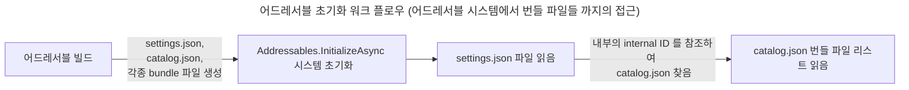
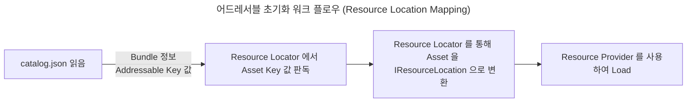

[](https://hits.seeyoufarm.com)

---

## 목차

> [Addressable 이란?](#addressables-이란)      
> [Addressable Group 생성 및 Asset 참조 방법](#addressable-그룹-생성-및-에셋-참조-방법)     
> [Addressable 의 Load/Unload 및 메모리 구조](#addressable-의-로드언로드-및-메모리-구조)     
> [Unity 에서 AssetBundle 을 어떻게 식별할까?](#unity-에서-assetbundle-을-어떻게-식별하는지에-대해)  
> [Addressable API (Script)](#addressable-api)  
> [Addressable Tool - Event Viewer](#event-viewer-사용-방법)  
> [Addressable 핵심 파일](#addressable-핵심-파일)  

---

## Addressables 이란?

- Addressable Asset System 을 의미하며 런타임 시 리소스 파일들을 앱 빌드를 거치지 않고 리소스 빌드만을 통해 업데이트를 다운받을 수 있다.
- 또한 메모리적 효율성이나 이점이 에셋 번들에 비해 월등하다. 중복 종속성 문제 해결이라던가 에셋 번들을 통째로 로드하지 않는 것

{: : width="300" .normal }      
_어드레서블 번들-에셋의 구조_

<br>

- **Resources, AssetBundle, Addressable의 비교**
- 기존의 Resources의 경우 앱 빌드 시 앱의 용량에 포함하는 형태였다. 이렇게 되면 앱의 용량이 커지게 되고 앱 시작 로딩 시간이 늘어난다.
- AssetBundle의 경우 아까 말한 중복 종속성으로 인해 A,B 번들에서 같은 텍스쳐를 사용할 경우 A,B 번들 두 곳에서 메모리에 상주시키는 (즉, 두 번 로드 함) 문제가 발생하게 된다.
- 반면, 어드레서블은 모든 에셋들을 번들로 그룹화하여 중복 종속성을 해결하고 런타임시 카탈로그를 비교하여 업데이트된 번들을 다운로드 받을 수 있으며, 에셋 로드 시 Resources.Load 대신 LoadAssetAsync 등을 사용하여 비동기적으로 Handler 를 통해 에셋들을 로드할 수 있다.

<br>

- Addressable은 내부적으로는 여전히 AssetBundle 단위로 그룹핑하여 사용중이다.
- AssetBundle을 Editor 레벨에서 랩핑함으로서 Addressable Group -> AssetBundle 로의 변환시 여러 커스터마이징이 가능함
- AssetBundle 의 가장 큰 단점이였던 의존성 문제였던 중복 참조 하지 않도록 설계됨

<br>
<br>

## Addressable 그룹 생성 및 에셋 참조 방법

- 우선 패키지매니저에서 Addressables 패키지를 설치 해줘야 한다. 현재 버전 '1.21.19'

{: : width="800" .normal }

<br>

- 설치를 완료했다면 어드레서블 관련 주요 키 포인트 두 가지를 생각해야한다.
1. Addressable Groups 어드레서블 그룹 (경로 : Window - Asset Management - Addressables - Groups)
2. Addressable 폴더

{: : width="600" .normal }     
_어드레서블 그룹 경로_

<br>

{: : width="800" .normal }      

- 최초 어드레서블을 다운 받으면 어드레서블 그룹이 위와 같은 상태가 된다. create addressables settings 를 눌러주면
- 다음과 같이 Assets 폴더 내부에 어드레서블 관련 세팅과 스키마들을 세팅하는 스크립터블 오브젝트와 폴더 구조가 생긴다.

{: : width="800" .normal }      

<br>

- 그리고 어드레서블 그룹을 보면 Default Local Group 이라는 그룹이 생성된것을 확인할 수 있다.

{: : width="800" .normal }

> **여기서 짚고 넘어가야할 부분**     
> 어드레서블 그룹이라는 개념은 에디터에서만 유효한 개념이다. 어드레서블 그룹은 번들이라고 생각하면 된다. 각종 프리팹, 머테리얼, 텍스쳐, 이미지, 사운드, 애니메이션, 애니메이터, 메쉬 등과 같은 에셋들을 번들에 각 Address 를 지니고 있는 키 값으로서 종속시키고 어드레서블 빌드 시 번들파일로 압축(LZ4, LZMA 등)시키게 된다.     
{: .prompt-info}

<br>

- Project 폴더에서 에셋을 클릭하면 인스펙터창에 어드레서블에 등록할 수 있는 체크박스를 발견할 수 있다.

{: : width="800" .normal }

{: : width="800" .normal }
_체크 하면 어드레서블 그룹에 자동으로 등록됨_

<br>

- 체크박스를 누르면 자동적으로 Default Local Group 그룹의 하위에 등록된다.
- 어드레서블 이름이 곧 키값이므로 단순화 하는것을 추천한다. 어드레서블 그룹을 직접 우클릭하여 네이밍을 단순화하는 기능도 있음
> {: : width="800" .normal }

<br>

- 여기서 Default Local Group 의 Build&Load Path 는 디폴트로 'Local' 으로 설정되어 있다.
> {: : width="800" .normal }
>      
> 자세한 사항은 추후 어드레서블 원격 빌드 쪽에서 다룰 예정     

<br>

> 여기서 매우 중요한 포인트는 어드레서블 로드할 대상이 되는 에셋이 종속되는 그룹을 분리하는 구조를 설계하는 것이다. (번들링)         
> 그룹(이하 번들)을 분리할 때 너무 세세하게 분리하면 번들의 개수가 많아지고 결국 다운로드 과정이 길어지고 용량이 많아지고     
> 그렇다고 너무 한꺼번에 묶어버리면 에셋 번들의 메타데이터가 커져서 어드레서블 로드할 때 메모리 측면에서 부담이 갈 수 있다.     
{: .prompt-tip}

<br>

- 따라서 프로젝트에 맞게 유연한 번들 분리 구조 설계를 가져가야할 필요성이 있다.
> 토이버스의 경우 크게 UI Prefab, Sprite(UI), Sprite(Sticker), Clip Prefab, Character Prefab, Animation, Animator, Data Table, Sound, Particle System, Scene(Lighting Data, Light map, Scene Asset), Texture, Material..

- 드래그앤 드롭으로 에셋들을 원하는 번들에 이동시킬 수 있다.

{: : width="800" .normal }
_그룹은 우클릭 - Create New Group - Packed Asset 을 눌러 생성할 수 있음_

<br>
<br>

## Addressable 의 로드/언로드 및 메모리 구조

- 어드레서블 번들에 속해 있는 에셋들은 개별적으로 **Reference Count** 값을 가진다. 우리가 알고있는 C# 에서 Garbage Collection 의 reference count 와 같은 개념이다.
- 우리가 어드레서블 API 를 통해 번들에 등록한 에셋의 키값을 '로드'하면 해당 번들의 메타 데이터와 함께 에셋의 reference count 가 증가하게 된다.
- 이 reference count 즉 참조 개수가 1이상이면 해당 에셋은 사용 중으로 판정하고 에셋을 포함하는 번들의 메타데이터와 에셋이 메모리에 로드되어 유지된다.
- 특히 번들에서 에셋을 로드할 때 마다 번들의 메타데이터를 로드해야한다. (번들에 포함된 에셋이 많을수록 이 메타데이터가 커진다.)

> **번들의 메타데이터란?**     
> 메타데이터의 일부에는 번들의 모든 에셋이 나열된 리스트 정보가 포함되어 있다.     
>      
>      
> 여기서 에셋과 유니티 오브젝트의 차이점을 짚고 넘어가자.      
> **에셋은 디스크상의 파일**이다. (PNG, JPG, ...) 반면 **유니티 엔진 오브젝트는 유니티가 Serialize 한 데이터의 모음**이다.(Sprite, Mesh, Texture, Material..)    
> 이런 이유로 우리가 유니티에 에셋을 추가하면 Importing 하는 과정을 거치게 되는 것이다. 이 과정에서 에셋을 플랫폼에 맞게 적절한 오브젝트로 컨버팅을 진행한다.     
> 이 과정은 오래 걸리기 때문에 라이브러리에 에셋의 임포트 결과가 단일 바이너리 파일로 Serialize 되어 캐싱되어 저장된다.    
> **따라서 에셋 번들은 원본 파일이 아니고 유니티에서 쓸 수 있도록 'Serialize'된 오브젝트**이다. -> 이게 어드레서블 그룹(번들)이 스크립터블 오브젝트로 저장되는 이유일까?    
>      
>     
> 어드레서블 로드 -> 에셋 번들에서 해당 키값을 지닌 에셋에 대한 헤더 정보 로드 및 요청 -> 에셋 번들 메타데이터 로드.. 이런 과정이 전부 메모리를 잡아먹는것     
> 또한 로드된 에셋 번들의 언로드된 에셋에서는 런타임 시 아주 적은 오버헤드가 발생한다.     
> 그 증거로 유니티 메모리 프로파일러로 캡쳐하면 에셋 번들 메타데이터의 메모리 오버헤드를 확인할 수 있다.     
> {: : width="800" .normal }
{: .prompt-tip}

<br>

- 좀 더 직관적으로 이해하기 위해 다음 그림을 살펴보자.

{: : width="800" .normal }

- Bundle A 에 Asset1, Asset2, Asset3 있다고 하자. 우리는 Asset2, Asset3 를 각각 로드했고 두 에셋의 reference count가 1이 되었다.
- 여기서 Bundle A 의 reference count 는 2가 된다.

<br>

{: : width="800" .normal }

- 이후 Asset3 를 언로드하기 위해 Release 를 하면 Asset2 의 reference count 는 1, Bundle A의 reference count 는 1이 된다.

- 여기서 Asset3 을 Release 하여 언로드를 스크립트로 명시적으로 실행시켜도 Asset3 는 언로드 즉 메모리에서 내려오지 않게 된다.
- 즉 에셋이 더 이상 참조되지 않는다고 해서(프로파일러에서도 비활성화된 상태로 표시되어도) 유니티가 해당 에셋을 곧바로 언로드했다! 라는 의미는 아니라는 것이다.
- **정리하자면 에셋 번들의 일부 콘텐츠(에셋)는 로드할 수 있지만, 에셋 번들의 일부는 언로드할 수 없다!**
- 에셋 번들이 언로드 될 때 까지 Bundle A 에 있는 에셋은 언로드 되지 않는다.

<br>

- 하지만, 이 규칙의 **예외** 또한 존재한다. 
1. 엔진 인터페이스인 [Resources.UnloadUnusedAssets](https://docs.unity3d.com/kr/Packages/com.unity.addressables@1.21/manual/UnloadingAddressableAssets.html?q=UnloadUnusedAssets) 이 메서드를 사용하면 위의 Asset3 가 즉시 언로드 된다. 이 방법은 작업 속도가 느려지므로 비동기처리 하거나 주의해서 쓸 것! 또한 프로파일러상 레퍼런스 카운트는 계속 유지되어 있으나 메모리적으로는 언로드 되어 있으므로 [관련 레퍼런스 참고요망](https://docs.unity3d.com/kr/Packages/com.unity.addressables@1.21/manual/MemoryManagement.html)
2. 혹은 씬을 로드할 때(씬 전환) UnloadUnusedAssets을 자동으로 호출하여 로드된 에셋 번들의 언로드된 에셋들을 언로드 시킨다.

<br>

{: : width="800" .normal }

- 예외처리를 하지 않고 Asset2 를 Release 하면 그제서야 Asset2 의 레퍼런스 카운트는 0, Bundle A 의 레퍼런스 카운트는 0이 되고
- 메모리에서 언로드하게 된다.

<br>

- 자, 그렇다면 우리는 번들의 에셋을 부분적으로 언로드시켜도 해당 에셋과 번들 메타데이터가 언로드되지 않는다는 맹점을 발견했다.
- 따라서 위에서 언급한 번들링(어드레서블 번들 분리 구조 설계)이 아주아주 매우매우 중요하다는것을 깨닫게 되었다!
- [어드레서블 번들링 전략 레퍼런스](https://blog.unity.com/engine-platform/addressables-planning-and-best-practices)를 참조하여 프로젝트에 알맞는 세팅(치트 시트도 있음)을 적용시켜보자.

<br>
<br>

## Unity 에서 AssetBundle 을 어떻게 식별하는지에 대해

- Addressable 시스템은 내부적으로 Asset Bundle 을 사용하기 때문에 유니티에서 어떻게 에셋 번들을 식별하는지를 알 필요가 있다.
- 에셋 번들에는 고유한 Internal ID 가 존재한다. (Unique Internal ID)
- 이 Unique Internal ID 덕분에 유니티에서 중복되는 에셋 번들 로드를 허용하지 않는다. 따라서 똑같은 에셋 번들을 두 번 로드하려고 하면 내부적으로 에러가 발생한다.
- 여기서 문제가 발생하는데, 만약 같은 번들(같은 internal ID)에 대해 업데이트가 필요할 때 두 번들의 내용물은 다르다 하더라도 같은 internal ID 이기 떄문에 중복 로드를 허용하지 않는 에셋 번들에서 에러가 발생한다.

- 하지만, 어드레서블에서는 다음 기능을 제공한다.
> - Bundle 빌드 시 고유한 Internal ID 를 생성한다. (같은 번들이여도 이전 버전과는 다른 Internal ID)     
> - 이 기능으로 Internal ID 가 달라진 업데이트된 번들은 새로 로드되는데 성공한다.
{: .prompt-info}

<br>
<br>

## Addressable API

- 다음은 어드레서블 API 를 스크립트에서 사용하는 방법에 대해 알아보자.
- "MyCube" 라는 프리팹을 어드레서블 로드 -> Instantiate -> Release 순으로 실행 해보자. 참조 카운트도 같이 확인해보자.
> {: : width="800" .normal }


```csharp
using System.Collections;
using System.Collections.Generic;
using Unity.VisualScripting;
using UnityEngine;
using UnityEngine.AddressableAssets;

public class BasicAPITest : MonoBehaviour
{
    IEnumerator Start()
    {
        // 초기화
        // 어드레서블에서 참조할 에셋 번들 리스트, 키값 리스트 등의 정보를 세팅함
        // 필수적으로 최우선적으로 호출해줘야함
        yield return Addressables.InitializeAsync();


        // 에셋 로드
        // Reference Count + 1
        var loadHandle = Addressables.LoadAssetAsync<GameObject>("MyCube");
        yield return loadHandle;


        // 인스턴스 생성
        // Reference Count + 1
        var instantiateHandle = Addressables.InstantiateAsync("MyCube");

        GameObject createdObject = null;
        instantiateHandle.Completed += (result) =>
        {
            createdObject = result.Result;
        };

        yield return instantiateHandle;

        yield return new WaitForSeconds(3);

        // 인스턴스 삭제
        // Reference Count -1
        Addressables.ReleaseInstance(createdObject);
        
        // 에셋 언로드
        // Reference Count -1
        Addressables.Release(loadHandle);
    }
}

```

<br>

## Event Viewer 사용 방법

- 어드레서블의 reference count 를 확인하려면 어드레서블에서 제공해주는 툴인 Event Viewer 를 활용하면 매우 편하다.
- 우선 다음 설정을 켜줘야 Evnet Viewer 를 활성화 할 수 있다.
- 또한 Event Viewer 가 deprecated 되었다고 Profiler 에서 보라고 뜨는데 현재 버전('1.21.19') 기준으로는 무시해도 된다.

{: : width="600" .normal }

{: : width="600" .normal }     
_Asset Management - Addressables - Event Viewer 에서 확인 가능_

<br>

- 위의 MyCube reference coun와 스크립트의 실행 결과를 확인해보자.

{: : width="800" .normal }   
_참조 카운트가 늘어나고 로드 및 MyCube가 생성된 모습_

{: : width="800" .normal }    
_참조 카운트가 줄어들어 언로드 및 MyCube가 파괴된 모습_

<br>

- 여기서 주의해야할 점이 있다.
- 에셋 로드와 인스턴스 생성은 별개로 생각해야한다. 두 개를 동시에 같이 호출할 필요가 없음. 오로지 예시용이다.

<br>

- 또한 아래 두 가지 함수의 차이점에 대해 설명하겠다.

```csharp
Addressables.LoadAssetAsync<T>("KeyValue")

Addressables.InstantiateAsync("KeyValue")
```

<br>

- **'Addressables.InstantiateAsync'**
- 이 함수는 주로 '비동기화'를 위해 사용되는데 특히 여러곳에서 제작이 이루어지고 핸들러 해제 타이밍을 설정하는게 애매한 경우 주로 사용된다.
- 또한 우리가 일반적으로 사용하는 모노비헤이비어의 Instantiate 보다 오버헤드가 더 크게 발생한다.
- 이 함수는 오브젝트를 함께 생성하고 함께 릴리즈를 하기 때문에 지역변수로 꼭 담아두고 나중에 릴리즈 해줘야한다.

- 꼭 명시적으로 'Addressables.ReleaseInstance' 를 사용하여 생성한 오브젝트 인스턴스를 해제 해주어야 한다.
- 특히 주의할 점은, 릴리즈 시 오브젝트도 같이 파괴된다는 점이다.
- 참고로 해당 함수로 생성된 오브젝트는 엔진 인터페이스인 'Resources.UnloadUnusedAssets' 을 사용하거나 씬 전환을 하면 자동으로 해제된다.

```csharp
        /// 기본적으로 LoadAssetFromPrimaryKey를 통해 리소스를 얻어와 Instantiate와 Release를 하는것을 권장합니다.
        /// 다만, 여러곳에서 제작이 이루어지고 해제 타이밍을 설정하는게 애매한 경우 해당 함수를 사용하는 것이 좋습니다.
        /// (이 함수를 통해 오브젝트를 생성할 시 기본 Instantiate보다 오버헤드가 더 큽니다.)
        /// 해당 함수로 생성된 오브젝트는 씬 전환에서 자동으로 해제됩니다.
        /// 하지만 명시적으로 ReleaseInstantiateAsset를 사용해 리소스를 해제할 것을 권장합니다.
       public async Task<GameObject> InstantiateAssetFromPrimaryKey(string primaryKey_, Transform parent = null)
        {
            var handle = Addressables.InstantiateAsync(primaryKey_, parent);
            await handle.Task;
            return handle.Result;
        }

        /// InstantiateAssetFromPrimaryKey를 통해 생성한 오브젝트의 리소스를 해제하고 오브젝트를 삭제하는 함수
        /// 해당 함수는 에셋의 해제뿐 아니라 이를 통해 생성한 오브젝트도 삭제합니다. 사용시 주의 바랍니다.
        public void ReleaseInstantiateAsset(GameObject object_)
        {
            Addressables.ReleaseInstance(object_);
        }

```

<br>

- **'Addressables.LoadAssetAsync'**
- 가장 권장되는 어드레서블 로드 방법이다. 이 방법은 최고의 제어력과 성능을 제공한다. 
- 수동으로 handler를 받아놓고 handler.Result 를 통해 T 형태의 타입으로 받아와서 각종 처리(Instantiate 등)를 진행해주면된다.
- 이후 handler를 Release 해주기만 하면 된다. (딕셔너리 같은 비선형적 구조를 통해 핸들러들을 Release 해주는 처리)
- 키값을 참조하여 번들안에 있는 에셋을 로드한다.

```csharp

        public async Task<AsyncOperationHandle<T>> LoadAssetFromPrimaryKey<T>(string primaryKey_)
        {
            var handle = Addressables.LoadAssetAsync<T>(primaryKey_);
            await handle.Task;
            switch (handle.Status)
            {
                case AsyncOperationStatus.Succeeded:
                    return handle;
                case AsyncOperationStatus.Failed:
                {
                    Debug.LogError(handle.OperationException.Message);
                    throw new ArgumentOutOfRangeException();
                }
                case AsyncOperationStatus.None:
                default:
                    Debug.LogError("[ AddressableManager / LoadAssetFromPrimaryKey ] handle status is none");
                    throw new ArgumentOutOfRangeException();                    
            }
        }

        public void ReleaseAsset<T>(AsyncOperationHandle<T> handler)
        {
            if (handler.IsValid())
                Addressables.Release(handler);    
        }
```

<br>

#### Addressable Scene Load API

- 어드레서블의 또 다른 강력한 기능으로 번들화된 씬을 로드할 수 있다.
- Additive Scene 으로 사용 가능하다.

```csharp
/// <summary>
        /// 어드레서블을 사용해 씬을 로드한다.
        /// </summary>
        /// <param name="sceneName_">로드할 씬의 이름</param>
        /// <param name="loadMode_">로드 방식 (single / additive)</param>
        /// <param name="activeOnLoad_">로드 후 초기화 여부 / false일 경우 반드시 InitializeScene를 호출하여야 한다.</param>
        /// <returns></returns>
        public async UniTask<SceneInstance> LoadSceneFromAddressable(string sceneName_, LoadSceneMode loadMode_, bool activeOnLoad_)
        {
            try
            {
                var loadSceneProcess = Addressables.LoadSceneAsync(sceneName_, loadMode_, activeOnLoad_);
                await loadSceneProcess;
                if (!activeOnLoad_)
                {
                    await loadSceneProcess.Result.ActivateAsync();
                }

                return loadSceneProcess.Result;
            }
            catch (Exception err)
            {
                await Managers.UIMgr.ShowErrorModal(err.Message);
            }

            return default;
        }
```

<br>
<br>

## Addressable 핵심 파일

- 어드레서블의 빌드 파이프라인에 대해서는 더 자세히 추후 포스트에서 다루도록 하겠다.
- 우선 간단하게 어드레서블 그룹에서 로컬 어드레서블 빌드를 실행해보자.

<br>

- 빌드를 진행하기 전 다음 세팅을 비활성화 해줘야한다.
- 'AddressableAssetSettings' 라는 스크립터블 오브젝트를 클릭하여 인스펙터를 보면
> {: : width="800" .normal }    

- Build Addressables on Play 라는 옵션이 있는데, 이것을 Do not Build Addressables content on Player build 로 바꿔준다.
> {: : width="600" .normal }    

- 이 옵션은 앱 빌드, 즉 플레이어 세팅 - 빌드를 통해 유니티 프로젝트를 빌드 할 때 어드레서블 빌드도 같이 실행할지 말지를 선택하는 옵션이다.
- 앞으로 빌드는 Remote 를 통해 Jenkins 로 원격빌드를 실행할 것이므로 꺼두자.

<br>

{: : width="800" .normal }    

- 어드레서블 그룹의 상단 툴바에서 Profile : Default, Build - New Build - Default Build Script 를 눌러 어드레서블 로컬 빌드가 가능하다. (에디터용)

<br>

- 빌드가 완료 되었다면, Play Mode Script 에서 Use Existing Build 를 선택하여 안드로이드에서 어드레서블을 다운받거나 로드하는 환경과 비슷하게 꾸밀 수 있다.
- Use Asset Database 는 에디터 모드

{: : width="400" .normal }    

<br>

- 어드레서블의 핵심 파일을 파악하기 위해 로컬 프로젝트 폴더로 들어가주자 (빌드 세팅 플랫폼에 따라 Android, iOS 로 따로 저장됨)
> YourProjectName/Library/com.unity.addressables/aa/Android

<br>

- 경로를 따라 들어가면 다음과 같은 파일 구조를 확인할 수 있다.

{: : width="800" .normal }    

<br>

- 더 자세히 살펴보면, Android 폴더 내부에 번들 파일이 두 개 생성되었는데 이는 유니티 에디터 어드레서블 그룹의 이름과 똑같이 생성될 것이다.
> Default Local Group, Prefabs ...      
>     
> {: : width="800" .normal }    


- 그리고 유니티 자체 built in shader 번들 파일이 기본적으로 탑재되어 있다. 이 부분은 추후 어드레서블 최적화에서 아주 중요한 포인트가 된다.

<br>

- 어드레서블 빌드 시 생성되는 가장 중요한 파일 두 개가 있는데 바로 **settings.json, catalog.json** 파일이다.
- 우선 어드레서블 초기화 워크 플로우를 확인해야할 필요가 있다.

<br>



<br>

#### settings.json

{: : width="800" .normal }    
_settings.json 을 json viewer 를 통해 하이아라키로 확인한 모습_

- settings.json 파일은 우리가 어드레서블 빌드를 하게 되면 생성되는 번들 파일들의 정보 리스트인 catalog.json 의 경로와 Internal ID 등을 이 파일안에 기록해놓는다.
- 그리고 Addressable API 에서 어드레서블 시스템을 초기화하는 'Addressables.InitializeAsync()' 함수를 실행할 때 이 settings.json 파일을 참조하여 catalog.json 파일의 위치를 찾아서 가져온다.

<br>

#### catalog.json

{: : width="1000" .normal }    
_catalog.json 을 json viewer 를 통해 하이아라키로 확인한 모습_

- catalog.json 파일도 마찬가지로 m_internalIds 어레이를 열면 번들 파일들의 경로가 들어가 있는 것을 확인할 수 있다.
- 어드레서블은 카탈로그 파일을 읽어들인 다음 여기 적혀있는 값들을 토대로 번들 파일들의 경로를 알 수 있게 되는 것이다.

<br>
<br>

#### ResourceLocator, ResourceLocation, ResourceProvider

- 어드레서블 InitializeAsync 가 호출이 되면 초기화 될 때 내부에서 catalog.json 파일을 읽어 들인다.
- 이후 내부적으로 키값을 통해 실제 asset 들을 로드할 수 있게 몇 가지 초기화 작업을 진행한다.
- 여기서 **ResourceLocation, ResourceLocator, ResourceProvider** 이 세 가지 개념에 대해 알아보자.

<br>



<br>

- 카탈로그를 읽어들인 후 카탈로그에 적혀 있는 키값들을 가지고 어드레서블 시스템은 내부적으로 Resource Locator가 에셋들을 IResourceLocation 형태로 변환한다.
- ResourceLocation 에는 Asset을 Load 하기 위한 의존성 관계, 키 값, 어떤 Provider 를 사용해서 Load 할지 등에 대한 정보가 들어있다.

```csharp
namespace UnityEngine.ResourceManagement.ResourceLocations
{
    public interface IResourceLocation
    {
        string InternalId { get; }
        string ProviderId { get; }
        IList<IResourceLocation> Dependencies { get; }
        int Hash(Type resultType);
        int DependencyHashCode { get; }
        bool HasDependencies { get; }
        object Data { get; }
        string PrimaryKey { get; }
        Type ResourceType { get; }
    }
}
```

- IResourceLocation 형태로 변환된 후 실제로 에셋을 로드해야 될 때 Resource Provider 를 사용한다.
- 즉, 정리하자면 에셋의 키값은 Resource Locator 에 의해서 Resource Location 으로 변환이 되고 어드레서블은 해당 Location 을 가지고 실제 Resource Provider 에게 요청을 해서 실제 에셋을 로드하는 플로우이다.
- 이 ResourceLocation 을 활용하는 부분은 추후 포스트에서 자세히 기술할 예정이다. (특히 Remote 어드레서블 빌드 후 앱 기동 시 어드레서블 다운로드 시 필요함)

<br>
<br>

#### References

[Unity Q&A](https://unitysquare.co.kr/growwith/unityblog/webinarView?id=495&utm_source=facebook-page&utm_medium=social&utm_campaign=kr_unitynews_2403_w4&fbclid=IwAR1HPmSt0lvqK3OcAkn6bUg3WG96mQaOzZUNcMpgalTA9nfxckmOqZKq1fY_aem_Aa3yxpym1h8XGpw_UgmLhyA_Io8b0LwIO2HjAk43iwKst71wFNqe7TkNx5xSJ2f4lHmo8LDrIDRUkVtT8YCKeel6)

[어드레서블 공식 문서](https://docs.unity3d.com/kr/Packages/com.unity.addressables@1.21/manual/UnloadingAddressableAssets.html?q=UnloadUnusedAssets)

[어드레서블 공식 문서 한글 번역2](https://velog.io/@hammerimpact/%EC%9C%A0%EB%8B%88%ED%8B%B0-Addressables-%EB%AC%B8%EC%84%9C-%EB%B2%88%EC%97%AD-4%EC%9E%A5-%EC%96%B4%EB%93%9C%EB%A0%88%EC%84%9C%EB%B8%94%EC%9D%98-%EC%82%AC%EC%9A%A9#%EB%A9%94%EB%AA%A8%EB%A6%AC-%EA%B4%80%EB%A6%AC)