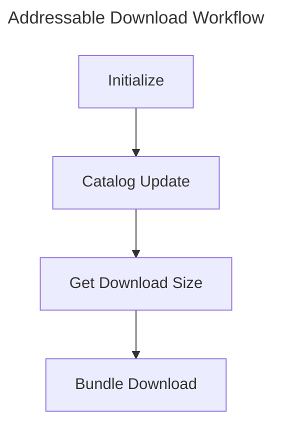

## Table of Contents

> [About Remote Catalog](#about-remote-catalog)     
> [Addressable Profile Setup and Management](#addressable-profile-setup-and-management)      
> [Addressable Label Setup and Management](#addressable-label-setup-and-management)        
> [Addressable Bundling Strategy](#addressable-bundle-mode-and-bundling-strategy)       
> [Addressable Download Workflow](#addressable-download-workflow)        
> [Addressable Update Workflow](#addressable-update-workflow)       

---

<br>
<br>

## About Remote Catalog
---

{: : width="800" .normal }

- In Addressable Bundles, you can set them to **Local** or **Remote**. Local means including the bundle in the app build, while Remote means excluding it from the app and downloading it upon app startup.

<br>

- As explained in the previous post, `settings.json` and `catalog.json` can also be downloaded before receiving bundles.
- In short, **Remote Catalog** refers to a catalog not included in the app, which is fetched via download.

<br>

- The purpose of using a Remote Catalog is to enable asset updates solely through an Addressable build, without rebuilding the app.
- Specifically, the catalog contains information about the bundle list and compares Internal IDs to decide whether to download a bundle.
- If all assets are included in the app, mobile environments face app size limits, and users must inconveniently update via the App Store or Play Store for every update. (Note: Script changes require recompilation, thus an app build is mandatory.)
- Therefore, resource-side updates like simple data table modifications, adding localization, or adding prefabs can be done via Addressables when users start the app.

{: : width="800" .normal }     
_Working principle of Remote Catalog vs. Locally Cached Catalog (version refers to Resource Version)_

<br>

#### How to Set Up Addressable Remote

- First, click **Addressable Asset Settings** and check the **Catalog -> Build Remote Catalog** option.

{: : width="800" .normal }     

<br>

- Then, change **Build & Load Paths** from Local to **Remote**.
- We will explain Load Path and Profile later.

{: : width="800" .normal }     

<br>

- If you build Addressables, you'll find a `ServerData` folder inside your project folder.

{: : width="800" .normal }     

<br>

- Inside, there's an `Android` folder. This folder structure can be configured via Profiles in Addressable Groups (e.g., iOS, Android).

{: : width="800" .normal }     

<br>

- Inside, you'll see `catalog.json` and `catalog.hash` files.
- The `catalog.hash` file exists to identify the version of the catalog file.
- As mentioned earlier, the client must download the remote catalog first to update the bundles (Settings -> Catalog -> Bundle).
- Thus, the hash value inside the hash file serves as the criterion.

{: : width="600" .normal }     

<br>

> At runtime, Addressables compares the newly downloaded remote catalog with the locally stored catalog to decide whether to replace it.     
> The criterion is the hash value. If the downloaded catalog's hash differs from the local hash, the new catalog is considered the latest and is cached locally. (The existing catalog is deleted.)
{: .prompt-info}

<br>

- If you make slight changes to bundles or assets in the Addressable Group and rebuild...

{: : width="600" .normal }     

- You can see that the hash value has changed.

<br>
<br>

## Addressable Profile Setup and Management
---

- So, how do we receive Addressable bundle files Remotely?
- We use `UnityWebRequest` to download them to the user's phone based on the URL of files or folders uploaded to remote storage like AWS S3, Google Drive, or HFS. (Load)

- An **Addressable Profile** stores information about the **Build Path** and **Load Path** (Remote Storage).
- Let's look at how to set up an Addressable Profile.

<br>

{: : width="600" .normal }     

- Addressable Group -> Select **Profile** in the top toolbar -> Enter **Manage Profiles**.

<br>

{: : width="1000" .normal }     

{: : width="400" .normal }     

- You can create a profile via **Create -> Profile** in the top-left toolbar.
- Clicking **Variable** allows you to create parameter values for all profiles.

{: : width="800" .normal }     

- **Variable Name** is used as the variable name inside Build Path and Load Path.
- **Default Value** is where you enter the actual path (folder or file name).

```console
# Example
[AOS]/[BundleVersion] -> recognized as aos/001
```

<br>

{: : width="1000" .normal }     

- Change the Remote setting to **Custom**, then enter your storage address (AWS S3, HFS, Google Drive, etc.) in `Remote.LoadPath`.

<br>

{: : width="1000" .normal }     

- You can upload manually using FTP programs like Cyberduck (Mac) or WinSCP (Windows).
- Or automate the Build-Upload-Deploy (CI/CD) process using Jenkins and Fastlane.

<br>
<br>

## Addressable Label Setup and Management
---

{: : width="1000" .normal }     

- A **Label** is a tag you can attach to each asset checked as Addressable.
- While you can download all registered assets via Resource Locators,
- It is generally recommended to download Addressable assets via **Labels**.
- Games like *Princess Connect! Re:Dive* or *Uma Musume* implement downloading story animations or character voice packs at runtime. You can achieve similar functionality by separating Labels.

<br>

{: : width="400" .normal }   

- You can assign Labels to assets by selecting checkboxes. (Multiple Labels can be selected)

<br>

{: : width="400" .normal }     

- You can also create and save new Labels by clicking **Manage Labels...**.

<br>

{: : width="400" .normal }     

- If multiple Labels are selected, downloading a bundle with Label A will download Asset1 and Asset2.

<br>

- A question arises here: If Asset1, Asset2, and Asset3 are grouped in the same bundle, how does the download work?
- If they have different Labels within the same bundle, do we download assets separately? Or the whole bundle?
- This is closely related to the Addressable Bundling Strategy, so let's examine it below.

<br>
<br>

## Addressable Bundle Mode and Bundling Strategy
---

- There is an option called **Bundle Mode** to configure how assets in an Addressable Group are packed into bundles.

{: : width="500" .normal }     

<br>

- Bundle Mode consists of three main types: **Pack Together**, **Pack Separately**, and **Pack Together by Label**.
> `Pack Together`: Creates a single bundle containing all assets.     
> `Pack Separately`: Creates a bundle for each primary asset in the group. Sub-assets like sprites in a sprite sheet are packed together. Assets in folders added to the group are also packed together.      
> `Pack Together by Label`: Creates bundles for assets sharing the same combination of labels.

<br>

- So, the answer to the question above is:
- If Asset1, Asset2, and Asset3 are in the same bundle but have different Labels, the **entire bundle is downloaded**.
- Unless you split bundles using **Pack Together by Label**, assume you are downloading the single bundle as a whole.

<br>

#### Setting the Addressable Bundling Strategy

- So, which Bundle Mode should you use?

<br>

- **Pack Together**

- For example, if you register Sword Prefab, BossSwordPrefab, and ShieldPrefab in the same Addressable bundle:

{: : width="800" .normal }     

- You might have noticed that due to AssetBundle characteristics, **partial loading is possible, but partial unloading is not**.
- Even if you load and then unload SwordPrefab and BossSwordPrefab, they are not completely unloaded from memory.
- Unloading only happens when you unload all assets in the bundle or call the expensive CPU operation `Resources.UnloadUnusedAssets()`.

<br>

- **Pack Separately**
- While Pack Together handled all assets in a bundle as one, Separately creates individual bundles for every asset in the group.
- If we assume Sword Prefab, BossSwordPrefab, and ShieldPrefab are registered and set to Pack Separately:
> {: : width="800" .normal }     

<br>

- However, packing with Pack Separately leads to the **Duplicate Dependency** problem.
- Especially if multiple prefabs use the same texture or material, this becomes a terrible decision.

<br>

---
#### How to Solve Duplicate Dependencies

- If you instantiate the three objects above and run memory profiling, it looks like this:

{: : width="800" .normal }     

- Multiple copies of Sword_N and Sword_D textures are displayed. This is the **Duplicate Dependency** issue.

<br>

- We only added 3 sword prefabs, so why are textures taking up memory?
- The reason is that other assets with dependencies on the added prefabs are also included in the bundle.
- Such dependencies (like textures, materials) are **automatically duplicated and added to every bundle that uses them** if they are not explicitly included in another Addressable bundle.

{: : width="800" .normal }     

- Thus, here Sword_N and Sword_D textures are used duplicately in two places, so multiple copies are captured in memory.

<br>

---

#### Addressable Analyze Tool

- Addressables supports a tool to diagnose bundle duplicate dependencies.
- Open **Window - Asset Management - Addressables - Analyze**, select `Analyze Rules` at the top of the hierarchy, and choose `Analyze Selected Rules`.
- Running `Check Duplicate Bundle Dependencies` analyzes assets duplicated across multiple AssetBundles based on the current layout.

{: : width="800" .normal }     
_Analysis shows duplicated textures and meshes between Sword bundles, and the same shader duplicated across all three bundles._

<br>

- This duplication can be resolved in two ways:

1. Place Sword, BossSword, and Shield prefabs in the **same bundle** to share dependencies.
2. Move duplicated assets to a **different Addressable bundle** and include them explicitly.

- Using method 2 results in:

{: : width="800" .normal }     
_Solved by explicitly making the two duplicate textures (Sword_N, Sword_D) into a separate bundle._

<br>

- Additionally, the Analyze tool has a `Fix Selected Rules` option, which automatically fixes problematic assets.
- It creates a new Addressable Group named `Duplicate Asset Isolation` and bundles them there.

{: : width="800" .normal }     

<br>

---
#### Metadata Issues in Large-Scale Projects

- Using the `Pack Separately` bundling strategy in a large-scale game (like an open world) can cause problems.
- Specifically, since every AssetBundle has metadata, **memory overhead** can occur.
> The largest part of this metadata is the file read buffer, which is about 7KB per bundle on mobile platforms.
- [Refer to the Addressable Memory Structure post for details](https://epheria.github.io/posts/UnityAddressableMemory/#1-assetbundle-metadata)

<br>

- **Pack Together by Label**
- Setting this option splits bundling based on the number of Labels used by the assets inside the bundle.
- For example, if you create MainAsset and SubAsset labels, set the Addressable Group to **Pack Together by Label**, and separate assets inside the bundle with two labels:

{: : width="400" .normal }     

<br>

- Upon building, you can see that two bundles are created because there are two labels (1.6MB + 203KB).

{: : width="800" .normal }     

<br>

- The image below is an example of Pack Together (Single Bundle). (1.8MB)

{: : width="800" .normal }     

<br>
<br>

#### Conclusion on Bundling Strategy

- Whether to bundle assets into large bundles or many small bundles has implications either way.

> ***Risks of Too Many Bundles***      
>       
> - Each bundle has [memory overhead](https://docs.unity3d.com/Packages/com.unity.addressables@1.21/manual/MemoryManagement.html). Loading hundreds or thousands of bundles into memory at once can noticeably increase memory usage.      
> - There are concurrency limits when downloading bundles. Especially on mobile, there is a [limit on simultaneous Web Requests](https://epheria.github.io/posts/optimizationAddressable/#addressable-optimization-tips). If there are thousands of bundles, you can't download them all at once -> leading to increased download time.     
>      
> {: : width="400" .normal }       
> _Max Concurrent Web Request option value_      
>     
> - Catalog size can grow due to bundle information. Unity stores string-based info about bundles to download or load catalogs; having thousands of bundle entries can significantly increase catalog size.      
> - Without considering duplicate dependencies, bundling can frequently lead to duplication issues, as explained above.
{: .prompt-info}

<br>

> ***Risks of Too Few Bundles***      
>        
> - `UnityWebRequest` does not resume failed downloads. Therefore, if a large bundle fails downloading due to a disconnect, it restarts from the beginning upon reconnection.      
> - Assets can be loaded individually from a bundle, but **cannot be unloaded individually**. For example, if you load 10 materials from a bundle and release 9 of them, all 10 remain loaded in memory.
{: .prompt-warning}

<br>

- Additionally, large-scale projects like open worlds face these issues:

> **Total Bundle Size**: Unity used to not support files larger than 4GB (e.g., scene files with huge terrains). While solved in newer editors, it's appropriate not to exceed 4GB for best compatibility across all platforms.      
> **Bundle layout at scale**: The balance of memory and performance between the number of AssetBundles and their sizes can vary depending on project size.      
> **Bundle dependencies**: When an Addressable asset is loaded, all its bundle dependencies are also loaded. Beware of duplicate dependencies.      
{: .prompt-info}

<br>

- Using Addressables well can significantly reduce memory usage. Constructing asset bundling well according to the project can make memory saving more effective. 
- Whenever adding assets, consider duplicate dependencies and the bundling strategy carefully.
- It is also recommended to run the Addressable Analyze tool frequently to check for duplicate dependencies and use memory profiling to monitor duplicated assets (especially textures).

<br>
<br>

## Addressable Download Workflow
---

<br>



<br>

#### Catalog Download

- Proceed with download if the Hash values of Remote Catalog and Local Catalog differ.
- `CheckForCatalogUpdates`: Checks if the catalog needs updating.
- `UpdateCatalogs`: Downloads the catalog and caches it locally.

```csharp
    public void UpdateCatalog()
    {
        Addressables.CheckForCatalogUpdates().Completed += (result) =>
        {
            var catalogToUpdate = result.Result;
            if (catalogToUpdate.Count > 0)
            {
                Addressables.UpdateCatalogs(catalogToUpdate).Completed += OnCatalogUpdate;
            }
            else
            {
                Events.NotifyCatalogUpdated();
            }
        };
    }
```

<br>

#### Download Size

- Mandatory because you are obligated to explicitly inform the user how much data needs to be downloaded via a popup.
- You need to know if there are new bundles to download and check local disk space.
- If there's nothing to download, `Download Size` returns 0.

```csharp
    public void DownloadSize()
    {
        Addressables.GetDownloadSizeAsync(LabelToDownload).Completed += OnSizeDownloaded;
    }
```

<br>

#### Bundle Download

- This part actually downloads the bundle by entering a label or looping through ResourceLocators.
- Additionally, if you use `LoadAssetAsync` with a label or asset address and the bundle hasn't been downloaded, it can handle Download -> Load.
- Note: A bug in newer Addressable versions requires you to **Release** the `DownloadHandle` after use to be able to call `LoadAssetAsync`. Otherwise, an error occurs.

```csharp
    public void StartDownload()
    {
        DownloadHandle = Addressables.DownloadDependenciesAsync(LabelToDownload);
        DownloadHandle.Completed += OnDependenciesDownloaded;
        Addressables.Release(DownloadHandle);
    }
```

<br>

#### Addressable Update Processing at Runtime

- It is possible to: Build Addressable Bundles -> Upload to Server (AWS) -> Download from Server (AWS to Local) -> **Update Bundles at Runtime** without closing the app.
- Just enable the `Unique Bundle IDs` option in Addressable Asset Settings.

{: : width="800" .normal }       

- When loading AssetBundles into memory, Unity enforces that two bundles with the same internal name cannot be loaded.
- This creates a limitation for runtime bundle updates. Enabling this option ensures AssetBundles have a Unique Internal ID, allowing new bundles to be loaded at runtime.
- In other words, even if it's the same bundle, because the Internal ID is different, reloading it does not cause a conflict.
- **Note**: If an asset changes, bundles dependent on that asset must also be rebuilt.

<br>
<br>

## Addressable Update Workflow
---

{: : width="800" .normal }       

- **App Version** refers to the application users download from stores (Google Play, App Store) after building the Unity project into APK/IPA files. App updates are required when scripts are modified and recompilation is needed.
- **Resource Version** allows users to receive patches without an app build by updating resources (assets like textures, materials, prefabs, meshes, animation clips) that do not require compilation.

<br>

{: : width="800" .normal }       

- Typically, app builds and Addressable builds are processed via Jenkins jobs.
- Building Addressables uploads bundles and catalogs to AWS S3.

<br>

{: : width="800" .normal }       

- If a resource update is needed, you can create a resource version variable in the Addressable Profile and create multiple resource versions under specific aos/ios folders.
- Updating `Resource002` uploads the catalog and updated bundles to AWS S3. When users patch, they compare catalogs and update to the `Resource002` catalog and bundles.

<br>

{: : width="800" .normal }       

- If a **rollback** is needed, simply change the version value in the Addressable Profile to the version you want to rollback to and proceed with the build. (Only the catalog changes.)
