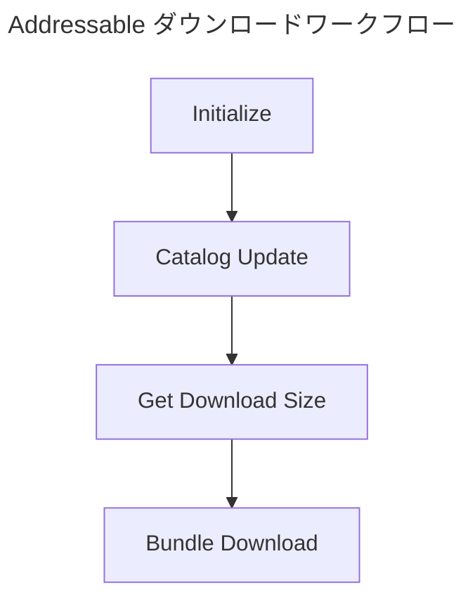

## 目次

> [Remote Catalog について](#remote-catalog-について)     
> [Addressable Profile 設定および管理方法](#addressable-profile-設定および管理)      
> [Addressable Label 設定および管理方法](#addressable-label-設定および管理)        
> [Addressable Bundling Strategy](#addressable-bundle-mode-と-バンドリング戦略について)       
> [Addressable ダウンロードワークフロー](#addressable-ダウンロードワークフロー)        
> [Addressable アップデートワークフロー](#addressable-アップデートワークフロー)       

---

<br>
<br>

## Remote Catalog について
---

{: : width="800" .normal }

- Addressableバンドルには **Local** と **Remote** を設定する部分があります。Localはアプリに該当バンドルを含めるという意味で、Remoteは該当バンドルをアプリから除外し、アプリ起動時にAddressableバンドルをダウンロードするという意味です。

<br>

- 前の記事で説明したように、`settings.json`、`catalog.json` も同様に、バンドルを受け取る前にダウンロードすることができます。
- つまり、 **Remote Catalog** はアプリに含まれていないカタログを意味し、ダウンロードして取得します。

<br>

- Remote Catalogを使用する目的は、アプリのビルドなしに、Addressableビルドのみを通じてアセットのアップデートを可能にするためです。
- 特にカタログ内部にはバンドルリストに関する情報を持っており、Internal IDを比較してバンドルを受け取るかどうかを決定します。
- アプリにすべてのアセットが含まれると、モバイル環境ではアプリ容量制限と共に、ユーザーがアップデートごとにApp StoreやGoogle Playストアでアップデートしなければならない煩わしさがあります。（ただし、スクリプトはコンパイルが必要なため、アプリビルドを行う必要があります）
- したがって、簡単なデータテーブルの修正、ローカライゼーションの追加、プレハブの追加のようなリソース側面のアップデートは、Addressableを通じてユーザーがアプリ起動時にアップデートを行うことができます。

{: : width="800" .normal }     
_Remote CatalogとLocalにキャッシュされたCatalogの動作原理（versionはResource Versionを意味します）_

<br>

#### Addressable Remote 設定方法

- まず、 **Addressable Asset Settings** をクリックして **Catalog -> Build Remote Catalog** オプションにチェックを入れます。

{: : width="800" .normal }     

<br>

- そして **Build & Load Paths** を Local から **Remote** に変更すれば完了です。
- Load Path と Profile については後述します。

{: : width="800" .normal }     

<br>

- Addressableビルドを行うと、プロジェクトフォルダ内部に `ServerData` というフォルダがあるはずです。

{: : width="800" .normal }     

<br>

- 内部には `Android` フォルダがありますが、これは Addressable Group で Profile を設定してフォルダ分けが可能です（iOS, Androidなど）。

{: : width="800" .normal }     

<br>

- 内部を見ると `catalog.json` と `catalog.hash` ファイルが存在します。
- この `catalog.hash` ファイルは、カタログファイルの version 値を識別するために存在します。
- 前述の通り、クライアントは Settings -> Catalog -> Bundle の順に、つまりバンドルをアップデートする前にまず Remote Catalog を受け取ってアップデートする必要があるためです。
- したがって、ハッシュファイル内部のハッシュ値を基準にします。

{: : width="600" .normal }     

<br>

> Addressableはランタイムに新しくダウンロードされた Remote Catalog を、Localに保存されている Catalog と比較して交換するかどうかを決定します。     
> その基準は、ダウンロードしたカタログのハッシュ値がローカルに保存されたハッシュ値と異なる場合、新しくダウンロードしたカタログを最新のカタログと判断し、ローカルにキャッシュします。（既存のカタログは削除されます）
{: .prompt-info}

<br>

- その後、Addressable Groupでバンドルやアセットに少し変更を加えてから再度ビルドしてみると...

{: : width="600" .normal }     

- ハッシュ値が変更されたことが確認できます。

<br>
<br>

## Addressable Profile 設定および管理
---

- では、RemoteでAddressableバンドルファイルをどのように受け取るのでしょうか？
- `UnityWebRequest` を通じて、AWS S3、Google Drive、HFSなどのリモートストレージにアップロードされているファイルやフォルダのURLを基準に、ユーザーのスマホへダウンロードを行います。（Load）

- **Addressable Profile** は、Build Path と Load Path（リモートストレージ）に関する情報を保存しています。
- Addressable Profileの設定方法について見てみましょう。

<br>

{: : width="600" .normal }     

- Addressable Group - 上部ツールバーの **Profile** を選択 - **Manage Profiles** に入ります。

<br>

{: : width="1000" .normal }     

{: : width="400" .normal }     

- 左上のツールバーにある **Create -> Profile** からプロファイルを作成できます。
- **Variable** をクリックすると、すべてのプロファイルにパラメータ値を生成できます。

{: : width="800" .normal }     

- **Variable Name** は Build Path、Load Path に入る変数名として使用され、
- **Default Value** は実際のパス（フォルダまたはファイル名）を記入します。

```console
# 例
[AOS]/[BundleVersion] -> aos/001 のように認識されます
```

<br>

{: : width="1000" .normal }     

- Remote側の設定を **Custom** に変更した後、 `Remote.LoadPath` に AWS S3、HFS、Google Drive などのストレージアドレスを入力します。

<br>

{: : width="1000" .normal }     

- Cyberduck (Mac) や WinSCP (Windows) などのFTPプログラムを使用して手動でアップロードが可能です。
- あるいは、JenkinsとFastlaneでビルド-アップロード-デプロイ（CI/CD）プロセスを自動化することも可能です。

<br>
<br>

## Addressable Label 設定および管理
---

{: : width="1000" .normal }     

- **Label** とは、Addressableがチェックされたアセットごとに付けられるタグです。
- Resource Locatorsを通じてAddressableに登録された全アセットをダウンロードする方法もありますが、
- 通常は **Label** を通じてAddressableアセットを受け取る方法が推奨されています。
- 特に『プリンセスコネクト！Re:Dive』や『ウマ娘』のようなゲームでは、ストーリーアニメーションやキャラクターのボイスパックなどをランタイム中にダウンロードできるように実装されていますが、Labelを分離することで同様の処理が可能です。

<br>

{: : width="400" .normal }   

- チェックボックスを選択してアセットにLabelを割り当てることができます。（Labelは複数選択可能）

<br>

{: : width="400" .normal }     

- また、 **Manage Labels...** をクリックして新しいLabelを作成して保存できます。

<br>

{: : width="400" .normal }     

- Labelが複数選択されている場合、Label Aを持つバンドルをダウンロードすると、Asset1とAsset2がダウンロードされます。

<br>

- ここで疑問が生じます。Asset1, Asset2, Asset3 がもし同じバンドルにまとめられている場合、ダウンロードはどうなるのでしょうか？
- 同じバンドル内で異なるLabelを持っている場合、アセットを分離して受け取るのか？それともバンドルを丸ごと受け取るのか？
- この内容はAddressableのバンドリング戦略と密接な関係があるため、以下で見ていきましょう。

<br>
<br>

## Addressable Bundle Mode と バンドリング戦略について
---

- Addressable Groupのアセットをバンドルとしてパッキングする方法を設定できる **Bundle Mode** というオプションがあります。

{: : width="500" .normal }     

<br>

- Bundle Modeは大きく分けて **Pack Together**、 **Pack Separately**、 **Pack Together by Label** の3つで構成されています。
> `Pack Together` : すべてのアセットを含む単一のバンドルを生成します。     
> `Pack Separately` : グループの各主要アセットごとにバンドルを生成します。スプライトシートのスプライトのようなサブアセットは一緒にパッキングされます。グループに追加されたフォルダのアセットも一緒にパッキングされます。      
> `Pack Together by Label` : 同じラベルの組み合わせを共有するアセットごとにバンドルを生成します。

<br>

- したがって、上記の質問に対する答えは次のようになります。
- Asset1, Asset2, Asset3 が同じバンドルにまとめられており、それぞれ異なるLabelを持っている場合、当然ながら **バンドルを丸ごと受け取ります**。
- **Pack Together by Label** でバンドルを分けない限り、単一のバンドルを丸ごとダウンロードすると考えれば良いです。

<br>

#### Addressable バンドリング戦略の設定

- では、どのバンドルモードを使用するのが良いでしょうか？

<br>

- **Pack Together**

- 例えば、Sword Prefab, BossSwordPrefab, ShieldPrefab の3つのプレハブをAddressableの同じバンドルに登録すると次のようになります。

{: : width="800" .normal }     

- アセットバンドルの特性上、 **部分的なロードは可能ですが、部分的なアンロードは不可能** であることに気づくでしょう。
- SwordPrefab, BossSwordPrefab をロードした後アンロードしても、メモリから完全にアンロードされないという問題が発生します。
- バンドル内のアセット全体をアンロードするか、コストの高いCPU作業である `Resources.UnloadUnusedAssets()` を呼び出す必要があります。

<br>

- **Pack Separately**
- Pack Together がバンドル内の全アセットを一つのバンドルにまとめて処理したのに対し、 Separately はバンドル内の全アセットを個別にバンドルとして作り出す方法です。
- 例えば Sword Prefab, BossSwordPrefab, ShieldPrefab をAddressableに登録し、Pack Separately に設定したと仮定すると次のようになります。
> {: : width="800" .normal }     

<br>

- しかし、Pack Separately でバンドルをパッキングすると、 **重複依存性（Duplicate Dependency）** の問題に直面することになります。
- 特に、同じテクスチャやマテリアルを複数のプレハブで使用している場合、これは最悪の決定となってしまいます。

<br>

---
#### 重複依存性の解決方法

- 上記の3つのオブジェクトを生成し、メモリプロファイリングを実行してみると次の写真のようになります。

{: : width="800" .normal }     

- Sword_N, Sword_D のテクスチャのコピーが複数表示されます。これが重複依存性の問題です。

<br>

- 私たちはオブジェクト3つ、つまり剣のプレハブ3つだけを追加したのに、なぜテクスチャがメモリを占有しているのでしょうか？
- 理由は、追加したプレハブの **Dependency（依存関係）** を持つ他のアセットも一緒にバンドルに含まれるからです。
- このような依存性は、テクスチャやマテリアルのようなアセットがAddressableの他のバンドルに **明示的に含まれていない場合、それを使用するすべてのバンドルに自動的に重複して追加されます**。

{: : width="800" .normal }     

- したがって、ここでは Sword_N, Sword_D というテクスチャが重複して2箇所で使用されたため、メモリに複数が確保されたのです。

<br>

---

#### Addressable Analyze ツール

- Addressableには、バンドルの重複依存性を診断するツールがサポートされています。
- **Window - Asset Management - Addressables - Analyze** を開き、ヒエラルキー最上段の `Analyze Rules` を選択し、 `Analyze Selected Rules` を選択すると、重複依存性を持つアセットを分析してくれます。
- `Check Duplicate Bundle Dependencies` を実行すると、現在のAddressableレイアウトを基準に、複数のアセットバンドルに重複して含まれているアセットを分析してくれます。

{: : width="800" .normal }     
_分析によると、Swordバンドル間に重複したテクスチャとメッシュがあり、3つのバンドルすべてに同一のシェーダーが重複しています_

<br>

- このような重複は、次の2つの方法で解決できます。

1. 依存性を共有するように、Sword, BossSword, Shieldプレハブを **同一のバンドル** に配置する。
2. 重複したアセットを **別のAddressableバンドル** に移して明示的に含める。

- 2番目の方法を使用すると次のようになります。

{: : width="800" .normal }     
_重複テクスチャ2つ（Sword_N, Sword_D）を明示的に別のバンドルとして作ることで解決しました_

<br>

- さらに、Analyzeツールには `Fix Selected Rules` オプションがあり、これを実行することで問題となるアセットを自動的に修正できます。
- `Duplicate Asset Isolation` という名前で新しいAddressable Groupを生成し、バンドリングしてくれます。

{: : width="800" .normal }     

<br>

---
#### 大規模プロジェクトでのメタデータ問題

- もしオープンワールドのような大規模ゲームで `Pack Separately` バンドリング戦略を使用すると、問題が発生する可能性があります。
- 特にアセットバンドルごとにアセットバンドルメタデータを持っており、これに対する **メモリオーバーヘッド** が発生する可能性があります。
> このメタデータで最も大きな部分を占めるのは file read buffer で、モバイルプラットフォームではバンドル1個あたり7KB程度になります。
- [詳細はAddressable - 内部メモリ構造とアセットバンドルの記事を参照](https://epheria.github.io/posts/UnityAddressableMemory/#1-assetbundle-metadata)

<br>

- **Pack Together by Label**
- このオプションを設定すると、バンドル内部のアセットが使用している Label の数だけ分離してバンドリングを行います。
- 例えば、MainAsset, SubAsset ラベルを作っておき、Addressable Groupを **Pack Together by Label** に設定し、バンドル内部のアセットを2つのラベルに分離すると次のようになります。

{: : width="400" .normal }     

<br>

- ビルドを実行すると、2つのラベルなのでバンドルが2つ生成されることが確認できます。（1.6MB + 203KB）

{: : width="800" .normal }     

<br>

- 下の写真は Pack Together つまり単一バンドルの時の例です。（1.8MB）

{: : width="800" .normal }     

<br>
<br>

#### バンドリング戦略の結論

- アセットを大きなバンドルにするか、複数の小さなバンドルにするかは、どちらも影響を及ぼす可能性があります。

> ***バンドルが多すぎる場合のリスク***      
>       
> - 各バンドルには [メモリオーバーヘッド](https://docs.unity3d.com/Packages/com.unity.addressables@1.21/manual/MemoryManagement.html) があります。メモリに数百、数千のバンドルを一度にロードすると、メモリ使用量が目に見えて増加する可能性があります。      
> - バンドルダウンロード時に同時実行数の制限が存在します。特にモバイルの場合、同時処理できる [ウェブリクエスト数に限界が存在](https://epheria.github.io/posts/optimizationAddressable/#addressable-optimization-tips) します。バンドルが数千個なら、数千個を同時にダウンロードできないという意味 -> したがってダウンロード時間の増加につながる可能性があります。     
>      
> {: : width="400" .normal }       
> _Max Concurrent Web Request オプション値_      
>     
> - バンドル情報によりカタログサイズが大きくなる可能性があります。Unityはカタログをダウンロードまたはロードできるようにバンドルに関する文字列ベースの情報を保存しますが、数千個のバンドルデータが存在するとカタログサイズが大きく増加する可能性があります。      
> - 重複依存性を考慮せずにバンドリングすると、前述のように重複依存性の問題が頻繁に発生する可能性があります。
{: .prompt-info}

<br>

> ***バンドルが少なすぎる場合のリスク***      
>        
> - `UnityWebRequest` は失敗したダウンロードを再開しません。したがって、大規模なバンドル（サイズが大きいバンドル）をダウンロード中にユーザーの接続が切れた場合、再接続後に最初からダウンロードをやり直すことになります。      
> - アセットはバンドルから個別にロード可能ですが、 **アンロードは不可能** です。例えば、バンドル内のマテリアル10個をすべてロードし、そのうち9個を解除しても、10個すべてがメモリにロードされたままです。
{: .prompt-warning}

<br>

- さらに、プロジェクトがオープンワールド級のように大規模な場合、次のような問題が発生します。

> **Total Bundle Size**：Unityは最大4GBを超えるファイルをサポートしていませんでした（超大型Terrainが入ったSceneファイルなど）。しかし最新のエディタでは問題が解決されたとのこと。したがって、すべてのプラットフォームで最高の互換性を保つために最大4GBを超えないラインが適切だと言われています。      
> **Bundle layout at scale**：Addressableビルドで生成されるアセットバンドルの数と該当バンドルのサイズの間のメモリおよびパフォーマンスのバランスは、プロジェクトの規模によって変わる可能性があります。      
> **Bundle dependencies**：Addressableアセットがロードされると、そのバンドルの依存関係もすべてロードされます。重複依存性に注意してください。      
{: .prompt-info}

<br>

- Addressableをうまく使えばメモリ使用量を大幅に減らすことができます。プロジェクトに合わせてアセットバンドルのバンドリングをうまく構成すれば、メモリ節約をより効果的に行えます。
- アセットを追加するたびに重複依存性に注意し、バンドリング戦略をよく考慮してグループを分けるのが良いでしょう。
- また、Addressable Analyzeツールを随時実行して重複依存性を検査することをお勧めします。メモリプロファイリングも頻繁に行い、重複生成されたアセット（特にテクスチャ…）をよく監視しましょう。

<br>
<br>

## Addressable ダウンロードワークフロー
---

<br>



<br>

#### Catalog Download

- Remote Catalog と Local Catalog のハッシュ値が異なる場合、ダウンロードを実行します。
- `CheckForCatalogUpdates`：カタログをアップデートすべきかどうかの確認
- `UpdateCatalogs`：カタログをダウンロードしてLocalにキャッシュ

```csharp
    public void UpdateCatalog()
    {
        Addressables.CheckForCatalogUpdates().Completed += (result) =>
        {
            var catalogToUpdate = result.Result;
            if (catalogToUpdate.Count > 0)
            {
                Addressables.UpdateCatalogs(catalogToUpdate).Completed += OnCatalogUpdate;
            }
            else
            {
                Events.NotifyCatalogUpdated();
            }
        };
    }
```

<br>

#### Download Size

- ユーザーにポップアップでどれくらいのデータを受け取る必要があるか明示的に知らせる義務があるため、必須で使用します。
- 新しく受け取るBundleがあるかどうかも知る必要があります。また、ローカルディスクの容量チェックも必要です。
- もしダウンロードするものがない場合、新しいバンドルがないということであり、Download Sizeは0が返されます。

```csharp
    public void DownloadSize()
    {
        Addressables.GetDownloadSizeAsync(LabelToDownload).Completed += OnSizeDownloaded;
    }
```

<br>

#### Bundle Download

- Labelを入力するか、ResourceLocatorsを全ループして、バンドルを実際にダウンロード処理する部分です。
- さらに `LoadAssetAsync` を通じて label または asset address を入力し、もしバンドルがダウンロードされていない場合、ダウンロード処理 -> ロード処理が可能です。
- Addressableの最新バージョンになって生じたバグですが、DownloadHandleを必ず使用後に **Release** しなければ `LoadAssetAsync` の呼び出しが可能になりません。そうしないとエラーが発生します。

```csharp
    public void StartDownload()
    {
        DownloadHandle = Addressables.DownloadDependenciesAsync(LabelToDownload);
        DownloadHandle.Completed += OnDependenciesDownloaded;
        Addressables.Release(DownloadHandle);
    }
```

<br>

#### ランタイム中のAddressableアップデート処理

- ランタイム中にアプリを終了することなく、Addressableバンドルをビルド -> サーバーアップロード(AWS) -> サーバーダウンロード(AWS to ローカル) -> **ランタイム中にバンドルアップデート** が可能です。
- Addressable Asset Settings で `Unique Bundle IDs` オプションを有効にするだけです。

{: : width="800" .normal }       

- アセットバンドルをメモリにロードする際、Unityは同一の内部名で2つのバンドルをロードできないように強制します。
- これによりランタイム時のバンドルアップデートに制限が生じますが、このオプションを有効にすることでアセットバンドルに Unique Internal ID があるか確認し、これを通じてランタイム中に新しいバンドルをロードできます。
- つまり、同じバンドルでも内部的に Internal ID が異なるため、再ロードしても競合が発生しないのです。
- 注意点は、アセットに変更点が発生すると、そのアセットの依存性を持つバンドルまで再ビルドしなければならない特性があることです。

<br>
<br>

## Addressable アップデートワークフロー
---

{: : width="800" .normal }       

- **App Version** は、Unityプロジェクトビルドを通じてAPK、Xcodeプロジェクト -> ipaファイルとして出力し、Google PlayストアやApp Storeに登録してユーザーがダウンロードするアプリケーションを意味します。また、スクリプトが修正されてコンパイルが必要な場合、アプリのアップデートを実施する必要があります。
- **Resource Version** は、コンパイルが不要なリソース、つまりアセット（テクスチャ、マテリアル、プレハブ、メッシュ、アニメーションクリップなど）をアップデートし、アプリビルドなしでパッチを受け取ることができます。

<br>

{: : width="800" .normal }       

- 通常、Jenkinsジョブを通じてアプリビルドおよびAddressableビルドを実行します。
- Addressableをビルドすると、バンドルとカタログをAWS S3へアップロードします。

<br>

{: : width="800" .normal }       

- もしリソースアップデートが必要な場合、Addressableプロファイルにリソースバージョン変数を一つ作って、特定の aos/ios フォルダの下位にリソースバージョンを複数作る方法もあります。
- `Resource002` をアップデートすると、カタログとアップデートされたバンドルがAWS S3に上がり、ユーザーがパッチを受け取るとカタログを比較して `Resource002` カタログとバンドルをアップデートします。

<br>

{: : width="800" .normal }       

- もし **ロールバック** が必要な場合、Addressableプロファイルでロールバックしたいバージョン値だけを変更してビルドを実行すれば良いです。（カタログのみ変更されます）
