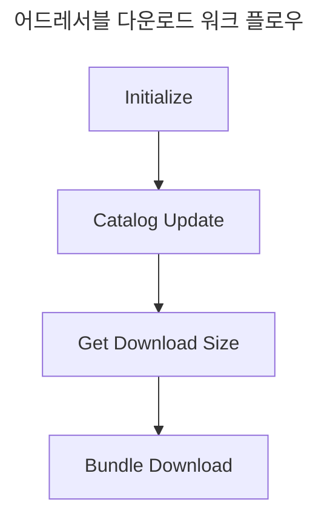

[](https://hits.seeyoufarm.com)

---

## 목차


---

<br>
<br>

## Remote Catalog 에 대해
---

{: : width="800" .normal }

- 어드레서블 번들에 보면 Local, Remote 설정하는 부분이 있는데 Local 은 앱에 해당 번들을 포함시키겠다 라는 의미이고
- Remote 는 해당 번들을 앱에서 제외시키고 앱 기동 시 어드레서블 번들을 다운로드하겠다 라는 뜻이다.

<br>

- 앞 포스트에서 설명했듯이, settings.json, catalog.json 들도 마찬가지로 번들을 받기 전 다운로드를 받을 수 있다.
- 즉, Remote Catalog는 앱에 포함시키지 않은 Catalog 를 의미하며 다운로드를 받아서 가져온다.

<br>

- Remote Catalog 를 쓰는 목적은 앱의 빌드 없이 오로지 어드레서블 빌드를 통해 에셋의 업데이트를 가능하게 하기 위함이다.
- 특히 catalog 내부에는 번들 리스트들에 대한 정보를 가지고 있고 Internal ID 를 비교하여 번들을 받을지 말지 결정한다.
- 앱에 모든 에셋들이 포함되면, 모바일 환경에서는 앱 용량 제한과 함꼐 유저가 업데이트마다 앱스토어, 플레이스토어에서 업데이트를 해야하는 번거로움이 있다. (단, 스크립트는 컴파일을 해야하므로 앱 빌드를 해야함)
- 따라서 간단한 데이터 테이블 수정, 로컬라이제이션 추가, 프리팹 추가와 같은 리소스 측면의 업데이트는 어드레서블을 통해 유저들이 앱 기동 시 업데이트를 진행할 수 있다.

{: : width="800" .normal }     
_Remote Catalog와 Local에 캐싱된 Catalog 작동 원리(version 은 Resource Version을 의미함)_

<br>

#### 어드레서블 Remote 설정 방법

- 먼저 Addressable Asset Settings 를 클릭하여 Catalog -> Build Remote Catalog 옵션을 체크 해주자.

{: : width="800" .normal }     

<br>

- 그리고 Build & Load Paths 를 Local -> Remote 로 변경해주면 끝이다.
- Load Path 와 Profile 에 대해서는 뒤에서 설명할 예정

{: : width="800" .normal }     

<br>

- 어드레서블 빌드를 해보면 프로젝트 폴더 내부에 ServerData 라는 폴더가 있을 것이다.

{: : width="800" .normal }     

<br>

- 내부에는 Android 폴더가 있는데, 이는 Addressable Group 에서 Profile 을 설정하여 폴더링이 가능하다(iOS, Android).

{: : width="800" .normal }     

<br>

- 내부에 보면 catalog.json 과 catalog.hash 파일이 존재하는데
- 이 catalog.hash 파일은 catalog 파일의 version 값을 식별하기 위해 존재한다.
- 앞서 말했듯이, settings, catalog, bundle 순으로 즉 번들을 업데이트 하기전 우선적으로 remote catalog 를 받아와서 업데이트를 해야하기 때문이다.
- 따라서 hash 파일 내부의 hash 값을 기준으로 삼는다.

{: : width="600" .normal }     

<br>

> 어드레서블은 런타임에 새롭게 다운로드된 remote catalog를 local에 저장되어 있는 catalog 와 비교하여 교체 여부를 결정한다.     
> 그 기준은 다운로드 받은 catalog 의 hash 값이 로컬에 저장된 hash 값과 다르다면 새롭게 다운로드한 catalog 를 최신 카탈로그로 판단하고 로컬에 캐싱해놓는다. (기존의 카탈로그는 삭제)
{: .prompt-info}

<br>

- 이후 어드레서블 그룹에서 번들이나 에셋에 조금의 변화를 준 뒤 다시 빌드를 해보면..

{: : width="600" .normal }     

- 해시값이 변경된것을 확인할 수 있다.

<br>
<br>

## Addressable Profile 설정 및 관리
---

- 그렇다면 Remote 로 어드레서블 번들 파일들을 받을까? 
- UnityWebRequest를 통해 AWS S3, 구글 드라이브, hfs 등의 원격 저장소에 올라가있는 파일들 혹은 폴더의 URL 을 기준으로 유저의 휴대폰으로 다운로드를 진행한다. (Load)

- Addressable Profile 은 Build Path 와 Load Path(원격 저장소)에 대한 정보를 저장하고 있다.
- Addressable Profile 세팅 방법에 대해 알아보자.

<br>

{: : width="600" .normal }     

- Addressable Group - 상단 툴바 Profile 선택 - Manage Profiles 진입

<br>

{: : width="1000" .normal }     

{: : width="400" .normal }     

- 상단 좌측 툴바에 Create - Profile 를 통해 프로필을 만들 수 있다.
- Variable 을 클릭하면 모든 프로필에 파라미터값을 생성할 수 있다.

{: : width="800" .normal }     

- Variable Name은 Build Path, Load Path 에 들어갈 변수명으로 사용되고
- Default Value 는 실제 경로(폴더 혹은 파일)이름을 기입해주면 된다.

```console
# 예시
[AOS]/[BundleVersion] -> aos/001 이런식으로 인식됨
```

<br>

{: : width="1000" .normal }     

- Remote 쪽 설정을 Custom 으로 변경시켜준뒤 Remote.LoadPath 에 AWS S3, hts, 구글 드라이브 등의 저장소 주소를 입력해주면 된다.

<br>

{: : width="1000" .normal }     

- Cyberduck2(iOS), WinSCP(Windows) 등의 FTP 프로그램을 사용하여 수동으로 업로드가 가능하다.
- 혹은 Jenkins 와 fastlane 으로 빌드-업로드-배포(CI/CD) 프로세스 자동화가 가능하다.

<br>
<br>

## Addresssable Label 설정 및 관리 방법
---

{: : width="1000" .normal }     

- Label 이란 Addressable 이 체크된 에셋들마다 붙일 수 있는 태그이다.
- Resource Locators 를 통해 어드레서블에 등록된 전체 에셋을 다운 받는 방법도 있으나
- 보통 Label 을 통해 어드레서블 에셋을 받는 방법을 추천하고 있다. 
- 특히 프린세스 커넥트, 우마 무스메와 같은 게임들에서는 스토리 애니메이션이나 캐릭터들의 보이스팩 등을 런타임 중에 다운받을 수 있게 구현했는데, Label 을 분리하여 비슷하게 처리가 가능하다.

<br>

{: : width="400" .normal }   

- 체크박스를 선택하여 에셋에 Label 을 할당할 수 있다. (Label 복수 선택 가능)

<br>

{: : width="400" .normal }     

- 또한 Manage Labels.. 를 클릭하여 새로운 Label 을 만들어 저장이 가능하다.

<br>

{: : width="400" .normal }     

- Label 이 복수 선택된 경우 Label A 를 지닌 번들을 다운로드 받으면 Asset1, Asset2 를 다운받는다.

<br>

- 여기서 의문점이 발생한다. Asset1, Asset2, Asset3 이 만약 같은 번들로 묶여있다면 다운로드는 어떻게 되는걸까?
- 같은 번들 내의 다른 Label 을 지녔다면 에셋들으 분리해서 받을까? 아니면 번들을 통째로 받을까?
- 해당 내용은 어드레서블 번들링 전략과 밀접한 관계가 있으므로 아래에서 살펴보자.

<br>
<br>

## Addressable Bundle Mode 와 어드레서블 번들링 전략에 대해
---

- 어드레서블 그룹의 에셋을 번들로 패킹하는 방법을 설정할 수 있는 Bundle Mode 라는 옵션이 있다.

{: : width="500" .normal }     

<br>

- Bundle Mode 는 크게 Pack Together, Pack Seperately, Pack Together by Label 총 3가지로 구성되어 있다.
> `Pack Together` : 모든 에셋을 포함하는 단일 번들을 생성한다.     
> `Pack Seperately` : 그룹의 각 주요 에셋에 대한 번들을 생성한다. 스프라이트 시트의 스프라이트와 같은 서브 에셋이 함께 패킹된다. 그룹에 추가된 폴더의 에셋도 함께 패킹됨.      
> `Pack Together by Label` : 동일한 레이블 조합을 공유하는 에셋에 대한 번들을 생성한다.

<br>

- 따라서 위의 질문에 대한 답안은 다음과 같다.
- Asset1, Asset2, Asset3 이 같은 번들로 묶여 있고 각기 다른 Label 을 지니고 있을 때 당연히 번들을 통째로 받아버린다.
- Pack Together by Label 로 번들을 나누지 않는 이상 단일 번들을 통째로 다운 받는다고 생각하면 된다.

<br>

#### 어드레서블 번들링 전략 설정

- 그렇다면, 어떤 번들 모드를 사용하는게 좋을까?

<br>

- **Pack Together**

- 예를 들어, Sword Prefab, BossSwordPrefab, ShieldPrefab 이 세 가지 프리팹을 어드레서블의 같은 번들에 등록하면 다음과 같다.

{: : width="800" .normal }     

- 에셋 번들 특성상 부분적으로 로드는 가능하지만, 부분적으로 언로드는 불가능한 특성이 있다는 것을 확인했을 것이다.
- SwordPrefab, BossSwordPrefab 을 로드한 뒤 언로드 하여도 메모리에서 완전히 언로드되지는 않는 문제가 발생한다.
- 번들 내 에셋 전체를 언로드 하거나 비용이 많이 드는 CPU 작업인 Resources.UnloadUnusedAssets() 호출을 해야만 언로드된다.

<br>

- **Pack Seperately**
- Pack Together 는 번들 내의 모든 에셋을 하나의 번들로 묶어서 처리했다면, Seperately 는 번들 내의 모든 에셋을 개별적으로 번들로 만들어 내는 방법이다.
- 예를 들어 Sword Prefab, BossSwordPrefab, ShieldPrefab 을 어드레서블에 등록하고 Pack Seperately를 했다고 가정해보면 다음과 같다.
> {: : width="800" .normal }     

<br>

- 하지만 Pack Seperately 로 번들을 패킹하면 우리는 중복 종속성 문제에 직면하게 된다.
- 특히, 동일한 텍스쳐, 머테리얼을 여러 프리팹에서 사용하고 있다면 이는 최악의 결정이 되어버린다.

<br>

---
#### 중복 종속성 해결 방법

- 위의 세 오브젝트를 생성하고 메모리 프로파일링을 돌려보면 다음 사진과 같다.

{: : width="800" .normal }     

- Sword_N, Sword_D 의 텍스쳐 사본이 여러개 표시된다. 이것이 중복 종속성 문제이다.

<br>

- 우리는 오브젝트 3개 즉 검 프리팹 3개만 추가했는데 왜 텍스쳐가 메모리에 잡힌걸까?
- 이유는 바로 추가한 프리팹의 Dependency 를 지닌 다른 에셋들도 같이 번들에 포함되기 때문이다.
- 이러한 종속성은 텍스쳐,머테리얼과 같은 에셋들이 어드레서블의 다른 번들에 명시적으로 포함이 되지 않은 경우 자신을 사용하는 모든 번들에 자동으로 중복되어 추가된다.

{: : width="800" .normal }     

- 따라서 여기서는 Sword_N, Sword_D 라는 텍스쳐가 중복으로 두 곳에서 사용되었기 때문에 메모리에 여러개가 잡힌 것이다.

<br>

---

#### Addresssable Analyze 툴

- 어드레서블에는 번들 중복 종속성을 진단하는 툴을 지원해준다.
- Window - Asset Management - Addressables - Analyze 를 열고 하이어라키 최상단의 `Analyze Rules` 를 선택 하고 `Analyze Selected Rules` 를 선택하면 중복 종속성을 지닌 에셋들을 분석해준다.
- `Check Duplicate Bundle Dependencies` 를 실행하면 현재 어드레서블 레이아웃을 기준으로 여러 에셋 번들에 중복 포함된 에셋을 분석해준다.

{: : width="800" .normal }     
_분석에 따르면 Sword 번들 사이에 중복된 텍스쳐와 메시가 있으며 세 번들 모두에 동일한 셰이더가 중복되고 있다_

<br>

- 이런 중복은 다음 두 가지 방법으로 해결할 수 있다.

1. 종속성을 공유하도록 Sword, BossSword, Shield 프리팹을 동일한 번들에 배치하기
2. 중복된 에셋들을 다른 어드레서블의 번들로 빼서 명시적으로 포함하기

- 2번 방법을 사용하면 다음과 같이 된다.

{: : width="800" .normal }     
_중복 텍스쳐 두 개(Sword_N, Sword_D)를 명시적으로 번들로 따로 만들어 주면 해결이 된다_

<br>

- 추가적으로 Analyze 툴에 `Fix Selected Rules` 옵션이 있는데 이를 실행함으로 문제가 되는 에셋들을 자동으로 수정할 수 있다.
- `Duplicate Asset Isolation` 이라는 이름으로 새 어드레서블 그룹을 생성하고 번들링을 해준다.

{: : width="800" .normal }     

<br>

---
#### 대규모 프로젝트에서의 메타데이터 문제

- 만약 오픈월드식의 대규모 게임에서 `Pack Seperately` 번들링 전략을 사용하면 문제가 발생할 수 있다.
- 특히 에셋 번들마다 에셋 번들 메타데이터를 가지고 있는데, 이에 대한 **메모리 오버헤드**가 발생할 수 있다.
> 이 메타데이터에서 가장 크게 차지하는 부분은 file read buffer 인데, 모바일 플랫폼에선 번들 한 개당 7KB 정도 된다.
- [자세한 내용은 어드레서블 - 내부 메모리 구조와 에셋 번들 포스트 참조](https://epheria.github.io/posts/UnityAddressableMemory/#1-assetbundle-%EC%9D%98-metadata)

<br>

- **Pack Together by Label**
- 해당 옵션을 설정하면, 번들 내부 에셋들이 사용하고 있는 Label 의 개수만큼 분리하여 번들링을 진행한다.
- 예를 들어, MainAsset, SubAsset 레이블을 만들어 두고 어드레서블 그룹을 Pack Together by Label 로 설정하고 번들 내부의 에셋들을 두 레이블로 분리하면 다음과 같다.

{: : width="400" .normal }     

<br>

- 빌드를 진행하면, 두 개의 레이블 이므로 번들이 두 개가 생성되는 것을 확인할 수 있다.(1.6MB + 203KB)

{: : width="800" .normal }     

<br>

- 아래 사진은 Pack Together 즉 단일 번들일 때의 예시이다. (1.8MB)

{: : width="800" .normal }     

<br>
<br>

#### 번들링 전략의 결론

- 에셋들을 큰 번들로 번들링 할지, 여러개의 작은 번들로 번들링 할지의 여부는 양쪽 모두 영향을 미칠 수 있다.

> ***번들이 너무 많은 경우의 위험성***      
>       
> - 각 번들에는 [메모리 오버헤드](https://docs.unity3d.com/kr/Packages/com.unity.addressables%401.21/manual/MemoryManagement.html)가 있다. 메모리에 수백 수천 개의 번들을 한 번에 로드하면 메모리 샤용량이 눈에 띄게 증가할 수 있다.      
> - 번들 다운로드 시 동시성 제한이 존재한다. 특히 모바일의 경우 동시 처리한 [웹 리퀘스트 개수에 한계가 존재](https://epheria.github.io/posts/optimizationAddressable/#%EC%96%B4%EB%93%9C%EB%A0%88%EC%84%9C%EB%B8%94-%EC%B5%9C%EC%A0%81%ED%99%94-%ED%8C%81)한다. 번들이 수천 개라면 수천 개를 동시에 다운받을 수 없다는 뜻 -> 따라서 다운로드 시간의 증가로 이어질 수 있음.     
>      
> {: : width="400" .normal }       
> _Max Concurrent Web Request 옵션 값_      
>     
> - 번들 정보로 인해 카탈로그 크기가 커질 수 있다. 카탈로그를 다운로드하거나 로드할 수 있도록 유니티는 번들에 대한 문자열 기반 정보를 저장하는데, 수천 개의 번들 데이터가 존재하면 카탈로그 크기가 크게 증가할 수 있음.      
> - 중복 종속성을 고려하지 않고 번들링을 하면 중복 종속성 문제가 빈번히 발생할 수 있다. 위에서 설명했듯이..
{: .prompt-info}

<br>

> ***번들이 너무 적은 경우의 위험성***      
>        
> - UnityWebRequest 는 실패한 다운로드를 다시 시작하지 않는다. 따라서 대규모 번들(크기가 큰 번들)이 다운로드 중이며 만약 사용자 연결이 끊긴 경우 재연결 후 처음부터 다시 다운로드를 진행한다.      
> - 에셋들을 번들에서 개별적으로 로드가 가능하지만, 언로드는 불가능하다. 예를 들어, 번들에 머테리얼 10개를 모두 로드하고 그 중 9개를 해제하더라도 10개 모두 메모리에 로드되어 있다.
{: .prompt-warning}

<br>

- 추가적으로, 프로젝트가 오픈월드급 처럼 대규모 프로젝트일 때 다음과 같은 문제가 발생한다.

> **Total Bundle Size** : 유니티는 최대 4GB가 넘는 파일을 지원하지 않는다. (초대형 Terrain이 들어간 Scene 파일이라던가..) 하지만 최신 에디터에선 문제가 해결되었다고 함. 따라서 모든 플랫폼에서 최상의 호환성을 위해 최대 4GB는 넘지 않는 선이 적절하다고 한다.      
> **Bundle layout at scale** : 어드레서블 빌드에서 생성되는 에셋 번들의 수와 해댕 번들의 크기 사이의 메모리 및 성능 균형은 프로젝트 크기에 따라 달라질 수 있음.      
> **Bundle dependencies** : 어드레서블 에셋이 로드되면 해당 번들 종속성도 모두 로드된다. 중복 종속성 주의      
{: .prompt-info}

<br>

- 어드레서블을 잘 사용하면 메모리 사용량을 크게 줄일 수 있다. 프로젝트에 맞춰서 에셋 번들 번들링을 잘 구성하면 메모리 절약을 더 효과적으로 할 수 있다. 
- 에셋을 추가할 때 마다 중복 종속성을 유의하여 번들링 전략을 잘 고려하여 그룹을 나누는게 좋다.
- 또한 Addressable Analyze 툴을 수시로 실행하여 중복 종속성을 검사하는것을 추천한다. 또한 메모리 프로파일링을 자주 진행하여 중복 생성된 에셋들(특히 텍스쳐..)을 잘 감시하도록 하자.

<br>
<br>

## Addressable 다운로드 워크 플로우
---

<br>



<br>

#### Catalog Download

- Remote Catalog 와 Local Catalog 의 Hash 값이 다르면 다운로드를 진행한다.
- CheckForCatalogUpdates : Catalog 를 업데이트해야 하는지에 대한 여부
- UpdateCatalogs : Catalog 를 다운로드하고 Local에 캐싱

```csharp
    public void UpdateCatalog()
    {
        Addressables.CheckForCatalogUpdates().Completed += (result) =>
        {
            var catalogToUpdate = result.Result;
            if (catalogToUpdate.Count > 0)
            {
                Addressables.UpdateCatalogs(catalogToUpdate).Completed += OnCatalogUpdate;
            }
            else
            {
                Events.NotifyCatalogUpdated();
            }
        };
    }
```

<br>

#### Download Size

- 유저에게 팝업으로 얼마 만큼의 데이터를 받아야하는지 명시적으로 알려줘야할 의무가 있으므로 필수적으로 사용해야함.
- 새로 받을 Bundle 이 있는지도 알아야한다. 또한 로컬 디스크의 용량 체크도 필요하다.
- 만약, 다운로드 받을게 없으면 새로운 번들이 없다는 것이고 Download Size 가 0으로 반횐된다.

```csharp
    public void DownloadSize()
    {
        Addressables.GetDownloadSizeAsync(LabelToDownload).Completed += OnSizeDownloaded;
    }
```

<br>

#### Bundle Download

- label 을 입력하거나 ResourceLocators 를 전체 루프를 돌아서 번들을 실제로 다운로드 처리하는 부분이다.
- 추가적으로 LoadAssetAsync 를 통해 label 혹은 asset address 를 입력하여 만약 번들이 다운로드 되지 않았다면, 다운로드 처리 -> 로드 처리가 가능하다.
- 어드레서블 최신 버전으로 와서 생긴 버그인데, DownlaodHandle 을 꼭 사용 후 **Release** 해줘야만 LoadAssetAsync 호출이 가능해졌다. 안그러면 에러가 발생함.

```csharp
    public void StartDownload()
    {
        DownloadHandle = Addressables.DownloadDependenciesAsync(LabelToDownload);
        DownloadHandle.Completed += OnDependenciesDownloaded;
        Addressables.Release(DownloadHandle);
    }
```

<br>

#### 런타임중 어드레서블 업데이트 처리

- 런타임중 앱의 종료 없이 어드레서블 번들을 빌드 -> 서버 업로드(AWS) -> 서버 다운로드(AWS to 로컬) -> 런타임 중 번들 업데이트가 가능하다.
- Addressable Asset Settings 에서 `Unique Bundle IDs` 옵션을 활성화 해주면 된다.

{: : width="800" .normal }       

- 에셋 번들을 메모리에 로드할 때 유니티는 동일한 내부 이름으로 두 개의 번들을 로드할 수 없게 강제한다.
- 이로 인해 런타임시 번들 업데이트에 제한이 생기게 되는데, 해당 옵션을 활성화 함으로써 에셋 번들에 Unique Internal ID가 있는지 확인하고 이를 통해 런타임중 새 번들을 로드할 수 있다.
- 즉, 같은 번들이여도 내부적으로 Internal ID 가 다르기 때문에 재로드를 하더라도 충돌이 발생하지 않는것이다.
- 주의할 점은 에셋의 변경점이 발생하면 그 에셋의 종속성을 지닌 번들까지 다시 새롭게 빌드를 해야하는 특성이 있다.

<br>
<br>

## Addressable 업데이트 워크 플로우
---

{: : width="800" .normal }       

- 앱 버전은 유니티 프로젝트 빌드를 통해 APK, Xcode 프로젝트 -> ipa 파일로 뽑아 구글 플레이스토어나 앱 스토어에 등록하여 유저들이 다운로드 받는 애플리케이션을 의미한다. 또한, 스크립트가 수정되어 컴파일이 필요할 때 앱 업데이트를 실시해야한다.
- 리소스 버전은 컴파일이 필요없는 리소스들 즉 에셋들(텍스쳐, 머테리얼, 프리팹, 메쉬, 애니메이션 클립 등)을 업데이트하여 앱 빌드 없이 패치를 받을 수 있다.

<br>

{: : width="800" .normal }       

- 보통 Jenkins 잡을 통해 앱 빌드 및 어드레서블 빌드를 진행한다.
- 어드레서블을 빌드하면 번들과 카탈로그를 AWS S3 에 업로드를 진행한다.

<br>

{: : width="800" .normal }       

- 만약 리소스 업데이트가 필요하다면, 어드레서블 프로필에 리소스 버전 변수를 하나 만들어서 특정 aos/ios 폴더 하위에 리소스 버전을 여러개 만드는 방법도 있다.
- Resource002 를 업데이트하면 카탈로그와 업데이트된 번들들이 AWS S3에 올라가게 되고, 유저가 패치를 받으면 카탈로그를 비교하여 Resource002 카탈로그와 번들을 업데이트한다.

<br>

{: : width="800" .normal }       

- 만약 롤백이 필요하다면 어드레서블 프로필에서 롤백하고 싶은 버전값만 변경해주고 빌드를 진행해주면 된다. (카탈로그만 변경됨)