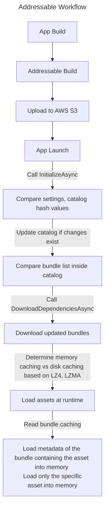

## Table of Contents

> [Addressable Workflow](#addressable-workflow)      
> [Asset Bundle Caching](#asset-bundle-caching)
> [Addressable Loading Process](#addressable-loading-process)      

---

## Reflections on the Precise Working Principles of the Addressable System

- Recently, while investigating the Addressable system for project optimization, I was very curious about whether the entire bundle containing an asset is loaded into memory when loading that asset.
- Since the Addressable system is built on top of the Asset Bundle system internally, it was necessary to study Asset Bundles in depth.

 

- First, let's look at the overall workflow of Addressables and the detailed memory structure.

 

#### Addressable Workflow

 

## Asset Bundle Caching

- Leaving the previous steps aside, let's look at the most important part: downloading Asset Bundles.

- Addressables use Asset Bundles internally.
- According to the [Unity Official Documentation on Memory Management](https://docs.unity3d.com/Packages/com.unity.addressables@1.20/manual/MemoryManagement.html) and [Unity Forum on Addressable Caching](https://forum.unity.com/threads/addressable-caching.1178518/), Asset Bundles are **cached** when downloading updates or upon initial app launch at runtime.

 

- I wondered whether caching happens in memory or on the local disk and struggled a bit.
- To give the answer first: **Caching location depends on the Asset Bundle compression format.**

 

- First, there are three compression formats for Asset Bundles: **Uncompressed, LZ4, and LZMA**.
> {: : width=500" .normal }   

- Let's see which compression formats cache to local disk or memory.

 

- According to [Unity Addressable Asset Bundle Caching](https://docs.unity3d.com/Packages/com.unity.addressables@2.0/manual/remote-content-assetbundle-cache.html), Asset Bundles generated for Addressable builds are basically cached inside the client device after downloading them by calling `DownloadDependenciesAsync`.
> Note: If you load an asset from a bundle not downloaded via `LoadAssetAsync` during runtime:      
> 1. It downloads the bundle first.     
> 2. Then it loads the asset within the bundle.     
> [LoadAssetAsync Documentation](https://docs.unity3d.com/Packages/com.unity.addressables@1.20/api/UnityEngine.AddressableAssets.Addressables.LoadAssetAsync.html)

- You might think, "Oh, it just caches to the local disk!" but let's check the Asset Bundle documentation.

- Checking the [Unity Asset Bundle Caching](https://docs.unity3d.com/2021.3/Documentation/Manual/AssetBundles-Cache.html) documentation reveals the specific working principles of the following compression formats.

---

#### Uncompressed

- No compression at all. Uncompressed bundles are large but offer the fastest access after download.
- The internal Asset Bundle system can read the header file to understand the bundle contents and uniquely identify files when reading the bundle, so **caching is done on disk**, not in memory.

 

#### LZ4

- LZ4 applies compression on a per-file basis within the bundle. It knows the header location and can extract headers from the bundle without loading the entire bundle.
- This is said to be similar to how compression works in Windows File Explorer (viewing archive contents without unpacking the whole archive).
- Therefore, like Uncompressed, LZ4 can uniquely identify files when reading the bundle file, so **caching is done on disk**, not in memory.

 

#### LZMA

- LZMA applies compression to the entire bundle file. This allows for better compression than LZ4, but unique files within the bundle cannot be identified without decompression.
- Therefore, the entire bundle must be decompressed. Thus, LZMA is the only compression format that requires **loading the entire bundle into memory**.

---

 

- Based on the above, I created a flowchart.

{: : width=800" .normal }      
_Asset Bundle Caching Process Flowchart_

 

- Additionally, when using the LZ4 algorithm, it is more efficient to **Disable** the AssetBundle CRC feature in Addressable Group options.
> {: : width=400" .normal }      
>       
> LZ4 uses a chunk-based algorithm that allows AssetBundles to be decompressed in "chunks." While writing an AssetBundle, each 128KB chunk of content is compressed before storage. Because each chunk is compressed individually, the total file size is larger than an LZMA-compressed AssetBundle. However, this approach allows selectively retrieving and loading only the chunks needed for requested objects without unpacking the entire AssetBundle. LZ4 offers loading times comparable to uncompressed bundles with the added benefit of reduced disk size.     
>     
> Therefore, performing a CRC check on a chunk-based file forces a full read and decompression of each chunk. This calculation happens chunk-by-chunk instead of loading the entire file into RAM, so it's not a memory issue, but it can slow down load times. Note that for LZMA format AssetBundles, performing a CRC check does not incur as significant an additional cost as LZ4.     
> [Related Reference](https://docs.unity3d.com/6000.0/Documentation/Manual/AssetBundles-Cache.html)

 

- Therefore, we need to enable the following options in the Addressable Group Inspector.

{: : width=500" .normal }      
_Enable Asset Bundle Cache option_

 

{: : width=500" .normal }      
_Set Asset Bundle Compression to LZ4 or Uncompressed_

 

> **Summary**: If you select Uncompressed or LZ4 algorithm for Asset Bundle compression and enable **Use Asset Bundle Cache** in Addressable Group settings,     
> Bundle caching happens on the local disk, so you don't have to worry about memory caching of bundles. (Optimal for mobile environments)     
>     
> However, Uncompressed does not compress at all, making it unsuitable for remote server downloads, so **LZ4 is recommended**.
{: .prompt-info}

 
 

## Addressable Loading Process

- We learned that the Asset Bundle file itself is not cached in memory (for LZ4/Uncompressed). So what exactly gets loaded into memory?

 

{: : width=800" .normal }      
_Addressable Loading Process_

 

#### 1. AssetBundle Metadata

- For each loaded AssetBundle, there is an item called **SerializedFile** in memory. This memory is not the actual file of the bundle, but the **metadata** of the Asset Bundle.
- This metadata includes:
> 1. Two File Read Buffers      
> 2. A Type Tree List     
> 3. A list referencing assets

 

- Among these three, the **file read buffer** takes up the most space. These buffers are about 64KB on PS4, Switch, Windows, and about 7KB on other platforms (mobile).

{: : width=800" .normal }       
_In the example, metadata for 1,819 bundles is loaded into memory as SerializedFiles, totaling 263MB._

- The image above is from a [Unity Addressable Memory Optimization Blog](https://blog.unity.com/technology/tales-from-the-optimization-trenches-saving-memory-with-addressables). In the example: 1,819 bundles x 64KB x 2 buffers = 227MB just for buffers.

- The number of buffers increases linearly with the number of Asset Bundles. Therefore, recklessly splitting bundles (Pack Separately) is not advisable, and a more strategic approach is needed.
- Note that if bundles are too large, you might face unexpected **Duplicate Dependency** issues (solvable via Analyze) or situations where memory for unused assets remains loaded. (Fact: Bundle metadata and assets are unloaded only when ALL assets in the bundle are released.)

 
 

#### 2. Asset Data

- Literally, memory is allocated for the size of the asset you are trying to load from within the bundle.

 
 

#### 3. Reference Count Increase

- As mentioned in the [Addressable Post](https://epheria.github.io/posts/UnityAddressable/#addressable-loadunload-and-memory-structure), the reference count of the bundle and asset you are trying to load increases by 1.
- To free up memory after use, you **must Release** the asset's reference count. (A bundle may contain various assets; if even one has a ref count >= 1, the bundle metadata and loaded assets remain in memory. Except for special cases like scene transitions or manual unloading.)

 
 
