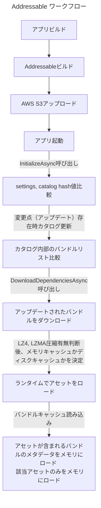

## 目次

> [Addressable ワークフロー](#addressable-ワークフロー)      
> [アセットバンドルのキャッシング](#アセットバンドルのキャッシング)
> [Addressable ローディングプロセス](#addressable-ローディングプロセス)      

---

## Addressable System の正確な動作原理に対する考察

- 最近、プロジェクトの最適化のためにAddressableシステムについて調査していたところ、アセットロード時に「該当アセットが含まれるバンドル全体がメモリにロードされるのか？」という点が非常に気になりました。
- 特にAddressableシステムは内部的にアセットバンドルシステムを基盤として作られているため、アセットバンドルについても深く学ぶ必要がありました。

 

- まずはAddressableの全般的なワークフローと詳細なメモリ構造について見ていく必要があります。

 

#### Addressable ワークフロー

 

## アセットバンドルのキャッシング

- 前半のステップは除いて、最も重要なアセットバンドルのダウンロードについて見てみましょう。

- Addressableは内部的にアセットバンドルを使用します。
- [Unity公式ドキュメント メモリ管理](https://docs.unity3d.com/Packages/com.unity.addressables@1.20/manual/MemoryManagement.html)と[Unityフォーラム Addressableキャッシングに関する内容](https://forum.unity.com/threads/addressable-caching.1178518/)を見ると、アセットバンドルをランタイムアプリ起動時の初回、またはアップデートをダウンロードする際に **キャッシング** するとあります。

 

- キャッシングをメモリにするのか、ローカルディスクにするのかが気になり、かなり迷いました。
- 正解から言うと、 **アセットバンドルの圧縮フォーマットによってキャッシング場所が変わります。**

 

- まず、アセットバンドルの圧縮フォーマットは **Uncompressed, LZ4, LZMA** の合計3種類があります。
> {: : width=500" .normal }   

- どの圧縮フォーマットがローカルディスクまたはメモリにキャッシングされるか調べてみましょう。

 

- [Unity Addressable アセットバンドルキャッシング](https://docs.unity3d.com/Packages/com.unity.addressables@2.0/manual/remote-content-assetbundle-cache.html)を見ると、基本的にAddressableビルドのために生成されたアセットバンドルは、`DownloadDependenciesAsync` 関数を呼び出すことでダウンロードされ、クライアントデバイス内部にキャッシュされます。
> ちなみにランタイム中に `LoadAssetAsync` でダウンロードしていないバンドルのアセットをロードすると、      
> 1. 該当バンドルをまずダウンロードし、     
> 2. バンドル内のアセットをロードします。     
> [LoadAssetAsync ドキュメント](https://docs.unity3d.com/Packages/com.unity.addressables@1.20/api/UnityEngine.AddressableAssets.Addressables.LoadAssetAsync.html)

- これだけ見ると「単純にローカルディスクにキャッシュするんだな！」と通り過ぎてしまいそうですが、次はアセットバンドルのドキュメントを確認してみましょう。

- [Unity アセットバンドルキャッシング](https://docs.unity3d.com/2021.3/Documentation/Manual/AssetBundles-Cache.html)ドキュメントを確認すると、以下の圧縮フォーマットごとの具体的な動作原理を確認できます。

---

#### Uncompressed

- Uncompressed は全く圧縮をしないものです。したがって、非圧縮バンドルはサイズが大きいですが、ダウンロード後のアクセスが最も速いフォーマットでもあります。
- また、内部のアセットバンドル機能はヘッダーファイルを読んでバンドル内容を把握でき、バンドルを読む際にファイルを一意に識別可能であるため、メモリにキャッシュせず **ディスクにキャッシュを行います。**

 

#### LZ4

- LZ4はバンドル内でファイル単位で圧縮を適用します。したがって、ヘッダーの位置を知っており、バンドル全体をロードしなくてもバンドルからヘッダーを抽出できます。
- これはWindowsエクスプローラーで圧縮が動作する方式と類似していると言われています。（アーカイブ全体を解凍することなくアーカイブ内容を確認できるように）
- したがって、LZ4はUncompressedと同様にバンドルファイルを読む際にファイルを一意に識別可能であるため、メモリにキャッシュせず **ディスクにキャッシュを行います。**

 

#### LZMA

- LZMAはバンドルファイル全体に圧縮を適用します。これはLZ4よりも優れた圧縮率を可能にしますが、バンドル内の一意のファイルを識別できません。
- したがって、バンドル全体を解凍する必要があります。そのため、LZMAは **バンドル全体をメモリにロード** しなければならない唯一の圧縮フォーマットです。

---

 

- 上記の内容を基にフローチャートを作成しました。

{: : width=800" .normal }      
_アセットバンドルキャッシングプロセス フローチャート_

 

- さらに、LZ4アルゴリズムを使用する場合、Addressable Groupオプションの中の AssetBundle CRC 機能を Disabled にする方が効率的だと言われています。
> {: : width=400" .normal }      
>       
> LZ4はアセットバンドルを「チャンク」として解凍できるチャンクベースのアルゴリズムを使用します。AssetBundleを作成中、コンテンツの各128KBチャンクは保存される前に圧縮されます。各チャンクが個別に圧縮されるため、全体ファイルサイズはLZMAで圧縮されたアセットバンドルより大きくなります。しかし、このアプローチを使用すると、AssetBundle全体の圧縮を解かずに、要求されたオブジェクトに必要なチャンクのみを選択的に検索してロードできます。LZ4はディスクサイズが減るという追加の利点とともに、圧縮されていないバンドルと比較してローディング時間が同等です。     
>     
> したがって、チャンクベースのファイルに対してCRCチェックを実行すると、ファイルの各チャンクに対する全読み込みおよび解凍が強制されます。この計算はファイル全体をRAMにロードする代わりにチャンクごとに発生するためメモリの問題ではありませんが、ロード時間が遅くなる可能性があります。ちなみにLZMAフォーマットのアセットバンドルの場合、CRCチェックを実行するのにLZ4ほどのかなりの追加コストはかかりません。     
> [関連内容リファレンス](https://docs.unity3d.com/6000.0/Documentation/Manual/AssetBundles-Cache.html)

 

- したがって、私たちはAddressable Groupインスペクターで次のようなオプションを有効にする必要があります。

{: : width=500" .normal }      
_アセットバンドルキャッシュオプションを有効にする_

 

{: : width=500" .normal }      
_アセットバンドル圧縮フォーマットをLZ4またはUncompressedに設定_

 

> つまり整理すると、アセットバンドルの圧縮フォーマットをUncompressedまたはLZ4アルゴリズムとして選択し、Addressable Groupの **Use Asset Bundle Cache** を有効にすれば、     
> バンドルキャッシングをローカルディスクに行うため、バンドルのメモリキャッシングを心配する必要はありません。（モバイル環境で最適）     
>     
> ただし、Uncompressedの場合は圧縮を全く行わないため、Remoteサーバーダウンロードには適していないので、 **LZ4を使用することを推奨** します。
{: .prompt-info}

 
 

## Addressable ローディングプロセス

- アセットバンドルファイルそのものがメモリにキャッシュされない（LZ4/Uncompressedの場合）ことは分かりました。では、何がメモリにロードされるのでしょうか？

 

{: : width=800" .normal }      
_Addressable ローディングプロセス_

 

#### 1. AssetBundle の MetaData

- ロードされた各アセットバンドルに対するメモリには **SerializedFile** という項目があります。このメモリはバンドルの実際のファイルではなく、アセットバンドルの **メタデータ** です。
- このメタデータには以下の項目が含まれます。
> 1. File Read Buffer 2個      
> 2. A Type Tree List     
> 3. アセットを参照するリスト

 

- 上記3つの項目のうち、 **File Read Buffer** が最も多くの空間を占めます。これらのバッファはPS4, Switch, Windowsでは64KBであり、他のプラットフォーム（モバイル）では7KB程度だそうです。

{: : width=800" .normal }       
_例では1,819個のバンドルのメタデータがSerializedFileとしてメモリにロードされており、サイズは合計263MBです。_

- 上の写真は[Unity Addressableメモリ最適化ブログの例です。](https://blog.unity.com/technology/tales-from-the-optimization-trenches-saving-memory-with-addressables) 例ではバンドル1,819個 x 64KB x バッファ2個なので、バッファだけで227MBを占めます。

- バッファの数がアセットバンドルの数に応じて線形に増加するそうです。したがって、Seperatelyでむやみに分けるのではなく、もう少し戦略的なアプローチが必要だと言われています。
- ちなみに、あまりに大きくバンドルをまとめてしまうと、予期せぬ **重複依存性** の問題（Analyzeを回せば解決可能ではあります）や、使用していないアセットのメモリがロードされたままになる不祥事が発生する可能性もあります。（Releaseが適時に行われない事実。バンドル内のすべてのアセットをReleaseして初めて、バンドルメタデータとアセットがアンロードされます）

 
 

#### 2. Asset Data

- 文字通り、バンドル内部のロードしようとしているアセットのサイズ分だけメモリにロードされます。

 
 

#### 3. Reference Count 増加

- [Addressableの投稿](https://epheria.github.io/posts/UnityAddressable/#addressable-loadunload-and-memory-structure)にあるように、ロードしようとしているバンドルとアセットの参照カウントが1ずつ増加します。
- 必ず使用後にメモリを確保したい場合は、アセットの参照カウントを **Release** しなければなりません。（バンドル内に様々なアセットが存在するでしょうが、この中で一つでも参照カウントが1以上であれば、バンドルメタデータとロードしたアセットはそのままメモリに残っています。シーン遷移や手動解除などの特殊なケースを除いて）

 
 
