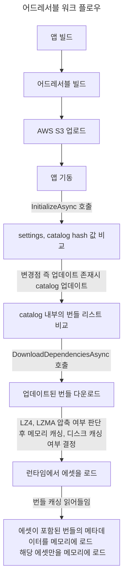

---

## 목차

> [어드레서블 워크 플로우](#어드레서블-워크-플로우)      
> [에셋 번들 캐싱](#에셋-번들-캐싱)
> [어드레서블 로딩 프로세스](#어드레서블-로딩-프로세스)      

---

## Addressable System 의 정확한 작동 원리에 대한 고찰

- 최근 프로젝트 최적화를 위해 어드레서블 시스템에 대해 조사하던 중 에셋 로드 시 해당 에셋이 포함된 번들 전체가 메모리에 로드되는지? 아닌지? 등의 여부가 너무 궁금했다.
- 특히 어드레서블 시스템은 내부적으로 에셋 번들 시스템을 근간으로 만들어졌기 때문에 에셋 번들에 대해서도 깊게 공부를 할 필요가 있었다.

 

- 우선 어드레서블의 전반적인 워크 플로우와 자세한 메모리 구조에 대해 살펴볼 필요성이 있다.

 

#### 어드레서블 워크 플로우

 

## 에셋 번들 캐싱

- 앞의 스텝들은 제외하고 가장 중요한 에셋 번들의 다운로드에 대해 알아보자.

- 어드레서블은 내부적으로 에셋 번들을 사용한다.
- [유니티 공식문서 메모리 관리](https://docs.unity3d.com/Packages/com.unity.addressables@1.20/manual/MemoryManagement.html)와 [유니티 포럼 어드레서블 캐싱에 관한 내용](https://forum.unity.com/threads/addressable-caching.1178518/)를 살펴보면 에셋 번들을 런타임 앱 기동시 최초 혹은 업데이트를 다운로드 받을 때 **캐싱**을 한다고 한다.

 

- Caching을 메모리에 하는건지 로컬 디스크에 하는건지 궁금했고 많이 헤맸다.
- 정답부터 얘기하자면, **에셋 번들 압축 포맷에 따라 캐싱 위치가 달라진다.**

 

- 우선 에셋 번들의 압축 포맷은 총 **Uncompressed, LZ4, LZMA** 3가지가 있다.
> {: : width=500" .normal }   

- 어떤 압축 포맷들이 로컬 디스크 혹은 메모리에 캐싱하는지 알아보자.

 

- [유니티 어드레서블 에셋 번들 캐싱](https://docs.unity3d.com/Packages/com.unity.addressables@2.0/manual/remote-content-assetbundle-cache.html)을 살펴보면 기본적으로 어드레서블 빌드를 위해 생성된 에셋 번들은 DownloadDependenciesAsync 함수를 호출함으로 에셋 번들들을 다운로드 후 클라이언트 장치 내부에 캐싱된다. 
> 참고로 런타임중 LoadAssetAsync 로 다운받지 않은 번들의 에셋을 로드하면      
> 1. 해당 번들을 우선 다운로드 받고     
> 2. 번들내의 에셋을 로드한다..     
> [LoadAssetAsync 문서](https://docs.unity3d.com/Packages/com.unity.addressables@1.20/api/UnityEngine.AddressableAssets.Addressables.LoadAssetAsync.html)

- 이까지만 보면 단순히 로컬 디스크에 캐싱해두는구나! 라고 넘어갈 수 있지만, 다음은 에셋 번들 문서를 확인해보자.

- [유니티 에셋 번들 캐싱](https://docs.unity3d.com/2021.3/Documentation/Manual/AssetBundles-Cache.html) 문서를 확인해보면 다음 압축 포맷들의 구체적인 작동원리를 확인할 수 있다.

---

#### Uncompressed

- Uncompressed 아예 압축을 하지 않는 것이다. 따라서 비압축 번들은 크기가 크지만 다운로드 이후 접근이 가장 빠른 포맷이기도 하다.
- 또한 내부 에셋 번들 기능은 헤더 파일을 읽고 번들 내용을 파악할 수 있고 번들을 읽을 때 파일을 고유하게 식별이 가능하므로 메모리에 캐싱하지 않고 **디스크에 캐싱을 진행한다.**

 

#### LZ4

- LZ4는 번들 내에서 파일 단위로 압축을 적용한다. 따라서 헤더의 위치를 알고 있으며 전체 번들을  로드하지 않고도 번들에서 헤더를 추출할 수 있다.
- 이는 Windows 파일 탐색기에서 압축이 작동하는 방식과 유사하다고 한다. (전체 아카이브를 푸는 것 없이 아카이브 내용을 확인할 수 있듯이)
- 따라서 LZ4는 Uncompressed 와 마찬가지로 번들 파일을 읽을 때 파일을 고유하게 식별이 가능하므로 메모리에 캐싱하지 않고 **디스크에 캐싱을 진행한다.**

 

#### LZMA

- LZMA는 전체 번들 파일에 압축을 적용한다. 이는 LZ4 보다 더 나은 압축을 가능하게 하지만, 번들 내의 고유한 파일을 식별할 수 없다.
- 따라서, 전체 번들을 압축 해제해야한다. 그래서 LZMA 는 **전체 번들을 메모리에 로드**해야하는 유일한 압축 포맷이다.

---

 

- 위 내용을 기반으로 플로우차트를 만들었다.

{: : width=800" .normal }      
_에셋 번들 캐싱 프로세스 플로우차트_

 

- 추가적으로 LZ4 알고리즘을 사용하면 어드레서블 그룹 옵션 중 AssetBundle CRC 기능을 Disabled 시키는게 더 효울적이라고 한다.
> {: : width=400" .normal }      
>       
> LZ4 는 에셋 번들을 "chunk" 로 압축 해제할 수 있는 청크 기반 알고리즘을 사용한다. AssetBundle을 작성하는 동안 콘텐츠의 각 128KB 청크는 저장되기 전에 압축된다. 각 청크가 개별적으로 압축되기 때문에 전체 파일 크기는 LZMA로 압축된 에셋 번들보다 크다. 그러나 이 접근 방식을 사용하면 전체 AssetBundle의 압축을 풀지 않고 요청된 개체에 필요한 청크만 선택적으로 검색하고 로드할 수 있다. LZ4는 디스크 크기가 줄어든다는 추가 이점과 함께 압축되지 않은 번들에 비해 로딩 시간이 비슷하다.     
>     
> 따라서 청크 기반 파일에 대해 CRC 검사를 수행하면 파일의 각 청크에 대한 전체 읽기 및 압축 해제가 강제 실행된다. 이 계산은 전체 파일을 RA에 로드하는 대신 청크별로 발생하므로 메모리 문제는 아니지만, 로드 시간이 느려질 수 있다. 참고로 LZMA 포맷 에셋 번들의 경우 CRC 검사를 수행하는데 LZ4 만큼 상당한 추가 비용이 들지않는다.     
> [관련 내용 레퍼런스](https://docs.unity3d.com/6000.0/Documentation/Manual/AssetBundles-Cache.html)

 

- 따라서 우리는 어드레서블 그룹 인스펙터에서 다음과 같은 옵션을 활성화 시켜줄 필요성이 있다.

{: : width=500" .normal }      
_에셋 번들 캐시 옵션 활성화 해주기_

 

{: : width=500" .normal }      
_에셋 번들 압축 포맷 LZ4 or Uncompressed_

 

> 즉, 정리하자면 에셋 번들 압축 포맷을 Uncompressed 혹은 LZ4 알고리즘으로 선택하고, Addressable Group 의 Use Asset Bundle Cache를 활성화 하면     
> 번들 캐싱을 로컬 디스크에 진행하므로, 번들의 메모리 캐싱을 염려하지 않아도 된다. (모바일 환경에서 최적)     
>     
> 하지만 Uncompressed 의 경우 압축을 전혀 하지 않으므로 Remote 서버 다운로드에 적합하지 않으므로 LZ4 를 사용하는 것을 추천한다.
{: .prompt-info}

 
 

## 어드레서블 로딩 프로세스

- 우리는 에셋 번들 파일 그 자체가 메모리에 캐싱되지 않는다는 점을 알았다. 그럼 어떤것들이 메모리에 로드되는걸까?

 

{: : width=800" .normal }      
_어드레서블 로딩 프로세스_

 

#### 1. AssetBundle 의 MetaData

- 로드된 각 에셋번들에 대한 메모리에는 SerializedFile 이라는 항목이 있다. 이 메모리는 번들의 실제 파일이 아니라 에셋 번들의 메타데이터이다.
- 이 메타데이터에는 다음 항목들이 포함된다.
> 1. File Read Buffer 2개      
> 2. A Type Tree List     
> 3. 에셋을 참조하는 리스트

 

- 위 세가지 항목 중 file read buffer 가 가장 많은 공간을 차지한다. 이러한 버퍼는 PS4, Switch, Windows 에서는 64KB 이며 다른 플랫폼(모바일) 7KB 정도라고한다.

{: : width=800" .normal }       
_예시에는 1819개의 번들의 메타데이터가 SerializedFile로서 메모리에 로드되어 있으며 크기는 총 263MB이다._

- 위 사진은 [유니티 어드레서블 메모리 최적화 블로그의 예시이다.](https://blog.unity.com/kr/technology/tales-from-the-optimization-trenches-saving-memory-with-addressables) 예시에서는 번들 1,819개 x 64KB x 버퍼 2개이므로 버퍼만으로 227MB를 차지한다.

- 버퍼의 수가 에셋 번들의 수에 따라 선형적으로 증가한다고 한다. 따라서 Seperately 로 무작정 나누면 안되고 좀 더 전략적인 접근이 필요하다고 한다.
- 참고로 너무 큼직하게 번들을 묶어버리면 예상치 못한 중복 종속성 문제(Analyze 돌리면 해결 가능하긴함)나 사용하지 않는 에셋의 메모리가 계속 로드되어 있는 불상사가 발생할 수도 있다. (Release 가 제때 안이루어지는 사실. 번들 내의 모든 에셋을 Release 해야만 번들 메타데이터와 에셋들이 언로드됨)

 
 

#### 2. Asset 데이터

- 문자그대로 번들 내부의 로드하려고하는 에셋의 크기 만큼 메모리에 로드된다.

 
 

#### 3. Reference Count 증가

- [어드레서블 포스팅](https://epheria.github.io/posts/UnityAddressable/#addressable-%EC%9D%98-%EB%A1%9C%EB%93%9C%EC%96%B8%EB%A1%9C%EB%93%9C-%EB%B0%8F-%EB%A9%94%EB%AA%A8%EB%A6%AC-%EA%B5%AC%EC%A1%B0) 에 나와있듯이 로드하려고 하는 번들과 에셋의 레퍼런스 카운트가 1씩 증가한다.
- 반드시 사용 후 메모리를 확보하고 싶다면 에셋의 레퍼런스 카운트를 Release 해줘야만 한다. (번들 내에 여러가지 에셋들이 존재할텐데 이중에서 하나라도 레퍼런스 카운트가 1이상이면 번들 메타데이터와 로드한 에셋들은 그대로 메모리에 남겨져있다. 특수한 케이스 -> 씬 전환, 수동 해제를 제외하고)

 
 