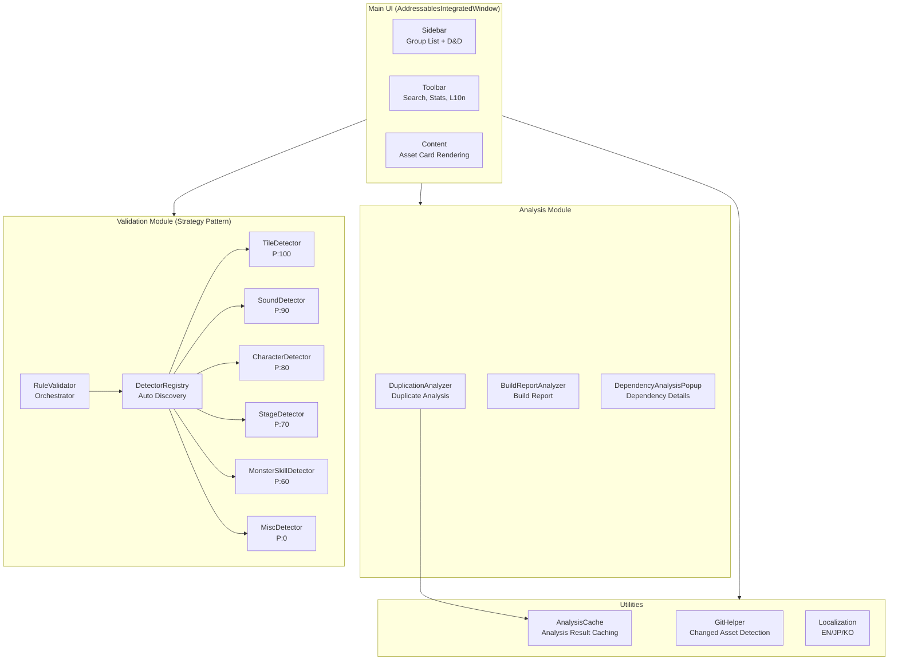
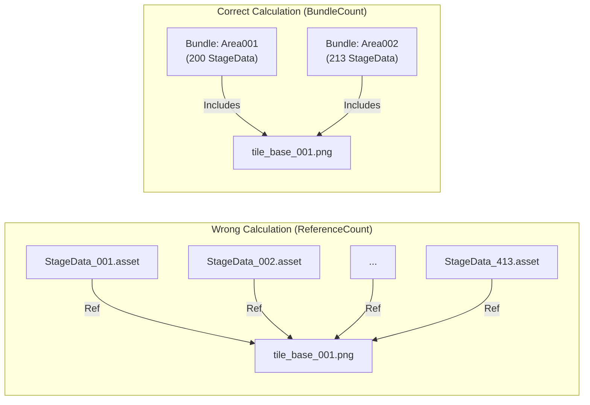

## I. Why a Custom Tool Was Necessary

### The Pain of Manually Managing Thousands of Assets

Developing a mobile survivor-genre game, the number of assets managed via Addressables grew exponentially. Characters, monsters, skill effects, stage data, tilemaps, sounds... it became practically impossible to manually assign each asset to a group, attach labels, and specify addresses.

Specific problematic scenarios included:

- The planning team adding stage assets but forgetting to register them in Addressables, leading to runtime load failures.
- Multiple labels being attached to the same asset, causing duplicate bundle generation that went unnoticed for a long time.
- The high cost of repeatedly checking rules for "which group should this asset go into?"

### Limitations of Unity's Default Analyze Tool

Unity does provide a built-in Addressable Analyze feature. It has rules like `Check Duplicate Bundle Dependencies` to detect duplicate dependencies.

However, its limitations were clear for production-level use:

- **Slow**: Analyzing the entire project took dozens of minutes.
- **Unfriendly Results**: It merely listed asset paths without suggesting which group to move them to.
- **Disconnected Workflow**: Registration, validation, and analysis all happened in separate windows.

So, I decided to build my own.

<br>

### The Actual Problem: 2,226 Duplicate Assets, 2.64GB Wasted

This was the result of running Unity's default Analyze before building the custom tool:

{: width="400" }
_Initial analysis results: 2,226 duplicate assets, potential savings of up to 2.64GB._

**Digging deeper revealed three core issues:**

**1. Direct References to Naninovel BGM (Human Error)**

Stage data was directly referencing sounds in the `Naninovel/Audio/BGM/` path. Because of this, BGMs from the Naninovel bundle (6.29MB + 6.60MB) were being **implicitly copied** into over 100 stage bundles, wasting hundreds of MBs.

```
Problematic Structure:
StageData_Area001 Bundle → BGM_Battle_01.wav (Implicit Copy) ─┐
StageData_Area002 Bundle → BGM_Battle_01.wav (Implicit Copy) ─┼→ Same file duplicated
StageData_Area003 Bundle → BGM_Battle_01.wav (Implicit Copy) ─┘   in 100+ bundles!
... (Over 100 stage bundles)
```

**2. The Trap of the 'Pack Separately' Strategy**

Packing each stage into an individual bundle is good for independent loading/unloading, but shared assets (materials, shaders, textures) end up being **duplicated in every bundle**. `Sprite-Unlit-Default` and common tile textures were being copied hundreds of times.

**3. Absence of Registration Rules**

There were no clear rules on where to register which assets, so every developer placed them differently. Duplicate dependency issues were difficult to catch during code reviews.

<br>

---

## II. Tool Architecture Design

### Overall Structure



The editor tool was divided into 7 modules:

| Module | Role | Key Files |
|:---|:---|:---|
| **Core** | Main UI Window | `AddressablesWindow.cs` (Partial Class) |
| **Analyzers** | Duplication/Dependency/Build Analysis | `DuplicationAnalyzer.cs` |
| **Validators** | Automatic Asset Type Detection | `IAssetTypeDetector` + 6 Implementations |
| **Tiles** | Tile-specific Tools | `TileLabelManager.cs` and 7 others |
| **Specialized** | Domain-specific Tools | Audio separation, preloading, etc. |
| **Utilities** | Shared Features | Caching, Git integration, Localization |
| **Legacy** | Legacy Compatibility | Previous bulk registration wizard |

<br>

### Automatic Asset Type Detection via Strategy Pattern

The most critical design decision was **applying the Strategy Pattern to asset type detection**.

A game has various asset types, each with different registration rules:
- Tile assets must have an "Area" label.
- Sounds must be categorized into BGM/SE/VOICE.
- Character prefabs and portraits go into different groups.
- Child dependencies of monster skills (_Bullet, _Effect) should not be registered.

Implementing this with `if/else` would make maintenance impossible. Instead, I defined an interface:

```csharp
public interface IAssetTypeDetector
{
    /// <summary>
    /// Priority. Higher values are checked first.
    /// </summary>
    int Priority { get; }

    /// <summary>
    /// Checks if this detector can handle the given asset.
    /// </summary>
    bool CanHandle(string assetPath);

    /// <summary>
    /// Detects registration info (group, label, address) for the asset.
    /// </summary>
    AssetRegistrationInfo Detect(string assetPath);
}
```

Then, I configured a chain of 6 Detectors by priority:

| Detector | Priority | Target |
|:---|:---:|:---|
| `TileAssetDetector` | 100 | Tile assets (.asset in TileMap/) |
| `SoundAssetDetector` | 90 | Audio files (BGM, SE, VOICE) |
| `CharacterAssetDetector` | 80 | Character prefabs, portraits |
| `StageAssetDetector` | 70 | Stage data, maps |
| `MonsterSkillDetector` | 60 | Monster/Skill prefabs |
| `MiscAssetDetector` | 0 | Events, Backgrounds, Video (Fallback) |

**The key: When a new asset type is added, you only need to create one Detector class.** The `DetectorRegistry` uses reflection for auto-discovery, so existing code doesn't need to be modified:

```csharp
public static class DetectorRegistry
{
    private static List<IAssetTypeDetector> cachedDetectors;

    public static IReadOnlyList<IAssetTypeDetector> GetDetectors()
    {
        if (cachedDetectors == null)
            cachedDetectors = DiscoverDetectors();
        return cachedDetectors;
    }

    private static List<IAssetTypeDetector> DiscoverDetectors()
    {
        var detectorType = typeof(IAssetTypeDetector);
        return Assembly.GetExecutingAssembly().GetTypes()
            .Where(t => detectorType.IsAssignableFrom(t) && !t.IsInterface && !t.IsAbstract)
            .Select(t => Activator.CreateInstance(t) as IAssetTypeDetector)
            .Where(d => d != null)
            .OrderByDescending(d => d.Priority)
            .ToList();
    }
}
```

This structure strictly adheres to the Open/Closed Principle: open for extension, closed for modification.

<br>

### Managing a Massive Editor Window with Partial Classes

Because the main UI, `AddressablesIntegratedWindow`, has many features, the code was bound to be extensive. To keep it readable, I split it into **Partial Classes**:

```
AddressablesWindow.cs          // Core: OnGUI, Lifecycle
AddressablesWindow.Sidebar.cs  // Sidebar rendering
AddressablesWindow.Toolbar.cs  // Toolbar rendering
AddressablesWindow.Content.cs  // Asset card rendering
AddressablesWindow.DragDrop.cs // Drag and Drop
AddressablesWindow.Data.cs     // Data loading/filtering
AddressablesWindow.Validation.cs // Validation logic
AddressablesWindow.Registration.cs // Registration logic
```

Each file has a single responsibility while still accessing members of the same class, allowing for independent management of features.

<br>

---

## III. The 38GB Ghost Duplication Case

### The Incident: 38GB in Analysis... But Only 3-4GB in Actual Bundles?

When I first ran the tool's analysis feature, a shocking number appeared.

> **Estimated Duplication Size: 38.13 GB**

The total size of the actual built bundles is about 3-4GB, so how could there be 38GB of duplication? Clearly, something was wrong.

Checking the exported CSV revealed the cause. Take the analysis result for `tile_base_001.png`, for example:

```
tile_base_001.png:
  - ReferenceCount: 413
  - Size: 1,824,570 bytes (1.74MB)
  - SuggestedGroup: StageShared
```

The estimated wasted size for this one texture was: **1.74MB x (413 - 1) = ~717MB**

717MB of duplication for one file? With hundreds of such files, it added up to 38GB.

<br>

### The Cause: ReferenceCount vs. BundleCount

The core of the problem was **confusing the "number of assets" with the "number of bundles."**

Our project uses the **Pack Together By Label** mode for the StageData group. In this mode, all assets with the same label are packed into **one bundle**.



**Wrong Calculation:**

$$	ext{Duplication Size} = 	ext{Size} 	imes (	ext{ReferenceCount} - 1) = 1.74	ext{MB} 	imes 412 = 717	ext{MB}$$

**Correct Calculation:**

$$	ext{Duplication Size} = 	ext{Size} 	imes (	ext{BundleCount} - 1) = 1.74	ext{MB} 	imes (2 - 1) = 1.74	ext{MB}$$

While 413 assets reference it, in "Pack Together By Label" mode, these assets only end up in **2 bundles** (Area001, Area002). The actual duplication is 1.74MB, not 717MB. It was an **overestimation of about 412 times**.

<br>

### The Fix: Calculation Based on BundleCount

The key fix was adding **bundle-level tracking** to `ImplicitDependencyInfo`:

```csharp
public class ImplicitDependencyInfo
{
    public string DependencyPath;
    public long Size;
    public List<string> ReferencedBy = new List<string>();

    /// <summary>
    /// List of unique bundles containing this dependency.
    /// In "Pack Together By Label" groups, one bundle per label.
    /// </summary>
    public HashSet<string> ReferencingBundles = new HashSet<string>();

    /// <summary>
    /// Actual number of duplicate bundles. Use this for duplication calculations.
    /// BundleCount is a more accurate metric than ReferenceCount.
    /// </summary>
    public int BundleCount => ReferencingBundles.Count > 0
        ? ReferencingBundles.Count
        : ReferencedBy.Count;
}
```

I modified the analysis logic to track bundle IDs:

```csharp
// Determine bundle identifier
var bundleIds = new List<string>();
if (isPackByLabelGroup && entry.labels.Count > 0)
{
    // Pack By Label: One label = One bundle
    foreach (var label in entry.labels)
        bundleIds.Add($"{group.Name}:{label}");
}
else
{
    // Other modes: Bundle per asset
    bundleIds.Add($"{group.Name}:{entry.address}");
}

// Record referencing bundles for each dependency
foreach (var bundleId in bundleIds)
{
    depInfo.ReferencingBundles.Add(bundleId);  // Automatically deduplicated by HashSet
}
```

And updated the total duplication size calculation to use `BundleCount`:

```csharp
public long GetEstimatedImplicitDependencySize(bool useCompressionEstimate = true)
{
    long total = 0;
    foreach (var dep in implicitDependencies)
    {
        long effectiveSize = dep.Size;

        if (useCompressionEstimate)
        {
            float compressionRatio = GetEstimatedCompressionRatio(dep.DependencyPath);
            effectiveSize = (long)(dep.Size * compressionRatio);
        }

        // Duplication calculation based on BundleCount
        total += effectiveSize * (dep.BundleCount - 1);
    }
    return total;
}
```

<br>

### Estimating Compression: Source Size vs. Bundle Size

Correcting `BundleCount` reduced the figure from 38GB to a few hundred MBs, but it was still higher than reality. This is because **the source file size and the actual size in the bundle differ**.

A 3MB PNG texture becomes **about 450KB** in a bundle after ASTC/ETC2 platform compression and LZMA bundle compression.

I introduced compression ratio estimates per asset type:

```csharp
private static float GetEstimatedCompressionRatio(string assetPath)
{
    string ext = Path.GetExtension(assetPath).ToLowerInvariant();

    return ext switch
    {
        // Textures: Platform compression (ASTC/ETC2) + LZMA is very effective
        ".png" or ".jpg" or ".jpeg" or ".tga" or ".psd" => 0.15f,

        // Audio: Often already compressed or platform optimized
        ".wav" or ".mp3" or ".ogg" => 0.5f,

        // Prefabs/ScriptableObjects: LZMA compression
        ".prefab" or ".asset" => 0.4f,

        // Materials/Shaders: Moderate
        ".mat" or ".shader" => 0.5f,

        // Mesh/Models: Depends on complexity
        ".fbx" or ".obj" => 0.6f,

        // Default: Conservative estimate
        _ => 0.5f
    };
}
```

| Asset Type | Source Size | Compression Ratio | Estimated Bundle Size |
|:---:|:---:|:---:|:---:|
| PNG Texture | 3 MB | 0.15x | **450 KB** |
| Prefab | 100 KB | 0.4x | **40 KB** |
| Audio (WAV) | 5 MB | 0.5x | **2.5 MB** |

While not 100% accurate, these estimates provide a **reasonable expectation** without needing a full build report.

<br>

### Cross-checking with the Build Report

Since estimates can be uncertain, I made it show **actual values** when a build report is available:

```csharp
public static (long totalWaste, int duplicateCount)? GetDuplicationFromBuildReport()
{
    string reportsFolder = "Library/com.unity.addressables/BuildReports";
    if (!Directory.Exists(reportsFolder)) return null;

    var files = Directory.GetFiles(reportsFolder, "buildlayout_*.json")
        .OrderByDescending(f => File.GetLastWriteTime(f))
        .ToArray();

    if (files.Length == 0) return null;

    var report = BuildLayoutReport.Parse(File.ReadAllText(files[0]));

    long totalWaste = 0;
    foreach (var dup in report.DuplicatedAssets)
    {
        if (dup.BundleCount <= 1) continue;
        var asset = report.AllAssets.FirstOrDefault(a => a.Guid == dup.AssetGuid);
        if (asset != null)
            totalWaste += asset.TotalSize * (dup.BundleCount - 1);
    }

    return (totalWaste, report.DuplicatedAssets.Count);
}
```

A 2-tier display system:
1. **Estimated Size** (Always displayed) - Based on compression ratios.
2. **Build Report Actual Size** (Displayed only after build) - 100% accurate.

<br>

### Analyzer Bug Fix Results

| Metric | Before Fix | After Fix |
|:---:|:---:|:---:|
| Reported Duplication Size | **38 GB** | **Hundreds of MBs** |
| Accuracy (vs. Build Report) | Over 10x overestimation | Similar to actual values |
| Calculation Basis | Asset Count (ReferenceCount) | Bundle Count (BundleCount) |

### Achievements in Resolving Actual Duplications

After fixing the analyzer bug, I removed actual duplicate assets based on accurate data. The results:

{: width="400" }
_Intermediate progress: reduced from 2,226 to 1,752 duplicates, eventually reaching 0._

| Metric | Before | After | Improvement |
|:---|:---:|:---:|:---:|
| Duplicate Assets | 2,226 | **0** | 100% Resolved |
| Total Addressables Size | **~2.4 GB** | ~900 MB | **1.5 GB Saved (62%)** |
| Waste from Duplication | 919.51 MB | 0 MB | **919 MB Saved** |
| StageData Total Size | ~500 MB | ~200 MB | **60% Reduction** |

> List of duplicate dependencies analyzed by the tool's Analyzer feature. Shows BundleCount and suggested groups per file.
{: .prompt-info }

{: width="700" }
_Custom Analyzer Popup: Check duplicate assets, bundle counts, and suggested groups at a glance._

### Fixing iOS Crashes (Bonus)

During build size optimization, I discovered another serious issue. Crashes were occurring on iOS if **`ReleaseAssets()` was called while a `TilemapRenderer` was still referencing an Addressable asset** during stage transitions.

The fix was simple, but finding the cause was the hard part:

```csharp
public void OnExitStage()
{
    // 1. Deactivate renderers first (cut memory references)
    DisableTilemapRenderers();

    // 2. Wait for scene cleanup
    await UniTask.Yield();

    // 3. Safely release assets
    ReleaseAssets();
}
```

| Metric | Before | After |
|:---:|:---:|:---:|
| Transition Crashes | Frequent | **0** |
| iPhone 8 Plus (3GB) 12x Test | Crashed | **Normal Operation** |

<br>

---

## IV. Core Feature Details

### Background Analysis (Preventing UI Freezing)

Analyzing dependencies for thousands of assets would cause the editor to hang. The solution was **frame-based chunk processing**:

```csharp
private const int EntriesPerFrame = 5;

private void ProcessBackgroundAnalysisChunk()
{
    if (backgroundState.IsCancelled)
    {
        FinishBackgroundAnalysis(false);
        return;
    }

    // Process 5 per frame
    int processed = 0;
    while (processed < EntriesPerFrame &&
           backgroundState.ProcessedEntries < entriesToAnalyze.Count)
    {
        var (group, entry) = entriesToAnalyze[backgroundState.ProcessedEntries];
        ProcessSingleEntry(group, entry);
        backgroundState.ProcessedEntries++;
        processed++;
    }

    // Progress callback
    backgroundState.OnProgress?.Invoke(backgroundState.Progress, backgroundState.CurrentAsset);

    // Completion check
    if (backgroundState.ProcessedEntries >= entriesToAnalyze.Count)
    {
        FinalizeImplicitDependencies();
        FinishBackgroundAnalysis(true);
    }
}
```

Registered to `EditorApplication.update`, it processes only 5 assets per frame. Users can see a real-time progress bar and the name of the asset currently being analyzed.

<br>

### Git Integration: Auto-loading Only Changed Assets

Scanning all assets every time is inefficient. `GitHelper` runs `git diff` to **automatically load only recently changed assets**:

```csharp
public static List<string> GetModifiedAssets(bool myChangesOnly)
{
    return modifiedFiles
        .Where(f => IsRegistrableAsset(f))
        .Where(f => IsInAssetPaths(f))
        .Where(f => !ShouldExcludeFromRegistration(f))
        .Distinct()
        .ToList();
}
```

It even filters whether an asset is registrable, in tracked folders, or a dependency asset.

<br>

### Tool Demo: Improvement Based on Feedback

I continuously improved the tool by receiving feedback from non-developer team members like planners and designers:

<video width="720" controls muted>
  <source src="/assets/img/post/unity/addressable-analyzer/tool_feedback_demo.mp4" type="video/mp4">
</video>
_Tool UI Demo - Asset cards, group filtering, and the drag-and-drop registration process._

<br>

### Reduced Asset Registration Time

| Task | Before (Manual) | After (Tool) | Improvement |
|:---|:---:|:---:|:---:|
| Register 1 Asset | 30s-1m | 5s (2 clicks) | **90% faster** |
| Register 100 Assets | 50m-100m | 5m | **90-95% faster** |
| Find Unregistered Assets | Impossible | 3s (Auto scan) | **Infinite** |
| Detect Misplaced Groups | Review-dependent | **0 cases** (Auto) | **100%** |

<br>

### 3-Language Localization (For Collaboration)

This tool is used by **Japanese planners and Korean developers**. Therefore, I supported three languages: English, Japanese, and Korean.

```csharp
public static readonly Dictionary<string, Dictionary<Language, string>> localizations = new()
{
    ["btn_register"] = new() {
        [Language.English]  = "Register",
        [Language.Japanese] = "登録",
        [Language.Korean]   = "등록"
    },
};
```

Called with a one-line helper:
```csharp
EditorGUILayout.LabelField(AddressablesLocalization.Get("btn_register"));
```

<br>

---

## V. Building Tools with AI Collaboration

### Debugging the 38GB Bug with Claude Code

After discovering the 38GB ghost duplication bug, I used Claude Code to diagnose and fix it. The conversation flow was as follows:

**Step 1: Raising the Issue**
```
Me: "The 38GB figure seems abnormal. It's more than 10x the current bundle size."
    (Attached CSV file + screenshots)
```

**Step 2: Claude's Data Analysis**
- Found `tile_base_001.png` with RefCount=413, Size=1.74MB in the CSV.
- Noted that "this one file's duplication is being calculated as 717MB."
- Explained bundle generation in "Pack Together By Label" mode.

**Step 3: Suggested Solutions**
Claude proposed three approaches:
1. **Track BundleCount** - Use a `HashSet` to calculate actual bundle counts.
2. **Estimate Compression** - Apply compression ratios per asset type.
3. **Integrate Build Report** - Cross-check with actual values.

**Step 4: Implementation + Verification**
Resolved by modifying three files—`DuplicationAnalyzer.cs`, `AnalyzerPopup.cs`, and `AnalysisCache.cs`—in a single session with 38 messages.

### Pros and Cons of AI in Editor Tool Development

**What AI is good at:**
- Data analysis (parsing CSVs, detecting outliers).
- Pointing out logical errors in algorithmic logic.
- Maintaining consistency across multiple modified files.
- Generating boilerplate code (IMGUI layouts, etc.).

**What is difficult for AI:**
- Predicting the visual output of IMGUI (must be checked manually).
- Understanding the real-time state of the Unity Editor (e.g., current Addressable settings).
- Handling edge cases in interaction logic like Drag and Drop.

In conclusion, a division of labor where **AI handles logic/analysis while humans verify UI/UX** was highly effective.

<br>

---

## VI. Retrospective

### Overall Results

| Category | Metric | Figure |
|:---|:---|:---|
| **Build Optimization** | Total Addressables Size | 2.4GB → 900MB (**62% reduction**) |
| | Duplicate Assets | 2,226 → 0 (**100% resolved**) |
| | Duplication Waste | 919MB → 0MB |
| **Stability** | iOS Crashes | Frequent → **0** |
| **Productivity** | Register 100 Assets | 100m → 5m (**95% faster**) |
| | Search Unregistered | Impossible → 3s |
| | Detect Misplaced Groups | Frequent → **Automatic** |
| **Development** | Period | **Approx. 2 weeks** (AI collab) |
| | Lines of Code | **3,000+** |
| | Supported Asset Types | **15+** |
| | Supported Languages | 3 (EN/JP/KO) |

### Lessons Learned

**1. "Asset Count" and "Bundle Count" are different**
Confusing these in Addressables' "Pack Together By Label" mode leads to massive overestimation. This is a practical trap rarely mentioned in documentation.

**2. Estimates always need cross-checking**
Compression estimates alone aren't enough. Always provide a path to compare with actual build reports.

**3. Scalable design saves time in the long run**
Strategy Pattern + Auto-Discovery reduced the cost of adding a new asset type to "just creating a class." While the initial interface design took time, the investment paid off through six subsequent detector additions.

**4. Codifying rules eliminates human error**
Mistakes like directly referencing Naninovel BGMs are hard to catch in manual reviews. Codifying rules so the tool **detects them automatically at registration** ensures mistakes are not repeated.

**5. AI tools are strong at "providing direction"**
For the 38GB bug, providing the data allowed Claude to immediately pinpoint the difference between `BundleCount` and `ReferenceCount`. This was much faster than a human reading a CSV line by line to find patterns. Completing a 3,000+ line production editor tool in just 2 weeks was only possible through AI collaboration.

<br>

---

## References

- [Official Unity Addressable System Documentation](https://docs.unity3d.com/Packages/com.unity.addressables@latest)
- [Part 1: Addressable Operating Principle](/posts/UnityAddressable/)
- [Part 2: Addressable Update Work Flow](/posts/UnityAddressable2/)
- [Part 3: Addressable Internal Memory Structure](/posts/UnityAddressableMemory/)
