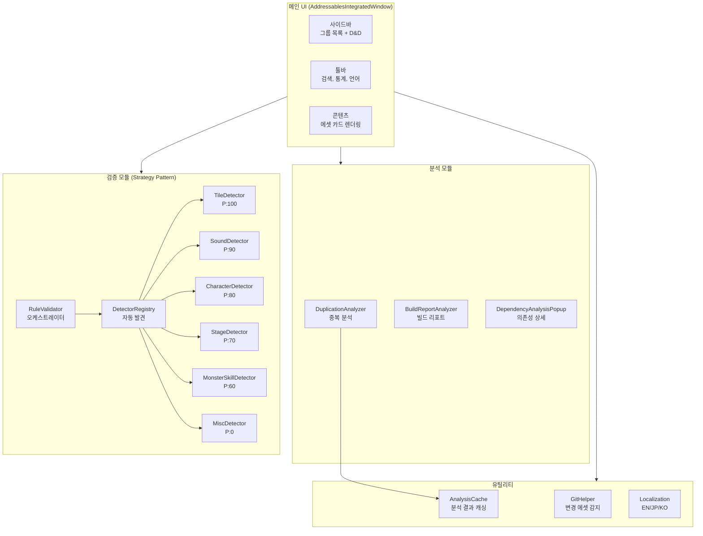
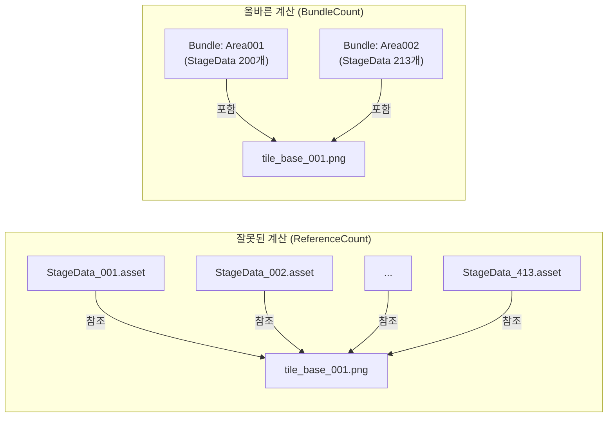

## I. なぜカスタムツールが必要なのか

### 何千ものアセットを手動で管理する痛み

モバイルサバイバージャンルゲームを開発しながら、Addressableで管理しなければならないアセットが指数関数的に増えた。キャラクター、モンスター、スキルエフェクト、ステージデータ、タイルマップ、サウンド…アセット一つ一つを手動でグループに入れて、ラベルを付けて、アドレスを指定するのは現実的に不可能だった。

特に問題になる状況がありました：

- 企画チームでステージアセットを追加しましたが、 Addressable登録を点滅してランタイムにロード失敗
- 同じアセットに複数のラベルが付いてバンドルが重複生成されるのをしばらく後ろに発見
- 「このアセットはどのグループに入れるべきですか？」毎回ルールを確認する費用

### Unity 基本 Analyze ツールの制限

Unity によって組み込まれている Addressable Analyze 機能があります。 「Check Duplicate Bundle Dependencies」のようなルールがあり、重複依存性を検出できる。

しかし、本番レベルで使用するには限界が明確でした。

- **遅い** - プロジェクト全体の分析に数十分かかる
- **結果が不親切である** - アセットパスだけを一覧表示するだけで、どのグループに移動すべきかを教えてくれない
- **ワークフローから分離されている** - 登録、検証、分析がすべて別のウィンドウで行われます

だから自分で作ることにした。

<br>

### 実際に発生した問題：2,226個の重複アセット、2.64GBの無駄

カスタムツールを作成する前に、Unityの基本Analyzeを回したときの結果です。

{: width="400" }
_最初の分析結果：2,226個の冗長アセット、最大2.64GB節約可能_

**原因を掘り下げてみると、3つの重要な問題がありました：**

**1。ナニノベルBGM直接参照（ヒューマンエラー）**

ステージデータから `Naninovel/Audio/BGM/` パスのサウンドを直接参照していた。このため、ナニノベルバンドルのBGM（6.29MB + 6.60MB）が100個以上のステージバンドルに**暗黙的にコピー**され、数百MBが無駄になっていた。

```
문제의 구조:
StageData_Area001 Bundle → BGM_Battle_01.wav (암시적 복사) ─┐
StageData_Area002 Bundle → BGM_Battle_01.wav (암시적 복사) ─┼→ 동일 파일이
StageData_Area003 Bundle → BGM_Battle_01.wav (암시적 복사) ─┘   100+ 번들에 중복!
... (100개 이상의 스테이지 번들)
```

**2。 Pack Separately戦略の罠**

各ステージを個別のバンドルにパッキングすれば独立してロード/アンロードすることができますが、共有アセット(マテリアル、シェーダ、テクスチャ)が**各バンドルに重複含まれ**される。 「Sprite-Unlit-Default」、パブリックタイルテクスチャなどが数百回コピーされていた。

**3。登録規則の不在**

どのアセットをどこに登録するべきか明確なルールがなく、開発者ごとに異なる方法でアセットを配置していた。コードレビューでも重複依存問題を見つけるのは難しかった。

<br>

---

## II。ツールアーキテクチャの設計

### 全体構造



エディタツールを7つのモジュールに分けました：

|モジュール|役割|コアファイル|
|:---|:---|:---|
| **Core** |メインUIウィンドウ| `AddressablesWindow.cs`（Partial Class）|
| **Analyzers** |冗長/依存性/ビルド分析| `DuplicationAnalyzer.cs` |
| **Validators** |アセットタイプの自動検出`IAssetTypeDetector` + 6個の実装
| **タイル** |タイル専用ツール| `TileLabelManager.cs`他7個|
| **Specialized** |ドメイン特化ツール|オーディオ分離、プリロードなど
| **Utilities** |パブリック機能|キャッシュ、Gitインターロック、ローカライズ|
| **レガシー** |レガシー互換|前の一括登録ウィザード|

<br>

### Strategy Patternによるアセットタイプの自動検出

最も重要な設計決定は、**アセットタイプ検出にStrategy Patternを適用**したことです。

ゲームにはさまざまなアセットタイプがあり、それぞれ登録規則が異なります。
- タイルアセットはAreaラベルを貼らなければならない
- サウンドはBGM/SE/VOICEで区切らなければならない
- キャラクタープレハブとポートレートは他のグループに入る
- モンスタースキルの下位依存性(_Bullet, _Effect)は登録してはならない

これを `if/else` で実装するとメンテナンスが不可能になる。代わりにインターフェイスを定義しました：

```csharp
public interface IAssetTypeDetector
{
    /// <summary>
    /// 우선순위. 높을수록 먼저 검사.
    /// </summary>
    int Priority { get; }

    /// <summary>
    /// 이 Detector가 처리할 수 있는 에셋인지 확인.
    /// </summary>
    bool CanHandle(string assetPath);

    /// <summary>
    /// 에셋의 등록 정보(그룹, 라벨, 주소)를 감지.
    /// </summary>
    AssetRegistrationInfo Detect(string assetPath);
}
```

そして、6つのDetectorを優先順位順にチェーンを構成する：

| Detector |優先順位ターゲット|
|:---|:---:|:---|
| `TileAssetDetector` | 100 |タイルアセット（.asset in TileMap /）|
| `SoundAssetDetector` | 90 |オーディオファイル（BGM、SE、VOICE）|
| `CharacterAssetDetector` | 80 |キャラクタープレハブ、ポートレート|
| `StageAssetDetector` | 70 |ステージデータ、マップ|
| `MonsterSkillDetector` | 60 |モンスター/スキルプレハブ
| `MiscAssetDetector` | 0 |イベント、背景、ビデオ（フォールバック）|

**コア：新しいアセットタイプが追加されたら、Detectorクラスを1つ作成するだけです。

```csharp
public static class DetectorRegistry
{
    private static List<IAssetTypeDetector> cachedDetectors;

    public static IReadOnlyList<IAssetTypeDetector> GetDetectors()
    {
        if (cachedDetectors == null)
            cachedDetectors = DiscoverDetectors();
        return cachedDetectors;
    }

    private static List<IAssetTypeDetector> DiscoverDetectors()
    {
        var detectorType = typeof(IAssetTypeDetector);
        return Assembly.GetExecutingAssembly().GetTypes()
            .Where(t => detectorType.IsAssignableFrom(t) && !t.IsInterface && !t.IsAbstract)
            .Select(t => Activator.CreateInstance(t) as IAssetTypeDetector)
            .Where(d => d != null)
            .OrderByDescending(d => d.Priority)
            .ToList();
    }
}
```

Open/Closed Principleに忠実に従う仕組みだ。拡張には開いており、修正には閉じている。

<br>

### Partial Classで巨大なエディタウィンドウを管理する

メインUIの「AddressablesIntegratedWindow」は機能が多いので、コードが膨大になるしかなかった。これを1つのファイルに入れると読めなくなるので、**Partial Class**に分割した。

```
AddressablesWindow.cs          // Core: OnGUI, 라이프사이클
AddressablesWindow.Sidebar.cs  // 사이드바 렌더링
AddressablesWindow.Toolbar.cs  // 툴바 렌더링
AddressablesWindow.Content.cs  // 에셋 카드 렌더링
AddressablesWindow.DragDrop.cs // 드래그 앤 드롭
AddressablesWindow.Data.cs     // 데이터 로딩/필터링
AddressablesWindow.Validation.cs // 검증 로직
AddressablesWindow.Registration.cs // 등록 로직
```

各ファイルが単一の責任を持ちながらも同じクラスのメンバーにアクセスできるため、機能別に独立した管理が可能です。

<br>

---

## III。 38GB ゴースト重複イベント

### 発端：分析結果38GB...実際のバンドルは3〜4GB？

ツールの分析機能を開発して初めて実行したとき、衝撃的な数字が出た。

> **予想重複サイズ：38.13 GB**

実際にビルドされたバンドルの総サイズは3～4GB程度なのに、重複だけ38GBって？明らかに何かが間違っていた。

CSVにエクスポートして確認してみると原因がわかった。例えば ​​`tile_base_001.png` の解析結果:

```
tile_base_001.png:
  - ReferenceCount: 413
  - Size: 1,824,570 bytes (1.74MB)
  - SuggestedGroup: StageShared
```

このテクスチャ 1 つの推定無駄サイズ: **1.74MB x (413 - 1) = ~717MB**

1つのファイルの重複が717MB？こういうファイルが数百個だと合わせれば38GBになるのだった。

<br>

### 原因: ReferenceCount vs BundleCount

問題の核心は**「アセット数」と「バンドル数」を混同**したことだった。

私たちのプロジェクトは、StageDataグループに**Pack Together By Label**モードを使用します。このモードでは、同じラベルが付いたすべてのアセットが**1つのバンドル**にまとめられています。



**間違った計算:**

$$\text{重複サイズ} = \text{Size} \times (\text{ReferenceCount} - 1) = 1.74\text{MB} \times 412 = 717\text{MB}$$

**正しい計算：**

$$\text{重複サイズ} = \text{Size} \times (\text{BundleCount} - 1) = 1.74\text{MB} \times(2 - 1) = 1.74\text{MB}$$

413個のアセットが参照されていますが、Pack Together By Labelモードでは、これらのアセットは** 2個のバンドル**（Area001、Area002）にのみ入ります。実際の重複は717MBではなく1.74MBである。 **約412倍の過大推定**だった。

<br>

### 修正：BundleCountベースの計算

重要な修正は、 `ImplicitDependencyInfo`に**バンドル単位の追跡**を追加したことです：

```csharp
public class ImplicitDependencyInfo
{
    public string DependencyPath;
    public long Size;
    public List<string> ReferencedBy = new List<string>();

    /// <summary>
    /// 이 의존성을 포함하는 고유 번들 목록.
    /// Pack Together By Label 그룹에서는 라벨당 하나의 번들.
    /// </summary>
    public HashSet<string> ReferencingBundles = new HashSet<string>();

    /// <summary>
    /// 실제 중복 번들 수. 중복 계산에는 이 값을 사용해야 한다.
    /// ReferenceCount(에셋 수)가 아닌 BundleCount(번들 수)가 정확한 지표.
    /// </summary>
    public int BundleCount => ReferencingBundles.Count > 0
        ? ReferencingBundles.Count
        : ReferencedBy.Count;
}
```

分析ロジックでバンドルIDを追跡するように変更しました。

```csharp
// 번들 식별자 결정
var bundleIds = new List<string>();
if (isPackByLabelGroup && entry.labels.Count > 0)
{
    // Pack By Label: 라벨 하나 = 번들 하나
    foreach (var label in entry.labels)
        bundleIds.Add($"{group.Name}:{label}");
}
else
{
    // 다른 모드: 에셋별 번들
    bundleIds.Add($"{group.Name}:{entry.address}");
}

// 의존성마다 참조 번들을 기록
foreach (var bundleId in bundleIds)
{
    depInfo.ReferencingBundles.Add(bundleId);  // HashSet이므로 자동 중복 제거
}
```

そして、合計重複サイズの計算もBundleCountに基づいて修正:

```csharp
public long GetEstimatedImplicitDependencySize(bool useCompressionEstimate = true)
{
    long total = 0;
    foreach (var dep in implicitDependencies)
    {
        long effectiveSize = dep.Size;

        if (useCompressionEstimate)
        {
            float compressionRatio = GetEstimatedCompressionRatio(dep.DependencyPath);
            effectiveSize = (long)(dep.Size * compressionRatio);
        }

        // BundleCount 기반 중복 계산 (에셋 수가 아닌 번들 수)
        total += effectiveSize * (dep.BundleCount - 1);
    }
    return total;
}
```

<br>

### 圧縮率推定：ソースサイズ対バンドルサイズ

BundleCountの修正だけでも38GB→数百MBに減ったが、依然として実際より高く出た。理由は、**ソースファイルサイズとバンドル内の実際のサイズが異なるため**です。

3MBのPNGテクスチャがバンドルに入るときは、ASTC/ETC2プラットフォーム圧縮+LZMAバンドル圧縮が適用され、実際には**約450KB**程度になる。

そこで、アセットタイプ別の圧縮率推定値を導入した。

```csharp
private static float GetEstimatedCompressionRatio(string assetPath)
{
    string ext = Path.GetExtension(assetPath).ToLowerInvariant();

    return ext switch
    {
        // 텍스처: 플랫폼 압축(ASTC/ETC2) + LZMA = 매우 효과적
        ".png" or ".jpg" or ".jpeg" or ".tga" or ".psd" => 0.15f,

        // 오디오: 이미 압축되어 있거나 플랫폼 최적화
        ".wav" or ".mp3" or ".ogg" => 0.5f,

        // 프리팹/ScriptableObject: LZMA 압축
        ".prefab" or ".asset" => 0.4f,

        // 머티리얼/셰이더: 중간 수준
        ".mat" or ".shader" => 0.5f,

        // 메시/모델: 복잡도에 따라 다름
        ".fbx" or ".obj" => 0.6f,

        // 기본값: 보수적 추정
        _ => 0.5f
    };
}
```

|アセットタイプ|ソースサイズ|圧縮率推定バンドルサイズ|
|:---:|:---:|:---:|:---:|
| PNGテクスチャ| 3 MB | 0.15x | ** 450 KB** |
|プレハブ100 KB | 0.4x | **40 KB** |
|オーディオ（WAV）| 5 MB | 0.5x | **2.5 MB** |

この見積もりは100％正確ではありませんが、ビルドレポートなしで**合理的なレベルの見積もり**を提供します。

<br>

### Build Report クロスチェック

推定値だけでは不安なので、ビルドレポートがあるときは**実際の値**も一緒に見せるようにした。

```csharp
public static (long totalWaste, int duplicateCount)? GetDuplicationFromBuildReport()
{
    string reportsFolder = "Library/com.unity.addressables/BuildReports";
    if (!Directory.Exists(reportsFolder)) return null;

    var files = Directory.GetFiles(reportsFolder, "buildlayout_*.json")
        .OrderByDescending(f => File.GetLastWriteTime(f))
        .ToArray();

    if (files.Length == 0) return null;

    var report = BuildLayoutReport.Parse(File.ReadAllText(files[0]));

    long totalWaste = 0;
    foreach (var dup in report.DuplicatedAssets)
    {
        if (dup.BundleCount <= 1) continue;
        var asset = report.AllAssets.FirstOrDefault(a => a.Guid == dup.AssetGuid);
        if (asset != null)
            totalWaste += asset.TotalSize * (dup.BundleCount - 1);
    }

    return (totalWaste, report.DuplicatedAssets.Count);
}
```

2段階の表示システム:
1. **推定サイズ**（常に表示） - 圧縮率ベース
2. **ビルドレポートの実際のサイズ**（ビルド後にのみ表示） - 100％正確

<br>

### アナライザのバグ修正結果

|指標修正前修正後
|:---:|:---:|:---:|
|報告された重複サイズ| **38 GB** | **数百MB** |
|精度（ビルドレポートのコントラスト）| 10倍以上の過大実際の値に似ています。
|計算基準アセット数（ReferenceCount）|バンドル数（BundleCount）|

### ツールで実際の重複を解決した成果

アナライザのバグを修正した後、正確な数値に基づいて実際の重複アセットを削除しました。その結果：

{: width="400" }
_重複解決中間プロセス：2,226個→1,752個に減少、最終的に0個達成_

|指標Before | After |改善
|:---|:---:|:---:|:---:|
|重複アセット数2,226個| **0個** | 100％解決|
| Addressables総サイズ| **〜2.4 GB** | 〜900 MB | **1.5 GBの節約（62％）** |
|重複による無駄919.51 MB | 0 MB | **919 MBの節約** |
| StageData総サイズ| 〜500 MB | 〜200 MB | **60％減少** |

>ツールのAnalyzer機能で分析した冗長依存性のリスト。ファイルごとのBundleCountと推奨グループが表示されます。
{：.prompt-info}

{: width="700" }
_カスタムアナライザポップアップ：重複アセットリスト、バンドル数、推奨グループを一目で確認_

### iOSクラッシュ解決(ボーナス)

ビルド容量最適化プロセスで発見されたもう一つの深刻な問題がありました。ステージ切り替え時に **TilemapRenderer が Addressable アセットを参照している状態で `ReleaseAssets()` が呼び出**されると iOS でクラッシュが発生するものだった。

解決策は簡単でしたが、原因を見つけるまでは困難でした：

```csharp
public void OnExitStage()
{
    // 1. 렌더러 먼저 비활성화 (메모리 참조 차단)
    DisableTilemapRenderers();

    // 2. 씬 정리 대기
    await UniTask.Yield();

    // 3. 안전하게 에셋 해제
    ReleaseAssets();
}
```

|指標Before | After |
|:---:|:---:|:---:|
|ホームトランジションクラッシュ頻繁に発生| **0件** |
| iPhone 8 Plus（3GB）12回テスト|クラッシュ**通常動作** |

<br>

---

## IV。コア機能の詳細

### バックグラウンド分析(UIフリージング防止)

何千ものアセット依存性を分析すると、エディタが停止する問題がありました。解決策は**フレーム単位チャンク処理**:

```csharp
private const int EntriesPerFrame = 5;

private void ProcessBackgroundAnalysisChunk()
{
    if (backgroundState.IsCancelled)
    {
        FinishBackgroundAnalysis(false);
        return;
    }

    // 프레임당 5개씩 처리
    int processed = 0;
    while (processed < EntriesPerFrame &&
           backgroundState.ProcessedEntries < entriesToAnalyze.Count)
    {
        var (group, entry) = entriesToAnalyze[backgroundState.ProcessedEntries];
        ProcessSingleEntry(group, entry);
        backgroundState.ProcessedEntries++;
        processed++;
    }

    // 진행률 콜백
    backgroundState.OnProgress?.Invoke(backgroundState.Progress, backgroundState.CurrentAsset);

    // 완료 체크
    if (backgroundState.ProcessedEntries >= entriesToAnalyze.Count)
    {
        FinalizeImplicitDependencies();
        FinishBackgroundAnalysis(true);
    }
}
```

`EditorApplication.update`に登録し、フレームごとに5つのアセットのみを処理します。ユーザーは、プログレスバーと現在分析中のアセット名をリアルタイムで表示できます。

<br>

### Gitインターロック：変更されたアセットのみを自動ロード

毎回アセット全体をスキャンするのは非効率的です。 `GitHelper`が`git diff`を実行して**最近変更されたアセットのみ**を自動的に呼び出す：

```csharp
public static List<string> GetModifiedAssets(bool myChangesOnly)
{
    return modifiedFiles
        .Where(f => IsRegistrableAsset(f))
        .Where(f => IsInAssetPaths(f))
        .Where(f => !ShouldExcludeFromRegistration(f))
        .Distinct()
        .ToList();
}
```

登録可能なアセットか、追跡対象フォルダにあるのか、依存性アセットではないかまでフィルタリングします。

<br>

### ツールのデモ：フィードバックベースの改善

企画者、デザイナーなど、非開発者のチームメンバーに継続的にフィードバックを受けながらツールを改善した。

<video width="720" controls muted>
  <source src="/assets/img/post/unity/addressable-analyzer/tool_feedback_demo.mp4" type="video/mp4">
</video>
_ツールUIデモンストレーション - アセットカード、グループフィルタリング、ドラッグアンドドロップ登録プロセス_

<br>

### アセット登録時間の短縮

|仕事| Before（手動）| After（ツール）|改善率
|:---|:---:|:---:|:---:|
|アセット1個登録| 30秒〜1分| 5秒（クリック2回）| **90％短縮** |
|アセット100個登録| 50分〜100分| 5分**90〜95％短縮** |
|未登録アセットナビゲーション|手動不可能3秒（自動スキャン）| **無限大** |
|間違ったグループ配置が見つかりました。コードレビュー依存|自動検出** 0件** | **100%** |

<br>

### 3カ国語ローカライゼーション（企画者コラボレーション用）

このツールは開発者だけでなく、**日本人企画者、韓国人開発者**も使用する。それで、英語、日本語、韓国語の3つの言語をサポートしました：

```csharp
public static readonly Dictionary<string, Dictionary<Language, string>> localizations = new()
{
    ["btn_register"] = new() {
        [Language.English]  = "Register",
        [Language.Japanese] = "登録",
        [Language.Korean]   = "등록"
    },
    // 500+ 항목
};
```

1行ヘルパーで呼び出す：
```csharp
private static string L(string key) => AddressablesLocalization.Get(key);
EditorGUILayout.LabelField(L("btn_register"));
```

<br>

---

## V. AIコラボレーションによるツールの作成

### Claude Codeで38GBのバグをデバッグ

38GBゴースト重複バグを発見した後、Claude Codeを活用して原因を診断して修正した。実際の会話の流れはこうだった:

**ステップ1：問題を提起**
```
나: "38GB라는 수치가 비정상적인거같은데..
    현재 번들 크기만 압축된거랑 10배이상 차이나는거같아"
    (CSV 파일 + 스크린샷 첨부)
```

**ステップ2：Claudeのデータ分析**
- CSVで `tile_base_001.png`のRefCount=413、Size=1.74MBを発見
- 「この一つのファイル重複が717MBと計算されている」と指摘
- Pack Together By Labelモードでバンドルを生成する方法の説明

**ステップ3：修正案の提案**

Claudeが3つのアプローチを提案した：
1. **BundleCount追跡** - HashSetで実際のバンドル数を計算する
2. **圧縮率推定** - アセットタイプ別 compression ratio 適用
3. **ビルドレポート連動** - 実際の値のクロスチェック（オプション）

**ステップ4：実装+検証**

38のメッセージ、1つのセッションで `DuplicationAnalyzer.cs`、 `AnalyzerPopup.cs`、 `AnalysisCache.cs`の3つのファイルを修正して解決しました。

### エディタツール開発におけるAIの長所と短所

**AIが得意なこと：**
- データ解析(CSV解析、異常値検出)
- アルゴリズムロジックの論理エラー指摘
- 複数の変更ファイル間の一貫性を維持
- ボイラープレートコード生成（IMGUIレイアウトなど）

**AIにとって難しいこと：**
- IMGUIの視覚的成果物の予測（どのように見えるかを直接確認する必要があります）
- Unity Editorのリアルタイム状態の把握(Addressable Settingsの現在の構成など)
- ドラッグアンドドロップのようなインタラクションロジックのエッジケース

結論として、**ロジック/分析はAIに任せ、UI/UX検証は直接確認する**分業が効果的だった。

<br>

---

## VI.回顧

### 総合成果

|カテゴリー指標数字
|:---|:---|:---|
| **ビルドの最適化** | Addressables総サイズ| 2.4GB→900MB（**62％削減**）|
| |冗長アセット| 2,226個→0個（**100％解決**）|
| |重複無駄919MB→0MB |
| **安定性** | iOSクラッシュ|頻度→**0件** |
| **生産性** |アセット100個登録| 100分→5分（**95％短縮**）|
| |未登録アセットナビゲーション|不可能→3秒|
| |無効なグループの配置頻度→**自動検出** |
| **開発** |ツール開発期間| **約2週間**（AIコラボレーション）|
| |コード行数| **3,000+**ライン|
| |サポートアセットタイプ| **15+** |
| |サポート言語| 3個（EN / JP / KO）|

### 教訓

**1。 「アセット数」と「バンドル数」は異なる**

AddressableのPack Together By Labelモードでこの2つを混同すると、数百倍過大推定が発生する。これは文書によく出ない実戦罠だ。

**2。見積もりには常にクロスチェックが必要です**

圧縮率の推定だけでは不安である。ビルドレポートと比較できるパスを必ず用意しておこう。

**3。拡張可能な設計は長期的に時間を節約します**

Strategy Pattern + Auto-Discoveryで新しいアセットタイプを追加するコストが「クラス1つ作成」に減った。最初にインターフェイスを設計するのに時間がかかりましたが、その後6回のDetector追加でその投資を回収しました。

**4。ルールをコードに埋め込むとヒューマンエラーが消える**

ナニノベルBGM直接参照のようなミスは人がレビューして捕まえにくい。ツールが**登録時に自動検出**するようにルールをコード化すると、同じ間違いは繰り返されません。

**5。 AIツールは「方向提示」に強い**

38GBのバグの場合、データを見ると、ClaudeがBundleCountとReferenceCountの違いを見つけました。人間がCSVを1行ずつ読みながらパターンを探すよりもはるかに速かった。 2週間で3,000+ラインのプロダクションエディタツールを完成できたのもAIコラボレーションのおかげだ。

<br>

---

## 参考資料

- [Unity Addressable System 公式文書](https://docs.unity3d.com/Packages/com.unity.addressables@latest)
- [シリーズ1編 - Addressable Operating Principle](/posts/UnityAddressable/)
- [シリーズ2編 - Addressable Update Work Flow](/posts/UnityAddressable2/)
- [シリーズ3編 - Addressable Internal Memory Structure](/posts/UnityAddressableMemory/)
