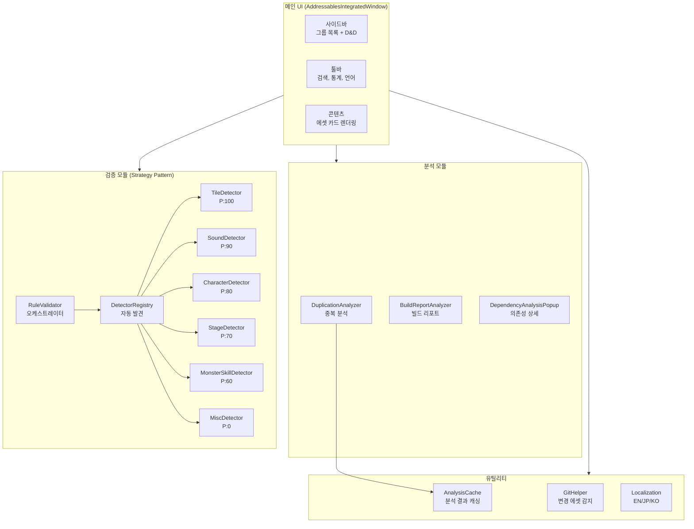
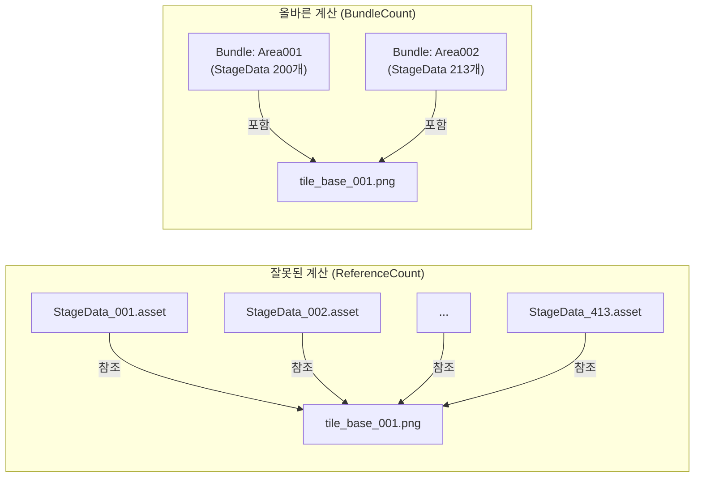

[](https://hits.sh/epheria.github.io/)

<br>

## 시리즈 안내

> 이 글은 Unity Addressable 시리즈의 4편입니다.
> - [1편 - Operating Principle and Usage](/posts/UnityAddressable/)
> - [2편 - Update Work Flow And Management](/posts/UnityAddressable2/)
> - [3편 - Internal Memory Structure and Asset Bundle](/posts/UnityAddressableMemory/)
> - **4편 - 커스텀 분석 도구 제작기 (이 글)**

<br>

---

## I. 왜 커스텀 도구가 필요했나

### 수천 개 에셋을 수동으로 관리하는 고통

모바일 서바이버 장르 게임을 개발하면서 Addressable로 관리해야 하는 에셋이 기하급수적으로 늘어났다. 캐릭터, 몬스터, 스킬 이펙트, 스테이지 데이터, 타일맵, 사운드... 에셋 하나하나를 수동으로 그룹에 넣고, 라벨을 붙이고, 주소를 지정하는 건 현실적으로 불가능했다.

특히 문제가 되는 상황들이 있었다:

- 기획팀에서 스테이지 에셋을 추가했는데, Addressable 등록을 깜빡해서 런타임에 로드 실패
- 같은 에셋에 여러 라벨이 붙어서 번들이 중복 생성되는 걸 한참 뒤에야 발견
- "이 에셋은 어느 그룹에 넣어야 하지?" 매번 규칙을 확인하는 비용

### Unity 기본 Analyze 도구의 한계

Unity에서 기본 제공하는 Addressable Analyze 기능이 있긴 하다. `Check Duplicate Bundle Dependencies` 같은 룰이 있어서 중복 의존성을 탐지할 수 있다.

하지만 프로덕션 레벨에서 사용하기에는 한계가 명확했다:

- **느리다** - 전체 프로젝트 분석에 수십 분이 걸린다
- **결과가 불친절하다** - 에셋 경로만 나열해줄 뿐, 어느 그룹으로 옮겨야 하는지 알려주지 않는다
- **워크플로우와 분리되어 있다** - 등록, 검증, 분석이 모두 다른 창에서 이루어진다

그래서 직접 만들기로 했다.

<br>

### 실제로 발생한 문제: 2,226개 중복 에셋, 2.64GB 낭비

커스텀 도구를 만들기 전, Unity의 기본 Analyze를 돌렸을 때 나온 결과다:

{: width="400" }
_최초 분석 결과: 2,226개 중복 에셋, 최대 2.64GB 절감 가능_

**원인을 파고들어보니 세 가지 핵심 문제가 있었다:**

**1. 나니노벨 BGM 직접 참조 (휴먼 에러)**

스테이지 데이터에서 `Naninovel/Audio/BGM/` 경로의 사운드를 직접 참조하고 있었다. 이 때문에 나니노벨 번들의 BGM(6.29MB + 6.60MB)이 100개 이상의 스테이지 번들에 **암시적으로 복사**되어 수백 MB가 낭비되고 있었다.

```
문제의 구조:
StageData_Area001 Bundle → BGM_Battle_01.wav (암시적 복사) ─┐
StageData_Area002 Bundle → BGM_Battle_01.wav (암시적 복사) ─┼→ 동일 파일이
StageData_Area003 Bundle → BGM_Battle_01.wav (암시적 복사) ─┘   100+ 번들에 중복!
... (100개 이상의 스테이지 번들)
```

**2. Pack Separately 전략의 함정**

각 스테이지를 개별 번들로 패킹하면 독립적으로 로딩/언로딩할 수 있어 좋지만, 공유 에셋(머티리얼, 셰이더, 텍스처)이 **각 번들에 중복 포함**된다. `Sprite-Unlit-Default`, 공용 타일 텍스처 등이 수백 번 복사되고 있었다.

**3. 등록 규칙의 부재**

어떤 에셋을 어디에 등록해야 하는지 명확한 규칙이 없어서, 개발자마다 다른 방식으로 에셋을 배치하고 있었다. 코드 리뷰에서도 중복 종속 문제를 발견하기 어려웠다.

<br>

---

## II. 도구 아키텍처 설계

### 전체 구조



에디터 도구를 7개 모듈로 나누었다:

| 모듈 | 역할 | 핵심 파일 |
|:---|:---|:---|
| **Core** | 메인 UI 윈도우 | `AddressablesWindow.cs` (Partial Class) |
| **Analyzers** | 중복/의존성/빌드 분석 | `DuplicationAnalyzer.cs` |
| **Validators** | 에셋 타입 자동 감지 | `IAssetTypeDetector` + 6개 구현체 |
| **Tiles** | 타일 전용 도구 | `TileLabelManager.cs` 외 7개 |
| **Specialized** | 도메인 특화 도구 | 오디오 분리, 프리로드 등 |
| **Utilities** | 공용 기능 | 캐싱, Git 연동, 로컬라이제이션 |
| **Legacy** | 레거시 호환 | 이전 일괄 등록 마법사 |

<br>

### Strategy Pattern으로 에셋 타입 자동 감지

가장 핵심적인 설계 결정은 **에셋 타입 감지에 Strategy Pattern을 적용**한 것이다.

게임에는 다양한 에셋 타입이 존재하고, 각각 등록 규칙이 다르다:
- 타일 에셋은 Area 라벨을 붙여야 한다
- 사운드는 BGM/SE/VOICE로 구분해야 한다
- 캐릭터 프리팹과 포트레이트는 다른 그룹에 들어간다
- 몬스터 스킬의 하위 의존성(_Bullet, _Effect)은 등록하면 안 된다

이걸 `if/else`로 구현하면 유지보수가 불가능해진다. 대신 인터페이스를 정의했다:

```csharp
public interface IAssetTypeDetector
{
    /// <summary>
    /// 우선순위. 높을수록 먼저 검사.
    /// </summary>
    int Priority { get; }

    /// <summary>
    /// 이 Detector가 처리할 수 있는 에셋인지 확인.
    /// </summary>
    bool CanHandle(string assetPath);

    /// <summary>
    /// 에셋의 등록 정보(그룹, 라벨, 주소)를 감지.
    /// </summary>
    AssetRegistrationInfo Detect(string assetPath);
}
```

그리고 6개의 Detector를 우선순위 순으로 체인을 구성한다:

| Detector | 우선순위 | 대상 |
|:---|:---:|:---|
| `TileAssetDetector` | 100 | 타일 에셋 (.asset in TileMap/) |
| `SoundAssetDetector` | 90 | 오디오 파일 (BGM, SE, VOICE) |
| `CharacterAssetDetector` | 80 | 캐릭터 프리팹, 포트레이트 |
| `StageAssetDetector` | 70 | 스테이지 데이터, 맵 |
| `MonsterSkillDetector` | 60 | 몬스터/스킬 프리팹 |
| `MiscAssetDetector` | 0 | 이벤트, 배경, 비디오 (폴백) |

**핵심: 새로운 에셋 타입이 추가되면 Detector 클래스 하나만 만들면 된다.** `DetectorRegistry`가 리플렉션으로 자동 발견하기 때문에 기존 코드를 수정할 필요가 없다:

```csharp
public static class DetectorRegistry
{
    private static List<IAssetTypeDetector> cachedDetectors;

    public static IReadOnlyList<IAssetTypeDetector> GetDetectors()
    {
        if (cachedDetectors == null)
            cachedDetectors = DiscoverDetectors();
        return cachedDetectors;
    }

    private static List<IAssetTypeDetector> DiscoverDetectors()
    {
        var detectorType = typeof(IAssetTypeDetector);
        return Assembly.GetExecutingAssembly().GetTypes()
            .Where(t => detectorType.IsAssignableFrom(t) && !t.IsInterface && !t.IsAbstract)
            .Select(t => Activator.CreateInstance(t) as IAssetTypeDetector)
            .Where(d => d != null)
            .OrderByDescending(d => d.Priority)
            .ToList();
    }
}
```

Open/Closed Principle을 충실히 따르는 구조다. 확장에는 열려 있고, 수정에는 닫혀 있다.

<br>

### Partial Class로 거대한 에디터 윈도우 관리하기

메인 UI인 `AddressablesIntegratedWindow`는 기능이 많다 보니 코드가 방대해질 수밖에 없었다. 이걸 하나의 파일에 넣으면 읽을 수 없게 되므로 **Partial Class**로 분할했다:

```
AddressablesWindow.cs          // Core: OnGUI, 라이프사이클
AddressablesWindow.Sidebar.cs  // 사이드바 렌더링
AddressablesWindow.Toolbar.cs  // 툴바 렌더링
AddressablesWindow.Content.cs  // 에셋 카드 렌더링
AddressablesWindow.DragDrop.cs // 드래그 앤 드롭
AddressablesWindow.Data.cs     // 데이터 로딩/필터링
AddressablesWindow.Validation.cs // 검증 로직
AddressablesWindow.Registration.cs // 등록 로직
```

각 파일이 단일 책임을 가지면서도 같은 클래스의 멤버에 접근할 수 있어서, 기능별로 독립적인 관리가 가능하다.

<br>

---

## III. 38GB 유령 중복 사건

### 발단: 분석 결과 38GB... 실제 번들은 3~4GB?

도구의 분석 기능을 개발하고 처음 실행했을 때, 충격적인 숫자가 떴다.

> **예상 중복 크기: 38.13 GB**

실제 빌드된 번들의 총 크기는 3~4GB 정도인데, 중복만 38GB라니? 명백히 뭔가 잘못되었다.

CSV로 내보내서 확인해보니 원인을 알 수 있었다. 예를 들어 `tile_base_001.png`의 분석 결과:

```
tile_base_001.png:
  - ReferenceCount: 413
  - Size: 1,824,570 bytes (1.74MB)
  - SuggestedGroup: StageShared
```

이 텍스처 하나의 예상 낭비 크기: **1.74MB x (413 - 1) = ~717MB**

한 파일의 중복이 717MB? 이런 파일이 수백 개니 합치면 38GB가 되는 것이었다.

<br>

### 원인: ReferenceCount vs BundleCount

문제의 핵심은 **"에셋 수"와 "번들 수"를 혼동**한 것이었다.

우리 프로젝트는 StageData 그룹에 **Pack Together By Label** 모드를 사용한다. 이 모드에서는 같은 라벨이 붙은 모든 에셋이 **하나의 번들**로 묶인다.



**잘못된 계산:**

$$\text{중복 크기} = \text{Size} \times (\text{ReferenceCount} - 1) = 1.74\text{MB} \times 412 = 717\text{MB}$$

**올바른 계산:**

$$\text{중복 크기} = \text{Size} \times (\text{BundleCount} - 1) = 1.74\text{MB} \times (2 - 1) = 1.74\text{MB}$$

413개 에셋이 참조하지만, Pack Together By Label 모드에서 이 에셋들은 **2개의 번들**(Area001, Area002)에만 들어간다. 실제 중복은 717MB가 아니라 1.74MB인 것이다. **약 412배의 과대 추정**이었다.

<br>

### 수정: BundleCount 기반 계산

핵심 수정은 `ImplicitDependencyInfo`에 **번들 단위 추적**을 추가한 것이다:

```csharp
public class ImplicitDependencyInfo
{
    public string DependencyPath;
    public long Size;
    public List<string> ReferencedBy = new List<string>();

    /// <summary>
    /// 이 의존성을 포함하는 고유 번들 목록.
    /// Pack Together By Label 그룹에서는 라벨당 하나의 번들.
    /// </summary>
    public HashSet<string> ReferencingBundles = new HashSet<string>();

    /// <summary>
    /// 실제 중복 번들 수. 중복 계산에는 이 값을 사용해야 한다.
    /// ReferenceCount(에셋 수)가 아닌 BundleCount(번들 수)가 정확한 지표.
    /// </summary>
    public int BundleCount => ReferencingBundles.Count > 0
        ? ReferencingBundles.Count
        : ReferencedBy.Count;
}
```

분석 로직에서 번들 ID를 추적하도록 변경했다:

```csharp
// 번들 식별자 결정
var bundleIds = new List<string>();
if (isPackByLabelGroup && entry.labels.Count > 0)
{
    // Pack By Label: 라벨 하나 = 번들 하나
    foreach (var label in entry.labels)
        bundleIds.Add($"{group.Name}:{label}");
}
else
{
    // 다른 모드: 에셋별 번들
    bundleIds.Add($"{group.Name}:{entry.address}");
}

// 의존성마다 참조 번들을 기록
foreach (var bundleId in bundleIds)
{
    depInfo.ReferencingBundles.Add(bundleId);  // HashSet이므로 자동 중복 제거
}
```

그리고 총 중복 크기 계산도 BundleCount 기반으로 수정:

```csharp
public long GetEstimatedImplicitDependencySize(bool useCompressionEstimate = true)
{
    long total = 0;
    foreach (var dep in implicitDependencies)
    {
        long effectiveSize = dep.Size;

        if (useCompressionEstimate)
        {
            float compressionRatio = GetEstimatedCompressionRatio(dep.DependencyPath);
            effectiveSize = (long)(dep.Size * compressionRatio);
        }

        // BundleCount 기반 중복 계산 (에셋 수가 아닌 번들 수)
        total += effectiveSize * (dep.BundleCount - 1);
    }
    return total;
}
```

<br>

### 압축률 추정: 소스 크기 vs 번들 크기

BundleCount 수정만으로도 38GB → 수백 MB로 줄었지만, 여전히 실제보다 높게 나왔다. 이유는 **소스 파일 크기와 번들 안의 실제 크기가 다르기 때문**이다.

3MB짜리 PNG 텍스처가 번들에 들어갈 때는 ASTC/ETC2 플랫폼 압축 + LZMA 번들 압축이 적용되어 실제로는 **약 450KB** 정도가 된다.

그래서 에셋 타입별 압축률 추정치를 도입했다:

```csharp
private static float GetEstimatedCompressionRatio(string assetPath)
{
    string ext = Path.GetExtension(assetPath).ToLowerInvariant();

    return ext switch
    {
        // 텍스처: 플랫폼 압축(ASTC/ETC2) + LZMA = 매우 효과적
        ".png" or ".jpg" or ".jpeg" or ".tga" or ".psd" => 0.15f,

        // 오디오: 이미 압축되어 있거나 플랫폼 최적화
        ".wav" or ".mp3" or ".ogg" => 0.5f,

        // 프리팹/ScriptableObject: LZMA 압축
        ".prefab" or ".asset" => 0.4f,

        // 머티리얼/셰이더: 중간 수준
        ".mat" or ".shader" => 0.5f,

        // 메시/모델: 복잡도에 따라 다름
        ".fbx" or ".obj" => 0.6f,

        // 기본값: 보수적 추정
        _ => 0.5f
    };
}
```

| 에셋 타입 | 소스 크기 | 압축률 | 추정 번들 크기 |
|:---:|:---:|:---:|:---:|
| PNG 텍스처 | 3 MB | 0.15x | **450 KB** |
| 프리팹 | 100 KB | 0.4x | **40 KB** |
| 오디오 (WAV) | 5 MB | 0.5x | **2.5 MB** |

이 추정치는 100% 정확하지는 않지만, 빌드 리포트 없이도 **합리적인 수준의 예상치**를 제공한다.

<br>

### Build Report 크로스 체킹

추정치만으로는 불안하니, 빌드 리포트가 있을 때는 **실제 값**도 함께 보여주도록 했다:

```csharp
public static (long totalWaste, int duplicateCount)? GetDuplicationFromBuildReport()
{
    string reportsFolder = "Library/com.unity.addressables/BuildReports";
    if (!Directory.Exists(reportsFolder)) return null;

    var files = Directory.GetFiles(reportsFolder, "buildlayout_*.json")
        .OrderByDescending(f => File.GetLastWriteTime(f))
        .ToArray();

    if (files.Length == 0) return null;

    var report = BuildLayoutReport.Parse(File.ReadAllText(files[0]));

    long totalWaste = 0;
    foreach (var dup in report.DuplicatedAssets)
    {
        if (dup.BundleCount <= 1) continue;
        var asset = report.AllAssets.FirstOrDefault(a => a.Guid == dup.AssetGuid);
        if (asset != null)
            totalWaste += asset.TotalSize * (dup.BundleCount - 1);
    }

    return (totalWaste, report.DuplicatedAssets.Count);
}
```

2단계 표시 체계:
1. **추정 크기** (항상 표시) - 압축률 기반
2. **빌드 리포트 실제 크기** (빌드 후에만 표시) - 100% 정확

<br>

### 분석기 버그 수정 결과

| 지표 | 수정 전 | 수정 후 |
|:---:|:---:|:---:|
| 보고된 중복 크기 | **38 GB** | **수백 MB** |
| 정확도 (빌드 리포트 대비) | 10배 이상 과대 | 실제 값과 유사 |
| 계산 기준 | 에셋 수 (ReferenceCount) | 번들 수 (BundleCount) |

### 도구로 실제 중복을 해결한 성과

분석기 버그를 수정한 뒤, 정확한 수치를 기반으로 실제 중복 에셋을 제거했다. 그 결과:

{: width="400" }
_중복 해결 중간 과정: 2,226개 → 1,752개로 감소, 최종적으로 0개 달성_

| 지표 | Before | After | 개선 |
|:---|:---:|:---:|:---:|
| 중복 에셋 수 | 2,226개 | **0개** | 100% 해결 |
| Addressables 총 크기 | **~2.4 GB** | ~900 MB | **1.5 GB 절감 (62%)** |
| 중복으로 인한 낭비 | 919.51 MB | 0 MB | **919 MB 절감** |
| StageData 총 크기 | ~500 MB | ~200 MB | **60% 감소** |

> 도구의 Analyzer 기능으로 분석한 중복 의존성 목록. 파일별 BundleCount와 추천 그룹이 표시된다.
{: .prompt-info }

{: width="700" }
_커스텀 Analyzer 팝업: 중복 에셋 목록, 번들 수, 추천 그룹을 한눈에 확인_

### iOS 크래시 해결 (보너스)

빌드 용량 최적화 과정에서 발견한 또 다른 심각한 문제가 있었다. 스테이지 전환 시 **TilemapRenderer가 Addressable 에셋을 참조하고 있는 상태에서 `ReleaseAssets()`가 호출**되면 iOS에서 크래시가 발생하는 것이었다.

해결 방법은 간단했지만, 원인을 찾기까지가 어려웠다:

```csharp
public void OnExitStage()
{
    // 1. 렌더러 먼저 비활성화 (메모리 참조 차단)
    DisableTilemapRenderers();

    // 2. 씬 정리 대기
    await UniTask.Yield();

    // 3. 안전하게 에셋 해제
    ReleaseAssets();
}
```

| 지표 | Before | After |
|:---:|:---:|:---:|
| 홈 전환 크래시 | 빈번 발생 | **0건** |
| iPhone 8 Plus (3GB) 12회 테스트 | 크래시 | **정상 동작** |

<br>

---

## IV. 핵심 기능 상세

### 백그라운드 분석 (UI 프리징 방지)

수천 개의 에셋 의존성을 분석하면 에디터가 멈추는 문제가 있었다. 해결책은 **프레임 단위 청크 처리**:

```csharp
private const int EntriesPerFrame = 5;

private void ProcessBackgroundAnalysisChunk()
{
    if (backgroundState.IsCancelled)
    {
        FinishBackgroundAnalysis(false);
        return;
    }

    // 프레임당 5개씩 처리
    int processed = 0;
    while (processed < EntriesPerFrame &&
           backgroundState.ProcessedEntries < entriesToAnalyze.Count)
    {
        var (group, entry) = entriesToAnalyze[backgroundState.ProcessedEntries];
        ProcessSingleEntry(group, entry);
        backgroundState.ProcessedEntries++;
        processed++;
    }

    // 진행률 콜백
    backgroundState.OnProgress?.Invoke(backgroundState.Progress, backgroundState.CurrentAsset);

    // 완료 체크
    if (backgroundState.ProcessedEntries >= entriesToAnalyze.Count)
    {
        FinalizeImplicitDependencies();
        FinishBackgroundAnalysis(true);
    }
}
```

`EditorApplication.update`에 등록하여 매 프레임 5개의 에셋만 처리한다. 사용자는 프로그레스 바와 현재 분석 중인 에셋 이름을 실시간으로 볼 수 있다.

<br>

### Git 연동: 변경된 에셋만 자동 로드

매번 전체 에셋을 스캔하는 것은 비효율적이다. `GitHelper`가 `git diff`를 실행해서 **최근 변경된 에셋만** 자동으로 불러온다:

```csharp
public static List<string> GetModifiedAssets(bool myChangesOnly)
{
    return modifiedFiles
        .Where(f => IsRegistrableAsset(f))
        .Where(f => IsInAssetPaths(f))
        .Where(f => !ShouldExcludeFromRegistration(f))
        .Distinct()
        .ToList();
}
```

등록 가능한 에셋인지, 추적 대상 폴더에 있는지, 의존성 에셋은 아닌지까지 필터링한다.

<br>

### 도구 시연: 피드백 기반 개선

기획자, 디자이너 등 비개발자 팀원들에게 지속적으로 피드백을 받으며 도구를 개선했다:

<video width="720" controls muted>
  <source src="/assets/img/post/unity/addressable-analyzer/tool_feedback_demo.mp4" type="video/mp4">
</video>
_도구 UI 시연 - 에셋 카드, 그룹 필터링, 드래그 앤 드롭 등록 과정_

<br>

### 에셋 등록 시간 단축

| 작업 | Before (수동) | After (도구) | 개선율 |
|:---|:---:|:---:|:---:|
| 에셋 1개 등록 | 30초~1분 | 5초 (클릭 2회) | **90% 단축** |
| 에셋 100개 등록 | 50분~100분 | 5분 | **90~95% 단축** |
| 미등록 에셋 탐색 | 수동 불가능 | 3초 (자동 스캔) | **무한대** |
| 잘못된 그룹 배치 발견 | 코드리뷰 의존 | 자동 감지 **0건** | **100%** |

<br>

### 3개 국어 로컬라이제이션 (기획자 협업용)

이 도구는 개발자뿐 아니라 **일본인 기획자, 한국인 개발자**도 사용한다. 그래서 영어, 일본어, 한국어 3개 국어를 지원했다:

```csharp
public static readonly Dictionary<string, Dictionary<Language, string>> localizations = new()
{
    ["btn_register"] = new() {
        [Language.English]  = "Register",
        [Language.Japanese] = "登録",
        [Language.Korean]   = "등록"
    },
    // 500+ 항목
};
```

한 줄 헬퍼로 호출:
```csharp
private static string L(string key) => AddressablesLocalization.Get(key);
EditorGUILayout.LabelField(L("btn_register"));
```

<br>

---

## V. AI 협업으로 도구 만들기

### Claude Code와 함께한 38GB 버그 디버깅

38GB 유령 중복 버그를 발견한 뒤, Claude Code를 활용해서 원인을 진단하고 수정했다. 실제 대화 흐름은 이랬다:

**1단계: 문제 제기**
```
나: "38GB라는 수치가 비정상적인거같은데..
    현재 번들 크기만 압축된거랑 10배이상 차이나는거같아"
    (CSV 파일 + 스크린샷 첨부)
```

**2단계: Claude의 데이터 분석**
- CSV에서 `tile_base_001.png`의 RefCount=413, Size=1.74MB 발견
- "이 하나의 파일 중복이 717MB로 계산되고 있다" 지적
- Pack Together By Label 모드에서의 번들 생성 방식 설명

**3단계: 수정 방안 제안**

Claude가 3가지 접근법을 제안했다:
1. **BundleCount 추적** - HashSet으로 실제 번들 수 계산
2. **압축률 추정** - 에셋 타입별 compression ratio 적용
3. **빌드 리포트 연동** - 실제 값 크로스 체킹 (선택적)

**4단계: 구현 + 검증**

38개 메시지, 1개 세션으로 `DuplicationAnalyzer.cs`, `AnalyzerPopup.cs`, `AnalysisCache.cs` 3개 파일을 수정하여 해결했다.

### 에디터 도구 개발에서 AI의 장단점

**AI가 잘하는 것:**
- 데이터 분석 (CSV 파싱, 이상치 탐지)
- 알고리즘 로직의 논리적 오류 지적
- 여러 수정 파일 간의 일관성 유지
- 보일러플레이트 코드 생성 (IMGUI 레이아웃 등)

**AI에게 어려운 것:**
- IMGUI의 시각적 결과물 예측 (어떻게 보이는지 직접 확인해야 함)
- Unity 에디터의 실시간 상태 파악 (Addressable Settings의 현재 구성 등)
- 드래그 앤 드롭 같은 인터랙션 로직의 엣지 케이스

결론적으로, **로직/분석은 AI에게 맡기고, UI/UX 검증은 직접 확인하는** 분업이 효과적이었다.

<br>

---

## VI. 회고

### 종합 성과

| 카테고리 | 지표 | 수치 |
|:---|:---|:---|
| **빌드 최적화** | Addressables 총 크기 | 2.4GB → 900MB (**62% 절감**) |
| | 중복 에셋 | 2,226개 → 0개 (**100% 해결**) |
| | 중복 낭비 | 919MB → 0MB |
| **안정성** | iOS 크래시 | 빈번 → **0건** |
| **생산성** | 에셋 100개 등록 | 100분 → 5분 (**95% 단축**) |
| | 미등록 에셋 탐색 | 불가능 → 3초 |
| | 잘못된 그룹 배치 | 빈번 → **자동 감지** |
| **개발** | 도구 개발 기간 | **약 2주** (AI 협업) |
| | 코드 라인 수 | **3,000+** 라인 |
| | 지원 에셋 타입 | **15+** |
| | 지원 언어 | 3개 (EN/JP/KO) |

### 교훈

**1. "에셋 수"와 "번들 수"는 다르다**

Addressable의 Pack Together By Label 모드에서 이 둘을 혼동하면 수백 배 과대 추정이 발생한다. 이건 문서에 잘 나오지 않는 실전 함정이다.

**2. 추정치에는 항상 크로스 체킹이 필요하다**

압축률 추정만으로는 불안하다. 빌드 리포트와 비교할 수 있는 경로를 반드시 마련해두자.

**3. 확장 가능한 설계가 장기적으로 시간을 절약한다**

Strategy Pattern + Auto-Discovery로 새 에셋 타입 추가에 드는 비용이 "클래스 하나 만들기"로 줄었다. 처음에 인터페이스를 설계하는 데 시간이 들었지만, 이후 6번의 Detector 추가에서 그 투자를 회수했다.

**4. 규칙을 코드에 내장하면 휴먼 에러가 사라진다**

나니노벨 BGM 직접 참조 같은 실수는 사람이 리뷰해서 잡기 어렵다. 도구가 **등록 시점에 자동 감지**하도록 규칙을 코드화하면 같은 실수가 반복되지 않는다.

**5. AI 도구는 "방향 제시"에 강하다**

38GB 버그의 경우, 데이터를 보여주니 Claude가 바로 BundleCount와 ReferenceCount의 차이를 짚어냈다. 인간이 CSV를 한 줄씩 읽으면서 패턴을 찾는 것보다 훨씬 빨랐다. 2주 만에 3,000+ 라인의 프로덕션 에디터 도구를 완성할 수 있었던 것도 AI 협업 덕분이다.

<br>

---

## 참고자료

- [Unity Addressable System 공식 문서](https://docs.unity3d.com/Packages/com.unity.addressables@latest)
- [시리즈 1편 - Addressable Operating Principle](/posts/UnityAddressable/)
- [시리즈 2편 - Addressable Update Work Flow](/posts/UnityAddressable2/)
- [시리즈 3편 - Addressable Internal Memory Structure](/posts/UnityAddressableMemory/)
