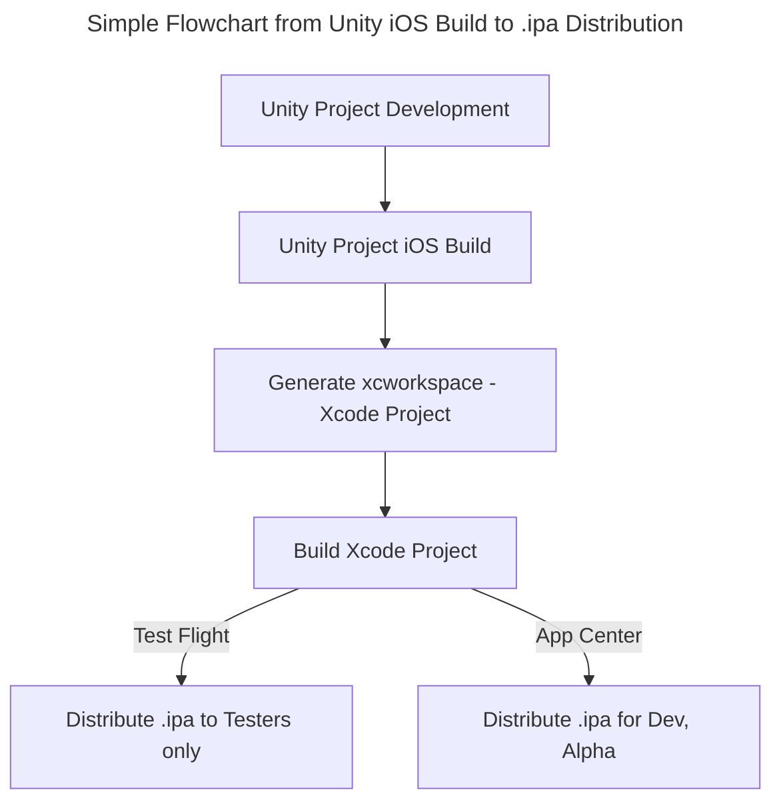

## Table of Contents
> [About Unity iOS Build Process](#unity-ios-build-process)      
> [About Xcode Project Structure (xcworkspace)](#about-xcode-project-xcworkspace-structure)      
> [Unity iOS Build Post-processing Script & Xcode Configuration Automation](#unity-ios-build-post-processing-script--xcode-configuration-automation)      

<br>
<br>

## Unity iOS Build Process

<br>



<br>

#### 1. Unity Project iOS Build

- In Unity Project's Build Settings, select the platform as "iOS".

{: : width="600" .normal }     

- **Caution**: It's better not to manually touch the settings on the right; handle them in automation scripts instead. (However, you can select them when local build profiling is needed.)

<br>

- Enter the Bundle Identifier in Player Settings.

{: : width="600" .normal }     

<br>

- Here, **Bundle Identifier** is a unique string identifying the app. It is used for updates and distribution.
- iOS Bundle Identifiers can be created and managed in Apple Developer - Identifiers.
> {: : width="600" .normal }     

- Also, the Signing Team ID can be checked in the top right corner.
> {: : width="400" .normal }     

- Note that **Version** here refers to the actual App Version, which is different from the Resource Version when managing resources with Addressables.
- App Version is updated every time the build process is renewed (e.g., 1.1.0 -> 1.1.1).

<br>

- You can set Xcode Default Settings in **Settings / Preferences - External Tools**.

> {: : width="800" .normal }     

- If you check the **Automatically Sign** option here:

> {: : width="800" .normal }     

- In the Xcode Project's Signing tab, "Automatically manage signing" becomes enabled, and the Bundle Identifier is set according to the entered Team ID (whether it's enterprise or not).

<br>

- Click **Assets - External Dependency Manager - iOS Resolver - Settings** in the Unity top toolbar to open iOS Resolver Settings.

> {: : width="500" .normal }     

- Things to look at here:
> 1. **Podfile Generation**: Option required to install Cocoapods. Think of Cocoapods as a dependency management tool that helps manage external libraries easily. Enabling this is recommended.
> 2. **Cocoapods Integration**: Option to check whether the Xcode project generated after Unity build will be `xcproj` or `xcworkspace`. `xcworkspace` is recommended.

- This covers most of the GUI option settings. Next, let's look at the Xcode project structure and build post-processing scripts.

<br>
<br>

## About Xcode Project xcworkspace Structure

<br>

> {: : width="1000" .normal }     

<br>

#### 1. Project Target

- A **Target** specifies a Product to build and contains information (Build Settings, Build Phases) for building the Product from files within the workspace.

> {: : width="800" .normal }     

- Especially for Unity projects, the following three Targets are important: **Unity-iPhone, UnityFramework, GameAssembly**.
> {: : width="300" .normal }     

<br>

- **Unity-iPhone** is the scene launcher part of the target. It includes the MainApp folder, launch screens, .xib files, icons, data, and app display data like /Info.plist files, and it executes the library. The Unity-iPhone target has a single dependency (Implicit Dependency) on the UnityFramework target.
- Single dependency simply means that to build Unity-iPhone, the UnityFramework target is required. If they exist in the same workspace, the build proceeds in dependency order: GameAssembly -> UnityFramework -> Unity-iPhone.

<br>

- **UnityFramework** target is a library. It includes Classes, UnityFramework, Libraries folders, and dependent frameworks. Xcode uses this folder to build the `UnityFramework.framework` file.
> {: : width="1000" .normal }     

- In particular, this target includes plugin files checked for the iOS platform among the Plugin files inside the Unity project (e.g., Firebase, Google Protobuf, WebView...).
- Therefore, if you leave unused plugins in the project or if there are duplicate classes/naming between third-party plugins, the build will fail.
- So, you need to manage deleted plugins well and carefully select the plugins to use.
> {: : width="300" .normal }     
> {: : width="400" .normal }     

<br>

- **GameAssembly** is a container that converts C# code to C++ code. It uses the IL2CPP tool included in Unity and generates the following builds:
- `libGameAssembly.a`: A static library containing all managed code of the project, cross-compiled to C++ and built for iOS.
- `il2cpp.a`: A static library containing [IL2CPP](https://docs.unity3d.com/Manual/IL2CPP.html) runtime code to support managed code.

<br>

- **Target Settings Toolbar**

> {: : width="1000" .normal }     

- **General**: Configure supported devices, OS versions, display names, version settings, dependencies, etc.
- **Signing & Capabilities**: Configure Certificate-related settings, Bundle Identifier, and Team ID. You can also enable Apple services (CloudKit, Game Center, In-App Purchase).
- **Resource Tags**: Manage tag strings for [On-Demand Resources](https://developer.apple.com/library/archive/documentation/FileManagement/Conceptual/On_Demand_Resources_Guide/). This structure allows large resources to be downloaded later instead of being bundled with the app.
- **Info**: Check `Info.plist`.
- **Build Settings**: Decide CPU architecture types, crash logs, and whether to generate dSYM files required for Instruments debugging.
> [Build Setting Reference](https://developer.apple.com/documentation/xcode/build-settings-reference)
- **Build Phases**: [There are also features like this! Check the reference blog](https://note.com/navitime_tech/n/n01d34465db40)

<br>
<br>

#### 2. Classes Folder

- Contains code integrating Unity runtime and Objective-C.

<br>

#### 3. Data Folder

- Stores the application's serialized assets and .NET assemblies (.dll, .dat files) as full code or metadata depending on Code Stripping settings.
- [Refer to Unity Official Docs for details](https://docs.unity3d.com/Manual/StructureOfXcodeProject.html)

<br>

#### 4. Libraries Folder

- Contains the `libli2cpp.a` file for IL2CPP.

<br>

#### 5. Info.plist File

> {: : width="1000" .normal }     

- **Info.plist** stands for Information Property List. It is a configuration file containing basic information about the iPhone application.
- Stores Bundle Identifier and app software info in XML format.
- ATT popup text is also handled via the `Info.plist` file.
- Background settings like Remote Notification can also be configured here.
- Modifying `Info.plist` settings/content will be covered in the PostProcessBuild Script section later.

<br>


<br>
<br>

## Unity iOS Build Post-processing Script & Xcode Configuration Automation

<br>

- Automation of Xcode project settings is possible through: Unity Project Build -> Xcode Project Generation -> Build Post-processing Script.
- As seen in the [Unity Build Pipeline explanation](https://epheria.github.io/posts/UnityBuildAutobuildpipeline/), manually configuring various settings in an Xcode project has significant limitations. Therefore, to build the project smoothly, it is necessary to apply automation using the Unity `PostProcessBuild` script.

<br>

#### How to use PostProcessBuild

- Build-related scripts must be placed under the **Editor** folder in the project.
> {: : width="1000" .normal }     

<br>

- For project building, refer to the Unity Build Pipeline link above.
- To use `PostProcessBuild`, there are two ways: using only the `PostProcessBuild` Attribute or inheriting the Callback Interface.
- To ensure processing after the build process is completely finished and to reliably receive callbacks, inheriting the `IPostprocessBuildWithReport` interface is recommended.
- Here, I will explain the interface method to establish the process.

<br>

- Create a class inheriting the `IPostprocessBuildWithReport` interface.

```csharp
#if UNITY_IPHONE 
// iOS-specific preprocessing is mandatory

class PBR : IPostprocessBuildWithReport // Build Post-processing Interface
{
    public void OnPostprocessBuild(BuildReport report)
    {
        if (report.summary.platform == BuildTarget.iOS)
        {
            
        }
    }
}

#endif
```

<br>

- Execute it after the build pipeline is completed inside the function that builds the Unity project in batchmode (here, `BuildIos`).

```csharp
public static void BuildIos(int addsBuildNum, string xcodePath)
{
    string[] args = System.Environment.GetCommandLineArgs();
    int buildNum = 0;
    foreach (string a in args)
    {
        if (a.StartsWith("build_num"))
        {
            var arr = a.Split(":");
            if (arr.Length == 2)
            {
                int.TryParse(arr[1], out buildNum);
            }
        }
    }
    buildNum += addsBuildNum;
    
    System.IO.File.WriteAllText(ZString.Concat(Application.streamingAssetsPath, "/BuildNum.txt"), buildNum.ToString());

    PlayerSettings.SplashScreen.showUnityLogo = false;
    
    var test = System.IO.File.ReadAllText(ZString.Concat(Application.streamingAssetsPath, "/BuildNum.txt"));
    Debug.Log($"revised build num text is : {test}");

    PlayerSettings.iOS.buildNumber = buildNum.ToString();
    
    BuildPlayerOptions buildPlayerOptions = new BuildPlayerOptions();
    buildPlayerOptions.scenes = FindEnabledEditorScenes();
    buildPlayerOptions.locationPathName = xcodePath;
    buildPlayerOptions.target = BuildTarget.iOS;

    var report = BuildPipeline.BuildPlayer(buildPlayerOptions);

    if (report.summary.result == UnityEditor.Build.Reporting.BuildResult.Succeeded) Debug.Log("Build Success");
    if (report.summary.result == UnityEditor.Build.Reporting.BuildResult.Failed) Debug.Log("Build Failed");

    // PostProcessBuild runs after the batchmode Unity project build is completely finished.
#if UNITY_IPHONE
    PBR pbr = new PBR();
    pbr.OnPostprocessBuild(report);
#endif
}
```

<br>

- Now let's look at the post-processing for rewriting the Xcode project file via `PBXProject` inside the `OnPostprocessBuild` function.

#### What is PBXProject?

- To rewrite the contents of the Xcode project file generated during the Unity build pipeline stage, you must use the Xcode-specific API called [PBXProject](https://docs.unity3d.com/2023.2/Documentation/ScriptReference/iOS.Xcode.PBXProject.html).

- First, put the xcode project path into a local variable and dynamically allocate `PBXProject`.
- Then, you can handle various Xcode settings in this `PBXProject`.
- Specifically, you can decide whether to bring the `Unity-iPhone` main target or the `UnityFramework` target via `GetUnityMainTargetGuid`.
> {: : width="300" .normal }     

```csharp
var frameTargetGuid = project.GetUnityFrameworkTargetGuid();
var mainTargetGuid = project.GetUnityMainTargetGuid();
```

- **Don't forget** to write `WriteToFile` at the end when all settings are done.

<br>

- Full Example Code

```csharp
public void OnPostprocessBuild(BuildReport report)
{
    if (report.summary.platform == BuildTarget.iOS)
    {
        Debug.Log("OnPostProceeBuild");
        string projectPath = report.summary.outputPath + "/Unity-iPhone.xcodeproj/project.pbxproj";
        var entitlementFilePath = "Entitlements.entitlements";
        var project = new PBXProject();

        project.ReadFromFile(projectPath);
        
        var manager = new ProjectCapabilityManager(projectPath, entitlementFilePath, null, project.GetUnityMainTargetGuid());
        manager.AddPushNotifications(true);
        manager.AddAssociatedDomains(new string[] { "applinks:nkmb.adj.st" });// Universal-Link Support.
        manager.WriteToFile();

        var mainTargetGuid = project.GetUnityMainTargetGuid();
        project.SetBuildProperty(mainTargetGuid, "ENABLE_BITCODE", "NO");
        
        // Code temporarily added only for Enterprise.
        // Xcode build error occurs because Sign In With Apple Framework is not activated in Enterprise
        
        // Code to exclude iPad support in Supported Destinations
        // 1 means iPhone.
        //project.SetBuildProperty(mainTargetGuid, "TARGETED_DEVICE_FAMILY", "1"); // 1 corresponds to iPhone

        project.RemoveFrameworkFromProject(mainTargetGuid, "SIGN_IN_WITH_APPLE");
        project.SetBuildProperty(mainTargetGuid, "CODE_SIGN_ENTITLEMENTS", entitlementFilePath);

        foreach (var targetGuid in new[] { mainTargetGuid, project.GetUnityFrameworkTargetGuid() })
        {
            project.SetBuildProperty(targetGuid, "ALWAYS_EMBED_SWIFT_STANDARD_LIBRARIES", "No");

            project.SetBuildProperty(targetGuid, "LD_RUNPATH_SEARCH_PATHS", "$(inherited) /usr/lib/swift @executable_path/Frameworks");
            //project.AddBuildProperty(targetGuid, "LD_RUNPATH_SEARCH_PATHS", "/usr/lib/swift");
        }
        
        // test
        //project.RemoveFrameworkFromProject(mainTargetGuid, "UnityFramework.framework");
        project.SetBuildProperty(mainTargetGuid, "ALWAYS_EMBED_SWIFT_STANDARD_LIBRARIES", "No");
        project.WriteToFile(projectPath);
    }
}
```

<br>

- Example of using `frameworkTarget`: Adding AppTrackingTransparency (ATT), AdSupport
- [Unity ATT Compliance](https://docs.unity.com/ads/en-us/manual/ATTCompliance), [Apple ATT](https://developer.apple.com/documentation/apptrackingtransparency#Overview)
- If tracking user behavior with Adjust, a popup warning text MUST be added.
- Adding popup text will be explained in the `Info.plist` section below.

```csharp
var frameworkTargetGuid = project.GetUnityFrameworkTargetGuid();
project.AddFrameworkToProject(frameworkTargetGuid, "AppTrackingTransparency.framework", true);
project.AddFrameworkToProject(frameworkTargetGuid, "AdSupport.framework", true);
```

<br>

#### Entitlement

- Create a file named `Entitlements.entitlements` in the Xcode project by specifying `entitlementFilePath`.
- Create `ProjectCapabilityManager` to handle Push-Notification, Universal-Link, etc.

```csharp
var manager = new ProjectCapabilityManager(projectPath, entitlementFilePath, null, project.GetUnityMainTargetGuid());
    manager.AddPushNotifications(true);
    manager.AddAssociatedDomains(new string[] { "applinks:nkmb.adj.st" });// Universal-Link Support.
    manager.WriteToFile();
```

<br>

#### PlistDocument - Editing Info.plist

- You can configure the ATT popup text, Localization, Remote-Notification for Firebase push notifications when the app goes to background, etc. mentioned above.
- To modify the `Info.plist` file, use the [PlistDocument API](https://docs.unity3d.com/ScriptReference/iOS.Xcode.PlistDocument.html) like `PBXProject`.
- For ATT popup text locales, create them inside the Unity project folder.
> {: : width="200" .normal } {: : width="500" .normal }        

```csharp
string infoPlistPath = pathToBuiltProject + "/Info.plist";
PlistDocument plistDoc = new PlistDocument();
plistDoc.ReadFromFile(infoPlistPath);
if (plistDoc.root != null)
{
    plistDoc.root.SetBoolean("ITSAppUsesNonExemptEncryption", false);

    
    var locale = new string[] { "en", "ja" };
    var mainTargetGuid = project.GetUnityMainTargetGuid();
    var array = plistDoc.root.CreateArray("CFBundleLocalizations");
    foreach (var localization in locale)
    {
        array.AddString(localization);
    } 
    
    plistDoc.root.SetString("NSUserTrackingUsageDescription", "Please allow permission to provide service and personalized marketing. It will be used only for the purpose of providing personalized advertising based on Apple’s policy.");
    
    plistDoc.WriteToFile(projectPath);
    
    for (int i = 0; i < locale.Length; i++)
    {
        var guid = project.AddFolderReference(Application.dataPath + string.Format("/Editor/iOS/Localization/{0}.lproj", locale[i]), string.Format("{0}.lproj", locale[i]), PBXSourceTree.Source);
        project.AddFileToBuild(mainTargetGuid, guid);
    }

    // Background mode setting required for Firebase usage
    PlistElementArray backgroundModes;
    if (plistDoc.root.values.ContainsKey("UIBackgroundModes"))
    {
        backgroundModes = plistDoc.root["UIBackgroundModes"].AsArray();
    }
    else
    {
        backgroundModes = plistDoc.root.CreateArray("UIBackgroundModes");
    }
    backgroundModes.AddString("remote-notification");
    plistDoc.WriteToFile(infoPlistPath);
}
else
{
    Debug.LogError("ERROR: Can't open " + infoPlistPath);
}
```

<br>
<br>
