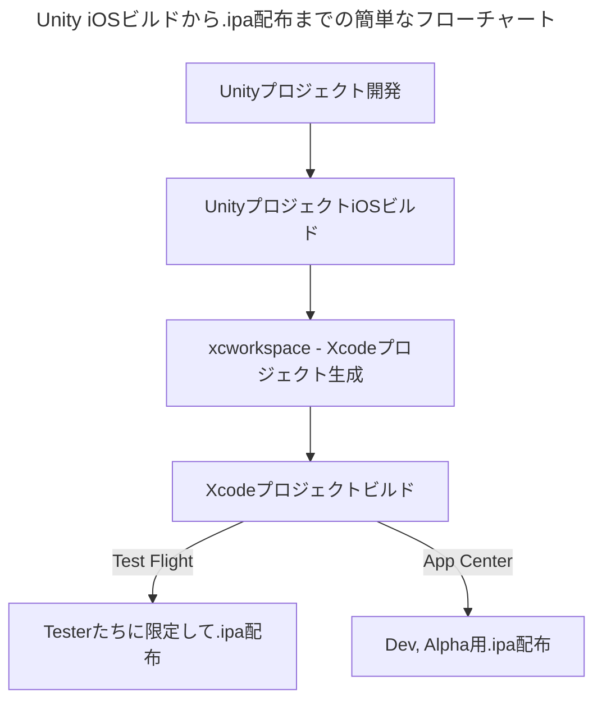

## 目次
> [Unity iOS ビルドプロセスについて](#unity-ios-ビルドプロセスについて)      
> [Xcode プロジェクト構造について(xcworkspace)](#xcode-プロジェクト-xcworkspace-構造について)      
> [Unity iOS ビルド後処理スクリプトおよびXcode設定自動化](#ios-ビルド後処理スクリプト---xcode-設定自動化)      

<br>
<br>

## Unity iOS ビルドプロセスについて

<br>



<br>

#### 1. Unity プロジェクト iOS ビルド

- Unityプロジェクトの Build Settings でプラットフォームを「iOS」に選択します。

{: : width="600" .normal }     

- 注意点は、右側の設定を手動で触らず、自動化コードで処理する方が便利だということです。（ただし、ローカルビルドのプロファイリングが必要な場合は選択しても構いません。）

<br>

- Player Settings で Bundle Identifier を入力します。

{: : width="600" .normal }     

<br>

- ここで **Bundle Identifier** とは、アプリを識別する固有の文字列です。アップデートおよび配布時に使用されます。
- iOS Bundle Identifier は Apple Developer - Identifiers で生成および管理できます。
> {: : width="600" .normal }     

- また、Signing Team ID は右上で確認が可能です。
> {: : width="400" .normal }     

- ここで **Version** は実際の App Version を意味し、Addressablesでリソースを管理する際の Resource Version とは異なる点に注意が必要です。
- App Version は実際にビルドプロセスを1回更新するたびにアップデートすると考えれば良いです。 1.1.0 -> 1.1.1 ... のように。

<br>

- Settings / Preferences - External Tools で Xcode Default Settings を設定できます。

> {: : width="800" .normal }     

- ここで **Automatically Sign** オプションにチェックを入れると：

> {: : width="800" .normal }     

- Xcode Project の Signing タブで Automatically manage signing が有効になり、入力した Team ID に合わせて（Enterprise かどうかなど）Bundle Identifier が設定されます。

<br>

- Unity上部ツールバー Assets - External Dependency Manager - iOS Resolver - Settings をクリックすると iOS Resolver Settings が表示されます。

> {: : width="500" .normal }     

- ここで確認すべき点は：
> 1. **Podfile Generation**: Cocoapods をインストールするために必要なオプションです。Cocoapods は外部ライブラリ管理を容易にする依存性管理ツールだと考えれば良いです。有効にすることが推奨されます。
> 2. **Cocoapods Integration**: Unityプロジェクトビルド後に生成されるXcodeプロジェクトを xcproj にするか、 xcworkspace にするかチェックするオプションです。 xcworkspace が推奨されます。

- GUIでオプションを設定する部分は上記の内容がほとんどでしょう。次はXcodeプロジェクトの構造とビルド後処理スクリプトについて見ていきましょう。

<br>
<br>

## Xcode プロジェクト xcworkspace 構造について

<br>

> {: : width="1000" .normal }     

<br>

#### 1. Project Target

- Target はビルドする Product を指定し、workspace 内のファイルから Product をビルドするための情報を持っています。（Build Settings, Build Phases）

> {: : width="800" .normal }     

- 特にUnityプロジェクトの場合、次の3つの **Unity-iPhone, UnityFramework, GameAssembly** Targets が重要です。
> {: : width="300" .normal }     

<br>

- **Unity-iPhone** はターゲットのシーンランチャー部分です。これには MainApp フォルダと起動画面、.xib ファイル、アイコン、データ、/Info.plist ファイルのようなアプリ表示データが含まれ、ライブラリを実行します。Unity-iPhone ターゲットは UnityFramework ターゲットに単一依存性（Implicit Dependency）が存在します。
- 単一依存性とは、簡単に言えばプロジェクトをビルドする際に Unity-iPhone をビルドするために UnityFramework ターゲットが必要という意味であり、同じ workspace に存在すれば依存性の順序通りにビルドが進行します。 GameAssembly -> UnityFramework -> Unity-iPhone

<br>

- **UnityFramework** ターゲットはライブラリです。 Classes, UnityFramework, Libraries フォルダと依存フレームワークが含まれ、Xcode はこのフォルダを使用して UnityFramework.framework ファイルをビルドします。
> {: : width="1000" .normal }     

- 特にこのターゲットでは、Unityプロジェクト内部の Plugin ファイルのうち、iOSプラットフォーム用にチェックしたプラグインファイルが含まれています。例：Firebase, Google Protobuf, WebView ...
- したがって、もしプロジェクトで使用しないプラグインをそのまま放置したり、サードパーティプラグイン間で重複するクラスやネーミングが存在したりすると、ビルドが失敗してしまいます。
- そのため、削除したプラグインの管理をしっかり行い、使用すべきプラグインを慎重に選択する必要があります。
> {: : width="300" .normal }     
> {: : width="400" .normal }     

<br>

- **GameAssembly** は C# コードを C++ コードに変換したコンテナです。Unity が含む IL2CPP ツールを使用し、次のようなビルドを生成します。
- `libGameAssembly.a`：プロジェクトのすべての管理されたコードが含まれる静的ライブラリ。C++ にクロスコンパイルされ、iOS用にビルドされます。
- `il2cpp.a`：管理されたコードをサポートするために [IL2CPP](https://docs.unity3d.com/ja/2023.2/Manual/IL2CPP.html) ランタイムコードを含む静的ライブラリです。

<br>

- **ターゲット設定ツールバー**

> {: : width="1000" .normal }     

- **General**: 対応端末、OSバージョン、表示名称、バージョン設定、依存設定などが可能。
- **Signing & Capabilities**: Certificate 関連設定および Bundle Identifier, Team ID 設定を実行。Apple が提供するサービス（CloudKit, Game Center, In App Purchase）の使用設定も可能。
- **Resource Tags**: [On-Demand Resources](https://developer.apple.com/library/archive/documentation/FileManagement/Conceptual/On_Demand_Resources_Guide/) 機能のタグ文字列を管理可能。容量の大きいリソースをアプリに同梱せず、後でダウンロードできる構造とのこと。
- **Info**: Info.plist を確認できます。
- **Build Settings**: CPUアーキテクチャタイプ、クラッシュログ、Instruments デバッグのために必要な dSYM ファイル生成の有無を決定することもできます。
> [Build Setting Reference](https://developer.apple.com/documentation/xcode/build-settings-reference)
- **Build Phases**: [こんな機能もあるようです…！！ブログ参照](https://note.com/navitime_tech/n/n01d34465db40)

<br>
<br>

#### 2. Classes フォルダ

- Unity ランタイムと Objective-C を統合するコードが入っています。

<br>

#### 3. Data フォルダ

- アプリケーションのシリアライズされたアセットと .NET アセンブリ（.dll, .dat ファイル）が Code Stripping 設定に従って全体コードまたはメタデータとして保管されます。
- [詳細な説明はUnity公式ドキュメント参照](https://docs.unity3d.com/ja/2023.2/Manual/StructureOfXcodeProject.html)

<br>

#### 4. Libraries フォルダ

- IL2CPP 用の `libli2cpp.a` ファイルが入っています。

<br>

#### 5. Info.plist ファイル

> {: : width="1000" .normal }     

- **Info.plist** とは Information Property List の略で、iPhoneアプリケーションの基本情報が盛り込まれた設定ファイルです。
- Bundle Identifier、アプリソフトウェア情報を XML ファイル形式で保存。
- ATT ポップアップ文言の処理も Info.plist ファイルを通じて処理します。
- また、Remote Notification のようなバックグラウンド設定もここで設定可能です。
- Info.plist の設定、内容変更は後述の PostProcessBuild Script で確認できます。

<br>


<br>
<br>

## iOS ビルド後処理スクリプト - Xcode 設定自動化

<br>

- Unityプロジェクトビルド -> Xcodeプロジェクト生成 -> ビルド後処理スクリプトを通じて、Xcodeプロジェクト設定の自動化が可能です。
- [Unityビルドパイプラインに関する説明](https://epheria.github.io/posts/UnityBuildAutobuildpipeline/) で確認できるように、Xcodeプロジェクトで様々な設定を手動で設定することには大きな限界が存在します。したがって、プロジェクトを円滑にビルドするためには、Unityの `PostProcessBuild` スクリプトを活用して自動化を適用する必要があります。

<br>

#### PostProcessBuild 使用法

- ビルド関連スクリプトは必ずプロジェクト内の **Editor** フォルダ配下に配置する必要があります。
> {: : width="1000" .normal }     

<br>

- プロジェクトビルドは上記のUnityビルドパイプラインのリンクを参照してください。
- プロジェクト PostProcessBuild を使用するためには、 `PostProcessBuild` 属性のみを使用するか、コールバック用インターフェースを継承して使用するかの2つの方法があります。
- ビルドプロセスが完全に終了し、確実にコールバックを受け取って処理するには、 `IPostprocessBuildWithReport` インターフェースを継承する方法を推奨します。
- ここではプロセスを確立するためにインターフェース方法について説明します。

<br>

- IPostprocessBuildWithReport インターフェースを継承したクラスを作成しましょう。

```csharp
#if UNITY_IPHONE 
// iOS 専用前処理は必須

class PBR : IPostprocessBuildWithReport // ビルド後処理インターフェース
{
    public void OnPostprocessBuild(BuildReport report)
    {
        if (report.summary.platform == BuildTarget.iOS)
        {
            
        }
    }
}

#endif
```

<br>

- batchmode でUnityプロジェクトをビルドする関数（ここでは BuildIos）内部で、ビルドパイプラインが完了した後に実行させれば良いです。

```csharp
public static void BuildIos(int addsBuildNum, string xcodePath)
{
    string[] args = System.Environment.GetCommandLineArgs();
    int buildNum = 0;
    foreach (string a in args)
    {
        if (a.StartsWith("build_num"))
        {
            var arr = a.Split(":");
            if (arr.Length == 2)
            {
                int.TryParse(arr[1], out buildNum);
            }
        }
    }
    buildNum += addsBuildNum;
    
    System.IO.File.WriteAllText(ZString.Concat(Application.streamingAssetsPath, "/BuildNum.txt"), buildNum.ToString());

    PlayerSettings.SplashScreen.showUnityLogo = false;
    
    var test = System.IO.File.ReadAllText(ZString.Concat(Application.streamingAssetsPath, "/BuildNum.txt"));
    Debug.Log($"revised build num text is : {test}");

    PlayerSettings.iOS.buildNumber = buildNum.ToString();
    
    BuildPlayerOptions buildPlayerOptions = new BuildPlayerOptions();
    buildPlayerOptions.scenes = FindEnabledEditorScenes();
    buildPlayerOptions.locationPathName = xcodePath;
    buildPlayerOptions.target = BuildTarget.iOS;

    var report = BuildPipeline.BuildPlayer(buildPlayerOptions);

    if (report.summary.result == UnityEditor.Build.Reporting.BuildResult.Succeeded) Debug.Log("Build Success");
    if (report.summary.result == UnityEditor.Build.Reporting.BuildResult.Failed) Debug.Log("Build Failed");

    // batchmode で進行するUnityプロジェクトビルドが完全に終了した後
    // PostProcessBuild が進行する。
#if UNITY_IPHONE
    PBR pbr = new PBR();
    pbr.OnPostprocessBuild(report);
#endif
}
```

<br>

- 今度は OnPostprocessBuild 関数内部で PBXProject を通じて Xcode プロジェクトファイルの再書き込みに関する後処理について見ていきましょう。

#### PBXProject とは何か

- Unityビルドパイプライン段階で生成したXcodeプロジェクトファイルの内容を書き換えるには、[PBXProject](https://docs.unity3d.com/2023.2/Documentation/ScriptReference/iOS.Xcode.PBXProject.html) というXcode専用APIを使用する必要があります。

- まず xcode project path をローカル変数に格納し、PBXProject を動的割り当てしましょう。
- その後、この PBXProject で各種Xcode設定を処理できます。
- 特に `GetUnityMainTargetGuid` を通じて Unity-iPhone メインターゲットを取得するか、UnityFramework ターゲットを取得するかを決めることもできます。
> {: : width="300" .normal }     

```csharp
var frameTargetGuid = project.GetUnityFrameworkTargetGuid();
var mainTargetGuid = project.GetUnityMainTargetGuid();
```

- すべての設定が終わったら、 **WriteToFile** を忘れずに最後に記述する必要があります。

<br>

- 全体例コード

```csharp
public void OnPostprocessBuild(BuildReport report)
{
    if (report.summary.platform == BuildTarget.iOS)
    {
        Debug.Log("OnPostProceeBuild");
        string projectPath = report.summary.outputPath + "/Unity-iPhone.xcodeproj/project.pbxproj";
        var entitlementFilePath = "Entitlements.entitlements";
        var project = new PBXProject();

        project.ReadFromFile(projectPath);
        
        var manager = new ProjectCapabilityManager(projectPath, entitlementFilePath, null, project.GetUnityMainTargetGuid());
        manager.AddPushNotifications(true);
        manager.AddAssociatedDomains(new string[] { "applinks:nkmb.adj.st" });// Universal-Link対応。
        manager.WriteToFile();

        var mainTargetGuid = project.GetUnityMainTargetGuid();
        project.SetBuildProperty(mainTargetGuid, "ENABLE_BITCODE", "NO");
        
        // Enterprise でのみ一時的に追加しておいたコードです。
        // Sign In With Apple FrameworkはEnterpriseで有効化されないためXcodeビルドエラー発生
        
        // Supported Destinations にiPadサポートを除外するコード
        // 1 はiPhoneを意味する。
        //project.SetBuildProperty(mainTargetGuid, "TARGETED_DEVICE_FAMILY", "1"); // 1 corresponds to iPhone

        project.RemoveFrameworkFromProject(mainTargetGuid, "SIGN_IN_WITH_APPLE");
        project.SetBuildProperty(mainTargetGuid, "CODE_SIGN_ENTITLEMENTS", entitlementFilePath);

        foreach (var targetGuid in new[] { mainTargetGuid, project.GetUnityFrameworkTargetGuid() })
        {
            project.SetBuildProperty(targetGuid, "ALWAYS_EMBED_SWIFT_STANDARD_LIBRARIES", "No");

            project.SetBuildProperty(targetGuid, "LD_RUNPATH_SEARCH_PATHS", "$(inherited) /usr/lib/swift @executable_path/Frameworks");
            //project.AddBuildProperty(targetGuid, "LD_RUNPATH_SEARCH_PATHS", "/usr/lib/swift");
        }
        
        // test
        //project.RemoveFrameworkFromProject(mainTargetGuid, "UnityFramework.framework");
        project.SetBuildProperty(mainTargetGuid, "ALWAYS_EMBED_SWIFT_STANDARD_LIBRARIES", "No");
        project.WriteToFile(projectPath);
    }
}
```

<br>

- frameworkTarget 使用例：AppTrackingTransparency (ATT), AdSupport 側の追加
- [Unity ATT 規定関連](https://docs.unity.com/ads/ja-jp/manual/ATTCompliance), [Apple ATT](https://developer.apple.com/documentation/apptrackingtransparency#Overview)
- Adjust でユーザー行動を追跡する場合、ポップアップ警告文言を無条件で追加する必要があります。
- ポップアップ文言関連の追加は下段の Info.plist 側で説明します。

```csharp
var frameworkTargetGuid = project.GetUnityFrameworkTargetGuid();
project.AddFrameworkToProject(frameworkTargetGuid, "AppTrackingTransparency.framework", true);
project.AddFrameworkToProject(frameworkTargetGuid, "AdSupport.framework", true);
```

<br>

#### Entitlement

- 任意に `entitlementFilePath` を指定してXcodeプロジェクトに `Entitlements.entitlements` というファイルを一つ作り、
- `ProjectCapabilityManager` を生成して Push-Notification, Universal-Link などの処理を行うことができます。

```csharp
var manager = new ProjectCapabilityManager(projectPath, entitlementFilePath, null, project.GetUnityMainTargetGuid());
    manager.AddPushNotifications(true);
    manager.AddAssociatedDomains(new string[] { "applinks:nkmb.adj.st" });// Universal-Link対応。
    manager.WriteToFile();
```

<br>

#### PlistDocument - Info.plist 作成

- 上記で言及した ATT ポップアップ文言や Localize、Firebase でアプリがバックグラウンドに切り替わった時にプッシュ通知を送る Remote-Notification などを設定できます。
- Info.plist ファイルを修正するには、PBXProject と同様に [PlistDocument API](https://docs.unity3d.com/ScriptReference/iOS.Xcode.PlistDocument.html) を使用すれば良いです。
- ATT ポップアップ文言の locale の場合、Unityプロジェクトフォルダ内部に作成しておけば良いです。
> {: : width="200" .normal } {: : width="500" .normal }        

```csharp
string infoPlistPath = pathToBuiltProject + "/Info.plist";
PlistDocument plistDoc = new PlistDocument();
plistDoc.ReadFromFile(infoPlistPath);
if (plistDoc.root != null)
{
    plistDoc.root.SetBoolean("ITSAppUsesNonExemptEncryption", false);

    
    var locale = new string[] { "en", "ja" };
    var mainTargetGuid = project.GetUnityMainTargetGuid();
    var array = plistDoc.root.CreateArray("CFBundleLocalizations");
    foreach (var localization in locale)
    {
        array.AddString(localization);
    } 
    
    plistDoc.root.SetString("NSUserTrackingUsageDescription", "Please allow permission to provide service and personalized marketing. It will be used only for the purpose of providing personalized advertising based on Apple’s policy.");
    
    plistDoc.WriteToFile(projectPath);
    
    for (int i = 0; i < locale.Length; i++)
    {
        var guid = project.AddFolderReference(Application.dataPath + string.Format("/Editor/iOS/Localization/{0}.lproj", locale[i]), string.Format("{0}.lproj", locale[i]), PBXSourceTree.Source);
        project.AddFileToBuild(mainTargetGuid, guid);
    }

    // Firebase利用のためBackgound mode設定が必要
    PlistElementArray backgroundModes;
    if (plistDoc.root.values.ContainsKey("UIBackgroundModes"))
    {
        backgroundModes = plistDoc.root["UIBackgroundModes"].AsArray();
    }
    else
    {
        backgroundModes = plistDoc.root.CreateArray("UIBackgroundModes");
    }
    backgroundModes.AddString("remote-notification");
    plistDoc.WriteToFile(infoPlistPath);
}
else
{
    Debug.LogError("ERROR: Can't open " + infoPlistPath);
}
```

<br>
<br>
