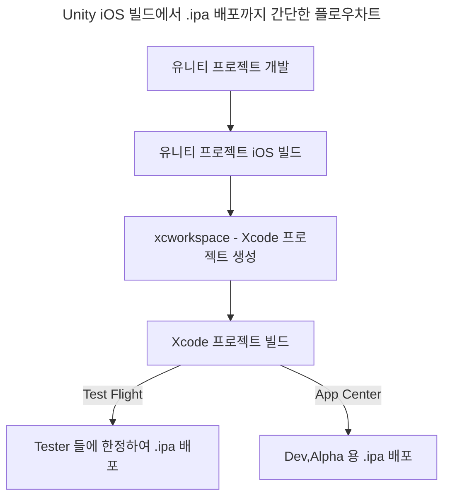

[](https://hits.seeyoufarm.com)

---

## 목차
> 
>
>

<br>
<br>

## Unity iOS 빌드 프로세스

<br>



<br>

#### 1. 유니티 프로젝트 iOS 빌드

- 유니티 프로젝트의 Build Settings 에서 플랫폼을 "iOS" 로 선택해준다.

{: : width="600" .normal }     

- 주의 할 점은 우측의 세팅들은 수동으로 건들면 안되고 자동화 코드에서 처리해주는게 편하다. (단, 로컬 빌드 프로파일링이 필요 할 때는 선택해주면 된다.)

<br>

- Player Settings 에서 Bundle Identifier 를 입력해주자.

{: : width="600" .normal }     

<br>

- 여기서 **Bundle Identifier** 란, 앱을 식별하는 고유 문자열이다. 업데이트 및 배포 시 사용된다.
- iOS Bundle Identifier 는 Apple Developer - Identifiers 에서 생성 및 관리할 수 있다.
> {: : width="600" .normal }     

- 또한 Signing Team ID 는 우측 상단에서 확인이 가능하다.
> {: : width="400" .normal }     

- 여기서 Version 은 실제 App Version 을 뜻하며, 어드레서블로 리소스를 관리 시 Resource Version 과는 다르다는 점에 유의해야한다.
- App Version 은 실제로 빌드 프로세스를 1회 갱신할 때 마다 업데이트 한다고 보면 됨. 1.1.0 -> 1.1.1 ... 이런식으로

<br>

- Settings / Preferences - External Tools 에서 Xcode Default Settings 를 설정할 수 있다.

> {: : width="800" .normal }     

- 여기서 Automatically Sign 옵션을 체크하면

> {: : width="800" .normal }     

- Xcode Project 에서 Signing 탭에서 Automatically manage signing 이 활성화되면서 입력한 Team ID 에 맞춰서 (enterprise 인지 아닌지 라던가) Bundle Identifier 가 설정된다. 

<br>

- 유니티 상단 툴바 Assets - External Dependency Manager - iOS Resolver - Settings 를 클릭하면 iOS Resolver Settings 가 나온다.

> {: : width="500" .normal }     

- 여기서 살펴볼만한 것은
> 1. Podfile Genreation : Cocoapods 를 설치하기위해 필요한 옵션이다. Cocoapods 은 외부 라이브러리 관리를 쉽게 도와주는 의존성 관리 도구라고 생각하면 된다. 활성화 하는게 권장됨.
> 2. Cocoapods Integration : 유니티 프로젝트 빌드 후 생성되는 Xcode 프로젝트를 xcproj 로 할 것인지, xcworkspace 로 할 것인지 체크하는 옵션이다. xcworkspace 가 권장됨.

- GUI로 옵션을 세팅하는 부분은 위 내용이 대부분일 것이다. 다음은 Xcode 프로젝트의 구조와 빌드 후처리 스크립트에 대해 알아보자.

<br>
<br>

## Xcode 프로젝트 xcworkspace 구조에 대해

<br>

> {: : width="1000" .normal }     

<br>

#### 1. Project Target

- Target 은 빌드할 Product 를 지정하고 workspace 내의 파일들로 부터 Product 를 빌드 하기 위한 정보들을 가지고 있다. (Build Settings, Buiild Phase)

> {: : width="800" .normal }     

- 특히 유니티 프로젝트의 경우 다음 3가지 **Unity-iPhone, UnityFramework, GameAssembly** Targets 가 중요하다.
> {: : width="300" .normal }     

<br>

- **Unity-iPhone** 은 타겟의 씬 런쳐 부분이다. 여기에는 MainApp 폴더와 실행화면, .xib 파일, 아이콘, 데이터, /Info.plist 파일과 같은 앱 표시 데이터가 포함되며 라이브러리를 실행한다. Unity-iPhone 타겟은 UnityFramework 타겟에 단일 종속성(Implicit Dependency)이 존재한다.
- 단일 종속성이란 간단하게 프로젝트를 빌드 할 때 Unity-iPhone 을 빌드하기 위해 UnityFramework 타겟이 필요하다는 의미이며 같은 workspace 에 존재하면 의존성 순서대로 빌드가 진행된다. GameAssembly -> UnityFramework -> Unity-iPhone

<br>

- **UnityFramework** 타겟은 라이브러리이다. Classes, UnityFramework, Libararies 폴더와 종속 프레임워크들이 포함되며 Xcode 는 이 폴더를 사용하여 UnityFramework.framework 파일을 빌드한다.
> {: : width="1000" .normal }     

- 특히 이 타겟에서는 유니티 프로젝트 내부의 Plugin 파일들 중 iOS 플랫폼용으로 체크한 플러그인 파일들이 포함되어 있다. ex. Firebase, Google Protobuf, WebView ...
- 따라서 만약 프로젝트에서 사용하지 않는 플러그인들을 그대로 방치하거나, 서드 파티 플러그인들 간에 중복되는 클래스,네이밍이 존재한다면 빌드가 실패해버리고 만다..
- 따라서 삭제한 플러그인들 관리를 잘 해주고, 사용해야할 플러그인들을 신중하게 선택해줄 필요가 있다.
> {: : width="300" .normal }     
> {: : width="400" .normal }     

<br>

- **GameAssembly** 는 C# 코드를 C++ 코드로 변환한 컨테이너이다. Unity 가 포함하는 IL2CPP 툴을 사용하며 다음과 같은 빌드를 생성한다.
- libGameAssembly.a : 프로젝트의 모든 관리되는 코드가 포함된 정적 라이브러리, C++ 로 크로스 컴파일 되고 iOS 용으로 빌드된다.
- il2cpp.a : 관리되는 코드를 지원하기 위해 [IL2CPP](https://docs.unity3d.com/kr/2023.2/Manual/IL2CPP.html) 런타임 코드를 포함하는 정적 라이브러리이다.

<br>

- **타겟 설정 툴바**

> {: : width="1000" .normal }     

- General : 지원 단말, OS 버전, 표시 명칭, 버전 설정, 종속 설정 등의 설정이 가능
- Signing&Capabilities : Certificate 관련 설정 및 Bundle Identifier, Team ID 설정을 수행. Apple 이 제공하는 서비스들 (CloudKit, Game Center, In App Purchase)의 사용 설정도 가능.
- Resource Tags : [On-Demand Resources](https://developer.apple.com/library/archive/documentation/FileManagement/Conceptual/On_Demand_Resources_Guide/) 기능의 태그 문자열을 관리 가능. 용량이 큰 리소스를 앱에 동봉하지 않고 나중에 다운로드할 수 있는 구조라고 한다.
- Info : Info.plist 를 확인할 수 있다.
- Build Settings : CPU 아키텍쳐 유형, 크래시 로그, Instruments 디버깅을 위해 필요한 dSYM 파일 생성 유무를 결정할 수도 있다. 
> [Build Setting Reference](https://developer.apple.com/documentation/xcode/build-settings-reference)
- Build Phases : [이런 기능도 있다..!! 블로그 참조 바람](https://note.com/navitime_tech/n/n01d34465db40)

<br>
<br>

#### 2. Classes 폴더

- Unity 런타임과 Objective-C 를 통합하는 코드가 들어가 있다. 

<br>

#### 3. Data 폴더

- 애플리케이션의 직렬화된 에셋과 .NET 어셈블리(.dll, .dat 파일)가 Code Stripping 설정에 따라 전체 코드 또는 메타데이터로 보관한다. 
- [자세한 설명은 유니티 공식 문서 참조](https://docs.unity3d.com/kr/2023.2/Manual/StructureOfXcodeProject.html)

<br>

#### 4. Libraries 폴더

- IL2CPP 용 libli2cpp.a 파일이 들어가있다.

<br>

#### 5. Info.plist 파일

> {: : width="1000" .normal }     

- Info.plist 란 Information Property List 의 줄임말로 아이폰 애플리케이션의 기본 정보가 담긴 설정파일이다.
- Bundle Identifier, 앱 소프트웨어 정보를 XML 파일 형태로 저장.
- ATT 팝업 문구 처리도 Info.plist 파일을 통해 처리한다.
- 또한, Remote Notification 과 같은 백그라운드 설정도 여기서 세팅가능하다.
- Info.plist 의 설정,내용 변경은 뒤에 PostProcessBuild Script 에서 확인할 수 있다.

<br>


<br>
<br>

## iOS 빌드 후처리 스크립트 - xcode 설정 자동화

<br>

- 유니티 프로젝트 빌드 -> Xcode 프로젝트 생성 -> 빌드 후처리 스크립트를 통해 Xcode 프로젝트 설정들에 대한 자동화가 가능하다.
- [유니티 빌드 파이프라인에 관한 설명](https://epheria.github.io/posts/UnityBuildAutobuildpipeline/) 에서 확인할 수 있듯이, Xcode 프로젝트에서 다양한 설정들을 수동으로 설정하는 것은 크나큰 한계가 존재한다. 따라서 프로젝트를 원활히 빌드하기 위해서는 유니티 PostProcessBuild 스크립트를 활용하여 자동화를 적용할 필요성이 있다.

<br>

#### PostProcessBuild 사용법

- 빌드 관련 스크립트는 무조건 프로젝트 내 Editor 폴더 하위에 위치시켜야 한다.
> {: : width="1000" .normal }     

<br>

- 프로젝트 빌드는 위의 유니티 빌드 파이프라인 링크를 참조바람.
- 프로젝트 PostProcessBuild 를 사용하기 위해서는 PostProcessBuild Attribute 만을 사용하거나 CallBack 용 Interface 를 상속받아 사용하는 방법 두 가지가 있다.
- 빌드 프로세스가 완전히 끝나고 확실하게 콜백을 받아와서 처리하려면 IPostprocessBuildWithReport 인터페이스를 상속시키는 방법을 권장한다.
- 이쪽에서는 프로세스를 확립하기 위해 인터페이스 방법에 대해 설명하겠다.

<br>

- IPostprocessBuildWithReport 인터페이스를 상속받아 클래스를 만들어 주자.

```csharp

#if UNITY_IPHONE 
// iOS 전용 전처리는 필수

class PBR : IPostprocessBuildWithReport // 빌드 후처리 인터페이스
{
    public void OnPostprocessBuild(BuildReport report)
    {
        if (report.summary.platform == BuildTarget.iOS)
        {
            
        }
    }
}

#endif

```

<br>

- batchmode 로 유니티 프로젝트를 빌드하는 함수 내부에 넣어줘야한다.

```csharp

   public static void BuildIos(int addsBuildNum, string xcodePath)
    {
        string[] args = System.Environment.GetCommandLineArgs();
        int buildNum = 0;
        foreach (string a in args)
        {
            if (a.StartsWith("build_num"))
            {
                var arr = a.Split(":");
                if (arr.Length == 2)
                {
                    int.TryParse(arr[1], out buildNum);
                }
            }
        }
        buildNum += addsBuildNum;
        
        System.IO.File.WriteAllText(ZString.Concat(Application.streamingAssetsPath, "/BuildNum.txt"), buildNum.ToString());

        PlayerSettings.SplashScreen.showUnityLogo = false;
        
        var test = System.IO.File.ReadAllText(ZString.Concat(Application.streamingAssetsPath, "/BuildNum.txt"));
        Debug.Log($"revised build num text is : {test}");

        PlayerSettings.iOS.buildNumber = buildNum.ToString();
        
        BuildPlayerOptions buildPlayerOptions = new BuildPlayerOptions();
        buildPlayerOptions.scenes = FindEnabledEditorScenes();
        buildPlayerOptions.locationPathName = xcodePath;
        buildPlayerOptions.target = BuildTarget.iOS;

        var report = BuildPipeline.BuildPlayer(buildPlayerOptions);

        if (report.summary.result == UnityEditor.Build.Reporting.BuildResult.Succeeded) Debug.Log("Build Success");
        if (report.summary.result == UnityEditor.Build.Reporting.BuildResult.Failed) Debug.Log("Build Failed");

        // batchmode 로 진행되는 유니티 프로젝트 빌드가 완전히 종료된 후
        // PostProcessBuild 가 진행된다.
#if UNITY_IPHONE
        PBR pbr = new PBR();
        pbr.OnPostprocessBuild(report);
#endif
    }
```

<br>


#### PBXProject 란 무엇인가

#### PlistDocument

## Provisioning Profile 및 Certificate 설정


