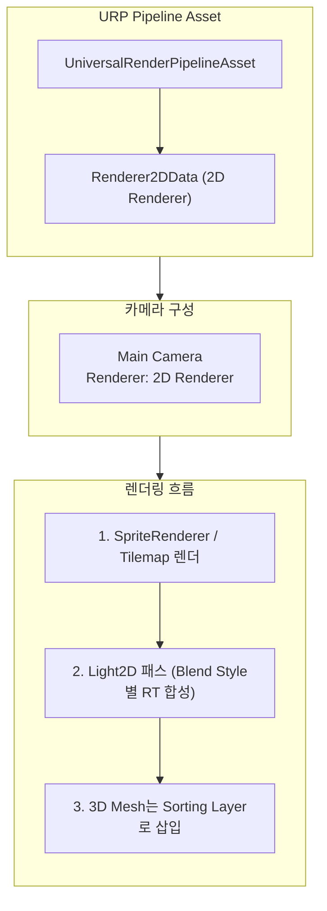
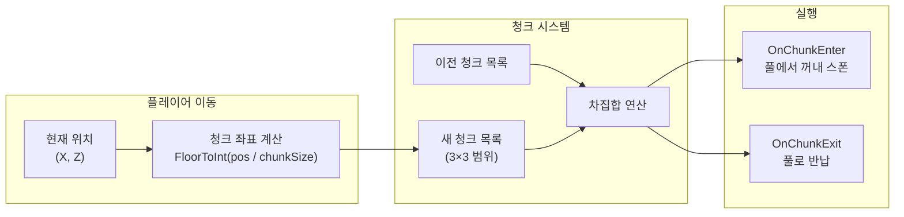
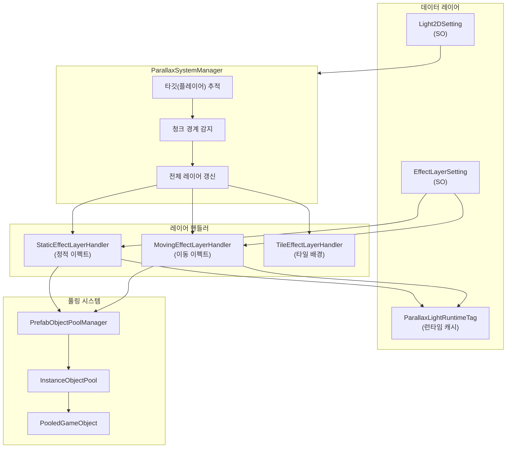
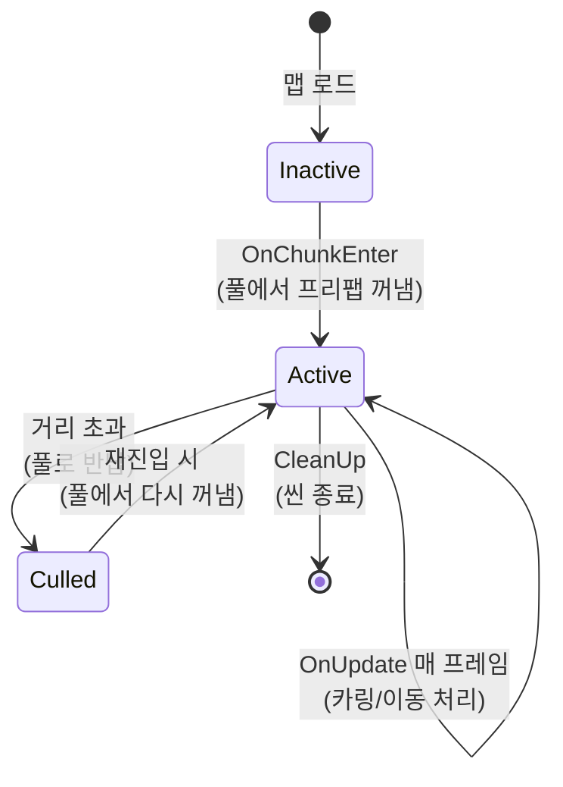
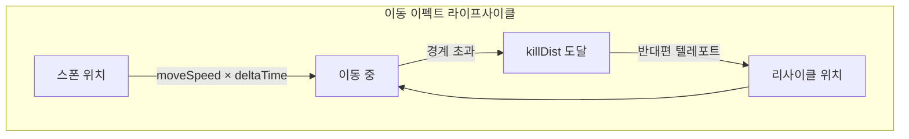
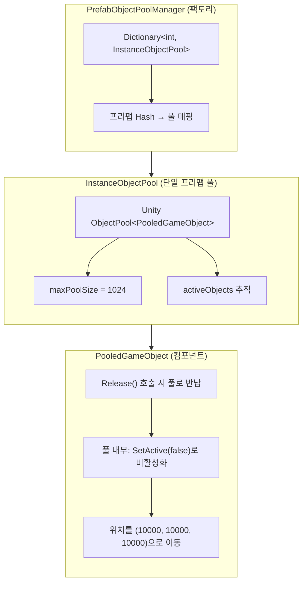
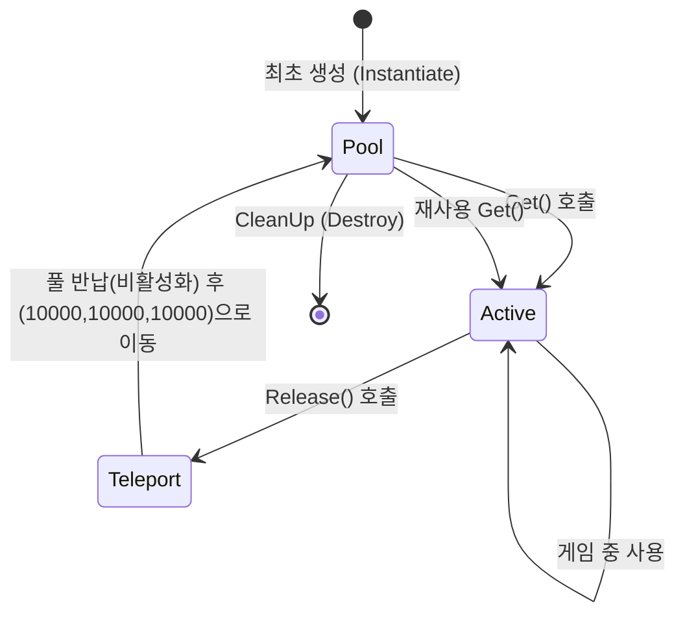
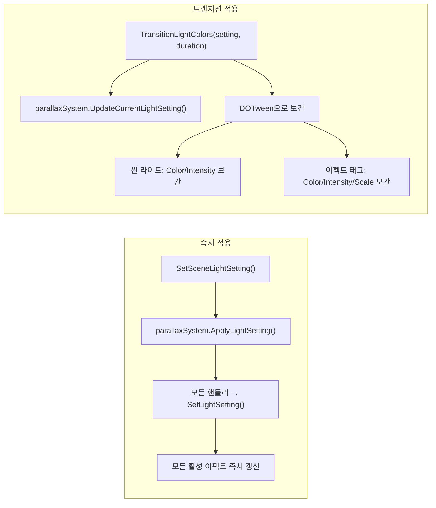
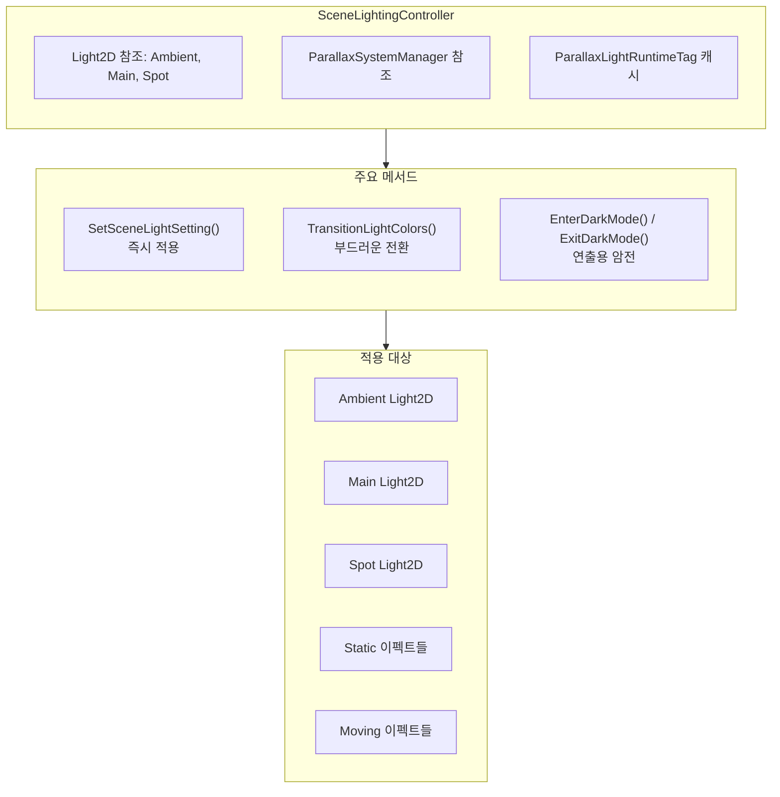
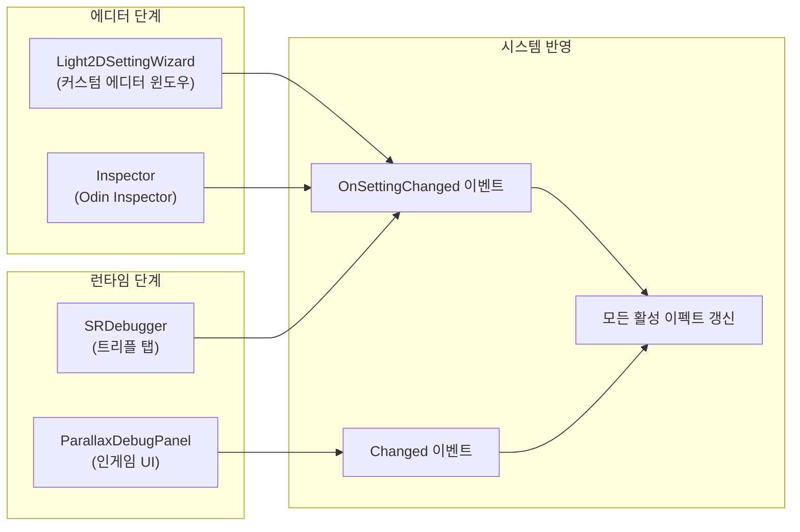

[](https://hits.sh/epheria.github.io/)

---

# **왜 3D 씬에 Light2D를? (문제정의 & 목표)**

- **문제정의**: 대규모 3D 씬에서 Directional + Light Probe + 실시간 섀도우는 **GPU/CPU/메모리 비용**이 높음. 모바일/저사양에서 프레임 낙폭.
- **핵심 목표**
  - **시각 품질 유지**: 글로벌 톤, 메인 포커스, 캐릭터 주변 라이트, 햇살(Shaft) 연출.
  - **낮은 비용**: **2D 전용 라이트 패스** + **청크 트리거** + **오브젝트 풀**로 스폰/업데이트/반납 비용 최소화.
  - **운영 친화**: ScriptableObject + SRDebugger로 **디자이너 및 기획측에서 런타임으로 라이트 등을 튜닝 가능하도록 툴 제공**.

---

## **URP 2D Light 렌더링 순서 (개념 정리)**

1. **카메라 설정**: 뷰포트/정렬(Sorting Layer & Order)
2. **씬 오브젝트 렌더링**: 스프라이트/메시 등 기하 렌더
3. **Light2D 렌더 패스**: **color, intensity, falloff, blend, mask**를 **기하 결과에 합성**

> **핵심**: 여러 Light2D가 겹치면 **Blend Style**과 **Overlap Operation**(Additive / Alpha Blending)에 따라 최종 결과가 달라짐.

---

## **3D 프로젝트에서 Light2D를 동작시키는 렌더러 구성**

Light2D는 URP의 **2D Renderer** 전용 기능입니다. 일반적인 3D 프로젝트(Universal Renderer)에서는 Light2D 컴포넌트를 추가해도 동작하지 않습니다. 3D 씬에서 Light2D를 쓰려면 렌더러 레벨의 설정이 필요합니다.

### **본 프로젝트의 렌더러 구성**



| 설정 항목 | 값 | 설명 |
|-----------|-----|------|
| **Renderer Type** | Renderer2D (2D Renderer) | Light2D 동작의 전제 조건 |
| **카메라** | Single Camera + 2D Renderer | 3D 메시도 2D 렌더 파이프라인으로 처리 |
| **Sorting Layer** | 3D 오브젝트를 적절한 Sorting Layer에 배치 | Light2D의 `Target Sorting Layers`와 매칭 |
| **베이스 해상도** | 750×1334 | 모바일 최적화 기준 |

> **핵심**: 본 프로젝트는 **탑다운 시점**이라 3D 메시를 2D Renderer로 렌더링해도 시각적 차이가 거의 없습니다. 이것이 이 기법의 전제 조건입니다. 자유시점 3D 게임에서는 2D Renderer의 제약(Sorting 기반 깊이 처리, 3D 라이팅 부재)이 심각해지므로 이 접근법은 적합하지 않습니다.

### **Sorting Layer 구성**

Light2D는 `Target Sorting Layers`로 영향 범위를 제한합니다. 본 프로젝트에서는 다음과 같이 구성합니다:

| Sorting Layer | 대상 | Light2D 영향 |
|---------------|------|-------------|
| **Background** | 배경 타일맵 | Global Light만 적용 |
| **Default** | 3D 맵 오브젝트, 캐릭터 | Ambient + Main + Spot 모두 적용 |
| **Effect** | Parallax 이펙트 (구름, 광선) | 이펙트 자체가 Light2D를 포함 |
| **Foreground** | 전경 UI 요소 | Light 영향 없음 |

> **주의**: 서로 다른 Sorting Layer를 대상으로 하는 Light2D끼리는 **배치(batch)를 공유하지 않습니다**. Target Sorting Layers 설정이 다른 Light2D가 많을수록 draw call이 늘어나므로, 가능한 한 동일한 Target 설정으로 통일하는 것이 성능상 유리합니다.

---

## **Light2D 타입·핵심 프로퍼티 요약**

### **Light Type 요약**
- **Global**: 전역 톤(앰비언트)
- **Spot**: 부채꼴/원뿔(Inner/Outer 각도 + Radius)
- **Freeform**: 폴리곤으로 영역 지정
- **Sprite**: 스프라이트 알파를 **쿠키**처럼 사용 (모양 기반 빛)

### **공통 프로퍼티**
- **Color**: 색. 어두운 색은 Intensity가 높아도 덜 밝아 보일 수 있음 → **색·세기 동시 조정**
- **Intensity**: 밝기(세기). 보통 0–1, 연출상 **1 초과**도 가능(겹침 과포화 주의)
- **Radius**: 최대 범위(Spot/Point 중요). 너무 크면 **오버드로/합성 비용 증가**
- **Falloff Strength**: 중심→테두리 감쇄 속도. 높을수록 가장자리로 **빠르게 어두워짐**

---

## **Blending & Overlap — 라이트 중첩 규칙**

### **Blend Style (Renderer2DData에서 정의)**
1. **Default**: 일반적 합성—자연스러움
2. **Additive**: 밝기/색을 덧셈 누적—네온/글로우
3. **Multiply with Mask (R)**: 마스크(R) 곱—검은 영역 약화
4. **Additive with Mask (R)**: 마스크(R) + 덧셈—국부 글로우·하이라이트

<br>

### **Overlap Operation**
- **Additive**: 겹칠수록 밝아짐—시선 유도/효과 강조
- **Alpha Blending**: 알파 반영 **부드러운 섞임**—Light 순서 영향

### **Blend Style의 숨겨진 비용: 풀스크린 RT**

Renderer2DData에 정의된 **Blend Style 하나당 풀스크린 Render Texture(RT) 하나**가 생성됩니다. 이것은 Light2D의 내부 구현상 피할 수 없는 비용입니다.

| Blend Style 수 | 추가 RT 수 | 750×1334 기준 VRAM (RGBA32) | 비고 |
|----------------|-----------|---------------------------|------|
| 1개 | 1장 | ~4 MB | 최소 구성 |
| 2개 | 2장 | ~8 MB | 본 프로젝트 권장 |
| 4개 (전부 사용) | 4장 | ~16 MB | 모바일에서 부담 |

> **권장**: 모바일에서는 **실제 사용하는 Blend Style만 활성화**하세요. 본 프로젝트에서는 Default + Additive **2개만** 사용하여 RT 비용을 최소화하고 있습니다. 사용하지 않는 Blend Style은 Renderer2DData에서 비활성화하면 RT가 생성되지 않습니다.

---


## **프로젝트 표준 라이트 구성 (3종 프리셋)**

### **1) Ambient(Global) — 전역 분위기**
- **Light Type**: Global  
- **Color/Intensity**: 씬 톤 + **Intensity ≈ 0.25**  
- **Blend Style**: Default  
- **Overlap**: Additive

### **2) Main Light(Spot) — 카메라 뷰포트 중심 노출**
- **Type**: Spot  
- **Radius**: 0~50  
- **Falloff Strength**: **0** (뷰포트 강조)
- **Normal Maps**: **Quality=Accurate**, **Distance≈Radius**
- **Blend/Overlap**: Default / Additive

### **3) Character Spot(Spot) — 등불/휴대 광원**
- **Type**: Spot  
- **Radius**: 0~10  
- **Falloff Strength**: **≈0.5** (자연스러운 감쇄)  
- **Intensity**: Main보다 **조금 높게**  
- **Normal Maps**: Accurate, Distance≈Radius  
- **Blend/Overlap**: Default / Additive

---

## **Normal Maps (2D 표면에 라이팅 질감 부여)**

- **정의**: RGB에 픽셀 단위 **법선 벡터** 저장 → 하이라이트/음영을 2D에 구현  
- **Quality**: *Accurate* (정확)/ *Fast* (가성비)  
- **Distance**: 라이트가 노멀에 영향 주는 최대 거리 → **Radius와 유사/약간 크게**  
- **예외**: 바닥 구름(Floor) 라이트는 **Normal Maps 비활성**

---

## **데이터 파이프라인 & 씬 구조**

- **배치 위치**: `GameScene / Main Camera / Lights`
- **에셋 경로**: `Assets/ExternalAssets/TileMap/Light/Dusk.asset`
- **노출 항목**: **Color**, **Intensity**, **Enable Spot Light**, **LightShaft Enabled**
- **생성/복제**: `Create → Cocone → Light2DSetting` 또는 **Cmd/Ctrl + D**
- **SRDebugger 연동**: `InGameSROptions`의 "Scene Light" 카테고리를 통해 **라이트 프리셋 전환**(Day/Night/Dusk 등)과 **다크모드 토글**이 가능
- **헤더 일본어 설명**: 「**色 / 明るさ(強度) / スポットライト有効 / サンシャフト有効** はランタイムで安全に変更できます。」

---

## **햇살(Light Shaft) 제작 가이드 (Sprite Light)**

- **Light Type: Sprite** 사용, **프리팹(LightShaft)**으로 만들어 **맵 오브젝트** 배치
- **리소스(임시)**  
  - `Assets/ExternalAssets/TileMap/Sprite/LightShafts/gradient light.png`  
  - `Sprite_SunSpots_2` (바닥 구름 그림자), `shadow2` (햇살 패턴)
- **자동화 난점**: Sprite Light 수/패턴이 많아 **수작업 배치**가 현실적  
- **주의**: Floor(바닥) 구름 라이트는 **Normal Maps Off**

---

## **Part 2: Parallax + Chunk + Light2D 시스템 아키텍처**

앞서 Light2D의 기본 개념, 타입, Blending 규칙, 그리고 프로젝트 표준 프리셋까지 살펴봤습니다. 이제 핵심 질문에 답해봅시다: **수백 개의 Light2D 이펙트를 대규모 맵에서 어떻게 저비용으로 관리하는가?**

게임 맵이 커지면 Light2D 이펙트도 함께 늘어납니다. 구름 그림자, 광선, 환경 조명 등을 맵 전체에 직접 배치하면 수백~수천 개의 Light2D가 동시에 렌더링됩니다. 모바일에서 이것은 곧 프레임 드롭을 의미합니다.

해결책은 **"보이는 곳만 살려두고, 보이지 않는 곳은 치운다"**입니다. 오픈 월드 게임이 청크(Chunk) 기반으로 지형을 로드/언로드하듯, Light2D 이펙트도 플레이어 주변의 청크만 활성화하고 멀어진 청크는 오브젝트 풀로 반납합니다.

### **핵심 아이디어**



- 맵을 일정 크기(`chunkSize`)의 격자로 분할
- 플레이어 위치를 청크 좌표로 변환
- 이전 프레임 청크 좌표와 비교하여 **새로 진입한 청크**에는 이펙트 스폰, **벗어난 청크**는 반납
- 모든 스폰/반납은 **오브젝트 풀**을 통해 Instantiate/Destroy 비용을 제거

### **전체 구성 요소**



| 구성 요소 | 역할 | 핵심 책임 |
|-----------|------|----------|
| **ParallaxSystemManager** | 오케스트라 지휘자 | 타깃 추적, 청크 경계 감지, 전체 레이어 갱신 트리거 |
| **IParallaxLayerHandler** | 인터페이스 | 핸들러 공통 계약 (Initialize/RefreshChunks/OnUpdate/CleanUp) |
| **AbstractEffectLayerHandler** | 기반 클래스 | 청크 관리 공통 로직, Light2D 설정 전파 |
| **StaticEffectLayerHandler** | 정적 이펙트 | 고정 위치 이펙트 스폰, 거리 기반 카링 |
| **MovingEffectLayerHandler** | 이동 이펙트 | 연속 이동 + 경계 리사이클(무한 흐름 연출) |
| **TileEffectLayerHandler** | 타일 배경 | 단순 타일 프리팹 배치 (풀링 미사용) |
| **ParallaxLightRuntimeTag** | 런타임 캐시 | Light2D 컴포넌트 캐시 + BaseScale 보존 |
| **EffectLayerSetting** | SO 설정 | 프리팹, 샘플링 밀도, 이동 속도, 카링 거리 |
| **Light2DSetting** | SO 설정 | 씬 라이트 + 이펙트 라이트 색상/강도/스케일 |
| **PrefabObjectPoolManager** | 풀 팩토리 | 프리팹별 풀 생성·관리, Hash 기반 O(1) 조회 |

> **💬 잠깐, 이건 알고 가자**
>
> **Q. 왜 Light2D 이펙트에 청크 시스템이 필요한가요?**
>
> Light2D 하나하나는 가볍지만, **수백 개가 동시에 렌더링**되면 합산 비용이 급증합니다. 특히 Overlap이 발생하면 같은 픽셀을 여러 번 합성하므로 오버드로가 심해집니다. 청크 시스템으로 **플레이어 주변 30~50개만** 활성화하면 이 비용을 통제할 수 있습니다.
>
> **Q. chunkSize는 어떻게 결정하나요?**
>
> 카메라 뷰포트 크기를 기준으로 합니다. 본 프로젝트에서는 **30~80** 범위를 권장합니다. 너무 작으면 청크 전환이 잦아 오버헤드가 발생하고, 너무 크면 불필요한 이펙트가 많아집니다. `activeChunkRange=1`이면 3×3(9개) 청크가 활성화됩니다.

---

## **Handler 시스템: 이펙트 레이어의 두뇌**

앞서 전체 구조를 조감도로 봤습니다. 이제 각 핸들러가 실제로 어떻게 동작하는지 들여다봅시다. 핸들러 시스템은 **인터페이스 → 추상 클래스 → 구체 구현** 3단 계층으로 구성됩니다. Unity의 `MonoBehaviour` 상속 구조와 유사하지만, 여기서는 순수 C# 클래스로 구현하여 GameObject 부착 없이 경량으로 동작합니다.

### **IParallaxLayerHandler 인터페이스**

모든 핸들러가 구현해야 하는 계약입니다.

```csharp
public interface IParallaxLayerHandler
{
    void Initialize(AbstractParallaxLayerSetting setting, Transform layerParent, Transform poolParent);
    void RefreshChunks(Vector3 targetPosition, bool isInitialLoad);
    void OnUpdate(Vector3 targetPosition);
    void CleanUp();
    void SetEnabled(bool enabled);
    void CollectRuntimeTags(List<ParallaxLightRuntimeTag> buffer);
    void SetLightSetting(Light2DSetting lightSetting);
    void UpdateCurrentLightSetting(Light2DSetting lightSetting);
}
```

| 메서드 | 호출 시점 | 역할 |
|--------|----------|------|
| `Initialize` | 시스템 시작 시 1회 | 풀 생성, 설정 참조 저장 |
| `RefreshChunks` | 청크 경계 이동 시 | 새 청크 스폰, 이탈 청크 처리 |
| `OnUpdate` | 매 프레임 | 거리 카링(Static), 이동+리사이클(Moving) |
| `CleanUp` | 씬 종료 시 | 풀 정리, 메모리 해제 |
| `SetEnabled` | 설정 변경 시 | 내부 플래그 설정 (현재 가시성은 `Light2DSetting`의 Enabled 플래그로 제어) |
| `SetLightSetting` | 라이트 즉시 적용 | 모든 활성 이펙트에 라이트 설정 반영 |
| `UpdateCurrentLightSetting` | 트랜지션 중 | 설정만 캐시 (이펙트는 별도 애니메이션) |

### **AbstractEffectLayerHandler — 공통 기반**

Static과 Moving 핸들러가 공유하는 청크 관리 로직입니다.

```csharp
protected void RefreshChunks(Vector3 targetPosition, bool isInitialLoad)
{
    // 1. 현재 위치에서 필요한 청크 좌표 집합 계산 (3×3 범위)
    HashSet<Vector2Int> neededChunks = GetNeededChunks(centerChunk, setting.activeChunkRange);

    // 2. 이탈한 청크 먼저 처리 (ExceptWith로 O(n) 차집합)
    var chunksToRemove = new HashSet<Vector2Int>(activeChunks);
    chunksToRemove.ExceptWith(neededChunks);
    foreach (var chunk in chunksToRemove) OnChunkExit(chunk);

    // 3. 새로 진입한 청크: 이펙트 스폰
    var chunksToAdd = new HashSet<Vector2Int>(neededChunks);
    chunksToAdd.ExceptWith(activeChunks);
    foreach (var chunk in chunksToAdd) OnChunkEnter(chunk, targetPosition);

    activeChunks = neededChunks;
}
```

**핵심 설계**: `OnChunkExit`(이탈)을 `OnChunkEnter`(진입)보다 먼저 처리합니다. 이렇게 하면 풀에 반납된 오브젝트를 즉시 재활용할 수 있어 풀 크기를 절약합니다. `OnChunkEnter`와 `OnChunkExit`는 가상 메서드로, Static과 Moving이 각자의 전략으로 스폰/반납을 처리합니다.

### **청크 라이프사이클**



> **💬 잠깐, 이건 알고 가자**
>
> **Q. 왜 OnChunkExit에서 바로 이펙트를 제거하지 않나요?**
>
> 플레이어가 청크 경계를 자주 왔다 갔다 하면 이펙트가 반복적으로 스폰/반납되어 **깜빡임(flickering)**이 발생합니다. 대신 **거리 기반 카링**으로 충분히 멀어진 이펙트만 제거합니다. 게임에서 LOD 전환 시 **히스테리시스(hysteresis)** 영역을 두는 것과 같은 원리입니다.
>
> **Q. `Activator.CreateInstance`로 핸들러를 생성하는 이유는요?**
>
> 핸들러 타입이 `EffectLayerSetting.GetHandlerType()`에서 동적으로 결정되기 때문입니다. ScriptableObject의 설정에 따라 Static 또는 Moving 핸들러가 런타임에 선택됩니다. 새 핸들러 타입을 추가할 때 Manager 코드를 수정할 필요가 없어 **OCP(Open-Closed Principle)**를 지킵니다.

---

## **Static vs Moving: 두 가지 이펙트 전략**

같은 `AbstractEffectLayerHandler`를 상속하지만, 런타임 동작은 완전히 다릅니다. 숲에 고정된 빛 줄기와 하늘을 떠다니는 구름 그림자를 떠올리면 직관적입니다.

### **StaticEffectLayerHandler — 고정 이펙트**

**스폰 전략**: 청크 내 격자를 만들고, 밀도(density) 확률로 셀마다 이펙트를 배치합니다. 시드(seed) 기반 결정적 랜덤이므로 **같은 청크는 항상 같은 배치**가 됩니다.

```csharp
// 청크 진입 시 이펙트 배치 (핵심 로직 발췌)
protected override void OnChunkEnter(Vector2Int chunkCoord, Vector3 targetPos)
{
    if (chunkEffects.ContainsKey(chunkCoord)) return;  // 중복 방지

    var effects = new List<GameObject>();
    var rng = new System.Random(HashChunkSeed(chunkCoord));  // 결정적 시드

    for (int gx = 0; gx < gridCount; gx++)
    for (int gz = 0; gz < gridCount; gz++)
    {
        if (rng.NextDouble() > density) continue;        // 확률 필터
        if (effects.Count >= maxEffectCount) break;       // 상한 제한

        Vector3 worldPos = ChunkToWorld(chunkCoord, gx, gz);
        GameObject go = pool.Get(randomPrefab, layerParent);
        go.transform.position = worldPos;

        // Light2D 설정 즉시 적용
        ApplyCurrentLightSetting(go);
        effects.Add(go);
    }

    chunkEffects[chunkCoord] = effects;
}
```

**카링 전략**: `OnUpdate`에서 매 프레임 거리 검사, `maxDistance + chunkSize`를 초과한 이펙트를 풀로 반납합니다.

```csharp
// 매 프레임 거리 기반 카링 (발췌)
public override void OnUpdate(Vector3 targetPosition)
{
    float cullDistSq = (maxDistance + chunkSize) * (maxDistance + chunkSize);

    for (int i = allActiveEffects.Count - 1; i >= 0; i--)
    {
        float distSq = (allActiveEffects[i].transform.position - targetPosition).sqrMagnitude;
        if (distSq > cullDistSq)
        {
            allActiveEffects[i].GetComponent<PooledGameObject>().Release();
            allActiveEffects.RemoveAt(i);
        }
    }
}
```

> **설계 포인트**: 거리 비교에 `sqrMagnitude`를 사용합니다. `Vector3.Distance`는 내부적으로 제곱근 연산(`sqrt`)이 들어가므로, 매 프레임 수십 개의 이펙트를 비교할 때 제곱 거리 비교가 더 효율적입니다.
{: .prompt-tip }

### **MovingEffectLayerHandler — 이동 이펙트**

**핵심 차이**: 이펙트가 `moveDirection` 방향으로 **매 프레임 이동**하며, 경계를 벗어나면 **반대편으로 텔레포트**하여 무한히 흐르는 듯한 연출을 만듭니다. 구름 그림자가 끊임없이 흘러가는 것처럼 보이는 비결입니다.



```csharp
// 매 프레임 이동 + 경계 리사이클 (핵심 발췌)
public override void OnUpdate(Vector3 targetPosition)
{
    Vector3 moveStep = moveDirection.normalized * moveSpeed * Time.deltaTime;

    foreach (var go in activeMovingEffects)
    {
        go.transform.position += moveStep;

        // 경계 초과 시 반대편으로 텔레포트
        if (IsOutOfBounds(go.transform.position, targetPosition, killDist))
        {
            go.transform.position = RecyclePosition(go.transform.position, targetPosition);
        }
    }
}
```

**오버랩 방지**: Moving 이펙트는 스폰 시 `minSeparation` 거리를 체크합니다. 기존 이펙트와 겹치면 최대 `rejectionTry`회까지 대안 위치를 탐색하지만, 모든 재시도가 실패하면 해당 위치를 **스킵**(스폰하지 않음)합니다. 재시도 성공 시에도 현재 구현에서는 원래 격자 위치에 스폰됩니다(설계 의도: 결정적 배치 보존).

### **가시성 제어 방식 비교**

Static과 Moving은 이펙트를 "끄는" 방식이 다릅니다. 이 차이는 의도적인 설계입니다.

| 특성 | Static | Moving |
|------|--------|--------|
| **끄는 방법** | `Light2D.intensity = 0f` | `Light2D.enabled = false` |
| **GameObject** | Active 유지 | Active 유지 |
| **이유** | Intensity 0이면 렌더 비용 최소, **페이드 연출 가능** | 이동 애니메이션이 계속 돌아가므로 **Light만 완전히 숨김** |
| **복구 비용** | Intensity 값만 복원 (즉시) | enabled = true (즉시) |
| **스케일 처리** | `baseScale × StaticEffectScale` | `baseScale × MovingEffectScale` |

> **💬 잠깐, 이건 알고 가자**
>
> **Q. 왜 GameObject를 비활성화하지 않고 Light2D만 끄나요?**
>
> `SetActive(false)`를 하면 다시 켤 때 Unity 내부에서 **OnEnable 콜백 재실행**, 물리/렌더 재등록 등 비용이 발생합니다. (참고: `Awake`는 오브젝트 라이프타임 중 한 번만 호출되므로 재활성화 시에는 실행되지 않습니다.) 반면 Light2D의 intensity나 enabled 토글은 **렌더 파이프라인 레벨**에서만 동작하여 훨씬 가볍습니다. 수십 개의 이펙트를 매 프레임 토글해야 하는 상황에서 이 차이는 체감됩니다.
>
> **Q. Static이 intensity = 0으로 끄는 이유는요?**
>
> 트랜지션 연출 때문입니다. 예를 들어 낮→밤 전환 시 Static 이펙트의 intensity를 **DOTween으로 0→1까지 서서히 올리면** 자연스러운 페이드인이 됩니다. `enabled`의 true/false는 부드러운 보간이 불가능합니다.

---

## **오브젝트 풀링 & ParallaxLightRuntimeTag**

청크 시스템의 성능은 결국 **오브젝트 풀링**에 달려 있습니다. 플레이어가 이동할 때마다 이펙트를 `Instantiate`/`Destroy` 한다면, GC 스파이크로 프레임이 튑니다. 본 시스템은 3계층 풀링 아키텍처를 사용합니다.

### **풀링 아키텍처**



| 계층 | 클래스 | 역할 |
|------|--------|------|
| **팩토리** | `PrefabObjectPoolManager` | 여러 프리팹의 풀을 관리. Hash 기반 O(1) 풀 조회 |
| **풀** | `InstanceObjectPool` | 단일 프리팹의 풀. Unity `ObjectPool<T>` 래핑 |
| **컴포넌트** | `PooledGameObject` | 프리팹에 부착. `Release()` 호출 시 자동 반납 |

### **PooledGameObject 라이프사이클**



**반납 순서 설명**: 현재 구현에서 `Release()`를 호출하면, 먼저 `pool.Release(this)`로 풀에 반납되어 **즉시 `SetActive(false)`로 비활성화**된 뒤, 위치를 `(10000, 10000, 10000)`으로 이동시킵니다. 비활성화 후 위치 이동하는 이유는, 다음에 풀에서 다시 꺼낼 때(`Get()`) `SetActive(true)` 되는 순간 이전 위치에서 **한 프레임 깜빡임**이 발생하는 것을 방지하기 위해서입니다.

### **ParallaxLightRuntimeTag — Light2D 캐시의 핵심**

이 컴포넌트는 스폰된 이펙트 프리팹에 부착되어 **두 가지 핵심 역할**을 합니다.

```csharp
public class ParallaxLightRuntimeTag : MonoBehaviour, IPooledObjectInitializer
{
    [SerializeField] private Vector3 baseScale = Vector3.zero;
    [SerializeField] private Light2D[] cachedLight;
    [SerializeField] private ParallaxEffectType kind = ParallaxEffectType.Static;

    public Vector3 BaseScale => baseScale;               // 원본 스케일 보존
    public Light2D[] CachedLight => cachedLight;          // Light2D 캐시
    public ParallaxEffectType Type { get => kind; set => kind = value; }

    public void EnsureCache(bool forceRefresh = false)
    {
        if (cachedLight == null || forceRefresh)
            cachedLight = GetComponentsInChildren<Light2D>();

        if (baseScale == Vector3.zero || forceRefresh)
            baseScale = transform.localScale;
    }

    // 풀에서 재사용될 때 호출
    public void OnGetInstance(bool reused)
    {
        if (reused) baseScale = transform.localScale;  // 풀링이 스케일을 리셋할 수 있으므로
    }
}
```

**역할 1: Light2D 컴포넌트 캐시**

`GetComponentsInChildren<Light2D>`는 비용이 있는 호출입니다. 이펙트가 스폰될 때 **한 번만 호출**하여 결과를 캐시하고, 이후 Light 설정 변경 시 캐시된 배열을 순회합니다. 수십 개의 이펙트가 동시에 Light 설정을 변경할 때 이 캐시가 없다면 프레임 드롭이 체감됩니다.

**역할 2: BaseScale 보존**

스케일 관련 미묘한 버그를 방지합니다. Light2D 설정을 적용할 때 `localScale = baseScale × scaleMultiplier`로 계산하는데, **baseScale을 보존하지 않으면** 적용할 때마다 스케일이 중첩되어 점점 커지거나 작아지는 문제가 생깁니다.

```
// 문제 시나리오 (BaseScale 미보존)
원본 스케일: (1, 1, 1)
1차 적용: (1, 1, 1) × 1.5 = (1.5, 1.5, 1.5)
2차 적용: (1.5, 1.5, 1.5) × 1.5 = (2.25, 2.25, 2.25)  ← 의도하지 않은 누적!

// 해결 (BaseScale 보존)
BaseScale: (1, 1, 1)  ← 항상 이 값 기준
1차 적용: (1, 1, 1) × 1.5 = (1.5, 1.5, 1.5)
2차 적용: (1, 1, 1) × 1.5 = (1.5, 1.5, 1.5)  ← 정확!
```

---

## **Light2D 설정 파이프라인**

이펙트의 시각적 결과물은 결국 **두 개의 ScriptableObject**에 의해 결정됩니다: `Light2DSetting`과 `EffectLayerSetting`. 이 둘이 어떻게 협력하는지 이해하면 전체 시스템의 데이터 흐름이 명확해집니다.

### **Light2DSetting (ScriptableObject)**

씬 전체의 라이팅 톤을 정의합니다. 하나의 Light2DSetting이 "낮", "밤", "석양" 같은 **라이팅 프리셋** 하나에 대응합니다.

```csharp
[CreateAssetMenu(menuName = "Cocone/Light2DSetting")]
public class Light2DSetting : ScriptableObject
{
    [Header("씬 라이트")]
    public Color AmbientColor;
    public float AmbientIntensity;
    public Color MainColor;
    public float MainIntensity;
    public Color SpotColor;
    public float SpotIntensity;
    public bool EnableSpotLight;
    public bool LightShaftEnabled;

    [Header("Parallax 이펙트 — Static")]
    public bool StaticEffectsEnabled;
    public Color StaticEffectColor;
    public float StaticEffectIntensity;
    public float StaticEffectScale;

    [Header("Parallax 이펙트 — Moving")]
    public bool MovingEffectsEnabled;
    public Color MovingEffectColor;
    public float MovingEffectIntensity;
    public float MovingEffectScale;

    // Odin Inspector: 에디터에서 값 변경 시 즉시 브로드캐스트
    [OnValueChanged(nameof(NotifyChange))]
    public static event Action<Light2DSetting> OnSettingChanged;
}
```

| 카테고리 | 프로퍼티 | 설명 |
|----------|---------|------|
| **씬 라이트** | AmbientColor/Intensity | Global Light의 색/강도 |
| | MainColor/Intensity | Main Spot Light의 색/강도 |
| | SpotColor/Intensity | Character Spot Light의 색/강도 |
| | EnableSpotLight | Spot Light 활성화 여부 |
| | LightShaftEnabled | 햇살 Sprite Light 활성화 여부 |
| **Static 이펙트** | StaticEffectColor/Intensity/Scale | 정적 이펙트의 색·강도·스케일 |
| **Moving 이펙트** | MovingEffectColor/Intensity/Scale | 이동 이펙트의 색·강도·스케일 |

### **EffectLayerSetting (ScriptableObject)**

개별 이펙트 레이어의 **스폰 규칙과 동작 파라미터**를 정의합니다.

| 프로퍼티 | 범위 | 설명 |
|---------|------|------|
| `effectPrefabs` | 1개 이상 | 스폰할 프리팹 목록 (랜덤 선택) |
| `chunkSize` | 30~80 | 청크 한 변의 크기 |
| `activeChunkRange` | 0~2 | 활성 청크 반경 (1 → 3×3) |
| `gridCount` | 4~50 | 청크 내 격자 분할 수 |
| `density` | 0.1~0.25 | 셀당 스폰 확률 |
| `maxDistance` | 30+ | 카링 거리 |
| `isMovingEffect` | bool | Static/Moving 핸들러 선택 |
| `moveDirection` | Vector2 | 이동 방향 (Moving 전용) |
| `moveSpeed` | 0.5~1.0 | 이동 속도 (Moving 전용) |
| `minSeparation` | float | 최소 이격 거리 (Moving 전용) |
| `rejectionTry` | 1~8 | 오버랩 방지 재시도 횟수 |
| `densityWeight` | enum | 밀도 가중치 (0.25x ~ 2.0x) |

### **즉시 적용 vs 트랜지션**

Light2D 설정을 바꾸는 방법은 두 가지입니다. 상황에 따라 선택합니다.



| 적용 방식 | 메서드 | 효과 | 사용 시점 |
|-----------|--------|------|----------|
| **즉시** | `ApplyLightSetting()` | 모든 이펙트 즉시 갱신 | 씬 진입, 설정 초기화 |
| **트랜지션** | `TransitionLightColors()` | DOTween 보간 (부드러운 전환) | 낮→밤, 날씨 변화 |

> **💬 잠깐, 이건 알고 가자**
>
> **Q. 트랜지션 중 새로 스폰되는 이펙트는 어떤 설정을 받나요?**
>
> `UpdateCurrentLightSetting()`이 미리 **목표 설정을 캐시**해두므로, 트랜지션 도중에 새로 스폰되는 이펙트는 **목표 설정**으로 바로 생성됩니다. 이미 존재하는 이펙트만 DOTween으로 보간되고, 새 이펙트는 최종 상태로 바로 나타나 위화감이 없습니다.
>
> **Q. DarkMode는 뭔가요?**
>
> 보스 등장 등 연출용 기능입니다. HSV 색공간에서 **Brightness만 낮춰** 화면 전체를 어둡게 합니다. Hue/Saturation은 유지되므로 색감은 보존하면서 어두운 분위기만 연출됩니다. `EnterDarkMode(duration)` / `ExitDarkMode(duration)`으로 제어합니다.

---

## **SceneLightingController: 씬 라이팅의 지휘자**

지금까지 살펴본 모든 조각들(씬 라이트, Parallax 이펙트, 트랜지션)을 **하나로 통합하는 컨트롤러**입니다. 게임씬에 배치되어 `Light2DSetting`을 받아 씬 전체에 반영합니다.



### **트랜지션 시스템 상세**

낮→밤 전환 같은 연출에서는 갑작스러운 라이트 변경이 부자연스럽습니다. `TransitionLightColors`는 DOTween을 활용하여 모든 요소를 동시에 부드럽게 전환합니다.

```csharp
public void TransitionLightColors(Light2DSetting newSetting, float duration)
{
    // 1. Parallax 시스템에 목표 설정 캐시 (새 스폰 이펙트용)
    parallaxSystem?.UpdateCurrentLightSetting(newSetting);

    // 2. 씬 라이트 트랜지션 (DOTween)
    DOTween.To(() => ambientLight.color, x => ambientLight.color = x,
               newSetting.AmbientColor, duration);
    DOTween.To(() => ambientLight.intensity, x => ambientLight.intensity = x,
               newSetting.AmbientIntensity, duration);
    // ... Main, Spot도 동일 패턴

    // 3. 이펙트 태그 트랜지션
    CacheEffectTags();  // 현재 활성 이펙트 수집
    foreach (var tag in cachedTags)
    {
        foreach (var light in tag.CachedLight)
        {
            var targetColor = tag.Type == ParallaxEffectType.Static
                ? newSetting.StaticEffectColor
                : newSetting.MovingEffectColor;
            DOTween.To(() => light.color, x => light.color = x, targetColor, duration);
            // ... intensity, scale도 동일 패턴
        }
    }
}
```

> **설계 포인트 1 — 라이프사이클**: 씬이 파괴될 때 진행 중인 DOTween이 이미 파괴된 오브젝트에 접근하면 크래시가 발생합니다. `OnDestroy`에서 반드시 `DOTween.Kill()`로 진행 중인 트윈을 정리합니다.
{: .prompt-warning }

> **설계 포인트 2 — GC 비용**: `DOTween.To(() => light.color, x => light.color = x, ...)` 패턴은 호출마다 **클로저 캡처 + 델리게이트 할당**이 발생합니다. 수십 개의 이펙트에 동시 트랜지션을 걸면 GC 압력이 생깁니다. 본 프로젝트에서는 트랜지션 빈도가 낮아(씬 전환, 보스 연출 등) 허용 범위이지만, 매 프레임 호출되는 경로에서는 수동 `Lerp`로 GC-free 구현을 고려해야 합니다.
{: .prompt-tip }

---

## **에디터 툴링 & 런타임 디버그**

아무리 잘 만든 시스템도 **튜닝할 수 없으면 무용지물**입니다. 본 시스템은 에디터와 런타임 양쪽 모두에서 실시간 튜닝이 가능하도록 설계했습니다.

### **Light2DSettingWizard — 에디터 통합 도구**

`Tools > Light&Effect Setting` 메뉴에서 접근하는 커스텀 에디터 윈도우입니다.

**기능 요약:**

| 탭 | 기능 |
|----|------|
| **Light Settings** | Light2DSetting SO의 씬 라이트 파라미터 편집 |
| **Static Effects** | Static EffectLayerSetting 인라인 편집, 프리팹 목록 관리 |
| **Moving Effects** | Moving EffectLayerSetting 인라인 편집, 이동 방향/속도 조정 |

**주요 기능:**
- **에셋 생성**: 새 Light2DSetting/EffectLayerSetting을 메뉴에서 바로 생성
- **Used By 검색**: 선택한 설정을 참조하는 에셋 목록을 Lazy 로드로 표시
- **일괄 적용**: 에디터에서 설정 변경 시 씬의 모든 관련 오브젝트에 즉시 반영
- **Odin Inspector 연동**: EffectLayerSetting의 인라인 에디터로 직관적 편집

### **ParallaxDebugPanel — 런타임 디버그**

게임 플레이 중 이펙트 파라미터를 실시간으로 조정할 수 있는 인게임 패널입니다.

**기능:**
- Static/Moving EffectLayerSetting의 **모든 파라미터**를 슬라이더/입력 필드로 조정
- **Reset Defaults** 버튼: `Awake` 시점의 원본 값으로 복원
- **Gizmo 토글**: 청크 경계와 카링 범위를 씬 뷰에 시각화
- 변경 사항은 `EffectLayerSetting.Changed` 이벤트를 통해 핸들러에 즉시 전파

### **SRDebugger 연동**

SRDebugger의 Options Panel에는 `InGameSROptions` 컨테이너가 등록됩니다. "10) Scene Light" 카테고리에서 **씬 라이트 프리셋**(Day/Night/Dusk 등)을 전환하거나 **다크모드를 토글**할 수 있습니다. 프리셋 전환 시 `DebugCommandMessage`를 통해 `SceneLightingController`가 해당 `Light2DSetting`을 적용하고, 변경 사항은 `OnSettingChanged` 이벤트를 통해 시스템 전체에 브로드캐스트됩니다.

> **참고**: 현재 구현에서는 Light2DSetting의 개별 파라미터(색상/강도/스케일)를 SRDebugger에서 직접 조정하는 기능은 제공되지 않습니다. 개별 튜닝이 필요한 경우 ParallaxDebugPanel 또는 에디터의 Light2DSettingWizard를 사용하세요.



---

## **성능 최적화 전략 총정리**

지금까지 설명한 최적화 기법들을 한 표로 정리합니다.

| 최적화 기법 | 적용 위치 | 효과 | 비고 |
|------------|----------|------|------|
| **청크 기반 로드/언로드** | ParallaxSystemManager | 전체 맵 대비 **10~20%만** 활성화 | chunkSize, activeChunkRange로 조절 |
| **오브젝트 풀링** | PrefabObjectPoolManager | Instantiate/Destroy **제거** → GC 스파이크 방지 | maxPoolSize = 1024 |
| **거리 기반 카링** | StaticEffectLayerHandler | 원거리 이펙트 **자동 반납** | sqrMagnitude로 sqrt 비용 제거 |
| **경계 리사이클** | MovingEffectLayerHandler | 텔레포트로 **무한 흐름** 연출, 추가 스폰 불필요 | killDist 기준 |
| **Light2D 캐시** | ParallaxLightRuntimeTag | GetComponentsInChildren **1회만** 호출 | EnsureCache로 관리 |
| **BaseScale 보존** | ParallaxLightRuntimeTag | 스케일 누적 버그 방지 | 풀 재사용 시 자동 갱신 |
| **Intensity 제어** | Static 가시성 | SetActive 대신 **렌더 레벨** 제어 | 페이드 연출 겸용 |
| **시드 기반 결정적 랜덤** | OnChunkEnter | 같은 청크 = 같은 배치 → **일관성** | stageSeed로 스테이지별 변형 |
| **오버랩 방지** | Moving 스폰 | minSeparation + rejectionTry로 **겹침 제거** | 최대 8회 재시도 |
| **비활성화 후 텔레포트** | PooledGameObject.Release | 재활성화 시 1프레임 깜빡임 **방지** | 풀 반납(비활성화) 후 (10000,10000,10000)으로 이동 |
| **DOTween Kill** | SceneLightingController | 씬 파괴 시 **크래시 방지** | OnDestroy에서 정리 |

---

## **마무리**

이 시스템의 핵심 설계 원칙을 정리하면 다음과 같습니다.

**1. 보이는 것만 관리한다** — 청크 시스템으로 플레이어 주변만 활성화하여 렌더링 비용을 통제합니다.

**2. 생성/파괴를 하지 않는다** — 오브젝트 풀로 모든 스폰/반납을 처리하여 GC 스파이크를 제거합니다.

**3. 데이터 주도로 동작한다** — ScriptableObject(`Light2DSetting`, `EffectLayerSetting`)에 모든 설정이 외부화되어, 코드 수정 없이 디자이너가 튜닝할 수 있습니다.

**4. 런타임에서 검증한다** — SRDebugger와 ParallaxDebugPanel으로 게임 플레이 중 실시간 조정이 가능하여, 빌드→테스트 반복 시간을 최소화합니다.

3D 씬에서 Light2D를 사용하는 것은 비정통적인 접근이지만, 청크 기반 Parallax + 오브젝트 풀과 결합하면 **실시간 Directional Light + 실시간 섀도우 대비 렌더링 비용을 절감**하면서도 충분한 시각 품질을 달성할 수 있었습니다. 다만, 이 비교에서 주의할 점이 있습니다:

| 비교 대상 | 특성 | Light2D 대비 |
|-----------|------|-------------|
| **Realtime Directional + Shadow** | 매 프레임 그림자 연산, 캐스케이드 SM | Light2D가 확실히 저비용 |
| **Baked Light Probe** | 베이크 결과를 SH 계수로 읽기, 런타임 비용 ≈ 0 | Light2D가 오히려 비용이 더 높을 수 있음 |
| **Baked Lightmap** | 정적 오브젝트 전용, 메모리 비용 높지만 GPU 비용 ≈ 0 | 상황에 따라 다름 |

> **정리**: Light2D 청크 시스템이 유리한 시나리오는 **(1) 실시간 라이팅이 필요**하고 **(2) 탑다운/고정 시점**이며 **(3) 2D 합성으로 충분한 시각 품질**을 얻을 수 있는 경우입니다. "무조건 저비용"이 아니라, 프로젝트의 전제 조건에 맞출 때 최적의 트레이드오프를 달성합니다.
{: .prompt-info }

---

## **한계와 제약 사항**

어떤 기술이든 한계를 정확히 아는 것이 올바른 의사결정의 시작입니다.

### **렌더링 제약**

| 제약 | 설명 | 대안 |
|------|------|------|
| **2D Renderer 필수** | Light2D는 Renderer2D에서만 동작. Universal Renderer와 혼용 불가 | 카메라 스택으로 분리하거나 프로젝트 전체를 2D Renderer로 통일 |
| **3D 라이팅 부재** | Lambertian/PBR 라이팅 없음. 메시의 음영이 평평함 | 탑다운/2.5D 시점에서는 문제없으나 자유시점에서는 부적합 |
| **그림자 캐스팅 제한** | Light2D의 Shadow Caster는 2D 전용. 3D 메시 그림자 불가 | Sprite Mask, 수동 그림자 스프라이트로 보완 |
| **Sorting 기반 깊이** | Z-buffer 대신 Sorting Layer/Order로 깊이 결정 | 3D 메시의 Sorting 설정을 수동 관리해야 함 |

### **성능 제약**

| 제약 | 설명 | 완화 방법 |
|------|------|----------|
| **Blend Style당 풀스크린 RT** | 사용하는 Blend Style 수만큼 VRAM 소비 | 2개 이하로 제한 |
| **오버드로** | Light2D 겹침 = 동일 픽셀 다중 합성 | 청크 시스템으로 동시 활성 수 제한 |
| **배치 브레이킹** | Target Sorting Layers가 다른 Light2D는 배치 분리 | 동일 Target 설정으로 통일 |
| **DOTween 클로저 할당** | 트랜지션 시 GC 압력 | 빈도가 낮은 경로에서만 사용 |

### **운영 제약**

| 제약 | 설명 | 완화 방법 |
|------|------|----------|
| **SRDebugger** | 프리셋 전환만 가능, 개별 파라미터 튜닝 불가 | ParallaxDebugPanel 또는 에디터 Wizard 사용 |
| **SetEnabled 플래그** | 현재 `forceDisabled` 플래그 미참조 (dead code) | 향후 구현 예정 또는 제거 검토 |
| **Moving 오버랩 방지** | 재시도 성공해도 원래 격자 위치에 스폰 | 의도적 동작이 아니라면 코드 수정 필요 |

> **💬 잠깐, 이건 알고 가자**
>
> **Q. 확장하려면 어떻게 하나요?**
>
> 새로운 이펙트 유형이 필요하면: (1) `AbstractParallaxLayerSetting`을 상속한 SO 생성, (2) `AbstractEffectLayerHandler`를 상속한 핸들러 구현, (3) SO의 `GetHandlerType()`에서 새 핸들러 타입 반환. Manager 코드는 수정할 필요가 없습니다. 실제로 `TileEffectLayerHandler`가 이 방식으로 추가되었습니다.
>
> **Q. 이 기법을 자유시점 3D 게임에 적용할 수 있나요?**
>
> 권장하지 않습니다. 자유시점에서는 3D 메시의 음영이 평평하게 보이는 문제, Z-buffer 대신 Sorting 기반 깊이 처리의 한계, 카메라 회전 시 2D 합성 결과가 부자연스러워지는 문제 등이 발생합니다. **탑다운, 사이드뷰, 고정 카메라** 프로젝트에서 가장 효과적입니다.

