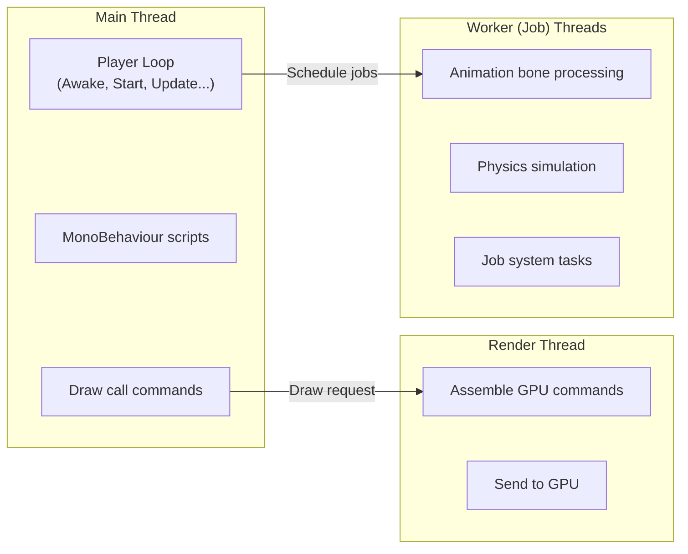
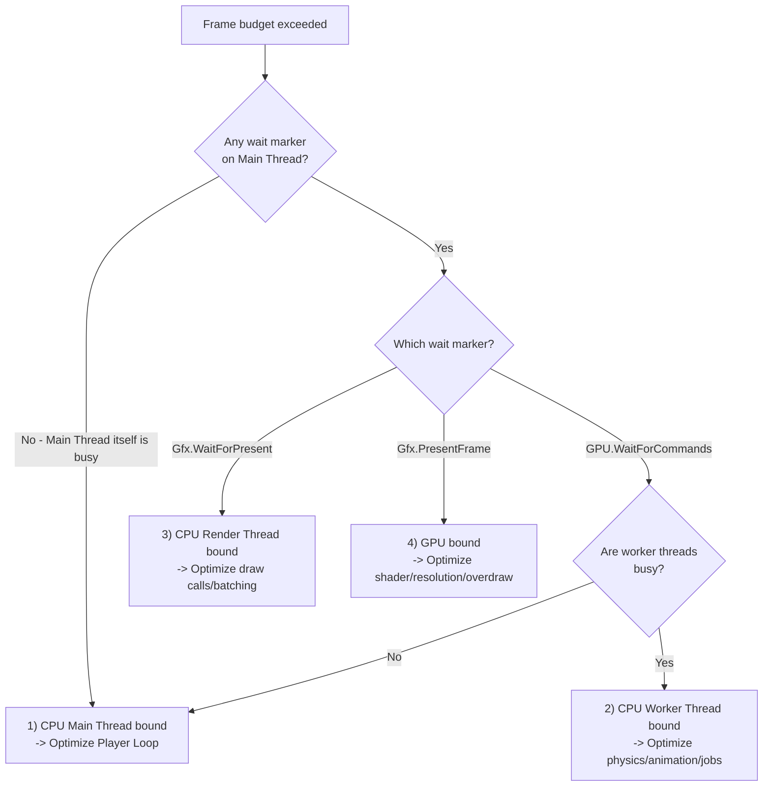
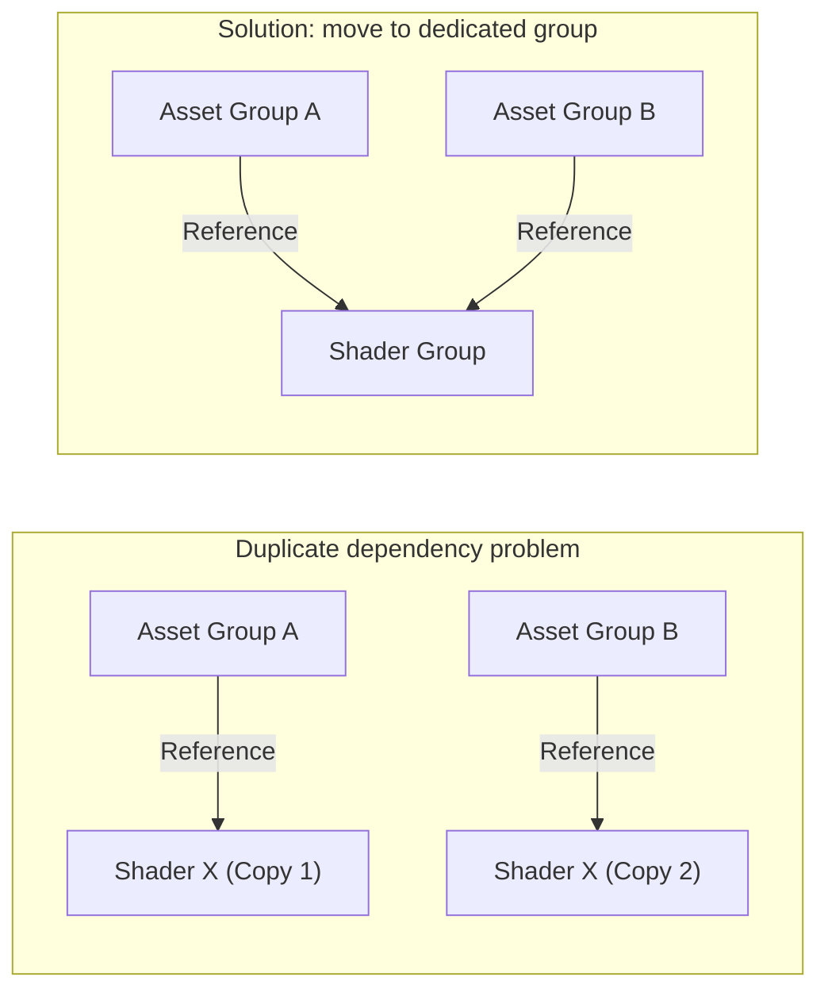
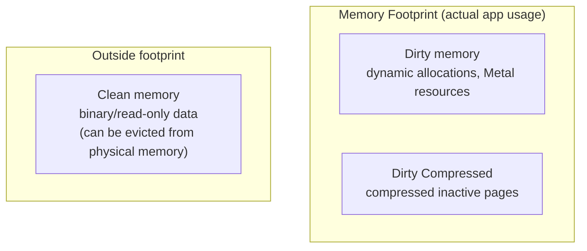
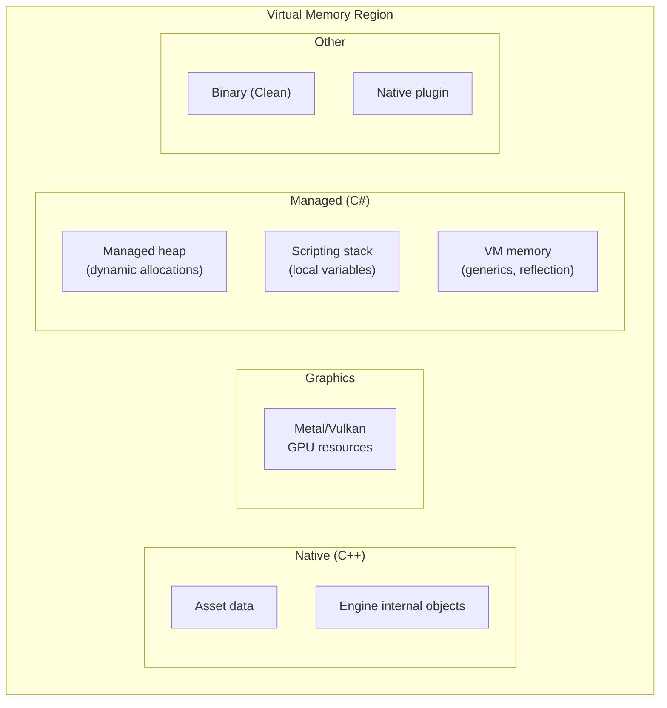
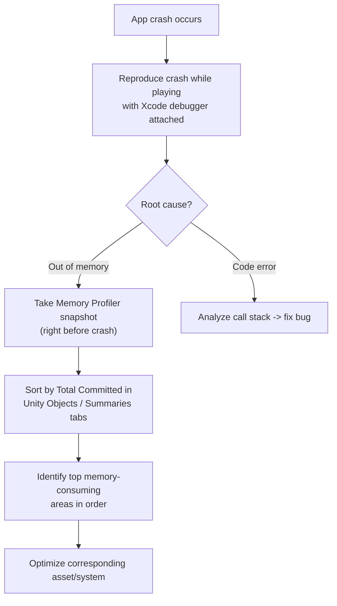

## Introduction

Optimization is unavoidable in mobile game development. Unlike PC or console, mobile devices always run under three constraints: limited memory, thermal throttling, and battery drain. No matter how fun the game is, players leave if frame rate drops due to heat or if the app is terminated because of memory pressure.

This document summarizes practical optimization methods you can apply in Unity mobile projects. It covers how to read the profiler, graphics batching, asset bundle optimization, shader variant management, and iOS memory architecture.

> This guide is based on official Unity sessions and hands-on profiling experience in production. The best strategy can differ by project, so always verify with direct profiler measurements.
{: .prompt-info }

---

## Part 1 : Mastering the Unity Profiler

Optimizing without profiling is like sailing without a map. Do not rely on feeling like "it seems slow". Find bottlenecks from profiler numbers.

### 1. Core CPU profiler principle

Before opening profiler details, first check your **frame budget based on target FPS**.

| Target FPS | Frame Budget | Meaning |
|:---:|:---:|:---|
| **60 fps** | **16.67 ms** | Most work must finish within ~16ms |
| **30 fps** | **33.33 ms** | All work must finish within ~33ms |

  
Frame Budget Distribution Example - 60fps (16.67ms) Baseline

  <canvas id="frameBudgetChart" class="chart-canvas" height="220"></canvas>

If the profiler graph shows frames beyond this budget, that is your bottleneck.

 

> **Profile with VSync disabled.** If VSync is on, charts are clamped to 16ms (60fps), making real processing time invisible. For accurate profiling, always measure with VSync off.
{: .prompt-warning }

 

### 2. Unity multi-thread architecture

Unity is a multi-core engine. To read the timeline correctly, you must understand each thread's role.

A restaurant analogy works well. The **Main Thread** is the head chef taking orders and deciding execution order. The **Render Thread** is the server delivering completed dishes to customers. **Worker (Job) Threads** are assistant cooks handling time-consuming prep work in parallel.

| Thread | Role | Main work |
|:---|:---|:---|
| **Main Thread** | Orchestrates game logic | Player Loop, MonoBehaviour, draw call requests |
| **Render Thread** | GPU communication | Build graphics commands and send to GPU |
| **Worker Threads** | Parallel compute-heavy tasks | Animation bones, physics simulation, job system |

There is **causality** between threads. If Main Thread schedules jobs, Worker Threads execute them. If Main Thread requests draw calls, Render Thread assembles commands.

> Enable profiler **Show Flow Events** to visualize cross-thread execution order and causality.
{: .prompt-tip }

 

### 3. Sampling vs Deep Profiling

In the profiler, **Sample Stack** and **Call Stack** are different. Sample Stack shows only Unity-marked C# methods and code blocks in chunks, so many operations appear as larger grouped blocks.

So should you enable Deep Profiling to see everything? Theoretically yes, but **not recommended for regular production diagnosis**.

| Mode | Pros | Cons |
|:---|:---|:---|
| **Normal sampling** | Low overhead, close to real performance | Only marked methods are visible |
| **Deep profiling** | Can trace every method call | Heavy profiling overhead -> distorted/less reliable data |

Use deep profiling only in a narrow scope and short capture window.

You can also enable **call stack recording** selectively for specific sample types.

| Call stack target | Meaning |
|:---|:---|
| **GC.Alloc** | Trace where managed allocations occur |
| **UnsafeUtility.Malloc** | Unmanaged allocation (manual free required) |
| **JobHandle.Complete** | Point where Main Thread forces job synchronization |

 

### 4. Reading graphics markers

To diagnose bottlenecks correctly, understand common graphics markers in timeline view.

| Marker | Meaning | Typical cause |
|:---|:---|:---|
| **WaitForTargetFPS** | Time waiting for target framerate | Appears when VSync is enabled (normal) |
| **Gfx.WaitForPresentOnGfxThread** | Main Thread also waits because Render Thread is waiting on GPU | Render thread bottleneck |
| **Gfx.PresentFrame** | Waiting for GPU to finish current frame | GPU processing delay |
| **GPU.WaitForCommands** | Render Thread is ready but Main Thread cannot feed commands | Main thread bottleneck |

 

### 5. Bottleneck identification strategy

Unity bottlenecks are broadly classified into **four types**. The important question is not just "CPU vs GPU" but **which thread is bottlenecked**.

| Bottleneck type | Main cause | Optimization direction |
|:---|:---|:---|
| **1) Main Thread** | Heavy scripts, GC allocs | Better algorithms, caching, reduce GC |
| **2) Worker Threads** | Physics/animation overload | Reduce physics workload, use LOD |
| **3) Render Thread** | Too many draw calls / SetPass calls | Batching strategy, shader consolidation |
| **4) GPU** | Overdraw, heavy shaders | Adjust resolution, simplify shaders |

---

## Part 2 : Graphics Optimization

### 6. The real cost behind draw calls

People often say "reduce draw calls", but in modern mobile games, the bigger cost is often **render-state setup before draw calls**. **SetPass Call** caused by switching shaders is frequently the main CPU cost.

Understanding GPU architecture also explains why tiny meshes are inefficient.

> GPU renders **one large high-vertex mesh much faster** than many tiny meshes. Execution units such as Wavefront (NVIDIA) / Warp (AMD) run fixed-size thread groups. If a unit can process 256 vertices but receives only 128, half is wasted.
{: .prompt-info }

In many cases, performance loss is not weak GPU compute power but **inefficient GPU utilization**.

 

### 7. Batching strategy comparison

Unity provides four major batching methods. Choose based on project characteristics.

 

#### SRP Batching (URP / HDRP)

This method targets the fact that **render-state setup right before draw** can cost more than draw commands themselves. It groups objects using the same shader variant and packs many draw calls under **one SetPass Call**.

- Key point: optimization naturally improves when you **reduce shader variety in the project**
- Enabling SRP Batching and minimizing shader count is usually the highest-impact strategy

 

#### Static Batching

It combines non-moving meshes **at build time** and sends one large mesh to GPU.

- Pros: no runtime merge overhead (baked at build time)
- Cons: **higher memory usage** due to merged mesh data

 

#### Dynamic Batching

It merges small meshes on CPU every frame and sends merged data to GPU.

- **Generally not recommended.** GPU-side can improve, but CPU merge cost each frame can hurt overall performance.

 

#### GPU Instancing

When drawing the same mesh many times, upload mesh data to GPU **once** and render repeatedly with different per-instance data.

- Effective for many repeated meshes (trees, grass, crowds)
- Efficiency drops for meshes with around 256 vertices or fewer

 

#### Batching strategy summary

| Method | CPU Cost | GPU Efficiency | Memory | Recommendation |
|:---|:---:|:---:|:---:|:---:|
| **SRP Batching** | Low | High | No major change | High |
| **Static Batching** | None at runtime | High | Increased | High |
| **GPU Instancing** | Low | High | Slight increase | Medium |
| **Dynamic Batching** | High | Medium | No major change | Low |

 

  

    
Before - SRP Batcher broken

    

<pre><code class="language-csharp">// Material.SetFloat creates material instances,
// breaking SRP Batcher -> SetPass Call increases!
public class EnemyFlash : MonoBehaviour
{
    Renderer _renderer;

    void Start()
        => _renderer = GetComponent&lt;Renderer&gt;();

    public void OnHit()
    {
        // BAD: Creates a new material instance
        _renderer.material.SetFloat("_FlashAmount", 1f);
    }
}</code></pre>
    

  

  

    
After - Use MaterialPropertyBlock

    

<pre><code class="language-csharp">// MaterialPropertyBlock keeps shared material,
// only changes per-instance values -> SRP Batcher preserved!
public class EnemyFlash : MonoBehaviour
{
    Renderer _renderer;
    MaterialPropertyBlock _mpb;

    static readonly int FlashAmount
        = Shader.PropertyToID("_FlashAmount");

    void Start()
    {
        _renderer = GetComponent&lt;Renderer&gt;();
        _mpb = new MaterialPropertyBlock();
    }

    public void OnHit()
    {
        // GOOD: Keep SRP Batcher
        _mpb.SetFloat(FlashAmount, 1f);
        _renderer.SetPropertyBlock(_mpb);
    }
}</code></pre>
    

  

> Set a target of **under 300 SetPass Calls**. Frame Debugger shows why SetPass calls are not merged, and you can use that data to drive shader consolidation.
{: .prompt-tip }

 

### 8. Diagnosing GPU render bottlenecks

If GPU bottleneck is suspected, use **Xcode GPU Frame Capture** to inspect per-stage render cost. In the command timeline, find unusually expensive draws, identify the shader/mesh behind them, and optimize those targets.

---

## Part 3 : Asset Optimization

### 9. Addressable & AssetBundle optimization

The most critical issue when using Addressables is **duplicate dependencies**.

If two assets in different groups reference the same dependency (for example, shader or texture), that dependency can be **included twice** in separate bundles and loaded into memory twice.

**Solution**: separate duplicate dependencies (especially **shaders**) into dedicated groups. Addressables **Analyze** can detect duplicate dependencies automatically.

 

#### AssetBundle size balance

Bundles that are too small or too large both cause problems.

| Situation | Problem |
|:---|:---|
| **Bundle too small** | Bundle objects themselves increase memory usage. More WebRequest/File IO -> more CPU time and thermal load. Partial-load benefits of LZ4 become weaker |
| **Bundle too large** | Harder to unload. Whole bundle may be loaded even if only part is needed |

 

#### Additional optimization tips

| Item | Description |
|:---|:---|
| **If AssetReference is not used** | Uncheck `Include GUIDs in Catalog` -> reduce catalog size |
| **Catalog format** | Use **Binary** instead of JSON -> faster parsing and first-layer security benefit |
| **Max Concurrent Web Requests** | Mobile has lower practical concurrent request limits, so reduce from default 500 |
| **CRC check** | If enabled, bundle integrity can be verified (tamper detection) |

 

### 10. Shader variant optimization

Shader variants are often overlooked in mobile optimization, but impact is large. If one shader uses many keywords, each keyword combination creates a separate variant. If you also support multiple graphics APIs (OpenGL ES, Vulkan, etc.), variant count grows **multiplicatively**.

**Every shader variant can trigger SetPass Calls.** Reducing variant count directly helps draw-call-side performance.

 

#### Variant optimization checklist

| Item | Method |
|:---|:---|
| **Remove unnecessary keywords** | Merge shaders with similar roles and disable unused keywords |
| **Addressable shader group** | Without dedicated shader grouping, duplicate variants are included in multiple bundles |
| **Lightmap mode cleanup** | Disable unused Lightmap Modes to explicitly remove related keywords |
| **Graphics API cleanup** | Disable unused APIs -> prevent per-API variant multiplication |
| **URP strip settings** | Enable shader stripping options in URP settings |
| **Code stripping** | Adjust Managed Stripping Level to remove unused code and related keywords |

 

#### Use Project Auditor

**Project Auditor** is Unity's static analysis tool for assets, project settings, and scripts. It is especially useful for reducing shader variants.

A practical elimination workflow:

1. Clear previous build cache
2. Enable `Project Settings > Graphics > Log Shader Compilation`
3. Build with Development Build enabled
4. Check compiled variant list in Project Auditor
5. Identify unnecessary variants and clean related keywords

 

> Be careful with materials not included in the player build. Keywords declared by `shader_feature` are stripped if no build-included material uses them. But material references from Addressable bundles can change strip decisions at build time, so consider custom strip scripts using `IPreprocessShaders`.
{: .prompt-warning }

---

## Part 4 : Understanding Memory Architecture

### 11. iOS memory architecture

To optimize mobile memory correctly, you need OS-level understanding of memory management. This section explains with iOS examples, but core concepts are similar on Android.

#### Physical memory vs virtual memory

Apps do **not** allocate directly in physical RAM. Allocations are made in **virtual memory (VM)**, and VM pages (4KB or 16KB) are mapped into physical memory.

Why this matters: it is common to allocate 1.78GB in VM while actual physical usage is around 380MB. High VM size alone is not automatically a problem. **What matters most is physical memory usage.**

 

#### Dirty vs Clean memory

iOS classifies memory pages into three groups. This classification is central to optimization.

| Type | Contents | Examples | Physical residency |
|:---|:---|:---|:---:|
| **Dirty** | Dynamically allocated data, modified frameworks, Metal API resources | Heap objects, textures | High |
| **Dirty Compressed** | Dirty pages rarely accessed, compressed by OS | Old caches | Medium |
| **Clean** | Mapped files, read-only frameworks, app binaries (static code) | .dylib, executable code | Low |

**Memory Footprint = Dirty + Dirty Compressed.** This is what the app actually occupies. If this exceeds iOS limits, the app is killed (OOM Kill).

> **Dirty memory is the top optimization priority.** Dirty pages must remain in physical memory, like a guaranteed minimum cost. Reducing dynamic allocations (including GC allocs) directly reduces Dirty memory.
{: .prompt-warning }

 

### 12. Unity memory architecture

Unity is a **C++ engine running a .NET VM**. Core systems are in C++, while gameplay code is controlled in C#. So loading one asset can allocate memory in both **C++ native memory** and **C# managed memory**.

| Area | Dirty/Clean | Description |
|:---|:---:|:---|
| **Native (C++)** | Dirty | Asset data, engine internal objects |
| **Graphics** | Dirty | GPU allocations via Metal/Vulkan |
| **Managed (C#)** | Dirty | Heap objects, stacks, VM memory |
| **Executable/Mapped** | Clean | Binaries, DLLs (evictable) |
| **Native Plugin** | Mixed | Plugin binaries are Clean, runtime allocations are Dirty |

 

#### Managed memory deep dive

Understanding C# GC behavior helps prevent memory fragmentation.

Unity GC allocator generally works like this:

1. Reserve **memory pools (regions)** and create blocks grouped by similar object sizes
2. Allocate new objects into existing blocks
3. If allocation does not fit -> create and allocate a **custom block**
4. If still no space -> **trigger GC** -> if still not enough -> **expand heap**

 

> **Incremental GC is recommended.** Normal GC expands heap only after collection if space is still insufficient. Incremental GC can expand while collecting, reducing frame spikes.
{: .prompt-tip }

If **Empty Heap Size is large**, it is a sign of serious fragmentation. That means extra CPU overhead during allocation and larger unnecessary memory occupation.

 

#### VM memory cautions

VM memory (generics, type metadata, reflection) tends to **grow continuously during runtime**.

Ways to reduce it:

| Method | Description |
|:---|:---|
| **Minimize reflection** | Reflection creates type metadata at runtime |
| **Code stripping** | Engine code strip + managed stripping level tuning |
| **Generic sharing** | Available from Unity 2022; shares code across generic instantiations |

> If code stripping is enabled while reflection-based code exists, runtime crashes may occur. Preserve required types explicitly in `link.xml`.
{: .prompt-warning }

---

## Part 5 : Using profiling tools

### 13. Unity Memory Profiler 1.1

Unity Memory Profiler is a snapshot-based memory analysis tool. Key tabs:

#### Allocated Memory Distribution

| Category | Description |
|:---|:---|
| **Native** | Allocations from C++ native code |
| **Graphics** | GPU allocations from Metal/Vulkan |
| **Managed** | C# managed heap |
| **Executable & Mapped** | Clean memory (binaries, DLLs) |
| **Untracked** | Allocations Unity could not classify (plugins, etc.) |

> A large Untracked value is not always a problem. For example, `MALLOC_NANO` may show 500MB allocated but only 3.3MB resident. Reserved heap space and actual usage are different.
{: .prompt-info }

#### Unity Objects tab

Shows three memory dimensions per object: **Native Size, Managed Size, Graphics Size**. This quickly reveals which assets consume the most memory.

#### Memory Map (hidden feature)

You cannot see concrete object names, but you can inspect which frameworks/binaries occupy memory at a high level.

> Memory Profiler is a **snapshot** tool, so it is hard to answer "when and why this allocation happened." For call-stack-level tracing, pair with native profilers such as Xcode Instruments.
{: .prompt-info }

 

### 14. Xcode Instruments

iOS deep memory analysis requires Xcode Instruments.

**Prerequisite**: include **debug symbols** in Xcode Build Settings.

#### Main metrics to inspect

| Metric | Description |
|:---|:---|
| **Resident** | Size actually resident in physical memory |
| **Dirty Size** | Dirty pages within virtual memory allocations |
| **Swapped** | Swapped-out memory |

#### Category mapping

| Instruments Category | Unity mapping |
|:---|:---|
| **"GPU"** | Unity GPU processing (Graphics memory) |
| **App Allocations** | Unity CPU-side processing (Native + Managed) |
| **IOSurface** | 100% residency ratio -> must exist in physical memory |
| **Binaries / Code** | Clean memory |

> If **IOSurface residency is 100%**, that memory is fully resident in physical memory. If it exceeds physical limits, the app is terminated.
{: .prompt-warning }

`Memory Graph` is a native memory snapshot tool that visualizes object references.

---

## Part 6 : Practical troubleshooting

### 15. Memory crash debugging flow

When the app crashes, first determine whether it is a **memory issue** or a **different error**.

#### Key inspection sequence

1. **Confirm crash type**: with Xcode debugger attached, determine memory crash vs code error
2. **If memory issue**: in Memory Profiler, sort and investigate the largest Total Committed regions first
3. **Check texture Read/Write**: when enabled, CPU-side copy is also kept -> disable unless strictly necessary

> Mobile uses **Unified Memory**. CPU and GPU share the same physical memory, so GPU usage directly affects total memory budget. This differs from desktop GPUs with dedicated VRAM.
{: .prompt-info }

---

## Conclusion

There is no silver bullet in optimization. Finding exact bottlenecks through profiling and making data-driven decisions is the only reliable approach.

Summary of the key points:

| Area | Core strategy |
|:---|:---|
| **CPU bottlenecks** | Identify per-thread bottlenecks in timeline; minimize GC allocs |
| **Graphics** | Prioritize SRP Batching; reduce shader variety; target under 300 SetPass Calls |
| **Assets** | Resolve Addressable duplicate dependencies; isolate shader groups; balance bundle size |
| **Shaders** | Analyze variants with Project Auditor; remove unnecessary keywords/APIs |
| **Memory** | Dirty memory = top optimization target; enable Incremental GC |
| **Tools** | Use Unity Memory Profiler with Xcode Instruments together |

Most importantly, optimization starts with **measurement**, not intuition. Optimizing without profiler data is like driving with your eyes closed. Start with profiler data and end with profiler data.
