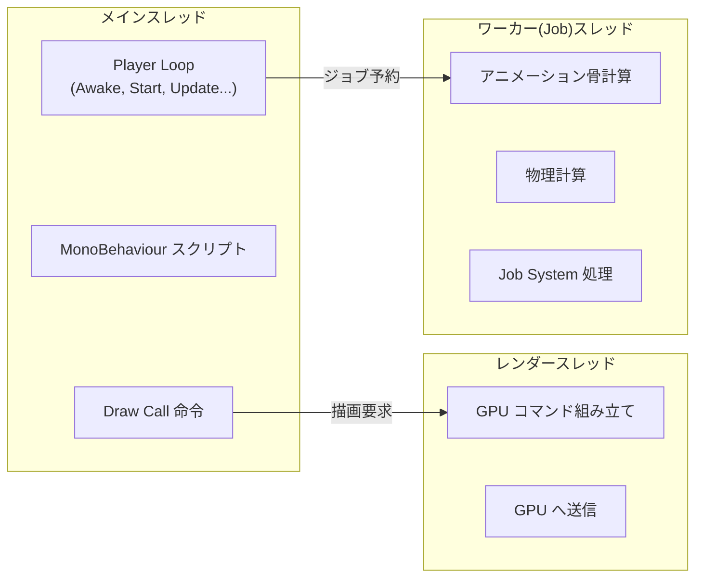
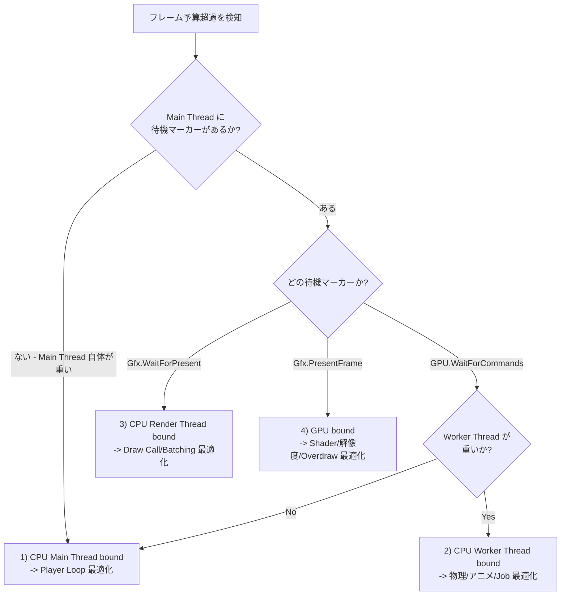
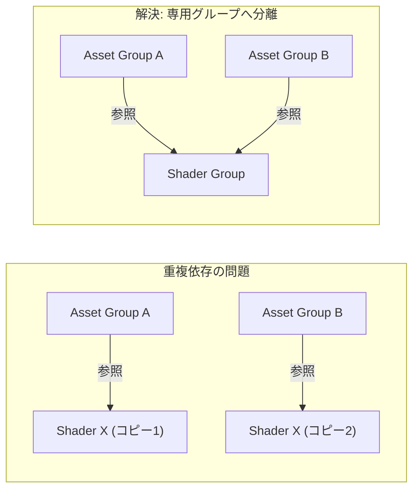
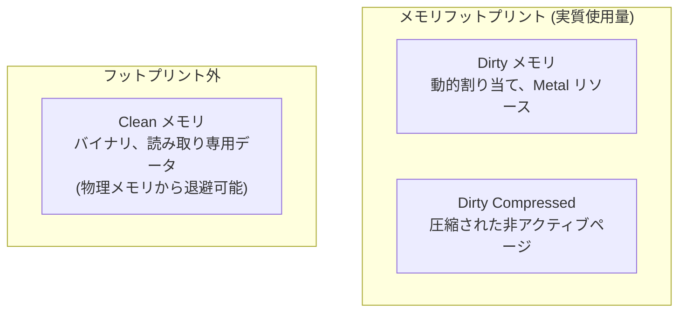
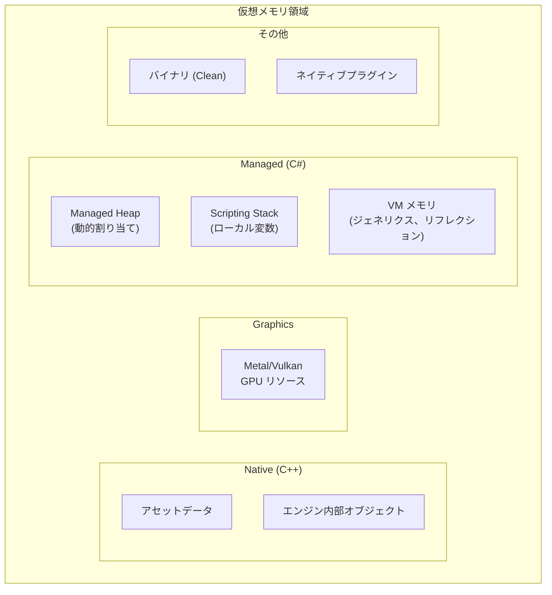
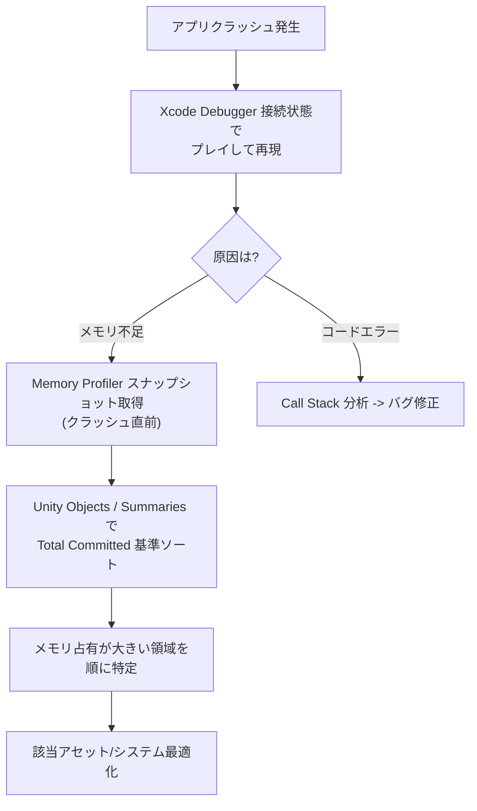

## はじめに

モバイルゲーム開発において最適化は避けられない課題です。PC/コンソールと違い、モバイル端末は常に「限られたメモリ」「発熱」「バッテリー消費」という制約を抱えています。どれだけ面白いゲームでも、発熱でフレームが落ちたり、メモリ不足で強制終了すればユーザーは離脱します。

この文書では、Unity モバイルプロジェクトで実戦的に使える最適化手法を整理します。Profiler の読み方から、Graphics Batching、AssetBundle 最適化、Shader Variant 管理、iOS メモリ構造まで幅広く扱います。

> 本文の内容は Unity 公式セッションと実務プロファイリング経験をベースに整理しています。最適解はプロジェクト条件で変わるため、必ず Profiler 実測で判断してください。
{: .prompt-info }

---

## Part 1 : Unity Profiler を使いこなす

プロファイリングなしの最適化は、地図なし航海と同じです。「遅い気がする」ではなく、Profiler の数値でボトルネックを特定する必要があります。

### 1. CPU Profiler の基本原則

Profiler を開く前に最初に確認すべきなのは、**ターゲット FPS に対するフレーム予算**です。

| ターゲット FPS | フレーム予算 | 意味 |
|:---:|:---:|:---|
| **60 fps** | **16.67 ms** | 多くの処理を 16ms 以内で終える必要がある |
| **30 fps** | **33.33 ms** | 全処理を 33ms 以内で終える必要がある |

  
フレーム予算配分例 - 60fps (16.67ms) 基準

  <canvas id="frameBudgetChart" class="chart-canvas" height="220"></canvas>

Profiler グラフでこの予算を超えるフレームが見えたら、それがボトルネックです。

 

> **VSync を OFF にしてプロファイルしてください。** VSync が ON だとチャートが 16ms(60fps) にクランプされ、実際の処理時間が見えません。正確な計測には VSync 無効化が必須です。
{: .prompt-warning }

 

### 2. Unity のマルチスレッド構造

Unity はマルチコアエンジンです。Profiler タイムラインを正しく読むには、各スレッドの役割理解が必要です。

レストランで例えると、**Main Thread** は注文を受けて段取りを決める料理長、**Render Thread** は完成料理を提供するサーブ担当、**Worker(Job) Thread** は仕込みを並列で進める補助調理担当です。

| スレッド | 役割 | 主な処理 |
|:---|:---|:---|
| **Main Thread** | ゲームロジックの司令塔 | Player Loop, MonoBehaviour, Draw Call 要求 |
| **Render Thread** | GPU 通信担当 | Graphics コマンド組み立てと GPU 送信 |
| **Worker Thread** | 計算集約処理の並列実行 | 骨計算、物理シミュレーション、Job System |

スレッド間には **因果関係** があります。Main Thread がジョブを予約すると Worker Thread が処理し、Main Thread が Draw Call を出すと Render Thread がコマンドを組み立てます。

> Profiler の **Show Flow Events** を有効化すると、スレッド間の実行順序と因果関係を視覚的に確認できます。
{: .prompt-tip }

 

### 3. Sampling vs Deep Profiling

Profiler に見える **Sample Stack** と **Call Stack** は別物です。Sample Stack は Unity がマークした C# メソッド/コードブロックのみをチャンクで表示するため、大きな塊で見えます。

では Deep Profiling を有効にすれば全て見えるのか? 理論上はそうですが、**実戦で常用は非推奨**です。

| 方式 | 長所 | 短所 |
|:---|:---|:---|
| **通常 Sampling** | 低オーバーヘッド、実性能に近い | マーク済みメソッドのみ表示 |
| **Deep Profiling** | ほぼ全メソッド呼び出し追跡 | プロファイリング自体のオーバーヘッドが大きく、データが歪む |

Deep Profiling は限定スコープ・短時間で使うのが安全です。

**Call Stack 記録**も、対象サンプルを絞って有効化できます。

| Call Stack 対象 | 意味 |
|:---|:---|
| **GC.Alloc** | 動的割り当て発生地点を追跡 |
| **UnsafeUtility.Malloc** | unmanaged 割り当て (手動解放が必要) |
| **JobHandle.Complete** | Main Thread が Job を強制同期完了した地点 |

 

### 4. Graphics Marker の読み方

Timeline で頻出する Graphics Marker の意味を知ると、ボトルネック診断精度が上がります。

| Marker | 意味 | 原因 |
|:---|:---|:---|
| **WaitForTargetFPS** | 目標フレームレート待機時間 | VSync 有効時に出る (正常) |
| **Gfx.WaitForPresentOnGfxThread** | Render Thread が GPU 待ちで Main Thread も待機 | Render Thread ボトルネック |
| **Gfx.PresentFrame** | GPU の現在フレーム描画完了待ち | GPU 側処理遅延 |
| **GPU.WaitForCommands** | Render Thread は準備完了だが Main Thread が命令供給できない | Main Thread ボトルネック |

 

### 5. ボトルネック特定戦略

Unity のボトルネックは大きく **4 種類**。重要なのは「GPU か CPU か」だけでなく、**どのスレッドが詰まっているか**を特定することです。

| ボトルネック種別 | 主因 | 最適化方向 |
|:---|:---|:---|
| **1) Main Thread** | 重いスクリプト、GC Alloc | アルゴリズム改善、キャッシュ、GC 削減 |
| **2) Worker Thread** | 物理/アニメーション過負荷 | 物理オブジェクト削減、LOD 活用 |
| **3) Render Thread** | Draw Call / SetPass Call 過多 | Batching 戦略、Shader 統合 |
| **4) GPU** | Overdraw、重い Shader | 解像度調整、Shader 軽量化 |

---

## Part 2 : Graphics 最適化

### 6. Draw Call の本当のコスト

「Draw Call を減らせ」とよく言われますが、現代モバイルでは **Draw Call 直前の Render State セットアップ** がより重いケースが多いです。異なる Shader 切り替え時に発生する **SetPass Call** が CPU コストの主犯になることがよくあります。

GPU アーキテクチャを理解すると、小さなメッシュが非効率な理由も見えてきます。

> GPU は小さいメッシュ多数より、**頂点数の大きいメッシュ 1 つ**を高速に描く傾向があります。Wavefront/Warp は固定サイズのスレッド束で動くため、256 頂点処理単位に 128 頂点しか渡さないと半分が無駄になります。
{: .prompt-info }

つまり性能低下は GPU 計算性能不足ではなく、**GPU 利用効率不足**で起きることが多いです。

 

### 7. Batching 戦略比較

Unity の Batching は主に 4 種類。特性を理解してプロジェクトに合わせて選択する必要があります。

 

#### SRP Batching (URP / HDRP)

Draw 命令より **直前の Render State セットアップ** が重い点に着目した方式です。同一 Shader Variant のオブジェクトを集めて、**1 つの SetPass Call** 下に複数 Draw Call を束ねます。

- 核心: **使用 Shader 種類を減らすほど最適化効果が出る**
- SRP Batching を有効化し、Shader 数を最小化するのが高効果

 

#### Static Batching

動かないメッシュを **ビルド時に事前結合** し、大きなメッシュとして GPU へ渡します。

- 長所: ランタイム結合オーバーヘッドなし (ビルド時 Bake)
- 短所: 結合分だけ **メモリ使用量増加**

 

#### Dynamic Batching

小さいメッシュを毎フレーム CPU で結合して GPU へ渡します。

- **基本的に非推奨。** GPU 側は有利でも、毎フレーム結合する CPU コストで全体性能が悪化しやすい。

 

#### GPU Instancing

同一メッシュを多数描く時、メッシュデータは GPU に **1 回だけアップロード** し、インスタンスデータだけ変えて繰り返し描画します。

- 木・草・群衆など同一メッシュ大量配置に有効
- 頂点数 256 以下のメッシュでは効率が下がりやすい

 

#### Batching 戦略まとめ

| 方式 | CPU コスト | GPU 効率 | メモリ | 推奨度 |
|:---|:---:|:---:|:---:|:---:|
| **SRP Batching** | 低 | 高 | 変化ほぼなし | 高 |
| **Static Batching** | ランタイムなし | 高 | 増加 | 高 |
| **GPU Instancing** | 低 | 高 | やや増加 | 中 |
| **Dynamic Batching** | 高 | 中 | 変化ほぼなし | 低 |

 

  

    
Before - SRP Batcher を壊す例

    

<pre><code class="language-csharp">// Material.SetFloat はインスタンスを生成し、
// SRP Batcher を壊す -> SetPass Call 増加
public class EnemyFlash : MonoBehaviour
{
    Renderer _renderer;

    void Start()
        => _renderer = GetComponent&lt;Renderer&gt;();

    public void OnHit()
    {
        // ❌ 新しい Material インスタンス生成
        _renderer.material.SetFloat("_FlashAmount", 1f);
    }
}</code></pre>
    

  

  

    
After - MaterialPropertyBlock 使用

    

<pre><code class="language-csharp">// MaterialPropertyBlock は Material を共有したまま
// インスタンス値のみ変更 -> SRP Batcher 維持
public class EnemyFlash : MonoBehaviour
{
    Renderer _renderer;
    MaterialPropertyBlock _mpb;

    static readonly int FlashAmount
        = Shader.PropertyToID("_FlashAmount");

    void Start()
    {
        _renderer = GetComponent&lt;Renderer&gt;();
        _mpb = new MaterialPropertyBlock();
    }

    public void OnHit()
    {
        // ✅ SRP Batcher 維持
        _mpb.SetFloat(FlashAmount, 1f);
        _renderer.SetPropertyBlock(_mpb);
    }
}</code></pre>
    

  

> **SetPass Call 300 未満**を目標にしてください。Frame Debugger で SetPass Call が統合されない理由を確認し、Shader 統合戦略に反映します。
{: .prompt-tip }

 

### 8. GPU レンダーボトルネック診断

GPU レンダーボトルネックが疑われる場合、**Xcode GPU Frame Capture** でレンダーステージごとの時間消費を確認できます。タイムライン上で異常に重い Draw を見つけ、その Draw が使う Shader と Mesh を特定して最適化します。

---

## Part 3 : Asset 最適化

### 9. Addressable & AssetBundle 最適化

Addressables で最も注意すべきなのは **重複依存 (Duplicate Dependencies)** です。

異なる Asset Group の 2 つのアセットが同じ依存アセット (例: Shader、Texture) を参照すると、その依存アセットが各 Bundle に **重複収録** され、メモリに 2 回ロードされます。

**解決方法**: 重複依存になりやすいアセット (特に **Shader**) を専用グループへ分離します。Addressables の **Analyze** で自動検出可能です。

 

#### AssetBundle サイズのバランス

Bundle は小さすぎても大きすぎても問題です。

| 状況 | 問題点 |
|:---|:---|
| **小さすぎる Bundle** | Bundle 自体がオブジェクトなのでメモリ増。WebRequest/File IO 増加 -> CPU 時間/発熱増。LZ4 の部分ロード利点が薄れる |
| **大きすぎる Bundle** | アンロードしにくい。部分利用でも Bundle 全体ロードになりやすい |

 

#### 追加最適化 Tips

| 項目 | 説明 |
|:---|:---|
| **AssetReference 未使用時** | `Include GUIDs in Catalog` を OFF -> Catalog サイズ削減 |
| **Catalog 形式** | JSON ではなく **Binary** -> 解析高速化 + 一次的セキュリティ効果 |
| **Max Concurrent Web Requests** | モバイルは同時リクエスト上限が低いので、デフォルト 500 より下げる |
| **CRC チェック** | 有効化で Bundle 整合性検証 (改ざん検知) |

 

### 10. Shader Variant 最適化

Shader Variant はモバイル最適化で見落とされがちですが、影響が大きい領域です。1 つの Shader に複数キーワードを使うと組み合わせごとに Variant が増えます。さらに複数 Graphics API (OpenGL ES, Vulkan など) を併用すると、Variant 数は **乗算的に増加**します。

**Shader Variant 1 つ 1 つが SetPass Call に直結**します。つまり Variant 数削減は Draw 側最適化に直結します。

 

#### Variant 最適化チェックリスト

| 項目 | 方法 |
|:---|:---|
| **不要キーワード削除** | 役割が近い Shader を統合し、未使用キーワードを無効化 |
| **Addressable Shader Group** | 専用グループ化しないと各 Bundle に重複 Variant が入る |
| **Lightmap Mode 整理** | 未使用 Lightmap Mode を無効化して関連キーワードを明示削除 |
| **Graphics API 整理** | 未使用 API を無効化し、API ごとの Variant 増殖を防ぐ |
| **URP Strip 設定** | URP の Shader Stripping を有効化 |
| **Code Strip** | Managed Stripping Level 調整で未使用コード/関連キーワード削除 |

 

#### Project Auditor 活用

**Project Auditor** は Unity の静的解析ツールで、Asset/Project Settings/Script を解析します。Shader Variant 削減に特に有効です。

実践的な消去法フロー:

1. 直前ビルドキャッシュ削除
2. `Project Settings > Graphics > Log Shader Compilation` を有効化
3. Development Build でビルド
4. Project Auditor でコンパイル Variant 一覧確認
5. 不要 Variant を特定しキーワード整理

 

> プレイヤービルドに含まれない Material に注意してください。`shader_feature` キーワードは使用 Material がなければ Strip されます。ただし Addressable Bundle 側 Material 参照で判定が変わる場合があるため、`IPreprocessShaders` を使ったカスタム Strip スクリプトも検討できます。
{: .prompt-warning }

---

## Part 4 : メモリ構造の理解

### 11. iOS メモリ構造

モバイルメモリ最適化では OS レベルの管理理解が重要です。ここでは iOS 基準で説明しますが、核心概念は Android にも近いです。

#### 物理メモリ vs 仮想メモリ

アプリは **物理メモリ (RAM)** を直接使いません。割り当ては **仮想メモリ (VM)** で行われ、VM ページ (4KB / 16KB) が物理メモリへマッピングされます。

重要な理由: VM で 1.78GB 割り当てても、実際の物理メモリ使用が 380MB 程度というケースは普通にあります。VM が大きいだけでは即問題ではありません。**本当に重要なのは物理メモリ使用量**です。

 

#### Dirty vs Clean メモリ

iOS はメモリページを 3 種類に分類します。これが最適化の核心です。

| 分類 | 内容 | 例 | 物理メモリ常駐 |
|:---|:---|:---|:---:|
| **Dirty** | 動的割り当てデータ、変更済みフレームワーク、Metal リソース | Heap オブジェクト、Texture | 高 |
| **Dirty Compressed** | アクセス頻度の低い Dirty ページを OS が圧縮 | 古いキャッシュ | 中 |
| **Clean** | マッピングファイル、読み取り専用フレームワーク、アプリバイナリ | .dylib、実行コード | 低 |

**メモリフットプリント = Dirty + Dirty Compressed**。これがアプリ実質占有量で、iOS 許容量を超えると OOM Kill されます。

> **Dirty メモリが最優先最適化対象です。** Dirty は物理メモリ常駐が必須で、最低保証コストのようなものです。動的割り当て (GC Alloc 含む) を減らすと Dirty が減ります。
{: .prompt-warning }

 

### 12. Unity メモリ構造

Unity は **.NET VM 上で動く C++ エンジン**です。コアは C++、ゲームスクリプト制御は C#。そのため 1 つのアセットロードでも **C++ Native と C# Managed の両方**に割り当てが発生します。

| 領域 | Dirty/Clean | 説明 |
|:---|:---:|:---|
| **Native (C++)** | Dirty | アセットデータ、エンジン内部オブジェクト |
| **Graphics** | Dirty | Metal/Vulkan による GPU 割り当て |
| **Managed (C#)** | Dirty | Heap オブジェクト、Stack、VM メモリ |
| **Executable/Mapped** | Clean | バイナリ、DLL (退避可能) |
| **Native Plugin** | 混在 | プラグインバイナリは Clean、ランタイム割り当ては Dirty |

 

#### Managed Memory 深掘り

C# の GC 動作を理解すると、メモリ断片化を抑えやすくなります。

Unity GC アロケータは概ね以下の流れです。

1. **メモリプール(リージョン)確保**後、近いサイズのオブジェクト単位でブロック化
2. 新規オブジェクトは既存ブロックへ割り当て
3. 入らなければ **カスタムブロック生成**
4. それでも不足なら **GC トリガー** -> まだ不足なら **ヒープ拡張**

 

> **Incremental GC 推奨。** 通常 GC は Collection 後に不足ならヒープ拡張しますが、Incremental GC は Collection と拡張を分散し、フレームスパイクを緩和できます。
{: .prompt-tip }

**Empty Heap Size が大きい**場合、断片化が進んでいるサインです。割り当て時 CPU オーバーヘッド増加と不要メモリ占有増加を意味します。

 

#### VM メモリ注意点

VM メモリ (ジェネリクス、型メタデータ、リフレクション) は **ランタイム中に増え続ける傾向**があります。

削減方法:

| 方法 | 説明 |
|:---|:---|
| **リフレクション最小化** | リフレクションはランタイムに型メタデータを生成 |
| **コードストリップ** | エンジンコードストリップ + Managed Stripping Level 調整 |
| **ジェネリックシェアリング** | Unity 2022 以降。ジェネリクス実体化時にコード共有 |

> コードストリップ有効時にリフレクション依存コードがあるとランタイムクラッシュの可能性があります。`link.xml` で必要型を明示保護してください。
{: .prompt-warning }

---

## Part 5 : プロファイリングツール活用

### 13. Unity Memory Profiler 1.1

Unity Memory Profiler はスナップショットベースのメモリ分析ツールです。主要タブを整理します。

#### Allocated Memory Distribution

| カテゴリ | 説明 |
|:---|:---|
| **Native** | C++ ネイティブコード由来割り当て |
| **Graphics** | Metal/Vulkan による GPU 割り当て |
| **Managed** | C# Managed Heap |
| **Executable & Mapped** | Clean メモリ (バイナリ、DLL) |
| **Untracked** | Unity が分類できない割り当て (プラグイン等) |

> Untracked が大きくても必ずしも問題ではありません。`MALLOC_NANO` は Allocated 500MB でも Resident が 3.3MB というケースがあります。事前確保領域と実使用量は別です。
{: .prompt-info }

#### Unity Objects タブ

各オブジェクトの **Native Size / Managed Size / Graphics Size** を表示し、どのアセットが重いかを素早く把握できます。

#### Memory Map (隠し機能)

具体的なオブジェクト名は見えませんが、どのフレームワーク/バイナリがメモリを占有しているかを俯瞰できます。

> Memory Profiler は **スナップショット** なので、「いつ/なぜこの割り当てが起きたか」の追跡には弱いです。Call Stack 追跡が必要なら Xcode Instruments などネイティブプロファイラを併用してください。
{: .prompt-info }

 

### 14. Xcode Instruments

iOS の深いメモリ分析には Xcode Instruments が必須です。

**事前準備**: Xcode Build Settings で **Debug Symbol を必ず含める**こと。

#### 主要確認指標

| 項目 | 説明 |
|:---|:---|
| **Resident** | 実際に物理メモリへ常駐するサイズ |
| **Dirty Size** | 仮想メモリ割り当て中の Dirty ページサイズ |
| **Swapped** | スワップ済みメモリ |

#### カテゴリ対応

| Instruments カテゴリ | Unity 対応 |
|:---|:---|
| **"GPU"** | Unity GPU 処理 (Graphics メモリ) |
| **App Allocations** | Unity CPU 側処理 (Native + Managed) |
| **IOSurface** | 常駐率 100% -> 物理メモリ常駐必須 |
| **Binaries / Code** | Clean メモリ |

> **IOSurface の常駐率が 100%**ということは物理メモリに 100% 配置されているという意味です。この領域が物理メモリ限界を超えるとアプリは終了します。
{: .prompt-warning }

`Memory Graph` 機能は、オブジェクト参照関係を可視化できるネイティブメモリスナップショットツールです。

---

## Part 6 : 実戦トラブルシューティング

### 15. メモリクラッシュ調査フロー

アプリがクラッシュしたとき最初にやるべきことは、**メモリ問題か別エラーかの切り分け**です。

#### 重要チェック順序

1. **クラッシュ種別確認**: Xcode Debugger 接続で再現し、メモリクラッシュかコードエラーか切り分け
2. **メモリ問題なら**: Memory Profiler で Total Committed の大きい領域から優先調査
3. **Texture Read/Write 設定確認**: ON だと CPU 側コピーも保持されるため、必要時以外は OFF

> モバイルは **Unified Memory** 構造です。CPU/GPU が同一物理メモリを共有するため、GPU メモリ使用は全体予算へ直接影響します。専用 VRAM を持つデスクトップ GPU と異なる点です。
{: .prompt-info }

---

## まとめ

最適化に銀の弾丸はありません。Profiler で正確なボトルネックを見つけ、データに基づいて意思決定することが唯一の正攻法です。

本文の要点:

| 領域 | 核心戦略 |
|:---|:---|
| **CPU ボトルネック** | Timeline でスレッド別に特定。GC Alloc 最小化 |
| **Graphics** | SRP Batching 優先。Shader 種類削減。SetPass Call 300 未満目標 |
| **Asset** | Addressable 重複依存解消。Shader 専用グループ化。Bundle サイズ最適化 |
| **Shader** | Project Auditor で Variant 解析。不要キーワード/API 削除 |
| **メモリ** | Dirty メモリを最優先最適化。Incremental GC 有効化 |
| **ツール** | Unity Memory Profiler と Xcode Instruments 併用 |

何より最適化は **「勘」ではなく「計測」** から始まります。Profiler なし最適化は目を閉じて運転するのと同じです。常に Profiler から始め、Profiler で終えてください。
