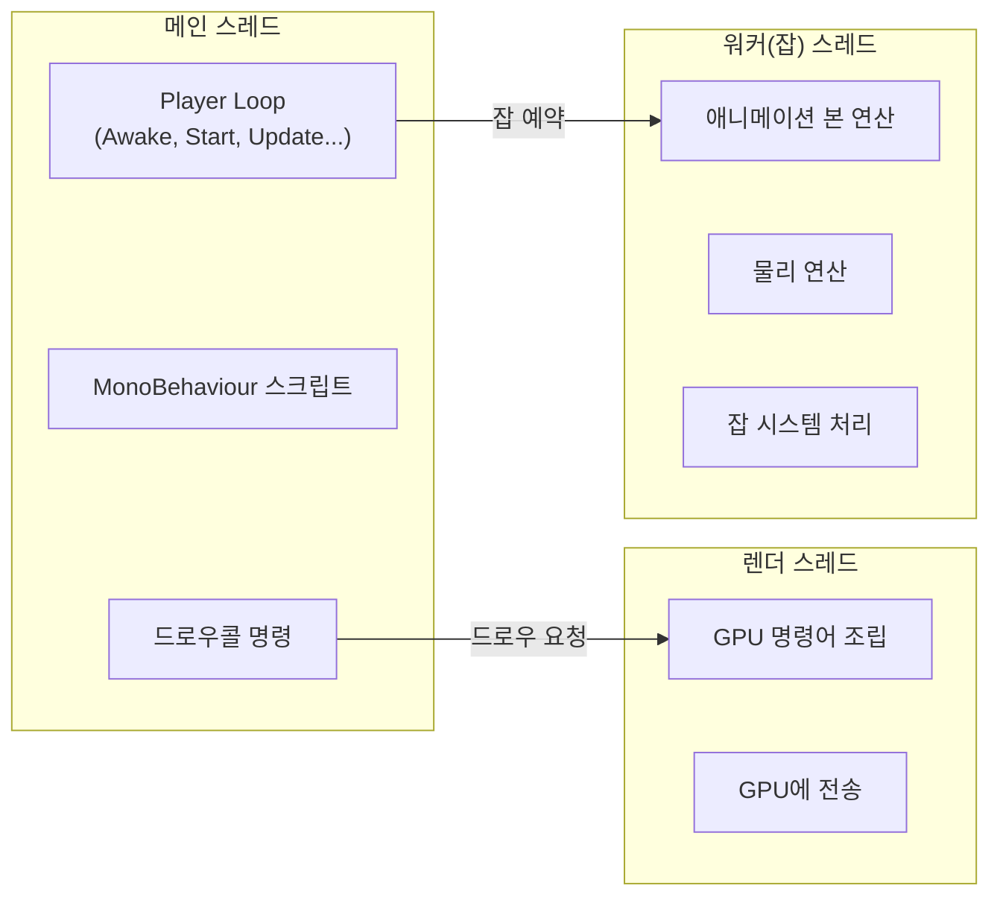
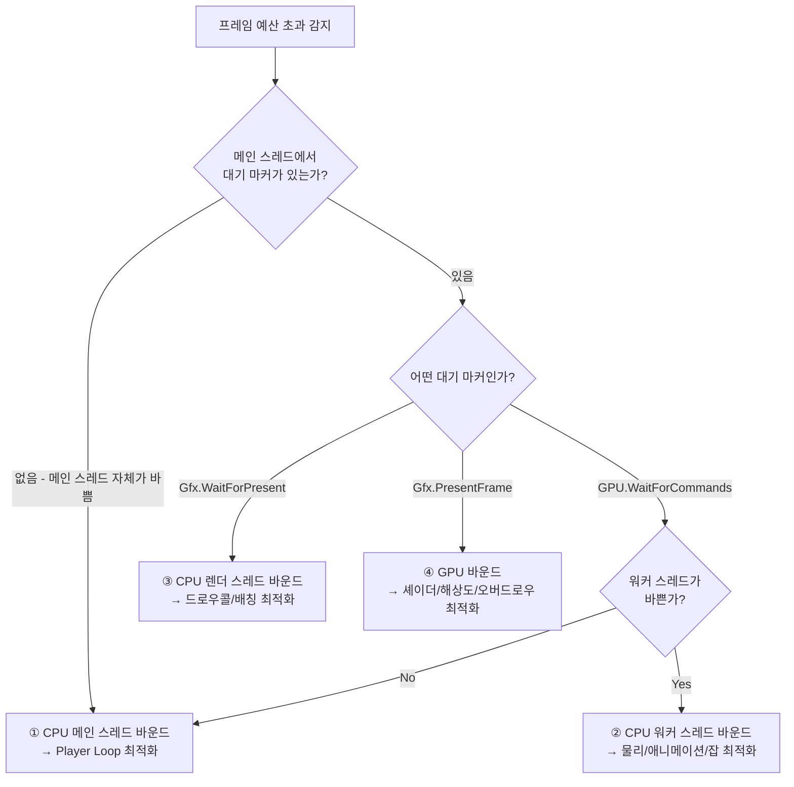
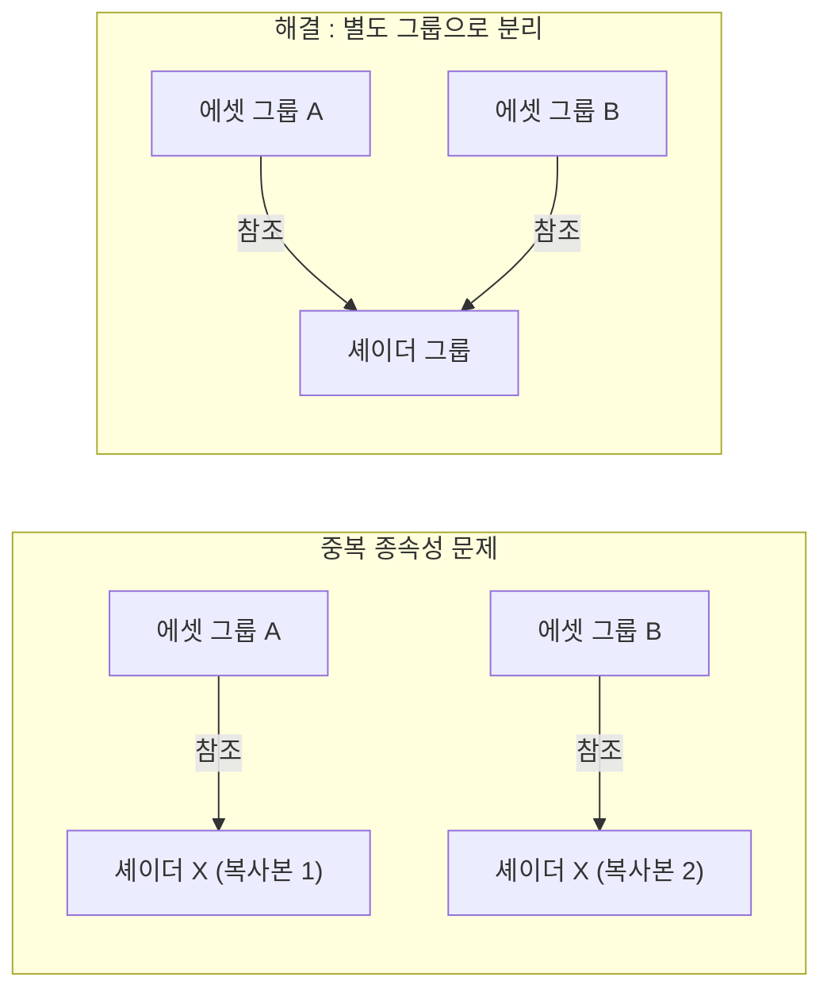
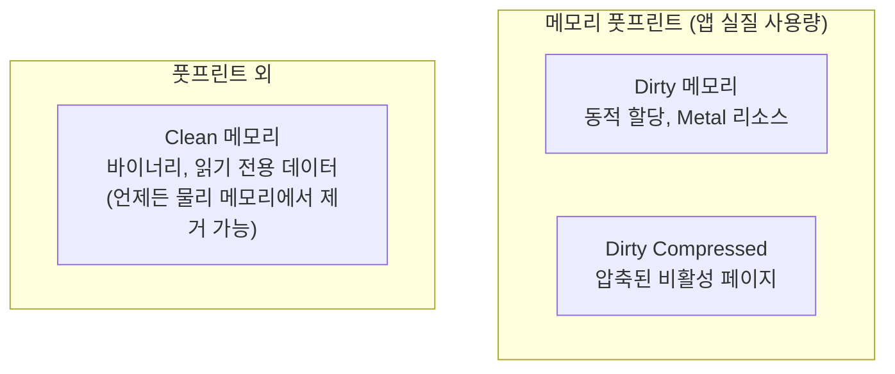
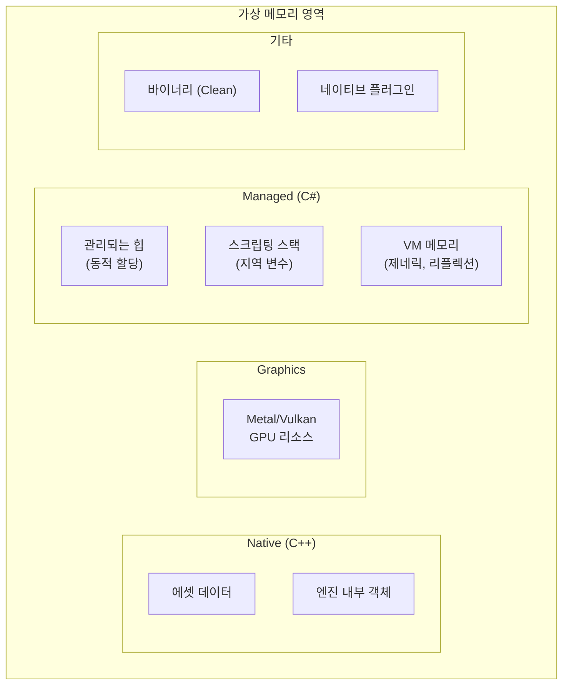
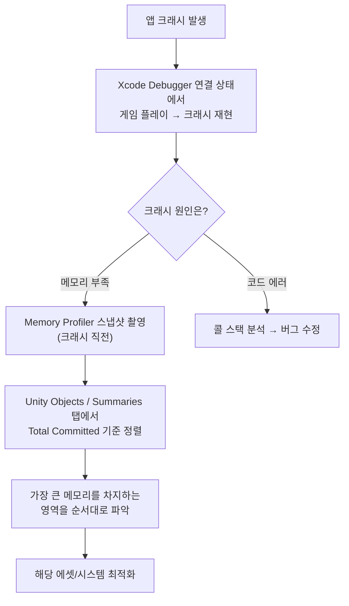

## 서론

모바일 게임 개발에서 최적화는 피할 수 없는 숙명입니다. PC나 콘솔과 달리 모바일 디바이스는 제한된 메모리, 발열 관리, 배터리 소모라는 세 가지 제약 조건을 항상 안고 있습니다. 아무리 재미있는 게임이라도 발열로 프레임이 떨어지거나, 메모리 부족으로 강제 종료되면 유저는 떠나게 됩니다.

이 문서는 유니티 모바일 프로젝트에서 실전으로 활용할 수 있는 최적화 기법들을 정리합니다. 프로파일러를 읽는 방법부터 시작하여, 그래픽스 배칭, 에셋 번들 최적화, 셰이더 베리언트 관리, 그리고 iOS 메모리 구조까지 폭넓게 다룹니다.

> 이 문서의 내용은 유니티 공식 세션 및 실무 프로파일링 경험을 기반으로 정리한 것입니다. 프로젝트 환경에 따라 최적의 전략은 달라질 수 있으므로, 반드시 프로파일러로 직접 측정하여 판단하시기 바랍니다.
{: .prompt-info }

---

## Part 1 : 유니티 프로파일러 마스터하기

프로파일링 없는 최적화는 지도 없이 항해하는 것과 같습니다. "느린 것 같다"는 감이 아니라, 프로파일러가 보여주는 숫자로 병목을 찾아야 합니다.

### 1. CPU 프로파일러 기본 원칙

프로파일러를 열기 전에 먼저 확인해야 할 것은 **타겟 FPS에 맞는 프레임 예산**입니다.

| 타겟 FPS | 프레임 예산 | 의미 |
|:---:|:---:|:---|
| **60 fps** | **16.67 ms** | 대부분의 처리가 16ms 내에 끝나야 한다 |
| **30 fps** | **33.33 ms** | 모든 처리가 33ms 내에 끝나야 한다 |

프로파일러 그래프에서 이 예산을 넘는 프레임이 보인다면, 그것이 곧 병목 지점입니다.

 

> **VSync를 끄고 프로파일링하세요.** VSync가 켜져 있으면 모든 차트가 16ms(60fps)로 강제 클램핑되어 실제 처리 시간을 파악할 수 없습니다. 정확한 프로파일링을 위해 반드시 VSync를 비활성화한 상태에서 측정해야 합니다.
{: .prompt-warning }

 

### 2. 유니티의 멀티스레드 아키텍처

유니티는 멀티코어 엔진입니다. 프로파일러 타임라인을 제대로 읽으려면 각 스레드의 역할을 이해해야 합니다.

식당에 비유하면 이렇습니다. **메인 스레드**는 주문을 받고 요리 순서를 정하는 **주방장**이고, **렌더 스레드**는 완성된 요리를 손님에게 전달하는 **서빙 담당**이며, **워커(잡) 스레드**는 재료 손질처럼 시간이 걸리는 작업을 병렬로 처리하는 **보조 요리사**들입니다.

| 스레드 | 역할 | 주요 처리 |
|:---|:---|:---|
| **메인 스레드** | 게임 로직의 지휘자 | Player Loop, MonoBehaviour, 드로우콜 요청 |
| **렌더 스레드** | GPU와의 통신 담당 | 그래픽스 명령어 조립 및 GPU 전송 |
| **워커 스레드** | 연산 집약 병렬 처리 | 애니메이션 본 연산, 물리 시뮬레이션, 잡 시스템 |

스레드 간에는 **인과관계**가 형성됩니다. 메인 스레드에서 잡을 예약하면 워커 스레드가 처리하고, 메인 스레드에서 드로우콜을 요청하면 렌더 스레드가 명령어를 조립합니다.

> 프로파일러의 **Show Flow Events** 설정을 활성화하면 스레드 간 실행 순서와 인과관계를 시각적으로 확인할 수 있습니다.
{: .prompt-tip }

 

### 3. 샘플링 vs 딥 프로파일링

프로파일러에서 보이는 **샘플 스택**과 **콜 스택**은 다릅니다. 샘플 스택은 유니티가 마크해둔 C# 메서드와 코드 블록만 청크 단위로 보여줍니다. 그래서 큰 덩어리로 묶여서 표시됩니다.

그렇다면 딥 프로파일링을 켜면 모든 것이 보일까요? 이론적으로는 그렇지만, **실전에서는 권장하지 않습니다.**

| 방식 | 장점 | 단점 |
|:---|:---|:---|
| **일반 샘플링** | 오버헤드 적음, 실제 성능에 가까운 측정 | 마크된 메서드만 보임 |
| **딥 프로파일링** | 모든 메서드 호출 추적 가능 | 프로파일링 자체의 과도한 오버헤드 → 부정확한 데이터 |

딥 프로파일링은 아주 제한적인 스코프 내에서, 한정된 시간 동안만 사용하는 것을 추천합니다.

**콜 스택 기록**도 특정 샘플에 대해서만 선택적으로 활성화할 수 있습니다.

| 콜 스택 대상 | 의미 |
|:---|:---|
| **GC.Alloc** | 동적 할당이 발생한 지점 추적 |
| **UnsafeUtility.Malloc** | 관리되지 않는 할당 (직접 해제 필요) |
| **JobHandle.Complete** | 메인 스레드에서 잡을 강제 동기 완료한 지점 |

 

### 4. 그래픽스 마커 읽기

프로파일러 타임라인에서 자주 마주치는 그래픽스 마커들의 의미를 알아야 병목을 정확히 진단할 수 있습니다.

| 마커 | 의미 | 원인 |
|:---|:---|:---|
| **WaitForTargetFPS** | 목표 프레임 레이트를 기다리는 시간 | VSync 활성화 시 나타남 (정상) |
| **Gfx.WaitForPresentOnGfxThread** | 렌더 스레드가 GPU를 기다리고 있어서 메인 스레드도 대기 | 렌더 스레드 병목 |
| **Gfx.PresentFrame** | GPU가 현재 프레임 렌더를 완료할 때까지 대기 | GPU 처리 지연 |
| **GPU.WaitForCommands** | 렌더 스레드는 준비 완료, 메인 스레드가 명령을 못 넘기는 상태 | 메인 스레드 병목 |

 

### 5. 병목 지점 식별 전략

유니티에서 발생하는 병목은 크게 **네 가지**로 분류됩니다. 중요한 것은 "GPU인가 CPU인가"라는 이분법이 아니라, **어떤 스레드에서 병목이 발생하는가**를 파악하는 것입니다.

| 병목 유형 | 주요 원인 | 최적화 방향 |
|:---|:---|:---|
| **① 메인 스레드** | 무거운 스크립트, GC Alloc | 알고리즘 개선, 캐싱, GC 최소화 |
| **② 워커 스레드** | 물리/애니메이션 과부하 | 물리 객체 수 감소, LOD 활용 |
| **③ 렌더 스레드** | 드로우콜/SetPass Call 과다 | 배칭 전략, 셰이더 통합 |
| **④ GPU** | 오버드로우, 무거운 셰이더 | 해상도 조절, 셰이더 경량화 |

---

## Part 2 : 그래픽스 최적화

### 6. 드로우콜의 진짜 비용

흔히 "드로우콜을 줄여라"라고 말하지만, 사실 현대 모바일 게임에서 진짜 비용이 큰 것은 **드로우콜 직전의 렌더 상태(Render State) 셋업**입니다. 서로 다른 셰이더로 전환할 때 발생하는 **SetPass Call**이 실제 CPU 비용의 주범인 경우가 많습니다.

또한 GPU 아키텍처의 특성을 이해하면 왜 작은 메시가 비효율적인지 알 수 있습니다.

> GPU는 다수의 작은 메시보다 **대량의 정점을 가진 메시 하나를 훨씬 빠르게** 그립니다. GPU의 처리 단위인 Wavefront(NVIDIA) / Warp(AMD)는 고정 크기의 스레드 그룹을 한 번에 실행합니다. 256개의 버텍스를 처리할 수 있는 단위에 128개만 넣으면 나머지 절반은 낭비됩니다.
{: .prompt-info }

즉, GPU의 계산 성능이 부족한 것이 아니라 **GPU를 효율적으로 사용하지 못해서** 성능이 떨어지는 경우가 대부분입니다.

 

### 7. 배칭 전략 비교

유니티에서 제공하는 배칭 방식은 크게 네 가지입니다. 각각의 특성을 이해하고 프로젝트에 맞는 전략을 선택해야 합니다.

 

#### SRP Batching (URP / HDRP)

드로우 명령어보다 **직전의 렌더 상태 셋업**이 더 큰 CPU 비용을 유발한다는 점에 착안한 방식입니다. 동일한 셰이더 베리언트를 사용하는 오브젝트들을 모아서 **하나의 SetPass Call** 아래에 다수의 드로우콜을 묶습니다.

- 핵심 : **프로젝트에서 사용하는 셰이더 종류를 줄이면 자연스럽게 최적화**됩니다
- SRP Batching을 켜고, 셰이더 수를 최소화하는 것이 가장 효과적인 전략

 

#### Static Batching (정적 배칭)

움직이지 않는 메시들을 **빌드 시점에 미리 합쳐서** 하나의 큰 메시로 GPU에 전달합니다.

- 장점 : 런타임 오버헤드 없음 (빌드 시점에 베이크)
- 단점 : 합쳐진 메시만큼 **메모리 사용량이 증가**

 

#### Dynamic Batching (동적 배칭)

매 프레임 작은 메시들을 CPU에서 합쳐서 GPU에 전달합니다.

- **권장하지 않습니다.** GPU 측에서는 최적화되지만, CPU에서 매 프레임 메시를 합치는 비용이 발생하여 오히려 성능이 악화될 수 있습니다.

 

#### GPU Instancing

동일한 메시를 여러 번 그릴 때, 메시 데이터를 GPU에 **한 번만 업로드**하고 인스턴스 데이터만 달리하여 반복 렌더링합니다.

- 나무, 풀, 군중 등 동일 메시가 대량으로 존재할 때 효과적
- 버텍스 수가 256 이하인 메시는 GPU Instancing의 효율이 떨어짐

 

#### 배칭 전략 정리

| 방식 | CPU 비용 | GPU 효율 | 메모리 | 추천도 |
|:---|:---:|:---:|:---:|:---:|
| **SRP Batching** | 낮음 | 높음 | 변화 없음 | ★★★ |
| **Static Batching** | 없음 | 높음 | 증가 | ★★★ |
| **GPU Instancing** | 낮음 | 높음 | 약간 증가 | ★★☆ |
| **Dynamic Batching** | 높음 | 보통 | 변화 없음 | ★☆☆ |

 

> **SetPass Call 300 미만**을 목표로 설정하세요. Frame Debugger에서 SetPass Call이 합쳐지지 않는 이유를 확인할 수 있으며, 이를 기반으로 셰이더 통합 전략을 수립하면 됩니다.
{: .prompt-tip }

 

### 8. GPU 렌더 병목 진단

GPU 렌더 병목이 의심되는 경우, **Xcode GPU Frame Capture**를 활용하면 각 렌더 단계별 시간 소모를 확인할 수 있습니다. 명령어들이 나열된 타임라인에서 비정상적으로 시간을 소모하는 드로우를 찾아, 해당 드로우가 사용하는 셰이더와 메시를 특정하여 최적화합니다.

---

## Part 3 : 에셋 최적화

### 9. Addressable & AssetBundle 최적화

Addressable 시스템을 사용할 때 가장 주의해야 할 것은 **중복 종속성(Duplicate Dependencies)** 문제입니다.

서로 다른 에셋 그룹에 속한 두 에셋이 동일한 종속 에셋(예: 셰이더, 텍스처)을 참조하고 있으면, 해당 종속 에셋이 각 번들에 **중복 포함**되어 메모리에 두 번 로드됩니다.

**해결 방법** : 중복 종속성이 되는 에셋(특히 **셰이더**)을 별도의 에셋 그룹으로 분리합니다. Addressable의 **Analyze** 기능을 돌리면 중복 종속성을 자동으로 탐지할 수 있습니다.

 

#### AssetBundle 크기의 균형

에셋 번들 크기는 너무 작아도, 너무 커도 문제입니다.

| 상황 | 문제점 |
|:---|:---|
| **번들이 너무 작음** | 번들 자체가 객체이므로 메모리 사용량 증가. WebRequest/File IO 증가 → CPU 처리 시간 및 발열 증가. LZ4 압축의 부분 로드 이점 희석 |
| **번들이 너무 큼** | 언로드가 어려움. 일부만 필요해도 번들 전체가 로드될 수 있음 |

 

#### 추가 최적화 팁

| 항목 | 설명 |
|:---|:---|
| **Asset Reference 미사용 시** | Include GUIDs in Catalog 체크 해제 → 카탈로그 크기 절감 |
| **카탈로그 포맷** | JSON 대신 **Binary** 사용 → 파싱 속도 향상, 1차적 보안 효과 |
| **Max Concurrent Web Requests** | 모바일은 동시 처리 가능한 웹리퀘스트 수에 한계가 있으므로 기본값 500보다 낮게 조정 |
| **CRC 체크** | 활성화하면 번들 무결성 검증 가능 (변조 감지) |

 

### 10. 셰이더 베리언트 최적화

셰이더 베리언트는 모바일 최적화에서 종종 간과되지만 영향이 매우 큰 영역입니다. 셰이더 하나에 여러 키워드를 사용하면, 키워드 조합마다 별도의 베리언트가 생성됩니다. 여기에 복수의 그래픽스 API(OpenGL ES, Vulkan 등)를 지원하면 베리언트 수는 **배수로 증가**합니다.

**셰이더 베리언트 하나하나가 SetPass Call을 발생시킵니다.** 즉, 베리언트 수를 줄이는 것 자체가 드로우콜 최적화와 직결됩니다.

 

#### 베리언트 최적화 체크리스트

| 항목 | 방법 |
|:---|:---|
| **불필요한 키워드 제거** | 비슷한 역할의 셰이더를 병합하고, 사용하지 않는 키워드 비활성화 |
| **Addressable 셰이더 그룹** | 셰이더를 별도 그룹으로 묶지 않으면 각 에셋 번들에 중복 베리언트가 포함됨 |
| **라이트맵 모드 정리** | 사용하지 않는 Lightmap Mode를 해제하면 관련 키워드가 명시적으로 제거됨 |
| **그래픽스 API 정리** | 사용하지 않는 그래픽스 API를 비활성화 → API당 별도 베리언트 생성 방지 |
| **URP Strip 설정** | URP 설정의 Shader Stripping 옵션 활성화 |
| **코드 스트립** | Managed Stripping Level 조정으로 사용되지 않는 코드 및 관련 키워드 제거 |

 

#### Project Auditor 활용

**Project Auditor**는 유니티의 정적 분석 도구로, 에셋과 프로젝트 설정, 스크립트를 분석합니다. 특히 셰이더 베리언트를 줄이는 데 매우 유용합니다.

소거법으로 정리하는 방법은 다음과 같습니다.

1. 직전 빌드 캐시를 삭제
2. Project Settings > Graphics > **Log Shader Compilation** 체크
3. Development Build 활성화 후 빌드
4. Project Auditor에서 컴파일된 베리언트 목록 확인
5. 불필요한 베리언트를 식별하고 키워드를 정리

 

> 빌드에 포함되지 않는 머티리얼에 주의하세요. `shader_feature`로 선언된 키워드는 머티리얼이 사용하지 않으면 스트립됩니다. 그러나 Addressable 번들에 포함된 머티리얼은 빌드 시점에 참조 여부 판단이 달라질 수 있으므로, `IPreprocessShaders`를 활용한 커스텀 스트립 스크립트 작성도 고려해볼 수 있습니다.
{: .prompt-warning }

---

## Part 4 : 메모리 구조 이해

### 11. iOS 메모리 구조

모바일 메모리 최적화를 제대로 하려면, OS 레벨에서 메모리가 어떻게 관리되는지 이해해야 합니다. iOS를 기준으로 설명하지만, 핵심 개념은 Android에도 유사하게 적용됩니다.

#### 물리 메모리 vs 가상 메모리

앱은 **물리 메모리(RAM)**를 직접 사용하지 않습니다. 모든 메모리 할당은 **가상 메모리(VM)** 위에서 이루어지고, VM의 페이지(4KB 또는 16KB 단위)들이 물리 메모리에 매핑됩니다.

이것이 왜 중요한지 예시로 살펴보면, 1.78GB를 할당(VM)했지만 실제 물리 메모리 사용량은 380MB 정도인 경우가 흔합니다. VM 사용량이 크다고 곧바로 문제가 되는 것이 아닙니다. **진짜 중요한 것은 물리 메모리를 얼마나 사용하고 있느냐**입니다.

 

#### Dirty vs Clean 메모리

iOS는 메모리 페이지를 세 가지로 분류합니다. 이 분류가 최적화의 핵심입니다.

| 분류 | 내용 | 예시 | 물리 메모리 상주 |
|:---|:---|:---|:---:|
| **Dirty** | 동적 할당된 데이터, 수정된 프레임워크, Metal API 리소스 | Heap 객체, 텍스처 | 높음 |
| **Dirty Compressed** | 거의 접근하지 않는 Dirty 페이지를 OS가 압축 | 오래된 캐시 | 보통 |
| **Clean** | 매핑된 파일, 읽기 전용 프레임워크, 앱 바이너리(정적 코드) | .dylib, 실행 코드 | 낮음 |

**메모리 풋프린트 = Dirty + Dirty Compressed** 입니다. 이것이 앱이 실질적으로 차지하는 크기이며, 이 값이 iOS의 허용 한도를 넘으면 앱이 강제 종료(OOM Kill)됩니다.

> **Dirty 메모리가 최적화의 최우선 대상입니다.** Dirty 메모리는 반드시 물리 메모리에 존재해야 하는 "최소 보증 금액"과 같습니다. 동적 할당(GC Alloc 포함)을 줄이는 것이 곧 Dirty 메모리를 줄이는 것입니다.
{: .prompt-warning }

 

### 12. 유니티 메모리 구조

유니티는 **.NET 가상 머신을 사용하는 C++ 엔진**입니다. 코어는 C++로 작성되어 있고, 우리가 작성하는 스크립트는 C#으로 제어합니다. 따라서 어떤 에셋을 로드하면 **C++ 네이티브 메모리와 C# 매니지드 메모리 양쪽에** 할당이 발생합니다.

| 영역 | Dirty/Clean | 설명 |
|:---|:---:|:---|
| **Native (C++)** | Dirty | 에셋 데이터, 엔진 내부 객체 |
| **Graphics** | Dirty | Metal/Vulkan에 의한 GPU 할당 메모리 |
| **Managed (C#)** | Dirty | 힙 객체, 스택, VM 메모리 |
| **Executable/Mapped** | Clean | 바이너리, DLL (언제든 해제 가능) |
| **Native Plugin** | 혼합 | 플러그인 바이너리는 Clean, 런타임 할당은 Dirty |

 

#### Managed Memory 심화

C#의 GC(Garbage Collection) 동작 방식을 이해하면 메모리 파편화 문제를 예방할 수 있습니다.

유니티의 GC 할당기는 다음과 같이 동작합니다.

1. **메모리 풀(리전)을 확보**한 뒤, 비슷한 크기의 객체끼리 모아서 블록 형성
2. 새 객체는 기존 블록 내부에 할당
3. 기존 블록에 들어갈 수 없으면 → **커스텀 블록 생성 및 할당**
4. 그래도 공간이 없으면 → **GC 트리거** → 여전히 없으면 **힙 확장**

 

> **Incremental GC 설정을 권장합니다.** 일반 GC는 Collection 이후에도 공간이 없으면 힙을 확장하지만, Incremental GC는 GC Collection과 동시에 힙을 확장하여 프레임 스파이크를 완화합니다.
{: .prompt-tip }

**Empty Heap Size가 크다면** 메모리 파편화가 심하다는 신호입니다. 이는 동적 할당 과정에서 CPU 오버헤드가 발생하고, 불필요하게 점유한 메모리가 크다는 것을 의미합니다.

 

#### VM 메모리 주의사항

VM 메모리(제네릭, 타입 메타데이터, 리플렉션)는 **런타임 동안 계속 커지는 경향**이 있습니다.

이를 줄이는 방법은 다음과 같습니다.

| 방법 | 설명 |
|:---|:---|
| **리플렉션 최소화** | 리플렉션은 타입 메타데이터를 런타임에 생성 |
| **코드 스트립** | 엔진 코드 스트립 + 매니지드 코드 스트립 레벨 조정 |
| **제네릭 쉐어링** | Unity 2022부터 적용됨. 제네릭 인스턴스화 시 코드 공유 |

> 코드 스트립 활성화 시 리플렉션을 사용하는 코드가 있으면 런타임에서 크래시가 발생할 수 있습니다. 이 경우 `link.xml`에서 해당 타입을 명시적으로 보존하도록 설정하세요.
{: .prompt-warning }

---

## Part 5 : 프로파일링 도구 활용

### 13. Unity Memory Profiler 1.1

Unity Memory Profiler는 스냅샷 기반의 메모리 분석 도구입니다. 주요 탭과 활용법을 정리합니다.

#### Allocated Memory Distribution

| 카테고리 | 설명 |
|:---|:---|
| **Native** | C++ 네이티브 코드에 의한 할당 |
| **Graphics** | Metal/Vulkan에 의한 GPU 할당 |
| **Managed** | C# 매니지드 힙 |
| **Executable & Mapped** | Clean 메모리 (바이너리, DLL) |
| **Untracked** | 유니티가 카테고리화하지 못한 할당 (플러그인 등) |

> Untracked가 크다고 반드시 문제는 아닙니다. 예를 들어 `MALLOC_NANO`의 Allocated Size가 500MB여도 Resident Size가 3.3MB인 경우가 있습니다. 미리 확보한 힙 공간과 실제 사용량은 다릅니다.
{: .prompt-info }

#### Unity Objects 탭

각 오브젝트별로 **Native Size, Managed Size, Graphics Size** 세 가지 메모리 할당률을 보여줍니다. 어떤 에셋이 메모리를 가장 많이 차지하는지 한눈에 파악할 수 있습니다.

#### Memory Map (숨겨진 기능)

구체적인 객체 이름은 보이지 않지만, 어떤 프레임워크나 바이너리가 메모리를 점유하고 있는지 거시적으로 파악할 수 있습니다.

> Memory Profiler는 **스냅샷** 도구이므로 "언제, 왜 이런 할당이 발생했는가"를 추적하기 어렵습니다. 콜 스택 추적이 필요하다면 Xcode Instruments와 같은 네이티브 프로파일러를 병행해야 합니다.
{: .prompt-info }

 

### 14. Xcode Instruments

iOS에서 메모리를 심층적으로 분석할 때는 Xcode Instruments가 필수입니다.

**사전 준비** : Xcode Build Settings에서 **디버그 심볼을 반드시 포함**해야 합니다.

#### 주요 확인 항목

| 항목 | 설명 |
|:---|:---|
| **Resident** | 물리 메모리에 실제로 상주하는 크기 |
| **Dirty Size** | 가상 메모리 할당 중 Dirty 페이지의 크기 |
| **Swapped** | 스왑된 메모리 |

#### 카테고리 구분

| Instruments 카테고리 | 유니티 대응 |
|:---|:---|
| **"GPU"** | 유니티 GPU 처리 (Graphics 메모리) |
| **App Allocations** | 유니티 CPU 처리 (Native + Managed) |
| **IOSurface** | 상주 메모리 비율 100% → 물리 메모리에 반드시 존재 |
| **Binaries / Code** | Clean 메모리 |

> **IOSurface의 상주 메모리 비율이 100%**라는 것은 물리 메모리에 100% 할당되어 있다는 의미입니다. 이 영역이 물리 메모리 한도를 넘어서면 앱이 강제 종료됩니다.
{: .prompt-warning }

**Memory Graph** 기능은 네이티브 메모리 스냅샷 도구로, 객체 간의 참조 관계를 시각적으로 추적할 수 있습니다.

---

## Part 6 : 실전 트러블슈팅

### 15. 메모리 크래시 디버깅 플로우

앱이 크래시될 때 가장 먼저 해야 할 일은 **메모리 문제인지 다른 에러인지 구분**하는 것입니다.

#### 핵심 점검 순서

1. **크래시가 메모리 때문인지 확인** : Xcode Debugger를 붙인 상태에서 재현하면 메모리 크래시인지, 코드 에러인지 구분 가능
2. **메모리 문제라면** : Memory Profiler에서 Total Committed 영역 중 가장 큰 메모리를 차지하는 영역을 순서대로 정리
3. **텍스처 Read/Write 설정 확인** : Read/Write가 켜져 있으면 CPU 메모리에도 복사본이 올라감 → 반드시 필요한 경우가 아니면 비활성화

> 모바일은 **Unified Memory** 아키텍처를 사용합니다. CPU와 GPU가 동일한 물리 메모리를 공유하므로, GPU 메모리 사용이 곧 전체 메모리 예산에 영향을 줍니다. 이는 전용 VRAM을 가진 데스크톱 GPU와 다른 점입니다.
{: .prompt-info }

---

## 마무리

최적화에는 은탄환이 없습니다. 프로파일러를 통해 정확한 병목을 찾고, 데이터에 기반한 의사결정을 내리는 것이 유일하게 올바른 접근법입니다.

이 문서에서 다룬 내용을 간단히 정리하면 다음과 같습니다.

| 영역 | 핵심 전략 |
|:---|:---|
| **CPU 병목** | 프로파일러 타임라인에서 스레드별 병목 식별. GC Alloc 최소화 |
| **그래픽스** | SRP Batching 우선. 셰이더 종류 최소화. SetPass Call 300 미만 목표 |
| **에셋** | Addressable 중복 종속성 해결. 셰이더 별도 그룹화. 번들 크기 균형 |
| **셰이더** | Project Auditor로 베리언트 분석. 불필요한 키워드와 그래픽스 API 제거 |
| **메모리** | Dirty 메모리 = 최우선 최적화 대상. Incremental GC 활성화 |
| **도구** | Unity Memory Profiler + Xcode Instruments 병행 |

무엇보다 **"감"이 아닌 "측정"**이 최적화의 시작입니다. 프로파일러를 켜지 않고 최적화하는 것은 눈을 감고 운전하는 것과 같습니다. 항상 프로파일러에서 시작하고, 프로파일러로 끝내세요.