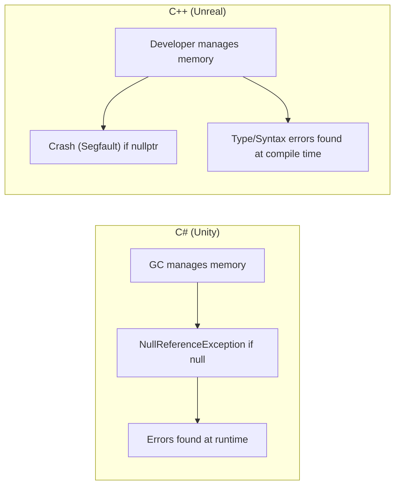
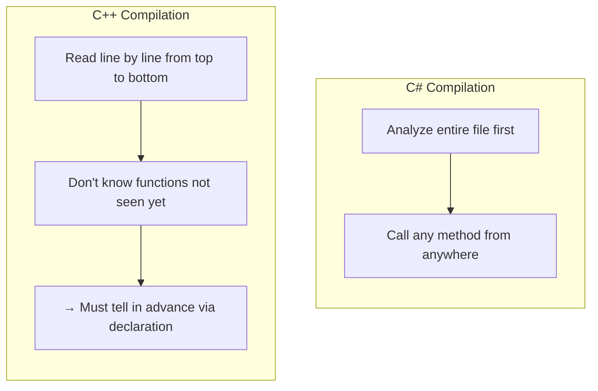

## Can You Read This Code?

When you first open an Unreal project, you encounter code like this:

```cpp
// MyCharacter.h
#pragma once
#include "CoreMinimal.h"
#include "GameFramework/Character.h"
#include "MyCharacter.generated.h"

UCLASS()
class MYGAME_API AMyCharacter : public ACharacter
{
    GENERATED_BODY()

public:
    AMyCharacter();

    UPROPERTY(EditAnywhere, BlueprintReadWrite, Category = "Stats")
    float MaxHealth = 100.0f;

    UFUNCTION(BlueprintCallable, Category = "Combat")
    void TakeDamage(float DamageAmount);

protected:
    virtual void BeginPlay() override;

private:
    float CurrentHealth;
};
```

If you are a Unity developer, looking at this code might make you think:

- `#pragma once`? `#include`? → Isn't `using` enough?
- `UCLASS()`, `UPROPERTY()`, `UFUNCTION()` → Are these like Attributes?
- `GENERATED_BODY()` → What is this?
- `class MYGAME_API` → Why is API attached to the class name?
- `float MaxHealth = 100.0f` → Ah, I know this one!
- `virtual void BeginPlay() override` → Oh, this is similar to C#!

**By the end of this series, you will be able to read every line of the code above naturally.** Today, as the first step, we will point out the most basic differences between C# and C++.

---

## Introduction - Why C++?

For Unity developers, C# is like air. Inheriting `MonoBehaviour`, overriding `Start()` and `Update()`, and getting components with `GetComponent<T>()` are patterns your fingers remember.

However, Unreal is C++.

C# and C++ have similar syntax, but their philosophies are completely different. C# follows the philosophy of "the language protects the developer from making mistakes," while C++ follows "let the developer do whatever they want, but the responsibility also lies with the developer."



| Feature | C# (Unity) | C++ (Unreal) |
|------|-----------|-------------|
| Memory Management | Automatically by GC | Manually by Developer (Assisted by Unreal GC) |
| Accessing Null | NullReferenceException | **Crash** (Segmentation Fault) |
| Default Passing | class = value copy of reference, struct = value copy | **Everything is value copy by default** |
| Compilation | JIT (Just-In-Time) | AOT (Ahead-Of-Time / Build time) |
| Header Files | None (using only) | Exists (.h + .cpp separation) |

**No need to be scared.** If you know C#, you are already familiar with 70% of C++. You just need to pinpoint the remaining 30% difference properly.

---

## 1. Variables and Types - "Almost the Same but Subtly Different"

### 1-1. Basic Type Comparison

The names of basic types in C# and C++ are almost the same. However, there is one important difference. **The size of `int` in C++ can vary by platform.** While `int` in C# is always 4 bytes (32 bits), `int` in C++ is only defined as "at least 16 bits."

Why is this a problem? Because games must run on various platforms like PC, consoles, and mobile. Therefore, **Unreal uses its own types.**

```cpp
// ❌ Standard C++ (Size can vary by platform)
int hp = 100;
unsigned int maxHp = 200;

// ✅ Unreal C++ (Size is guaranteed)
int32 HP = 100;           // Always 4 bytes
uint32 MaxHP = 200;        // Always 4 bytes (Unsigned)
int64 BigNumber = 999999;  // Always 8 bytes
float Health = 100.0f;     // 4 bytes (Same)
double PreciseValue = 3.14159265358979;  // 8 bytes (Same)
bool bIsAlive = true;      // Unreal Convention: bool has b prefix
```

> **💬 Wait, Let's Know This**
>
> **Q. Why use `int32` instead of `int`?**
>
> It's for cross-platform compatibility. Since `int` is defined as "at least 16 bits" in standard C++, it could be 2 bytes on some platforms. `int32` guarantees it is **always 32 bits (4 bytes) on any platform**.
>
> **Q. What is the `b` prefix in `bIsAlive`?**
>
> It's an Unreal coding convention. `bool` type variables get a `b` prefix. Like `bIsAlive`, `bCanJump`, `bHasWeapon`. It's convenient when searching for variables in Blueprints later.

### Full Type Comparison Table

| C# (Unity) | C++ (Standard) | C++ (Unreal) | Size |
|------------|-----------|-------------|------|
| `int` | `int` | `int32` | 4 bytes |
| `uint` | `unsigned int` | `uint32` | 4 bytes |
| `long` | `long long` | `int64` | 8 bytes |
| `float` | `float` | `float` | 4 bytes |
| `double` | `double` | `double` | 8 bytes |
| `bool` | `bool` | `bool` (b prefix) | 1 byte |
| `byte` | `unsigned char` | `uint8` | 1 byte |
| `char` | `char` / `wchar_t` | `TCHAR` | Depends on platform |
| `string` | `std::string` | `FString` | Variable |

---

### 1-2. Strings - The Biggest Difference

In C#, `string` is so simple. Just `string name = "Player";` and you're done.

In C++, strings are a bit complicated. And **in Unreal, they are even more complicated** (there are 3 types).

```cpp
// C# (Unity)
// string name = "Player";        ← That's all

// C++ (Standard)
#include <string>
std::string name = "Player";      // Uses std::string

// C++ (Unreal) - 3 types of strings
FString Name = TEXT("Player");     // General string (Most used)
FName WeaponID = FName("Sword");   // Hash-based, fast comparison (For asset names)
FText DisplayName = NSLOCTEXT("Game", "PlayerName", "Player");  // For localization (NSLOCTEXT/LOCTEXT recommended)
```

> **💬 Wait, Let's Know This**
>
> **Q. Why wrap with `TEXT("Player")`?**
>
> In C++, `"Player"` is basically a `const char[]` type, which usually decays to `const char*`. However, Unreal uses `TCHAR` abstraction to use character encoding suitable for the platform (mostly `wchar_t`). The `TEXT()` macro makes a string literal into a `TCHAR` type. **Get into the habit of always wrapping string literals with `TEXT()` in Unreal.**
>
> **Q. What is the difference between `FString`, `FName`, and `FText`?**
>
> Simply put:
> - `FString` = General string (Most similar to C# `string`). General purpose like manipulation, output.
> - `FName` = Name tag. Stored internally as hash values, so comparison is very fast. Used for asset paths, socket names, etc.
> - `FText` = Text to show to users. Supports localization (translation). In actual translation pipelines, `NSLOCTEXT()`/`LOCTEXT()` macros are used, and `FText::FromString()` is used for dynamic string conversion.
>
> We will cover this in detail in Lecture 10, but for now, **just remember `FString`.**

---

### 1-3. Variable Declaration and Initialization

Variable declarations in C# and C++ are almost the same. However, initialization methods vary a bit more.

```cpp
// C# Style (Works in C++ too)
int hp = 100;
float speed = 5.0f;
bool bIsAlive = true;

// C++ Uniform Initialization (Braces) - Since C++11
int hp{100};
float speed{5.0f};
bool bIsAlive{true};

// Advantage of brace initialization: Prevents narrowing conversion
int value1 = 3.14;   // ⚠️ Warning only, compiles (value1 = 3)
int value2{3.14};     // ❌ Compile Error! (Prevents narrowing conversion)
```

Brace initialization `{}` prevents data from being truncated by mistake. Don't be confused if you see it often in Unreal code.

---

### 1-4. auto Keyword - C#'s var

If you know C#'s `var`, C++'s `auto` is familiar.

```csharp
// C#
var hp = 100;           // Inferred as int
var name = "Player";    // Inferred as string
var enemies = new List<Enemy>();  // Inferred as List<Enemy>
```

```cpp
// C++
auto hp = 100;           // Inferred as int
auto name = "Player";    // ⚠️ Inferred as const char* (Not string!)
auto enemies = TArray<AEnemy*>();  // Inferred as TArray<AEnemy*>
```

**Caution**: In C#, `var name = "Player"` becomes `string`, but in C++, `auto name = "Player"` becomes `const char*` (C-style string pointer). In Unreal, you must explicitly use `FString` for strings.

```cpp
// Good usage of auto in Unreal
auto* MyActor = GetOwner();                        // Inferred as AActor*
const auto& Enemies = GetAllEnemies();             // Inferred as const TArray<AEnemy*>&

// auto in range-based for loops (Most common pattern!)
for (const auto& Enemy : EnemyList)
{
    Enemy->TakeDamage(10.0f);
}
```

> **💬 Wait, Let's Know This**
>
> **Q. Why use `const auto&`?**
>
> `auto` infers the type but does not automatically attach reference or const. If you write `auto x = Big_Object;`, it is inferred as a value type and copying occurs. To maintain a reference, you must specify `auto&` or `const auto&`. `const auto&` refers to **the original only**, so there is no copy cost, and because it has `const`, you cannot accidentally modify it. We will cover this in the next lecture, but for now, just remember **"In for loops, `const auto&` is default."**

---

### 1-5. const - Used Much More Than C#'s readonly

In C#, `const` and `readonly` are used occasionally, but in C++, `const` appears **everywhere.** If you don't understand `const` when reading Unreal code, you can't read half of it.

```cpp
// 1. Make variable constant (Same as C# const)
const int32 MaxLevel = 99;
// MaxLevel = 100;  // ❌ Compile Error

// 2. const in Function Parameters (Most common pattern!)
void PrintName(const FString& Name)    // Promise not to modify Name
{
    UE_LOG(LogTemp, Log, TEXT("Name: %s"), *Name);
    // Name = TEXT("Other");  // ❌ Compile Error
}

// 3. const in Member Functions (This function does not modify member variables)
float GetHealth() const
{
    return CurrentHealth;
    // CurrentHealth = 0;  // ❌ Compile Error
}
```

Comparing with C#:

| C# | C++ | Meaning |
|----|-----|------|
| `const int MAX = 100;` | `const int32 MAX = 100;` | Compile-time constant |
| `readonly float speed;` | `const float Speed;` (+ initializer list) | Runtime constant |
| None for params | `const FString& Name` | **Read-only reference** |
| None for methods | `float GetHealth() const` | **This function doesn't change state** |

`const FString&` in parameters and `const` after member functions are concepts not present in C#. We will cover this deeply in Lecture 4, but for now, just recognizing "This is const" is enough.

---

## 2. Output - From Debug.Log to UE_LOG

The start of debugging in Unity is `Debug.Log()`.

```csharp
// C# (Unity)
Debug.Log("Hello World");
Debug.Log($"HP: {currentHP}");
Debug.LogWarning("Low HP!");
Debug.LogError("Player is dead!");
```

In standard C++, `std::cout` is used, but **never use `std::cout` in Unreal.** Use `UE_LOG` instead.

```cpp
// C++ (Standard) - Not used in Unreal
std::cout << "Hello World" << std::endl;
std::cout << "HP: " << currentHP << std::endl;

// C++ (Unreal) - Use UE_LOG
UE_LOG(LogTemp, Display, TEXT("Hello World"));
UE_LOG(LogTemp, Display, TEXT("HP: %f"), CurrentHP);
UE_LOG(LogTemp, Warning, TEXT("Low HP!"));
UE_LOG(LogTemp, Error, TEXT("Player is dead!"));
```

The format of `UE_LOG` looks a bit complex, but the structure is simple:

```
UE_LOG(Category, Severity, TEXT("Format String"), Arguments...);
```

| Element | Description | Example |
|------|------|------|
| Category | Log Classification | `LogTemp`, `LogPlayerController` |
| Severity | Log Level | `Display`, `Warning`, `Error`, `Fatal` |
| Format String | C-style printf format | `TEXT("HP: %f, Name: %s")` |

**Format specifiers** use C-style `printf`, not C#'s `$"{}"`:

| Type | Format Specifier | Example |
|------|------------|------|
| `int32` | `%d` | `TEXT("Level: %d"), Level` |
| `float` | `%f` | `TEXT("HP: %f"), Health` |
| `FString` | `%s` | `TEXT("Name: %s"), *Name` |
| `bool` | `%s` | `TEXT("Alive: %s"), bIsAlive ? TEXT("true") : TEXT("false")` |

> **💬 Wait, Let's Know This**
>
> **Q. Why attach `*` as `*Name` when printing `FString`?**
>
> `%s` expects a C-style string pointer (`TCHAR*`). Since `FString` is an object, you use the `*` operator to extract the internal C-style string pointer. This is not pointer dereferencing but `FString`'s `operator*()` overloading. Just remember **"Attach `*` when putting FString into UE_LOG."**

---

## 3. Functions - Declaration and Definition are Separated

### 3-1. The Biggest Difference: Prototypes

In C#, functions (methods) are written directly inside the class. Declaration and implementation are one body.

```csharp
// C# - Declaration and implementation are one
public class PlayerCharacter : MonoBehaviour
{
    public float CalculateDamage(float baseDamage, float multiplier)
    {
        return baseDamage * multiplier;
    }
}
```

In C++, **declaration** and **definition** are separated. Usually, declarations are in `.h` files and definitions in `.cpp` files. (This is covered deeply in Lecture 2)

```cpp
// Declaration (Prototype) - "There will be a function like this"
float CalculateDamage(float BaseDamage, float Multiplier);

// Definition (Implementation) - "This function works like this"
float CalculateDamage(float BaseDamage, float Multiplier)
{
    return BaseDamage * Multiplier;
}
```

**Why separate?** C++ compiles by reading files from top to bottom once. If function A calls function B, but B is defined below A, it errors saying "I don't know what B is." The declaration (prototype) serves to tell the compiler in advance "There is such a function below, so don't error."



---

### 3-2. Function Overloading

Function overloading is completely the same as C#. Same name, different parameters.

```cpp
// C++ - Same overloading as C#
int32 Add(int32 A, int32 B)           { return A + B; }
int32 Add(int32 A, int32 B, int32 C)  { return A + B + C; }
float Add(float A, float B)           { return A + B; }
```

---

### 3-3. Default Parameters

This is also almost the same as C#.

```cpp
// C#
// public int Attack(int baseDamage, int bonus = 0) { ... }

// C++
int32 Attack(int32 BaseDamage, int32 Bonus = 0)
{
    return BaseDamage + Bonus;
}

// Call
Attack(50);      // Bonus = 0
Attack(50, 25);  // Bonus = 25
```

---

### 3-4. Pass by Value vs Pass by Reference vs Pass by Pointer

This is the part most different from C#. In C#, `class` is a reference type, but parameter passing itself is **pass-by-value of the reference**. That is, the object is not copied, but the reference (address) is copied. You must attach `ref`/`out`/`in` to pass the caller variable itself by reference. **In C++, everything is pass-by-value by default**, and the object itself is copied entirely.

```cpp
// 1. Pass by Value (Default) - Copy is passed
void TakeDamage(float Damage)
{
    Damage = 0;  // No effect on original
}

// 2. Pass by Reference - Pass original directly (Similar to C# ref)
void Heal(float& OutHealth, float Amount)
{
    OutHealth += Amount;  // Original is changed
}

// 3. Pass by const Reference - Read-only (Most used!)
void PrintName(const FString& Name)
{
    // Can only read Name, cannot modify
    UE_LOG(LogTemp, Display, TEXT("%s"), *Name);
}

// 4. Pass by Pointer - Pass address
void KillEnemy(AEnemy* Enemy)
{
    if (Enemy)  // nullptr check essential!
    {
        Enemy->Destroy();
    }
}
```

Comparing with C#:

| C# | C++ | Description |
|----|-----|------|
| Just pass (class) | Pointer `AActor* Actor` | Pass reference (address) |
| Just pass (struct) | Just pass `float Damage` | Pass copy |
| `ref float hp` | `float& HP` | Can modify original |
| `out float result` | `float& OutResult` | Output parameter (Unreal Convention: Out prefix) |
| None | `const FString& Name` | **Read-only reference** |

> **💬 Wait, Let's Know This**
>
> **Q. What is the most common function parameter pattern in Unreal?**
>
> It's **const reference** like `const FString& Name`. In C#, writing `string name` is fine, but in C++, writing `FString Name` copies the entire string. `const FString&` passes the original as read-only without copying, so it's performant and safe.
>
> **Q. What is the `Out` prefix?**
>
> It's an Unreal coding convention. Reference parameters that the function fills and returns get an `Out` prefix. It acts like C#'s `out` keyword, but in C++, it's expressed **only by naming rule**, not a keyword.
>
> ```cpp
> // Unreal Style
> bool GetHitResult(FHitResult& OutHitResult);  // Out prefix = Output parameter
> ```

---

## 4. Naming Conventions - Unreal's Naming Rules

When reading Unreal code, you see alphabets attached before class names. These are **prefixes with meaning**.

```cpp
UObject* MyObject;       // U - UObject derived class
AActor* MyActor;         // A - AActor derived class
UActorComponent* Comp;   // U - Component is also UObject derived
FString Name;            // F - Struct / Value type
FVector Location;        // F - Struct
FHitResult HitResult;    // F - Struct
ECollisionChannel Ch;    // E - Enumeration (Enum)
IInteractable* Target;   // I - Interface
TArray<int32> Numbers;   // T - Template Container
bool bIsAlive;           // b - bool variable
```

| Prefix | Meaning | C# Counterpart | Example |
|--------|------|---------|------|
| **U** | UObject derived (Managed by GC) | MonoBehaviour inheriting class | `UMyComponent` |
| **A** | AActor derived | GameObject | `AMyCharacter` |
| **F** | Struct / General class | struct | `FVector`, `FString` |
| **E** | Enum | enum | `EMovementMode` |
| **I** | Interface | interface | `IInteractable` |
| **T** | Template Container | `List<T>`, `Dictionary<K,V>` | `TArray<T>`, `TMap<K,V>` |
| **b** | bool variable | - | `bIsAlive` |

This is **knowledge that helps first when reading Unreal code**. Just looking at the prefix, you can immediately grasp "Ah, this is Actor family", "This is a struct".

---

## 5. Operators - Almost the Same

Good news. Operators are almost the same in C# and C++.

```cpp
// Arithmetic: +, -, *, /, %              ← Same
// Comparison: ==, !=, <, >, <=, >=       ← Same
// Logical: &&, ||, !                   ← Same
// Increment/Decrement: ++, --                      ← Same
// Compound Assignment: +=, -=, *=, /=        ← Same
// Ternary: condition ? a : b           ← Same
```

**Only one difference**: Instead of C#'s `is` keyword, C++ uses `dynamic_cast` or Unreal's `Cast<T>()`. This is covered in detail in Lecture 6.

```csharp
// C#
if (actor is Enemy enemy)
{
    enemy.TakeDamage(10);
}
```

```cpp
// C++ (Unreal)
if (AEnemy* Enemy = Cast<AEnemy>(Actor))
{
    Enemy->TakeDamage(10.0f);
}
```

---

## Summary - Lecture 1 Checklist

After this lecture, you should be able to read the following in Unreal code:

- [ ] Know what Unreal types like `int32`, `float`, `bool`, `FString` are
- [ ] Know why `TEXT("String")` is needed
- [ ] Know the meaning of `const FString&` parameter
- [ ] Know the difference between `auto` and `const auto&`
- [ ] Be able to read the structure of `UE_LOG`
- [ ] Know the meaning of class prefixes `A`, `U`, `F`, `E`, `T`, `I`, `b`
- [ ] Know why function declaration (prototype) and definition are separated
- [ ] Know that pass-by-value is default in C++

---

## Next Lecture Preview

**Lecture 2: Header and Source - Understanding .h/.cpp Separation and Compilation**

In Unity, putting everything in `PlayerController.cs` is fine. But in Unreal, it splits into two files: `PlayerController.h` and `PlayerController.cpp`. What is `#include`, what is `#pragma once`, and what is `forward declaration`. We enter the world of "Header Files" that doesn't exist in C#.
