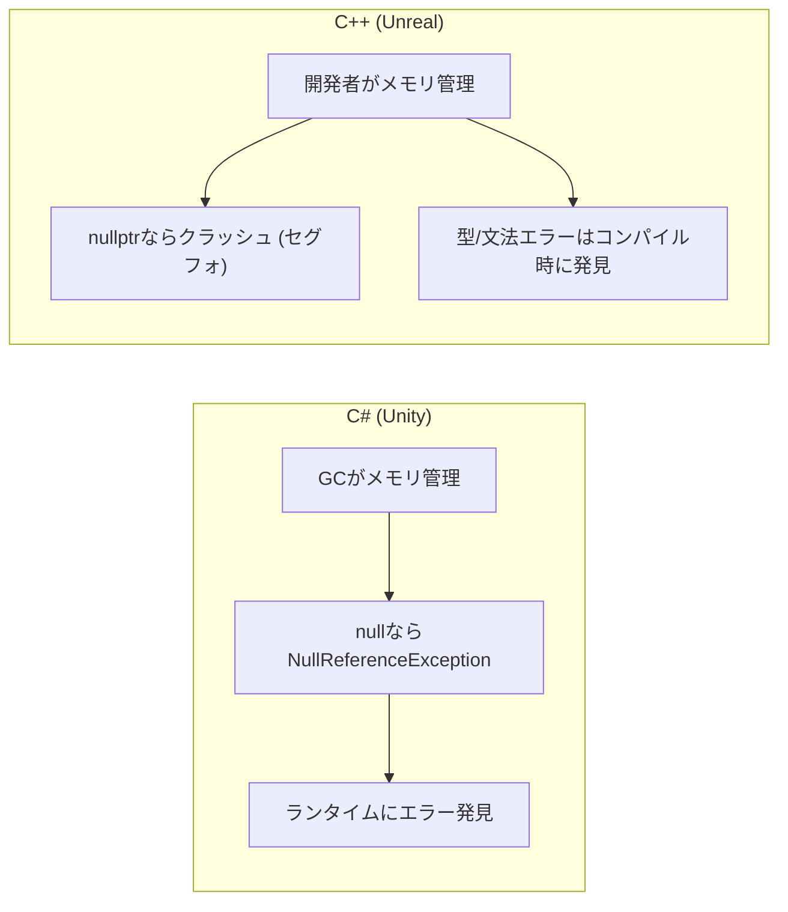
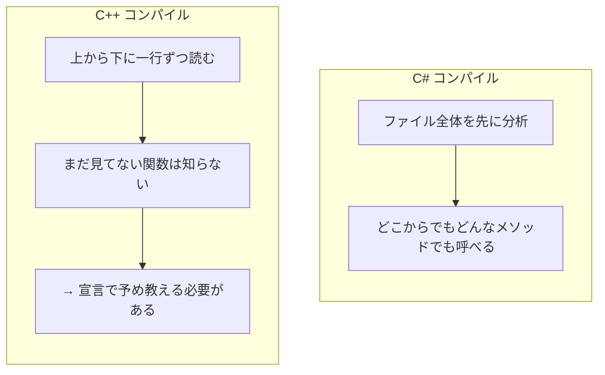

## このコード、読めますか？

Unrealプロジェクトを初めて開くと、このようなコードに出会います。

```cpp
// MyCharacter.h
#pragma once
#include "CoreMinimal.h"
#include "GameFramework/Character.h"
#include "MyCharacter.generated.h"

UCLASS()
class MYGAME_API AMyCharacter : public ACharacter
{
    GENERATED_BODY()

public:
    AMyCharacter();

    UPROPERTY(EditAnywhere, BlueprintReadWrite, Category = "Stats")
    float MaxHealth = 100.0f;

    UFUNCTION(BlueprintCallable, Category = "Combat")
    void TakeDamage(float DamageAmount);

protected:
    virtual void BeginPlay() override;

private:
    float CurrentHealth;
};
```

Unity開発者なら、このコードを見てこう思うでしょう。

- `#pragma once`? `#include`? → `using` 一つでいいのでは？
- `UCLASS()`, `UPROPERTY()`, `UFUNCTION()` → Attributeのようなものか？
- `GENERATED_BODY()` → これはまた何だ？
- `class MYGAME_API` → なぜAPIがクラス名についている？
- `float MaxHealth = 100.0f` → あ、これはわかる！
- `virtual void BeginPlay() override` → お、これはC#と似ているな？

**このシリーズが終わる頃には、上のコードのすべての行を自然に読めるようになります。** 今日はその第一歩として、C#とC++の最も基本的な違いから見ていきましょう。

---

## 序論 - なぜC++なのか

Unity開発者にとってC#は空気のような存在です。`MonoBehaviour`を継承し、`Start()`と`Update()`をオーバーライドし、`GetComponent<T>()`でコンポーネントを取得するパターンは指が覚えています。

しかし、UnrealはC++です。

C#とC++は文法が似ていますが、哲学が完全に異なります。C#は「開発者がミスをしないように言語が保護してくれる」哲学であり、C++は「開発者がやりたいことをすべてできるようにするが、責任も開発者にある」という哲学です。



| 特性 | C# (Unity) | C++ (Unreal) |
|------|-----------|-------------|
| メモリ管理 | GCが自動的に | 開発者が直接 (Unreal GC補助) |
| nullアクセス | NullReferenceException | **クラッシュ** (セグメンテーション違反) |
| 基本伝達方式 | class = 参照の値コピー, struct = 値コピー | **すべてのものが値渡しが基本** |
| コンパイル | JIT (実行時) | AOT (ビルド時) |
| ヘッダーファイル | なし (usingのみ) | あり (.h + .cpp 分離) |

**怖がる必要はありません。** C#を知っているなら、C++の70%はすでに馴染みがあります。残りの30%の違いだけしっかり押さえればよいのです。

---

## 1. 変数と型 - 「ほぼ同じだが微妙に違うもの」

### 1-1. 基本型の比較

C#とC++の基本型は名前がほぼ同じです。しかし、重要な違いが一つあります。**C++の `int` はプラットフォームごとにサイズが異なる可能性があります。** C#の `int` は常に4バイト（32ビット）ですが、C++の `int` は「最低16ビット」としか定義されていません。

これがなぜ問題かというと、ゲームはPC、コンソール、モバイルなど多様なプラットフォームで動作する必要があるからです。そのため、**Unrealは独自の型を使用します。**

```cpp
// ❌ 標準C++ (プラットフォームごとにサイズが異なる可能性がある)
int hp = 100;
unsigned int maxHp = 200;

// ✅ Unreal C++ (サイズが保証される)
int32 HP = 100;           // 常に4バイト
uint32 MaxHP = 200;        // 常に4バイト (符号なし)
int64 BigNumber = 999999;  // 常に8バイト
float Health = 100.0f;     // 4バイト (これは同じ)
double PreciseValue = 3.14159265358979;  // 8バイト (これも同じ)
bool bIsAlive = true;      // Unreal規則: boolはb接頭辞
```

> **💬 ちょっと一言、これだけは知っておこう**
>
> **Q. なぜ `int` の代わりに `int32` を使うのですか？**
>
> クロスプラットフォーム互換性のためです。`int` はC++標準で「最低16ビット」としか定義されていないため、あるプラットフォームでは2バイトかもしれません。`int32` は**どのプラットフォームでも常に32ビット（4バイト）**であることを保証します。
>
> **Q. `bIsAlive` の `b` 接頭辞は何ですか？**
>
> Unrealのコーディング規則です。`bool` 型変数には `b` 接頭辞を付けます。`bIsAlive`、`bCanJump`、`bHasWeapon` といった具合です。後でブループリントで変数を探すときに便利です。

### 全型比較表

| C# (Unity) | C++ (標準) | C++ (Unreal) | サイズ |
|------------|-----------|-------------|------|
| `int` | `int` | `int32` | 4 bytes |
| `uint` | `unsigned int` | `uint32` | 4 bytes |
| `long` | `long long` | `int64` | 8 bytes |
| `float` | `float` | `float` | 4 bytes |
| `double` | `double` | `double` | 8 bytes |
| `bool` | `bool` | `bool` (b接頭辞) | 1 byte |
| `byte` | `unsigned char` | `uint8` | 1 byte |
| `char` | `char` / `wchar_t` | `TCHAR` | プラットフォーム次第 |
| `string` | `std::string` | `FString` | 可変 |

---

### 1-2. 文字列 - 最も大きな違い

C#では `string` はとても単純です。ただ `string name = "Player";` とすれば終わりです。

C++では文字列が少し複雑です。そして **Unrealではさらに複雑です**（3種類もあります）。

```cpp
// C# (Unity)
// string name = "Player";        ← これが全て

// C++ (標準)
#include <string>
std::string name = "Player";      // std::string 使用

// C++ (Unreal) - 3種類の文字列
FString Name = TEXT("Player");     // 一般的な文字列 (最も使用される)
FName WeaponID = FName("Sword");   // ハッシュベース、比較が高速 (アセット名用)
FText DisplayName = NSLOCTEXT("Game", "PlayerName", "プレイヤー");  // ローカライゼーション用 (NSLOCTEXT/LOCTEXT 推奨)
```

> **💬 ちょっと一言、これだけは知っておこう**
>
> **Q. `TEXT("Player")` で `TEXT()` をなぜ被せるのですか？**
>
> C++で `"Player"` は基本的に `const char[]` 型であり、通常 `const char*` に変換（decay）されます。しかしUnrealは `TCHAR` 抽象化を通じてプラットフォームに合った文字エンコーディング（ほとんどのプラットフォームで `wchar_t`）を使用します。`TEXT()` マクロは文字列リテラルを `TCHAR` 型にしてくれます。**Unrealで文字列リテラルを使うときは常に `TEXT()` で囲む習慣**をつけてください。
>
> **Q. `FString`、`FName`、`FText` の違いは何ですか？**
>
> 簡単に言うと：
> - `FString` = 一般的な文字列（C#の `string` と最も近い）。操作、出力など汎用的。
> - `FName` = ネームタグ。内部的にハッシュ値として保存されるため比較が非常に高速。アセットパス、ソケット名などに使用。
> - `FText` = ユーザーに見せるテキスト。ローカライゼーション（翻訳）対応。実際の翻訳パイプラインでは `NSLOCTEXT()`/`LOCTEXT()` マクロを使用し、`FText::FromString()` は動的文字列変換に使用。
>
> 第10講で詳しく扱いますが、今は **`FString` だけ覚えればOKです。**

---

### 1-3. 変数宣言と初期化

C#とC++の変数宣言はほぼ同じです。ただし初期化方式がもう少し多様です。

```cpp
// C# スタイル (C++でも動作)
int hp = 100;
float speed = 5.0f;
bool bIsAlive = true;

// C++ ユニフォーム初期化 (中括弧) - C++11から
int hp{100};
float speed{5.0f};
bool bIsAlive{true};

// 中括弧初期化のメリット: 縮小変換防止
int value1 = 3.14;   // ⚠️ 警告のみ、コンパイルされる (value1 = 3)
int value2{3.14};     // ❌ コンパイルエラー！ (縮小変換防止)
```

中括弧初期化 `{}` はミスでデータが切り捨てられるのを防いでくれます。Unrealコードでもよく見かけるので驚かないでください。

---

### 1-4. auto キーワード - C#のvar

C#の `var` を知っているなら、C++の `auto` は親しみやすいです。

```csharp
// C#
var hp = 100;           // intと推論
var name = "Player";    // stringと推論
var enemies = new List<Enemy>();  // List<Enemy>と推論
```

```cpp
// C++
auto hp = 100;           // intと推論
auto name = "Player";    // ⚠️ const char*と推論 (stringではない！)
auto enemies = TArray<AEnemy*>();  // TArray<AEnemy*>と推論
```

**注意点**: C#で `var name = "Player"` は `string` になりますが、C++で `auto name = "Player"` は `const char*` （Cスタイル文字列ポインタ）になります。Unrealで文字列は明示的に `FString` を使う必要があります。

```cpp
// Unrealでautoをうまく使う例
auto* MyActor = GetOwner();                        // AActor*と推論
const auto& Enemies = GetAllEnemies();             // const TArray<AEnemy*>&と推論

// 範囲ベースfor文でのauto (最もよく使うパターン！)
for (const auto& Enemy : EnemyList)
{
    Enemy->TakeDamage(10.0f);
}
```

> **💬 ちょっと一言、これだけは知っておこう**
>
> **Q. `const auto&` はなぜ使うのですか？**
>
> `auto` は型を推論しますが、参照やconstを自動的に付けてくれません。`auto x = 大きなオブジェクト;` と書くと値型として推論されコピーが発生します。参照を維持するには `auto&` や `const auto&` を明示する必要があります。`const auto&` は **原本を参照するだけ** なのでコピーコストがなく、`const` が付いているので誤って修正することもありません。これは次回の講義で詳しく扱いますが、今は **「for文では `const auto&` が基本」** ということだけ覚えておいてください。

---

### 1-5. const - C#のreadonlyよりはるかによく使う

C#で `const` と `readonly` はたまに使う程度ですが、C++で `const` は **至る所に登場します。** Unrealコードを読むとき `const` を理解していないと半分も読めません。

```cpp
// 1. 変数を定数にする (C#のconstと同じ)
const int32 MaxLevel = 99;
// MaxLevel = 100;  // ❌ コンパイルエラー

// 2. 関数パラメータにconst (最もよく見るパターン！)
void PrintName(const FString& Name)    // Nameを修正しないという約束
{
    UE_LOG(LogTemp, Log, TEXT("Name: %s"), *Name);
    // Name = TEXT("Other");  // ❌ コンパイルエラー
}

// 3. メンバ関数にconst (この関数はメンバ変数を修正しない)
float GetHealth() const
{
    return CurrentHealth;
    // CurrentHealth = 0;  // ❌ コンパイルエラー
}
```

C#と比較すると：

| C# | C++ | 意味 |
|----|-----|------|
| `const int MAX = 100;` | `const int32 MAX = 100;` | コンパイル時定数 |
| `readonly float speed;` | `const float Speed;` (+ 初期化リスト) | ランタイム定数 |
| パラメータになし | `const FString& Name` | **読み取り専用参照** |
| メソッドになし | `float GetHealth() const` | **この関数は状態を変えない** |

パラメータの `const FString&` やメンバ関数後ろの `const` はC#にはない概念です。第4講で深く扱いますが、今は「これがconstか」程度に認識して進めばOKです。

---

## 2. 出力 - Debug.LogからUE_LOGへ

Unityでのデバッグの始まりは `Debug.Log()` です。

```csharp
// C# (Unity)
Debug.Log("Hello World");
Debug.Log($"HP: {currentHP}");
Debug.LogWarning("Low HP!");
Debug.LogError("Player is dead!");
```

C++標準では `std::cout` を使いますが、**Unrealでは絶対に `std::cout` を使いません。** 代わりに `UE_LOG` を使用します。

```cpp
// C++ (標準) - Unrealでは使わない
std::cout << "Hello World" << std::endl;
std::cout << "HP: " << currentHP << std::endl;

// C++ (Unreal) - UE_LOG使用
UE_LOG(LogTemp, Display, TEXT("Hello World"));
UE_LOG(LogTemp, Display, TEXT("HP: %f"), CurrentHP);
UE_LOG(LogTemp, Warning, TEXT("Low HP!"));
UE_LOG(LogTemp, Error, TEXT("Player is dead!"));
```

`UE_LOG` の形式は少し複雑に見えますが構造は単純です：

```
UE_LOG(カテゴリ, 深刻度, TEXT("フォーマット文字列"), 引数...);
```

| 要素 | 説明 | 例 |
|------|------|------|
| カテゴリ | ログ分類 | `LogTemp`, `LogPlayerController` |
| 深刻度 | ログレベル | `Display`, `Warning`, `Error`, `Fatal` |
| フォーマット文字列 | Cスタイルprintfフォーマット | `TEXT("HP: %f, Name: %s")` |

**フォーマット指定子** はC#の `$"{}"` ではなく、Cスタイルの `printf` を使用します：

| 型 | フォーマット指定子 | 例 |
|------|------------|------|
| `int32` | `%d` | `TEXT("Level: %d"), Level` |
| `float` | `%f` | `TEXT("HP: %f"), Health` |
| `FString` | `%s` | `TEXT("Name: %s"), *Name` |
| `bool` | `%s` | `TEXT("Alive: %s"), bIsAlive ? TEXT("true") : TEXT("false")` |

> **💬 ちょっと一言、これだけは知っておこう**
>
> **Q. `FString` を出力するときなぜ `*Name` と `*` を付けるのですか？**
>
> `%s` はCスタイル文字列ポインタ（`TCHAR*`）を期待します。`FString` はオブジェクトなので `*` 演算子を使って内部のCスタイル文字列ポインタを取り出す必要があります。これはポインタの逆参照ではなく `FString` の `operator*()` オーバーロードです。**「FStringをUE_LOGに入れるときは `*` を付ける」** とだけ覚えてください。

---

## 3. 関数 - 宣言と定義が分離される

### 3-1. 最も大きな違い：プロトタイプ

C#で関数（メソッド）はクラスの中に直接書きます。宣言と実装が一つの体です。

```csharp
// C# - 宣言と実装が一つ
public class PlayerCharacter : MonoBehaviour
{
    public float CalculateDamage(float baseDamage, float multiplier)
    {
        return baseDamage * multiplier;
    }
}
```

C++では **宣言（declaration）** と **定義（definition）** が分離されます。通常 `.h` ファイルに宣言を、 `.cpp` ファイルに定義を書きます。（これは第2講で深く扱います）

```cpp
// 宣言 (プロトタイプ) - 「こういう関数があるよ」
float CalculateDamage(float BaseDamage, float Multiplier);

// 定義 (実装) - 「この関数はこう動くよ」
float CalculateDamage(float BaseDamage, float Multiplier)
{
    return BaseDamage * Multiplier;
}
```

**なぜ分離するのか？** C++はファイルを上から下に一度だけ読みながらコンパイルします。関数Aが関数Bを呼ぶのに、BがAより下で定義されていると「Bが何かわからない」とエラーになります。宣言（プロトタイプ）はコンパイラに「下にこういう関数があるからエラーを出さないで」と予め知らせる役割です。



---

### 3-2. 関数オーバーロード

関数オーバーロードはC#と全く同じです。同じ名前、違うパラメータ。

```cpp
// C++ - C#と同じオーバーロード
int32 Add(int32 A, int32 B)           { return A + B; }
int32 Add(int32 A, int32 B, int32 C)  { return A + B + C; }
float Add(float A, float B)           { return A + B; }
```

---

### 3-3. デフォルト引数

これもC#とほぼ同じです。

```cpp
// C#
// public int Attack(int baseDamage, int bonus = 0) { ... }

// C++
int32 Attack(int32 BaseDamage, int32 Bonus = 0)
{
    return BaseDamage + Bonus;
}

// 呼び出し
Attack(50);      // Bonus = 0
Attack(50, 25);  // Bonus = 25
```

---

### 3-4. 値渡し vs 参照渡し vs ポインタ渡し

これがC#と最も違う部分です。C#では `class` は参照型ですが、パラメータ伝達自体は **参照値の値コピー（pass-by-value of the reference）** です。つまりオブジェクトがコピーされるわけではありませんが、参照（アドレス）がコピーされます。呼び出し元の変数自体を参照渡しするには `ref`/`out`/`in` を付ける必要があります。**C++ではすべてのものが値渡しが基本**であり、オブジェクト自体が丸ごとコピーされます。

```cpp
// 1. 値渡し (基本) - コピーが渡される
void TakeDamage(float Damage)
{
    Damage = 0;  // 原本に影響なし
}

// 2. 参照渡し - 原本を直接渡す (C#のrefと似ている)
void Heal(float& OutHealth, float Amount)
{
    OutHealth += Amount;  // 原本が変更される
}

// 3. const参照渡し - 読み取り専用 (最もよく使う！)
void PrintName(const FString& Name)
{
    // Nameを読むことだけ可能、修正不可
    UE_LOG(LogTemp, Display, TEXT("%s"), *Name);
}

// 4. ポインタ渡し - アドレスを渡す
void KillEnemy(AEnemy* Enemy)
{
    if (Enemy)  // nullptrチェック必須！
    {
        Enemy->Destroy();
    }
}
```

C#と比較すると：

| C# | C++ | 説明 |
|----|-----|------|
| そのまま渡す (class) | ポインタ `AActor* Actor` | 参照（アドレス）渡し |
| そのまま渡す (struct) | そのまま渡す `float Damage` | コピー渡し |
| `ref float hp` | `float& HP` | 原本修正可能 |
| `out float result` | `float& OutResult` | 出力パラメータ (Unreal規則: Out接頭辞) |
| なし | `const FString& Name` | **読み取り専用参照** |

> **💬 ちょっと一言、これだけは知っておこう**
>
> **Q. Unrealで最もよく見る関数パラメータパターンは？**
>
> `const FString& Name` のような **const参照** です。C#では `string name` と書くだけで良いですが、C++で `FString Name` と書くと文字列全体がコピーされます。`const FString&` はコピーなしで原本を読み取り専用で渡すので、性能も良く安全です。
>
> **Q. `Out` 接頭辞は何ですか？**
>
> Unrealのコーディング規則です。関数が値を埋めて返す参照パラメータに `Out` 接頭辞を付けます。C#の `out` キーワードと同じ役割ですが、C++ではキーワードではなく **名前のルールだけで** 表現します。
>
> ```cpp
> // Unrealスタイル
> bool GetHitResult(FHitResult& OutHitResult);  // Out接頭辞 = 出力パラメータ
> ```

---

## 4. 命名規則 - Unrealの名前ルール

Unrealコードを読むとき、クラス名の前にアルファベットが付いているのを見ます。これは **意味のある接頭辞** です。

```cpp
UObject* MyObject;       // U - UObject派生クラス
AActor* MyActor;         // A - AActor派生クラス
UActorComponent* Comp;   // U - コンポーネントもUObject派生
FString Name;            // F - 構造体 / 値型
FVector Location;        // F - 構造体
FHitResult HitResult;    // F - 構造体
ECollisionChannel Ch;    // E - 列挙型 (Enum)
IInteractable* Target;   // I - インターフェース
TArray<int32> Numbers;   // T - テンプレートコンテナ
bool bIsAlive;           // b - bool変数
```

| 接頭辞 | 意味 | C# 対応 | 例 |
|--------|------|---------|------|
| **U** | UObject派生 (GC管理) | MonoBehaviour継承クラス | `UMyComponent` |
| **A** | AActor派生 | GameObject | `AMyCharacter` |
| **F** | 構造体 / 一般クラス | struct | `FVector`, `FString` |
| **E** | Enum | enum | `EMovementMode` |
| **I** | Interface | interface | `IInteractable` |
| **T** | Templateコンテナ | `List<T>`, `Dictionary<K,V>` | `TArray<T>`, `TMap<K,V>` |
| **b** | bool変数 | - | `bIsAlive` |

これは **Unrealコードを読むとき真っ先に役立つ知識** です。接頭辞を見るだけで「あ、これはActor系だな」、「これは構造体だな」とすぐに把握できます。

---

## 5. 演算子 - ほぼ同じ

良いニュースです。演算子はC#とC++でほぼ同じです。

```cpp
// 算術: +, -, *, /, %              ← 同じ
// 比較: ==, !=, <, >, <=, >=       ← 同じ
// 論理: &&, ||, !                   ← 同じ
// 増減: ++, --                      ← 同じ
// 複合代入: +=, -=, *=, /=        ← 同じ
// 三項: condition ? a : b           ← 同じ
```

**違う点は一つだけ**: C#の `is` キーワードの代わりにC++は `dynamic_cast` やUnrealの `Cast<T>()` を使います。これは第6講で詳しく扱います。

```csharp
// C#
if (actor is Enemy enemy)
{
    enemy.TakeDamage(10);
}
```

```cpp
// C++ (Unreal)
if (AEnemy* Enemy = Cast<AEnemy>(Actor))
{
    Enemy->TakeDamage(10.0f);
}
```

---

## まとめ - 第1講チェックリスト

この講義を終えると、Unrealコードで以下を読めるようになっているはずです：

- [ ] `int32`、`float`、`bool`、`FString` のようなUnrealの型が何かわかる
- [ ] `TEXT("文字列")` がなぜ必要かわかる
- [ ] `const FString&` パラメータの意味がわかる
- [ ] `auto` と `const auto&` の違いがわかる
- [ ] `UE_LOG` ログの構造を読める
- [ ] クラス接頭辞 `A`、`U`、`F`、`E`、`T`、`I`、`b` の意味がわかる
- [ ] 関数宣言（プロトタイプ）と定義が分離される理由がわかる
- [ ] C++で基本伝達方式が値渡しであることを知っている

---

## 次回予告

**第2講：ヘッダーとソース - .h/.cpp分離とコンパイルの理解**

Unityでは `PlayerController.cs` 一つに全部入れればOKです。しかしUnrealでは `PlayerController.h` と `PlayerController.cpp` の2ファイルに分かれます。`#include` とは何か、`#pragma once` とは何か、`forward declaration` とはまた何か。C#にはない「ヘッダーファイル」の世界に入ります。
