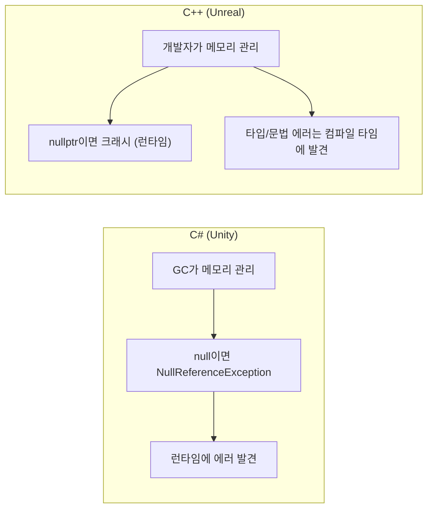
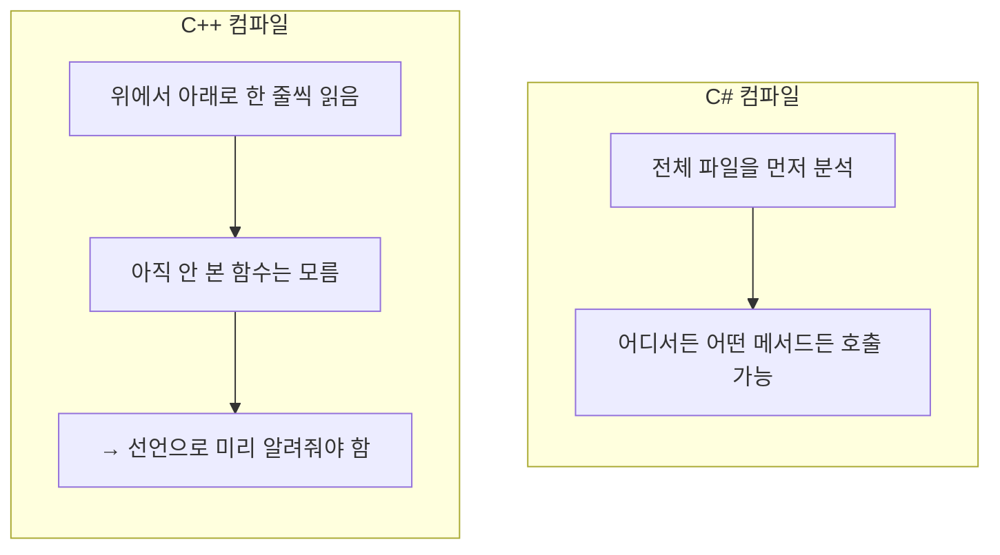

## 이 코드, 읽을 수 있나요?

언리얼 프로젝트를 처음 열면 이런 코드를 만나게 됩니다.

```cpp
// MyCharacter.h
#pragma once
#include "CoreMinimal.h"
#include "GameFramework/Character.h"
#include "MyCharacter.generated.h"

UCLASS()
class MYGAME_API AMyCharacter : public ACharacter
{
    GENERATED_BODY()

public:
    AMyCharacter();

    UPROPERTY(EditAnywhere, BlueprintReadWrite, Category = "Stats")
    float MaxHealth = 100.0f;

    UFUNCTION(BlueprintCallable, Category = "Combat")
    void TakeDamage(float DamageAmount);

protected:
    virtual void BeginPlay() override;

private:
    float CurrentHealth;
};
```

유니티 개발자라면 이 코드를 보고 이런 생각이 들 겁니다.

- `#pragma once`? `#include`? → using 하나면 되는데?
- `UCLASS()`, `UPROPERTY()`, `UFUNCTION()` → Attribute 같은 건가?
- `GENERATED_BODY()` → 이건 또 뭐야?
- `class MYGAME_API` → API가 왜 클래스 이름에 붙어 있지?
- `float MaxHealth = 100.0f` → 아 이건 알겠다!
- `virtual void BeginPlay() override` → 오 이건 C#이랑 비슷한데?

**이 시리즈가 끝나면 위 코드의 모든 줄을 자연스럽게 읽을 수 있게 됩니다.** 오늘은 그 첫 번째 단계로, C#과 C++의 가장 기본적인 차이부터 짚어보겠습니다.

---

## 서론 - 왜 C++인가

유니티 개발자에게 C#은 공기 같은 존재입니다. `MonoBehaviour`를 상속하고, `Start()`와 `Update()`를 오버라이드하고, `GetComponent<T>()`로 컴포넌트를 가져오는 패턴은 손가락이 기억합니다.

그런데 언리얼은 C++입니다.

C#과 C++은 문법이 비슷하게 생겼지만, 철학이 완전히 다릅니다. C#은 "개발자가 실수하지 않도록 언어가 보호해주는" 철학이고, C++은 "개발자가 하고 싶은 걸 다 할 수 있게 해주되, 책임도 개발자에게 있는" 철학입니다.



| 특성 | C# (Unity) | C++ (Unreal) |
|------|-----------|-------------|
| 메모리 관리 | GC가 자동으로 | 개발자가 직접 (언리얼 GC 보조) |
| null 접근 | NullReferenceException | **크래시** (세그폴트) |
| 기본 전달 방식 | class = 참조의 값 복사, struct = 값 복사 | **모든 것이 값 전달이 기본** |
| 컴파일 | JIT (실행 시점) | AOT (빌드 시점) |
| 헤더 파일 | 없음 (using만) | 있음 (.h + .cpp 분리) |

**무서워할 필요는 없습니다.** C#을 알고 있다면 C++의 70%는 이미 익숙합니다. 나머지 30%의 차이만 제대로 짚으면 됩니다.

---

## 1. 변수와 타입 - "거의 같은데 미묘하게 다른 것들"

### 1-1. 기본 타입 비교

C#과 C++의 기본 타입은 이름이 거의 같습니다. 하지만 중요한 차이가 하나 있습니다. **C++의 `int`는 플랫폼마다 크기가 다를 수 있습니다.** C#의 `int`는 항상 4바이트(32비트)지만, C++의 `int`는 "최소 16비트"라고만 정의되어 있습니다.

이게 왜 문제냐면, 게임은 PC, 콘솔, 모바일 등 다양한 플랫폼에서 돌아가야 하기 때문입니다. 그래서 **언리얼은 자체 타입을 사용합니다.**

```cpp
// ❌ 표준 C++ (플랫폼마다 크기가 다를 수 있음)
int hp = 100;
unsigned int maxHp = 200;

// ✅ 언리얼 C++ (크기가 보장됨)
int32 HP = 100;           // 항상 4바이트
uint32 MaxHP = 200;        // 항상 4바이트 (부호 없음)
int64 BigNumber = 999999;  // 항상 8바이트
float Health = 100.0f;     // 4바이트 (이건 같음)
double PreciseValue = 3.14159265358979;  // 8바이트 (이것도 같음)
bool bIsAlive = true;      // 언리얼 컨벤션: bool은 b 접두사
```

> **💬 잠깐, 이건 알고 가자**
>
> **Q. 왜 `int` 대신 `int32`를 쓰나요?**
>
> 크로스 플랫폼 호환성 때문입니다. `int`는 C++ 표준에서 "최소 16비트"라고만 정의되어 있어서, 어떤 플랫폼에서는 2바이트일 수도 있습니다. `int32`는 **어떤 플랫폼에서든 항상 32비트(4바이트)**임을 보장합니다.
>
> **Q. `bIsAlive`에서 `b` 접두사는 뭔가요?**
>
> 언리얼 코딩 컨벤션입니다. `bool` 타입 변수에는 `b` 접두사를 붙입니다. `bIsAlive`, `bCanJump`, `bHasWeapon` 같은 식이죠. 나중에 블루프린트에서 변수를 찾을 때 편리합니다.

### 전체 타입 비교 표

| C# (Unity) | C++ (표준) | C++ (언리얼) | 크기 |
|------------|-----------|-------------|------|
| `int` | `int` | `int32` | 4 bytes |
| `uint` | `unsigned int` | `uint32` | 4 bytes |
| `long` | `long long` | `int64` | 8 bytes |
| `float` | `float` | `float` | 4 bytes |
| `double` | `double` | `double` | 8 bytes |
| `bool` | `bool` | `bool` (b 접두사) | 1 byte |
| `byte` | `unsigned char` | `uint8` | 1 byte |
| `char` | `char` / `wchar_t` | `TCHAR` | 플랫폼마다 다름 |
| `string` | `std::string` | `FString` | 가변 |

---

### 1-2. 문자열 - 가장 큰 차이

C#에서 `string`은 너무나 단순합니다. 그냥 `string name = "Player";` 하면 끝이죠.

C++에서는 문자열이 좀 복잡합니다. 그리고 **언리얼에서는 더 복잡합니다** (3종류나 있습니다).

```cpp
// C# (Unity)
// string name = "Player";        ← 이게 전부

// C++ (표준)
#include <string>
std::string name = "Player";      // std::string 사용

// C++ (언리얼) - 3종류의 문자열
FString Name = TEXT("Player");     // 일반 문자열 (가장 많이 사용)
FName WeaponID = FName("Sword");   // 해시 기반, 비교 빠름 (에셋 이름용)
FText DisplayName = NSLOCTEXT("Game", "PlayerName", "플레이어");  // 로컬라이제이션용 (NSLOCTEXT/LOCTEXT 권장)
```

> **💬 잠깐, 이건 알고 가자**
>
> **Q. `TEXT("Player")`에서 `TEXT()`는 왜 감싸나요?**
>
> C++에서 `"Player"`는 기본적으로 `const char[]` 타입이며, 보통 `const char*`로 변환(decay)됩니다. 하지만 언리얼은 `TCHAR` 추상화를 통해 플랫폼에 맞는 문자 인코딩(대부분의 플랫폼에서 `wchar_t`)을 사용합니다. `TEXT()` 매크로는 문자열 리터럴을 `TCHAR` 타입으로 만들어줍니다. **언리얼에서 문자열 리터럴을 쓸 때는 항상 `TEXT()`로 감싸는 습관**을 들이세요.
>
> **Q. `FString`, `FName`, `FText` 차이가 뭔가요?**
>
> 간단히 말하면:
> - `FString` = 일반 문자열 (C#의 `string`과 가장 비슷). 조작, 출력 등 범용
> - `FName` = 이름표. 내부적으로 해시값으로 저장되어 비교가 매우 빠름. 에셋 경로, 소켓 이름 등에 사용
> - `FText` = 사용자에게 보여줄 텍스트. 로컬라이제이션(번역) 지원. 실제 번역 파이프라인에서는 `NSLOCTEXT()`/`LOCTEXT()` 매크로를 사용하고, `FText::FromString()`은 동적 문자열 변환에 사용
>
> 10강 때 자세히 다루겠지만, 지금은 **`FString`만 기억하면 됩니다.**

---

### 1-3. 변수 선언과 초기화

C#과 C++의 변수 선언은 거의 같습니다. 다만 초기화 방식이 좀 더 다양합니다.

```cpp
// C# 스타일 (C++에서도 동작)
int hp = 100;
float speed = 5.0f;
bool bIsAlive = true;

// C++ 유니폼 초기화 (중괄호) - C++11부터
int hp{100};
float speed{5.0f};
bool bIsAlive{true};

// 중괄호 초기화의 장점: 축소 변환 방지
int value1 = 3.14;   // ⚠️ 경고만, 컴파일됨 (value1 = 3)
int value2{3.14};     // ❌ 컴파일 에러! (축소 변환 방지)
```

중괄호 초기화 `{}`는 실수로 데이터가 잘리는 것을 방지해줍니다. 언리얼 코드에서도 자주 보이니 당황하지 마세요.

---

### 1-4. auto 키워드 - C#의 var

C#의 `var`를 알고 있다면 C++의 `auto`는 친숙합니다.

```csharp
// C#
var hp = 100;           // int로 추론
var name = "Player";    // string으로 추론
var enemies = new List<Enemy>();  // List<Enemy>로 추론
```

```cpp
// C++
auto hp = 100;           // int로 추론
auto name = "Player";    // ⚠️ const char*로 추론 (string이 아님!)
auto enemies = TArray<AEnemy*>();  // TArray<AEnemy*>로 추론
```

**주의할 점**: C#에서 `var name = "Player"`는 `string`이 되지만, C++에서 `auto name = "Player"`는 `const char*` (C스타일 문자열 포인터)가 됩니다. 언리얼에서 문자열은 명시적으로 `FString`을 써야 합니다.

```cpp
// 언리얼에서 auto를 잘 쓰는 예
auto* MyActor = GetOwner();                        // AActor*로 추론
const auto& Enemies = GetAllEnemies();             // const TArray<AEnemy*>&로 추론

// 범위 기반 for에서의 auto (가장 많이 쓰는 패턴!)
for (const auto& Enemy : EnemyList)
{
    Enemy->TakeDamage(10.0f);
}
```

> **💬 잠깐, 이건 알고 가자**
>
> **Q. `const auto&`는 왜 쓰나요?**
>
> `auto`는 타입을 추론하되, 참조나 const를 자동으로 붙여주지 않습니다. `auto x = 큰_객체;`라고 쓰면 값 타입으로 추론되어 복사가 일어납니다. 참조를 유지하려면 `auto&`나 `const auto&`를 명시해야 합니다. `const auto&`는 **원본을 참조만** 하므로 복사 비용이 없고, `const`가 붙어있어 실수로 수정할 수도 없습니다. 이건 다음 강에서 자세히 다루겠지만, 지금은 **"for문에서는 `const auto&`가 기본"**이라는 것만 기억하세요.

---

### 1-5. const - C#의 readonly보다 훨씬 많이 쓴다

C#에서 `const`와 `readonly`는 가끔 쓰는 정도지만, C++에서 `const`는 **모든 곳에 등장합니다.** 언리얼 코드를 읽을 때 `const`를 이해하지 못하면 절반도 읽을 수 없습니다.

```cpp
// 1. 변수를 상수로 만들기 (C#의 const와 같음)
const int32 MaxLevel = 99;
// MaxLevel = 100;  // ❌ 컴파일 에러

// 2. 함수 파라미터에 const (가장 많이 보는 패턴!)
void PrintName(const FString& Name)    // Name을 수정하지 않겠다는 약속
{
    UE_LOG(LogTemp, Log, TEXT("Name: %s"), *Name);
    // Name = TEXT("Other");  // ❌ 컴파일 에러
}

// 3. 멤버 함수에 const (이 함수는 멤버 변수를 수정하지 않음)
float GetHealth() const
{
    return CurrentHealth;
    // CurrentHealth = 0;  // ❌ 컴파일 에러
}
```

C#과 비교하면:

| C# | C++ | 의미 |
|----|-----|------|
| `const int MAX = 100;` | `const int32 MAX = 100;` | 컴파일 타임 상수 |
| `readonly float speed;` | `const float Speed;` (+ 초기화 리스트) | 런타임 상수 |
| 파라미터에 없음 | `const FString& Name` | **읽기 전용 참조** |
| 메서드에 없음 | `float GetHealth() const` | **이 함수는 상태를 안 바꿈** |

파라미터의 `const FString&`와 멤버 함수 뒤의 `const`는 C#에는 없는 개념입니다. 4강에서 깊이 다루겠지만, 지금은 "이게 const구나" 정도만 인식하고 넘어가면 됩니다.

---

## 2. 출력 - Debug.Log에서 UE_LOG로

유니티에서 디버깅의 시작은 `Debug.Log()`입니다.

```csharp
// C# (Unity)
Debug.Log("Hello World");
Debug.Log($"HP: {currentHP}");
Debug.LogWarning("Low HP!");
Debug.LogError("Player is dead!");
```

C++ 표준에서는 `std::cout`을 쓰지만, **언리얼에서는 절대 `std::cout`을 쓰지 않습니다.** 대신 `UE_LOG`를 사용합니다.

```cpp
// C++ (표준) - 언리얼에서 쓰지 않음
std::cout << "Hello World" << std::endl;
std::cout << "HP: " << currentHP << std::endl;

// C++ (언리얼) - UE_LOG 사용
UE_LOG(LogTemp, Display, TEXT("Hello World"));
UE_LOG(LogTemp, Display, TEXT("HP: %f"), CurrentHP);
UE_LOG(LogTemp, Warning, TEXT("Low HP!"));
UE_LOG(LogTemp, Error, TEXT("Player is dead!"));
```

`UE_LOG`의 형식이 좀 복잡해 보이지만 구조는 단순합니다:

```
UE_LOG(카테고리, 심각도, TEXT("포맷 문자열"), 인자들...);
```

| 요소 | 설명 | 예시 |
|------|------|------|
| 카테고리 | 로그 분류 | `LogTemp`, `LogPlayerController` |
| 심각도 | 로그 레벨 | `Display`, `Warning`, `Error`, `Fatal` |
| 포맷 문자열 | C 스타일 printf 포맷 | `TEXT("HP: %f, Name: %s")` |

**포맷 지정자**는 C#의 `$"{}"`가 아닌, C 스타일 `printf`를 사용합니다:

| 타입 | 포맷 지정자 | 예시 |
|------|------------|------|
| `int32` | `%d` | `TEXT("Level: %d"), Level` |
| `float` | `%f` | `TEXT("HP: %f"), Health` |
| `FString` | `%s` | `TEXT("Name: %s"), *Name` |
| `bool` | `%s` | `TEXT("Alive: %s"), bIsAlive ? TEXT("true") : TEXT("false")` |

> **💬 잠깐, 이건 알고 가자**
>
> **Q. `FString`을 출력할 때 왜 `*Name`이라고 `*`를 붙이나요?**
>
> `%s`는 C 스타일 문자열 포인터(`TCHAR*`)를 기대합니다. `FString`은 객체이므로 `*` 연산자를 사용해 내부의 C 스타일 문자열 포인터를 꺼내야 합니다. 이건 포인터 역참조가 아니라 `FString`의 `operator*()` 오버로딩입니다. **"FString을 UE_LOG에 넣을 때는 `*`를 붙인다"**만 기억하세요.

---

## 3. 함수 - 선언과 정의가 분리된다

### 3-1. 가장 큰 차이: 프로토타입

C#에서 함수(메서드)는 클래스 안에 바로 작성합니다. 선언과 구현이 한 몸입니다.

```csharp
// C# - 선언과 구현이 하나
public class PlayerCharacter : MonoBehaviour
{
    public float CalculateDamage(float baseDamage, float multiplier)
    {
        return baseDamage * multiplier;
    }
}
```

C++에서는 **선언(declaration)**과 **정의(definition)**가 분리됩니다. 보통 `.h` 파일에 선언을, `.cpp` 파일에 정의를 작성합니다. (이건 2강에서 깊이 다룹니다)

```cpp
// 선언 (프로토타입) - "이런 함수가 있을 거야"
float CalculateDamage(float BaseDamage, float Multiplier);

// 정의 (구현) - "이 함수는 이렇게 동작해"
float CalculateDamage(float BaseDamage, float Multiplier)
{
    return BaseDamage * Multiplier;
}
```

**왜 분리하는가?** C++은 파일을 위에서 아래로 한 번만 읽으면서 컴파일합니다. 함수 A가 함수 B를 호출하는데, B가 A보다 아래에 정의되어 있으면 "B가 뭔지 모르겠다"고 에러를 냅니다. 선언(프로토타입)은 컴파일러에게 "아래에 이런 함수가 있으니까 에러 내지 마"라고 미리 알려주는 역할입니다.



---

### 3-2. 함수 오버로딩

함수 오버로딩은 C#과 완전히 같습니다. 같은 이름, 다른 파라미터.

```cpp
// C++ - C#과 동일한 오버로딩
int32 Add(int32 A, int32 B)           { return A + B; }
int32 Add(int32 A, int32 B, int32 C)  { return A + B + C; }
float Add(float A, float B)           { return A + B; }
```

---

### 3-3. 기본 매개변수

이것도 C#과 거의 같습니다.

```cpp
// C#
// public int Attack(int baseDamage, int bonus = 0) { ... }

// C++
int32 Attack(int32 BaseDamage, int32 Bonus = 0)
{
    return BaseDamage + Bonus;
}

// 호출
Attack(50);      // Bonus = 0
Attack(50, 25);  // Bonus = 25
```

---

### 3-4. 값 전달 vs 참조 전달 vs 포인터 전달

이것이 C#과 가장 다른 부분입니다. C#에서는 `class`는 참조 타입이지만 매개변수 전달 자체는 **참조값의 값 복사(pass-by-value of the reference)**입니다. 즉, 객체가 복사되는 것은 아니지만 참조(주소)가 복사됩니다. `ref`/`out`/`in`을 붙여야 호출자 변수 자체를 참조 전달합니다. **C++에서는 모든 것이 값 전달이 기본**이며, 객체 자체가 통째로 복사됩니다.

```cpp
// 1. 값 전달 (기본) - 복사본이 전달됨
void TakeDamage(float Damage)
{
    Damage = 0;  // 원본에 영향 없음
}

// 2. 참조 전달 - 원본을 직접 전달 (C#의 ref와 비슷)
void Heal(float& OutHealth, float Amount)
{
    OutHealth += Amount;  // 원본이 변경됨
}

// 3. const 참조 전달 - 읽기 전용 (가장 많이 사용!)
void PrintName(const FString& Name)
{
    // Name을 읽을 수만 있음, 수정 불가
    UE_LOG(LogTemp, Display, TEXT("%s"), *Name);
}

// 4. 포인터 전달 - 주소를 전달
void KillEnemy(AEnemy* Enemy)
{
    if (Enemy)  // nullptr 체크 필수!
    {
        Enemy->Destroy();
    }
}
```

C#과 비교하면:

| C# | C++ | 설명 |
|----|-----|------|
| 그냥 전달 (class) | 포인터 `AActor* Actor` | 참조(주소) 전달 |
| 그냥 전달 (struct) | 그냥 전달 `float Damage` | 복사본 전달 |
| `ref float hp` | `float& HP` | 원본 수정 가능 |
| `out float result` | `float& OutResult` | 출력 파라미터 (언리얼 컨벤션: Out 접두사) |
| 없음 | `const FString& Name` | **읽기 전용 참조** |

> **💬 잠깐, 이건 알고 가자**
>
> **Q. 언리얼에서 가장 많이 보이는 함수 파라미터 패턴은?**
>
> `const FString& Name` 같은 **const 참조**입니다. C#에서는 `string name`이라고만 써도 되지만, C++에서는 `FString Name`이라고 쓰면 문자열 전체가 복사됩니다. `const FString&`는 복사 없이 원본을 읽기 전용으로 전달하므로 성능도 좋고 안전합니다.
>
> **Q. `Out` 접두사는 뭔가요?**
>
> 언리얼 코딩 컨벤션입니다. 함수가 값을 채워서 돌려주는 참조 파라미터에 `Out` 접두사를 붙입니다. C#의 `out` 키워드와 같은 역할이지만, C++에서는 키워드가 아니라 **이름 규칙으로만** 표현합니다.
>
> ```cpp
> // 언리얼 스타일
> bool GetHitResult(FHitResult& OutHitResult);  // Out 접두사 = 출력 파라미터
> ```

---

## 4. 네이밍 컨벤션 - 언리얼의 이름 규칙

언리얼 코드를 읽을 때 클래스 이름 앞에 붙는 알파벳을 보게 됩니다. 이건 **의미가 있는 접두사**입니다.

```cpp
UObject* MyObject;       // U - UObject 파생 클래스
AActor* MyActor;         // A - AActor 파생 클래스
UActorComponent* Comp;   // U - 컴포넌트도 UObject 파생
FString Name;            // F - 구조체 / 값 타입
FVector Location;        // F - 구조체
FHitResult HitResult;    // F - 구조체
ECollisionChannel Ch;    // E - 열거형 (Enum)
IInteractable* Target;   // I - 인터페이스
TArray<int32> Numbers;   // T - 템플릿 컨테이너
bool bIsAlive;           // b - bool 변수
```

| 접두사 | 의미 | C# 대응 | 예시 |
|--------|------|---------|------|
| **U** | UObject 파생 (GC 관리) | MonoBehaviour 상속 클래스 | `UMyComponent` |
| **A** | AActor 파생 | GameObject | `AMyCharacter` |
| **F** | 구조체 / 일반 클래스 | struct | `FVector`, `FString` |
| **E** | Enum | enum | `EMovementMode` |
| **I** | Interface | interface | `IInteractable` |
| **T** | Template 컨테이너 | `List<T>`, `Dictionary<K,V>` | `TArray<T>`, `TMap<K,V>` |
| **b** | bool 변수 | - | `bIsAlive` |

이건 **언리얼 코드를 읽을 때 가장 먼저 도움이 되는 지식**입니다. 접두사만 봐도 "아, 이건 Actor 계열이구나", "이건 구조체구나" 하고 바로 파악할 수 있습니다.

---

## 5. 연산자 - 거의 같다

좋은 소식입니다. 연산자는 C#과 C++ 거의 같습니다.

```cpp
// 산술: +, -, *, /, %              ← 같음
// 비교: ==, !=, <, >, <=, >=       ← 같음
// 논리: &&, ||, !                   ← 같음
// 증감: ++, --                      ← 같음
// 복합 대입: +=, -=, *=, /=        ← 같음
// 삼항: condition ? a : b           ← 같음
```

**다른 점은 딱 하나**: C#의 `is` 키워드 대신 C++은 `dynamic_cast`나 언리얼의 `Cast<T>()`를 사용합니다. 이건 6강에서 자세히 다룹니다.

```csharp
// C#
if (actor is Enemy enemy)
{
    enemy.TakeDamage(10);
}
```

```cpp
// C++ (언리얼)
if (AEnemy* Enemy = Cast<AEnemy>(Actor))
{
    Enemy->TakeDamage(10.0f);
}
```

---

## 정리 - 1강 체크리스트

이 강을 마치면 언리얼 코드에서 다음을 읽을 수 있어야 합니다:

- [ ] `int32`, `float`, `bool`, `FString` 같은 언리얼 타입이 뭔지 안다
- [ ] `TEXT("문자열")`이 왜 필요한지 안다
- [ ] `const FString&` 파라미터의 의미를 안다
- [ ] `auto`와 `const auto&`의 차이를 안다
- [ ] `UE_LOG` 로그의 구조를 읽을 수 있다
- [ ] 클래스 접두사 `A`, `U`, `F`, `E`, `T`, `I`, `b`의 의미를 안다
- [ ] 함수 선언(프로토타입)과 정의가 분리되는 이유를 안다
- [ ] C++에서 기본 전달 방식이 값 전달이라는 것을 안다

---

## 다음 강 미리보기

**2강: 헤더와 소스 - .h/.cpp 분리와 컴파일의 이해**

유니티에서는 `PlayerController.cs` 하나에 다 넣으면 됩니다. 하지만 언리얼에서는 `PlayerController.h`와 `PlayerController.cpp` 두 파일로 나뉩니다. `#include`는 뭐고, `#pragma once`는 뭐고, `forward declaration`은 또 뭔지. C#에는 없는 "헤더 파일"의 세계로 들어갑니다.
