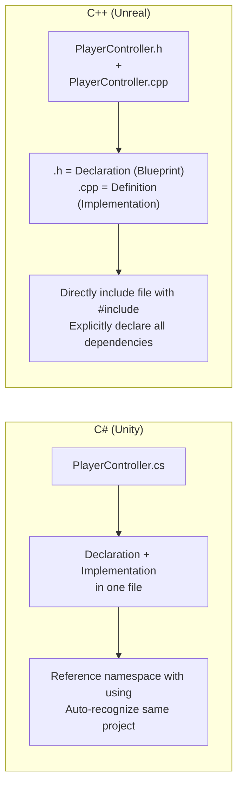
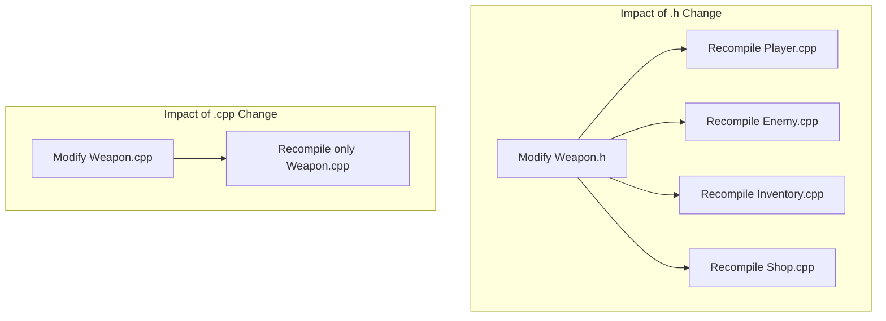
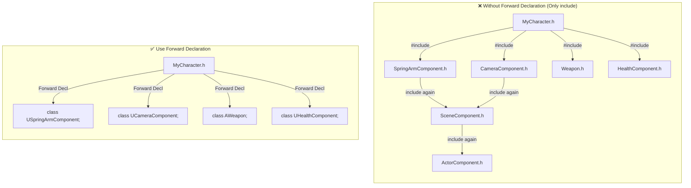
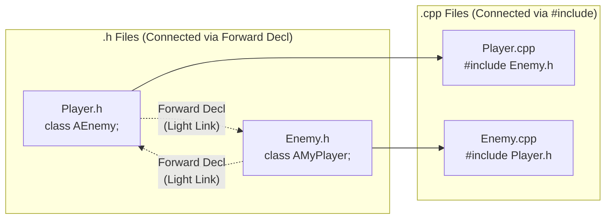
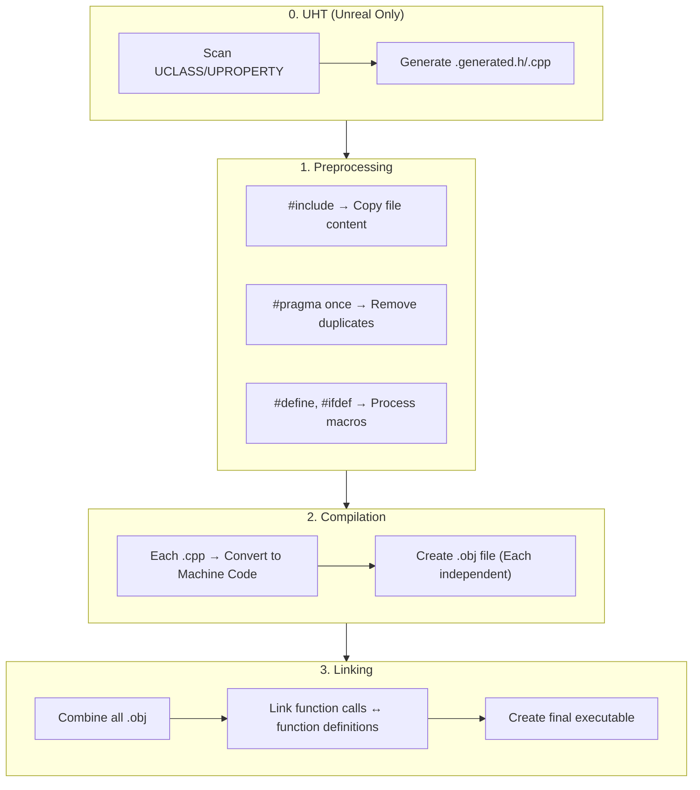

## Can You Read This Code?

When you create a new class in an Unreal project, **two files** are created.

```cpp
// ─── MyWeapon.h ───
#pragma once

#include "CoreMinimal.h"
#include "GameFramework/Actor.h"
#include "MyWeapon.generated.h"

class AMyCharacter;  // Forward Declaration

UCLASS()
class MYGAME_API AMyWeapon : public AActor
{
    GENERATED_BODY()

public:
    AMyWeapon();

    UPROPERTY(EditAnywhere, Category = "Weapon")
    float Damage = 10.0f;

    void Equip(AMyCharacter* Owner);

protected:
    virtual void BeginPlay() override;

private:
    AMyCharacter* OwnerCharacter;
};
```

```cpp
// ─── MyWeapon.cpp ───
#include "MyWeapon.h"
#include "MyCharacter.h"

AMyWeapon::AMyWeapon()
{
    Damage = 10.0f;
    OwnerCharacter = nullptr;
}

void AMyWeapon::Equip(AMyCharacter* Owner)
{
    OwnerCharacter = Owner;
    UE_LOG(LogTemp, Display, TEXT("Weapon equipped! Damage: %f"), Damage);
}

void AMyWeapon::BeginPlay()
{
    Super::BeginPlay();
}
```

If you are a Unity developer, you might have these questions:

- Why 2 files? One `.cs` is enough.
- What is `#pragma once`?
- There are 3 lines of `#include`, how is it different from `using`?
- I never created `.generated.h`, why include it?
- In `.h` it just says `class AMyCharacter;`, but in `.cpp` it says `#include "MyCharacter.h"`?

**In this lecture, we solve all these questions.**

---

## Introduction - "Compilation Model" Not in C#

When writing C# scripts in Unity, we rarely care about file structure. Writing a class in `PlayerController.cs` is enough. One line of `using UnityEngine;` gives access to all engine features, and other scripts in the same project can be used immediately without separate imports.

C++ is completely different. It is a language where you must **"tell it one by one what you want to use."**



Why this structure? In the 1980s when C++ was created, computer memory was very scarce, and compilers could only read a source file once from top to bottom. There was no way to automatically know "what classes are in other files," so developers had to tell it directly **"I will use these things in this file."** That legacy continues to this day.

---

## 1. #include - "Not using, but Copy/Paste"

### 1-1. The Reality of #include

C#'s `using` is **referencing a namespace**. It's not bringing in a file.

C++'s `#include` is completely different. It **physically copies/pastes the content of that file into that spot.** Literally.

```cpp
// Weapon.h
class Weapon
{
    float Damage;
};
```

```cpp
// Player.cpp
#include "Weapon.h"   // ← Content of Weapon.h is copied here

class Player
{
    Weapon* MyWeapon;  // Now knows Weapon
};
```

When the preprocessor handles `#include`, the code the compiler actually sees becomes:

```cpp
// What the compiler actually sees in Player.cpp (After preprocessing)
class Weapon          // ← Copied from Weapon.h
{
    float Damage;
};

class Player
{
    Weapon* MyWeapon;
};
```

This is the **fundamental difference** between `#include` and `using`.

| C# `using` | C++ `#include` |
|-----------|---------------|
| **References** namespace | **Copies/Pastes** file content |
| Little impact on compile speed | More includes = **Slower** compilation |
| Order doesn't matter | **Order can matter** |
| Duplicates don't matter | Duplicates cause **redefinition errors** (without guards) |

> **💬 Wait, Let's Know This**
>
> **Q. So if I include 100 times, does the file become huge?**
>
> Yes, really. Even including just `CoreMinimal.h` in Unreal results in tens of thousands of lines after preprocessing. That file includes another header, which includes another... It expands recursively. So **reducing unnecessary #includes is directly linked to compile time.**
>
> **Q. Difference between `#include <iostream>` and `#include "MyFile.h"`?**
>
> `<>` brackets search in **system/standard library** paths, and `""` quotes search in **project files** first. In Unreal, we mostly use `""` quotes.

---

### 1-2. #pragma once - Preventing Duplicate Includes

If `#include` is copy/paste, including the same file twice defines the class twice, causing an error.

```cpp
// This situation
#include "Weapon.h"
#include "Weapon.h"  // ← Weapon class defined twice → Compile Error!
```

You might think "Would I manually include twice?" But if A.h includes Weapon.h and B.h also includes Weapon.h, a file using both headers will automatically include it twice.

`#pragma once` prevents this.

```cpp
// Weapon.h
#pragma once    // ← "Include this file only once!" (Prevent duplication)

class Weapon
{
    float Damage;
};
```

If `#pragma once` is present, the preprocessor skips the file if it encounters it again.

**Every .h file in Unreal has `#pragma once` on the first line.** Just think "Ah, duplicate include prevention" and move on.

> **💬 Wait, Let's Know This**
>
> **Q. I heard there is include guard besides `#pragma once`?**
>
> It's the traditional C++ way:
> ```cpp
> // Traditional way (include guard)
> #ifndef WEAPON_H
> #define WEAPON_H
>
> class Weapon { ... };
>
> #endif
> ```
> `#pragma once` is simpler and more modern, so most modern C++ projects including Unreal use `#pragma once`. You might see `#ifndef` style in old open source projects; just think of it as the same role.

---

## 2. Header (.h) and Source (.cpp) - Why Separate?

### 2-1. Separation of Declaration and Definition

One of the most important concepts in C++ is **separation of declaration and definition**.

- **Declaration** = "This thing exists" (Blueprint, Interface)
- **Definition** = "This works like this" (Actual Implementation)

```cpp
// ─── MyWeapon.h (Declaration) ───
// "There is this class, and it has these members and functions"
class AMyWeapon : public AActor
{
    float Damage;
    void Attack();        // Declaration only (End with semicolon)
    float GetDamage();    // Declaration only
};
```

```cpp
// ─── MyWeapon.cpp (Definition) ───
// "Those functions work like this"
#include "MyWeapon.h"

void AMyWeapon::Attack()         // ClassName::FunctionName
{
    UE_LOG(LogTemp, Display, TEXT("Attack! Damage: %f"), Damage);
}

float AMyWeapon::GetDamage()
{
    return Damage;
}
```

When defining a function in `.cpp`, you write it as **`ClassName::FunctionName`**. `::` is the scope resolution operator, telling "This function belongs to AMyWeapon class."

C# has no such separation. Method bodies are written directly inside the class:

```csharp
// C# - Declaration and implementation are one
public class MyWeapon : MonoBehaviour
{
    float damage;

    public void Attack()    // Implementation with Declaration
    {
        Debug.Log($"Attack! Damage: {damage}");
    }
}
```

### 2-2. Why Separate?

**Reason 1: Compile Speed**

C++ compilers compile each `.cpp` file **independently**. If PlayerController.cpp changes, only PlayerController.cpp needs recompilation. But if PlayerController.h changes, **all .cpp files including this header** must be recompiled.



So the principle **Keep headers light, sources heavy** is important. If you put implementation code in the header, changing one line triggers a chain reaction of recompilation.

**Reason 2: Separation of Interface and Implementation**

Looking at just the `.h` file lets you grasp the class "interface" (what it can do) at a glance. You can quickly read the class structure without being distracted by implementation details.

In fact, when reading other people's code in Unreal projects, getting into the habit of **looking at `.h` files first** helps you understand much faster.

**Reason 3: Information Hiding**

When distributing a library, you can provide only `.h` files and compile `.cpp` into binaries. You expose "what it can do" but hide "how it does it." Unreal Engine itself is structured this way.

| Feature | .h File (Header) | .cpp File (Source) |
|------|---------------|-----------------|
| Role | Declaration (Interface) | Definition (Implementation) |
| Impact of Change | Recompiles **all files** including it | Recompiles **only itself** |
| Visibility | Visible to other files | Visible only to itself |
| Principle | **Keep Light** | Heavy is OK |

---

### 2-3. Basic Structure of Unreal Header Files

When you create a new class in Unreal, a header with the same pattern is always generated. Let's dissect the meaning of each line.

```cpp
// MyCharacter.h

#pragma once                              // ① Prevent duplicate include

#include "CoreMinimal.h"                  // ② Unreal core types (int32, FString, etc.)
#include "GameFramework/Character.h"      // ③ Parent class header (Required)
#include "MyCharacter.generated.h"        // ④ UHT auto-generation (Must be last!)

class USpringArmComponent;                // ⑤ Forward Declaration (Instead of include)
class UCameraComponent;                   // ⑤

UCLASS()                                  // ⑥ Unreal Reflection Macro
class MYGAME_API AMyCharacter : public ACharacter  // ⑦ Module API + Inheritance
{
    GENERATED_BODY()                      // ⑧ Reflection code insertion point

public:
    AMyCharacter();

protected:
    UPROPERTY(VisibleAnywhere)
    USpringArmComponent* SpringArm;       // Pointer → Forward Declaration sufficient

    UPROPERTY(VisibleAnywhere)
    UCameraComponent* Camera;

    virtual void BeginPlay() override;
};
```

| No. | Code | Role |
|------|------|------|
| ① | `#pragma once` | Prevent duplicate include |
| ② | `#include "CoreMinimal.h"` | Unreal basic types and macros (Included in almost all headers) |
| ③ | `#include "GameFramework/Character.h"` | Need **complete definition** of parent class (since inheriting) |
| ④ | `#include "MyCharacter.generated.h"` | Reflection code generated by UHT (**Must be last #include**) |
| ⑤ | `class USpringArmComponent;` | Forward declaration — Using only as pointer, so #include unnecessary |
| ⑥ | `UCLASS()` | Register this class to Unreal reflection |
| ⑦ | `MYGAME_API` | Export so other modules can use this class |
| ⑧ | `GENERATED_BODY()` | Code generated by UHT is inserted here |

> **💬 Wait, Let's Know This**
>
> **Q. Why must `.generated.h` be last?**
>
> When UHT (Unreal Header Tool) generates this file, it creates code based on all includes and forward declarations declared above it. If `.generated.h` is in the middle, it can't reference declarations below it, causing errors.
>
> **Q. What is in `CoreMinimal.h`?**
>
> It contains **basic types and macros most used in Unreal** like `int32`, `float`, `FString`, `FVector`, `TArray`, `UObject`, `check()`. In the past, `Engine.h` was included, but it was too heavy so it was replaced by the lightweight `CoreMinimal.h`. This is Unreal's **IWYU (Include What You Use)** principle.
>
> **Q. What is `MYGAME_API`?**
>
> Module export macro. `MYGAME` is the project name (module name) converted to uppercase. Without this, other modules cannot use this class. For now, just remember it as "something always attached."

---

### 2-4. Structure of Corresponding .cpp File

```cpp
// MyCharacter.cpp

#include "MyCharacter.h"                            // ① Own header (Must be first!)
#include "GameFramework/SpringArmComponent.h"       // ② Headers needed for implementation
#include "Camera/CameraComponent.h"                 // ②

AMyCharacter::AMyCharacter()                        // ③ Constructor definition
{
    SpringArm = CreateDefaultSubobject<USpringArmComponent>(TEXT("SpringArm"));
    SpringArm->SetupAttachment(RootComponent);

    Camera = CreateDefaultSubobject<UCameraComponent>(TEXT("Camera"));
    Camera->SetupAttachment(SpringArm);
}

void AMyCharacter::BeginPlay()                      // ④ Function definition
{
    Super::BeginPlay();                              // ⑤ Call parent function
    UE_LOG(LogTemp, Display, TEXT("MyCharacter BeginPlay!"));
}
```

| No. | Code | Role |
|------|------|------|
| ① | `#include "MyCharacter.h"` | **Own header first** — To immediately find missing dependencies |
| ② | `#include "...Component.h"` | Actual headers of classes forward declared in .h (Need member access) |
| ③ | `AMyCharacter::AMyCharacter()` | Defined as `ClassName::FunctionName` |
| ④ | `void AMyCharacter::BeginPlay()` | Same pattern |
| ⑤ | `Super::BeginPlay()` | Call parent class's same function (Same as C#'s `base.Method()`) |

**Core Pattern**: Classes forward declared in `.h` are actually `#include`d in `.cpp`. Keep headers light, include what's needed in source.

---

## 3. Forward Declaration - Key Technique to Keep Headers Light

### 3-1. What is Forward Declaration?

Forward declaration is **telling "such a class exists" without a complete definition of the class**.

```cpp
// Forward Declaration - "There will be a class named AEnemy" (Don't know size, members)
class AEnemy;

// vs

// Complete include - Know everything about AEnemy (Size, members, functions, etc.)
#include "Enemy.h"
```

### 3-2. Why Use Forward Declaration?

In C#, using `using` multiple times doesn't affect compile speed. But in C++, since `#include` physically copies files, more includes mean **exponentially more code for the compiler to process.**



Forward declaration is **1 line**, but `#include` brings in that file and all files it includes recursively. As the project grows, this difference hugely impacts build time.

---

### 3-3. What You Can / Cannot Do with Forward Declaration

**Core Rule: Forward declaration is sufficient when using only pointers (`*`) or references (`&`).**

Why? A pointer is just a memory address (8 bytes), so you don't need to know the class size or structure. But to create an object directly or access members, you need the complete definition.

```cpp
class AEnemy;  // Forward declaration

// ✅ Possible (Don't need to know size)
AEnemy* EnemyPtr;                    // Pointer declaration
void SetTarget(AEnemy* Enemy);       // Pointer parameter
AEnemy* GetTarget() const;           // Pointer return
void Process(AEnemy& Enemy);         // Reference parameter

// ❌ Impossible (Need to know size or members)
AEnemy EnemyInstance;                // Direct object creation → Don't know size!
EnemyPtr->TakeDamage(10.f);         // Member access → Don't know members!
sizeof(AEnemy);                      // Size request → Don't know size!
class ABoss : public AEnemy {};      // Inheritance → Don't know structure!
```

| Situation | Forward Decl | #include |
|------|---------|---------|
| Pointer member variable declaration (`AEnemy*`) | ✅ | ✅ |
| Reference parameter (`const AEnemy&`) | ✅ | ✅ |
| Pointer return type | ✅ | ✅ |
| Direct object creation | ❌ | ✅ |
| Member access (`ptr->Function()`) | ❌ | ✅ |
| Inheritance (`class B : public A`) | ❌ | ✅ |
| `sizeof()` | ❌ | ✅ |

---

### 3-4. Practical Forward Declaration Patterns in Unreal

This is the **most common pattern** in Unreal projects:

```cpp
// ─── MyCharacter.h ───
#pragma once
#include "CoreMinimal.h"
#include "GameFramework/Character.h"     // Parent class MUST be #include
#include "MyCharacter.generated.h"

// Forward Declaration (Things to use as pointers only)
class USpringArmComponent;
class UCameraComponent;
class UInputMappingContext;
class UInputAction;
class AWeapon;

UCLASS()
class MYGAME_API AMyCharacter : public ACharacter
{
    GENERATED_BODY()

protected:
    UPROPERTY(VisibleAnywhere)
    USpringArmComponent* SpringArm;      // Pointer → Forward Declaration OK

    UPROPERTY(VisibleAnywhere)
    UCameraComponent* Camera;            // Pointer → Forward Declaration OK

    UPROPERTY()
    AWeapon* CurrentWeapon;              // Pointer → Forward Declaration OK

public:
    void EquipWeapon(AWeapon* Weapon);   // Pointer parameter → Forward Declaration OK
};
```

```cpp
// ─── MyCharacter.cpp ───
#include "MyCharacter.h"                            // Own header (First!)
#include "GameFramework/SpringArmComponent.h"       // Now actually creating, so include
#include "Camera/CameraComponent.h"                 // Accessing members, so include
#include "Weapon.h"                                 // Calling member functions, so include

AMyCharacter::AMyCharacter()
{
    // CreateDefaultSubobject → Object creation → Need complete definition → #include essential
    SpringArm = CreateDefaultSubobject<USpringArmComponent>(TEXT("SpringArm"));
    Camera = CreateDefaultSubobject<UCameraComponent>(TEXT("Camera"));
}

void AMyCharacter::EquipWeapon(AWeapon* Weapon)
{
    CurrentWeapon = Weapon;
    if (CurrentWeapon)
    {
        CurrentWeapon->AttachToActor(this, FAttachmentTransformRules::KeepRelativeTransform);
    }
}
```

**Pattern Summary**:

```
.h file:  class AEnemy;              ← Forward Declaration (Light)
.cpp file: #include "Enemy.h"        ← Actual include (Heavy but OK in .cpp)
```

---

## 4. Circular Dependency - Problem Solved by Forward Declaration

### 4-1. Problem Situation

Player references Enemy, and Enemy references Player. Very common in games.

```cpp
// ❌ Infinite Loop!
// Player.h
#include "Enemy.h"      // Brings Enemy.h
class APlayer { AEnemy* Target; };

// Enemy.h
#include "Player.h"     // Brings Player.h → Player.h brings Enemy.h again → Infinite!
class AEnemy { APlayer* Target; };
```

`#pragma once` prevents the infinite loop itself, but depending on the order, one side is referenced before definition, causing a **compile error**.

### 4-2. Solution with Forward Declaration

```cpp
// ✅ Player.h
#pragma once
#include "CoreMinimal.h"
#include "GameFramework/Character.h"
#include "Player.generated.h"

class AEnemy;    // Forward Declaration! (Instead of #include "Enemy.h")

UCLASS()
class MYGAME_API AMyPlayer : public ACharacter
{
    GENERATED_BODY()

protected:
    UPROPERTY()
    AEnemy* TargetEnemy;    // Pointer, so forward declaration enough

public:
    void AttackTarget();
};
```

```cpp
// ✅ Enemy.h
#pragma once
#include "CoreMinimal.h"
#include "GameFramework/Character.h"
#include "Enemy.generated.h"

class AMyPlayer;  // Forward Declaration!

UCLASS()
class MYGAME_API AEnemy : public ACharacter
{
    GENERATED_BODY()

protected:
    UPROPERTY()
    AMyPlayer* TargetPlayer;    // Pointer, so forward declaration enough

public:
    void TakeDamage(float Damage);
};
```

```cpp
// ✅ Player.cpp - Include here
#include "Player.h"
#include "Enemy.h"      // Now can access Enemy members

void AMyPlayer::AttackTarget()
{
    if (TargetEnemy)
    {
        TargetEnemy->TakeDamage(10.f);  // Member function call → #include needed
    }
}
```



---

## 5. C++ Compilation Process - The Big Picture

When you save a script in Unity, the editor compiles it automatically. C++ compilation is more complex.



| Step | Action | C# Comparison |
|------|--------|--------|
| **0. UHT** | Scan `UCLASS` macros → Generate `.generated.h` | None (Reflection handled at runtime) |
| **1. Preprocess** | Expand `#include`, replace macros | None |
| **2. Compile** | Convert each `.cpp` independently to machine code (`.obj`) | `.cs` → IL code conversion |
| **3. Link** | Combine all `.obj` to create executable | IL → JIT Compilation (at runtime) |

> **💬 Wait, Let's Know This**
>
> **Q. Why is Unreal build so slow?**
>
> Several reasons:
> 1. **#include Chain** — One header pulls in dozens of headers recursively.
> 2. **Template Instantiation** — New code generated whenever templates like `TArray<AEnemy*>` are used.
> 3. **UHT Step** — Extra step needed before standard C++ compilation.
> 4. **Chain Effect of Header Change** — Modifying a heavily included header recompiles hundreds of .cpp files.
>
> So **reducing #includes with forward declarations** has a direct impact on build time.
>
> **Q. What is "Linker Error"?**
>
> If you declare a function in `.h` but don't define (implement) it in `.cpp`, it compiles but errors at linking stage saying "cannot find implementation of this function." It's a type of error not seen in C#, so it's confusing at first. If you see `unresolved external symbol`, think "Ah, implementation is missing somewhere."

---

## 6. Unreal Header Include Order Rules

There are **recommended rules** for #include order in Unreal.

```cpp
// MyCharacter.cpp

// ① Own header (Must be first!)
#include "MyCharacter.h"

// ② Unreal Engine Headers
#include "GameFramework/SpringArmComponent.h"
#include "Camera/CameraComponent.h"
#include "Components/CapsuleComponent.h"

// ③ Other Class Headers in Project
#include "Weapon/MyWeapon.h"
#include "Components/HealthComponent.h"
```

**Reason for putting own header first**: If there is a missing #include in your own header, a compile error occurs immediately. If other headers come first, they might accidentally include what's needed, hiding the error.

---

## Summary - Lecture 2 Checklist

After this lecture, you should be able to read the following in Unreal code:

- [ ] Know that `#include` is not `using` but file copying
- [ ] Know why `#pragma once` is in every header
- [ ] Be able to explain why `.h` and `.cpp` are separated
- [ ] Be able to read `.cpp` definitions in `ClassName::FunctionName` form
- [ ] Know what `class AEnemy;` forward declaration is and why to use it
- [ ] Distinguish what is possible (pointers, references) and impossible (object creation, member access) with forward declaration
- [ ] Know why `.generated.h` is the last include
- [ ] Know what `CoreMinimal.h` is
- [ ] Roughly know what `MYGAME_API` is
- [ ] Know that `Super::BeginPlay()` is the same as C#'s `base.Method()`

---

## Next Lecture Preview

**Lecture 3: Introduction to Pointers - That Thing Not in C#**

In Unity, getting a component with `GetComponent<Rigidbody>()` allows access with just `.`. But in Unreal, getting with `FindComponentByClass<UStaticMeshComponent>()` requires access with `->` arrow. `*`, `&`, `->`, `nullptr` — We enter the world of pointers that doesn't exist in C#.
