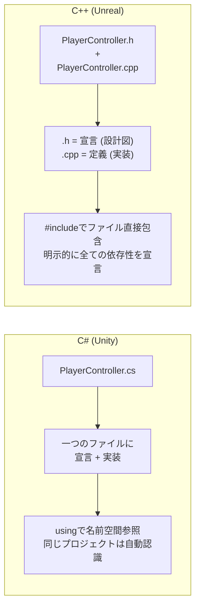
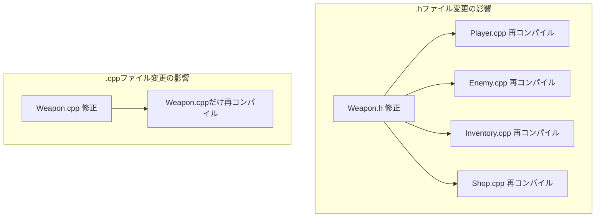
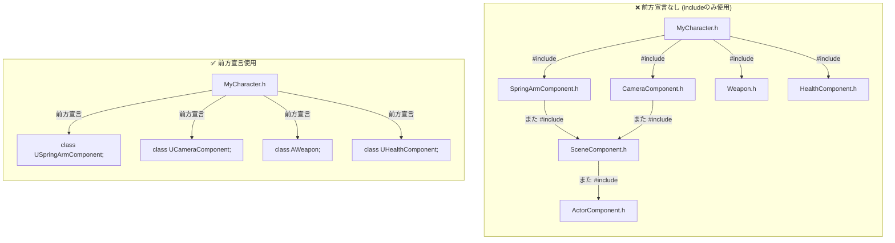
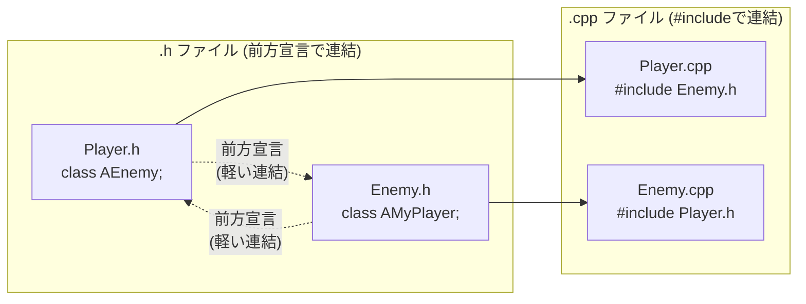
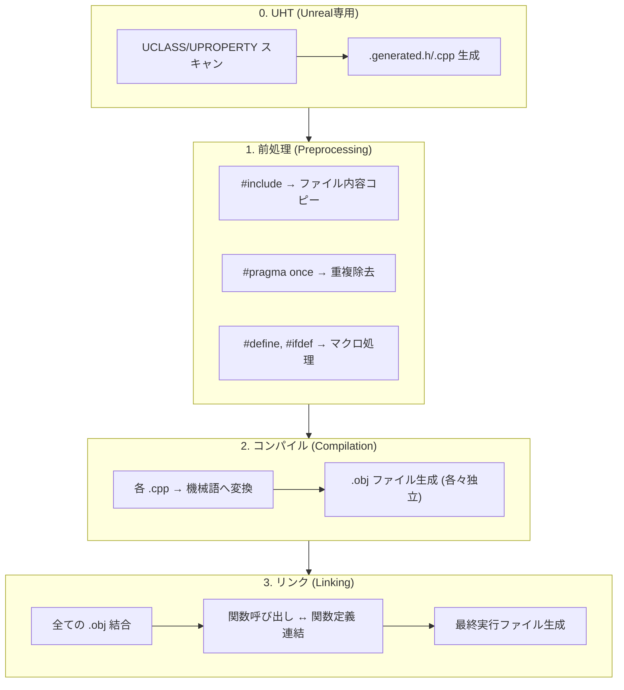

## このコード、読めますか？

Unrealプロジェクトで新しいクラスを作ると、**ファイルが2つ**生成されます。

```cpp
// ─── MyWeapon.h ───
#pragma once

#include "CoreMinimal.h"
#include "GameFramework/Actor.h"
#include "MyWeapon.generated.h"

class AMyCharacter;  // 前方宣言

UCLASS()
class MYGAME_API AMyWeapon : public AActor
{
    GENERATED_BODY()

public:
    AMyWeapon();

    UPROPERTY(EditAnywhere, Category = "Weapon")
    float Damage = 10.0f;

    void Equip(AMyCharacter* Owner);

protected:
    virtual void BeginPlay() override;

private:
    AMyCharacter* OwnerCharacter;
};
```

```cpp
// ─── MyWeapon.cpp ───
#include "MyWeapon.h"
#include "MyCharacter.h"

AMyWeapon::AMyWeapon()
{
    Damage = 10.0f;
    OwnerCharacter = nullptr;
}

void AMyWeapon::Equip(AMyCharacter* Owner)
{
    OwnerCharacter = Owner;
    UE_LOG(LogTemp, Display, TEXT("Weapon equipped! Damage: %f"), Damage);
}

void AMyWeapon::BeginPlay()
{
    Super::BeginPlay();
}
```

Unity開発者なら、こんな疑問が湧くでしょう：

- なぜファイルが2つ？ `.cs` 一つでいいのに？
- `#pragma once` って何？
- `#include` が3行もあるけど、`using` と何が違うの？
- `.generated.h` なんて作った覚えがないのに、なぜincludeするの？
- `.h` では `class AMyCharacter;` とだけ書いて、 `.cpp` では `#include "MyCharacter.h"` を書くの？

**今回の講義でこれらの疑問をすべて解決します。**

---

## 序論 - C#にはない「コンパイルモデル」

UnityでC#スクリプトを書くとき、私たちはファイル構造を気にする必要がほとんどありません。`PlayerController.cs` 一つにクラスを書けばいいのです。`using UnityEngine;` 一行でエンジンの全機能にアクセスでき、同じプロジェクトの他のスクリプトは別途インポートなしですぐに使えます。

C++は完全に異なります。**「私が使いたいものを一つ一つ教えなければならない」** 言語です。



なぜこのような構造なのでしょうか？ C++が作られた1980年代はコンピュータメモリが非常に少なく、コンパイラはソースファイルを上から下に一度だけ読むことしかできませんでした。「他のファイルにどんなクラスがあるか」自動的に知る方法がなかったため、開発者が直接 **「このファイルでこういうものを使うよ」** と教える必要がありました。その遺産が今まで続いています。

---

## 1. #include - 「usingではなくコピー/ペーストだ」

### 1-1. #includeの実体

C#の `using` は **名前空間を参照** するものです。ファイルを持ってくるわけではありません。

C++の `#include` は完全に異なります。**そのファイルの内容をその場に物理的にコピー/ペースト** します。本当にです。

```cpp
// Weapon.h
class Weapon
{
    float Damage;
};
```

```cpp
// Player.cpp
#include "Weapon.h"   // ← Weapon.hの内容がこの場所にコピーされる

class Player
{
    Weapon* MyWeapon;  // これでWeaponを知っている
};
```

プリプロセッサ（前処理）が `#include` を処理すると、コンパイラが実際に見るコードはこうなります：

```cpp
// コンパイラが実際に見るPlayer.cpp (前処理後)
class Weapon          // ← Weapon.hからコピーされた
{
    float Damage;
};

class Player
{
    Weapon* MyWeapon;
};
```

これが `#include` が `using` と **根本的に違う点** です。

| C# `using` | C++ `#include` |
|-----------|---------------|
| 名前空間を **参照** | ファイル内容を **コピー/ペースト** |
| コンパイル速度にほぼ影響なし | includeが多いとコンパイルが **遅くなる** |
| 順序関係なし | **順序が重要** な場合がある |
| 重複しても関係なし | 重複すると **再定義エラー** (ガードがない場合) |

> **💬 ちょっと一言、これだけは知っておこう**
>
> **Q. それなら#includeを100回したらファイルがすごく大きくなりますか？**
>
> はい、本当にそうなります。Unrealで `CoreMinimal.h` 一つだけincludeしても、前処理後には数万行になります。このファイルがまた別のヘッダーをincludeし、そのヘッダーがまた別のヘッダーをincludeし... 連鎖的に拡張されます。だから **不要な#includeを減らすことがコンパイル時間に直結します。**
>
> **Q. `#include <iostream>` と `#include "MyFile.h"` の違いは？**
>
> `<>` 山括弧は **システム/標準ライブラリ** パスから探し、`""` 引用符は **プロジェクト内ファイル** から先に探します。Unrealではほとんど `""` 引用符を使います。

---

### 1-2. #pragma once - 重複include防止

`#include` がコピー/ペーストなら、同じファイルを2回includeするとクラスが2回定義されてエラーが発生します。

```cpp
// こういう状況
#include "Weapon.h"
#include "Weapon.h"  // ← Weaponクラスが2回定義される → コンパイルエラー！
```

「直接2回includeすることなんてある？」と思うかもしれませんが、A.hがWeapon.hをincludeし、B.hもWeapon.hをincludeすれば、両方のヘッダーを使うファイルで自動的に2回含まれてしまいます。

これを防止するのが `#pragma once` です。

```cpp
// Weapon.h
#pragma once    // ← 「このファイルは一回だけ含めて！」 (重複防止)

class Weapon
{
    float Damage;
};
```

`#pragma once` があれば、プリプロセッサが既に含んだファイルに再び出会ったときにスキップします。

**Unrealのすべての .h ファイルは最初の行に `#pragma once` があります。** 見かけたら「あ、重複include防止だな」と思って通り過ぎればOKです。

> **💬 ちょっと一言、これだけは知っておこう**
>
> **Q. `#pragma once` 以外にinclude guardというのもあるそうですが？**
>
> 伝統的なC++方式です：
> ```cpp
> // 伝統的方式 (include guard)
> #ifndef WEAPON_H
> #define WEAPON_H
>
> class Weapon { ... };
>
> #endif
> ```
> `#pragma once` がより簡便で現代的なので、Unrealを含むほとんどの現代C++プロジェクトは `#pragma once` を使用します。古いオープンソースプロジェクトで `#ifndef` スタイルを見かけることがありますが、同じ役割だと思えばよいです。

---

## 2. ヘッダー(.h)とソース(.cpp) - なぜ分離するのか

### 2-1. 宣言と定義の分離

C++で最も重要な概念の一つが **宣言（declaration）と定義（definition）の分離** です。

- **宣言** = 「こういうものが存在する」 (設計図、インターフェース)
- **定義** = 「これはこう動く」 (実際の実装)

```cpp
// ─── MyWeapon.h (宣言) ───
// 「こういうクラスがあって、こういうメンバと関数がある」
class AMyWeapon : public AActor
{
    float Damage;
    void Attack();        // 宣言のみ (セミコロンで終わる)
    float GetDamage();    // 宣言のみ
};
```

```cpp
// ─── MyWeapon.cpp (定義) ───
// 「その関数たちはこう動く」
#include "MyWeapon.h"

void AMyWeapon::Attack()         // クラス名::関数名
{
    UE_LOG(LogTemp, Display, TEXT("Attack! Damage: %f"), Damage);
}

float AMyWeapon::GetDamage()
{
    return Damage;
}
```

`.cpp` で関数を定義するとき `AMyWeapon::Attack()` のように **`クラス名::関数名`** の形で書きます。`::` はスコープ解決演算子（scope resolution operator）で、「この関数はAMyWeaponクラスに属する関数だよ」と知らせます。

C#ではこのような分離はありません。メソッド本体を直接クラスの中に書きますよね：

```csharp
// C# - 宣言と実装が一つ
public class MyWeapon : MonoBehaviour
{
    float damage;

    public void Attack()    // 宣言と同時に実装
    {
        Debug.Log($"Attack! Damage: {damage}");
    }
}
```

### 2-2. なぜ分離するのか？

**理由 1: コンパイル速度**

C++コンパイラは `.cpp` ファイルを一つずつ **独立して** コンパイルします。PlayerController.cppが変更されればPlayerController.cppだけ再コンパイルすれば済みます。しかしPlayerController.hが変更されると、**このヘッダーをincludeするすべての .cpp ファイル** が再コンパイルされます。



だから **ヘッダーは軽く、ソースは重く** という原則が重要です。ヘッダーに実装コードを入れると、一行直しただけで連鎖的に再コンパイルが発生します。

**理由 2: インターフェースと実装の分離**

`.h` ファイルだけ見ればクラスの「インターフェース」（何ができるか）を一目で把握できます。実装の詳細に邪魔されず、クラスの全体構造を素早く読めます。

実際にUnrealプロジェクトで他人のコードを読むとき、**`.h` ファイルから見る習慣** をつけるとはるかに早く把握できます。

**理由 3: 情報隠蔽**

ライブラリを配布するとき、`.h` ファイルだけ提供して `.cpp` はコンパイル済みバイナリで提供できます。「何ができるか」は公開し、「どうやっているか」は隠すわけです。Unreal Engine自体もこのような方式で構成されています。

| 特性 | .h ファイル (ヘッダー) | .cpp ファイル (ソース) |
|------|---------------|-----------------|
| 役割 | 宣言 (インターフェース) | 定義 (実装) |
| 変更時の影響 | includeする **すべてのファイル** 再コンパイル | **自分だけ** 再コンパイル |
| 公開範囲 | 他のファイルが見れる | 自分だけ見れる |
| 原則 | **軽く保つ** | 重くてもOK |

---

### 2-3. Unrealヘッダーファイルの基本構造

Unrealで新しいクラスを作ると常に同じパターンのヘッダーが生成されます。各行の意味を一つずつ解剖してみましょう。

```cpp
// MyCharacter.h

#pragma once                              // ① 重複include防止

#include "CoreMinimal.h"                  // ② Unreal核心型 (int32, FStringなど)
#include "GameFramework/Character.h"      // ③ 親クラスヘッダー (継承するから必須)
#include "MyCharacter.generated.h"        // ④ UHT自動生成 (必ず最後！)

class USpringArmComponent;                // ⑤ 前方宣言 (includeの代わり)
class UCameraComponent;                   // ⑤

UCLASS()                                  // ⑥ Unrealリフレクションマクロ
class MYGAME_API AMyCharacter : public ACharacter  // ⑦ モジュールAPI + 継承
{
    GENERATED_BODY()                      // ⑧ リフレクションコード挿入地点

public:
    AMyCharacter();

protected:
    UPROPERTY(VisibleAnywhere)
    USpringArmComponent* SpringArm;       // ポインタ → 前方宣言で十分

    UPROPERTY(VisibleAnywhere)
    UCameraComponent* Camera;

    virtual void BeginPlay() override;
};
```

| 番号 | コード | 役割 |
|------|------|------|
| ① | `#pragma once` | 重複include防止 |
| ② | `#include "CoreMinimal.h"` | Unreal基本型とマクロ (ほぼ全ヘッダーに含まれる) |
| ③ | `#include "GameFramework/Character.h"` | 親クラスの **完全な定義** が必要 (継承するから) |
| ④ | `#include "MyCharacter.generated.h"` | UHTが生成するリフレクションコード (**必ず最後の#include**) |
| ⑤ | `class USpringArmComponent;` | 前方宣言 — ポインタでしか使わないから#include不要 |
| ⑥ | `UCLASS()` | このクラスをUnrealリフレクションに登録 |
| ⑦ | `MYGAME_API` | 他のモジュールでもこのクラスを使えるようにエクスポート |
| ⑧ | `GENERATED_BODY()` | UHTが生成したコードがここに挿入される |

> **💬 ちょっと一言、これだけは知っておこう**
>
> **Q. `.generated.h` はなぜ必ず最後でなければならないのですか？**
>
> UHT(Unreal Header Tool)がこのファイルを自動生成するとき、その上に宣言されたすべてのincludeと前方宣言を基盤にコードを作ります。`.generated.h` が途中にあると、下にある宣言を参照できずエラーになります。
>
> **Q. `CoreMinimal.h` には何が入っていますか？**
>
> `int32`, `float`, `FString`, `FVector`, `TArray`, `UObject`, `check()` など **Unrealで最もよく使う基本型とマクロ** が入っています。過去には `Engine.h` をincludeしていましたが、重すぎるため軽量化された `CoreMinimal.h` に代替されました。これがUnrealの **IWYU(Include What You Use)** 原則です。
>
> **Q. `MYGAME_API` は何ですか？**
>
> モジュールエクスポートマクロです。`MYGAME` はプロジェクト名（モジュール名）が大文字に変換されたものです。これがないと他のモジュールでこのクラスを使えません。今は「常に付けるもの」とだけ覚えておけばOKです。

---

### 2-4. 対応する .cpp ファイルの構造

```cpp
// MyCharacter.cpp

#include "MyCharacter.h"                            // ① 自分自身のヘッダー (必ず最初！)
#include "GameFramework/SpringArmComponent.h"       // ② 実装に必要なヘッダーたち
#include "Camera/CameraComponent.h"                 // ②

AMyCharacter::AMyCharacter()                        // ③ コンストラクタ定義
{
    SpringArm = CreateDefaultSubobject<USpringArmComponent>(TEXT("SpringArm"));
    SpringArm->SetupAttachment(RootComponent);

    Camera = CreateDefaultSubobject<UCameraComponent>(TEXT("Camera"));
    Camera->SetupAttachment(SpringArm);
}

void AMyCharacter::BeginPlay()                      // ④ 関数定義
{
    Super::BeginPlay();                              // ⑤ 親関数呼び出し
    UE_LOG(LogTemp, Display, TEXT("MyCharacter BeginPlay!"));
}
```

| 番号 | コード | 役割 |
|------|------|------|
| ① | `#include "MyCharacter.h"` | **自分のヘッダーを最初に** — 欠けた依存性をすぐ発見するため |
| ② | `#include "...Component.h"` | .hで前方宣言だけしたクラスの実際のヘッダー (メンバアクセス必要) |
| ③ | `AMyCharacter::AMyCharacter()` | `クラス名::関数名` の形で定義 |
| ④ | `void AMyCharacter::BeginPlay()` | 同じパターン |
| ⑤ | `Super::BeginPlay()` | 親クラスの同じ関数呼び出し (C#の `base.Method()` と同じ) |

**核心パターン**: `.h` で前方宣言したクラスは、`.cpp` で実際に `#include` します。ヘッダーは軽く、ソースで必要なものをincludeする構造です。

---

## 3. 前方宣言 - ヘッダーを軽く保つ核心技術

### 3-1. 前方宣言とは？

前方宣言（forward declaration）は **クラスの完全な定義なしに、「こういうクラスが存在する」とだけ教えること** です。

```cpp
// 前方宣言 - 「AEnemyというクラスがあるはずだ」 (サイズ、メンバは知らない)
class AEnemy;

// vs

// 完全なinclude - AEnemyのすべてを知る (サイズ、メンバ、関数など)
#include "Enemy.h"
```

### 3-2. なぜ前方宣言を使うのか？

C#では `using` をいくら使ってもコンパイル速度に影響ありません。しかしC++で `#include` はファイルを物理的にコピーするため、includeが多いほど **コンパイラが処理するコードが幾何級数的に増えます。**



前方宣言は **1行** ですが、`#include` はそのファイルと、そのファイルがincludeするすべてのファイルを連鎖的に持ってきます。プロジェクトが大きくなるほどこの差がビルド時間に大きな影響を与えます。

---

### 3-3. 前方宣言でできること / できないこと

**核心ルール: ポインタ(`*`)や参照(`&`)としてのみ使うときは前方宣言で十分です。**

なぜ？ ポインタはただのメモリアドレス（8バイト）に過ぎないので、クラスのサイズや構造を知らなくても良いのです。しかしオブジェクトを直接生成したりメンバにアクセスするには完全な定義が必要です。

```cpp
class AEnemy;  // 前方宣言

// ✅ 可能なこと (サイズを知らなくていい)
AEnemy* EnemyPtr;                    // ポインタ宣言
void SetTarget(AEnemy* Enemy);       // ポインタパラメータ
AEnemy* GetTarget() const;           // ポインタ戻り値
void Process(AEnemy& Enemy);         // 参照パラメータ

// ❌ 不可能なこと (サイズやメンバを知る必要がある)
AEnemy EnemyInstance;                // オブジェクト直接生成 → サイズを知らない！
EnemyPtr->TakeDamage(10.f);         // メンバアクセス → メンバを知らない！
sizeof(AEnemy);                      // サイズ要求 → サイズを知らない！
class ABoss : public AEnemy {};      // 継承 → 構造を知らない！
```

| 状況 | 前方宣言 | #include |
|------|---------|---------|
| ポインタメンバ変数宣言 (`AEnemy*`) | ✅ | ✅ |
| 参照パラメータ (`const AEnemy&`) | ✅ | ✅ |
| ポインタ戻り値型 | ✅ | ✅ |
| オブジェクト直接生成 | ❌ | ✅ |
| メンバアクセス (`ptr->Function()`) | ❌ | ✅ |
| 継承 (`class B : public A`) | ❌ | ✅ |
| `sizeof()` | ❌ | ✅ |

---

### 3-4. Unrealでの前方宣言 実戦パターン

Unrealプロジェクトで **最もよく見るパターン** です：

```cpp
// ─── MyCharacter.h ───
#pragma once
#include "CoreMinimal.h"
#include "GameFramework/Character.h"     // 親クラスは必ず #include
#include "MyCharacter.generated.h"

// 前方宣言 (ポインタでのみ使うものたち)
class USpringArmComponent;
class UCameraComponent;
class UInputMappingContext;
class UInputAction;
class AWeapon;

UCLASS()
class MYGAME_API AMyCharacter : public ACharacter
{
    GENERATED_BODY()

protected:
    UPROPERTY(VisibleAnywhere)
    USpringArmComponent* SpringArm;      // ポインタ → 前方宣言OK

    UPROPERTY(VisibleAnywhere)
    UCameraComponent* Camera;            // ポインタ → 前方宣言OK

    UPROPERTY()
    AWeapon* CurrentWeapon;              // ポインタ → 前方宣言OK

public:
    void EquipWeapon(AWeapon* Weapon);   // ポインタパラメータ → 前方宣言OK
};
```

```cpp
// ─── MyCharacter.cpp ───
#include "MyCharacter.h"                            // 自分のヘッダー (最初！)
#include "GameFramework/SpringArmComponent.h"       // いざ生成するからinclude
#include "Camera/CameraComponent.h"                 // メンバアクセスするからinclude
#include "Weapon.h"                                 // メンバ関数呼ぶからinclude

AMyCharacter::AMyCharacter()
{
    // CreateDefaultSubobject → オブジェクト生成 → 完全な定義必要 → #include必須
    SpringArm = CreateDefaultSubobject<USpringArmComponent>(TEXT("SpringArm"));
    Camera = CreateDefaultSubobject<UCameraComponent>(TEXT("Camera"));
}

void AMyCharacter::EquipWeapon(AWeapon* Weapon)
{
    CurrentWeapon = Weapon;
    if (CurrentWeapon)
    {
        CurrentWeapon->AttachToActor(this, FAttachmentTransformRules::KeepRelativeTransform);
    }
}
```

**パターン整理**:

```
.h ファイル:  class AEnemy;              ← 前方宣言 (軽く)
.cpp ファイル: #include "Enemy.h"        ← 実際のinclude (重いが.cppだからOK)
```

---

## 4. 循環依存 - 前方宣言が解決する問題

### 4-1. 問題状況

PlayerがEnemyを参照し、EnemyもPlayerを参照する状況。ゲームで非常にありふれています。

```cpp
// ❌ こうすると無限ループ！
// Player.h
#include "Enemy.h"      // Enemy.hを持ってくる
class APlayer { AEnemy* Target; };

// Enemy.h
#include "Player.h"     // Player.hを持ってくる → Player.hがまたEnemy.hを持ってくる → 無限！
class AEnemy { APlayer* Target; };
```

`#pragma once` が無限ループ自体は防いでくれますが、順序によって片方が定義される前に参照することになり **コンパイルエラー** が発生します。

### 4-2. 前方宣言で解決

```cpp
// ✅ Player.h
#pragma once
#include "CoreMinimal.h"
#include "GameFramework/Character.h"
#include "Player.generated.h"

class AEnemy;    // 前方宣言！ (#include "Enemy.h" の代わり)

UCLASS()
class MYGAME_API AMyPlayer : public ACharacter
{
    GENERATED_BODY()

protected:
    UPROPERTY()
    AEnemy* TargetEnemy;    // ポインタだから前方宣言で十分

public:
    void AttackTarget();
};
```

```cpp
// ✅ Enemy.h
#pragma once
#include "CoreMinimal.h"
#include "GameFramework/Character.h"
#include "Enemy.generated.h"

class AMyPlayer;  // 前方宣言！

UCLASS()
class MYGAME_API AEnemy : public ACharacter
{
    GENERATED_BODY()

protected:
    UPROPERTY()
    AMyPlayer* TargetPlayer;    // ポインタだから前方宣言で十分

public:
    void TakeDamage(float Damage);
};
```

```cpp
// ✅ Player.cpp - ここでinclude
#include "Player.h"
#include "Enemy.h"      // これでEnemyのメンバにアクセス可能

void AMyPlayer::AttackTarget()
{
    if (TargetEnemy)
    {
        TargetEnemy->TakeDamage(10.f);  // メンバ関数呼び出し → #include必要
    }
}
```



---

## 5. C++ コンパイル過程 - 全体像

Unityでスクリプトを保存するとエディタが自動的にコンパイルします。C++のコンパイル過程はもう少し複雑です。



| 段階 | すること | C# 比較 |
|------|--------|--------|
| **0. UHT** | `UCLASS` などマクロスキャン → `.generated.h` 生成 | なし (リフレクションがランタイムに処理される) |
| **1. 前処理** | `#include` 拡張、マクロ置換 | なし |
| **2. コンパイル** | 各 `.cpp` を独立して機械語に変換 (`.obj`) | `.cs` → ILコード変換 |
| **3. リンク** | 全ての `.obj` を合わせて実行ファイル生成 | IL → JITコンパイル (実行時) |

> **💬 ちょっと一言、これだけは知っておこう**
>
> **Q. Unrealビルドがなぜこんなに遅いのですか？**
>
> いくつか理由があります：
> 1. **#include 連鎖** — 一つのヘッダーが数十個のヘッダーを連鎖的に引っ張ってくる
> 2. **テンプレートインスタンス化** — `TArray<AEnemy*>` のようなテンプレートが使われるたびに新しいコード生成
> 3. **UHT 段階** — 一般C++コンパイル前に追加段階が必要
> 4. **ヘッダー変更の連鎖効果** — 多くincludeされるヘッダーを修正すると数百個の.cppが再コンパイル
>
> だから **前方宣言で#includeを減らすこと** がビルド時間に直接的な影響を与えます。
>
> **Q. 「リンカーエラー」とは何ですか？**
>
> `.h` に関数を宣言しておいて `.cpp` に定義（実装）をしないと、コンパイルはされますが、リンク段階で「この関数の実装が見つからない」というエラーが出ます。C#では見られないエラータイプなので最初は戸惑います。`unresolved external symbol` というメッセージが出たら「どこかに実装が抜けているな」と思えばいいです。

---

## 6. Unrealヘッダーinclude順序ルール

Unrealで#include順序には **推奨ルール** があります。

```cpp
// MyCharacter.cpp

// ① 自分自身のヘッダー (必ず最初！)
#include "MyCharacter.h"

// ② Unreal Engineヘッダー
#include "GameFramework/SpringArmComponent.h"
#include "Camera/CameraComponent.h"
#include "Components/CapsuleComponent.h"

// ③ 同じプロジェクトの他のクラスヘッダー
#include "Weapon/MyWeapon.h"
#include "Components/HealthComponent.h"
```

**自分のヘッダーを最初に置く理由**: 自分のヘッダーに欠けた#includeがあれば、すぐにコンパイルエラーが発生します。他のヘッダーが先に来ると、そのヘッダーが偶然必要なものを含んでいてエラーが隠される可能性があります。

---

## まとめ - 第2講チェックリスト

この講義を終えると、Unrealコードで以下を読めるようになっているはずです：

- [ ] `#include` が `using` ではなくファイルコピーであることを知っている
- [ ] `#pragma once` がなぜ全ヘッダーにあるか知っている
- [ ] `.h` と `.cpp` がなぜ分離されているか説明できる
- [ ] `クラス名::関数名` 形の `.cpp` 定義を読める
- [ ] `class AEnemy;` 前方宣言が何か、なぜ使うか知っている
- [ ] 前方宣言で可能なこと(ポインタ、参照)と不可能なこと(オブジェクト生成、メンバアクセス)を区別できる
- [ ] `.generated.h` がなぜ最後のincludeなのか知っている
- [ ] `CoreMinimal.h` が何か知っている
- [ ] `MYGAME_API` が何か大体わかる
- [ ] `Super::BeginPlay()` がC#の `base.Method()` と同じであることを知っている

---

## 次回予告

**第3講：ポインタ入門 - C#にはないアレ**

Unityで `GetComponent<Rigidbody>()` でコンポーネントを持ってくればそのまま `.` でアクセスします。しかしUnrealでは `FindComponentByClass<UStaticMeshComponent>()` で持ってきた結果に `->` 矢印でアクセスします。`*`、`&`、`->`、`nullptr` — C#にはないポインタの世界に入ります。
