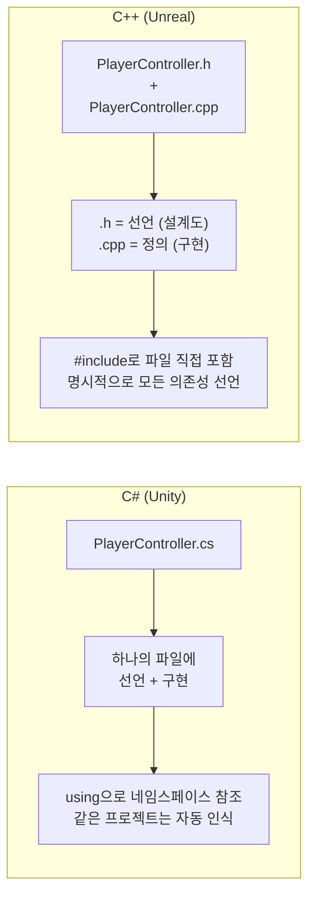
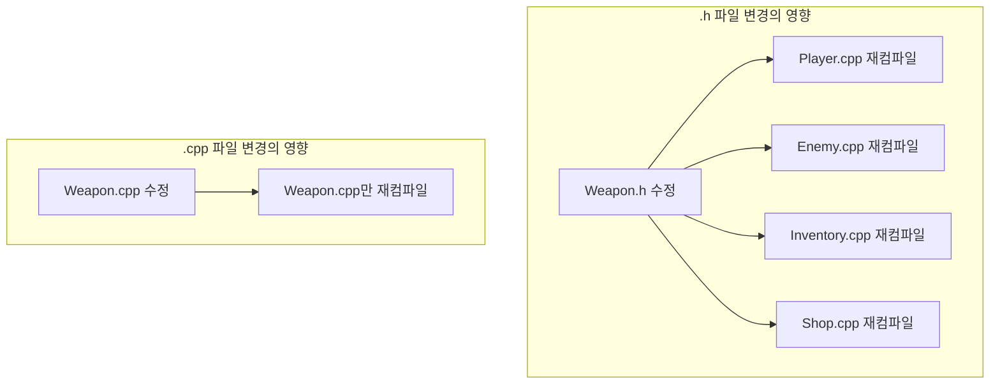
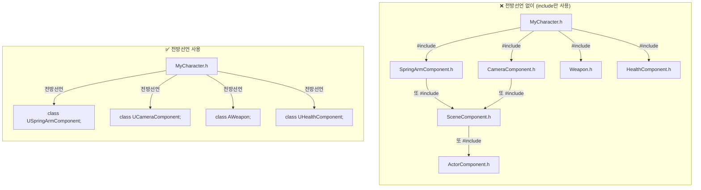
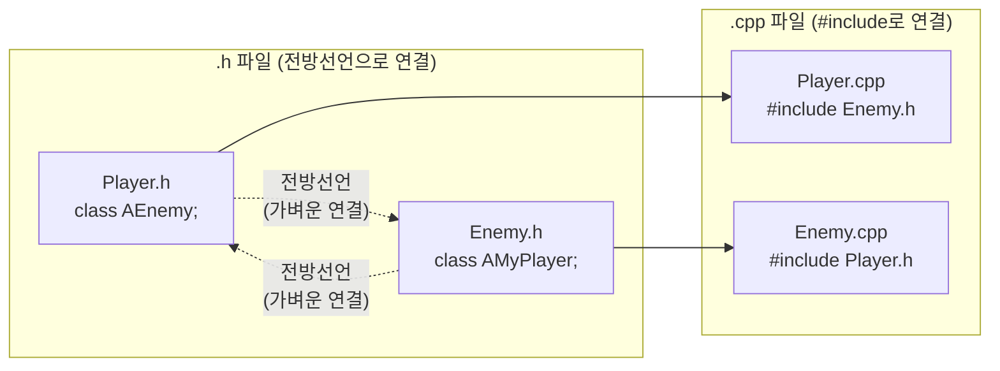
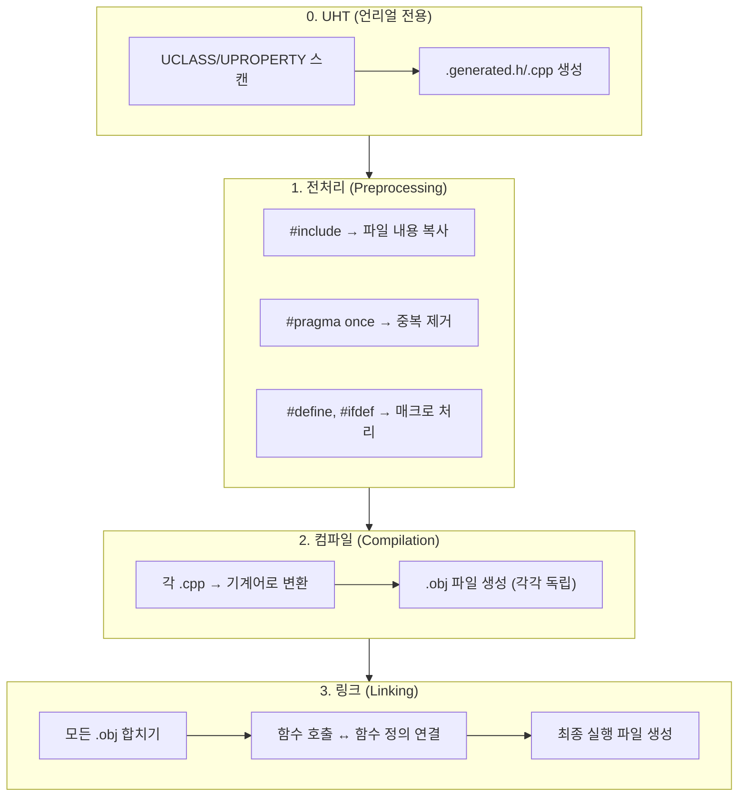

## 이 코드, 읽을 수 있나요?

언리얼 프로젝트에서 새 클래스를 만들면 **파일이 2개** 생깁니다.

```cpp
// ─── MyWeapon.h ───
#pragma once

#include "CoreMinimal.h"
#include "GameFramework/Actor.h"
#include "MyWeapon.generated.h"

class AMyCharacter;  // 전방 선언

UCLASS()
class MYGAME_API AMyWeapon : public AActor
{
    GENERATED_BODY()

public:
    AMyWeapon();

    UPROPERTY(EditAnywhere, Category = "Weapon")
    float Damage = 10.0f;

    void Equip(AMyCharacter* Owner);

protected:
    virtual void BeginPlay() override;

private:
    AMyCharacter* OwnerCharacter;
};
```

```cpp
// ─── MyWeapon.cpp ───
#include "MyWeapon.h"
#include "MyCharacter.h"

AMyWeapon::AMyWeapon()
{
    Damage = 10.0f;
    OwnerCharacter = nullptr;
}

void AMyWeapon::Equip(AMyCharacter* Owner)
{
    OwnerCharacter = Owner;
    UE_LOG(LogTemp, Display, TEXT("Weapon equipped! Damage: %f"), Damage);
}

void AMyWeapon::BeginPlay()
{
    Super::BeginPlay();
}
```

유니티 개발자라면 이런 의문이 듭니다:

- 왜 파일이 2개야? `.cs` 하나면 되는데?
- `#pragma once`는 뭐지?
- `#include`가 3줄이나 있는데, `using`이랑 뭐가 다른 거지?
- `.generated.h`는 내가 만든 적 없는데 왜 include 하는 거지?
- `.h`에서는 `class AMyCharacter;`라고만 쓰고 `.cpp`에서는 `#include "MyCharacter.h"`를 쓰네?

**이번 강에서 이 모든 의문을 해결합니다.**

---

## 서론 - C#에는 없는 "컴파일 모델"

유니티에서 C# 스크립트를 작성할 때, 우리는 파일 구조를 신경 쓸 필요가 거의 없습니다. `PlayerController.cs` 하나에 클래스를 작성하면 됩니다. `using UnityEngine;` 한 줄이면 엔진의 모든 기능에 접근할 수 있고, 같은 프로젝트의 다른 스크립트는 별도의 import 없이 바로 사용할 수 있습니다.

C++은 완전히 다릅니다. **"내가 쓰고 싶은 것을 하나하나 알려줘야"** 하는 언어입니다.



왜 이런 구조일까요? C++이 만들어진 1980년대에는 컴퓨터 메모리가 매우 적었고, 컴파일러는 소스 파일 하나를 위에서 아래로 한 번만 읽을 수 있었습니다. "다른 파일에 어떤 클래스가 있는지" 자동으로 알 방법이 없었기 때문에, 개발자가 직접 **"이 파일에서 이런 것들을 쓸 거야"**라고 알려줘야 했습니다. 그 유산이 지금까지 이어지고 있습니다.

---

## 1. #include - "using이 아니라 복사/붙여넣기다"

### 1-1. #include의 실체

C#의 `using`은 **네임스페이스를 참조**하는 것입니다. 파일을 가져오는 게 아닙니다.

C++의 `#include`는 완전히 다릅니다. **해당 파일의 내용을 그 자리에 물리적으로 복사/붙여넣기**합니다. 진짜로요.

```cpp
// Weapon.h
class Weapon
{
    float Damage;
};
```

```cpp
// Player.cpp
#include "Weapon.h"   // ← Weapon.h의 내용이 이 자리에 복사됨

class Player
{
    Weapon* MyWeapon;  // 이제 Weapon을 알고 있음
};
```

전처리기(preprocessor)가 `#include`를 처리하면, 컴파일러가 실제로 보는 코드는 이렇게 됩니다:

```cpp
// 컴파일러가 실제로 보는 Player.cpp (전처리 후)
class Weapon          // ← Weapon.h에서 복사됨
{
    float Damage;
};

class Player
{
    Weapon* MyWeapon;
};
```

이게 바로 `#include`가 `using`과 **근본적으로 다른 점**입니다.

| C# `using` | C++ `#include` |
|-----------|---------------|
| 네임스페이스를 **참조** | 파일 내용을 **복사/붙여넣기** |
| 컴파일 속도에 거의 영향 없음 | include가 많으면 컴파일 **느려짐** |
| 순서 상관없음 | **순서가 중요**할 수 있음 |
| 중복해도 상관없음 | 중복하면 **재정의 에러** (가드 없으면) |

> **💬 잠깐, 이건 알고 가자**
>
> **Q. 그러면 #include를 100개 하면 파일이 엄청 커지나요?**
>
> 네, 정말로 그렇습니다. 언리얼에서 `CoreMinimal.h` 하나만 include해도, 전처리 후에는 수만 줄이 됩니다. 이 파일이 또 다른 헤더를 include하고, 그 헤더가 또 다른 헤더를 include하고... 연쇄적으로 확장됩니다. 그래서 **불필요한 #include를 줄이는 것이 컴파일 시간에 직결됩니다.**
>
> **Q. `#include <iostream>` 과 `#include "MyFile.h"` 의 차이는?**
>
> `<>` 꺾쇠는 **시스템/표준 라이브러리** 경로에서 찾고, `""` 따옴표는 **프로젝트 내 파일**에서 먼저 찾습니다. 언리얼에서는 대부분 `""` 따옴표를 사용합니다.

---

### 1-2. #pragma once - 중복 include 방지

`#include`가 복사/붙여넣기라면, 같은 파일을 2번 include하면 클래스가 2번 정의되어 에러가 발생합니다.

```cpp
// 이런 상황
#include "Weapon.h"
#include "Weapon.h"  // ← Weapon 클래스가 2번 정의됨 → 컴파일 에러!
```

"직접 2번 include할 일이 있나?" 싶지만, A.h가 Weapon.h를 include하고, B.h도 Weapon.h를 include하면, 두 헤더를 모두 사용하는 파일에서 자동으로 2번 포함됩니다.

이를 방지하는 것이 `#pragma once`입니다.

```cpp
// Weapon.h
#pragma once    // ← "이 파일은 한 번만 포함해!" (중복 방지)

class Weapon
{
    float Damage;
};
```

`#pragma once`가 있으면, 전처리기가 이미 포함한 파일을 다시 만나면 건너뜁니다.

**언리얼의 모든 .h 파일은 첫 줄에 `#pragma once`가 있습니다.** 보이면 "아, 중복 include 방지구나" 하고 넘기면 됩니다.

> **💬 잠깐, 이건 알고 가자**
>
> **Q. `#pragma once` 말고 include guard라는 것도 있다던데?**
>
> 전통적인 C++ 방식입니다:
> ```cpp
> // 전통적 방식 (include guard)
> #ifndef WEAPON_H
> #define WEAPON_H
>
> class Weapon { ... };
>
> #endif
> ```
> `#pragma once`가 더 간편하고 현대적이어서, 언리얼을 포함한 대부분의 현대 C++ 프로젝트는 `#pragma once`를 사용합니다. 오래된 오픈소스 프로젝트에서 `#ifndef` 스타일을 볼 수 있는데, 같은 역할이라고 생각하면 됩니다.

---

## 2. 헤더(.h)와 소스(.cpp) - 왜 분리하는가

### 2-1. 선언과 정의의 분리

C++에서 가장 중요한 개념 중 하나가 **선언(declaration)과 정의(definition)의 분리**입니다.

- **선언** = "이런 것이 존재한다" (설계도, 인터페이스)
- **정의** = "이것은 이렇게 동작한다" (실제 구현)

```cpp
// ─── MyWeapon.h (선언) ───
// "이런 클래스가 있고, 이런 멤버와 함수가 있다"
class AMyWeapon : public AActor
{
    float Damage;
    void Attack();        // 선언만 (세미콜론으로 끝)
    float GetDamage();    // 선언만
};
```

```cpp
// ─── MyWeapon.cpp (정의) ───
// "그 함수들은 이렇게 동작한다"
#include "MyWeapon.h"

void AMyWeapon::Attack()         // 클래스이름::함수이름
{
    UE_LOG(LogTemp, Display, TEXT("Attack! Damage: %f"), Damage);
}

float AMyWeapon::GetDamage()
{
    return Damage;
}
```

`.cpp`에서 함수를 정의할 때 `AMyWeapon::Attack()` 처럼 **`클래스이름::함수이름`** 형태로 작성합니다. `::` 은 스코프 해석 연산자(scope resolution operator)로, "이 함수는 AMyWeapon 클래스에 속한 함수야"라고 알려줍니다.

C#에서는 이런 분리가 없습니다. 메서드 본문을 바로 클래스 안에 작성하죠:

```csharp
// C# - 선언과 구현이 하나
public class MyWeapon : MonoBehaviour
{
    float damage;

    public void Attack()    // 선언과 동시에 구현
    {
        Debug.Log($"Attack! Damage: {damage}");
    }
}
```

### 2-2. 왜 분리하는 걸까?

**이유 1: 컴파일 속도**

C++ 컴파일러는 `.cpp` 파일을 하나씩 **독립적으로** 컴파일합니다. PlayerController.cpp가 변경되면 PlayerController.cpp만 다시 컴파일하면 됩니다. 하지만 PlayerController.h가 변경되면, **이 헤더를 include하는 모든 .cpp 파일**이 다시 컴파일됩니다.



그래서 **헤더는 가볍게, 소스는 무겁게**라는 원칙이 중요합니다. 헤더에 구현 코드를 넣으면, 한 줄만 고쳐도 연쇄적으로 재컴파일이 발생합니다.

**이유 2: 인터페이스와 구현의 분리**

`.h` 파일만 보면 클래스의 "인터페이스"(무엇을 할 수 있는지)를 한눈에 파악할 수 있습니다. 구현 세부사항에 방해받지 않고, 클래스의 전체 구조를 빠르게 읽을 수 있습니다.

실제로 언리얼 프로젝트에서 다른 사람의 코드를 읽을 때 **`.h` 파일부터 보는 습관**을 들이면 훨씬 빠르게 파악할 수 있습니다.

**이유 3: 정보 은닉**

라이브러리를 배포할 때 `.h` 파일만 제공하고 `.cpp`는 컴파일된 바이너리로 제공할 수 있습니다. "무엇을 할 수 있는지"는 공개하되, "어떻게 하는지"는 숨기는 거죠. 언리얼 엔진 자체도 이런 방식으로 구성되어 있습니다.

| 특성 | .h 파일 (헤더) | .cpp 파일 (소스) |
|------|---------------|-----------------|
| 역할 | 선언 (인터페이스) | 정의 (구현) |
| 변경 시 영향 | include하는 **모든 파일** 재컴파일 | **자기만** 재컴파일 |
| 공개 범위 | 다른 파일이 볼 수 있음 | 자기만 볼 수 있음 |
| 원칙 | **가볍게 유지** | 무거워도 OK |

---

### 2-3. 언리얼 헤더 파일의 기본 구조

언리얼에서 새 클래스를 만들면 항상 같은 패턴의 헤더가 생성됩니다. 각 줄의 의미를 하나씩 해부해봅시다.

```cpp
// MyCharacter.h

#pragma once                              // ① 중복 include 방지

#include "CoreMinimal.h"                  // ② 언리얼 핵심 타입 (int32, FString 등)
#include "GameFramework/Character.h"      // ③ 부모 클래스 헤더 (필수)
#include "MyCharacter.generated.h"        // ④ UHT 자동 생성 (반드시 마지막!)

class USpringArmComponent;                // ⑤ 전방 선언 (include 대신)
class UCameraComponent;                   // ⑤

UCLASS()                                  // ⑥ 언리얼 리플렉션 매크로
class MYGAME_API AMyCharacter : public ACharacter  // ⑦ 모듈 API + 상속
{
    GENERATED_BODY()                      // ⑧ 리플렉션 코드 삽입 지점

public:
    AMyCharacter();

protected:
    UPROPERTY(VisibleAnywhere)
    USpringArmComponent* SpringArm;       // 포인터 → 전방선언으로 충분

    UPROPERTY(VisibleAnywhere)
    UCameraComponent* Camera;

    virtual void BeginPlay() override;
};
```

| 번호 | 코드 | 역할 |
|------|------|------|
| ① | `#pragma once` | 중복 include 방지 |
| ② | `#include "CoreMinimal.h"` | 언리얼 기본 타입과 매크로 (거의 모든 헤더에 포함) |
| ③ | `#include "GameFramework/Character.h"` | 부모 클래스의 **완전한 정의**가 필요 (상속하니까) |
| ④ | `#include "MyCharacter.generated.h"` | UHT가 생성하는 리플렉션 코드 (**반드시 마지막 #include**) |
| ⑤ | `class USpringArmComponent;` | 전방 선언 — 포인터로만 쓸 거니까 #include 불필요 |
| ⑥ | `UCLASS()` | 이 클래스를 언리얼 리플렉션에 등록 |
| ⑦ | `MYGAME_API` | 다른 모듈에서도 이 클래스를 사용할 수 있게 내보내기 |
| ⑧ | `GENERATED_BODY()` | UHT가 생성한 코드가 여기에 삽입됨 |

> **💬 잠깐, 이건 알고 가자**
>
> **Q. `.generated.h`는 왜 반드시 마지막이어야 하나요?**
>
> UHT(Unreal Header Tool)가 이 파일을 자동 생성할 때, 그 위에 선언된 모든 include와 전방선언을 기반으로 코드를 만듭니다. `.generated.h`가 중간에 오면 아래에 있는 선언을 참조하지 못해 에러가 납니다.
>
> **Q. `CoreMinimal.h`는 뭐가 들어있나요?**
>
> `int32`, `float`, `FString`, `FVector`, `TArray`, `UObject`, `check()` 등 **언리얼에서 가장 많이 쓰는 기본 타입과 매크로**가 들어있습니다. 과거에는 `Engine.h`를 include했는데, 너무 무거워서 경량화된 `CoreMinimal.h`로 대체되었습니다. 이것이 언리얼의 **IWYU(Include What You Use)** 원칙입니다.
>
> **Q. `MYGAME_API`는 뭔가요?**
>
> 모듈 내보내기 매크로입니다. `MYGAME`은 프로젝트 이름(모듈 이름)이 대문자로 변환된 것입니다. 이게 없으면 다른 모듈에서 이 클래스를 사용할 수 없습니다. 지금은 "항상 붙이는 것"이라고만 기억하면 됩니다.

---

### 2-4. 대응하는 .cpp 파일의 구조

```cpp
// MyCharacter.cpp

#include "MyCharacter.h"                            // ① 자기 자신의 헤더 (반드시 첫 번째!)
#include "GameFramework/SpringArmComponent.h"       // ② 구현에 필요한 헤더들
#include "Camera/CameraComponent.h"                 // ②

AMyCharacter::AMyCharacter()                        // ③ 생성자 정의
{
    SpringArm = CreateDefaultSubobject<USpringArmComponent>(TEXT("SpringArm"));
    SpringArm->SetupAttachment(RootComponent);

    Camera = CreateDefaultSubobject<UCameraComponent>(TEXT("Camera"));
    Camera->SetupAttachment(SpringArm);
}

void AMyCharacter::BeginPlay()                      // ④ 함수 정의
{
    Super::BeginPlay();                              // ⑤ 부모 함수 호출
    UE_LOG(LogTemp, Display, TEXT("MyCharacter BeginPlay!"));
}
```

| 번호 | 코드 | 역할 |
|------|------|------|
| ① | `#include "MyCharacter.h"` | **자기 헤더를 첫 번째로** — 빠진 의존성을 바로 발견하기 위함 |
| ② | `#include "...Component.h"` | .h에서 전방선언만 했던 클래스의 실제 헤더 (멤버 접근 필요) |
| ③ | `AMyCharacter::AMyCharacter()` | `클래스이름::함수이름` 형태로 정의 |
| ④ | `void AMyCharacter::BeginPlay()` | 같은 패턴 |
| ⑤ | `Super::BeginPlay()` | 부모 클래스의 같은 함수 호출 (C#의 `base.Method()`와 동일) |

**핵심 패턴**: `.h`에서 전방선언한 클래스는, `.cpp`에서 실제 `#include`를 합니다. 헤더는 가볍게, 소스에서 필요한 것을 include하는 구조입니다.

---

## 3. 전방선언 - 헤더를 가볍게 유지하는 핵심 기법

### 3-1. 전방선언이란?

전방선언(forward declaration)은 **클래스의 완전한 정의 없이, "이런 클래스가 존재한다"고만 알려주는 것**입니다.

```cpp
// 전방선언 - "AEnemy라는 클래스가 있을 거야" (크기, 멤버는 모름)
class AEnemy;

// vs

// 완전한 include - AEnemy의 모든 것을 알게 됨 (크기, 멤버, 함수 등)
#include "Enemy.h"
```

### 3-2. 왜 전방선언을 쓰는가?

C#에서는 `using`을 아무리 많이 써도 컴파일 속도에 영향이 없습니다. 하지만 C++에서 `#include`는 파일을 물리적으로 복사하므로, include가 많을수록 **컴파일러가 처리할 코드가 기하급수적으로 늘어납니다.**



전방선언은 **1줄**이지만, `#include`는 해당 파일과 그 파일이 include하는 모든 파일을 연쇄적으로 가져옵니다. 프로젝트가 커질수록 이 차이가 빌드 시간에 큰 영향을 미칩니다.

---

### 3-3. 전방선언으로 할 수 있는 것 / 없는 것

**핵심 규칙: 포인터(`*`)나 참조(`&`)로만 사용할 때는 전방선언으로 충분합니다.**

왜? 포인터는 그냥 메모리 주소(8바이트)일 뿐이라 클래스의 크기나 구조를 몰라도 됩니다. 하지만 객체를 직접 생성하거나 멤버에 접근하려면 완전한 정의가 필요합니다.

```cpp
class AEnemy;  // 전방선언

// ✅ 가능한 것 (크기를 몰라도 됨)
AEnemy* EnemyPtr;                    // 포인터 선언
void SetTarget(AEnemy* Enemy);       // 포인터 파라미터
AEnemy* GetTarget() const;           // 포인터 반환
void Process(AEnemy& Enemy);         // 참조 파라미터

// ❌ 불가능한 것 (크기나 멤버를 알아야 함)
AEnemy EnemyInstance;                // 객체 직접 생성 → 크기를 모름!
EnemyPtr->TakeDamage(10.f);         // 멤버 접근 → 멤버를 모름!
sizeof(AEnemy);                      // 크기 요청 → 크기를 모름!
class ABoss : public AEnemy {};      // 상속 → 구조를 모름!
```

| 상황 | 전방선언 | #include |
|------|---------|---------|
| 포인터 멤버 변수 선언 (`AEnemy*`) | ✅ | ✅ |
| 참조 파라미터 (`const AEnemy&`) | ✅ | ✅ |
| 포인터 반환 타입 | ✅ | ✅ |
| 객체 직접 생성 | ❌ | ✅ |
| 멤버 접근 (`ptr->Function()`) | ❌ | ✅ |
| 상속 (`class B : public A`) | ❌ | ✅ |
| `sizeof()` | ❌ | ✅ |

---

### 3-4. 언리얼에서의 전방선언 실전 패턴

언리얼 프로젝트에서 **가장 많이 보는 패턴**입니다:

```cpp
// ─── MyCharacter.h ───
#pragma once
#include "CoreMinimal.h"
#include "GameFramework/Character.h"     // 부모 클래스는 반드시 #include
#include "MyCharacter.generated.h"

// 전방선언 (포인터로만 쓸 것들)
class USpringArmComponent;
class UCameraComponent;
class UInputMappingContext;
class UInputAction;
class AWeapon;

UCLASS()
class MYGAME_API AMyCharacter : public ACharacter
{
    GENERATED_BODY()

protected:
    UPROPERTY(VisibleAnywhere)
    USpringArmComponent* SpringArm;      // 포인터 → 전방선언 OK

    UPROPERTY(VisibleAnywhere)
    UCameraComponent* Camera;            // 포인터 → 전방선언 OK

    UPROPERTY()
    AWeapon* CurrentWeapon;              // 포인터 → 전방선언 OK

public:
    void EquipWeapon(AWeapon* Weapon);   // 포인터 파라미터 → 전방선언 OK
};
```

```cpp
// ─── MyCharacter.cpp ───
#include "MyCharacter.h"                            // 자기 헤더 (첫 번째!)
#include "GameFramework/SpringArmComponent.h"       // 이제 실제로 생성하니까 include
#include "Camera/CameraComponent.h"                 // 멤버 접근하니까 include
#include "Weapon.h"                                 // 멤버 함수 호출하니까 include

AMyCharacter::AMyCharacter()
{
    // CreateDefaultSubobject → 객체 생성 → 완전한 정의 필요 → #include 필수
    SpringArm = CreateDefaultSubobject<USpringArmComponent>(TEXT("SpringArm"));
    Camera = CreateDefaultSubobject<UCameraComponent>(TEXT("Camera"));
}

void AMyCharacter::EquipWeapon(AWeapon* Weapon)
{
    CurrentWeapon = Weapon;
    if (CurrentWeapon)
    {
        CurrentWeapon->AttachToActor(this, FAttachmentTransformRules::KeepRelativeTransform);
    }
}
```

**패턴 정리**:

```
.h 파일:  class AEnemy;              ← 전방선언 (가볍게)
.cpp 파일: #include "Enemy.h"        ← 실제 include (무겁지만 .cpp니까 OK)
```

---

## 4. 순환 의존성 - 전방선언이 해결하는 문제

### 4-1. 문제 상황

Player가 Enemy를 참조하고, Enemy도 Player를 참조하는 상황. 게임에서 매우 흔합니다.

```cpp
// ❌ 이렇게 하면 무한 루프!
// Player.h
#include "Enemy.h"      // Enemy.h를 가져옴
class APlayer { AEnemy* Target; };

// Enemy.h
#include "Player.h"     // Player.h를 가져옴 → Player.h가 다시 Enemy.h를 가져옴 → 무한!
class AEnemy { APlayer* Target; };
```

`#pragma once`가 무한 루프 자체는 막아주지만, 순서에 따라 한쪽이 정의되기 전에 참조하게 되어 **컴파일 에러**가 발생합니다.

### 4-2. 전방선언으로 해결

```cpp
// ✅ Player.h
#pragma once
#include "CoreMinimal.h"
#include "GameFramework/Character.h"
#include "Player.generated.h"

class AEnemy;    // 전방선언! (#include "Enemy.h" 대신)

UCLASS()
class MYGAME_API AMyPlayer : public ACharacter
{
    GENERATED_BODY()

protected:
    UPROPERTY()
    AEnemy* TargetEnemy;    // 포인터니까 전방선언으로 충분

public:
    void AttackTarget();
};
```

```cpp
// ✅ Enemy.h
#pragma once
#include "CoreMinimal.h"
#include "GameFramework/Character.h"
#include "Enemy.generated.h"

class AMyPlayer;  // 전방선언!

UCLASS()
class MYGAME_API AEnemy : public ACharacter
{
    GENERATED_BODY()

protected:
    UPROPERTY()
    AMyPlayer* TargetPlayer;    // 포인터니까 전방선언으로 충분

public:
    void TakeDamage(float Damage);
};
```

```cpp
// ✅ Player.cpp - 여기서 include
#include "Player.h"
#include "Enemy.h"      // 이제 Enemy의 멤버에 접근 가능

void AMyPlayer::AttackTarget()
{
    if (TargetEnemy)
    {
        TargetEnemy->TakeDamage(10.f);  // 멤버 함수 호출 → #include 필요
    }
}
```



---

## 5. C++ 컴파일 과정 - 전체 그림

유니티에서 스크립트를 저장하면 에디터가 자동으로 컴파일합니다. C++의 컴파일 과정은 좀 더 복잡합니다.



| 단계 | 하는 일 | C# 비교 |
|------|--------|--------|
| **0. UHT** | `UCLASS` 등 매크로 스캔 → `.generated.h` 생성 | 없음 (리플렉션이 런타임에 처리됨) |
| **1. 전처리** | `#include` 확장, 매크로 치환 | 없음 |
| **2. 컴파일** | 각 `.cpp`를 독립적으로 기계어로 변환 (`.obj`) | `.cs` → IL 코드 변환 |
| **3. 링크** | 모든 `.obj`를 합쳐 실행 파일 생성 | IL → JIT 컴파일 (실행 시) |

> **💬 잠깐, 이건 알고 가자**
>
> **Q. 언리얼 빌드가 왜 이렇게 느린가요?**
>
> 몇 가지 이유가 있습니다:
> 1. **#include 연쇄** — 하나의 헤더가 수십 개의 헤더를 연쇄적으로 끌어옴
> 2. **템플릿 인스턴스화** — `TArray<AEnemy*>` 같은 템플릿이 사용될 때마다 새로운 코드 생성
> 3. **UHT 단계** — 일반 C++ 컴파일 전에 추가 단계가 필요
> 4. **헤더 변경의 연쇄 효과** — 많이 include되는 헤더를 수정하면 수백 개의 .cpp가 재컴파일
>
> 그래서 **전방선언으로 #include를 줄이는 것**이 빌드 시간에 직접적인 영향을 줍니다.
>
> **Q. "링커 에러"는 뭔가요?**
>
> `.h`에 함수를 선언해놓고 `.cpp`에 정의(구현)를 안 하면 컴파일은 되지만, 링크 단계에서 "이 함수의 구현을 찾을 수 없다"는 에러가 납니다. C#에서는 볼 수 없는 에러 유형이라 처음엔 당황스럽습니다. `unresolved external symbol`이라는 메시지가 나오면 "어딘가에 구현이 빠져있구나"라고 생각하면 됩니다.

---

## 6. 언리얼 헤더 include 순서 규칙

언리얼에서 #include 순서에는 **권장 규칙**이 있습니다.

```cpp
// MyCharacter.cpp

// ① 자기 자신의 헤더 (반드시 첫 번째!)
#include "MyCharacter.h"

// ② 언리얼 엔진 헤더
#include "GameFramework/SpringArmComponent.h"
#include "Camera/CameraComponent.h"
#include "Components/CapsuleComponent.h"

// ③ 같은 프로젝트의 다른 클래스 헤더
#include "Weapon/MyWeapon.h"
#include "Components/HealthComponent.h"
```

**자기 헤더를 첫 번째로 두는 이유**: 자기 헤더에 빠진 #include가 있으면 바로 컴파일 에러가 발생합니다. 다른 헤더가 먼저 오면 그 헤더가 우연히 필요한 것을 포함하고 있어서 에러가 숨겨질 수 있습니다.

---

## 정리 - 2강 체크리스트

이 강을 마치면 언리얼 코드에서 다음을 읽을 수 있어야 합니다:

- [ ] `#include`가 `using`이 아니라 파일 복사라는 것을 안다
- [ ] `#pragma once`가 왜 모든 헤더에 있는지 안다
- [ ] `.h`와 `.cpp`가 왜 분리되어 있는지 설명할 수 있다
- [ ] `클래스이름::함수이름` 형태의 `.cpp` 정의를 읽을 수 있다
- [ ] `class AEnemy;` 전방선언이 뭔지, 왜 쓰는지 안다
- [ ] 전방선언으로 가능한 것(포인터, 참조)과 불가능한 것(객체 생성, 멤버 접근)을 구분할 수 있다
- [ ] `.generated.h`가 왜 마지막 include인지 안다
- [ ] `CoreMinimal.h`가 뭔지 안다
- [ ] `MYGAME_API`가 뭔지 대략 안다
- [ ] `Super::BeginPlay()`가 C#의 `base.Method()`와 같다는 것을 안다

---

## 다음 강 미리보기

**3강: 포인터 입문 - C#에는 없는 그것**

유니티에서 `GetComponent<Rigidbody>()`로 컴포넌트를 가져오면 그냥 `.`으로 접근합니다. 하지만 언리얼에서는 `FindComponentByClass<UStaticMeshComponent>()`로 가져온 결과에 `->` 화살표로 접근합니다. `*`, `&`, `->`, `nullptr` — C#에는 없는 포인터의 세계로 들어갑니다.
