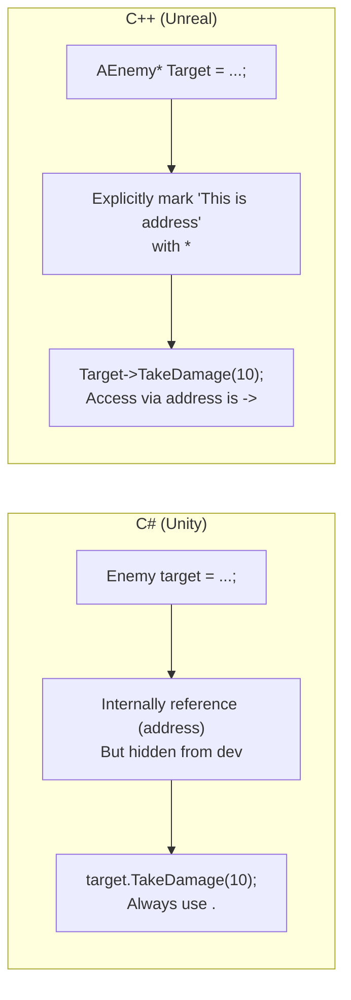
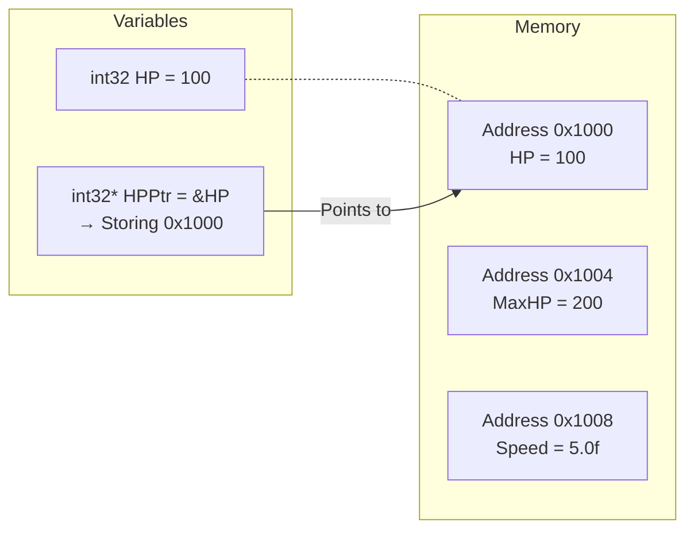
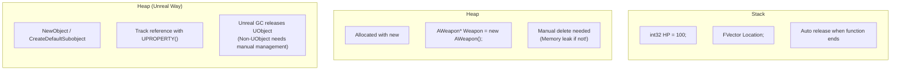
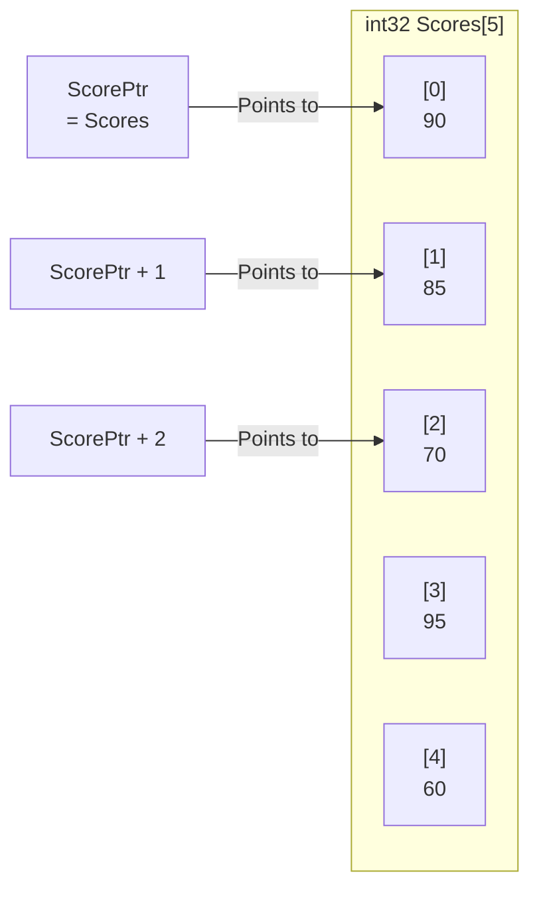
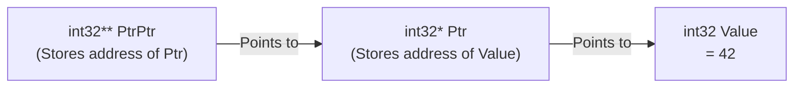
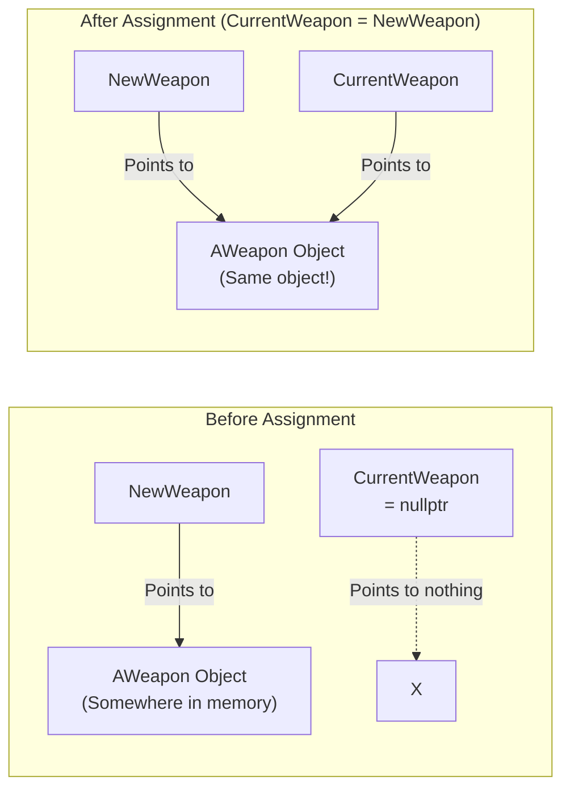

## Can You Read This Code?

When you open code for a character equipping a weapon in an Unreal project, you see something like this.

```cpp
// MyCharacter.cpp
void AMyCharacter::EquipWeapon(AWeapon* NewWeapon)
{
    if (CurrentWeapon != nullptr)
    {
        CurrentWeapon->DetachFromActor(FDetachmentTransformRules::KeepRelativeTransform);
        CurrentWeapon->Destroy();
        CurrentWeapon = nullptr;
    }

    if (NewWeapon)
    {
        CurrentWeapon = NewWeapon;
        CurrentWeapon->AttachToComponent(GetMesh(), FAttachmentTransformRules::SnapToTargetNotIncludingScale, TEXT("WeaponSocket"));
        CurrentWeapon->SetOwner(this);

        float WeaponDamage = CurrentWeapon->GetDamage();
        UE_LOG(LogTemp, Display, TEXT("Weapon equipped! Damage: %f"), WeaponDamage);
    }
}
```

If you are a Unity developer, you might have these questions:

- What is `*` in `AWeapon*`? Why is there an asterisk after the type?
- What is the arrow `->` in `CurrentWeapon->DetachFromActor()`? Instead of `.`?
- What's the difference between `!= nullptr` and `if (NewWeapon)`?
- Is `CurrentWeapon = nullptr;` the same as C#'s `currentWeapon = null;`?
- I saw `this` in C#, but why pass it as `SetOwner(this)` here?

**In this lecture, we solve all these questions.**

---

## Introduction - Why C# Developers Fear Pointers

When referencing another object in Unity, we do this:

```csharp
// C# (Unity)
Enemy targetEnemy = FindObjectOfType<Enemy>();
targetEnemy.TakeDamage(10);  // Access with just .
```

It's so natural. We put an enemy in an `Enemy` type variable and access members with `.`. Actually, did you know that this `targetEnemy` internally stores a **reference** (memory address)?

C# hides this fact. `class` types automatically behave as references (addresses in heap memory), and GC manages memory. Developers don't need to think about memory addresses.

**C++ does not hide this.** It explicitly marks "this variable contains a memory address" with `*`, and uses `->` instead of `.` when accessing members via that address.



| C# (Unity) | C++ (Unreal) | Meaning |
|------------|-------------|------|
| `Enemy target` | `AEnemy* Target` | Variable storing object's **address** |
| `target.Attack()` | `Target->Attack()` | **Access member** via address |
| `target = null` | `Target = nullptr` | **Pointing to nothing** |
| `if (target != null)` | `if (Target != nullptr)` | **Validity check** |
| Automatic (GC) | `UPROPERTY()` + GC (UObject only) | **Memory Management** |

**Core Point**: Using `class` type variables in C# is actually almost the same as pointers in C++. C# wraps it in a package, while C++ shows it raw.

---

## 1. What is a Pointer? - Variable Storing Memory Address

### 1-1. Concept of Memory Address

Computer memory is a huge array numbered by bytes. If a character's HP is `100` in game, this value is stored somewhere in memory, and that location has a unique **address**.



```cpp
int32 HP = 100;        // Variable HP, value is 100
int32* HPPtr = &HP;    // HPPtr is a variable storing the address of HP
```

Two symbols appear here:

| Symbol | Location | Meaning | Example |
|------|------|------|------|
| `*` | After type (Declaration) | "This variable is a **pointer**" (Stores address) | `int32* Ptr` |
| `&` | Before variable (Usage) | "Get **address** of this variable" | `&HP` |
| `*` | Before variable (Usage) | "Get **value** this address points to" (Dereference) | `*Ptr` |

**The same `*` plays two roles.** In declaration, it means "pointer type", and in usage, it means "dereference (extract value)". It's confusing at first but you get used to it quickly.

```cpp
int32 HP = 100;
int32* HPPtr = &HP;      // Declaration: HPPtr is int32 pointer, storing address of HP

*HPPtr = 200;            // Dereference: Change value at place HPPtr points to (=HP) to 200
// At this point HP == 200
```

Comparing with C#:

```csharp
// C# - Imagine code like this (Not actual C# syntax)
int hp = 100;
ref int hpRef = ref hp;   // Concept similar to C# ref
hpRef = 200;              // hp also changes to 200
```

Just as C#'s `ref` "references the original directly," C++ pointers access the original via its memory address.

> **💬 Wait, Let's Know This**
>
> **Q. `int32*`, `int32 *`, `int32 * ptr`, asterisk position is different?**
>
> All three mean the same. `*` position in C++ is a personal/team style choice.
> ```cpp
> int32* ptr;    // Attach to type (Unreal style, recommended)
> int32 *ptr;    // Attach to variable (Traditional C style)
> int32 * ptr;   // Middle (Rarely used)
> ```
> Unreal coding convention uses **attach to type style** (`int32* Ptr`). This series follows this style.
>
> **Q. Does `&` also have two meanings?**
>
> Yes! Meaning of `&` changes by location too:
> ```cpp
> int32* Ptr = &HP;       // & = Address operator ("Get address of HP")
> int32& Ref = HP;        // & = Reference type ("Declare reference variable" after type)
> ```
> Reference (`&`) will be covered in detail in Lecture 4. For now, just remember **`&Variable` = Get Address**.

---

### 1-2. Changing Value via Pointer

This is the most intuitive example of why pointers are needed.

```cpp
void HealPlayer(int32* HealthPtr, int32 Amount)
{
    *HealthPtr += Amount;    // Modify original value by dereferencing
}

// Usage
int32 PlayerHP = 50;
HealPlayer(&PlayerHP, 30);  // Pass address of PlayerHP
// PlayerHP == 80
```

`HealPlayer` function receives **address** of `PlayerHP` and directly modifies the value pointed by that address. It changes the original, not a copy.

To do the same in C#:

```csharp
// C# - Need ref keyword
void HealPlayer(ref int health, int amount)
{
    health += amount;
}

int playerHP = 50;
HealPlayer(ref playerHP, 30);
// playerHP == 80
```

| C# | C++ | Method to Modify Original |
|----|-----|--------------|
| `ref int health` | `int32* HealthPtr` | Access original by reference / pointer |
| `health += amount` | `*HealthPtr += amount` | Modify directly / by dereference |
| `ref playerHP` | `&PlayerHP` | Pass address by `ref` / `&` |

---

## 2. Arrow Operator (->) - The Dot (.) of Pointers

### 2-1. `.` vs `->`

In C#, you always use `.` to access members. In C++, it depends on **whether the variable is a pointer or not**.

```cpp
// Normal variable (Object itself) → Use .
FVector Location;
Location.X = 100.0f;            // Access with .

// Pointer variable (Address) → Use ->
AActor* MyActor = GetOwner();
MyActor->SetActorLocation(Location);  // Access with ->
```

`->` is actually a shorthand for `(*Pointer).Member`.

```cpp
// These two lines mean exactly the same
MyActor->GetActorLocation();     // Arrow operator (Used in practice)
(*MyActor).GetActorLocation();   // Dereference then . access (Nobody uses this)
```

Comparing with C#:

```csharp
// C# (Unity)
GameObject target = FindTarget();
target.SetActive(true);          // Always . (Internally reference but hidden)
```

```cpp
// C++ (Unreal)
AActor* Target = FindTarget();
Target->SetActorHidden(false);   // Pointer so ->
```

**Simple Rule**: If type has `*`, use `->`, otherwise `.`.

```cpp
AEnemy* EnemyPtr;         // Pointer → EnemyPtr->TakeDamage(10)
AEnemy EnemyObj;           // Object itself → EnemyObj.TakeDamage(10)
FVector Location;          // Value type → Location.X = 100
FVector* LocationPtr;      // Pointer → LocationPtr->X = 100
```

| Variable Type | Member Access | Example |
|-----------|----------|------|
| Normal Variable (Object, Struct) | `.` | `Location.X` |
| Pointer Variable (`*`) | `->` | `ActorPtr->Destroy()` |

> **💬 Wait, Let's Know This**
>
> **Q. Which one do we see more in Unreal, `.` or `->`?**
>
> **You see `->` overwhelmingly more.** Because in Unreal, most classes like `AActor`, `UObject`, `UActorComponent` are **handled as pointers**. You only see `.` for F-prefixed structs like `FVector`, `FRotator`, `FString`.
>
> ```cpp
> // Most common pattern in Unreal
> AActor* Owner = GetOwner();           // Pointer
> Owner->GetActorLocation();            // ->
>
> FVector Location = Owner->GetActorLocation();  // FVector is value type
> Location.X += 100.0f;                           // .
> ```

---

## 3. nullptr - C++ Version of null

### 3-1. What is nullptr?

The state where a pointer points to nothing is called `nullptr`. Same concept as C# `null`.

```cpp
AActor* Target = nullptr;   // Points to no actor
```

```csharp
// C# counterpart
GameObject target = null;   // References no object
```

### 3-2. nullptr Check - Essential for Survival

In C#, accessing a null variable throws `NullReferenceException`. Program stops, but shows error message and stack trace.

**In C++, accessing a nullptr pointer crashes the program immediately.** Without friendly error messages. So **you must check if it is nullptr before using a pointer**.

```cpp
// ❌ Dangerous Code - Crash if nullptr!
AActor* Target = FindTarget();
Target->Destroy();  // Crash here if Target is nullptr

// ✅ Safe Code - nullptr Check
AActor* Target = FindTarget();
if (Target != nullptr)
{
    Target->Destroy();  // Execute only if Target is valid
}
```

In C++, pointers can be used like `bool`. `false` if nullptr, `true` if valid address.

```cpp
// These three mean the same
if (Target != nullptr) { ... }   // Explicit comparison
if (Target)            { ... }   // Concise form (Most used in Unreal)
if (Target != 0)       { ... }   // Old style (Do not use)
```

**In Unreal code, you see `if (Target)` form the most.** It feels strange at first but becomes natural quickly.

```cpp
// Unreal Practical Pattern
void AMyCharacter::AttackTarget()
{
    // Most common nullptr check pattern
    if (CurrentTarget)
    {
        CurrentTarget->TakeDamage(AttackDamage);
    }

    // Get component + nullptr check
    UStaticMeshComponent* MeshComp = FindComponentByClass<UStaticMeshComponent>();
    if (MeshComp)
    {
        MeshComp->SetVisibility(false);
    }
}
```

Comparing with C#:

```csharp
// C# (Unity)
void AttackTarget()
{
    if (currentTarget != null)
    {
        currentTarget.TakeDamage(attackDamage);
    }

    var meshRenderer = GetComponent<MeshRenderer>();
    if (meshRenderer != null)
    {
        meshRenderer.enabled = false;
    }
}
```

| C# | C++ | Description |
|----|-----|------|
| `if (target != null)` | `if (Target != nullptr)` | Explicit comparison |
| `if (target != null)` | `if (Target)` | Concise form (More used) |
| `target = null` | `Target = nullptr` | Dereference |
| `NullReferenceException` | **Crash** (Segfault) | Result of null access |

> **💬 Wait, Let's Know This**
>
> **Q. I also see `IsValid()` in Unreal?**
>
> `IsValid()` checks `nullptr` + **if object is pending kill**. Right after `Destroy()` call, object is still in memory but in "pending kill" state. At this time simple `if (Target)` becomes `true` but `IsValid(Target)` returns `false`.
>
> ```cpp
> // Safer check (Unreal specific)
> if (IsValid(Target))
> {
>     Target->DoSomething();
> }
> ```
>
> We cover this in detail in Lecture 9 (Memory Management), but for now remember **`if (pointer)` is basic, `IsValid()` is safer version.**
>
> **Q. Difference between `NULL` and `nullptr`?**
>
> `NULL` is a macro used since C days, actually just integer `0`. `nullptr` is **real null pointer type** introduced in C++11. Since `nullptr` has higher type safety, always use `nullptr`. Unreal code also uses only `nullptr`.

---

## 4. new and delete - Dynamic Memory Allocation

### 4-1. Stack vs Heap

In C#, using `new` creates object in heap, and GC cleans it up. In C++, `new` also allocates in heap, but **you must manually release with `delete`.** Not releasing causes memory leak.



```cpp
// Stack allocation - Automatically disappears when function ends
void SomeFunction()
{
    int32 HP = 100;           // Created in stack
    FVector Location;          // Created in stack
}  // HP, Location auto released here

// Heap allocation (Standard C++) - Must release manually
int32* DynamicHP = new int32(100);    // Created in heap
// ... usage ...
delete DynamicHP;                      // Manual release
DynamicHP = nullptr;                   // Prevent dangling pointer
```

### 4-2. In Unreal, We Don't Use new/delete Directly

**This is the most important point.** In standard C++, you must manage `new`/`delete` yourself, but **in Unreal, we use engine-provided functions, and Unreal GC manages memory.**

```cpp
// ❌ Don't do this in Unreal
AWeapon* Weapon = new AWeapon();   // Never do this!
delete Weapon;                      // This neither!

// ✅ Unreal Way - UObject derived class
// 1. Create Subobject in Constructor
MeshComp = CreateDefaultSubobject<UStaticMeshComponent>(TEXT("Mesh"));

// 2. Create Object at Runtime
AWeapon* Weapon = GetWorld()->SpawnActor<AWeapon>(WeaponClass, SpawnLocation, SpawnRotation);

// 3. Create UObject (If not Actor)
UMyObject* Obj = NewObject<UMyObject>(this);

// UObject memory release? → If reference tracked by UPROPERTY(), Unreal GC manages it
// (Actor lifetime controlled by Destroy(), non-UObject must be managed manually)
```

Comparing with C#:

| Action | C# (Unity) | C++ (Standard) | C++ (Unreal) |
|------|-----------|-----------|-------------|
| Object Creation | `new Enemy()` | `new AEnemy()` | `SpawnActor<AEnemy>()` |
| Add Component | `AddComponent<Rigidbody>()` | - | `CreateDefaultSubobject<T>()` |
| UObject Memory Release | GC Auto | `delete ptr;` | GC Auto if registered with `UPROPERTY()` |
| Actor Lifetime | `Destroy(gameObject)` | `delete ptr;` | `Actor->Destroy()` |
| Non-UObject Release | GC Auto | `delete ptr;` | Manual `delete` or Smart Pointer |

> **💬 Wait, Let's Know This**
>
> **Q. Then why learn new/delete?**
>
> Two reasons:
> 1. For **Non-UObject classes**, you still need `new`/`delete` (or use smart pointers, covered in Lecture 9).
> 2. To **understand how pointers work**. `SpawnActor` internally does memory allocation, and you can't debug if you don't know the principle.
>
> **Q. What is a dangling pointer?**
>
> A pointer pointing to memory that is already released. C# GC prevents this, but in C++ you must care manually.
> ```cpp
> int32* Ptr = new int32(42);
> delete Ptr;          // Memory released
> // Ptr still points to released address! (Dangling pointer)
> // *Ptr = 10;        // Undefined behavior → Crash possible
> Ptr = nullptr;       // ✅ Habit of initializing to nullptr after release!
> ```
>
> In Unreal, initializing pointer to `nullptr` after `Destroy()` is a common pattern for the same reason.

---

## 5. Pointer Arithmetic - Relationship between Arrays and Pointers

This is rarely used directly in Unreal, but good to know for reading C++ code.

In C++, array name is actually **address of the first element**. `+ 1` to a pointer moves to "next element".

```cpp
int32 Scores[] = {90, 85, 70, 95, 60};
int32* ScorePtr = Scores;     // Array name = Address of first element

// Pointer Arithmetic
*ScorePtr          // 90 (First element)
*(ScorePtr + 1)    // 85 (Second element)
*(ScorePtr + 2)    // 70 (Third element)
ScorePtr[3]        // 95 (Array notation possible - actually same meaning)
```



**Unreal uses `TArray` so you rarely use pointer arithmetic directly.** But don't be confused if you see this pattern in low-level code or engine internal code.

```cpp
// Not used like this in Unreal
int32* Ptr = &Scores[0];
for (int32 i = 0; i < 5; i++)
{
    UE_LOG(LogTemp, Display, TEXT("%d"), *(Ptr + i));
}

// Used like this
TArray<int32> ScoreArray = {90, 85, 70, 95, 60};
for (int32 Score : ScoreArray)
{
    UE_LOG(LogTemp, Display, TEXT("%d"), Score);
}
```

---

## 6. Double Pointer - Pointer to Pointer

Double pointer (`**`) is **pointer pointing to a pointer**. Stores "address of a pointer".

```cpp
int32 Value = 42;
int32* Ptr = &Value;     // Address of Value
int32** PtrPtr = &Ptr;   // Address of Ptr (Pointer to Pointer)

**PtrPtr = 100;          // Value changed to 100
```



**Honestly, you rarely use double pointers in Unreal gameplay code.** Maybe in engine internal code or low-level APIs. Just understanding "Pointer is also a variable so we can store its address" is enough.

---

## 7. Dissecting Real Unreal Code - Reading AActor*

Now let's dissect the code we saw at the beginning line by line.

```cpp
void AMyCharacter::EquipWeapon(AWeapon* NewWeapon)
{
    // ① Check if CurrentWeapon is not nullptr (Already have weapon?)
    if (CurrentWeapon != nullptr)
    {
        // ② Detach and destroy existing weapon
        CurrentWeapon->DetachFromActor(FDetachmentTransformRules::KeepRelativeTransform);
        CurrentWeapon->Destroy();
        CurrentWeapon = nullptr;   // ③ Initialize to nullptr after destroy (Prevent dangling)
    }

    // ④ Check if new weapon is valid (Concise nullptr check)
    if (NewWeapon)
    {
        // ⑤ Set new weapon as current weapon
        CurrentWeapon = NewWeapon;

        // ⑥ Call member function via pointer (->)
        CurrentWeapon->AttachToComponent(
            GetMesh(),
            FAttachmentTransformRules::SnapToTargetNotIncludingScale,
            TEXT("WeaponSocket")
        );

        // ⑦ this = pointer to self
        CurrentWeapon->SetOwner(this);

        // ⑧ Get value via pointer and store in normal variable
        float WeaponDamage = CurrentWeapon->GetDamage();
        UE_LOG(LogTemp, Display, TEXT("Weapon equipped! Damage: %f"), WeaponDamage);
    }
}
```

| No. | Code | Pointer Concept |
|------|------|-----------|
| ① | `if (CurrentWeapon != nullptr)` | nullptr check (Explicit) |
| ② | `CurrentWeapon->Destroy()` | Call member function via pointer (`->`) |
| ③ | `CurrentWeapon = nullptr` | Pointer initialization (Prevent dangling) |
| ④ | `if (NewWeapon)` | nullptr check (Concise) |
| ⑤ | `CurrentWeapon = NewWeapon` | Pointer assignment (Address copy) |
| ⑥ | `CurrentWeapon->AttachToComponent(...)` | Call member function via pointer |
| ⑦ | `this` | Pointer pointing to self |
| ⑧ | `CurrentWeapon->GetDamage()` | Get value by pointer → Store in normal variable |

**⑤ is key.** `CurrentWeapon = NewWeapon` is not copying the object. It copies the **address**. Two pointers point to the same weapon object.



This is **exactly the same concept** as assigning reference type variables in C#:

```csharp
// C# - This is actually "Copy Reference (Address)"
currentWeapon = newWeapon;  // Points to same object
```

---

## 8. Common Mistakes & Precautions

### Mistake 1: Using without nullptr Check

```cpp
// ❌ Most common cause of crash
AActor* Target = GetTarget();
Target->Destroy();    // Crash if Target is nullptr!

// ✅ Always check
AActor* Target = GetTarget();
if (Target)
{
    Target->Destroy();
}
```

### Mistake 2: Not Initializing Pointer Declaration

```cpp
// ❌ Uninitialized Pointer - Contains garbage address
AActor* Target;
Target->DoSomething();    // Crash (Access random address)

// ✅ Always initialize to nullptr
AActor* Target = nullptr;
```

### Mistake 3: Confusing `.` and `->`

```cpp
AWeapon* WeaponPtr;

// ❌ Compile error if using . on pointer
WeaponPtr.GetDamage();

// ✅ Pointer uses ->
WeaponPtr->GetDamage();
```

### Mistake 4: Not Cleaning Up Pointer after Destroy()

```cpp
// ❌ Pointer alive after Destroy
CurrentWeapon->Destroy();
// CurrentWeapon still points to address, but object is pending kill
// Problem if accessed next frame

// ✅ Initialize to nullptr after Destroy
CurrentWeapon->Destroy();
CurrentWeapon = nullptr;
```

---

## Summary - Lecture 3 Checklist

After this lecture, you should be able to read the following in Unreal code:

- [ ] Know `AWeapon*` is "AWeapon Pointer Type"
- [ ] Know `*` has different meanings in declaration (pointer type) and usage (dereference)
- [ ] Know `&` is operator to get address of variable
- [ ] Know `->` is member access via pointer (instead of `.`)
- [ ] Know `nullptr` is same as C# `null`
- [ ] Know `if (Ptr)` is same as `if (Ptr != nullptr)`
- [ ] Know Unreal uses `SpawnActor`/`NewObject` instead of `new`/`delete`
- [ ] Know pointer assignment is "Address Copy", not "Object Copy"
- [ ] Know why initialize to `nullptr` after `Destroy()`
- [ ] Know `this` is pointer to self

---

## Next Lecture Preview

**Lecture 4: References and const - Half of Unreal Code is This**

When you open Unreal code, you see patterns like `const FString& Name` or `const TArray<AActor*>& Actors` in almost every function. We will perfectly summarize the world of **Reference (`&`)**, which is similar but different from pointer, and 4 combinations of `const` most used in Unreal.
