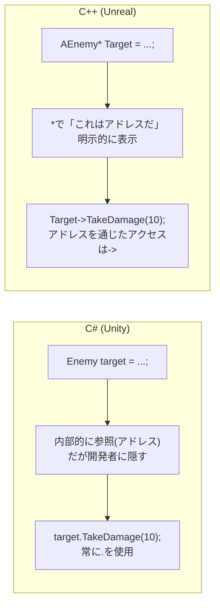
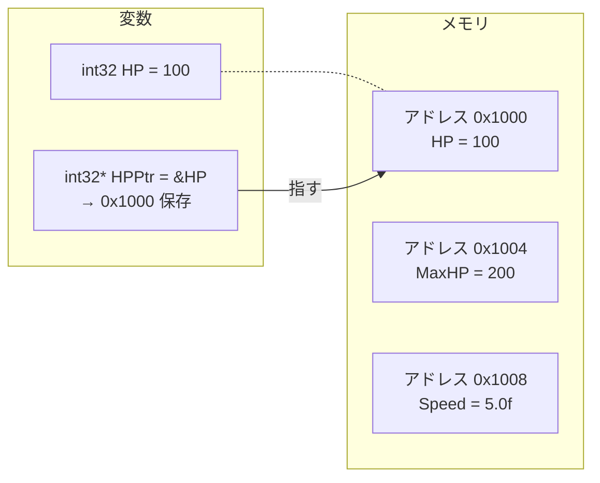
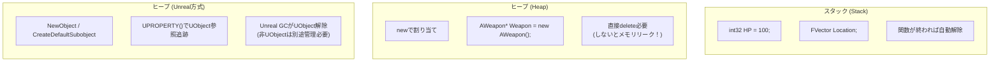
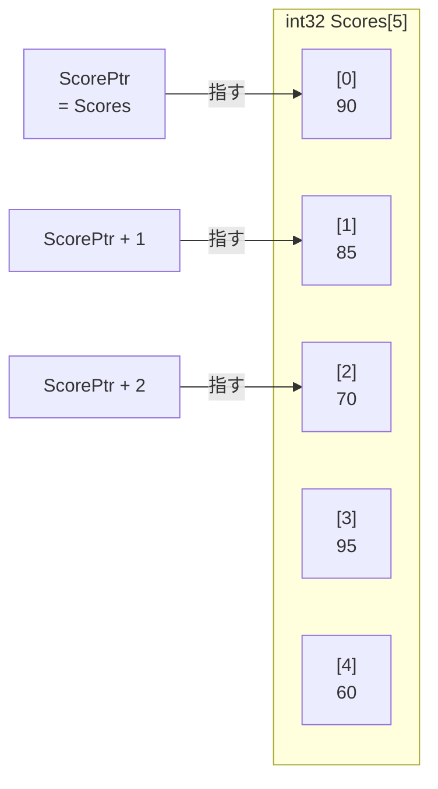
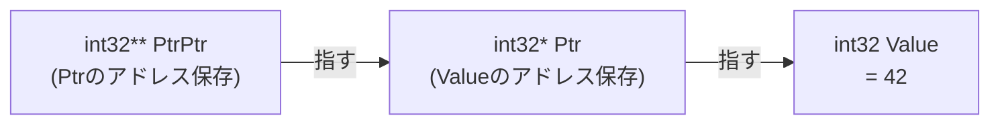
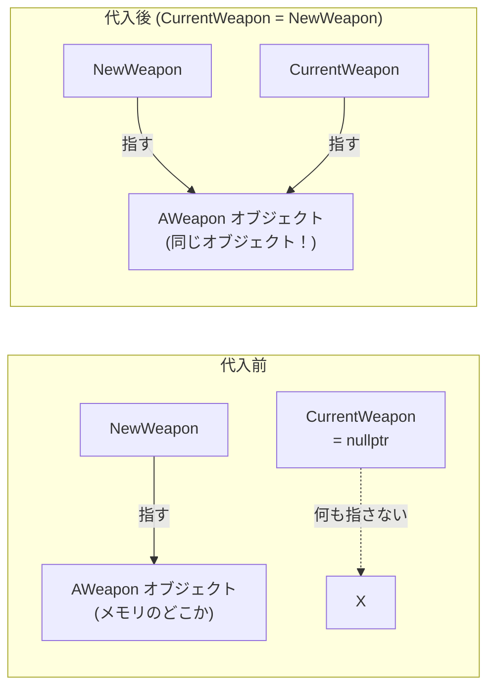

## このコード、読めますか？

Unrealプロジェクトでキャラクターが武器を装備するコードを開くと、こんなのが出てきます。

```cpp
// MyCharacter.cpp
void AMyCharacter::EquipWeapon(AWeapon* NewWeapon)
{
    if (CurrentWeapon != nullptr)
    {
        CurrentWeapon->DetachFromActor(FDetachmentTransformRules::KeepRelativeTransform);
        CurrentWeapon->Destroy();
        CurrentWeapon = nullptr;
    }

    if (NewWeapon)
    {
        CurrentWeapon = NewWeapon;
        CurrentWeapon->AttachToComponent(GetMesh(), FAttachmentTransformRules::SnapToTargetNotIncludingScale, TEXT("WeaponSocket"));
        CurrentWeapon->SetOwner(this);

        float WeaponDamage = CurrentWeapon->GetDamage();
        UE_LOG(LogTemp, Display, TEXT("Weapon equipped! Damage: %f"), WeaponDamage);
    }
}
```

Unity開発者なら、こんな疑問が湧くでしょう：

- `AWeapon*` の `*` は何？ なぜ型の後ろにアスタリスクが付くの？
- `CurrentWeapon->DetachFromActor()` の `->` 矢印は何？ `.` ではなく？
- `!= nullptr` と `if (NewWeapon)` は何が違うの？
- `CurrentWeapon = nullptr;` はC#の `currentWeapon = null;` と同じ？
- `this` はC#でも見たけど、ここではなぜ `SetOwner(this)` の形で渡すの？

**今回の講義でこれらの疑問をすべて解決します。**

---

## 序論 - C#開発者がポインタを恐れる理由

Unityで他のオブジェクトを参照するとき、私たちはこうします：

```csharp
// C# (Unity)
Enemy targetEnemy = FindObjectOfType<Enemy>();
targetEnemy.TakeDamage(10);  // そのまま.でアクセス
```

とても自然です。`Enemy` 型変数に敵を入れ、 `.` でメンバにアクセスします。実はこの `targetEnemy` が内部的には **参照**（メモリアドレス）を保存していること、ご存知ですか？

C#ではこの事実を隠してくれます。`class` 型は自動的に参照（ヒープメモリのアドレス）として動作し、GCがメモリを管理するからです。開発者はメモリアドレスについて考える必要がありません。

**C++はこれを隠しません。** 「この変数はメモリアドレスを入れている」ということを `*` で明示的に表示し、そのアドレスを通じてメンバにアクセスするときは `.` の代わりに `->` を使用します。



| C# (Unity) | C++ (Unreal) | 意味 |
|------------|-------------|------|
| `Enemy target` | `AEnemy* Target` | オブジェクトの **アドレス** を保存する変数 |
| `target.Attack()` | `Target->Attack()` | アドレスを通じて **メンバにアクセス** |
| `target = null` | `Target = nullptr` | **何も指していない** |
| `if (target != null)` | `if (Target != nullptr)` | **有効性検査** |
| 自動 (GC) | `UPROPERTY()` + GC (UObject限定) | **メモリ管理** |

**核心**: C#で `class` 型変数を使うことが、実はC++のポインタとほぼ同じなのです。C#が包装紙で包んでくれたものを、C++は生のまま見せているだけです。

---

## 1. ポインタとは？ - メモリアドレスを格納する変数

### 1-1. メモリアドレスの概念

コンピュータメモリはバイト単位で番号が振られた巨大な配列です。ゲームでキャラクターのHPが `100` なら、この値はメモリのどこかに保存されており、その位置には固有の **アドレス(address)** があります。



```cpp
int32 HP = 100;        // HPという変数、値は100
int32* HPPtr = &HP;    // HPPtrはHPのメモリアドレスを保存する変数
```

ここで二つの記号が出てきます：

| 記号 | 位置 | 意味 | 例 |
|------|------|------|------|
| `*` | 型の後ろ (宣言時) | 「この変数は **ポインタ** だ」 (アドレスを保存する) | `int32* Ptr` |
| `&` | 変数の前 (使用時) | 「この変数の **アドレス** を求めろ」 | `&HP` |
| `*` | 変数の前 (使用時) | 「このアドレスが指す **値** を求めろ」 (逆参照) | `*Ptr` |

**同じ `*` が二つの役割** をします。宣言するときは「ポインタ型」を意味し、使うときは「逆参照（値を取り出す）」を意味します。最初は紛らわしいですがすぐに慣れます。

```cpp
int32 HP = 100;
int32* HPPtr = &HP;      // 宣言: HPPtrはint32ポインタ、HPのアドレスを保存

*HPPtr = 200;            // 逆参照: HPPtrが指す場所(=HP)の値を200に変更
// この時点で HP == 200
```

C#と比較すると：

```csharp
// C# - こんなコードがあると想像してみましょう (実際のC#文法ではない)
int hp = 100;
ref int hpRef = ref hp;   // C#のrefと似た概念
hpRef = 200;              // hpも200に変更される
```

C#の `ref` が「原本を直接参照」するように、C++のポインタも原本のメモリアドレスを通じて原本にアクセスします。

> **💬 ちょっと一言、これだけは知っておこう**
>
> **Q. `int32*` と `int32 *` と `int32 * ptr`、アスタリスクの位置が違いますが？**
>
> 3つとも同じ意味です。C++で `*` の位置は個人/チームのスタイルの違いです。
> ```cpp
> int32* ptr;    // 型に付ける (Unrealスタイル、推奨)
> int32 *ptr;    // 変数に付ける (伝統的Cスタイル)
> int32 * ptr;   // 真ん中 (あまり使わない)
> ```
> Unrealコーディング規則では **型に付けるスタイル** (`int32* Ptr`) を使用します。このシリーズでもこのスタイルに従います。
>
> **Q. `&` も二つの意味がありますか？**
>
> はい！ `&` も位置によって意味が変わります：
> ```cpp
> int32* Ptr = &HP;       // & = アドレス演算子 (「HPのアドレスを求めろ」)
> int32& Ref = HP;        // & = 参照型 (型の後ろで「参照変数宣言」)
> ```
> 参照(`&`)は第4講で詳しく扱います。今は **`&変数` = アドレス取得** だけ覚えてください。

---

### 1-2. ポインタを通じた値変更

ポインタがなぜ必要か最も直感的な例です。

```cpp
void HealPlayer(int32* HealthPtr, int32 Amount)
{
    *HealthPtr += Amount;    // 逆参照で原本の値を変更
}

// 使用
int32 PlayerHP = 50;
HealPlayer(&PlayerHP, 30);  // PlayerHPのアドレスを渡す
// PlayerHP == 80
```

`HealPlayer` 関数は `PlayerHP` の **アドレス** を受け取り、そのアドレスが指す値を直接修正します。コピーではなく原本を変更するのです。

C#で同じことをするには：

```csharp
// C# - refキーワード必要
void HealPlayer(ref int health, int amount)
{
    health += amount;
}

int playerHP = 50;
HealPlayer(ref playerHP, 30);
// playerHP == 80
```

| C# | C++ | 原本変更方法 |
|----|-----|--------------|
| `ref int health` | `int32* HealthPtr` | 参照 / ポインタで原本アクセス |
| `health += amount` | `*HealthPtr += amount` | 直接 / 逆参照で修正 |
| `ref playerHP` | `&PlayerHP` | `ref` / `&` でアドレス渡し |

---

## 2. アロー演算子 (->) - ポインタのドット(.)

### 2-1. `.` vs `->`

C#ではメンバにアクセスするとき常に `.` を使います。C++では **変数がポインタか否か** によって変わります。

```cpp
// 一般変数 (オブジェクト自体) → . 使用
FVector Location;
Location.X = 100.0f;            // .でアクセス

// ポインタ変数 (アドレス) → -> 使用
AActor* MyActor = GetOwner();
MyActor->SetActorLocation(Location);  // ->でアクセス
```

`->` は実は `(*ポインタ).メンバ` の短縮形です。

```cpp
// この二行は完全に同じ意味
MyActor->GetActorLocation();     // アロー演算子 (実務で使用)
(*MyActor).GetActorLocation();   // 逆参照後 . アクセス (誰も使わない)
```

C#と比較すると：

```csharp
// C# (Unity)
GameObject target = FindTarget();
target.SetActive(true);          // 常に . (内部的には参照だが隠されている)
```

```cpp
// C++ (Unreal)
AActor* Target = FindTarget();
Target->SetActorHidden(false);   // ポインタだから ->
```

**簡単なルール**: `*` が付いた型なら `->`、そうでなければ `.`

```cpp
AEnemy* EnemyPtr;         // ポインタ → EnemyPtr->TakeDamage(10)
AEnemy EnemyObj;           // オブジェクト自体 → EnemyObj.TakeDamage(10)
FVector Location;          // 値型 → Location.X = 100
FVector* LocationPtr;      // ポインタ → LocationPtr->X = 100
```

| 変数型 | メンバアクセス | 例 |
|-----------|----------|------|
| 一般変数 (オブジェクト、構造体) | `.` | `Location.X` |
| ポインタ変数 (`*`) | `->` | `ActorPtr->Destroy()` |

> **💬 ちょっと一言、これだけは知っておこう**
>
> **Q. Unrealでは `.` と `->` どちらを多く見ますか？**
>
> **`->` を圧倒的に多く見ます。** Unrealで `AActor`、`UObject`、`UActorComponent` などほとんどのクラスは **ポインタとして扱う** からです。`FVector`、`FRotator`、`FString` のようなF接頭辞構造体でのみ `.` を見ます。
>
> ```cpp
> // Unrealで最も一般的なパターン
> AActor* Owner = GetOwner();           // ポインタ
> Owner->GetActorLocation();            // ->
>
> FVector Location = Owner->GetActorLocation();  // FVectorは値型
> Location.X += 100.0f;                           // .
> ```

---

## 3. nullptr - nullのC++バージョン

### 3-1. nullptrとは？

ポインタが何も指していない状態を `nullptr` といいます。C#の `null` と同じ概念です。

```cpp
AActor* Target = nullptr;   // 何のアクターも指していない
```

```csharp
// C# 対応
GameObject target = null;   // 何のオブジェクトも参照していない
```

### 3-2. nullptrチェック - 生存の基本

C#でnullの変数にアクセスすると `NullReferenceException` が発生します。プログラムが止まりますが、エラーメッセージとスタックトレースを見せてくれます。

**C++でnullptrなポインタにアクセスするとプログラムが即座にクラッシュします。** 親切なエラーメッセージなしにです。だから **ポインタを使う前に必ずnullptrかどうか確認** しなければなりません。

```cpp
// ❌ 危険なコード - nullptrならクラッシュ！
AActor* Target = FindTarget();
Target->Destroy();  // Targetがnullptrならここでクラッシュ

// ✅ 安全なコード - nullptrチェック
AActor* Target = FindTarget();
if (Target != nullptr)
{
    Target->Destroy();  // Targetが有効なときだけ実行
}
```

C++ではポインタを `bool` のように使えます。nullptrなら `false`、有効なアドレスなら `true` です。

```cpp
// この三つはすべて同じ意味
if (Target != nullptr) { ... }   // 明示的比較
if (Target)            { ... }   // 簡潔な形 (Unrealで最も多く使用)
if (Target != 0)       { ... }   // 古いスタイル (使わないでください)
```

**Unrealコードでは `if (Target)` の形を最もよく見ます。** 最初は不慣れですがすぐに自然になります。

```cpp
// Unreal実戦パターン
void AMyCharacter::AttackTarget()
{
    // 最も一般的なnullptrチェックパターン
    if (CurrentTarget)
    {
        CurrentTarget->TakeDamage(AttackDamage);
    }

    // コンポーネント取得 + nullptrチェック
    UStaticMeshComponent* MeshComp = FindComponentByClass<UStaticMeshComponent>();
    if (MeshComp)
    {
        MeshComp->SetVisibility(false);
    }
}
```

C#と比較すると：

```csharp
// C# (Unity)
void AttackTarget()
{
    if (currentTarget != null)
    {
        currentTarget.TakeDamage(attackDamage);
    }

    var meshRenderer = GetComponent<MeshRenderer>();
    if (meshRenderer != null)
    {
        meshRenderer.enabled = false;
    }
}
```

| C# | C++ | 説明 |
|----|-----|------|
| `if (target != null)` | `if (Target != nullptr)` | 明示的比較 |
| `if (target != null)` | `if (Target)` | 簡潔な形 (より多く使用) |
| `target = null` | `Target = nullptr` | 参照解除 |
| `NullReferenceException` | **クラッシュ** (セグフォ) | nullアクセスの結果 |

> **💬 ちょっと一言、これだけは知っておこう**
>
> **Q. Unrealで `IsValid()` というのも見かけますが？**
>
> `IsValid()` は `nullptr` チェック + **すでに破壊待機中のオブジェクトかどうか** まで確認します。`Destroy()` を呼び出した直後、オブジェクトはまだメモリにありますが「破壊待機」状態です。このとき単純な `if (Target)` は `true` になりますが `IsValid(Target)` は `false` を返します。
>
> ```cpp
> // より安全な検査 (Unreal専用)
> if (IsValid(Target))
> {
>     Target->DoSomething();
> }
> ```
>
> 後で第9講（メモリ管理）で詳しく扱いますが、今は **`if (ポインタ)` が基本、`IsValid()` がより安全なバージョン** だと覚えてください。
>
> **Q. `NULL` と `nullptr` は何が違いますか？**
>
> `NULL` はC時代から使っていたマクロで、実はただの整数 `0` です。`nullptr` はC++11で導入された **本物のnullポインタ型** です。`nullptr` の方が型安全性が高いので常に `nullptr` を使用してください。Unrealコードでも `nullptr` だけ使用します。

---

## 4. newとdelete - 動的メモリ割り当て

### 4-1. スタック vs ヒープ

C#では `new` を使うとヒープ(heap)にオブジェクトが生成され、GCが勝手に整理します。C++でも `new` でヒープに割り当てますが、**`delete` で直接解除しなければなりません。** 解除しないとメモリリーク(memory leak)が発生します。



```cpp
// スタック割り当て - 関数が終われば自動的に消える
void SomeFunction()
{
    int32 HP = 100;           // スタックに生成
    FVector Location;          // スタックに生成
}  // ここでHP, Location自動解除

// ヒープ割り当て (標準C++) - 直接解除が必要
int32* DynamicHP = new int32(100);    // ヒープに生成
// ... 使用 ...
delete DynamicHP;                      // 直接解除
DynamicHP = nullptr;                   // ダングリングポインタ防止
```

### 4-2. Unrealではnew/deleteを直接使わない

**これが最も重要なポイントです。** 標準C++では `new`/`delete` を直接管理する必要がありますが、**Unrealではエンジンが提供する関数を使い、Unreal GCがメモリを管理します。**

```cpp
// ❌ Unrealでこうしてはいけません
AWeapon* Weapon = new AWeapon();   // 絶対にやらないでください！
delete Weapon;                      // これもダメです！

// ✅ Unreal方式 - UObject派生クラス
// 1. コンストラクタでサブオブジェクト生成
MeshComp = CreateDefaultSubobject<UStaticMeshComponent>(TEXT("Mesh"));

// 2. ランタイムにオブジェクト生成
AWeapon* Weapon = GetWorld()->SpawnActor<AWeapon>(WeaponClass, SpawnLocation, SpawnRotation);

// 3. UObject生成 (Actorでない場合)
UMyObject* Obj = NewObject<UMyObject>(this);

// UObjectメモリ解除？ → UPROPERTY()で参照を追跡すればUnreal GCが管理します
// (Actor寿命はDestroy()で制御し、非UObjectは直接管理する必要があります)
```

C#と比較すると：

| 作業 | C# (Unity) | C++ (標準) | C++ (Unreal) |
|------|-----------|-----------|-------------|
| オブジェクト生成 | `new Enemy()` | `new AEnemy()` | `SpawnActor<AEnemy>()` |
| コンポーネント追加 | `AddComponent<Rigidbody>()` | - | `CreateDefaultSubobject<T>()` |
| UObjectメモリ解除 | GC自動 | `delete ptr;` | `UPROPERTY()` 登録時GC自動 |
| Actor寿命管理 | `Destroy(gameObject)` | `delete ptr;` | `Actor->Destroy()` |
| 非UObjectメモリ解除 | GC自動 | `delete ptr;` | 手動 `delete` またはスマートポインタ |

> **💬 ちょっと一言、これだけは知っておこう**
>
> **Q. それならnew/deleteはなぜ学ぶのですか？**
>
> 二つの理由です：
> 1. **非UObjectクラス** では依然として `new`/`delete` が必要です（またはスマートポインタを使います。第9講で扱います）。
> 2. **ポインタの動作原理を理解** するためです。`SpawnActor` が内部的にしていることがメモリ割り当てであり、原理を知らなければバグを直せません。
>
> **Q. ダングリングポインタ(dangling pointer)とは何ですか？**
>
> すでに解除されたメモリを指しているポインタです。C#ではGCがこういう状況を防ぎますが、C++では直接気をつける必要があります。
> ```cpp
> int32* Ptr = new int32(42);
> delete Ptr;          // メモリ解除済み
> // Ptrは依然として解除されたアドレスを指している！ (ダングリングポインタ)
> // *Ptr = 10;        // 定義されていない動作 → クラッシュ可能性
> Ptr = nullptr;       // ✅ 解除後nullptrで初期化する習慣！
> ```
>
> Unrealでも `Destroy()` 後にポインタを `nullptr` で初期化するパターンをよく見ますが、同じ理由です。

---

## 5. ポインタ演算 - 配列とポインタの関係

この内容はUnrealで直接使うことはほぼありませんが、C++コードを読むときたまに出くわすので知っておくと良いです。

C++で配列名は実は **最初の要素のアドレス** です。ポインタに `+ 1` をすると「次の要素」に移動します。

```cpp
int32 Scores[] = {90, 85, 70, 95, 60};
int32* ScorePtr = Scores;     // 配列名 = 最初の要素のアドレス

// ポインタ演算
*ScorePtr          // 90 (最初の要素)
*(ScorePtr + 1)    // 85 (2番目の要素)
*(ScorePtr + 2)    // 70 (3番目の要素)
ScorePtr[3]        // 95 (配列表記法も可能 - 実は同じ意味)
```



**Unrealでは `TArray` を使うのでポインタ演算を直接使うことはほぼありません。** しかしローレベルコードやエンジン内部コードを読むときこのパターンが出てきても驚かないでください。

```cpp
// Unrealではこう書かず
int32* Ptr = &Scores[0];
for (int32 i = 0; i < 5; i++)
{
    UE_LOG(LogTemp, Display, TEXT("%d"), *(Ptr + i));
}

// こう書きます
TArray<int32> ScoreArray = {90, 85, 70, 95, 60};
for (int32 Score : ScoreArray)
{
    UE_LOG(LogTemp, Display, TEXT("%d"), Score);
}
```

---

## 6. ダブルポインタ - ポインタのポインタ

ダブルポインタ（`**`）は **ポインタを指すポインタ** です。「ポインタのアドレス」を保存します。

```cpp
int32 Value = 42;
int32* Ptr = &Value;     // Valueのアドレス
int32** PtrPtr = &Ptr;   // Ptrのアドレス (ポインタのポインタ)

**PtrPtr = 100;          // Valueが100に変更される
```



**正直Unrealゲームプレイコードでダブルポインタを使うことはほぼありません。** エンジン内部コードやローレベルAPIでたまに見える程度です。「ポインタも変数だからそれのアドレスを保存できる」程度に理解すれば十分です。

---

## 7. Unreal実戦コード解剖 - AActor* 読み解き

さて、最初に見たコードをもう一度一行ずつ解剖してみましょう。

```cpp
void AMyCharacter::EquipWeapon(AWeapon* NewWeapon)
{
    // ① CurrentWeaponがnullptrでないか確認 (すでに武器があるか)
    if (CurrentWeapon != nullptr)
    {
        // ② 既存武器を分離して破壊
        CurrentWeapon->DetachFromActor(FDetachmentTransformRules::KeepRelativeTransform);
        CurrentWeapon->Destroy();
        CurrentWeapon = nullptr;   // ③ 破壊後nullptr初期化 (ダングリング防止)
    }

    // ④ 新しい武器が有効か確認 (簡潔なnullptrチェック)
    if (NewWeapon)
    {
        // ⑤ 新しい武器を現在の武器に設定
        CurrentWeapon = NewWeapon;

        // ⑥ ポインタを通じてメンバ関数呼び出し (->)
        CurrentWeapon->AttachToComponent(
            GetMesh(),
            FAttachmentTransformRules::SnapToTargetNotIncludingScale,
            TEXT("WeaponSocket")
        );

        // ⑦ this = 自分自身を指すポインタ
        CurrentWeapon->SetOwner(this);

        // ⑧ ポインタを通じて値を持ってきて一般変数に保存
        float WeaponDamage = CurrentWeapon->GetDamage();
        UE_LOG(LogTemp, Display, TEXT("Weapon equipped! Damage: %f"), WeaponDamage);
    }
}
```

| 番号 | コード | ポインタ概念 |
|------|------|-----------|
| ① | `if (CurrentWeapon != nullptr)` | nullptrチェック (明示的) |
| ② | `CurrentWeapon->Destroy()` | ポインタを通じたメンバ関数呼び出し (`->`) |
| ③ | `CurrentWeapon = nullptr` | ポインタ初期化 (ダングリング防止) |
| ④ | `if (NewWeapon)` | nullptrチェック (簡潔) |
| ⑤ | `CurrentWeapon = NewWeapon` | ポインタ代入 (アドレスコピー) |
| ⑥ | `CurrentWeapon->AttachToComponent(...)` | ポインタを通じたメンバ関数呼び出し |
| ⑦ | `this` | 自分自身を指すポインタ |
| ⑧ | `CurrentWeapon->GetDamage()` | ポインタで値を取得 → 一般変数に保存 |

**⑤番が核心です。** `CurrentWeapon = NewWeapon` はオブジェクトをコピーするわけではありません。**アドレスをコピー** するのです。二つのポインタが同じ武器オブジェクトを指すことになります。



これはC#で参照型変数を代入することと **完全に同じ概念** です：

```csharp
// C# - これも実は「参照(アドレス)コピー」
currentWeapon = newWeapon;  // 同じオブジェクトを指す
```

---

## 8. よくある間違い & 注意事項

### 間違い 1: nullptrチェックなしで使用

```cpp
// ❌ 最もよくあるクラッシュ原因
AActor* Target = GetTarget();
Target->Destroy();    // Targetがnullptrならクラッシュ！

// ✅ 常にチェック
AActor* Target = GetTarget();
if (Target)
{
    Target->Destroy();
}
```

### 間違い 2: ポインタ宣言時に初期化しない

```cpp
// ❌ 初期化されていないポインタ - ゴミアドレスが入っている
AActor* Target;
Target->DoSomething();    // クラッシュ (ランダムアドレスアクセス)

// ✅ 常にnullptrで初期化
AActor* Target = nullptr;
```

### 間違い 3: `.` と `->` の混同

```cpp
AWeapon* WeaponPtr;

// ❌ ポインタに.を使うとコンパイルエラー
WeaponPtr.GetDamage();

// ✅ ポインタは ->
WeaponPtr->GetDamage();
```

### 間違い 4: Destroy() 後にポインタ整理しない

```cpp
// ❌ Destroy後ポインタが生きている
CurrentWeapon->Destroy();
// CurrentWeaponは依然としてアドレスを指しているが、オブジェクトは破壊予定
// 次のフレームでアクセスすると問題発生

// ✅ Destroy後nullptr初期化
CurrentWeapon->Destroy();
CurrentWeapon = nullptr;
```

---

## まとめ - 第3講チェックリスト

この講義を終えると、Unrealコードで以下を読めるようになっているはずです：

- [ ] `AWeapon*` が「AWeaponポインタ型」であることを知っている
- [ ] `*` が宣言時（ポインタ型）と使用時（逆参照）で違う意味であることを知っている
- [ ] `&` が変数のアドレスを求める演算子であることを知っている
- [ ] `->` がポインタを通じたメンバアクセスであることを知っている (`.` の代わり)
- [ ] `nullptr` がC#の `null` と同じであることを知っている
- [ ] `if (Ptr)` が `if (Ptr != nullptr)` と同じであることを知っている
- [ ] Unrealでは `new`/`delete` の代わりに `SpawnActor`/`NewObject` を使うことを知っている
- [ ] ポインタ代入が「アドレスコピー」であり「オブジェクトコピー」ではないことを知っている
- [ ] `Destroy()` 後に `nullptr` で初期化する理由を知っている
- [ ] `this` が自分自身のポインタであることを知っている

---

## 次回予告

**第4講：参照とconst - Unrealコードの半分はこれ**

Unrealコードを開くとほぼすべての関数に `const FString& Name` や `const TArray<AActor*>& Actors` のようなパターンが見えます。ポインタと似ているけど違う **参照(`&`)** の世界、そしてUnrealで最も多く使われる `const` の4つの組み合わせを完璧に整理します。
