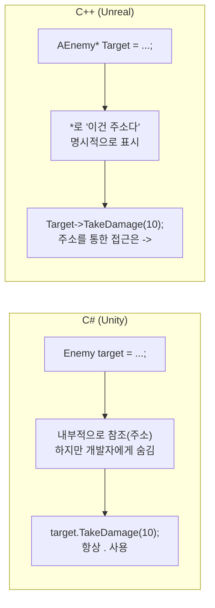
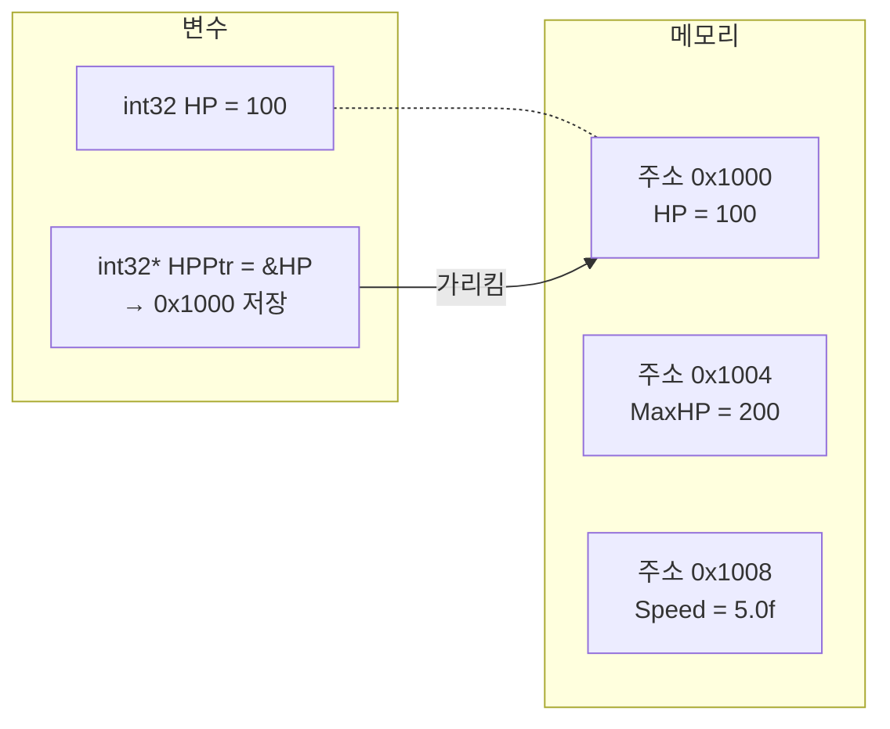
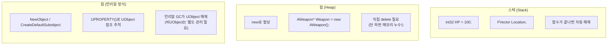
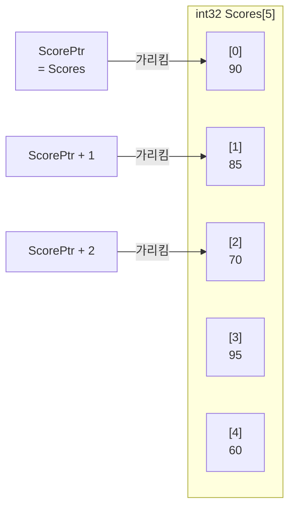
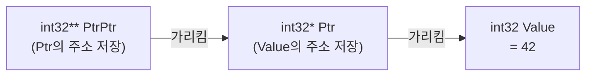
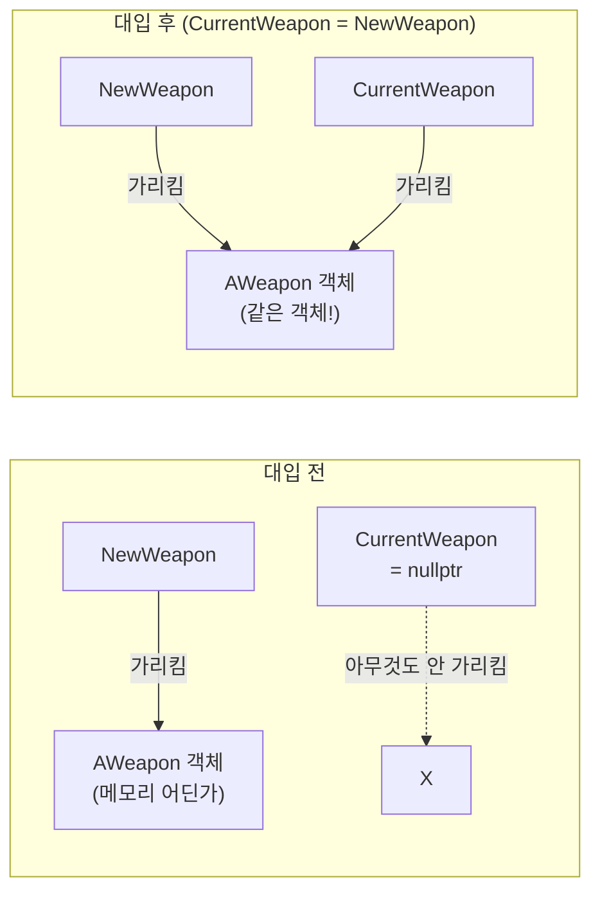

## 이 코드, 읽을 수 있나요?

언리얼 프로젝트에서 캐릭터가 무기를 장착하는 코드를 열어보면 이런 게 나옵니다.

```cpp
// MyCharacter.cpp
void AMyCharacter::EquipWeapon(AWeapon* NewWeapon)
{
    if (CurrentWeapon != nullptr)
    {
        CurrentWeapon->DetachFromActor(FDetachmentTransformRules::KeepRelativeTransform);
        CurrentWeapon->Destroy();
        CurrentWeapon = nullptr;
    }

    if (NewWeapon)
    {
        CurrentWeapon = NewWeapon;
        CurrentWeapon->AttachToComponent(GetMesh(), FAttachmentTransformRules::SnapToTargetNotIncludingScale, TEXT("WeaponSocket"));
        CurrentWeapon->SetOwner(this);

        float WeaponDamage = CurrentWeapon->GetDamage();
        UE_LOG(LogTemp, Display, TEXT("Weapon equipped! Damage: %f"), WeaponDamage);
    }
}
```

유니티 개발자라면 이런 의문이 듭니다:

- `AWeapon*`에서 `*`는 뭐지? 왜 타입 뒤에 별표가 붙어?
- `CurrentWeapon->DetachFromActor()`에서 `->` 화살표는 뭐지? `.`이 아니라?
- `!= nullptr`이랑 `if (NewWeapon)`이랑 뭐가 다른 거지?
- `CurrentWeapon = nullptr;`은 C#의 `currentWeapon = null;`과 같은 건가?
- `this`는 C#에서도 봤는데, 여기서는 왜 `SetOwner(this)` 형태로 전달하지?

**이번 강에서 이 모든 의문을 해결합니다.**

---

## 서론 - C# 개발자가 포인터를 두려워하는 이유

유니티에서 다른 오브젝트를 참조할 때, 우리는 이렇게 합니다:

```csharp
// C# (Unity)
Enemy targetEnemy = FindObjectOfType<Enemy>();
targetEnemy.TakeDamage(10);  // 그냥 .으로 접근
```

너무나 자연스럽습니다. `Enemy` 타입 변수에 적을 담고, `.`으로 멤버에 접근합니다. 사실 이 `targetEnemy`가 내부적으로는 **참조**(메모리 주소)를 저장하고 있다는 것, 알고 계신가요?

C#에서는 이 사실을 숨겨줍니다. `class` 타입은 자동으로 참조(힙 메모리의 주소)로 동작하고, GC가 메모리를 관리하니까요. 개발자는 메모리 주소에 대해 생각할 필요가 없습니다.

**C++은 이걸 숨기지 않습니다.** "이 변수는 메모리 주소를 담고 있다"는 것을 `*`로 명시적으로 표시하고, 그 주소를 통해 멤버에 접근할 때는 `.` 대신 `->`를 사용합니다.



| C# (Unity) | C++ (Unreal) | 의미 |
|------------|-------------|------|
| `Enemy target` | `AEnemy* Target` | 객체의 **주소**를 저장하는 변수 |
| `target.Attack()` | `Target->Attack()` | 주소를 통해 **멤버에 접근** |
| `target = null` | `Target = nullptr` | **아무것도 가리키지 않음** |
| `if (target != null)` | `if (Target != nullptr)` | **유효성 검사** |
| 자동 (GC) | `UPROPERTY()` + GC (UObject 한정) | **메모리 관리** |

**핵심**: C#에서 `class` 타입 변수를 사용하는 것이 사실 C++의 포인터와 거의 같은 겁니다. C#이 포장지로 감싸준 것을 C++은 날것 그대로 보여줄 뿐입니다.

---

## 1. 포인터란? - 메모리 주소를 담는 변수

### 1-1. 메모리 주소의 개념

컴퓨터 메모리는 바이트 단위로 번호가 매겨진 거대한 배열입니다. 게임에서 캐릭터의 HP가 `100`이라면, 이 값은 메모리의 어딘가에 저장되어 있고, 그 위치에는 고유한 **주소(address)**가 있습니다.



```cpp
int32 HP = 100;        // HP라는 변수, 값은 100
int32* HPPtr = &HP;    // HPPtr은 HP의 메모리 주소를 저장하는 변수
```

여기서 두 가지 기호가 나옵니다:

| 기호 | 위치 | 의미 | 예시 |
|------|------|------|------|
| `*` | 타입 뒤 (선언 시) | "이 변수는 **포인터**다" (주소를 저장한다) | `int32* Ptr` |
| `&` | 변수 앞 (사용 시) | "이 변수의 **주소**를 구해라" | `&HP` |
| `*` | 변수 앞 (사용 시) | "이 주소가 가리키는 **값**을 구해라" (역참조) | `*Ptr` |

**같은 `*`가 두 가지 역할**을 합니다. 선언할 때는 "포인터 타입"을 의미하고, 사용할 때는 "역참조(값 꺼내기)"를 의미합니다. 처음엔 헷갈리지만 금방 익숙해집니다.

```cpp
int32 HP = 100;
int32* HPPtr = &HP;      // 선언: HPPtr은 int32 포인터, HP의 주소를 저장

*HPPtr = 200;            // 역참조: HPPtr이 가리키는 곳(=HP)의 값을 200으로 변경
// 이 시점에서 HP == 200
```

C#과 비교하면:

```csharp
// C# - 이런 코드가 있다고 상상해봅시다 (실제 C# 문법은 아님)
int hp = 100;
ref int hpRef = ref hp;   // C#의 ref와 비슷한 개념
hpRef = 200;              // hp도 200으로 변경됨
```

C#의 `ref`가 "원본을 직접 참조"하는 것처럼, C++의 포인터도 원본의 메모리 주소를 통해 원본에 접근합니다.

> **💬 잠깐, 이건 알고 가자**
>
> **Q. `int32*`와 `int32 *`와 `int32 * ptr`, 별표 위치가 다른데?**
>
> 셋 다 같은 의미입니다. C++에서 `*`의 위치는 개인/팀 스타일 차이입니다.
> ```cpp
> int32* ptr;    // 타입에 붙이기 (언리얼 스타일, 추천)
> int32 *ptr;    // 변수에 붙이기 (전통 C 스타일)
> int32 * ptr;   // 가운데 (잘 안 씀)
> ```
> 언리얼 코딩 컨벤션에서는 **타입에 붙이는 스타일** (`int32* Ptr`)을 사용합니다. 이 시리즈에서도 이 스타일을 따릅니다.
>
> **Q. `&`도 두 가지 의미가 있나요?**
>
> 네! `&`도 위치에 따라 의미가 달라집니다:
> ```cpp
> int32* Ptr = &HP;       // & = 주소 연산자 ("HP의 주소를 구해라")
> int32& Ref = HP;        // & = 참조 타입 (타입 뒤에서 "참조 변수 선언")
> ```
> 참조(`&`)는 4강에서 자세히 다루겠습니다. 지금은 **`&변수` = 주소 구하기**만 기억하세요.

---

### 1-2. 포인터를 통한 값 변경

포인터가 왜 필요한지 가장 직관적인 예시입니다.

```cpp
void HealPlayer(int32* HealthPtr, int32 Amount)
{
    *HealthPtr += Amount;    // 역참조로 원본 값 변경
}

// 사용
int32 PlayerHP = 50;
HealPlayer(&PlayerHP, 30);  // PlayerHP의 주소를 전달
// PlayerHP == 80
```

`HealPlayer` 함수는 `PlayerHP`의 **주소**를 받아서, 그 주소가 가리키는 값을 직접 수정합니다. 복사본이 아니라 원본을 변경하는 것입니다.

C#에서 같은 일을 하려면:

```csharp
// C# - ref 키워드 필요
void HealPlayer(ref int health, int amount)
{
    health += amount;
}

int playerHP = 50;
HealPlayer(ref playerHP, 30);
// playerHP == 80
```

| C# | C++ | 원본 변경 방법 |
|----|-----|--------------|
| `ref int health` | `int32* HealthPtr` | 참조 / 포인터로 원본 접근 |
| `health += amount` | `*HealthPtr += amount` | 직접 / 역참조로 수정 |
| `ref playerHP` | `&PlayerHP` | `ref` / `&` 로 주소 전달 |

---

## 2. 화살표 연산자 (->) - 포인터의 점(.)

### 2-1. `.` vs `->`

C#에서는 멤버에 접근할 때 항상 `.`을 사용합니다. C++에서는 **변수가 포인터인지 아닌지**에 따라 달라집니다.

```cpp
// 일반 변수 (객체 자체) → . 사용
FVector Location;
Location.X = 100.0f;            // .으로 접근

// 포인터 변수 (주소) → -> 사용
AActor* MyActor = GetOwner();
MyActor->SetActorLocation(Location);  // ->로 접근
```

`->`는 사실 `(*포인터).멤버`의 축약형입니다.

```cpp
// 이 두 줄은 완전히 같은 의미
MyActor->GetActorLocation();     // 화살표 연산자 (실무에서 사용)
(*MyActor).GetActorLocation();   // 역참조 후 . 접근 (아무도 안 씀)
```

C#과 비교하면:

```csharp
// C# (Unity)
GameObject target = FindTarget();
target.SetActive(true);          // 항상 . (내부적으로는 참조지만 숨겨짐)
```

```cpp
// C++ (Unreal)
AActor* Target = FindTarget();
Target->SetActorHidden(false);   // 포인터니까 ->
```

**간단한 규칙**: `*`가 붙은 타입이면 `->`, 아니면 `.`

```cpp
AEnemy* EnemyPtr;         // 포인터 → EnemyPtr->TakeDamage(10)
AEnemy EnemyObj;           // 객체 자체 → EnemyObj.TakeDamage(10)
FVector Location;          // 값 타입 → Location.X = 100
FVector* LocationPtr;      // 포인터 → LocationPtr->X = 100
```

| 변수 타입 | 멤버 접근 | 예시 |
|-----------|----------|------|
| 일반 변수 (객체, 구조체) | `.` | `Location.X` |
| 포인터 변수 (`*`) | `->` | `ActorPtr->Destroy()` |

> **💬 잠깐, 이건 알고 가자**
>
> **Q. 언리얼에서는 `.`과 `->` 중 어느 걸 더 많이 보나요?**
>
> **`->` 를 압도적으로 더 많이 봅니다.** 언리얼에서 `AActor`, `UObject`, `UActorComponent` 등 대부분의 클래스는 **포인터로 다루기** 때문입니다. `FVector`, `FRotator`, `FString` 같은 F접두사 구조체에서만 `.`을 봅니다.
>
> ```cpp
> // 언리얼에서 가장 흔한 패턴
> AActor* Owner = GetOwner();           // 포인터
> Owner->GetActorLocation();            // ->
>
> FVector Location = Owner->GetActorLocation();  // FVector는 값 타입
> Location.X += 100.0f;                           // .
> ```

---

## 3. nullptr - null의 C++ 버전

### 3-1. nullptr이란?

포인터가 아무것도 가리키지 않는 상태를 `nullptr`이라고 합니다. C#의 `null`과 같은 개념입니다.

```cpp
AActor* Target = nullptr;   // 아무 액터도 가리키지 않음
```

```csharp
// C# 대응
GameObject target = null;   // 아무 오브젝트도 참조하지 않음
```

### 3-2. nullptr 체크 - 생존의 기본

C#에서 null인 변수에 접근하면 `NullReferenceException`이 발생합니다. 프로그램이 멈추지만, 에러 메시지와 스택 트레이스를 보여줍니다.

**C++에서 nullptr인 포인터에 접근하면 프로그램이 즉시 크래시합니다.** 친절한 에러 메시지 없이요. 그래서 **포인터를 사용하기 전에 반드시 nullptr인지 확인**해야 합니다.

```cpp
// ❌ 위험한 코드 - nullptr이면 크래시!
AActor* Target = FindTarget();
Target->Destroy();  // Target이 nullptr이면 여기서 크래시

// ✅ 안전한 코드 - nullptr 체크
AActor* Target = FindTarget();
if (Target != nullptr)
{
    Target->Destroy();  // Target이 유효할 때만 실행
}
```

C++에서는 포인터를 `bool`처럼 사용할 수 있습니다. nullptr이면 `false`, 유효한 주소면 `true`입니다.

```cpp
// 이 세 가지는 모두 같은 의미
if (Target != nullptr) { ... }   // 명시적 비교
if (Target)            { ... }   // 간결한 형태 (언리얼에서 가장 많이 사용)
if (Target != 0)       { ... }   // 오래된 스타일 (쓰지 마세요)
```

**언리얼 코드에서는 `if (Target)` 형태를 가장 많이 봅니다.** 처음에는 낯설지만 금방 자연스러워집니다.

```cpp
// 언리얼 실전 패턴
void AMyCharacter::AttackTarget()
{
    // 가장 흔한 nullptr 체크 패턴
    if (CurrentTarget)
    {
        CurrentTarget->TakeDamage(AttackDamage);
    }

    // 컴포넌트 가져오기 + nullptr 체크
    UStaticMeshComponent* MeshComp = FindComponentByClass<UStaticMeshComponent>();
    if (MeshComp)
    {
        MeshComp->SetVisibility(false);
    }
}
```

C#과 비교하면:

```csharp
// C# (Unity)
void AttackTarget()
{
    if (currentTarget != null)
    {
        currentTarget.TakeDamage(attackDamage);
    }

    var meshRenderer = GetComponent<MeshRenderer>();
    if (meshRenderer != null)
    {
        meshRenderer.enabled = false;
    }
}
```

| C# | C++ | 설명 |
|----|-----|------|
| `if (target != null)` | `if (Target != nullptr)` | 명시적 비교 |
| `if (target != null)` | `if (Target)` | 간결한 형태 (더 많이 사용) |
| `target = null` | `Target = nullptr` | 참조 해제 |
| `NullReferenceException` | **크래시** (세그폴트) | null 접근 결과 |

> **💬 잠깐, 이건 알고 가자**
>
> **Q. 언리얼에서 `IsValid()`라는 것도 보이는데요?**
>
> `IsValid()`는 `nullptr` 체크 + **이미 파괴 대기 중인 오브젝트인지**까지 확인합니다. `Destroy()`를 호출한 직후, 오브젝트는 아직 메모리에 있지만 "파괴 대기" 상태입니다. 이때 단순 `if (Target)`은 `true`가 되지만 `IsValid(Target)`은 `false`를 반환합니다.
>
> ```cpp
> // 더 안전한 검사 (언리얼 전용)
> if (IsValid(Target))
> {
>     Target->DoSomething();
> }
> ```
>
> 나중에 9강(메모리 관리)에서 자세히 다루겠지만, 지금은 **`if (포인터)`가 기본, `IsValid()`가 더 안전한 버전**이라고 기억하세요.
>
> **Q. `NULL`과 `nullptr`은 뭐가 다른가요?**
>
> `NULL`은 C 시절부터 쓰던 매크로로, 사실은 그냥 정수 `0`입니다. `nullptr`은 C++11에서 도입된 **진짜 null 포인터 타입**입니다. `nullptr`이 타입 안전성이 더 높으므로 항상 `nullptr`을 사용하세요. 언리얼 코드에서도 `nullptr`만 사용합니다.

---

## 4. new와 delete - 동적 메모리 할당

### 4-1. 스택 vs 힙

C#에서는 `new`를 쓰면 힙(heap)에 객체가 생성되고, GC가 알아서 정리합니다. C++에서도 `new`로 힙에 할당하지만, **`delete`로 직접 해제해야 합니다.** 해제하지 않으면 메모리 누수(memory leak)가 발생합니다.



```cpp
// 스택 할당 - 함수가 끝나면 자동으로 사라짐
void SomeFunction()
{
    int32 HP = 100;           // 스택에 생성
    FVector Location;          // 스택에 생성
}  // 여기서 HP, Location 자동 해제

// 힙 할당 (표준 C++) - 직접 해제해야 함
int32* DynamicHP = new int32(100);    // 힙에 생성
// ... 사용 ...
delete DynamicHP;                      // 직접 해제
DynamicHP = nullptr;                   // 댕글링 포인터 방지
```

### 4-2. 언리얼에서는 new/delete를 직접 쓰지 않는다

**이것이 가장 중요한 포인트입니다.** 표준 C++에서는 `new`/`delete`를 직접 관리해야 하지만, **언리얼에서는 엔진이 제공하는 함수를 사용하고, 언리얼 GC가 메모리를 관리합니다.**

```cpp
// ❌ 언리얼에서 이렇게 하면 안 됨
AWeapon* Weapon = new AWeapon();   // 절대 이렇게 하지 마세요!
delete Weapon;                      // 이것도 안 됩니다!

// ✅ 언리얼 방식 - UObject 파생 클래스
// 1. 생성자에서 서브오브젝트 생성
MeshComp = CreateDefaultSubobject<UStaticMeshComponent>(TEXT("Mesh"));

// 2. 런타임에 오브젝트 생성
AWeapon* Weapon = GetWorld()->SpawnActor<AWeapon>(WeaponClass, SpawnLocation, SpawnRotation);

// 3. UObject 생성 (Actor가 아닌 경우)
UMyObject* Obj = NewObject<UMyObject>(this);

// UObject 메모리 해제? → UPROPERTY()로 참조를 추적하면 언리얼 GC가 관리합니다
// (Actor 수명은 Destroy()로 제어하고, 비UObject는 직접 관리해야 합니다)
```

C#과 비교하면:

| 작업 | C# (Unity) | C++ (표준) | C++ (언리얼) |
|------|-----------|-----------|-------------|
| 객체 생성 | `new Enemy()` | `new AEnemy()` | `SpawnActor<AEnemy>()` |
| 컴포넌트 추가 | `AddComponent<Rigidbody>()` | - | `CreateDefaultSubobject<T>()` |
| UObject 메모리 해제 | GC 자동 | `delete ptr;` | `UPROPERTY()` 등록 시 GC 자동 |
| Actor 수명 관리 | `Destroy(gameObject)` | `delete ptr;` | `Actor->Destroy()` |
| 비UObject 메모리 해제 | GC 자동 | `delete ptr;` | 수동 `delete` 또는 스마트 포인터 |

> **💬 잠깐, 이건 알고 가자**
>
> **Q. 그러면 new/delete는 왜 배우나요?**
>
> 두 가지 이유입니다:
> 1. **비UObject 클래스**에서는 여전히 `new`/`delete`가 필요합니다 (또는 스마트 포인터를 사용합니다. 9강에서 다룹니다).
> 2. **포인터의 작동 원리를 이해**하기 위해서입니다. `SpawnActor`가 내부적으로 하는 일이 메모리 할당인데, 원리를 모르면 버그를 잡을 수 없습니다.
>
> **Q. 댕글링 포인터(dangling pointer)가 뭔가요?**
>
> 이미 해제된 메모리를 가리키고 있는 포인터입니다. C#에서는 GC가 이런 상황을 방지하지만, C++에서는 직접 신경 써야 합니다.
> ```cpp
> int32* Ptr = new int32(42);
> delete Ptr;          // 메모리 해제됨
> // Ptr은 여전히 해제된 주소를 가리키고 있음! (댕글링 포인터)
> // *Ptr = 10;        // 정의되지 않은 동작 → 크래시 가능
> Ptr = nullptr;       // ✅ 해제 후 nullptr로 초기화하는 습관!
> ```
>
> 언리얼에서도 `Destroy()` 후에 포인터를 `nullptr`로 초기화하는 패턴을 자주 보는데, 같은 이유입니다.

---

## 5. 포인터 산술 - 배열과 포인터의 관계

이 내용은 언리얼에서 직접 쓸 일은 거의 없지만, C++ 코드를 읽을 때 가끔 마주치므로 알아두면 좋습니다.

C++에서 배열 이름은 사실 **첫 번째 요소의 주소**입니다. 포인터에 `+ 1`을 하면 "다음 요소"로 이동합니다.

```cpp
int32 Scores[] = {90, 85, 70, 95, 60};
int32* ScorePtr = Scores;     // 배열 이름 = 첫 번째 요소의 주소

// 포인터 산술
*ScorePtr          // 90 (첫 번째 요소)
*(ScorePtr + 1)    // 85 (두 번째 요소)
*(ScorePtr + 2)    // 70 (세 번째 요소)
ScorePtr[3]        // 95 (배열 표기법도 가능 - 사실 같은 의미)
```



**언리얼에서는 `TArray`를 사용하므로 포인터 산술을 직접 쓸 일은 거의 없습니다.** 하지만 로우레벨 코드나 엔진 내부 코드를 읽을 때 이 패턴이 나오면 당황하지 마세요.

```cpp
// 언리얼에서는 이렇게 쓰지 않고
int32* Ptr = &Scores[0];
for (int32 i = 0; i < 5; i++)
{
    UE_LOG(LogTemp, Display, TEXT("%d"), *(Ptr + i));
}

// 이렇게 씁니다
TArray<int32> ScoreArray = {90, 85, 70, 95, 60};
for (int32 Score : ScoreArray)
{
    UE_LOG(LogTemp, Display, TEXT("%d"), Score);
}
```

---

## 6. 이중 포인터 - 포인터의 포인터

이중 포인터(`**`)는 **포인터를 가리키는 포인터**입니다. "포인터의 주소"를 저장합니다.

```cpp
int32 Value = 42;
int32* Ptr = &Value;     // Value의 주소
int32** PtrPtr = &Ptr;   // Ptr의 주소 (포인터의 포인터)

**PtrPtr = 100;          // Value가 100으로 변경됨
```



**솔직히 언리얼 게임플레이 코드에서 이중 포인터를 쓸 일은 거의 없습니다.** 엔진 내부 코드나 로우레벨 API에서 간혹 보이는 정도입니다. "포인터도 변수니까 그것의 주소를 저장할 수 있다" 정도만 이해하면 충분합니다.

---

## 7. 언리얼 실전 코드 해부 - AActor* 읽기

이제 맨 처음 봤던 코드를 다시 한 줄씩 해부해봅시다.

```cpp
void AMyCharacter::EquipWeapon(AWeapon* NewWeapon)
{
    // ① CurrentWeapon이 nullptr이 아닌지 확인 (이미 무기가 있는지)
    if (CurrentWeapon != nullptr)
    {
        // ② 기존 무기를 분리하고 파괴
        CurrentWeapon->DetachFromActor(FDetachmentTransformRules::KeepRelativeTransform);
        CurrentWeapon->Destroy();
        CurrentWeapon = nullptr;   // ③ 파괴 후 nullptr 초기화 (댕글링 방지)
    }

    // ④ 새 무기가 유효한지 확인 (간결한 nullptr 체크)
    if (NewWeapon)
    {
        // ⑤ 새 무기를 현재 무기로 설정
        CurrentWeapon = NewWeapon;

        // ⑥ 포인터를 통해 멤버 함수 호출 (->)
        CurrentWeapon->AttachToComponent(
            GetMesh(),
            FAttachmentTransformRules::SnapToTargetNotIncludingScale,
            TEXT("WeaponSocket")
        );

        // ⑦ this = 자기 자신의 포인터
        CurrentWeapon->SetOwner(this);

        // ⑧ 포인터를 통해 값을 가져오고 일반 변수에 저장
        float WeaponDamage = CurrentWeapon->GetDamage();
        UE_LOG(LogTemp, Display, TEXT("Weapon equipped! Damage: %f"), WeaponDamage);
    }
}
```

| 번호 | 코드 | 포인터 개념 |
|------|------|-----------|
| ① | `if (CurrentWeapon != nullptr)` | nullptr 체크 (명시적) |
| ② | `CurrentWeapon->Destroy()` | 포인터를 통한 멤버 함수 호출 (`->`) |
| ③ | `CurrentWeapon = nullptr` | 포인터 초기화 (댕글링 방지) |
| ④ | `if (NewWeapon)` | nullptr 체크 (간결한 형태) |
| ⑤ | `CurrentWeapon = NewWeapon` | 포인터 대입 (주소 복사) |
| ⑥ | `CurrentWeapon->AttachToComponent(...)` | 포인터를 통한 멤버 함수 호출 |
| ⑦ | `this` | 자기 자신을 가리키는 포인터 |
| ⑧ | `CurrentWeapon->GetDamage()` | 포인터로 값 가져오기 → 일반 변수에 저장 |

**⑤번이 핵심입니다.** `CurrentWeapon = NewWeapon`은 객체를 복사하는 게 아닙니다. **주소를 복사**하는 것입니다. 두 포인터가 같은 무기 객체를 가리키게 됩니다.



이건 C#에서 참조 타입 변수를 대입하는 것과 **완전히 같은 개념**입니다:

```csharp
// C# - 이것도 사실 "참조(주소) 복사"
currentWeapon = newWeapon;  // 같은 객체를 가리킴
```

---

## 8. 흔한 실수 & 주의사항

### 실수 1: nullptr 체크 없이 사용

```cpp
// ❌ 가장 흔한 크래시 원인
AActor* Target = GetTarget();
Target->Destroy();    // Target이 nullptr이면 크래시!

// ✅ 항상 체크
AActor* Target = GetTarget();
if (Target)
{
    Target->Destroy();
}
```

### 실수 2: 포인터 선언 시 초기화하지 않기

```cpp
// ❌ 초기화 안 된 포인터 - 쓰레기 주소가 들어있음
AActor* Target;
Target->DoSomething();    // 크래시 (랜덤 주소 접근)

// ✅ 항상 nullptr로 초기화
AActor* Target = nullptr;
```

### 실수 3: `.`과 `->` 혼동

```cpp
AWeapon* WeaponPtr;

// ❌ 포인터에 .을 쓰면 컴파일 에러
WeaponPtr.GetDamage();

// ✅ 포인터는 ->
WeaponPtr->GetDamage();
```

### 실수 4: Destroy() 후 포인터 정리 안 하기

```cpp
// ❌ Destroy 후 포인터가 살아있음
CurrentWeapon->Destroy();
// CurrentWeapon은 여전히 주소를 가리키고 있지만, 오브젝트는 파괴 예정
// 다음 프레임에 접근하면 문제 발생

// ✅ Destroy 후 nullptr 초기화
CurrentWeapon->Destroy();
CurrentWeapon = nullptr;
```

---

## 정리 - 3강 체크리스트

이 강을 마치면 언리얼 코드에서 다음을 읽을 수 있어야 합니다:

- [ ] `AWeapon*`이 "AWeapon 포인터 타입"이라는 것을 안다
- [ ] `*`가 선언 시(포인터 타입)와 사용 시(역참조)에 다른 의미라는 것을 안다
- [ ] `&`가 변수의 주소를 구하는 연산자라는 것을 안다
- [ ] `->` 가 포인터를 통한 멤버 접근이라는 것을 안다 (`.` 대신)
- [ ] `nullptr`이 C#의 `null`과 같다는 것을 안다
- [ ] `if (Ptr)` 가 `if (Ptr != nullptr)`와 같다는 것을 안다
- [ ] 언리얼에서는 `new`/`delete` 대신 `SpawnActor`/`NewObject`를 쓴다는 것을 안다
- [ ] 포인터 대입이 "주소 복사"이지 "객체 복사"가 아니라는 것을 안다
- [ ] `Destroy()` 후에 `nullptr`로 초기화하는 이유를 안다
- [ ] `this`가 자기 자신의 포인터라는 것을 안다

---

## 다음 강 미리보기

**4강: 참조와 const - 언리얼 코드의 절반은 이것**

언리얼 코드를 열면 거의 모든 함수에 `const FString& Name`이나 `const TArray<AActor*>& Actors` 같은 패턴이 보입니다. 포인터와 비슷하지만 다른 **참조(`&`)**의 세계, 그리고 언리얼에서 가장 많이 쓰이는 `const`의 4가지 조합을 완벽하게 정리합니다.
