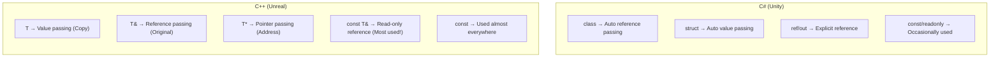
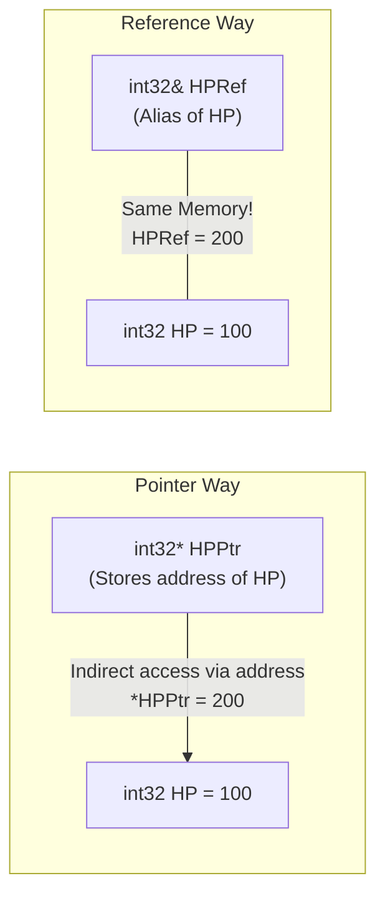
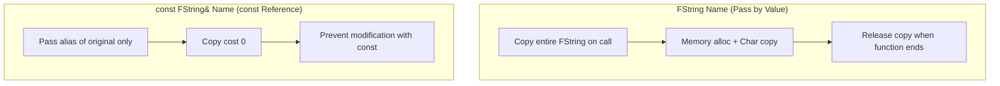
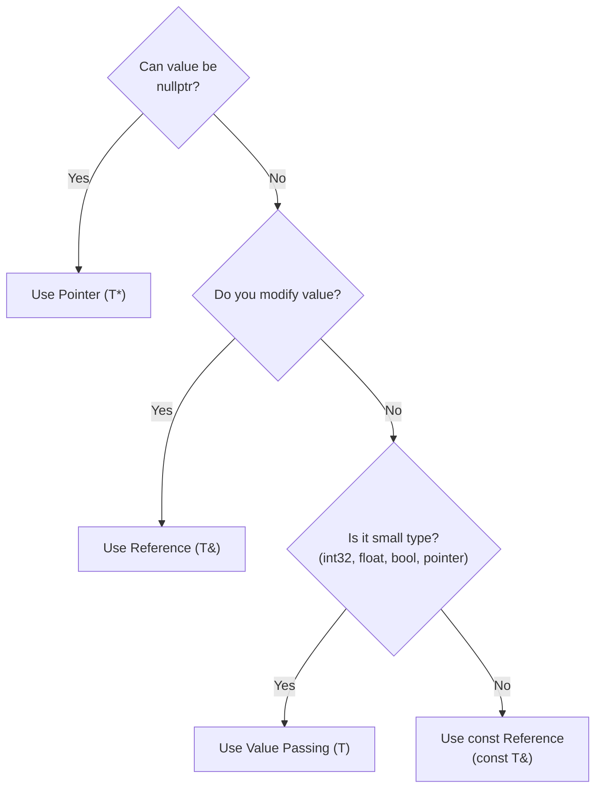

## Can You Read This Code?

When you open inventory system code in an Unreal project, you see something like this.

```cpp
// InventoryComponent.h
UCLASS()
class MYGAME_API UInventoryComponent : public UActorComponent
{
    GENERATED_BODY()

public:
    bool AddItem(const FString& ItemID, int32 Quantity);
    bool RemoveItem(const FString& ItemID, int32 Quantity);

    const TArray<FInventorySlot>& GetSlots() const;
    bool FindItem(const FString& ItemID, FInventorySlot& OutSlot) const;

    void PrintAllItems() const;

private:
    UPROPERTY()
    TArray<FInventorySlot> Slots;
};
```

If you are a Unity developer, you might have these questions:

- `const FString&`: `const` and `&` together? What is this?
- Returning `const TArray<FInventorySlot>&`? Why not just return `TArray`?
- `FInventorySlot& OutSlot`: This `&` doesn't look like "get address" from Lecture 3?
- `GetSlots() const`: What is `const` attached **after** the function?
- `PrintAllItems() const`: Same here... `const` after function?

**In this lecture, we solve all these questions.**

---

## Introduction - Why Reference and const are Important

Honestly, this lecture is **one of the most important in this series**.

Open any Unreal code. More than half of function signatures contain `const` and `&`. If you don't understand this, it's like being unable to read half the code.

```cpp
// Patterns seen in actual Unreal Engine code
void SetActorLocation(const FVector& NewLocation);
void SetOwner(AActor* NewOwner);
const FString& GetName() const;
bool GetHitResultUnderCursor(ECollisionChannel TraceChannel, bool bTraceComplex, FHitResult& OutHitResult) const;
```

All four lines have `const`, `&`, or both. After this lecture, you will read the code above naturally.

In C#, we didn't have this worry. `class` types are reference types so references are copied (object itself is not copied), `struct` is passed by value, and `readonly` is used occasionally. In C++, **the developer decides everything**: copy or reference, modifiable or read-only.



---

## 1. What is a Reference (&)? - Alias for a Variable

### 1-1. Basic Concept of Reference

We learned about pointers (`*`) in Lecture 3. Reference (`&`) has the same purpose as pointer (accessing original) but provides **much more convenient syntax**.

```cpp
int32 HP = 100;

// Pointer Way
int32* HPPtr = &HP;     // Store address
*HPPtr = 200;            // Change original with dereference (*)

// Reference Way
int32& HPRef = HP;      // Alias of HP
HPRef = 200;             // Just assign to change original (No dereference needed!)
```

Reference is "a second name attached to an existing variable." Using `HPRef` and using `HP` are **exactly the same.** Just created another name pointing to the same memory.



Comparing with C#:

```csharp
// C# - class type variable is a reference to heap object
// Nullable, reassignable → Closer to C++ Pointer (T*)
Enemy target = FindTarget();  // target is reference value pointing to heap object
target.TakeDamage(10);        // Original object changed
```

In C#, class type variables are internally **closer to C++ pointers (`T*`)** — because they can be null and reassigned to other objects. However, the syntax of accessing members with `.` is similar to C++ references (`T&`). C++ references are stricter than C# variables in that they cannot be null or rebound.

---

### 1-2. Rules of Reference

References have **strict rules different from pointers**.

```cpp
int32 HP = 100;
int32 MaxHP = 200;

// Rule 1: Must be initialized upon declaration
int32& Ref = HP;       // ✅ OK
// int32& Ref2;        // ❌ Compile Error! Cannot declare without initialization

// Rule 2: Cannot refer to another variable once bound
int32& Ref3 = HP;
Ref3 = MaxHP;           // ⚠️ This is NOT "rebinding" Ref3 to MaxHP!
                         //    It changes the value of HP to value of MaxHP (200)!
// HP becomes 200

// Rule 3: Cannot be nullptr
// int32& NullRef = nullptr;  // ❌ Impossible! Reference must always have valid target
```

| Feature | Reference (`&`) | Pointer (`*`) |
|------|-----------|-------------|
| Initialization | **Mandatory** | Optional (Can be nullptr) |
| Nullable | **Impossible** | Possible (`nullptr`) |
| Rebinding | **Impossible** (Once set, forever) | Possible (Can point to other address) |
| Syntax | Use like normal variable | Need `*`(dereference), `->`(member access) |
| Address Op | `&ref` = Address of original | `ptr` = Address of target |

> **💬 Wait, Let's Know This**
>
> **Q. `&` is used in three meanings?**
>
> Yes, depends on location:
> ```cpp
> int32& Ref = HP;        // ① After type: Declare reference type
> int32* Ptr = &HP;       // ② Before variable: Address operator (Get address)
> if (A && B) { }         // ③ Two: Logical AND operator
> ```
> Confusing at first, but distinguish by "Reference if after type, Address if before variable".
>
> **Q. If reference is better than pointer, why use pointer?**
>
> Since reference **cannot be null and cannot be rebound**, it cannot be used in all situations. If "this variable can be empty" (e.g., targeting non-existent enemy), you must use a pointer. We cover this at the end of this lecture.

---

## 2. References in Function Parameters - 3 Passing Methods

### 2-1. Pass by Value vs Reference vs Pointer

Let's properly summarize what we briefly covered in Lecture 1.

```cpp
// 1. Pass by Value - Copy created
void TakeDamageByValue(int32 Damage)
{
    Damage = 0;  // No effect on original (Modifying copy)
}

// 2. Pass by Reference - Handle original directly
void TakeDamageByRef(int32& OutHP, int32 Damage)
{
    OutHP -= Damage;  // Original modified directly
}

// 3. Pass by Pointer - Handle via address
void TakeDamageByPtr(int32* HPPtr, int32 Damage)
{
    if (HPPtr)          // nullptr check essential
    {
        *HPPtr -= Damage;  // Modify original by dereference
    }
}

// Usage
int32 PlayerHP = 100;
TakeDamageByValue(PlayerHP);      // PlayerHP unchanged
TakeDamageByRef(PlayerHP, 30);    // PlayerHP == 70
TakeDamageByPtr(&PlayerHP, 20);   // PlayerHP == 50
```

Comparing with C#:

| C# | C++ | Modify Original | Nullable |
|----|-----|---------|----------|
| `void Func(int x)` | `void Func(int32 X)` | ❌ (Copy) | - |
| `void Func(ref int x)` | `void Func(int32& X)` | ✅ | ❌ |
| `void Func(out int x)` | `void Func(int32& OutX)` | ✅ (For output) | ❌ |
| None | `void Func(int32* XPtr)` | ✅ | ✅ |

---

### 2-2. const Reference - Most Used Pattern in Unreal

Now, the core of this lecture.

```cpp
// ❌ Pass by Value - Entire FString copied (Slow)
void PrintName(FString Name)
{
    UE_LOG(LogTemp, Display, TEXT("Name: %s"), *Name);
}

// ❌ Pass by Reference - Might accidentally modify original
void PrintName(FString& Name)
{
    Name = TEXT("Hacked!");  // Original changed! (Unintended side effect)
    UE_LOG(LogTemp, Display, TEXT("Name: %s"), *Name);
}

// ✅ Pass by const Reference - No copy + Prevent modification (Perfect!)
void PrintName(const FString& Name)
{
    // Name = TEXT("Hacked!");  // ❌ Compile Error! Cannot modify because const
    UE_LOG(LogTemp, Display, TEXT("Name: %s"), *Name);  // ✅ Read only
}
```

`const FString&` provides two guarantees simultaneously:
1. **`&` (Reference)** → No copy occurs (Performance)
2. **`const`** → Cannot modify original (Safety)



**Why this is the most seen pattern in Unreal code**: When passing large types like `FString`, `FVector`, `FRotator`, `TArray`, `TMap`, copying every time wastes performance. Passing as `const T&` allows safe reading without copying.

| Passing Method | Copy Cost | Modify Original | Frequency in Unreal |
|-----------|----------|----------|-------------------|
| `FString Name` | **High** (Full copy) | Impossible (Copy) | Rarely used |
| `FString& Name` | None | **Possible** (Dangerous) | Output params only |
| `const FString& Name` | **None** | **Impossible** (Safe) | **Most Used!** |

> **💬 Wait, Let's Know This**
>
> **Q. Do we pass small types like int32 or float as const reference too?**
>
> No. Basic types like `int32` (4 bytes), `float` (4 bytes), `bool` (1 byte) are **passed by value**. The cost of copying is similar to or less than creating a reference.
> ```cpp
> void SetHealth(int32 NewHealth);              // ✅ Pass by value (Small type)
> void SetName(const FString& NewName);         // ✅ const reference (Large type)
> void SetLocation(const FVector& NewLocation); // ✅ const reference (12 bytes)
> ```
>
> **Criteria**: Basic types (`int32`, `float`, `bool`, pointer) -> Pass by Value. Others (`FString`, `FVector`, `TArray`, etc.) -> `const T&`.
>
> **Q. Why didn't C# have this worry?**
>
> In C#, `string` or `List<T>` are classes (reference types), so only reference (address) is copied when passed as parameter, object itself is not copied. So no special `const` mechanism was needed. In C++, everything is **pass by value (full object copy) by default**, so developers must specify `const T&`.

---

## 3. 4 Combinations of const - Mastering How to Read

### 3-1. Combination of Pointer and const

We tasted const in Lecture 1 and learned pointers in Lecture 3. Now combine them. It's notorious for being confusing, but simple if you know the rule.

**How to Read: `const` modifies what is on its left.** (If nothing on left, then right)

```cpp
int32 Value = 42;

// Combo 1: const int32* — "Pointed Value" is const
const int32* Ptr1 = &Value;
// *Ptr1 = 100;       // ❌ Cannot change value
Ptr1 = nullptr;       // ✅ Pointer itself can change

// Combo 2: int32* const — "Pointer Itself" is const
int32* const Ptr2 = &Value;
*Ptr2 = 100;          // ✅ Can change value
// Ptr2 = nullptr;    // ❌ Cannot change pointer

// Combo 3: const int32* const — Both const
const int32* const Ptr3 = &Value;
// *Ptr3 = 100;       // ❌ Cannot change value
// Ptr3 = nullptr;    // ❌ Cannot change pointer
```

Summary Table:

| Declaration | Change Value | Change Pointer | How to Read |
|------|--------|-----------|--------|
| `int32* Ptr` | ✅ | ✅ | Normal Pointer |
| `const int32* Ptr` | ❌ | ✅ | **Value** is const ("Cannot change value") |
| `int32* const Ptr` | ✅ | ❌ | **Pointer** is const ("Cannot point elsewhere") |
| `const int32* const Ptr` | ❌ | ❌ | Both const |

**Memorization Tip**: If `const` is left of `*`, protects **Value**. If right of `*`, protects **Pointer**.

```
const int32* Ptr    →  const left of *  →  Value change impossible
int32* const Ptr    →  const right of * →  Pointer change impossible
```

> **💬 Wait, Let's Know This**
>
> **Q. Do I need to memorize all 4?**
>
> In practice, **Combo 1 (`const int32*`) is used 99% of the time.** You rarely see others. Most patterns in Unreal code are:
> ```cpp
> const AActor* Target;   // Cannot modify Actor pointed by Target
> ```
>
> **Q. Are `const int32*` and `int32 const*` the same?**
>
> Yes, exactly same. If `const` is only on the left of `*`, it means "pointed value is const" either way. Unreal uses `const int32*` style.

---

### 3-2. const After Function - Promise of Member Function

This is a concept seen most often in Unreal code but not in C#.

```cpp
UCLASS()
class AMyCharacter : public ACharacter
{
public:
    // const Member Function: "This function does not modify member variables"
    float GetHealth() const
    {
        return CurrentHealth;        // ✅ Read only
        // CurrentHealth = 0;        // ❌ Compile Error! Cannot modify member in const function
    }

    const FString& GetName() const
    {
        return PlayerName;           // ✅ Return read-only reference
    }

    // non-const Member Function: Can modify member variables
    void TakeDamage(float Damage)
    {
        CurrentHealth -= Damage;     // ✅ Modifiable
    }

private:
    float CurrentHealth;
    FString PlayerName;
};
```

**Why needed?** Through `const` pointer or `const` reference, you can only call `const` member functions.

```cpp
void ProcessCharacter(const AMyCharacter* Character)
{
    // Through const pointer, only const functions callable
    float HP = Character->GetHealth();         // ✅ GetHealth() is const function
    const FString& Name = Character->GetName(); // ✅ GetName() is also const function

    // Character->TakeDamage(10);              // ❌ Compile Error! TakeDamage is non-const
}
```

C# doesn't have this concept. In C#, you can call any public method through any reference. C++ enforces the constraint **"Read-only if accessed this way"** at compile time.

| C# | C++ | Description |
|----|-----|------|
| None | `float GetHP() const` | This function **doesn't change** members |
| None | `void SetHP(float) ` | This function **can change** members |
| Call any method | const object calls const function only | **Enforced by Compiler** |

> **💬 Wait, Let's Know This**
>
> **Q. When should I make it a const member function?**
>
> **Make all functions that do not modify member variables const.** Especially Getter functions must be const. Unreal coding convention recommends this.
> ```cpp
> // Getters are always const
> int32 GetHealth() const;
> const FString& GetName() const;
> bool IsAlive() const;
> float GetSpeed() const;
>
> // Setters are not const
> void SetHealth(int32 NewHealth);
> void SetName(const FString& NewName);
> ```
>
> **Q. Can I really change nothing inside `const` function?**
>
> You can make exceptions with `mutable` keyword, covered in Lecture 14. For now, remember "const function = read-only".

---

## 4. 4 Unreal Patterns Using References

### Pattern 1: const Reference Input (Most Common)

Receiving read-only data. More than half of Unreal functions use this pattern.

```cpp
// Large types passed as const reference
void SpawnEnemy(const FVector& Location, const FRotator& Rotation)
{
    GetWorld()->SpawnActor<AEnemy>(EnemyClass, Location, Rotation);
}

// Containers also const reference
void ProcessItems(const TArray<FString>& ItemList)
{
    for (const FString& Item : ItemList)  // Iteration also const reference!
    {
        UE_LOG(LogTemp, Display, TEXT("Item: %s"), *Item);
    }
}
```

### Pattern 2: Reference Output Parameter (Out Prefix)

Function fills result and returns. Same purpose as C# `out`.

```cpp
// Unreal Style: Return success bool, pass result via reference parameter
bool GetHitResult(FHitResult& OutHitResult) const
{
    // ... Perform Raycast ...
    if (bHit)
    {
        OutHitResult = HitResult;   // Pass result via reference
        return true;
    }
    return false;
}

// Usage
FHitResult HitResult;
if (GetHitResult(HitResult))
{
    AActor* HitActor = HitResult.GetActor();
}
```

Same pattern in C#:

```csharp
// C#
bool GetHitResult(out RaycastHit hitResult)
{
    return Physics.Raycast(ray, out hitResult);
}
```

| C# | C++ (Unreal) | Meaning |
|----|-------------|------|
| `out RaycastHit hit` | `FHitResult& OutHit` | Output Parameter |
| `out` keyword | `Out` prefix (Convention) | "Fills result in this parameter" |

### Pattern 3: const Reference Return (Getter)

Returning large member variable without copy.

```cpp
class UInventoryComponent : public UActorComponent
{
public:
    // Expose inventory read-only without copy
    const TArray<FInventorySlot>& GetSlots() const
    {
        return Slots;    // Return const reference of member variable
    }

    // Name also const reference return
    const FString& GetOwnerName() const
    {
        return OwnerName;
    }

private:
    TArray<FInventorySlot> Slots;
    FString OwnerName;
};

// Usage
const TArray<FInventorySlot>& AllSlots = Inventory->GetSlots();  // No copy!
// AllSlots.Add(...);  // ❌ Cannot modify due to const
```

### Pattern 4: Reference in Range-based For

Pattern we tasted in Lecture 1.

```cpp
TArray<AActor*> Enemies;

// ✅ Pointer copy (8 bytes, very cheap, fine to use as is)
for (AActor* Enemy : Enemies)
{
    Enemy->Destroy();
}

// ✅ const Pointer (Explicitly stating no modification intent)
for (const AActor* Enemy : Enemies)
{
    UE_LOG(LogTemp, Display, TEXT("%s"), *Enemy->GetName());
}

// ✅ Reference (Modifying element itself - useful for struct array)
TArray<FVector> Positions;
for (FVector& Pos : Positions)
{
    Pos.Z += 100.0f;  // Modify original
}

// ✅ const Reference (Reading struct array - prevent copy)
for (const FVector& Pos : Positions)
{
    UE_LOG(LogTemp, Display, TEXT("X: %f"), Pos.X);
}
```

**Rules for Range-based For**:

| Situation | Format | Example |
|------|------|------|
| Read Only (Large Type) | `const T&` | `for (const FString& Name : Names)` |
| Modification Needed | `T&` | `for (FVector& Pos : Positions)` |
| Small Type / Pointer | `T` or `const T` | `for (int32 Score : Scores)` |

---

## 5. Reference vs Pointer - When to Use Which?

Now the most important question: **"Reference or Pointer, which one to use?"**

Selection criteria in Unreal is clear:



| Situation | Usage | Example |
|------|------|------|
| **Can be empty** (No enemy) | `T*` | `AActor* Target` |
| **Always valid + Modifying** | `T&` | `FHitResult& OutResult` |
| **Always valid + Read only** (Large) | `const T&` | `const FString& Name` |
| **Small Type** | `T` (Value) | `int32 Damage`, `float Speed` |

**Unreal code applies this rule consistently:**

```cpp
// Unreal Engine Function Signature Examples

// AActor* → Pointer because can be nullptr
void SetOwner(AActor* NewOwner);

// const FVector& → Always valid + Read only + Large type
void SetActorLocation(const FVector& NewLocation);

// FHitResult& → Always valid + Need to fill result
bool LineTraceSingle(FHitResult& OutHit, ...);

// float → Small type
void TakeDamage(float DamageAmount);
```

> **💬 Wait, Let's Know This**
>
> **Q. Why are component variables in Unreal pointers, not references?**
>
> ```cpp
> UPROPERTY()
> UStaticMeshComponent* MeshComp;   // Why not reference?
> ```
> Two reasons:
> 1. **Member variables can be nullptr** — Before creation or after destruction, it must be nullptr.
> 2. **Reference members can only be set in initializer list** and cannot be rebound. Things that can change at runtime need pointers.
>
> Generally, **Member variables are Pointers**, **Function parameters are References/const References** is the Unreal pattern.
>
> **Q. Why no such distinction in C#?**
>
> In C#, class type variables are **nullable and reassignable**, so they are closer to C++ pointers (`T*`). Instead, there was no way to "guarantee never null" until C# 8.0 nullable reference types. C++ designed pointers (nullable) and references (non-nullable) separately from the beginning.

---

## 6. Dissecting Real Unreal Code

Analyzing the inventory code from the beginning line by line.

```cpp
UCLASS()
class MYGAME_API UInventoryComponent : public UActorComponent
{
    GENERATED_BODY()

public:
    // ① const FString& → Read-only reference (Prevent copy + modification)
    //    int32 → Pass by value because small type
    bool AddItem(const FString& ItemID, int32 Quantity);
    bool RemoveItem(const FString& ItemID, int32 Quantity);

    // ② const TArray<>& Return + const after function
    //    = "Return member array as read-only without copy" + "This function doesn't change members"
    const TArray<FInventorySlot>& GetSlots() const;

    // ③ FInventorySlot& OutSlot → Output parameter (Fill result and return)
    //    const after function → Search doesn't change members
    bool FindItem(const FString& ItemID, FInventorySlot& OutSlot) const;

    // ④ const after function → Print only, so no member change
    void PrintAllItems() const;

private:
    UPROPERTY()
    TArray<FInventorySlot> Slots;
};
```

| No. | Pattern | Meaning |
|------|------|------|
| ① | `const FString& ItemID` | Read ItemID without copy |
| ① | `int32 Quantity` | Small type pass by value |
| ② | `const TArray<>&` Return | Expose array read-only without copying entire array |
| ② | `GetSlots() const` | This function doesn't modify Slots |
| ③ | `FInventorySlot& OutSlot` | Fill search result into this reference |
| ③ | `FindItem(...) const` | Search doesn't modify inventory |
| ④ | `PrintAllItems() const` | Print function naturally doesn't change members |

**Every line is explained by patterns learned in this lecture!**

---

## 7. Common Mistakes & Precautions

### Mistake 1: Passing Large Type by Value

```cpp
// ❌ Copy entire TArray (Performance disaster if thousands of elements)
void ProcessEnemies(TArray<AActor*> Enemies)
{
    // ...
}

// ✅ Pass by const reference
void ProcessEnemies(const TArray<AActor*>& Enemies)
{
    // ...
}
```

### Mistake 2: Returning Reference of Local Variable

```cpp
// ❌ Dangling Reference! LocalName disappears when function ends
const FString& GetName()
{
    FString LocalName = TEXT("Player");
    return LocalName;  // Return reference of vanished variable → Undefined behavior!
}

// ✅ Return reference of member variable (Member valid while object lives)
const FString& GetName() const
{
    return PlayerName;  // Member variable is safe
}
```

### Mistake 3: Attempting Member Modification in const Function

```cpp
// ❌ Attempting to modify member in const function
float GetHealth() const
{
    CurrentHealth = 0;     // Compile Error! Cannot modify member in const function
    return CurrentHealth;
}

// ✅ Separate Getter (const) and Setter (non-const)
float GetHealth() const { return CurrentHealth; }
void SetHealth(float NewHealth) { CurrentHealth = NewHealth; }
```

### Mistake 4: Receiving const Reference Return as Value

```cpp
// ❌ Receive returned const reference as value causes copy
TArray<FInventorySlot> AllSlots = Inventory->GetSlots();  // Full copy!

// ✅ Receive as const reference causes no copy
const TArray<FInventorySlot>& AllSlots = Inventory->GetSlots();  // No copy!
```

---

## Summary - Lecture 4 Checklist

After this lecture, you should be able to read the following in Unreal code:

- [ ] Know `int32& Ref` is reference (alias of variable)
- [ ] Know differences between reference and pointer (not null, no rebind, no dereference)
- [ ] Know `const FString& Name` means "Read-only passing without copy"
- [ ] Know `FHitResult& OutResult` is output parameter
- [ ] Know `const` after function in `GetHealth() const` means "Doesn't change members"
- [ ] Know difference between `const int32*`(Value protected) and `int32* const`(Pointer protected)
- [ ] Know that through const object/pointer, only const member functions are callable
- [ ] Know criteria for Reference vs Pointer (Nullable → Pointer, Always Valid → Reference)
- [ ] Know why using `const auto&` in range-based for
- [ ] Know why large types shouldn't be passed by value

---

## Next Lecture Preview

**Lecture 5: Classes and OOP - C++ Constructor/Destructor Rules**

When creating a class in C#, constructor is `public ClassName() { }` and finalizer is rarely used. In C++, there are various constructors, and **destructor (`~ClassName`) is very important.** Initializer list (`: Member(value)`), a syntax not in C#, also appears. You will also learn the shocking fact that `struct` and `class` are almost the same.
