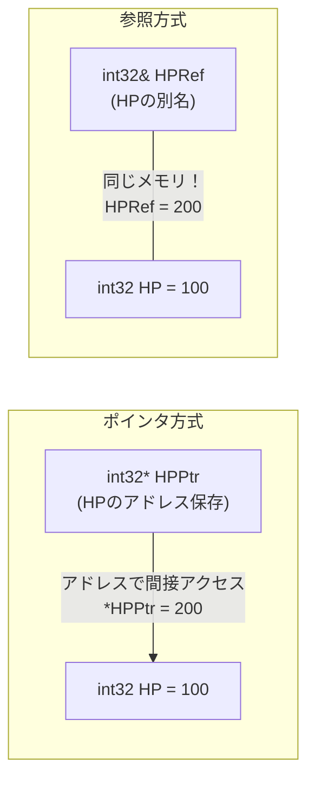
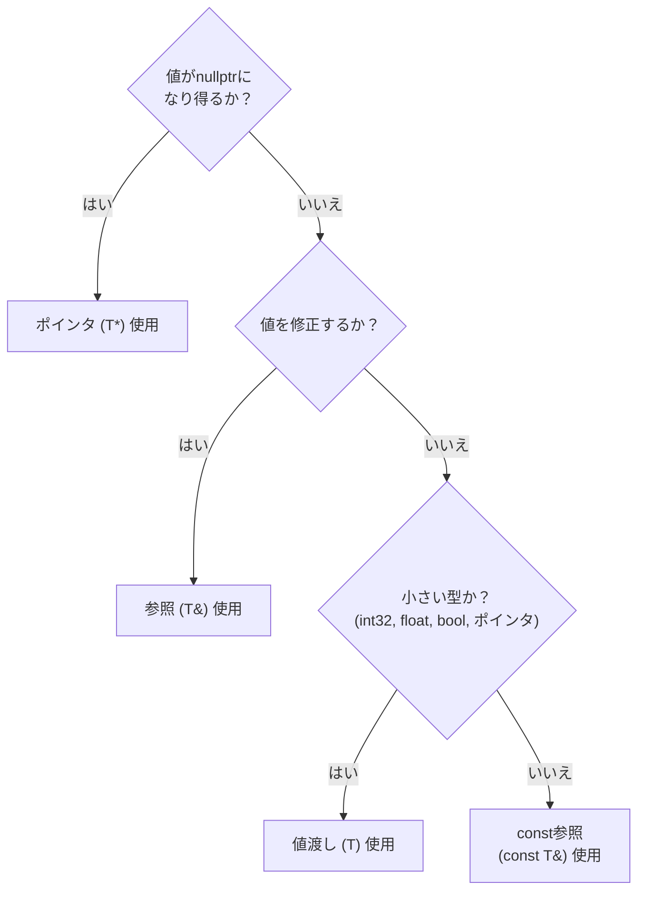

## このコード、読めますか？

Unrealプロジェクトでインベントリシステムのコードを開くと、こんなのが出てきます。

```cpp
// InventoryComponent.h
UCLASS()
class MYGAME_API UInventoryComponent : public UActorComponent
{
    GENERATED_BODY()

public:
    bool AddItem(const FString& ItemID, int32 Quantity);
    bool RemoveItem(const FString& ItemID, int32 Quantity);

    const TArray<FInventorySlot>& GetSlots() const;
    bool FindItem(const FString& ItemID, FInventorySlot& OutSlot) const;

    void PrintAllItems() const;

private:
    UPROPERTY()
    TArray<FInventorySlot> Slots;
};
```

Unity開発者なら、こんな疑問が湧くでしょう：

- `const FString&` で `const` と `&` が同時に付いているけど、これは何？
- `const TArray<FInventorySlot>&` を返すだって？ なぜ普通に `TArray` を返さないの？
- `FInventorySlot& OutSlot` で `&` は第3講で見た「アドレス取得」ではないようだけど？
- `GetSlots() const` で関数の **後ろに** 付いた `const` は何？
- `PrintAllItems() const` も同様... 関数の後ろに `const`？

**今回の講義でこれらの疑問をすべて解決します。**

---

## 序論 - なぜ参照とconstが重要なのか

正直に言って、今回の講義は **このシリーズで最も重要な講義の一つ** です。

Unrealコードを適当に開いてみてください。関数シグネチャの半分以上に `const` と `&` が入っています。これを理解できないとコードの半分を読めないのと同じです。

```cpp
// 実際のUnreal Engineコードで見られるパターン
void SetActorLocation(const FVector& NewLocation);
void SetOwner(AActor* NewOwner);
const FString& GetName() const;
bool GetHitResultUnderCursor(ECollisionChannel TraceChannel, bool bTraceComplex, FHitResult& OutHitResult) const;
```

4行すべて `const` か `&` か、あるいは両方です。今回の講義を終えれば上のコードが自然に読めるようになります。

C#ではこんな悩みはありませんでした。`class` 型は参照型なので参照値がコピーされ（オブジェクト自体はコピーされない）、`struct` は値渡しで、`readonly` はたまに使う程度でしたね。C++では **開発者が直接すべてを決定** します：コピーするか、参照するか、修正可能か、読み取り専用か。


---

## 1. 参照(&)とは？ - 変数の別名

### 1-1. 参照の基本概念

第3講でポインタ（`*`）を学びました。参照（`&`）はポインタと同じ目的（原本にアクセス）を持ちますが、**はるかに便利な文法** を提供します。

```cpp
int32 HP = 100;

// ポインタ方式
int32* HPPtr = &HP;     // アドレスを保存
*HPPtr = 200;            // 逆参照(*)で原本変更

// 参照方式
int32& HPRef = HP;      // HPの別名(alias)
HPRef = 200;             // ただ代入すれば原本変更 (逆参照不要！)
```

参照は「既存の変数に付ける2つ目の名前」です。`HPRef` を使うことと `HP` を使うことは **完全に同一です。** 同じメモリを指す名前がもう一つできただけです。



C#と比較すると：

```csharp
// C# - class型変数はヒープオブジェクトを指す参照値(reference)
// null可能、他のオブジェクトに再代入可能 → C++ ポインタ(T*)に近い
Enemy target = FindTarget();  // targetはヒープオブジェクトを指す参照値
target.TakeDamage(10);        // 原本オブジェクトが変更される
```

C#でclass型変数は内部的に **C++のポインタ（`T*`）に近いです** — nullになれるし、他のオブジェクトに再代入できるからです。ただし `.` でメンバにアクセスする文法はC++参照（`T&`）と類似しています。C++参照はnull不可・再バインディング不可という点でC#変数より厳格です。

---

### 1-2. 参照のルール

参照には **ポインタと違う厳格なルール** があります。

```cpp
int32 HP = 100;
int32 MaxHP = 200;

// ルール 1: 必ず宣言と同時に初期化
int32& Ref = HP;       // ✅ OK
// int32& Ref2;        // ❌ コンパイルエラー！ 初期化なしで宣言不可

// ルール 2: 一度バインドされると他の変数を参照できない
int32& Ref3 = HP;
Ref3 = MaxHP;           // ⚠️ これはRef3をMaxHPに「再バインド」するのではない！
                         //    HPの値をMaxHPの値(200)に変更すること！
// HP == 200 になる

// ルール 3: nullptrになれない
// int32& NullRef = nullptr;  // ❌ 不可能！ 参照は常に有効な対象が必要
```

| 特性 | 参照 (`&`) | ポインタ (`*`) |
|------|-----------|-------------|
| 初期化 | **必須** | 選択 (nullptr可能) |
| null可能 | **不可能** | 可能 (`nullptr`) |
| 再バインド | **不可能** (一度設定すれば終わり) | 可能 (他のアドレス指せる) |
| 文法 | 一般変数のように使用 | `*`(逆参照), `->`(メンバアクセス) 必要 |
| アドレス演算 | `&ref` = 原本のアドレス | `ptr` = 指す対象のアドレス |

> **💬 ちょっと一言、これだけは知っておこう**
>
> **Q. `&` が3つの意味で使われるのですか？**
>
> はい、位置によって違います：
> ```cpp
> int32& Ref = HP;        // ① 型の後ろ: 参照型宣言
> int32* Ptr = &HP;       // ② 変数の前: アドレス演算子 (アドレス取得)
> if (A && B) { }         // ③ 二つ: 論理AND演算子
> ```
> 最初は紛らわしいですが、「型の後ろに付けば参照、変数の前に付けばアドレス」と区別すればOKです。
>
> **Q. 参照がポインタより良いなら、なぜポインタを使うのですか？**
>
> 参照は **nullになれず再バインドが不可能** なので、すべての状況で使えるわけではありません。「この変数が空である可能性がある」（いない敵をターゲットするなど）ならポインタを使う必要があります。これは今回の講義の最後に詳しく扱います。

---

## 2. 関数パラメータでの参照 - 3つの伝達方式

### 2-1. 値渡し vs 参照渡し vs ポインタ渡し

第1講で簡単に扱った内容をちゃんと整理します。

```cpp
// 1. 値渡し - コピーが作られる
void TakeDamageByValue(int32 Damage)
{
    Damage = 0;  // 原本に影響なし (コピーを変更)
}

// 2. 参照渡し - 原本を直接扱う
void TakeDamageByRef(int32& OutHP, int32 Damage)
{
    OutHP -= Damage;  // 原本が直接変更される
}

// 3. ポインタ渡し - アドレスを通じて扱う
void TakeDamageByPtr(int32* HPPtr, int32 Damage)
{
    if (HPPtr)          // nullptrチェック必須
    {
        *HPPtr -= Damage;  // 逆参照で原本変更
    }
}

// 使用
int32 PlayerHP = 100;
TakeDamageByValue(PlayerHP);      // PlayerHP 変化なし
TakeDamageByRef(PlayerHP, 30);    // PlayerHP == 70
TakeDamageByPtr(&PlayerHP, 20);   // PlayerHP == 50
```

C#と比較すると：

| C# | C++ | 原本変更 | null可能 |
|----|-----|---------|----------|
| `void Func(int x)` | `void Func(int32 X)` | ❌ (コピー) | - |
| `void Func(ref int x)` | `void Func(int32& X)` | ✅ | ❌ |
| `void Func(out int x)` | `void Func(int32& OutX)` | ✅ (出力用) | ❌ |
| なし | `void Func(int32* XPtr)` | ✅ | ✅ |

---

### 2-2. const参照 - Unrealで最もよく使うパターン

さて、今回の講義の核心です。

```cpp
// ❌ 値渡し - FString全体がコピーされる (遅い)
void PrintName(FString Name)
{
    UE_LOG(LogTemp, Display, TEXT("Name: %s"), *Name);
}

// ❌ 参照渡し - うっかり原本を修正する可能性がある
void PrintName(FString& Name)
{
    Name = TEXT("Hacked!");  // 原本が変更される！ (意図しない副作用)
    UE_LOG(LogTemp, Display, TEXT("Name: %s"), *Name);
}

// ✅ const参照渡し - コピーなし + 修正防止 (完璧！)
void PrintName(const FString& Name)
{
    // Name = TEXT("Hacked!");  // ❌ コンパイルエラー！ constなので修正不可
    UE_LOG(LogTemp, Display, TEXT("Name: %s"), *Name);  // ✅ 読むだけ可能
}
```

`const FString&` は二つの保証を同時に提供します：
1. **`&` (参照)** → コピーが発生しない (性能)
2. **`const`** → 原本を修正できない (安全性)


**これがUnrealコードで最もよく見るパターンである理由**: `FString`、`FVector`、`FRotator`、`TArray`、`TMap` などサイズの大きい型を関数に渡すとき、毎回コピーすると性能が無駄になります。`const T&` で渡せばコピーなしで安全に読めます。

| 伝達方式 | コピーコスト | 原本修正 | Unrealでの使用頻度 |
|-----------|----------|----------|-------------------|
| `FString Name` | **高い** (全体コピー) | 不可 (コピーだから) | ほぼ使わない |
| `FString& Name` | なし | **可能** (危険) | 出力パラメータにのみ |
| `const FString& Name` | **なし** | **不可** (安全) | **最も多く使用！** |

> **💬 ちょっと一言、これだけは知っておこう**
>
> **Q. int32やfloatのような小さい型もconst参照で渡しますか？**
>
> いいえ。`int32`(4バイト)、`float`(4バイト)、`bool`(1バイト)のような **基本型はそのまま値で渡します**。コピーコストが参照を作るコストと似ているかより少ないからです。
> ```cpp
> void SetHealth(int32 NewHealth);              // ✅ 値渡し (小さい型)
> void SetName(const FString& NewName);         // ✅ const参照 (大きい型)
> void SetLocation(const FVector& NewLocation); // ✅ const参照 (12バイト)
> ```
>
> **基準**: 基本型(`int32`, `float`, `bool`, ポインタ)は値渡し、その他(`FString`, `FVector`, `TArray`など)は `const T&`。
>
> **Q. C#ではなぜこんな悩みがなかったのですか？**
>
> C#で `string` や `List<T>` はclass(参照型)なのでパラメータで渡すとき参照値(アドレス)だけコピーされオブジェクト自体はコピーされません。だから別途 `const` のような装置が必要ありませんでした。C++ではすべてのものが **基本的に値渡し(オブジェクト全体コピー)** なので、開発者が `const T&` と明示する必要があります。

---

## 3. constの4つの組み合わせ - 読み方完全整理

### 3-1. ポインタとconstの組み合わせ

第1講でconstを少し扱い、第3講でポインタを学んだので、これらを組み合わせます。紛らわしいことで悪名高い部分ですが、ルールさえわかれば簡単です。

**読み方：`const` は自分の左にあるものを修飾します。** (左に何もなければ右)

```cpp
int32 Value = 42;

// 組み合わせ 1: const int32* — 「指す値」がconst
const int32* Ptr1 = &Value;
// *Ptr1 = 100;       // ❌ 値変更不可
Ptr1 = nullptr;       // ✅ ポインタ自体は変更可能

// 組み合わせ 2: int32* const — 「ポインタ自体」がconst
int32* const Ptr2 = &Value;
*Ptr2 = 100;          // ✅ 値変更可能
// Ptr2 = nullptr;    // ❌ ポインタ変更不可

// 組み合わせ 3: const int32* const — 両方const
const int32* const Ptr3 = &Value;
// *Ptr3 = 100;       // ❌ 値変更不可
// Ptr3 = nullptr;    // ❌ ポインタ変更不可
```

表で整理すると：

| 宣言 | 値変更 | ポインタ変更 | 読み方 |
|------|--------|-----------|--------|
| `int32* Ptr` | ✅ | ✅ | 一般ポインタ |
| `const int32* Ptr` | ❌ | ✅ | **値**がconst (「値を変えられない」) |
| `int32* const Ptr` | ✅ | ❌ | **ポインタ**がconst (「他を指せない」) |
| `const int32* const Ptr` | ❌ | ❌ | 両方const |

**暗記のコツ**: `const` が `*` の左にあれば **値** 保護、`*` の右にあれば **ポインタ** 保護。

```
const int32* Ptr    →  constが * 左  →  値変更不可
int32* const Ptr    →  constが * 右  →  ポインタ変更不可
```

> **💬 ちょっと一言、これだけは知っておこう**
>
> **Q. この4つを全部覚える必要がありますか？**
>
> 実務では **組み合わせ 1 (`const int32*`) だけ99%使います。** 残りはほぼ見ません。Unrealコードで見るパターンは大部分これです：
> ```cpp
> const AActor* Target;   // Targetが指すActorを修正できない
> ```
>
> **Q. `const int32*` と `int32 const*` は同じですか？**
>
> はい、完全に同じです。`const` が `*` の左にさえあればどちらでも「指す値がconst」です。Unrealでは `const int32*` スタイルを使用します。

---

### 3-2. 関数の後ろのconst - メンバ関数の約束

Unrealコードで最もよく見かけるのにC#にはない概念です。

```cpp
UCLASS()
class AMyCharacter : public ACharacter
{
public:
    // constメンバ関数: 「この関数はメンバ変数を修正しません」
    float GetHealth() const
    {
        return CurrentHealth;        // ✅ 読むだけ
        // CurrentHealth = 0;        // ❌ コンパイルエラー！ const関数でメンバ修正不可
    }

    const FString& GetName() const
    {
        return PlayerName;           // ✅ 読み取り専用参照返却
    }

    // non-constメンバ関数: メンバ変数を修正できる
    void TakeDamage(float Damage)
    {
        CurrentHealth -= Damage;     // ✅ 修正可能
    }

private:
    float CurrentHealth;
    FString PlayerName;
};
```

**なぜ必要なのか？** `const` ポインタや `const` 参照を通じては `const` メンバ関数のみ呼び出せます。

```cpp
void ProcessCharacter(const AMyCharacter* Character)
{
    // constポインタを通じてはconst関数のみ呼び出し可能
    float HP = Character->GetHealth();         // ✅ GetHealth()はconst関数
    const FString& Name = Character->GetName(); // ✅ GetName()もconst関数

    // Character->TakeDamage(10);              // ❌ コンパイルエラー！ TakeDamageはnon-const
}
```

C#にはこの概念がありません。C#ではどんな参照を通じてでもすべてのpublicメソッドを呼び出せます。C++は **「この経路でアクセスすれば読むだけ可能」** という制約をコンパイルタイムに強制します。

| C# | C++ | 説明 |
|----|-----|------|
| なし | `float GetHP() const` | この関数はメンバを **変えない** |
| なし | `void SetHP(float) ` | この関数はメンバを **変えられる** |
| どのメソッドでも呼べる | constオブジェクトはconst関数のみ呼べる | **コンパイラが強制** |

> **💬 ちょっと一言、これだけは知っておこう**
>
> **Q. いつconstメンバ関数にするべきですか？**
>
> **メンバ変数を修正しない関数はすべてconstにしてください。** 特にGetter関数は必ずconstです。Unrealコーディング規則でもこれを推奨しています。
> ```cpp
> // Getterは常にconst
> int32 GetHealth() const;
> const FString& GetName() const;
> bool IsAlive() const;
> float GetSpeed() const;
>
> // Setterはconstではない
> void SetHealth(int32 NewHealth);
> void SetName(const FString& NewName);
> ```
>
> **Q. では `const` 関数の中で本当に何も変えられないのですか？**
>
> `mutable` というキーワードで例外を作れますが、これは第14講で扱います。今は「const関数 = 読み取り専用」とだけ覚えてください。

---

## 4. 参照を活用した4つのUnrealパターン

### パターン 1: const参照入力 (最も一般的)

読み取り専用でデータを受け取るとき。Unreal関数の半分以上がこのパターンです。

```cpp
// 大きい型はconst参照で伝達
void SpawnEnemy(const FVector& Location, const FRotator& Rotation)
{
    GetWorld()->SpawnActor<AEnemy>(EnemyClass, Location, Rotation);
}

// コンテナもconst参照
void ProcessItems(const TArray<FString>& ItemList)
{
    for (const FString& Item : ItemList)  // 巡回もconst参照！
    {
        UE_LOG(LogTemp, Display, TEXT("Item: %s"), *Item);
    }
}
```

### パターン 2: 参照出力パラメータ (Out接頭辞)

関数が結果を埋めて返すとき。C#の `out` と同じ目的です。

```cpp
// Unrealスタイル: 成功可否をboolで返却、結果は参照パラメータで伝達
bool GetHitResult(FHitResult& OutHitResult) const
{
    // ... レイキャスト実行 ...
    if (bHit)
    {
        OutHitResult = HitResult;   // 参照を通じて結果伝達
        return true;
    }
    return false;
}

// 使用
FHitResult HitResult;
if (GetHitResult(HitResult))
{
    AActor* HitActor = HitResult.GetActor();
}
```

C#で同じパターン：

```csharp
// C#
bool GetHitResult(out RaycastHit hitResult)
{
    return Physics.Raycast(ray, out hitResult);
}
```

| C# | C++ (Unreal) | 意味 |
|----|-------------|------|
| `out RaycastHit hit` | `FHitResult& OutHit` | 出力パラメータ |
| `out` キーワード | `Out` 接頭辞 (規則) | 「このパラメータに結果を埋める」 |

### パターン 3: const参照返却 (Getter)

大きいメンバ変数をコピーなしで返すとき。

```cpp
class UInventoryComponent : public UActorComponent
{
public:
    // コピーなしでインベントリを読み取り専用で露出
    const TArray<FInventorySlot>& GetSlots() const
    {
        return Slots;    // メンバ変数のconst参照を返却
    }

    // 名前もconst参照返却
    const FString& GetOwnerName() const
    {
        return OwnerName;
    }

private:
    TArray<FInventorySlot> Slots;
    FString OwnerName;
};

// 使用
const TArray<FInventorySlot>& AllSlots = Inventory->GetSlots();  // コピーなし！
// AllSlots.Add(...);  // ❌ constなので修正不可
```

### パターン 4: 範囲ベースforでの参照

すでに第1講で少し見たパターンです。

```cpp
TArray<AActor*> Enemies;

// ✅ ポインタコピー (8バイトで非常に安い、このまま使っても無難)
for (AActor* Enemy : Enemies)
{
    Enemy->Destroy();
}

// ✅ constポインタ (修正意図がないことを明示するとき)
for (const AActor* Enemy : Enemies)
{
    UE_LOG(LogTemp, Display, TEXT("%s"), *Enemy->GetName());
}

// ✅ 参照 (要素自体を修正するとき - 構造体配列で有用)
TArray<FVector> Positions;
for (FVector& Pos : Positions)
{
    Pos.Z += 100.0f;  // 原本修正
}

// ✅ const参照 (構造体配列読み取り - コピー防止)
for (const FVector& Pos : Positions)
{
    UE_LOG(LogTemp, Display, TEXT("X: %f"), Pos.X);
}
```

**範囲ベースforのルール**:

| 状況 | 形式 | 例 |
|------|------|------|
| 読むだけ (大きい型) | `const T&` | `for (const FString& Name : Names)` |
| 修正必要 | `T&` | `for (FVector& Pos : Positions)` |
| 小さい型 / ポインタ | `T` または `const T` | `for (int32 Score : Scores)` |

---

## 5. 参照 vs ポインタ - いつどれを使うか

さて、最も重要な質問です：**「参照とポインタ、いつどっちを使うべきか？」**

Unrealでの選択基準は明確です：



| 状況 | 使用 | 例 |
|------|------|------|
| **空になり得る** (敵がいないかも) | `T*` | `AActor* Target` |
| **常に有効 + 修正必要** | `T&` | `FHitResult& OutResult` |
| **常に有効 + 読むだけ** (大きい型) | `const T&` | `const FString& Name` |
| **小さい型** | `T` (値渡し) | `int32 Damage`, `float Speed` |

**Unrealコードを見ればこのルールが一貫して適用されています：**

```cpp
// Unreal Engine 関数シグネチャ例

// AActor* → nullptrになり得るからポインタ
void SetOwner(AActor* NewOwner);

// const FVector& → 常に有効 + 読むだけ + 大きい型
void SetActorLocation(const FVector& NewLocation);

// FHitResult& → 常に有効 + 結果を埋める必要あり
bool LineTraceSingle(FHitResult& OutHit, ...);

// float → 小さい型
void TakeDamage(float DamageAmount);
```

> **💬 ちょっと一言、これだけは知っておこう**
>
> **Q. Unrealでコンポーネント変数はなぜ参照ではなくポインタなのですか？**
>
> ```cpp
> UPROPERTY()
> UStaticMeshComponent* MeshComp;   // なぜ参照ではない？
> ```
> 二つの理由です：
> 1. **メンバ変数はnullptrになり得ます** — コンポーネントがまだ生成される前や破壊された後はnullptrであるべきです。
> 2. **参照メンバは初期化リストでのみ設定可能** であり再バインドできません。ランタイムに変更され得る対象にはポインタが必要です。
>
> 一般的に **メンバ変数はポインタ**、**関数パラメータは参照/const参照** がUnrealのパターンです。
>
> **Q. C#ではなぜこんな区分がないのですか？**
>
> C#でclass型変数は **null可能・再代入可能** なのでC++ポインタ（`T*`）側に近いです。代わりに「絶対nullでないことを保証」する方法がC# 8.0のnullable reference typesが出るまではありませんでした。C++は最初からポインタ（null可能）と参照（null不可）を分離して設計しました。

---

## 6. Unreal実戦コード解剖

最初に見たインベントリコードをもう一度一行ずつ分析します。

```cpp
UCLASS()
class MYGAME_API UInventoryComponent : public UActorComponent
{
    GENERATED_BODY()

public:
    // ① const FString& → 読み取り専用参照 (コピー防止 + 修正防止)
    //    int32 → 小さい型なので値渡し
    bool AddItem(const FString& ItemID, int32 Quantity);
    bool RemoveItem(const FString& ItemID, int32 Quantity);

    // ② const TArray<>& 返却 + 関数の後ろconst
    //    = "メンバ配列をコピーなしで読み取り専用として返却" + "この関数はメンバを変えない"
    const TArray<FInventorySlot>& GetSlots() const;

    // ③ FInventorySlot& OutSlot → 出力パラメータ (結果を埋めて返す)
    //    関数の後ろconst → 検索はメンバを変更しない
    bool FindItem(const FString& ItemID, FInventorySlot& OutSlot) const;

    // ④ 関数の後ろconst → 出力だけだからメンバ変更なし
    void PrintAllItems() const;

private:
    UPROPERTY()
    TArray<FInventorySlot> Slots;
};
```

| 番号 | パターン | 意味 |
|------|------|------|
| ① | `const FString& ItemID` | アイテムIDをコピーなしで読むだけ |
| ① | `int32 Quantity` | 小さい型は値渡し |
| ② | `const TArray<>&` 返却 | 配列全体をコピーせず読み取り専用で公開 |
| ② | `GetSlots() const` | この関数はSlotsを修正しない |
| ③ | `FInventorySlot& OutSlot` | 検索結果をこの参照に埋めて返す |
| ③ | `FindItem(...) const` | 検索はインベントリを変更しない |
| ④ | `PrintAllItems() const` | 出力関数は当然メンバ変更なし |

**すべての行が今回の講義で学んだパターンで説明されます！**

---

## 7. よくある間違い & 注意事項

### 間違い 1: 大きい型を値で渡す

```cpp
// ❌ TArray全体がコピーされる (要素数千個なら性能災難)
void ProcessEnemies(TArray<AActor*> Enemies)
{
    // ...
}

// ✅ const参照で渡す
void ProcessEnemies(const TArray<AActor*>& Enemies)
{
    // ...
}
```

### 間違い 2: ローカル変数の参照を返す

```cpp
// ❌ ダングリング参照！ 関数が終わればLocalNameは消える
const FString& GetName()
{
    FString LocalName = TEXT("Player");
    return LocalName;  // 消えた変数の参照を返却 → 定義されていない動作！
}

// ✅ メンバ変数の参照を返す (メンバはオブジェクトが生きている間有効)
const FString& GetName() const
{
    return PlayerName;  // メンバ変数は安全
}
```

### 間違い 3: const関数でメンバ修正試行

```cpp
// ❌ const関数なのにメンバを修正しようとする
float GetHealth() const
{
    CurrentHealth = 0;     // コンパイルエラー！ const関数でメンバ修正不可
    return CurrentHealth;
}

// ✅ Getterはconst、Setterはnon-constで分離
float GetHealth() const { return CurrentHealth; }
void SetHealth(float NewHealth) { CurrentHealth = NewHealth; }
```

### 間違い 4: const参照で受け取るべきなのに値で受け取る

```cpp
// ❌ 返されたconst参照を値で受け取るとコピー発生
TArray<FInventorySlot> AllSlots = Inventory->GetSlots();  // 全体コピー！

// ✅ const参照で受け取ればコピーなし
const TArray<FInventorySlot>& AllSlots = Inventory->GetSlots();  // コピーなし！
```

---

## まとめ - 第4講チェックリスト

この講義を終えると、Unrealコードで以下を読めるようになっているはずです：

- [ ] `int32& Ref` が参照（変数の別名）であることを知っている
- [ ] 参照がポインタと違う点（null不可、再バインド不可、逆参照不要）を知っている
- [ ] `const FString& Name` が「コピーなしで読み取り専用として渡す」であることを知っている
- [ ] `FHitResult& OutResult` が出力パラメータであることを知っている
- [ ] `GetHealth() const` で関数の後ろの `const` が「メンバを変えない」であることを知っている
- [ ] `const int32*`（値保護）と `int32* const`（ポインタ保護）の違いを知っている
- [ ] constオブジェクト/ポインタを通じてはconstメンバ関数のみ呼び出せることを知っている
- [ ] 参照 vs ポインタ選択基準を知っている (null可能 → ポインタ、常に有効 → 参照)
- [ ] 範囲ベースforで `const auto&` を使う理由を知っている
- [ ] 大きい型を値で渡してはいけない理由を知っている

---

## 次回予告

**第5講：クラスとOOP - C++だけのコンストラクタ/デストラクタ規則**

C#でクラスを作るときコンストラクタは `public ClassName() { }` で、デストラクタ（ファイナライザ）はほぼ使うことがありません。C++ではコンストラクタも多様で、**デストラクタ(`~ClassName`)が非常に重要です。** 初期化リスト(`: Member(value)`)というC#にはない文法も登場します。`struct` と `class` がほぼ同じだという衝撃的な事実も知ることになります。
