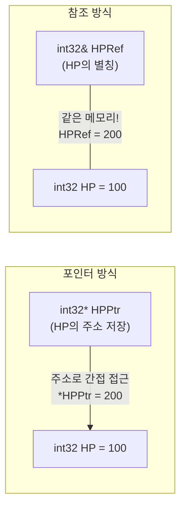
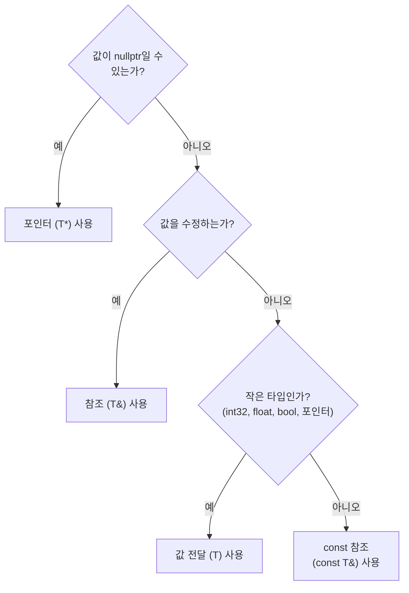

## 이 코드, 읽을 수 있나요?

언리얼 프로젝트에서 인벤토리 시스템 코드를 열면 이런 게 나옵니다.

```cpp
// InventoryComponent.h
UCLASS()
class MYGAME_API UInventoryComponent : public UActorComponent
{
    GENERATED_BODY()

public:
    bool AddItem(const FString& ItemID, int32 Quantity);
    bool RemoveItem(const FString& ItemID, int32 Quantity);

    const TArray<FInventorySlot>& GetSlots() const;
    bool FindItem(const FString& ItemID, FInventorySlot& OutSlot) const;

    void PrintAllItems() const;

private:
    UPROPERTY()
    TArray<FInventorySlot> Slots;
};
```

유니티 개발자라면 이런 의문이 듭니다:

- `const FString&`에서 `const`와 `&`가 동시에 붙어있는데, 이게 뭐지?
- `const TArray<FInventorySlot>&`를 반환한다고? 왜 그냥 `TArray`를 반환 안 하지?
- `FInventorySlot& OutSlot`에서 `&`는 3강에서 본 "주소 구하기"가 아닌 것 같은데?
- `GetSlots() const`에서 함수 **뒤에** 붙은 `const`는 뭐지?
- `PrintAllItems() const`도 마찬가지... 함수 뒤에 `const`?

**이번 강에서 이 모든 의문을 해결합니다.**

---

## 서론 - 왜 참조와 const가 중요한가

솔직히 말해서, 이번 강이 **이 시리즈에서 가장 중요한 강 중 하나**입니다.

언리얼 코드를 아무거나 열어보세요. 함수 시그니처의 절반 이상에 `const`와 `&`가 들어있습니다. 이걸 이해하지 못하면 코드의 절반을 읽지 못하는 것과 같습니다.

```cpp
// 실제 언리얼 엔진 코드에서 볼 수 있는 패턴들
void SetActorLocation(const FVector& NewLocation);
void SetOwner(AActor* NewOwner);
const FString& GetName() const;
bool GetHitResultUnderCursor(ECollisionChannel TraceChannel, bool bTraceComplex, FHitResult& OutHitResult) const;
```

네 줄 모두 `const`이거나 `&`이거나, 둘 다이거나 합니다. 이번 강을 마치면 위 코드가 자연스럽게 읽힙니다.

C#에서는 이런 고민이 없었습니다. `class` 타입은 참조 타입이라 참조값이 복사되고(객체 자체는 복사 안 됨), `struct`는 값 전달이고, `readonly`는 가끔 쓰는 정도였죠. C++에서는 **개발자가 직접 모든 것을 결정**합니다: 복사할 건지, 참조할 건지, 수정 가능한지, 읽기 전용인지.


---

## 1. 참조(&)란? - 변수의 별칭

### 1-1. 참조의 기본 개념

3강에서 포인터(`*`)를 배웠습니다. 참조(`&`)는 포인터와 같은 목적(원본에 접근)을 가지지만, **훨씬 편리한 문법**을 제공합니다.

```cpp
int32 HP = 100;

// 포인터 방식
int32* HPPtr = &HP;     // 주소를 저장
*HPPtr = 200;            // 역참조(*)로 원본 변경

// 참조 방식
int32& HPRef = HP;      // HP의 별칭(alias)
HPRef = 200;             // 그냥 대입하면 원본 변경 (역참조 필요 없음!)
```

참조는 "기존 변수에 붙이는 두 번째 이름"입니다. `HPRef`를 사용하는 것과 `HP`를 사용하는 것이 **완전히 동일합니다.** 같은 메모리를 가리키는 이름이 하나 더 생긴 것일 뿐입니다.



C#과 비교하면:

```csharp
// C# - class 타입 변수는 힙 객체를 가리키는 참조값(reference)
// null 가능, 다른 객체로 재대입 가능 → C++ 포인터(T*)에 더 가까움
Enemy target = FindTarget();  // target은 힙 객체를 가리키는 참조값
target.TakeDamage(10);        // 원본 객체가 변경됨
```

C#에서 class 타입 변수는 내부적으로 **C++의 포인터(`T*`)에 가깝습니다** — null이 될 수 있고, 다른 객체로 재대입할 수 있기 때문입니다. 다만 `.`으로 멤버에 접근하는 문법은 C++ 참조(`T&`)와 유사하죠. C++ 참조는 null 불가·재바인딩 불가라는 점에서 C# 변수보다 더 엄격합니다.

---

### 1-2. 참조의 규칙

참조에는 **포인터와 다른 엄격한 규칙**이 있습니다.

```cpp
int32 HP = 100;
int32 MaxHP = 200;

// 규칙 1: 반드시 선언과 동시에 초기화
int32& Ref = HP;       // ✅ OK
// int32& Ref2;        // ❌ 컴파일 에러! 초기화 없이 선언 불가

// 규칙 2: 한번 바인딩되면 다른 변수를 참조할 수 없음
int32& Ref3 = HP;
Ref3 = MaxHP;           // ⚠️ 이건 Ref3를 MaxHP로 "재바인딩"하는 게 아님!
                         //    HP의 값을 MaxHP의 값(200)으로 변경하는 것!
// HP == 200이 됨

// 규칙 3: nullptr이 될 수 없음
// int32& NullRef = nullptr;  // ❌ 불가능! 참조는 항상 유효한 대상이 있어야 함
```

| 특성 | 참조 (`&`) | 포인터 (`*`) |
|------|-----------|-------------|
| 초기화 | **필수** | 선택 (nullptr 가능) |
| null 가능 여부 | **불가능** | 가능 (`nullptr`) |
| 재바인딩 | **불가능** (한번 설정하면 끝) | 가능 (다른 주소 가리킬 수 있음) |
| 문법 | 일반 변수처럼 사용 | `*`(역참조), `->`(멤버 접근) 필요 |
| 주소 연산 | `&ref` = 원본의 주소 | `ptr` = 가리키는 대상의 주소 |

> **💬 잠깐, 이건 알고 가자**
>
> **Q. `&`가 세 가지 의미로 쓰인다고요?**
>
> 네, 위치에 따라 다릅니다:
> ```cpp
> int32& Ref = HP;        // ① 타입 뒤: 참조 타입 선언
> int32* Ptr = &HP;       // ② 변수 앞: 주소 연산자 (주소 구하기)
> if (A && B) { }         // ③ 두 개: 논리 AND 연산자
> ```
> 처음엔 헷갈리지만, "타입 뒤에 붙으면 참조, 변수 앞에 붙으면 주소"로 구분하면 됩니다.
>
> **Q. 참조가 포인터보다 좋다면, 왜 포인터를 쓰나요?**
>
> 참조는 **null이 될 수 없고 재바인딩이 불가능**하기 때문에, 모든 상황에서 쓸 수 있는 건 아닙니다. "이 변수가 비어있을 수 있다"(없는 적을 타겟팅 등)면 포인터를 써야 합니다. 이건 이번 강 마지막에 자세히 다룹니다.

---

## 2. 함수 파라미터에서의 참조 - 3가지 전달 방식

### 2-1. 값 전달 vs 참조 전달 vs 포인터 전달

1강에서 간략히 다뤘던 내용을 이제 제대로 정리합니다.

```cpp
// 1. 값 전달 - 복사본이 만들어짐
void TakeDamageByValue(int32 Damage)
{
    Damage = 0;  // 원본에 영향 없음 (복사본을 수정)
}

// 2. 참조 전달 - 원본을 직접 다룸
void TakeDamageByRef(int32& OutHP, int32 Damage)
{
    OutHP -= Damage;  // 원본이 직접 변경됨
}

// 3. 포인터 전달 - 주소를 통해 다룸
void TakeDamageByPtr(int32* HPPtr, int32 Damage)
{
    if (HPPtr)          // nullptr 체크 필수
    {
        *HPPtr -= Damage;  // 역참조로 원본 변경
    }
}

// 사용
int32 PlayerHP = 100;
TakeDamageByValue(PlayerHP);      // PlayerHP 변화 없음
TakeDamageByRef(PlayerHP, 30);    // PlayerHP == 70
TakeDamageByPtr(&PlayerHP, 20);   // PlayerHP == 50
```

C#과 비교하면:

| C# | C++ | 원본 변경 | null 가능 |
|----|-----|---------|----------|
| `void Func(int x)` | `void Func(int32 X)` | ❌ (복사) | - |
| `void Func(ref int x)` | `void Func(int32& X)` | ✅ | ❌ |
| `void Func(out int x)` | `void Func(int32& OutX)` | ✅ (출력용) | ❌ |
| 없음 | `void Func(int32* XPtr)` | ✅ | ✅ |

---

### 2-2. const 참조 - 언리얼에서 가장 많이 쓰는 패턴

이제 이번 강의 핵심입니다.

```cpp
// ❌ 값 전달 - FString 전체가 복사됨 (느림)
void PrintName(FString Name)
{
    UE_LOG(LogTemp, Display, TEXT("Name: %s"), *Name);
}

// ❌ 참조 전달 - 실수로 원본을 수정할 수 있음
void PrintName(FString& Name)
{
    Name = TEXT("Hacked!");  // 원본이 변경됨! (의도하지 않은 부작용)
    UE_LOG(LogTemp, Display, TEXT("Name: %s"), *Name);
}

// ✅ const 참조 전달 - 복사 없음 + 수정 방지 (완벽!)
void PrintName(const FString& Name)
{
    // Name = TEXT("Hacked!");  // ❌ 컴파일 에러! const라서 수정 불가
    UE_LOG(LogTemp, Display, TEXT("Name: %s"), *Name);  // ✅ 읽기만 가능
}
```

`const FString&`는 두 가지 보장을 동시에 제공합니다:
1. **`&` (참조)** → 복사가 일어나지 않음 (성능)
2. **`const`** → 원본을 수정할 수 없음 (안전성)


**이것이 언리얼 코드에서 가장 많이 보는 패턴인 이유**: `FString`, `FVector`, `FRotator`, `TArray`, `TMap` 등 크기가 큰 타입을 함수에 전달할 때, 매번 복사하면 성능이 낭비됩니다. `const T&`로 전달하면 복사 없이 안전하게 읽을 수 있습니다.

| 전달 방식 | 복사 비용 | 원본 수정 | 언리얼에서 사용 빈도 |
|-----------|----------|----------|-------------------|
| `FString Name` | **높음** (전체 복사) | 불가 (복사본이니까) | 거의 안 씀 |
| `FString& Name` | 없음 | **가능** (위험) | 출력 파라미터에만 |
| `const FString& Name` | **없음** | **불가** (안전) | **가장 많이 사용!** |

> **💬 잠깐, 이건 알고 가자**
>
> **Q. int32나 float 같은 작은 타입도 const 참조로 전달하나요?**
>
> 아닙니다. `int32`(4바이트), `float`(4바이트), `bool`(1바이트) 같은 **기본 타입은 그냥 값으로 전달**합니다. 복사 비용이 참조를 만드는 비용과 비슷하거나 더 적기 때문입니다.
> ```cpp
> void SetHealth(int32 NewHealth);              // ✅ 값 전달 (작은 타입)
> void SetName(const FString& NewName);         // ✅ const 참조 (큰 타입)
> void SetLocation(const FVector& NewLocation); // ✅ const 참조 (12바이트)
> ```
>
> **기준**: 기본 타입(`int32`, `float`, `bool`, 포인터)은 값 전달, 그 외(`FString`, `FVector`, `TArray` 등)는 `const T&`.
>
> **Q. C#에서는 왜 이런 고민이 없었나요?**
>
> C#에서 `string`이나 `List<T>`는 class(참조 타입)이므로 매개변수로 전달할 때 참조값(주소)만 복사되고 객체 자체는 복사되지 않습니다. 그래서 별도의 `const` 같은 장치가 필요 없었죠. C++에서는 모든 것이 **기본적으로 값 전달(객체 전체 복사)**이기 때문에, 개발자가 `const T&`로 명시해야 합니다.

---

## 3. const의 4가지 조합 - 읽는 법 완벽 정리

### 3-1. 포인터와 const의 조합

1강에서 const를 맛보기로 다뤘고, 3강에서 포인터를 배웠으니, 이제 이 둘을 조합합니다. 헷갈리기로 악명 높은 부분이지만, 규칙만 알면 간단합니다.

**읽는 법: `const`는 자기 왼쪽에 있는 것을 수식합니다.** (왼쪽에 아무것도 없으면 오른쪽)

```cpp
int32 Value = 42;

// 조합 1: const int32* — "가리키는 값"이 const
const int32* Ptr1 = &Value;
// *Ptr1 = 100;       // ❌ 값 변경 불가
Ptr1 = nullptr;       // ✅ 포인터 자체는 변경 가능

// 조합 2: int32* const — "포인터 자체"가 const
int32* const Ptr2 = &Value;
*Ptr2 = 100;          // ✅ 값 변경 가능
// Ptr2 = nullptr;    // ❌ 포인터 변경 불가

// 조합 3: const int32* const — 둘 다 const
const int32* const Ptr3 = &Value;
// *Ptr3 = 100;       // ❌ 값 변경 불가
// Ptr3 = nullptr;    // ❌ 포인터 변경 불가
```

표로 정리하면:

| 선언 | 값 변경 | 포인터 변경 | 읽는 법 |
|------|--------|-----------|--------|
| `int32* Ptr` | ✅ | ✅ | 일반 포인터 |
| `const int32* Ptr` | ❌ | ✅ | **값**이 const ("값을 못 바꿈") |
| `int32* const Ptr` | ✅ | ❌ | **포인터**가 const ("다른 걸 못 가리킴") |
| `const int32* const Ptr` | ❌ | ❌ | 둘 다 const |

**암기 팁**: `const`가 `*` 왼쪽에 있으면 **값** 보호, `*` 오른쪽에 있으면 **포인터** 보호.

```
const int32* Ptr    →  const가 * 왼쪽  →  값 변경 불가
int32* const Ptr    →  const가 * 오른쪽 →  포인터 변경 불가
```

> **💬 잠깐, 이건 알고 가자**
>
> **Q. 이 4가지를 다 외워야 하나요?**
>
> 실무에서는 **조합 1 (`const int32*`)만 99% 사용합니다.** 나머지는 거의 안 봅니다. 언리얼 코드에서 보는 패턴은 대부분 이것입니다:
> ```cpp
> const AActor* Target;   // Target이 가리키는 Actor를 수정할 수 없음
> ```
>
> **Q. `const int32*`와 `int32 const*`는 같은 건가요?**
>
> 네, 완전히 같습니다. `const`가 `*` 왼쪽에만 있으면 어느 쪽이든 "가리키는 값이 const"입니다. 언리얼에서는 `const int32*` 스타일을 사용합니다.

---

### 3-2. 함수 뒤의 const - 멤버 함수의 약속

언리얼 코드에서 가장 많이 보면서도 C#에는 없는 개념입니다.

```cpp
UCLASS()
class AMyCharacter : public ACharacter
{
public:
    // const 멤버 함수: "이 함수는 멤버 변수를 수정하지 않습니다"
    float GetHealth() const
    {
        return CurrentHealth;        // ✅ 읽기만
        // CurrentHealth = 0;        // ❌ 컴파일 에러! const 함수에서 멤버 수정 불가
    }

    const FString& GetName() const
    {
        return PlayerName;           // ✅ 읽기 전용 참조 반환
    }

    // non-const 멤버 함수: 멤버 변수를 수정할 수 있음
    void TakeDamage(float Damage)
    {
        CurrentHealth -= Damage;     // ✅ 수정 가능
    }

private:
    float CurrentHealth;
    FString PlayerName;
};
```

**왜 필요한가?** `const` 포인터나 `const` 참조를 통해서는 `const` 멤버 함수만 호출할 수 있습니다.

```cpp
void ProcessCharacter(const AMyCharacter* Character)
{
    // const 포인터를 통해서는 const 함수만 호출 가능
    float HP = Character->GetHealth();         // ✅ GetHealth()는 const 함수
    const FString& Name = Character->GetName(); // ✅ GetName()도 const 함수

    // Character->TakeDamage(10);              // ❌ 컴파일 에러! TakeDamage는 non-const
}
```

C#에는 이 개념이 없습니다. C#에서는 어떤 참조를 통해서든 모든 public 메서드를 호출할 수 있습니다. C++은 **"이 경로로 접근하면 읽기만 가능"**이라는 제약을 컴파일 타임에 강제합니다.

| C# | C++ | 설명 |
|----|-----|------|
| 없음 | `float GetHP() const` | 이 함수는 멤버를 **안 바꿈** |
| 없음 | `void SetHP(float) ` | 이 함수는 멤버를 **바꿀 수 있음** |
| 아무 메서드나 호출 가능 | const 객체는 const 함수만 호출 | **컴파일러가 강제** |

> **💬 잠깐, 이건 알고 가자**
>
> **Q. 언제 const 멤버 함수로 만들어야 하나요?**
>
> **멤버 변수를 수정하지 않는 함수는 모두 const로 만드세요.** 특히 Getter 함수들은 반드시 const입니다. 언리얼 코딩 컨벤션에서도 이를 권장합니다.
> ```cpp
> // Getter는 항상 const
> int32 GetHealth() const;
> const FString& GetName() const;
> bool IsAlive() const;
> float GetSpeed() const;
>
> // Setter는 const 아님
> void SetHealth(int32 NewHealth);
> void SetName(const FString& NewName);
> ```
>
> **Q. 그러면 `const` 함수 안에서 정말 아무것도 못 바꾸나요?**
>
> `mutable`이라는 키워드로 예외를 만들 수 있지만, 이건 14강에서 다룹니다. 지금은 "const 함수 = 읽기 전용"이라고만 기억하세요.

---

## 4. 참조를 활용한 4가지 언리얼 패턴

### 패턴 1: const 참조 입력 (가장 흔함)

읽기 전용으로 데이터를 받을 때. 언리얼 함수의 절반 이상이 이 패턴입니다.

```cpp
// 큰 타입은 const 참조로 전달
void SpawnEnemy(const FVector& Location, const FRotator& Rotation)
{
    GetWorld()->SpawnActor<AEnemy>(EnemyClass, Location, Rotation);
}

// 컨테이너도 const 참조
void ProcessItems(const TArray<FString>& ItemList)
{
    for (const FString& Item : ItemList)  // 순회도 const 참조!
    {
        UE_LOG(LogTemp, Display, TEXT("Item: %s"), *Item);
    }
}
```

### 패턴 2: 참조 출력 파라미터 (Out 접두사)

함수가 결과를 채워서 돌려줄 때. C#의 `out`과 같은 목적입니다.

```cpp
// 언리얼 스타일: 성공 여부를 bool로 반환, 결과는 참조 파라미터로 전달
bool GetHitResult(FHitResult& OutHitResult) const
{
    // ... 레이캐스트 수행 ...
    if (bHit)
    {
        OutHitResult = HitResult;   // 참조를 통해 결과 전달
        return true;
    }
    return false;
}

// 사용
FHitResult HitResult;
if (GetHitResult(HitResult))
{
    AActor* HitActor = HitResult.GetActor();
}
```

C#에서 같은 패턴:

```csharp
// C#
bool GetHitResult(out RaycastHit hitResult)
{
    return Physics.Raycast(ray, out hitResult);
}
```

| C# | C++ (언리얼) | 의미 |
|----|-------------|------|
| `out RaycastHit hit` | `FHitResult& OutHit` | 출력 파라미터 |
| `out` 키워드 | `Out` 접두사 (컨벤션) | "이 파라미터에 결과를 채움" |

### 패턴 3: const 참조 반환 (Getter)

큰 멤버 변수를 복사 없이 반환할 때.

```cpp
class UInventoryComponent : public UActorComponent
{
public:
    // 복사 없이 인벤토리를 읽기 전용으로 노출
    const TArray<FInventorySlot>& GetSlots() const
    {
        return Slots;    // 멤버 변수의 const 참조를 반환
    }

    // 이름도 const 참조 반환
    const FString& GetOwnerName() const
    {
        return OwnerName;
    }

private:
    TArray<FInventorySlot> Slots;
    FString OwnerName;
};

// 사용
const TArray<FInventorySlot>& AllSlots = Inventory->GetSlots();  // 복사 없음!
// AllSlots.Add(...);  // ❌ const라서 수정 불가
```

### 패턴 4: 범위 기반 for에서의 참조

이미 1강에서 맛보기로 봤던 패턴입니다.

```cpp
TArray<AActor*> Enemies;

// ✅ 포인터 복사 (8바이트로 매우 저렴, 이대로 써도 무방)
for (AActor* Enemy : Enemies)
{
    Enemy->Destroy();
}

// ✅ const 포인터 (수정 의도가 없음을 명시할 때)
for (const AActor* Enemy : Enemies)
{
    UE_LOG(LogTemp, Display, TEXT("%s"), *Enemy->GetName());
}

// ✅ 참조 (요소 자체를 수정할 때 - 구조체 배열에서 유용)
TArray<FVector> Positions;
for (FVector& Pos : Positions)
{
    Pos.Z += 100.0f;  // 원본 수정
}

// ✅ const 참조 (구조체 배열 읽기 - 복사 방지)
for (const FVector& Pos : Positions)
{
    UE_LOG(LogTemp, Display, TEXT("X: %f"), Pos.X);
}
```

**범위 기반 for의 규칙**:

| 상황 | 형식 | 예시 |
|------|------|------|
| 읽기만 (큰 타입) | `const T&` | `for (const FString& Name : Names)` |
| 수정 필요 | `T&` | `for (FVector& Pos : Positions)` |
| 작은 타입 / 포인터 | `T` 또는 `const T` | `for (int32 Score : Scores)` |

---

## 5. 참조 vs 포인터 - 언제 무엇을 쓰는가

이제 가장 중요한 질문입니다: **"참조와 포인터 중 언제 어느 걸 써야 하나?"**

언리얼에서의 선택 기준은 명확합니다:



| 상황 | 사용 | 예시 |
|------|------|------|
| **비어있을 수 있음** (적이 없을 수도) | `T*` | `AActor* Target` |
| **항상 유효 + 수정 필요** | `T&` | `FHitResult& OutResult` |
| **항상 유효 + 읽기만** (큰 타입) | `const T&` | `const FString& Name` |
| **작은 타입** | `T` (값 전달) | `int32 Damage`, `float Speed` |

**언리얼 코드를 보면 이 규칙이 일관되게 적용되어 있습니다:**

```cpp
// 언리얼 엔진 함수 시그니처 예시

// AActor* → nullptr일 수 있으니까 포인터
void SetOwner(AActor* NewOwner);

// const FVector& → 항상 유효 + 읽기만 + 큰 타입
void SetActorLocation(const FVector& NewLocation);

// FHitResult& → 항상 유효 + 결과를 채워야 함
bool LineTraceSingle(FHitResult& OutHit, ...);

// float → 작은 타입
void TakeDamage(float DamageAmount);
```

> **💬 잠깐, 이건 알고 가자**
>
> **Q. 언리얼에서 컴포넌트 변수는 왜 참조가 아니라 포인터인가요?**
>
> ```cpp
> UPROPERTY()
> UStaticMeshComponent* MeshComp;   // 왜 참조가 아닌가?
> ```
> 두 가지 이유입니다:
> 1. **멤버 변수는 nullptr일 수 있습니다** — 컴포넌트가 아직 생성되기 전이나 파괴된 후에는 nullptr이어야 합니다.
> 2. **참조 멤버는 초기화 리스트에서만 설정 가능**하고 재바인딩이 안 됩니다. 런타임에 변경될 수 있는 대상에는 포인터가 필요합니다.
>
> 일반적으로 **멤버 변수는 포인터**, **함수 파라미터는 참조/const 참조**가 언리얼의 패턴입니다.
>
> **Q. C#에서는 이런 구분이 왜 없나요?**
>
> C#에서 class 타입 변수는 **null 가능·재대입 가능**하므로 C++ 포인터(`T*`) 쪽에 더 가깝습니다. 대신 "절대 null이 아님을 보장"하는 방법이 C# 8.0의 nullable reference types가 나오기 전까지는 없었습니다. C++은 처음부터 포인터(null 가능)와 참조(null 불가)를 분리해서 설계했습니다.

---

## 6. 언리얼 실전 코드 해부

맨 처음 봤던 인벤토리 코드를 다시 한 줄씩 분석합니다.

```cpp
UCLASS()
class MYGAME_API UInventoryComponent : public UActorComponent
{
    GENERATED_BODY()

public:
    // ① const FString& → 읽기 전용 참조 (복사 방지 + 수정 방지)
    //    int32 → 작은 타입이라 값 전달
    bool AddItem(const FString& ItemID, int32 Quantity);
    bool RemoveItem(const FString& ItemID, int32 Quantity);

    // ② const TArray<>& 반환 + 함수 뒤 const
    //    = "멤버 배열을 복사 없이 읽기 전용으로 반환" + "이 함수는 멤버를 안 바꿈"
    const TArray<FInventorySlot>& GetSlots() const;

    // ③ FInventorySlot& OutSlot → 출력 파라미터 (결과를 채워서 돌려줌)
    //    함수 뒤 const → 검색은 멤버를 변경하지 않음
    bool FindItem(const FString& ItemID, FInventorySlot& OutSlot) const;

    // ④ 함수 뒤 const → 출력만 하니까 멤버 변경 없음
    void PrintAllItems() const;

private:
    UPROPERTY()
    TArray<FInventorySlot> Slots;
};
```

| 번호 | 패턴 | 의미 |
|------|------|------|
| ① | `const FString& ItemID` | 아이템 ID를 복사 없이 읽기만 함 |
| ① | `int32 Quantity` | 작은 타입은 값 전달 |
| ② | `const TArray<>&` 반환 | 배열 전체를 복사하지 않고 읽기 전용으로 공개 |
| ② | `GetSlots() const` | 이 함수는 Slots를 수정하지 않음 |
| ③ | `FInventorySlot& OutSlot` | 검색 결과를 이 참조에 채워서 반환 |
| ③ | `FindItem(...) const` | 검색은 인벤토리를 변경하지 않음 |
| ④ | `PrintAllItems() const` | 출력 함수는 당연히 멤버 변경 없음 |

**모든 줄이 이번 강에서 배운 패턴으로 설명됩니다!**

---

## 7. 흔한 실수 & 주의사항

### 실수 1: 큰 타입을 값으로 전달

```cpp
// ❌ TArray 전체가 복사됨 (요소 수천 개면 성능 재앙)
void ProcessEnemies(TArray<AActor*> Enemies)
{
    // ...
}

// ✅ const 참조로 전달
void ProcessEnemies(const TArray<AActor*>& Enemies)
{
    // ...
}
```

### 실수 2: 로컬 변수의 참조를 반환

```cpp
// ❌ 댕글링 참조! 함수가 끝나면 LocalName은 사라짐
const FString& GetName()
{
    FString LocalName = TEXT("Player");
    return LocalName;  // 사라진 변수의 참조를 반환 → 정의되지 않은 동작!
}

// ✅ 멤버 변수의 참조를 반환 (멤버는 객체가 살아있는 동안 유효)
const FString& GetName() const
{
    return PlayerName;  // 멤버 변수는 안전
}
```

### 실수 3: const 함수에서 멤버 수정 시도

```cpp
// ❌ const 함수인데 멤버를 수정하려 함
float GetHealth() const
{
    CurrentHealth = 0;     // 컴파일 에러! const 함수에서 멤버 수정 불가
    return CurrentHealth;
}

// ✅ Getter는 const, Setter는 non-const로 분리
float GetHealth() const { return CurrentHealth; }
void SetHealth(float NewHealth) { CurrentHealth = NewHealth; }
```

### 실수 4: const 참조로 받아야 하는데 값으로 받기

```cpp
// ❌ 반환된 const 참조를 값으로 받으면 복사 발생
TArray<FInventorySlot> AllSlots = Inventory->GetSlots();  // 전체 복사!

// ✅ const 참조로 받으면 복사 없음
const TArray<FInventorySlot>& AllSlots = Inventory->GetSlots();  // 복사 없음!
```

---

## 정리 - 4강 체크리스트

이 강을 마치면 언리얼 코드에서 다음을 읽을 수 있어야 합니다:

- [ ] `int32& Ref`가 참조(변수의 별칭)라는 것을 안다
- [ ] 참조가 포인터와 다른 점(null 불가, 재바인딩 불가, 역참조 불필요)을 안다
- [ ] `const FString& Name`이 "복사 없이 읽기 전용으로 전달"이라는 것을 안다
- [ ] `FHitResult& OutResult`가 출력 파라미터라는 것을 안다
- [ ] `GetHealth() const`에서 함수 뒤 `const`가 "멤버를 안 바꿈"이라는 것을 안다
- [ ] `const int32*`(값 보호)와 `int32* const`(포인터 보호)의 차이를 안다
- [ ] const 객체/포인터를 통해서는 const 멤버 함수만 호출할 수 있다는 것을 안다
- [ ] 참조 vs 포인터 선택 기준을 알고 있다 (null 가능 → 포인터, 항상 유효 → 참조)
- [ ] 범위 기반 for에서 `const auto&`를 쓰는 이유를 안다
- [ ] 큰 타입을 값으로 전달하면 안 되는 이유를 안다

---

## 다음 강 미리보기

**5강: 클래스와 OOP - C++만의 생성자/소멸자 규칙**

C#에서 클래스를 만들 때 생성자는 `public ClassName() { }`이고, 소멸자(finalizer)는 거의 쓸 일이 없습니다. C++에서는 생성자도 다양하고, **소멸자(`~ClassName`)가 매우 중요합니다.** 초기화 리스트(`: Member(value)`)라는 C#에 없는 문법도 등장합니다. `struct`와 `class`가 거의 같다는 충격적인 사실도 알게 됩니다.
