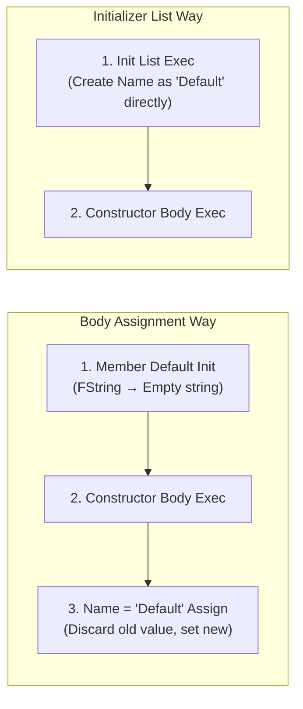
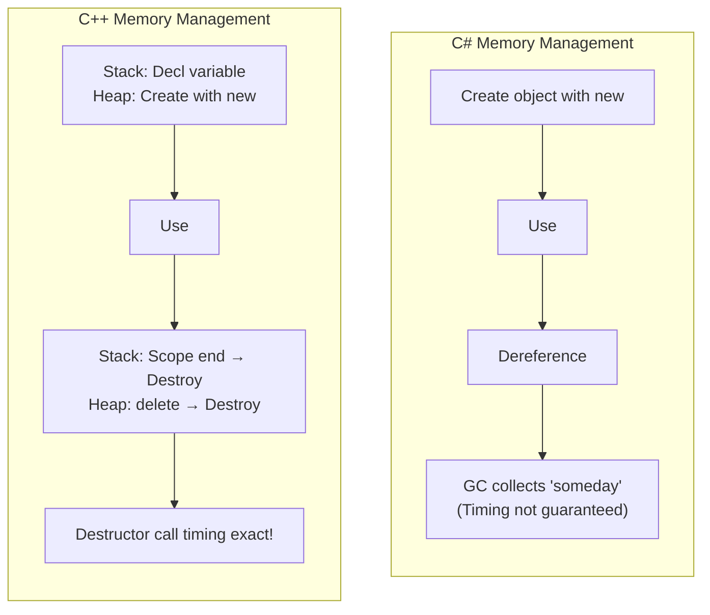
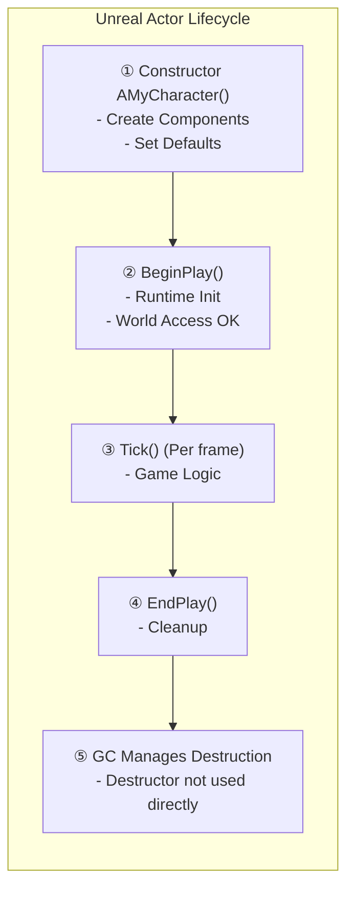

## Can You Read This Code?

When you open a character class in an Unreal project, you see something like this.

```cpp
// MyCharacter.h
UCLASS()
class MYGAME_API AMyCharacter : public ACharacter
{
    GENERATED_BODY()

public:
    AMyCharacter();

protected:
    virtual void BeginPlay() override;

private:
    UPROPERTY(VisibleAnywhere)
    UStaticMeshComponent* WeaponMesh;

    UPROPERTY(EditDefaultsOnly)
    float MaxHealth = 100.f;

    float CurrentHealth;
};

// MyCharacter.cpp
AMyCharacter::AMyCharacter()
{
    PrimaryActorTick.bCanEverTick = true;

    WeaponMesh = CreateDefaultSubobject<UStaticMeshComponent>(TEXT("WeaponMesh"));
    WeaponMesh->SetupAttachment(GetMesh(), TEXT("hand_r"));
}

void AMyCharacter::BeginPlay()
{
    Super::BeginPlay();
    CurrentHealth = MaxHealth;
}
```

If you are a Unity developer, you might have these questions:

- `AMyCharacter()` — I know it's a constructor, but can I omit `public` unlike C#?
- `AMyCharacter::AMyCharacter()` — What is this `::` appearing twice?
- `CreateDefaultSubobject<T>(TEXT("..."))` — Why use this instead of `new` in constructor?
- Where is `~AMyCharacter()`? Is it okay without a destructor?
- `float MaxHealth = 100.f` — Initializing member variable right at declaration? Is it same as C#?

**In this lecture, we completely summarize C++ class constructor/destructor rules.**

---

## Introduction - Why C++ Class is Different from C#

In C#, creating a class is convenient. `this.health = 100` in the constructor is enough, and you rarely use destructors (finalizers). GC (Garbage Collector) manages memory automatically.

C++ is different. **Developer manages object creation and destruction directly.** So C++ has concepts not in C#:

- **Initializer List** — Syntax to "initialize" members rather than "assign".
- **Destructor** — Cleanup function **guaranteed to be called** when object is destroyed.
- **Copy Constructor** — Special constructor called when copying an object.
- **Access Specifier** — `private` is default (C# defaults to `private` too, but struct differs).


---

## 1. Class Declaration and Definition - Separating .h and .cpp

The header/source separation learned in Lecture 2 applies to classes too. In C#, declaration and implementation are in one file, but in C++, **declaration (header) and definition (source) are separated**.

```cpp
// Weapon.h — Declaration (What this class has)
class Weapon
{
public:
    Weapon();                         // Constructor Declaration
    ~Weapon();                        // Destructor Declaration
    void Fire();                      // Member Function Declaration
    int32 GetAmmo() const;            // const Member Function Declaration

private:
    int32 Ammo;
    float Damage;
};

// Weapon.cpp — Definition (How it actually works)
Weapon::Weapon()           // ← ClassName::FunctionName
    : Ammo(30)             // ← Initializer List (Core of this lecture!)
    , Damage(10.0f)
{
    // Constructor Body
}

Weapon::~Weapon()
{
    // Destructor Body — Cleanup
}

void Weapon::Fire()
{
    if (Ammo > 0)
    {
        --Ammo;
    }
}

int32 Weapon::GetAmmo() const
{
    return Ammo;
}
```

Comparing with C#:

```csharp
// C# — Write everything in one file
public class Weapon
{
    private int ammo;
    private float damage;

    public Weapon()       // Constructor
    {
        ammo = 30;
        damage = 10.0f;
    }
    // Destructor? Rarely used

    public void Fire()
    {
        if (ammo > 0) ammo--;
    }

    public int GetAmmo() => ammo;
}
```

| Feature | C# | C++ |
|------|-----|-----|
| Declaration Location | Inside class (All) | `.h` file (Declaration only) |
| Implementation Location | Inside class (All) | `.cpp` file (With `ClassName::`) |
| Access Specifier | `public` / `private` per member | `public:` / `private:` per block |
| Default Access | `private` (member) | `private` (class), `public` (struct) |

> **💬 Wait, Let's Know This**
>
> **Q. What is `::` in `Weapon::Fire()`?**
>
> It is the **Scope Resolution Operator**. It means "This `Fire()` function belongs to `Weapon` class." It is mandatory when defining member functions in `.cpp`.
> ```cpp
> Weapon::Fire()      // Fire function of Weapon class
> Enemy::Fire()       // Fire function of Enemy class (Same name in different class!)
> ```
>
> **Q. Must short functions be separated to `.cpp` too?**
>
> No. Short functions can be implemented directly in header (Inline functions). But **in Unreal, most are separated to `.cpp`.** Especially `UCLASS` member functions are conventionally written in `.cpp`.

---

## 2. Constructor - When Object is Born

### 2-1. Default Constructor

```cpp
class FCharacterStats
{
public:
    // Default Constructor — No parameters
    FCharacterStats()
    {
        Health = 100.0f;
        Mana = 50.0f;
        Level = 1;
    }

private:
    float Health;
    float Mana;
    int32 Level;
};

// Usage
FCharacterStats Stats;  // Constructor auto-called → Health=100, Mana=50, Level=1
```

Almost same as C#. But in C++, **constructor is called just by declaring a variable without `new`.**

```csharp
// C# — class needs new
CharacterStats stats = new CharacterStats();

// C# — struct possible without new
Vector3 pos;  // Default (0, 0, 0)
```

```cpp
// C++ — class or struct, created in stack without new
FCharacterStats Stats;   // Created in stack, constructor called
FVector Pos;             // Created in stack, default (0, 0, 0)
```

### 2-2. Parameterized Constructor

```cpp
class FCharacterStats
{
public:
    // Default Constructor
    FCharacterStats()
        : Health(100.0f), Mana(50.0f), Level(1)
    {
    }

    // Parameterized Constructor
    FCharacterStats(float InHealth, float InMana, int32 InLevel)
        : Health(InHealth), Mana(InMana), Level(InLevel)
    {
    }

private:
    float Health;
    float Mana;
    int32 Level;
};

// Usage
FCharacterStats DefaultStats;                 // Default constructor → 100, 50, 1
FCharacterStats BossStats(5000.0f, 200.0f, 50); // Parameterized constructor
```

Comparing with C#:

```csharp
// C#
CharacterStats bossStats = new CharacterStats(5000f, 200f, 50);
```

| C# | C++ | Description |
|----|-----|------|
| `new ClassName()` | `ClassName VarName;` | Default creation (No new in C++!) |
| `new ClassName(args)` | `ClassName VarName(args);` | Parameterized creation |
| `new ClassName()` (Heap) | `new ClassName()` (Heap) | Heap allocation (Both use new) |

> **💬 Wait, Let's Know This**
>
> **Q. When to use `new` in C++?**
>
> Use `new` in C++ **only when allocating to heap.** In C#, you always use `new` for class types, but in C++, stack allocation (without new) is default, and use `new` only when heap is needed.
> ```cpp
> FCharacterStats StackStats;              // Stack (Auto released when function ends)
> FCharacterStats* HeapStats = new FCharacterStats();  // Heap (Must manually delete)
> ```
> However, **in Unreal, direct use of `new` is rare.** `UObject` family uses `NewObject<T>()` or `CreateDefaultSubobject<T>()`, and memory is managed by GC. This is covered in Lecture 9.

---

## 3. Initializer List - Core Syntax Not in C#

### 3-1. What is Initializer List?

This is the most important content of this lecture. Since it's syntax not in C#, it can be confusing at first.

```cpp
class FWeaponData
{
public:
    // ❌ Assignment in Constructor Body (Works but inefficient)
    FWeaponData()
    {
        Name = TEXT("Default");   // "Assignment" — Changing value after default initialization
        Damage = 10.0f;
        Ammo = 30;
    }

    // ✅ Using Initializer List (Efficient, Recommended in C++)
    FWeaponData()
        : Name(TEXT("Default"))    // "Initialization" — Created with this value from start
        , Damage(10.0f)
        , Ammo(30)
    {
        // Body can be empty
    }

private:
    FString Name;
    float Damage;
    int32 Ammo;
};
```

Difference seems subtle but is important:



**Body Assignment**: Member is created with default value first, then overwritten in constructor. Doing work twice.
**Initializer List**: Member is created with desired value from the beginning. Doing work once.

### 3-2. When Initializer List is Mandatory

Besides performance, there are cases where **Initializer List MUST be used**.

```cpp
class FPlayerConfig
{
public:
    FPlayerConfig(const FString& InName, int32 InID)
        : PlayerName(InName)    // const member → Init list mandatory
        , PlayerID(InID)        // const member → Init list mandatory
        , HealthRef(InternalHP) // Reference member → Init list mandatory
    {
        // PlayerName = InName;  // ❌ Compile Error! const cannot be assigned
        // PlayerID = InID;      // ❌ Compile Error!
    }

private:
    const FString PlayerName;   // const member
    const int32 PlayerID;       // const member
    float InternalHP = 100.0f;
    float& HealthRef;           // Reference member
};
```

| Situation | Init List | Body Assign | Reason |
|------|-------------|----------|------|
| `const` Member | **Mandatory** | ❌ Impossible | const cannot be changed after initialization |
| Reference (`&`) Member | **Mandatory** | ❌ Impossible | Reference must be bound at declaration |
| Type without Default Constructor | **Mandatory** | ❌ Impossible | Cannot be created with default value first |
| `FString`, `FVector`, etc. | Recommended | Possible (Inefficient) | Prevent double initialization |
| `int32`, `float`, etc. | Recommended | Possible | Habitually use init list |

### 3-3. C++11 In-class Initializer

Since C++11, you can **specify default value at declaration** like C#. Unreal uses this often too.

```cpp
class AMyCharacter : public ACharacter
{
private:
    // C++11 In-class Initializer — Specify default value at declaration
    float MaxHealth = 100.0f;          // ✅ C++11 Style
    float CurrentHealth = 0.0f;
    int32 Level = 1;
    bool bIsAlive = true;
    FString CharacterName = TEXT("Default");

    // This way, no separate initialization needed in constructor
};
```

This syntax is same as field initialization in C#:

```csharp
// C#
public class MyCharacter : MonoBehaviour
{
    private float maxHealth = 100f;    // Same pattern
    private float currentHealth = 0f;
    private int level = 1;
    private bool isAlive = true;
}
```

**Priority**: Initializer List > In-class Initializer (Default). If value exists in constructor initializer list, in-class initialization is ignored.

```cpp
class FWeaponData
{
public:
    FWeaponData()
        : Ammo(50)       // Initializer list priority → Ammo is 50
    {
    }

private:
    int32 Ammo = 30;     // In-class init (Default 30, but overwritten by init list)
};
```

> **💬 Wait, Let's Know This**
>
> **Q. Init List vs In-class Init, which one to use?**
>
> Pattern widely used in Unreal code:
> - **Fixed default value** → In-class Init (`float MaxHP = 100.f;`)
> - **Value received via constructor parameters** → Initializer List
> - **Value to change in editor via `UPROPERTY(EditDefaultsOnly)`** → In-class Init
>
> In practice, mix both.
>
> **Q. Is member order in Init List important?**
>
> **Yes, very important!** Regardless of Init List order, **members are initialized in order of declaration.** Compiler may warn, so match Init List order with declaration order.
> ```cpp
> class Example
> {
>     int32 A;    // Decl order 1
>     int32 B;    // Decl order 2
>
> public:
>     Example()
>         : B(10)    // ⚠️ B written first, but A is initialized first!
>         , A(B)     // Danger: At initialization of A, B is not initialized yet
>     {
>     }
> };
> ```

---

## 4. Destructor - When Object Dies

### 4-1. Basics of Destructor

In C#, you rarely use destructor (finalizer, `~ClassName()`) directly. GC cleans memory, and resource cleanup is done via `IDisposable.Dispose()`.

In C++, destructor is a **core mechanism**.

```cpp
class FTextureCache
{
public:
    FTextureCache()
    {
        // Allocate resource in constructor
        Buffer = new uint8[1024 * 1024];  // 1MB buffer
        UE_LOG(LogTemp, Display, TEXT("TextureCache Created: Buffer Allocated"));
    }

    ~FTextureCache()
    {
        // Release resource in destructor — Mandatory!
        delete[] Buffer;
        Buffer = nullptr;
        UE_LOG(LogTemp, Display, TEXT("TextureCache Destroyed: Buffer Released"));
    }

private:
    uint8* Buffer;
};

// Usage
void LoadLevel()
{
    FTextureCache Cache;     // Constructor called → Buffer allocated
    // ... Texture work ...
}   // ← Function end → Cache Destructor auto called → Buffer released!
```

**Core: C++ destructor call timing is guaranteed.** Stack variables execute destructor immediately when out of scope, `delete` executes destructor immediately. Not "someday" like C# GC.



Comparing with C#:

| Feature | C# | C++ |
|------|-----|-----|
| Destructor Syntax | `~ClassName()` | `~ClassName()` |
| Call Timing | **Decided by GC** (Not guaranteed) | **Immediate** (Scope end or delete) |
| Resource Cleanup | `IDisposable.Dispose()` | Directly in Destructor |
| Usage Frequency | Rarely used | **Very Often** |
| RAII Pattern | None (Replaced by `using`) | Core pattern of C++ |

### 4-2. RAII - C++ Resource Management Philosophy

In C++, the pattern of **acquiring resources in constructor and releasing in destructor** is called RAII (Resource Acquisition Is Initialization). Similar purpose to C# `using` statement, but built-in core pattern in C++.

```cpp
// C++ — RAII Pattern
void ProcessFile()
{
    FFileHelper FileReader(TEXT("data.txt"));  // Constructor → Open file
    FileReader.ReadAll();                       // Use
}   // ← Scope end → Destructor auto called → Close file (Automatic!)
```

```csharp
// C# — Similar effect with using statement
void ProcessFile()
{
    using (var reader = new StreamReader("data.txt"))  // Open
    {
        reader.ReadToEnd();  // Use
    }   // ← using end → Dispose() called → Close file
}
```

Thanks to RAII, **resource leaks are prevented at source** in C++. Even if exception occurs, stack unwinding ensures destructor is called.

> **💬 Wait, Let's Know This**
>
> **Q. In C#, `~ClassName()` is finalizer, is it same as C++?**
>
> Syntax is same, meaning completely different.
> - **C# Finalizer**: Called when GC collects. Timing not guaranteed. Performance cost. Rarely used.
> - **C++ Destructor**: Called **immediately** when object destroyed. Timing guaranteed. Core of RAII. Often used.
>
> **Q. What do we do in destructor usually?**
>
> Release memory allocated with `new` in constructor (`delete`), close file handles, end network connections, unbind events, etc. **"What obtained in constructor is returned in destructor"** is the principle.

### 4-3. Copy Constructor and Special Member Functions (Preview)

We mentioned **Copy Constructor** in intro. Important concept along with destructor, but just a taste here.

```cpp
class FBuffer
{
public:
    FBuffer(int32 InSize) : Size(InSize)
    {
        Data = new uint8[Size];
    }

    // Copy Constructor — Called when copying object
    FBuffer(const FBuffer& Other) : Size(Other.Size)
    {
        Data = new uint8[Size];                    // Allocate new memory
        FMemory::Memcpy(Data, Other.Data, Size);   // Copy content
    }

    ~FBuffer()
    {
        delete[] Data;
    }

private:
    uint8* Data;
    int32 Size;
};

FBuffer A(1024);
FBuffer B = A;    // Copy Constructor called → B is copy of A
```

**C# has no such worry.** Because of GC. In C++, if using destructor manually, you must care about copy constructor too. This is called **Rule of Three** (Destructor, Copy Constructor, Copy Assignment Operator managed as a set). Details in Lecture 9.

In Unreal code, you often see `= default` and `= delete`:

```cpp
class FMySystem
{
public:
    FMySystem() = default;                           // Use compiler default constructor
    ~FMySystem() = default;                          // Use compiler default destructor

    FMySystem(const FMySystem&) = delete;            // ❌ Copy Prohibited!
    FMySystem& operator=(const FMySystem&) = delete; // ❌ Copy Assignment Prohibited!
};

FMySystem A;
// FMySystem B = A;  // ❌ Compile Error! Copy deleted
```

| Keyword | Meaning | C# Counterpart |
|--------|------|---------|
| `= default` | "Compiler, generate default for me" | None (Always auto) |
| `= delete` | "This function is prohibited" | None (Restrict via access modifier) |

> **💬 Wait, Let's Know This**
>
> **Q. Why prohibit copy?**
>
> Objects like Singleton or System Managers **should not be copied**. In C#, this is kept by convention, but in C++, enforced at **compile time** with `= delete`. Inheriting Unreal's `FNoncopyable` has same effect.

---

## 5. this Pointer - How to Point to Self

Same concept as C# `this`, but **pointer** in C++.

```cpp
class AWeapon
{
public:
    void SetOwner(ACharacter* InOwner)
    {
        // this is pointer to self
        Owner = InOwner;

        // Can use this-> explicitly
        this->Owner = InOwner;  // Same as above

        // Pass this to another function
        InOwner->EquipWeapon(this);  // "Equip me (weapon)"
    }

private:
    ACharacter* Owner;
};
```

Comparison with C#:

| Feature | C# | C++ |
|------|-----|-----|
| Type | Reference (`this`) | **Pointer** (`this`) |
| Member Access | `this.member` | `this->member` |
| Self Passing | `SomeFunc(this)` | `SomeFunc(this)` |
| Omittable | Mostly omitted | Mostly omitted |
| Nullable | Impossible | **Theoretically possible** (but shouldn't happen) |

```cpp
// C++ — this is pointer, so use ->
this->Health = 100;      // Explicit
Health = 100;             // Implicit (Usually used)

// C# — this is reference, so use .
this.health = 100;       // Explicit
health = 100;             // Implicit
```

> **💬 Wait, Let's Know This**
>
> **Q. When to use `this->` explicitly?**
>
> Usually not needed. But used to distinguish **when parameter name and member name are same**. But Unreal avoids this by attaching `In` prefix to parameters:
> ```cpp
> void SetHealth(float InHealth)     // ✅ Unreal Style: In prefix
> {
>     Health = InHealth;             // No confusion
> }
> ```

---

## 6. Access Specifiers and struct vs class

### 6-1. Access Specifiers

Almost same as C#, but syntax differs slightly.

```cpp
class AMyCharacter
{
public:           // All public below
    void Attack();
    void Jump();

protected:        // All protected below
    float Health;
    float Mana;

private:          // All private below
    int32 SecretID;
    FString Password;
};
```

In C#, you attach specifier to each member, but in C++, you specify per **block**.

| Specifier | C++ | C# | Scope |
|------------|-----|-----|---------|
| `public` | Same | Same | Accessible anywhere |
| `protected` | Same | Same | Self + Derived classes |
| `private` | Same | Same | Self only |
| `internal` | **None** | Exists | (C#) Within assembly |
| `friend` | **Exists** | None | (C++) Allow private access to specific class/function |

### 6-2. struct vs class - Shocking Truth

In C#, `struct` and `class` are **completely different types**. `struct` is Value type (Stack), `class` is Reference type (Heap). Inheritance not allowed, default constructor differs.

In C++... **Almost the same.**

```cpp
// C++ — Only difference between struct and class: Default Access Specifier
struct FPlayerData
{
    // Default public from here
    FString Name;
    int32 Level;
};

class FPlayerData2
{
    // Default private from here
    FString Name;
    int32 Level;
};

// Above two differ only in default access, rest same!
// Both can inherit, have constructor/destructor, have member functions
```

| Feature | C# struct | C# class | C++ struct | C++ class |
|------|-----------|----------|------------|-----------|
| Default Access | - | `private` | **`public`** | `private` |
| Memory | Stack (Value) | Heap (Reference) | **Anywhere** | **Anywhere** |
| Inheritance | ❌ No | ✅ Yes | **✅ Yes** | ✅ Yes |
| Destructor | ❌ No | ✅ Yes | **✅ Yes** | ✅ Yes |
| GC | N/A | GC Managed | **None** | None |

**Convention in Unreal:**
- `struct` → Data Bundle (POD, no components). `F` prefix. Ex: `FVector`, `FHitResult`, `FInventorySlot`
- `class` → Object with behavior. `A`, `U`, `F` prefixes. Ex: `AActor`, `UActorComponent`

```cpp
// Unreal Convention: Struct with data only is struct + F prefix
USTRUCT(BlueprintType)
struct FItemData
{
    GENERATED_BODY()

    UPROPERTY(EditAnywhere)
    FString ItemName;

    UPROPERTY(EditAnywhere)
    int32 ItemPrice;

    UPROPERTY(EditAnywhere)
    float ItemWeight;
};

// Unreal Convention: Things with behavior are class
UCLASS()
class AWeaponActor : public AActor
{
    GENERATED_BODY()
    // ...
};
```

> **💬 Wait, Let's Know This**
>
> **Q. Why use struct in C++ then?**
>
> Default access is `public`, so convenient for data-only structures. No need to write `public:`. In Unreal, `struct` is used to express intention **"This is pure data"**.
>
> **Q. C# struct is value type, what about C++?**
>
> In C++, both `struct` and `class` can go to stack or heap **depending on declaration location**. No Value/Reference type distinction.
> ```cpp
> FVector Pos;                // Stack (Works like value)
> FVector* Pos2 = new FVector(); // Heap (Access via pointer)
> ```

---

## 7. Dissecting Real Unreal Code

Analyzing the character code from the beginning line by line.

```cpp
// MyCharacter.h
UCLASS()
class MYGAME_API AMyCharacter : public ACharacter  // ① Inherit ACharacter
{
    GENERATED_BODY()  // ② Unreal Macro (Generate reflection code)

public:
    AMyCharacter();   // ③ Constructor Declaration (No params)

protected:
    virtual void BeginPlay() override;  // ④ Override parent function (Details in Lecture 6)

private:
    UPROPERTY(VisibleAnywhere)          // ⑤ Visible in Editor (Details in Lecture 7)
    UStaticMeshComponent* WeaponMesh;   // Pointer = Can be nullptr

    UPROPERTY(EditDefaultsOnly)
    float MaxHealth = 100.f;            // ⑥ Member Initialization (C++11)

    float CurrentHealth;                // ⑦ Not initialized → Set in BeginPlay
};
```

```cpp
// MyCharacter.cpp
AMyCharacter::AMyCharacter()  // ⑧ Constructor Definition (ClassName::ClassName)
{
    PrimaryActorTick.bCanEverTick = true;  // ⑨ Enable Tick per frame

    // ⑩ Component Creation (Unreal replacement for new)
    WeaponMesh = CreateDefaultSubobject<UStaticMeshComponent>(TEXT("WeaponMesh"));
    WeaponMesh->SetupAttachment(GetMesh(), TEXT("hand_r"));
    // → Attach WeaponMesh to mesh socket "hand_r"
}

void AMyCharacter::BeginPlay()  // ⑪ Called at game start
{
    Super::BeginPlay();          // ⑫ Call parent BeginPlay first (Important!)
    CurrentHealth = MaxHealth;   // ⑬ Runtime Initialization
}
```

| No. | Pattern | Meaning |
|------|------|------|
| ③ | `AMyCharacter()` | Default Constructor (Unreal Actor uses parameterless constructor) |
| ⑥ | `float MaxHealth = 100.f` | Member Initialization — Default value changeable in Editor |
| ⑧ | `AMyCharacter::AMyCharacter()` | Constructor definition in `.cpp` (`::` = Scope resolution) |
| ⑩ | `CreateDefaultSubobject<T>()` | Component creation function for constructor (Use instead of `new`) |
| ⑫ | `Super::BeginPlay()` | Call parent class function (Equivalent to C#'s `base.`) |
| ⑬ | `CurrentHealth = MaxHealth` | Runtime initialization (Since MaxHealth can be changed in Editor) |

**Unreal Constructor Characteristics:**
- Called when creating Blueprint CDO (Class Default Object) in Editor
- Called before game start, so `GetWorld()` might be invalid
- So **runtime initialization is done in `BeginPlay()`**
- Destructor rarely needed — `UObject` family managed by GC



---

## 8. Common Mistakes & Precautions

### Mistake 1: Forgetting Member Initialization

```cpp
class FWeaponData
{
public:
    FWeaponData() {}   // Do nothing in constructor

    float GetDamage() const { return Damage; }

private:
    float Damage;      // ❌ Not initialized → Garbage value!
    int32 Ammo;        // ❌ C# auto-inits to 0, but C++ doesn't!
};
```

In C#, fields are automatically initialized to 0/null/false. **In C++, uninitialized variables have garbage values.** Must initialize.

```cpp
// ✅ Init with Initializer List
FWeaponData() : Damage(0.0f), Ammo(0) {}

// ✅ Or Member Initialization
float Damage = 0.0f;
int32 Ammo = 0;
```

### Mistake 2: Forgetting Release in Destructor

```cpp
class FParticlePool
{
public:
    FParticlePool()
    {
        Particles = new FParticle[100];  // Heap allocation
    }

    // ❌ No Destructor → Memory Leak!
    // Without destructor, Particles never released

    // ✅ Release in Destructor
    ~FParticlePool()
    {
        delete[] Particles;
        Particles = nullptr;
    }

private:
    FParticle* Particles;
};
```

**Rule: If `new` exists, corresponding `delete` must be in destructor.** (But using smart pointers eliminates this — covered in Lecture 9.)

### Mistake 3: Initializer List Order Mismatch

```cpp
class FStats
{
    float MaxHP;       // Decl Order 1
    float CurrentHP;   // Decl Order 2

public:
    FStats(float InMaxHP)
        : CurrentHP(MaxHP)   // ⚠️ MaxHP not initialized yet at this point!
        , MaxHP(InMaxHP)     // MaxHP initialized here, but too late
    {
    }
};
```

Initialization happens in **Declaration Order (MaxHP → CurrentHP)**. Not Initializer List order! Compiler gives warning — do not ignore.

```cpp
// ✅ Match declaration order and init list order
FStats(float InMaxHP)
    : MaxHP(InMaxHP)          // Decl Order 1 → Init first
    , CurrentHP(MaxHP)        // Decl Order 2 → MaxHP usable!
{
}
```

### Mistake 4: Running Game Logic in Unreal Constructor

```cpp
AMyCharacter::AMyCharacter()
{
    // ❌ Access World/Other Actor in Constructor
    AActor* Target = GetWorld()->SpawnActor(...);  // Dangerous! GetWorld() might be invalid

    // ❌ Set Timer
    GetWorldTimerManager().SetTimer(...);  // Dangerous!
}

void AMyCharacter::BeginPlay()
{
    Super::BeginPlay();

    // ✅ World related work in BeginPlay
    AActor* Target = GetWorld()->SpawnActor(...);  // Safe!
    GetWorldTimerManager().SetTimer(...);          // Safe!
}
```

**Use Unreal Constructor only for "Setting Defaults and Creating Components".** Game logic in `BeginPlay()`.

---

## Summary - Lecture 5 Checklist

After this lecture, you should be able to read the following in Unreal code:

- [ ] Know `ClassName::ClassName()` is constructor definition
- [ ] Know `ClassName::~ClassName()` is destructor definition
- [ ] Know meaning of `: Member(Value)` initializer list
- [ ] Know why initializer list is more efficient than body assignment
- [ ] Know `const` and reference members require initializer list
- [ ] Read member initialization like `float MaxHP = 100.f` (C++11)
- [ ] Know `this` is a pointer (`this->`) in C++
- [ ] Know `struct` and `class` only differ in default access specifier
- [ ] Know Unreal convention: `struct` = Data (F prefix), `class` = Behavior (A/U prefix)
- [ ] Know C++ member variables are not auto-initialized
- [ ] Know `CreateDefaultSubobject<T>()` is how to create components in Unreal constructor
- [ ] Know why game logic shouldn't be in Unreal constructor (→ Use BeginPlay)
- [ ] Know what copy constructor is (Rule of Three)
- [ ] Know meaning of `= default` and `= delete`

---

## Next Lecture Preview

**Lecture 6: Inheritance and Polymorphism - Real Meaning of virtual**

In C#, `virtual` and `override` are occasionally used keywords. In C++, they are **core of polymorphism and skeleton of Unreal code**. We cover exactly what `virtual void BeginPlay() override;` means, why destructor needs `virtual`, and hidden mechanism called VTable. You will also learn `Super::BeginPlay()` is same as C#'s `base.BeginPlay()`.
