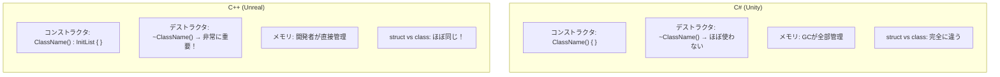
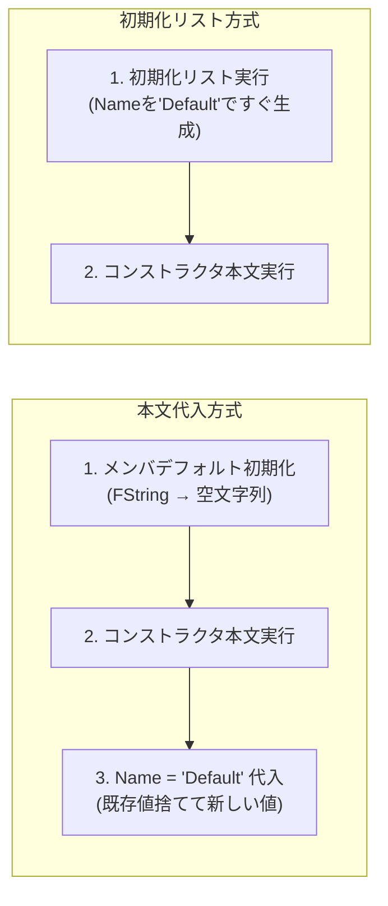
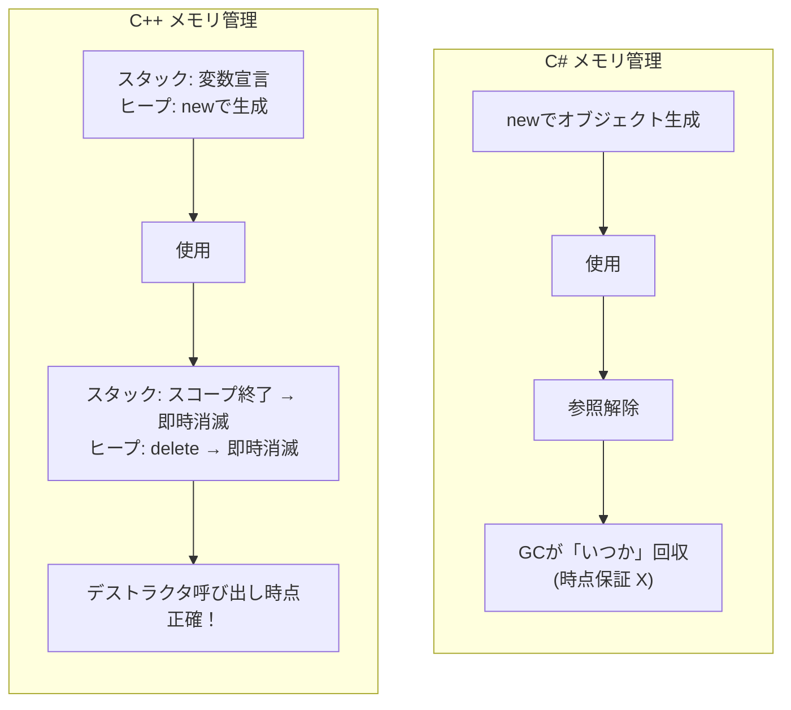
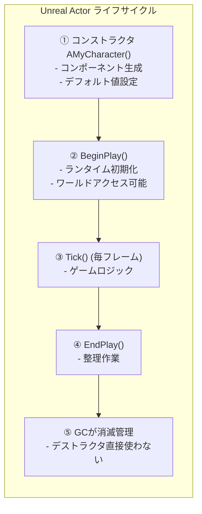

## このコード、読めますか？

Unrealプロジェクトでキャラクタークラスを開くと、こんなのが出てきます。

```cpp
// MyCharacter.h
UCLASS()
class MYGAME_API AMyCharacter : public ACharacter
{
    GENERATED_BODY()

public:
    AMyCharacter();

protected:
    virtual void BeginPlay() override;

private:
    UPROPERTY(VisibleAnywhere)
    UStaticMeshComponent* WeaponMesh;

    UPROPERTY(EditDefaultsOnly)
    float MaxHealth = 100.f;

    float CurrentHealth;
};

// MyCharacter.cpp
AMyCharacter::AMyCharacter()
{
    PrimaryActorTick.bCanEverTick = true;

    WeaponMesh = CreateDefaultSubobject<UStaticMeshComponent>(TEXT("WeaponMesh"));
    WeaponMesh->SetupAttachment(GetMesh(), TEXT("hand_r"));
}

void AMyCharacter::BeginPlay()
{
    Super::BeginPlay();
    CurrentHealth = MaxHealth;
}
```

Unity開発者なら、こんな疑問が湧くでしょう：

- `AMyCharacter()` — コンストラクタなのはわかるけど、C#のように `public` を付けなくてもいいの？
- `AMyCharacter::AMyCharacter()` — `::` が二回出てくる文法は何？
- `CreateDefaultSubobject<T>(TEXT("..."))` — コンストラクタで `new` の代わりにこれを使うのはなぜ？
- `~AMyCharacter()` はどこ？ デストラクタがなくてもいいの？
- `float MaxHealth = 100.f` — メンバ変数を宣言しながらすぐ初期化？ C#と同じ？

**今回の講義でC++クラスのコンストラクタ/デストラクタ規則を完全に整理します。**

---

## 序論 - なぜC++クラスがC#と違うのか

C#でクラスを作るのは楽です。コンストラクタで `this.health = 100` を書けば終わりで、デストラクタ（ファイナライザ）はほぼ使うことがありません。GC（ガベージコレクタ）がメモリを勝手に整理してくれるからです。

C++は違います。**開発者がオブジェクトの生成と消滅を直接管理します。** だからC++にはC#にない概念があります：

- **初期化リスト** — メンバを「代入」ではなく「初期化」する文法
- **デストラクタ** — オブジェクトが破壊されるとき **必ず呼び出される** 整理関数
- **コピーコンストラクタ** — オブジェクトをコピーするとき呼び出される特別なコンストラクタ
- **アクセス指定子** — `private` がデフォルト値（C#は `private` が基本だが、structは違う）



---

## 1. クラス宣言と定義 - .hと.cpp分離

第2講で学んだヘッダー/ソース分離がクラスにも適用されます。C#では一つのファイルに宣言と実装をすべて書きますが、C++では **宣言（ヘッダー）と定義（ソース）を分離** します。

```cpp
// Weapon.h — 宣言 (このクラスが何を持っているか)
class Weapon
{
public:
    Weapon();                         // コンストラクタ宣言
    ~Weapon();                        // デストラクタ宣言
    void Fire();                      // メンバ関数宣言
    int32 GetAmmo() const;            // constメンバ関数宣言

private:
    int32 Ammo;
    float Damage;
};

// Weapon.cpp — 定義 (実際にどう動作するか)
Weapon::Weapon()           // ← ClassName::FunctionName
    : Ammo(30)             // ← 初期化リスト (今回の核心！)
    , Damage(10.0f)
{
    // コンストラクタ本文
}

Weapon::~Weapon()
{
    // デストラクタ本文 — 整理作業
}

void Weapon::Fire()
{
    if (Ammo > 0)
    {
        --Ammo;
    }
}

int32 Weapon::GetAmmo() const
{
    return Ammo;
}
```

C#と比較すると：

```csharp
// C# — 一つのファイルに全部作成
public class Weapon
{
    private int ammo;
    private float damage;

    public Weapon()       // コンストラクタ
    {
        ammo = 30;
        damage = 10.0f;
    }
    // デストラクタ？ ほぼ使わない

    public void Fire()
    {
        if (ammo > 0) ammo--;
    }

    public int GetAmmo() => ammo;
}
```

| 項目 | C# | C++ |
|------|-----|-----|
| 宣言位置 | クラスの中に全部 | `.h` ファイル (宣言のみ) |
| 実装位置 | クラスの中に全部 | `.cpp` ファイル (`ClassName::`付けて) |
| アクセス指定子 | メンバごとに `public` / `private` など | `public:` / `private:` ブロック単位 |
| 基本アクセス指定子 | `private` (メンバ) | `private` (class), `public` (struct) |

> **💬 ちょっと一言、これだけは知っておこう**
>
> **Q. `Weapon::Fire()` で `::` は何ですか？**
>
> **範囲指定演算子(scope resolution operator)** です。「この `Fire()` 関数は `Weapon` クラスに属する」という意味です。`.cpp` ファイルでメンバ関数を定義するとき必ず必要です。
> ```cpp
> Weapon::Fire()      // WeaponクラスのFire関数
> Enemy::Fire()       // EnemyクラスのFire関数 (違うクラスの同じ名前！)
> ```
>
> **Q. 短い関数も `.cpp` に分離する必要がありますか？**
>
> いいえ。短い関数はヘッダーに直接実装できます（インライン関数）。しかし **Unrealではほとんど `.cpp` に分離** します。特に `UCLASS` メンバ関数は `.cpp` に書くのが慣例です。

---

## 2. コンストラクタ - オブジェクトが生まれるとき

### 2-1. デフォルトコンストラクタ

```cpp
class FCharacterStats
{
public:
    // デフォルトコンストラクタ — パラメータなし
    FCharacterStats()
    {
        Health = 100.0f;
        Mana = 50.0f;
        Level = 1;
    }

private:
    float Health;
    float Mana;
    int32 Level;
};

// 使用
FCharacterStats Stats;  // コンストラクタ自動呼び出し → Health=100, Mana=50, Level=1
```

C#とほぼ同じです。ただしC++では **`new` なしに変数を宣言するだけでコンストラクタが呼び出されます。**

```csharp
// C# — classはnew必須
CharacterStats stats = new CharacterStats();

// C# — structはnewなしでも可能
Vector3 pos;  // デフォルト値(0, 0, 0)
```

```cpp
// C++ — classでもstructでもnewなしで宣言すればスタックに生成
FCharacterStats Stats;   // スタックに生成、コンストラクタ呼び出し
FVector Pos;             // スタックに生成、デフォルト値(0, 0, 0)
```

### 2-2. パラメータがあるコンストラクタ

```cpp
class FCharacterStats
{
public:
    // デフォルトコンストラクタ
    FCharacterStats()
        : Health(100.0f), Mana(50.0f), Level(1)
    {
    }

    // パラメータがあるコンストラクタ
    FCharacterStats(float InHealth, float InMana, int32 InLevel)
        : Health(InHealth), Mana(InMana), Level(InLevel)
    {
    }

private:
    float Health;
    float Mana;
    int32 Level;
};

// 使用
FCharacterStats DefaultStats;                 // デフォルトコンストラクタ → 100, 50, 1
FCharacterStats BossStats(5000.0f, 200.0f, 50); // パラメータコンストラクタ
```

C#と比較すると：

```csharp
// C#
CharacterStats bossStats = new CharacterStats(5000f, 200f, 50);
```

| C# | C++ | 説明 |
|----|-----|------|
| `new ClassName()` | `ClassName VarName;` | デフォルト生成 (C++はnewなし！) |
| `new ClassName(args)` | `ClassName VarName(args);` | パラメータ生成 |
| `new ClassName()` (ヒープ) | `new ClassName()` (ヒープ) | ヒープ割り当て (両方new使用) |

> **💬 ちょっと一言、これだけは知っておこう**
>
> **Q. C++で `new` はいつ使いますか？**
>
> C++で `new` は **ヒープに割り当てるときだけ** 使用します。C#ではclass型に常に `new` を使いますが、C++ではスタック割り当て（newなし）が基本でヒープが必要なときだけ `new` を使います。
> ```cpp
> FCharacterStats StackStats;              // スタック (関数終われば自動解除)
> FCharacterStats* HeapStats = new FCharacterStats();  // ヒープ (直接delete必要)
> ```
> ただし **Unrealでは `new` を直接使うことがほぼありません。** `UObject` 系列は `NewObject<T>()` や `CreateDefaultSubobject<T>()` を使用し、メモリ管理はGCがします。これは第9講で詳しく扱います。

---

## 3. 初期化リスト - C#にない核心文法

### 3-1. 初期化リストとは？

今回の講義で最も重要な内容です。C#にはない文法なので初めて見ると戸惑うかもしれません。

```cpp
class FWeaponData
{
public:
    // ❌ コンストラクタ本文で代入 (動作はするが非効率)
    FWeaponData()
    {
        Name = TEXT("Default");   // 「代入」 — すでにデフォルト初期化された後で値を変える
        Damage = 10.0f;
        Ammo = 30;
    }

    // ✅ 初期化リスト使用 (効率的、C++推奨方式)
    FWeaponData()
        : Name(TEXT("Default"))    // 「初期化」 — 最初からこの値で生成
        , Damage(10.0f)
        , Ammo(30)
    {
        // 本文は空でもいい
    }

private:
    FString Name;
    float Damage;
    int32 Ammo;
};
```

違いが微妙に見えますが重要です：



**本文代入**: メンバが先にデフォルト値で生成された後、コンストラクタで再び値を上書きします。二度手間です。
**初期化リスト**: メンバが最初から望む値で生成されます。一度だけ働きます。

### 3-2. 初期化リストが必須の場合

性能差以外にも、**初期化リストを必ず使わなければならない場合** があります。

```cpp
class FPlayerConfig
{
public:
    FPlayerConfig(const FString& InName, int32 InID)
        : PlayerName(InName)    // constメンバ → 初期化リスト必須
        , PlayerID(InID)        // constメンバ → 初期化リスト必須
        , HealthRef(InternalHP) // 参照メンバ → 初期化リスト必須
    {
        // PlayerName = InName;  // ❌ コンパイルエラー！ constは代入不可
        // PlayerID = InID;      // ❌ コンパイルエラー！
    }

private:
    const FString PlayerName;   // constメンバ
    const int32 PlayerID;       // constメンバ
    float InternalHP = 100.0f;
    float& HealthRef;           // 参照メンバ
};
```

| 状況 | 初期化リスト | 本文代入 | 理由 |
|------|-------------|----------|------|
| `const` メンバ | **必須** | ❌ 不可 | constは初期化後変更不可 |
| 参照(`&`) メンバ | **必須** | ❌ 不可 | 参照は宣言時バインド必須 |
| デフォルトコンストラクタない型 | **必須** | ❌ 不可 | デフォルト値で先に生成できない |
| `FString`, `FVector` など | 推奨 | 可能 (非効率) | 二回初期化防止 |
| `int32`, `float` など | 推奨 | 可能 | 習慣的に初期化リスト使用 |

### 3-3. C++11 メンバ初期化 (In-class Initializer)

C++11からはC#のように **宣言と同時にデフォルト値を指定** できます。Unrealでもよく使います。

```cpp
class AMyCharacter : public ACharacter
{
private:
    // C++11 メンバ初期化 — 宣言時デフォルト値指定
    float MaxHealth = 100.0f;          // ✅ C++11スタイル
    float CurrentHealth = 0.0f;
    int32 Level = 1;
    bool bIsAlive = true;
    FString CharacterName = TEXT("Default");

    // こうすればコンストラクタで別途初期化しなくてもいい
};
```

この文法はC#のフィールド初期化と同じです：

```csharp
// C#
public class MyCharacter : MonoBehaviour
{
    private float maxHealth = 100f;    // 同じパターン
    private float currentHealth = 0f;
    private int level = 1;
    private bool isAlive = true;
}
```

**優先順位**: 初期化リスト > メンバ初期化（デフォルト値）。コンストラクタ初期化リストに値があればメンバ初期化は無視されます。

```cpp
class FWeaponData
{
public:
    FWeaponData()
        : Ammo(50)       // 初期化リストが優先 → Ammoは50
    {
    }

private:
    int32 Ammo = 30;     // メンバ初期化 (デフォルト30だが、初期化リストが上書き)
};
```

> **💬 ちょっと一言、これだけは知っておこう**
>
> **Q. 初期化リストとメンバ初期化、何を使うべきですか？**
>
> Unrealコードで実際によく使われるパターンはこうです：
> - **基本値が固定された場合** → メンバ初期化 (`float MaxHP = 100.f;`)
> - **コンストラクタパラメータで値を受け取る場合** → 初期化リスト
> - **`UPROPERTY(EditDefaultsOnly)` でエディタで変える値** → メンバ初期化
>
> 実務では二つを混ぜて使います。
>
> **Q. 初期化リストでメンバ順序が重要ですか？**
>
> **はい、非常に重要です！** 初期化リストの順序に関係なく、**メンバ変数が宣言された順序通りに初期化されます。** コンパイラが警告を出すことがあるので初期化リスト順序と宣言順序を合わせてください。
> ```cpp
> class Example
> {
>     int32 A;    // 宣言順序 1
>     int32 B;    // 宣言順序 2
>
> public:
>     Example()
>         : B(10)    // ⚠️ Bを先に書いたが、Aが先に初期化される！
>         , A(B)     // 危険: A初期化時点でBはまだ初期化されていない
>     {
>     }
> };
> ```

---

## 4. デストラクタ - オブジェクトが死ぬとき

### 4-1. デストラクタの基本

C#でデストラクタ（ファイナライザ、`~ClassName()`）を直接使うことはほぼありません。GCが勝手にメモリを整理し、リソース整理は `IDisposable.Dispose()` でします。

C++ではデストラクタが **核心メカニズム** です。

```cpp
class FTextureCache
{
public:
    FTextureCache()
    {
        // コンストラクタでリソース割り当て
        Buffer = new uint8[1024 * 1024];  // 1MBバッファ
        UE_LOG(LogTemp, Display, TEXT("TextureCache 生成: バッファ割り当て"));
    }

    ~FTextureCache()
    {
        // デストラクタでリソース解除 — 必ず！
        delete[] Buffer;
        Buffer = nullptr;
        UE_LOG(LogTemp, Display, TEXT("TextureCache 消滅: バッファ解除"));
    }

private:
    uint8* Buffer;
};

// 使用
void LoadLevel()
{
    FTextureCache Cache;     // コンストラクタ呼び出し → バッファ割り当て
    // ... テクスチャ作業 ...
}   // ← 関数終わり → Cacheデストラクタ自動呼び出し → バッファ解除！
```

**核心: C++デストラクタは呼び出し時点が正確に保証されます。** スタック変数はスコープを外れた直後、`delete` は呼び出し直後にデストラクタが実行されます。C#のGCのように「いつか」整理されるのではありません。



C#と比較すると：

| 項目 | C# | C++ |
|------|-----|-----|
| デストラクタ文法 | `~ClassName()` | `~ClassName()` |
| 呼び出し時点 | **GCが決定** (保証されない) | **即時** (スコープ終了 or delete) |
| リソース整理 | `IDisposable.Dispose()` | デストラクタで直接 |
| 使用頻度 | ほぼ使わない | **非常に頻繁に使う** |
| RAII パターン | なし (`using` 文で代替) | C++の核心パターン |

### 4-2. RAII - C++の資源管理哲学

C++では **コンストラクタで資源を獲得し、デストラクタで資源を解除** するパターンをRAII(Resource Acquisition Is Initialization)といいます。C#の `using` 文と似た目的ですが、C++では言語自体に内蔵された核心パターンです。

```cpp
// C++ — RAII パターン
void ProcessFile()
{
    FFileHelper FileReader(TEXT("data.txt"));  // コンストラクタ → ファイル開く
    FileReader.ReadAll();                       // 使用
}   // ← スコープ終了 → デストラクタ自動呼び出し → ファイル閉じる (自動！)
```

```csharp
// C# — using 文で似た効果
void ProcessFile()
{
    using (var reader = new StreamReader("data.txt"))  // 開く
    {
        reader.ReadToEnd();  // 使用
    }   // ← using 終了 → Dispose() 呼び出し → ファイル閉じる
}
```

RAIIのおかげでC++では **資源漏れが源泉的に防止** されます。例外が発生してもスタックが解けながら(stack unwinding)デストラクタが必ず呼び出されます。

> **💬 ちょっと一言、これだけは知っておこう**
>
> **Q. C#で `~ClassName()` はデストラクタ（ファイナライザ）ですが、C++と同じですか？**
>
> 文法は同じですが意味が完全に異なります。
> - **C# ファイナライザ**: GCが回収するとき呼び出し。時点保証 X。性能コストあり。ほぼ使わない。
> - **C++ デストラクタ**: オブジェクトが破壊されるとき **即時** 呼び出し。時点保証。RAIIの核心。よく使う。
>
> **Q. デストラクタで主に何をしますか？**
>
> コンストラクタで `new` で割り当てたメモリ解除(`delete`)、ファイルハンドル閉じる、ネットワーク連結終了、イベントバインディング解除などです。**「コンストラクタで得たものはデストラクタで返す」** が原則です。

### 4-3. コピーコンストラクタと特殊メンバ関数 (味見)

序論で **コピーコンストラクタ** に言及しました。デストラクタと共に知っておくべき重要な概念ですが、ここでは味見だけします。

```cpp
class FBuffer
{
public:
    FBuffer(int32 InSize) : Size(InSize)
    {
        Data = new uint8[Size];
    }

    // コピーコンストラクタ — オブジェクトをコピーするとき呼び出し
    FBuffer(const FBuffer& Other) : Size(Other.Size)
    {
        Data = new uint8[Size];                    // 新しいメモリ割り当て
        FMemory::Memcpy(Data, Other.Data, Size);   // 内容コピー
    }

    ~FBuffer()
    {
        delete[] Data;
    }

private:
    uint8* Data;
    int32 Size;
};

FBuffer A(1024);
FBuffer B = A;    // コピーコンストラクタ呼び出し → BはAのコピー
```

**C#ではこんな心配がありません。** GCがあるからです。C++ではデストラクタを直接使うクラスならコピーコンストラクタも気にする必要があります。これを **Rule of Three** といいます（デストラクタ、コピーコンストラクタ、コピー代入演算子をセットで管理）。詳細は第9講（メモリ管理）で扱います。

Unrealコードでは `= default` と `= delete` キーワードもよく見られます：

```cpp
class FMySystem
{
public:
    FMySystem() = default;                           // コンパイラ基本コンストラクタ使用
    ~FMySystem() = default;                          // コンパイラ基本デストラクタ使用

    FMySystem(const FMySystem&) = delete;            // ❌ コピー禁止！
    FMySystem& operator=(const FMySystem&) = delete; // ❌ コピー代入禁止！
};

FMySystem A;
// FMySystem B = A;  // ❌ コンパイルエラー！ コピー削除された
```

| キーワード | 意味 | C# 対応 |
|--------|------|---------|
| `= default` | 「コンパイラが自動生成して」 | なし (常に自動) |
| `= delete` | 「この関数は使用禁止」 | なし (アクセス指定子で制限) |

> **💬 ちょっと一言、これだけは知っておこう**
>
> **Q. なぜコピーを禁止するのですか？**
>
> シングルトンやシステムマネージャーのように **コピーされてはいけないオブジェクト** があります。C#ではこういうパターンを慣例として守りますが、C++では `= delete` で **コンパイルタイムに強制** します。Unrealの `FNoncopyable` を継承しても同じ効果です。

---

## 5. thisポインタ - 自分自身を指す方法

C#の `this` と同じ概念ですが、C++では **ポインタ** です。

```cpp
class AWeapon
{
public:
    void SetOwner(ACharacter* InOwner)
    {
        // thisは自分自身のポインタ
        Owner = InOwner;

        // this->を明示的に書くこともできる
        this->Owner = InOwner;  // 上と同じ

        // thisを他の関数に伝達
        InOwner->EquipWeapon(this);  // 「私(武器)を装備して」
    }

private:
    ACharacter* Owner;
};
```

C#と比較：

| 項目 | C# | C++ |
|------|-----|-----|
| 型 | 参照 (`this`) | **ポインタ** (`this`) |
| メンバアクセス | `this.member` | `this->member` |
| 自己伝達 | `SomeFunc(this)` | `SomeFunc(this)` |
| 省略可能 | 大部分省略 | 大部分省略 |
| null可否 | 不可 | **理論上可能** (だがあってはならない) |

```cpp
// C++ — thisがポインタなので -> を使用
this->Health = 100;      // 明示的
Health = 100;             // 暗黙的 (普通こう書く)

// C# — thisは参照なので . を使用
this.health = 100;       // 明示的
health = 100;             // 暗黙的
```

> **💬 ちょっと一言、これだけは知っておこう**
>
> **Q. `this->` をいつ明示的に書くべきですか？**
>
> 普通は書かなくてもいいです。しかし **パラメータ名とメンバ名が同じ時** 区別のために使います。ただUnrealではパラメータに `In` 接頭辞を付けてこの問題を避けます：
> ```cpp
> void SetHealth(float InHealth)     // ✅ Unrealスタイル: In接頭辞
> {
>     Health = InHealth;             // 紛らわしくない
> }
> ```

---

## 6. アクセス指定子とstruct vs class

### 6-1. アクセス指定子

C#とほぼ同じですが、文法が少し違います。

```cpp
class AMyCharacter
{
public:           // この下すべてpublic
    void Attack();
    void Jump();

protected:        // この下すべてprotected
    float Health;
    float Mana;

private:          // この下すべてprivate
    int32 SecretID;
    FString Password;
};
```

C#ではメンバごとにアクセス指定子を付けますが、C++では **ブロック単位** で指定します。

| アクセス指定子 | C++ | C# | アクセス範囲 |
|------------|-----|-----|---------|
| `public` | 同一 | 同一 | どこでもアクセス可能 |
| `protected` | 同一 | 同一 | 自分自身 + 派生クラス |
| `private` | 同一 | 同一 | 自分自身のみ |
| `internal` | **なし** | あり | (C#) 同じアセンブリ内 |
| `friend` | **あり** | なし | (C++) 指定したクラス/関数にprivateアクセス許可 |

### 6-2. struct vs class - 衝撃的な真実

C#で `struct` と `class` は **完全に違う型** です。`struct` は値型(スタック)、`class` は参照型(ヒープ)。継承もできず、基本コンストラクタも違います。

C++では... **ほぼ同じです。**

```cpp
// C++ — structとclassの唯一の違い: 基本アクセス指定子
struct FPlayerData
{
    // ここから基本 public
    FString Name;
    int32 Level;
};

class FPlayerData2
{
    // ここから基本 private
    FString Name;
    int32 Level;
};

// 上の二つは基本アクセス指定子だけ違って、残りは同一！
// 両方継承可能、コンストラクタ/デストラクタ可能、メンバ関数可能
```

| 項目 | C# struct | C# class | C++ struct | C++ class |
|------|-----------|----------|------------|-----------|
| 基本アクセス | - | `private` | **`public`** | `private` |
| メモリ | スタック (値型) | ヒープ (参照型) | **どこでも** | **どこでも** |
| 継承 | ❌ 不可 | ✅ 可能 | **✅ 可能** | ✅ 可能 |
| デストラクタ | ❌ なし | ✅ 可能 | **✅ 可能** | ✅ 可能 |
| GC | 該当なし | GC管理 | **なし** | なし |

**Unrealでの慣例:**
- `struct` → データ束 (POD、コンポーネントなし)。`F` 接頭辞。例: `FVector`, `FHitResult`, `FInventorySlot`
- `class` → 動作があるオブジェクト。`A`, `U`, `F` など接頭辞。例: `AActor`, `UActorComponent`

```cpp
// Unreal慣例: データだけ入れる構造体は struct + F接頭辞
USTRUCT(BlueprintType)
struct FItemData
{
    GENERATED_BODY()

    UPROPERTY(EditAnywhere)
    FString ItemName;

    UPROPERTY(EditAnywhere)
    int32 ItemPrice;

    UPROPERTY(EditAnywhere)
    float ItemWeight;
};

// Unreal慣例: 動作があるものは class
UCLASS()
class AWeaponActor : public AActor
{
    GENERATED_BODY()
    // ...
};
```

> **💬 ちょっと一言、これだけは知っておこう**
>
> **Q. それならC++でstructを使う理由は何ですか？**
>
> 基本アクセスが `public` なのでデータ専用構造体に便利です。`public:` 一行を書かなくてもいいですから。Unrealでは **「これは純粋データです」** という意図を表現するのに `struct` を使います。
>
> **Q. C#でstructは値型ですが、C++では？**
>
> C++では `struct` でも `class` でも **宣言位置によって** スタックやヒープに行けます。値型/参照型の区分がありません。
> ```cpp
> FVector Pos;                // スタック (値のように動作)
> FVector* Pos2 = new FVector(); // ヒープ (ポインタでアクセス)
> ```

---

## 7. Unreal実戦コード解剖

最初に見たキャラクターコードをもう一度一行ずつ分析します。

```cpp
// MyCharacter.h
UCLASS()
class MYGAME_API AMyCharacter : public ACharacter  // ① ACharacter継承
{
    GENERATED_BODY()  // ② Unrealマクロ (リフレクションコード生成)

public:
    AMyCharacter();   // ③ コンストラクタ宣言 (パラメータなし)

protected:
    virtual void BeginPlay() override;  // ④ 親関数オーバーライド (第6講で詳しく)

private:
    UPROPERTY(VisibleAnywhere)          // ⑤ エディタで見える (第7講で詳しく)
    UStaticMeshComponent* WeaponMesh;   // ポインタ = nullptr可能

    UPROPERTY(EditDefaultsOnly)
    float MaxHealth = 100.f;            // ⑥ メンバ初期化 (C++11)

    float CurrentHealth;                // ⑦ 初期化されず → BeginPlayで設定
};
```

```cpp
// MyCharacter.cpp
AMyCharacter::AMyCharacter()  // ⑧ コンストラクタ定義 (ClassName::ClassName)
{
    PrimaryActorTick.bCanEverTick = true;  // ⑨ 毎フレームTick呼び出し活性化

    // ⑩ コンポーネント生成 (Unrealのnew代替)
    WeaponMesh = CreateDefaultSubobject<UStaticMeshComponent>(TEXT("WeaponMesh"));
    WeaponMesh->SetupAttachment(GetMesh(), TEXT("hand_r"));
    // → メッシュソケット "hand_r" にWeaponMeshを付ける
}

void AMyCharacter::BeginPlay()  // ⑪ ゲーム開始時呼び出し
{
    Super::BeginPlay();          // ⑫ 親のBeginPlay先に呼び出し (重要！)
    CurrentHealth = MaxHealth;   // ⑬ ランタイム初期化
}
```

| 番号 | パターン | 意味 |
|------|------|------|
| ③ | `AMyCharacter()` | デフォルトコンストラクタ (Unreal Actorはパラメータないコンストラクタ使用) |
| ⑥ | `float MaxHealth = 100.f` | メンバ初期化 — エディタで変更可能なデフォルト値 |
| ⑧ | `AMyCharacter::AMyCharacter()` | `.cpp`でコンストラクタ定義 (`::` = 範囲指定) |
| ⑩ | `CreateDefaultSubobject<T>()` | コンストラクタ専用コンポーネント生成関数 (`new`の代わりに使用) |
| ⑫ | `Super::BeginPlay()` | 親クラスの関数呼び出し (C#の `base.` に該当) |
| ⑬ | `CurrentHealth = MaxHealth` | ランタイム初期化 (エディタでMaxHealthを変えられるので) |

**Unrealコンストラクタの特徴:**
- エディタでブループリントCDO(Class Default Object)を作るとき呼び出されます
- ゲーム開始前に呼び出されるので `GetWorld()` などがまだ有効でない可能性があります
- だから **ランタイム初期化は `BeginPlay()` で** します
- デストラクタは大部分使う必要ありません — `UObject` 系列はGCが管理するからです



---

## 8. よくある間違い & 注意事項

### 間違い 1: メンバ変数初期化を忘れる

```cpp
class FWeaponData
{
public:
    FWeaponData() {}   // コンストラクタで何もしない

    float GetDamage() const { return Damage; }

private:
    float Damage;      // ❌ 初期化されず → ゴミ値！
    int32 Ammo;        // ❌ C#は0で自動初期化されるが、C++は違う！
};
```

C#ではフィールドが自動的に0/null/falseで初期化されます。**C++では初期化していない変数はゴミ値**です。必ず初期化してください。

```cpp
// ✅ 初期化リストで初期化
FWeaponData() : Damage(0.0f), Ammo(0) {}

// ✅ またはメンバ初期化
float Damage = 0.0f;
int32 Ammo = 0;
```

### 間違い 2: デストラクタで解除を忘れる

```cpp
class FParticlePool
{
public:
    FParticlePool()
    {
        Particles = new FParticle[100];  // ヒープ割り当て
    }

    // ❌ デストラクタなし → メモリリーク！
    // デストラクタを使わないとParticlesは永遠に解除されない

    // ✅ デストラクタで解除
    ~FParticlePool()
    {
        delete[] Particles;
        Particles = nullptr;
    }

private:
    FParticle* Particles;
};
```

**ルール: `new` があれば必ず対応する `delete` がデストラクタになければなりません。** (しかしスマートポインタを使えばこの問題は消えます — 第9講で扱います。)

### 間違い 3: 初期化リスト順序不一致

```cpp
class FStats
{
    float MaxHP;       // 宣言順序 1
    float CurrentHP;   // 宣言順序 2

public:
    FStats(float InMaxHP)
        : CurrentHP(MaxHP)   // ⚠️ この時点でMaxHPはまだ初期化されていない！
        , MaxHP(InMaxHP)     // MaxHPがここで初期化されるが、手遅れ
    {
    }
};
```

初期化は **宣言順序（MaxHP → CurrentHP）** 通りに実行されます。初期化リスト順序ではありません！ コンパイラが警告をくれるので警告を無視しないでください。

```cpp
// ✅ 宣言順序と初期化リスト順序を一致させる
FStats(float InMaxHP)
    : MaxHP(InMaxHP)          // 宣言順序 1 → 先に初期化
    , CurrentHP(MaxHP)        // 宣言順序 2 → MaxHP使用可能！
{
}
```

### 間違い 4: Unrealコンストラクタでゲームロジック実行

```cpp
AMyCharacter::AMyCharacter()
{
    // ❌ コンストラクタでワールド/他のActorにアクセス
    AActor* Target = GetWorld()->SpawnActor(...);  // 危険！ GetWorld()が有効でない可能性あり

    // ❌ タイマー設定
    GetWorldTimerManager().SetTimer(...);  // 危険！
}

void AMyCharacter::BeginPlay()
{
    Super::BeginPlay();

    // ✅ BeginPlayでワールド関連作業
    AActor* Target = GetWorld()->SpawnActor(...);  // 安全！
    GetWorldTimerManager().SetTimer(...);          // 安全！
}
```

**Unrealコンストラクタは「デフォルト値設定とコンポーネント生成」にのみ使用してください。** ゲームロジックは `BeginPlay()` で。

---

## まとめ - 第5講チェックリスト

この講義を終えると、Unrealコードで以下を読めるようになっているはずです：

- [ ] `ClassName::ClassName()` がコンストラクタ定義であることを知っている
- [ ] `ClassName::~ClassName()` がデストラクタ定義であることを知っている
- [ ] `: Member(Value)` 初期化リストの意味を知っている
- [ ] 初期化リストが本文代入より効率的な理由を知っている
- [ ] `const` メンバと参照メンバは必ず初期化リストが必要であることを知っている
- [ ] `float MaxHP = 100.f` のようなメンバ初期化(C++11)を読める
- [ ] `this` がC++ではポインタ(`this->`)であることを知っている
- [ ] `struct` と `class` の違いが基本アクセス指定子だけであることを知っている
- [ ] Unrealで `struct` = データ(F接頭辞)、`class` = 動作(A/U接頭辞) 慣例を知っている
- [ ] C++メンバ変数は自動初期化されないことを知っている
- [ ] `CreateDefaultSubobject<T>()` がUnrealコンストラクタでコンポーネントを作る方法であることを知っている
- [ ] Unrealコンストラクタでゲームロジックを書いてはいけない理由を知っている (→ BeginPlay使用)
- [ ] コピーコンストラクタが何か知っている (デストラクタがあればコピーコンストラクタも必要 → Rule of Three)
- [ ] `= default`(コンパイラ基本実装)と `= delete`(使用禁止)の意味を知っている

---

## 次回予告

**第6講：継承と多態性 - virtualの本当の意味**

C#で `virtual` と `override` はたまに使うキーワードです。C++では **多態性の核心でありUnrealコードの骨組み** です。`virtual void BeginPlay() override;` が正確にどういう意味なのか、なぜデストラクタにも `virtual` を付けるべきか、VTableという隠されたメカニズムまで扱います。`Super::BeginPlay()` がC#の `base.BeginPlay()` と同じであることも知ることになります。
