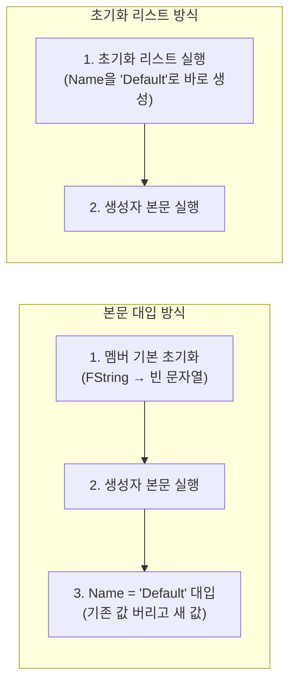
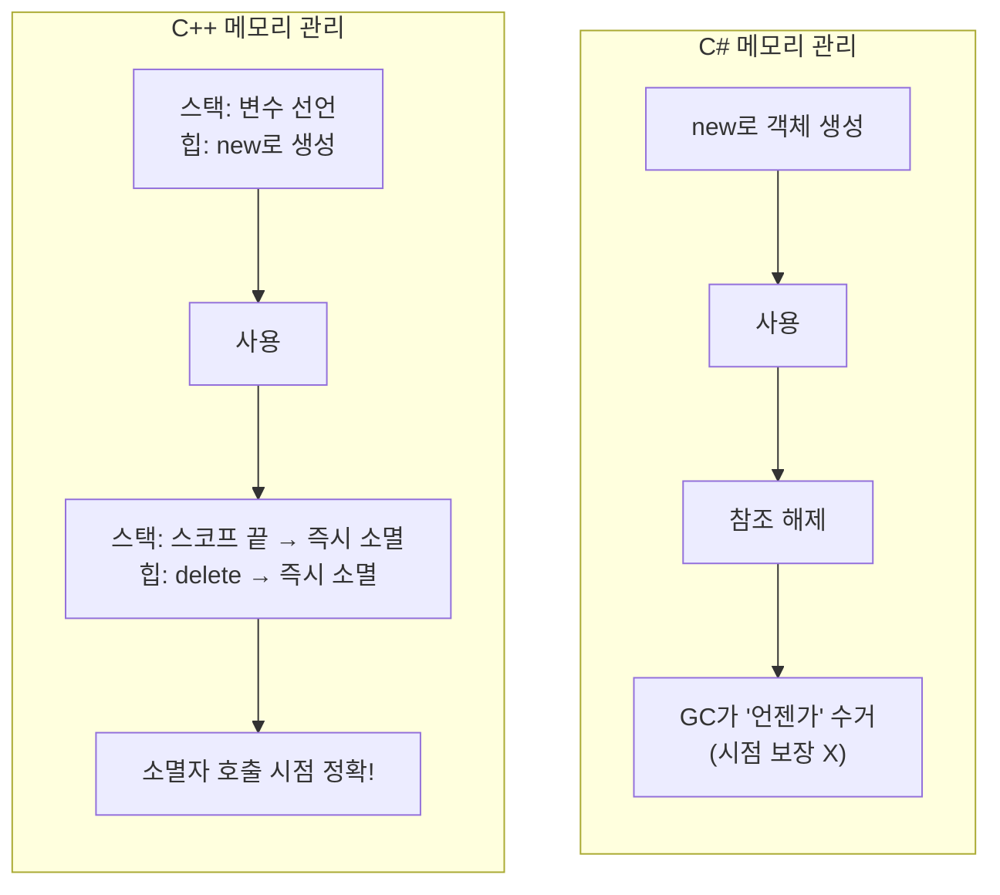
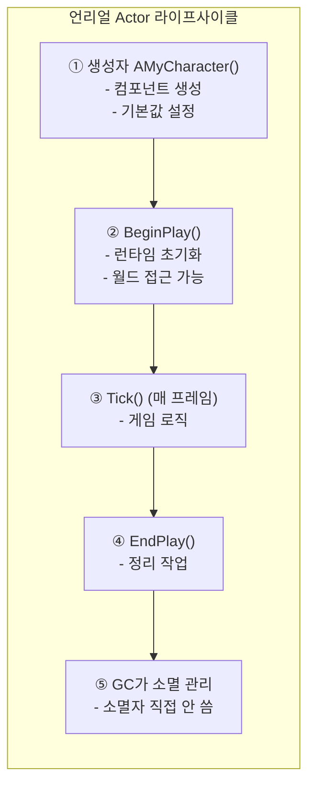

## 이 코드, 읽을 수 있나요?

언리얼 프로젝트에서 캐릭터 클래스를 열면 이런 게 나옵니다.

```cpp
// MyCharacter.h
UCLASS()
class MYGAME_API AMyCharacter : public ACharacter
{
    GENERATED_BODY()

public:
    AMyCharacter();

protected:
    virtual void BeginPlay() override;

private:
    UPROPERTY(VisibleAnywhere)
    UStaticMeshComponent* WeaponMesh;

    UPROPERTY(EditDefaultsOnly)
    float MaxHealth = 100.f;

    float CurrentHealth;
};

// MyCharacter.cpp
AMyCharacter::AMyCharacter()
{
    PrimaryActorTick.bCanEverTick = true;

    WeaponMesh = CreateDefaultSubobject<UStaticMeshComponent>(TEXT("WeaponMesh"));
    WeaponMesh->SetupAttachment(GetMesh(), TEXT("hand_r"));
}

void AMyCharacter::BeginPlay()
{
    Super::BeginPlay();
    CurrentHealth = MaxHealth;
}
```

유니티 개발자라면 이런 의문이 듭니다:

- `AMyCharacter()` — 생성자인 건 알겠는데, C#처럼 `public`을 안 붙여도 되나?
- `AMyCharacter::AMyCharacter()` — `::` 이 두 번 나오는 문법은 뭐지?
- `CreateDefaultSubobject<T>(TEXT("..."))` — 생성자에서 `new` 대신 이걸 쓰는 건 왜지?
- `~AMyCharacter()`는 어디 있지? 소멸자가 없어도 되나?
- `float MaxHealth = 100.f` — 멤버 변수를 선언하면서 바로 초기화? C#이랑 같은 건가?

**이번 강에서 C++ 클래스의 생성자/소멸자 규칙을 완전히 정리합니다.**

---

## 서론 - 왜 C++ 클래스가 C#과 다른가

C#에서 클래스를 만드는 건 편합니다. 생성자에서 `this.health = 100`을 쓰면 끝이고, 소멸자(finalizer)는 거의 쓸 일이 없습니다. GC(가비지 컬렉터)가 메모리를 알아서 정리해주기 때문이죠.

C++은 다릅니다. **개발자가 객체의 생성과 소멸을 직접 관리합니다.** 그래서 C++에는 C#에 없는 개념들이 있습니다:

- **초기화 리스트** — 멤버를 "대입"이 아닌 "초기화"하는 문법
- **소멸자** — 객체가 파괴될 때 **반드시 호출되는** 정리 함수
- **복사 생성자** — 객체를 복사할 때 호출되는 특별한 생성자
- **접근 지정자** — `private`이 기본값 (C#은 `private`이 기본이지만, struct는 다름)


---

## 1. 클래스 선언과 정의 - .h와 .cpp 분리

2강에서 배운 헤더/소스 분리가 클래스에도 적용됩니다. C#에서는 하나의 파일에 선언과 구현을 모두 쓰지만, C++에서는 **선언(헤더)과 정의(소스)를 분리**합니다.

```cpp
// Weapon.h — 선언 (이 클래스가 뭘 가지고 있는지)
class Weapon
{
public:
    Weapon();                         // 생성자 선언
    ~Weapon();                        // 소멸자 선언
    void Fire();                      // 멤버 함수 선언
    int32 GetAmmo() const;            // const 멤버 함수 선언

private:
    int32 Ammo;
    float Damage;
};

// Weapon.cpp — 정의 (실제로 어떻게 동작하는지)
Weapon::Weapon()           // ← ClassName::FunctionName
    : Ammo(30)             // ← 초기화 리스트 (이번 강 핵심!)
    , Damage(10.0f)
{
    // 생성자 본문
}

Weapon::~Weapon()
{
    // 소멸자 본문 — 정리 작업
}

void Weapon::Fire()
{
    if (Ammo > 0)
    {
        --Ammo;
    }
}

int32 Weapon::GetAmmo() const
{
    return Ammo;
}
```

C#과 비교하면:

```csharp
// C# — 하나의 파일에 다 작성
public class Weapon
{
    private int ammo;
    private float damage;

    public Weapon()       // 생성자
    {
        ammo = 30;
        damage = 10.0f;
    }
    // 소멸자? 거의 안 씀

    public void Fire()
    {
        if (ammo > 0) ammo--;
    }

    public int GetAmmo() => ammo;
}
```

| 항목 | C# | C++ |
|------|-----|-----|
| 선언 위치 | 클래스 안에 전부 | `.h` 파일 (선언만) |
| 구현 위치 | 클래스 안에 전부 | `.cpp` 파일 (`ClassName::` 붙여서) |
| 접근 지정자 | 멤버마다 `public` / `private` 등 | `public:` / `private:` 블록 단위 |
| 기본 접근 지정자 | `private` (멤버) | `private` (class), `public` (struct) |

> **💬 잠깐, 이건 알고 가자**
>
> **Q. `Weapon::Fire()`에서 `::`는 뭔가요?**
>
> **범위 지정 연산자(scope resolution operator)**입니다. "이 `Fire()` 함수는 `Weapon` 클래스에 속한다"는 뜻입니다. `.cpp` 파일에서 멤버 함수를 정의할 때 반드시 필요합니다.
> ```cpp
> Weapon::Fire()      // Weapon 클래스의 Fire 함수
> Enemy::Fire()       // Enemy 클래스의 Fire 함수 (다른 클래스의 같은 이름!)
> ```
>
> **Q. 짧은 함수도 `.cpp`에 분리해야 하나요?**
>
> 아닙니다. 짧은 함수는 헤더에 직접 구현할 수 있습니다(인라인 함수). 하지만 **언리얼에서는 대부분 `.cpp`에 분리**합니다. 특히 `UCLASS` 멤버 함수는 `.cpp`에 쓰는 것이 관례입니다.

---

## 2. 생성자 - 객체가 태어날 때

### 2-1. 기본 생성자

```cpp
class FCharacterStats
{
public:
    // 기본 생성자 — 매개변수 없음
    FCharacterStats()
    {
        Health = 100.0f;
        Mana = 50.0f;
        Level = 1;
    }

private:
    float Health;
    float Mana;
    int32 Level;
};

// 사용
FCharacterStats Stats;  // 생성자 자동 호출 → Health=100, Mana=50, Level=1
```

C#과 거의 같습니다. 다만 C++에서는 **`new` 없이 변수를 선언하는 것만으로 생성자가 호출**됩니다.

```csharp
// C# — class는 new 필수
CharacterStats stats = new CharacterStats();

// C# — struct는 new 없이도 가능
Vector3 pos;  // 기본값(0, 0, 0)
```

```cpp
// C++ — class든 struct든 new 없이 선언하면 스택에 생성
FCharacterStats Stats;   // 스택에 생성, 생성자 호출
FVector Pos;             // 스택에 생성, 기본값(0, 0, 0)
```

### 2-2. 매개변수가 있는 생성자

```cpp
class FCharacterStats
{
public:
    // 기본 생성자
    FCharacterStats()
        : Health(100.0f), Mana(50.0f), Level(1)
    {
    }

    // 매개변수가 있는 생성자
    FCharacterStats(float InHealth, float InMana, int32 InLevel)
        : Health(InHealth), Mana(InMana), Level(InLevel)
    {
    }

private:
    float Health;
    float Mana;
    int32 Level;
};

// 사용
FCharacterStats DefaultStats;                 // 기본 생성자 → 100, 50, 1
FCharacterStats BossStats(5000.0f, 200.0f, 50); // 매개변수 생성자
```

C#과 비교하면:

```csharp
// C#
CharacterStats bossStats = new CharacterStats(5000f, 200f, 50);
```

| C# | C++ | 설명 |
|----|-----|------|
| `new ClassName()` | `ClassName VarName;` | 기본 생성 (C++은 new 없이!) |
| `new ClassName(args)` | `ClassName VarName(args);` | 매개변수 생성 |
| `new ClassName()` (힙) | `new ClassName()` (힙) | 힙 할당 (둘 다 new 사용) |

> **💬 잠깐, 이건 알고 가자**
>
> **Q. C++에서 `new`는 언제 쓰나요?**
>
> C++에서 `new`는 **힙에 할당할 때만** 사용합니다. C#에서는 class 타입에 항상 `new`를 쓰지만, C++에서는 스택 할당(new 없이)이 기본이고 힙이 필요할 때만 `new`를 씁니다.
> ```cpp
> FCharacterStats StackStats;              // 스택 (함수 끝나면 자동 해제)
> FCharacterStats* HeapStats = new FCharacterStats();  // 힙 (직접 delete 해야 함)
> ```
> 다만 **언리얼에서는 `new`를 직접 쓰는 일이 거의 없습니다.** `UObject` 계열은 `NewObject<T>()`나 `CreateDefaultSubobject<T>()`를 사용하고, 메모리 관리는 GC가 합니다. 이건 9강에서 자세히 다룹니다.

---

## 3. 초기화 리스트 - C#에 없는 핵심 문법

### 3-1. 초기화 리스트란?

이번 강에서 가장 중요한 내용입니다. C#에는 없는 문법이므로 처음 보면 당황할 수 있습니다.

```cpp
class FWeaponData
{
public:
    // ❌ 생성자 본문에서 대입 (작동하지만 비효율적)
    FWeaponData()
    {
        Name = TEXT("Default");   // "대입" — 이미 기본 초기화된 후 값을 바꿈
        Damage = 10.0f;
        Ammo = 30;
    }

    // ✅ 초기화 리스트 사용 (효율적, C++ 권장 방식)
    FWeaponData()
        : Name(TEXT("Default"))    // "초기화" — 처음부터 이 값으로 생성
        , Damage(10.0f)
        , Ammo(30)
    {
        // 본문은 비어있어도 됨
    }

private:
    FString Name;
    float Damage;
    int32 Ammo;
};
```

차이가 미묘해 보이지만 중요합니다:



**본문 대입**: 멤버가 먼저 기본값으로 생성된 후, 생성자에서 다시 값을 덮어씁니다. 두 번 일하는 셈입니다.
**초기화 리스트**: 멤버가 처음부터 원하는 값으로 생성됩니다. 한 번만 일합니다.

### 3-2. 초기화 리스트가 필수인 경우

성능 차이 외에도, **초기화 리스트를 반드시 써야 하는 경우**가 있습니다.

```cpp
class FPlayerConfig
{
public:
    FPlayerConfig(const FString& InName, int32 InID)
        : PlayerName(InName)    // const 멤버 → 초기화 리스트 필수
        , PlayerID(InID)        // const 멤버 → 초기화 리스트 필수
        , HealthRef(InternalHP) // 참조 멤버 → 초기화 리스트 필수
    {
        // PlayerName = InName;  // ❌ 컴파일 에러! const는 대입 불가
        // PlayerID = InID;      // ❌ 컴파일 에러!
    }

private:
    const FString PlayerName;   // const 멤버
    const int32 PlayerID;       // const 멤버
    float InternalHP = 100.0f;
    float& HealthRef;           // 참조 멤버
};
```

| 상황 | 초기화 리스트 | 본문 대입 | 이유 |
|------|-------------|----------|------|
| `const` 멤버 | **필수** | ❌ 불가 | const는 초기화 후 변경 불가 |
| 참조(`&`) 멤버 | **필수** | ❌ 불가 | 참조는 선언 시 바인딩 필수 |
| 기본 생성자 없는 타입 | **필수** | ❌ 불가 | 기본값으로 먼저 생성할 수 없음 |
| `FString`, `FVector` 등 | 권장 | 가능 (비효율) | 두 번 초기화 방지 |
| `int32`, `float` 등 | 권장 | 가능 | 습관적으로 초기화 리스트 사용 |

### 3-3. C++11 멤버 초기화 (In-class Initializer)

C++11부터는 C#처럼 **선언과 동시에 기본값을 지정**할 수 있습니다. 언리얼에서도 자주 사용합니다.

```cpp
class AMyCharacter : public ACharacter
{
private:
    // C++11 멤버 초기화 — 선언 시 기본값 지정
    float MaxHealth = 100.0f;          // ✅ C++11 스타일
    float CurrentHealth = 0.0f;
    int32 Level = 1;
    bool bIsAlive = true;
    FString CharacterName = TEXT("Default");

    // 이렇게 하면 생성자에서 따로 초기화하지 않아도 됨
};
```

이 문법은 C#의 필드 초기화와 같습니다:

```csharp
// C#
public class MyCharacter : MonoBehaviour
{
    private float maxHealth = 100f;    // 동일한 패턴
    private float currentHealth = 0f;
    private int level = 1;
    private bool isAlive = true;
}
```

**우선순위**: 초기화 리스트 > 멤버 초기화(기본값). 생성자 초기화 리스트에 값이 있으면 멤버 초기화는 무시됩니다.

```cpp
class FWeaponData
{
public:
    FWeaponData()
        : Ammo(50)       // 초기화 리스트가 우선 → Ammo는 50
    {
    }

private:
    int32 Ammo = 30;     // 멤버 초기화 (기본값 30이지만, 초기화 리스트가 덮어씀)
};
```

> **💬 잠깐, 이건 알고 가자**
>
> **Q. 초기화 리스트와 멤버 초기화, 뭘 써야 하나요?**
>
> 언리얼 코드에서 실제로 많이 쓰이는 패턴은 이렇습니다:
> - **기본값이 고정된 경우** → 멤버 초기화 (`float MaxHP = 100.f;`)
> - **생성자 매개변수로 값을 받는 경우** → 초기화 리스트
> - **`UPROPERTY(EditDefaultsOnly)`로 에디터에서 바꿀 값** → 멤버 초기화
>
> 실무에서는 두 가지를 섞어서 사용합니다.
>
> **Q. 초기화 리스트에서 멤버 순서가 중요한가요?**
>
> **네, 매우 중요합니다!** 초기화 리스트의 순서와 관계없이, **멤버 변수가 선언된 순서대로 초기화됩니다.** 컴파일러가 경고를 줄 수 있으므로 초기화 리스트 순서와 선언 순서를 맞추세요.
> ```cpp
> class Example
> {
>     int32 A;    // 선언 순서 1
>     int32 B;    // 선언 순서 2
>
> public:
>     Example()
>         : B(10)    // ⚠️ B를 먼저 썼지만, A가 먼저 초기화됨!
>         , A(B)     // 위험: A 초기화 시점에 B는 아직 초기화 안 됨
>     {
>     }
> };
> ```

---

## 4. 소멸자 - 객체가 죽을 때

### 4-1. 소멸자의 기본

C#에서 소멸자(finalizer, `~ClassName()`)를 직접 쓰는 일은 거의 없습니다. GC가 알아서 메모리를 정리하고, 리소스 정리는 `IDisposable.Dispose()`로 합니다.

C++에서는 소멸자가 **핵심 메커니즘**입니다.

```cpp
class FTextureCache
{
public:
    FTextureCache()
    {
        // 생성자에서 리소스 할당
        Buffer = new uint8[1024 * 1024];  // 1MB 버퍼
        UE_LOG(LogTemp, Display, TEXT("TextureCache 생성: 버퍼 할당"));
    }

    ~FTextureCache()
    {
        // 소멸자에서 리소스 해제 — 반드시!
        delete[] Buffer;
        Buffer = nullptr;
        UE_LOG(LogTemp, Display, TEXT("TextureCache 소멸: 버퍼 해제"));
    }

private:
    uint8* Buffer;
};

// 사용
void LoadLevel()
{
    FTextureCache Cache;     // 생성자 호출 → 버퍼 할당
    // ... 텍스처 작업 ...
}   // ← 함수 끝 → Cache 소멸자 자동 호출 → 버퍼 해제!
```

**핵심: C++ 소멸자는 호출 시점이 정확하게 보장됩니다.** 스택 변수는 스코프를 벗어나는 즉시, `delete`는 호출 즉시 소멸자가 실행됩니다. C#의 GC처럼 "언젠가" 정리되는 게 아닙니다.



C#과 비교하면:

| 항목 | C# | C++ |
|------|-----|-----|
| 소멸자 문법 | `~ClassName()` | `~ClassName()` |
| 호출 시점 | **GC가 결정** (보장 안 됨) | **즉시** (스코프 끝 or delete) |
| 리소스 정리 | `IDisposable.Dispose()` | 소멸자에서 직접 |
| 사용 빈도 | 거의 안 씀 | **매우 자주 씀** |
| RAII 패턴 | 없음 (`using` 문으로 대체) | C++의 핵심 패턴 |

### 4-2. RAII - C++의 자원 관리 철학

C++에서는 **생성자에서 자원을 획득하고, 소멸자에서 자원을 해제**하는 패턴을 RAII(Resource Acquisition Is Initialization)라고 합니다. C#의 `using` 문과 비슷한 목적이지만, C++에서는 언어 자체에 내장된 핵심 패턴입니다.

```cpp
// C++ — RAII 패턴
void ProcessFile()
{
    FFileHelper FileReader(TEXT("data.txt"));  // 생성자 → 파일 열기
    FileReader.ReadAll();                       // 사용
}   // ← 스코프 끝 → 소멸자 자동 호출 → 파일 닫기 (자동!)
```

```csharp
// C# — using 문으로 비슷한 효과
void ProcessFile()
{
    using (var reader = new StreamReader("data.txt"))  // 열기
    {
        reader.ReadToEnd();  // 사용
    }   // ← using 끝 → Dispose() 호출 → 파일 닫기
}
```

RAII 덕분에 C++에서는 **자원 누수가 원천적으로 방지**됩니다. 예외가 발생해도 스택이 풀리면서(stack unwinding) 소멸자가 반드시 호출됩니다.

> **💬 잠깐, 이건 알고 가자**
>
> **Q. C#에서 `~ClassName()`은 소멸자(finalizer)인데, C++이랑 같은 건가요?**
>
> 문법은 같지만 의미가 완전히 다릅니다.
> - **C# finalizer**: GC가 수거할 때 호출. 시점 보장 X. 성능 비용 있음. 거의 안 씀.
> - **C++ 소멸자**: 객체가 파괴될 때 **즉시** 호출. 시점 보장. RAII의 핵심. 자주 씀.
>
> **Q. 소멸자에서 주로 뭘 하나요?**
>
> 생성자에서 `new`로 할당한 메모리 해제(`delete`), 파일 핸들 닫기, 네트워크 연결 종료, 이벤트 바인딩 해제 등입니다. **"생성자에서 얻은 것은 소멸자에서 돌려준다"**가 원칙입니다.

### 4-3. 복사 생성자와 특수 멤버 함수 (맛보기)

서론에서 **복사 생성자**를 언급했습니다. 소멸자와 함께 알아야 할 중요한 개념이지만, 여기서는 맛보기만 합니다.

```cpp
class FBuffer
{
public:
    FBuffer(int32 InSize) : Size(InSize)
    {
        Data = new uint8[Size];
    }

    // 복사 생성자 — 객체를 복사할 때 호출
    FBuffer(const FBuffer& Other) : Size(Other.Size)
    {
        Data = new uint8[Size];                    // 새 메모리 할당
        FMemory::Memcpy(Data, Other.Data, Size);   // 내용 복사
    }

    ~FBuffer()
    {
        delete[] Data;
    }

private:
    uint8* Data;
    int32 Size;
};

FBuffer A(1024);
FBuffer B = A;    // 복사 생성자 호출 → B는 A의 복사본
```

**C#에서는 이런 걱정이 없습니다.** GC가 있으니까요. C++에서는 소멸자를 직접 쓰는 클래스라면 복사 생성자도 신경 써야 합니다. 이것을 **Rule of Three**라고 합니다 (소멸자, 복사 생성자, 복사 대입 연산자를 세트로 관리). 자세한 내용은 9강(메모리 관리)에서 다룹니다.

언리얼 코드에서는 `= default`와 `= delete` 키워드도 자주 볼 수 있습니다:

```cpp
class FMySystem
{
public:
    FMySystem() = default;                           // 컴파일러 기본 생성자 사용
    ~FMySystem() = default;                          // 컴파일러 기본 소멸자 사용

    FMySystem(const FMySystem&) = delete;            // ❌ 복사 금지!
    FMySystem& operator=(const FMySystem&) = delete; // ❌ 복사 대입 금지!
};

FMySystem A;
// FMySystem B = A;  // ❌ 컴파일 에러! 복사 삭제됨
```

| 키워드 | 의미 | C# 대응 |
|--------|------|---------|
| `= default` | "컴파일러가 자동 생성해줘" | 없음 (항상 자동) |
| `= delete` | "이 함수는 사용 금지" | 없음 (접근 지정자로 제한) |

> **💬 잠깐, 이건 알고 가자**
>
> **Q. 왜 복사를 금지하나요?**
>
> 싱글톤이나 시스템 매니저처럼 **복사되면 안 되는 객체**가 있습니다. C#에서는 이런 패턴을 관례로 지키지만, C++에서는 `= delete`로 **컴파일 타임에 강제**합니다. 언리얼의 `FNoncopyable`을 상속해도 같은 효과입니다.

---

## 5. this 포인터 - 자기 자신을 가리키는 방법

C#의 `this`와 같은 개념이지만, C++에서는 **포인터**입니다.

```cpp
class AWeapon
{
public:
    void SetOwner(ACharacter* InOwner)
    {
        // this는 자기 자신의 포인터
        Owner = InOwner;

        // this->를 명시적으로 쓸 수도 있음
        this->Owner = InOwner;  // 위와 동일

        // this를 다른 함수에 전달
        InOwner->EquipWeapon(this);  // "나(무기)를 장착해"
    }

private:
    ACharacter* Owner;
};
```

C#과 비교:

| 항목 | C# | C++ |
|------|-----|-----|
| 타입 | 참조 (`this`) | **포인터** (`this`) |
| 멤버 접근 | `this.member` | `this->member` |
| 자기 전달 | `SomeFunc(this)` | `SomeFunc(this)` |
| 생략 가능 | 대부분 생략 | 대부분 생략 |
| null 여부 | 불가 | **이론상 가능** (하지만 안 됨) |

```cpp
// C++ — this가 포인터이므로 ->를 사용
this->Health = 100;      // 명시적
Health = 100;             // 암묵적 (보통 이렇게 씀)

// C# — this는 참조이므로 .을 사용
this.health = 100;       // 명시적
health = 100;             // 암묵적
```

> **💬 잠깐, 이건 알고 가자**
>
> **Q. `this->`를 언제 명시적으로 써야 하나요?**
>
> 보통은 안 써도 됩니다. 하지만 **매개변수 이름과 멤버 이름이 같을 때** 구분을 위해 사용합니다. 다만 언리얼에서는 매개변수에 `In` 접두사를 붙여서 이 문제를 피합니다:
> ```cpp
> void SetHealth(float InHealth)     // ✅ 언리얼 스타일: In 접두사
> {
>     Health = InHealth;             // 헷갈릴 일 없음
> }
> ```

---

## 6. 접근 지정자와 struct vs class

### 6-1. 접근 지정자

C#과 거의 같지만, 문법이 약간 다릅니다.

```cpp
class AMyCharacter
{
public:           // 이 아래로 전부 public
    void Attack();
    void Jump();

protected:        // 이 아래로 전부 protected
    float Health;
    float Mana;

private:          // 이 아래로 전부 private
    int32 SecretID;
    FString Password;
};
```

C#에서는 멤버마다 접근 지정자를 붙이지만, C++에서는 **블록 단위**로 지정합니다.

| 접근 지정자 | C++ | C# | 접근 범위 |
|------------|-----|-----|---------|
| `public` | 동일 | 동일 | 어디서든 접근 가능 |
| `protected` | 동일 | 동일 | 자기 자신 + 파생 클래스 |
| `private` | 동일 | 동일 | 자기 자신만 |
| `internal` | **없음** | 있음 | (C#) 같은 어셈블리 내 |
| `friend` | **있음** | 없음 | (C++) 지정한 클래스/함수에 private 접근 허용 |

### 6-2. struct vs class - 충격적인 진실

C#에서 `struct`와 `class`는 **완전히 다른 타입**입니다. `struct`는 값 타입(스택), `class`는 참조 타입(힙). 상속도 안 되고, 기본 생성자도 다릅니다.

C++에서는... **거의 같습니다.**

```cpp
// C++ — struct와 class의 유일한 차이: 기본 접근 지정자
struct FPlayerData
{
    // 여기부터 기본 public
    FString Name;
    int32 Level;
};

class FPlayerData2
{
    // 여기부터 기본 private
    FString Name;
    int32 Level;
};

// 위 두 개는 기본 접근 지정자만 다르고, 나머지는 동일!
// 둘 다 상속 가능, 생성자/소멸자 가능, 멤버 함수 가능
```

| 항목 | C# struct | C# class | C++ struct | C++ class |
|------|-----------|----------|------------|-----------|
| 기본 접근 | - | `private` | **`public`** | `private` |
| 메모리 | 스택 (값 타입) | 힙 (참조 타입) | **어디든** | **어디든** |
| 상속 | ❌ 불가 | ✅ 가능 | **✅ 가능** | ✅ 가능 |
| 소멸자 | ❌ 없음 | ✅ 가능 | **✅ 가능** | ✅ 가능 |
| GC | 해당 없음 | GC 관리 | **없음** | 없음 |

**언리얼에서의 관례:**
- `struct` → 데이터 묶음 (POD, 컴포넌트 없음). `F` 접두사. 예: `FVector`, `FHitResult`, `FInventorySlot`
- `class` → 동작이 있는 객체. `A`, `U`, `F` 등 접두사. 예: `AActor`, `UActorComponent`

```cpp
// 언리얼 관례: 데이터만 담는 구조체는 struct + F 접두사
USTRUCT(BlueprintType)
struct FItemData
{
    GENERATED_BODY()

    UPROPERTY(EditAnywhere)
    FString ItemName;

    UPROPERTY(EditAnywhere)
    int32 ItemPrice;

    UPROPERTY(EditAnywhere)
    float ItemWeight;
};

// 언리얼 관례: 동작이 있는 것은 class
UCLASS()
class AWeaponActor : public AActor
{
    GENERATED_BODY()
    // ...
};
```

> **💬 잠깐, 이건 알고 가자**
>
> **Q. 그러면 C++에서 struct를 쓰는 이유가 뭔가요?**
>
> 기본 접근이 `public`이라서 데이터 전용 구조체에 편리합니다. `public:` 한 줄을 안 써도 되니까요. 언리얼에서는 **"이건 순수 데이터입니다"**라는 의도를 표현하는 데 `struct`를 사용합니다.
>
> **Q. C#에서 struct는 값 타입인데, C++에서는요?**
>
> C++에서는 `struct`든 `class`든 **선언 위치에 따라** 스택이나 힙에 갈 수 있습니다. 값 타입/참조 타입 구분이 없습니다.
> ```cpp
> FVector Pos;                // 스택 (값처럼 동작)
> FVector* Pos2 = new FVector(); // 힙 (포인터로 접근)
> ```

---

## 7. 언리얼 실전 코드 해부

맨 처음 봤던 캐릭터 코드를 다시 한 줄씩 분석합니다.

```cpp
// MyCharacter.h
UCLASS()
class MYGAME_API AMyCharacter : public ACharacter  // ① ACharacter 상속
{
    GENERATED_BODY()  // ② 언리얼 매크로 (리플렉션 코드 생성)

public:
    AMyCharacter();   // ③ 생성자 선언 (매개변수 없음)

protected:
    virtual void BeginPlay() override;  // ④ 부모 함수 오버라이드 (6강에서 자세히)

private:
    UPROPERTY(VisibleAnywhere)          // ⑤ 에디터에서 보임 (7강에서 자세히)
    UStaticMeshComponent* WeaponMesh;   // 포인터 = nullptr 가능

    UPROPERTY(EditDefaultsOnly)
    float MaxHealth = 100.f;            // ⑥ 멤버 초기화 (C++11)

    float CurrentHealth;                // ⑦ 초기화 안 됨 → BeginPlay에서 설정
};
```

```cpp
// MyCharacter.cpp
AMyCharacter::AMyCharacter()  // ⑧ 생성자 정의 (ClassName::ClassName)
{
    PrimaryActorTick.bCanEverTick = true;  // ⑨ 매 프레임 Tick 호출 활성화

    // ⑩ 컴포넌트 생성 (언리얼의 new 대체)
    WeaponMesh = CreateDefaultSubobject<UStaticMeshComponent>(TEXT("WeaponMesh"));
    WeaponMesh->SetupAttachment(GetMesh(), TEXT("hand_r"));
    // → 메시 소켓 "hand_r"에 WeaponMesh를 붙임
}

void AMyCharacter::BeginPlay()  // ⑪ 게임 시작 시 호출
{
    Super::BeginPlay();          // ⑫ 부모의 BeginPlay 먼저 호출 (중요!)
    CurrentHealth = MaxHealth;   // ⑬ 런타임 초기화
}
```

| 번호 | 패턴 | 의미 |
|------|------|------|
| ③ | `AMyCharacter()` | 기본 생성자 (언리얼 Actor는 매개변수 없는 생성자 사용) |
| ⑥ | `float MaxHealth = 100.f` | 멤버 초기화 — 에디터에서 변경 가능한 기본값 |
| ⑧ | `AMyCharacter::AMyCharacter()` | `.cpp`에서 생성자 정의 (`::` = 범위 지정) |
| ⑩ | `CreateDefaultSubobject<T>()` | 생성자 전용 컴포넌트 생성 함수 (`new` 대신 사용) |
| ⑫ | `Super::BeginPlay()` | 부모 클래스의 함수 호출 (C#의 `base.` 에 해당) |
| ⑬ | `CurrentHealth = MaxHealth` | 런타임 초기화 (에디터에서 MaxHealth를 바꿀 수 있으므로) |

**언리얼 생성자의 특징:**
- 에디터에서 블루프린트 CDO(Class Default Object)를 만들 때 호출됩니다
- 게임 시작 전에 호출되므로 `GetWorld()` 등이 아직 유효하지 않을 수 있습니다
- 그래서 **런타임 초기화는 `BeginPlay()`에서** 합니다
- 소멸자는 대부분 쓸 필요 없습니다 — `UObject` 계열은 GC가 관리하기 때문



---

## 8. 흔한 실수 & 주의사항

### 실수 1: 멤버 변수 초기화를 깜빡함

```cpp
class FWeaponData
{
public:
    FWeaponData() {}   // 생성자에서 아무것도 안 함

    float GetDamage() const { return Damage; }

private:
    float Damage;      // ❌ 초기화 안 됨 → 쓰레기 값!
    int32 Ammo;        // ❌ C#은 0으로 자동 초기화되지만, C++은 아님!
};
```

C#에서는 필드가 자동으로 0/null/false로 초기화됩니다. **C++에서는 초기화하지 않은 변수는 쓰레기 값**입니다. 반드시 초기화하세요.

```cpp
// ✅ 초기화 리스트로 초기화
FWeaponData() : Damage(0.0f), Ammo(0) {}

// ✅ 또는 멤버 초기화
float Damage = 0.0f;
int32 Ammo = 0;
```

### 실수 2: 소멸자에서 해제를 깜빡함

```cpp
class FParticlePool
{
public:
    FParticlePool()
    {
        Particles = new FParticle[100];  // 힙 할당
    }

    // ❌ 소멸자 없음 → 메모리 누수!
    // 소멸자를 안 쓰면 Particles는 영영 해제되지 않음

    // ✅ 소멸자에서 해제
    ~FParticlePool()
    {
        delete[] Particles;
        Particles = nullptr;
    }

private:
    FParticle* Particles;
};
```

**규칙: `new`가 있으면 반드시 대응하는 `delete`가 소멸자에 있어야 합니다.** (하지만 스마트 포인터를 쓰면 이 문제가 사라집니다 — 9강에서 다룹니다.)

### 실수 3: 초기화 리스트 순서 불일치

```cpp
class FStats
{
    float MaxHP;       // 선언 순서 1
    float CurrentHP;   // 선언 순서 2

public:
    FStats(float InMaxHP)
        : CurrentHP(MaxHP)   // ⚠️ 이 시점에 MaxHP는 아직 초기화 안 됨!
        , MaxHP(InMaxHP)     // MaxHP가 여기서 초기화되지만, 이미 늦음
    {
    }
};
```

초기화는 **선언 순서(MaxHP → CurrentHP)**대로 실행됩니다. 초기화 리스트 순서가 아닙니다! 컴파일러가 경고를 줍니다 — 경고를 무시하지 마세요.

```cpp
// ✅ 선언 순서와 초기화 리스트 순서를 일치시키기
FStats(float InMaxHP)
    : MaxHP(InMaxHP)          // 선언 순서 1 → 먼저 초기화
    , CurrentHP(MaxHP)        // 선언 순서 2 → MaxHP 사용 가능!
{
}
```

### 실수 4: 언리얼 생성자에서 게임 로직 실행

```cpp
AMyCharacter::AMyCharacter()
{
    // ❌ 생성자에서 월드/다른 Actor에 접근
    AActor* Target = GetWorld()->SpawnActor(...);  // 위험! GetWorld()가 유효하지 않을 수 있음

    // ❌ 타이머 설정
    GetWorldTimerManager().SetTimer(...);  // 위험!
}

void AMyCharacter::BeginPlay()
{
    Super::BeginPlay();

    // ✅ BeginPlay에서 월드 관련 작업
    AActor* Target = GetWorld()->SpawnActor(...);  // 안전!
    GetWorldTimerManager().SetTimer(...);          // 안전!
}
```

**언리얼 생성자는 "기본값 설정과 컴포넌트 생성"에만 사용하세요.** 게임 로직은 `BeginPlay()`에서.

---

## 정리 - 5강 체크리스트

이 강을 마치면 언리얼 코드에서 다음을 읽을 수 있어야 합니다:

- [ ] `ClassName::ClassName()`이 생성자 정의라는 것을 안다
- [ ] `ClassName::~ClassName()`이 소멸자 정의라는 것을 안다
- [ ] `: Member(Value)` 초기화 리스트의 의미를 안다
- [ ] 초기화 리스트가 본문 대입보다 효율적인 이유를 안다
- [ ] `const` 멤버와 참조 멤버는 반드시 초기화 리스트가 필요함을 안다
- [ ] `float MaxHP = 100.f` 같은 멤버 초기화(C++11)를 읽을 수 있다
- [ ] `this`가 C++에서 포인터(`this->`)라는 것을 안다
- [ ] `struct`와 `class`의 차이가 기본 접근 지정자뿐이라는 것을 안다
- [ ] 언리얼에서 `struct` = 데이터(F접두사), `class` = 동작(A/U접두사) 관례를 안다
- [ ] C++ 멤버 변수는 자동 초기화되지 않는다는 것을 안다
- [ ] `CreateDefaultSubobject<T>()`가 언리얼 생성자에서 컴포넌트를 만드는 방법임을 안다
- [ ] 언리얼 생성자에서 게임 로직을 쓰면 안 되는 이유를 안다 (→ BeginPlay 사용)
- [ ] 복사 생성자가 뭔지 안다 (소멸자가 있으면 복사 생성자도 필요 → Rule of Three)
- [ ] `= default`(컴파일러 기본 구현)와 `= delete`(사용 금지)의 의미를 안다

---

## 다음 강 미리보기

**6강: 상속과 다형성 - virtual의 진짜 의미**

C#에서 `virtual`과 `override`는 가끔 쓰는 키워드입니다. C++에서는 **다형성의 핵심이자 언리얼 코드의 뼈대**입니다. `virtual void BeginPlay() override;`가 정확히 어떤 의미인지, 왜 소멸자에도 `virtual`을 붙여야 하는지, VTable이라는 숨겨진 메커니즘까지 다룹니다. `Super::BeginPlay()`가 C#의 `base.BeginPlay()`와 같다는 것도 알게 됩니다.
