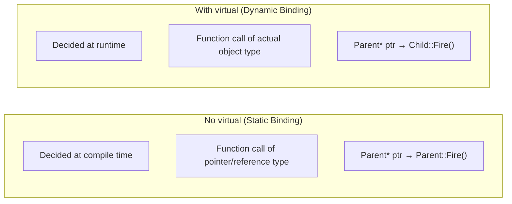
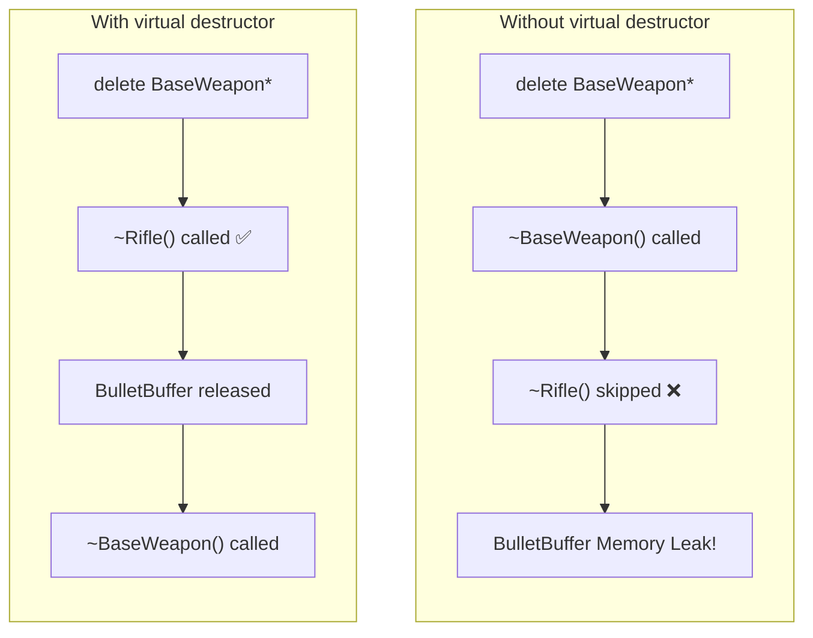
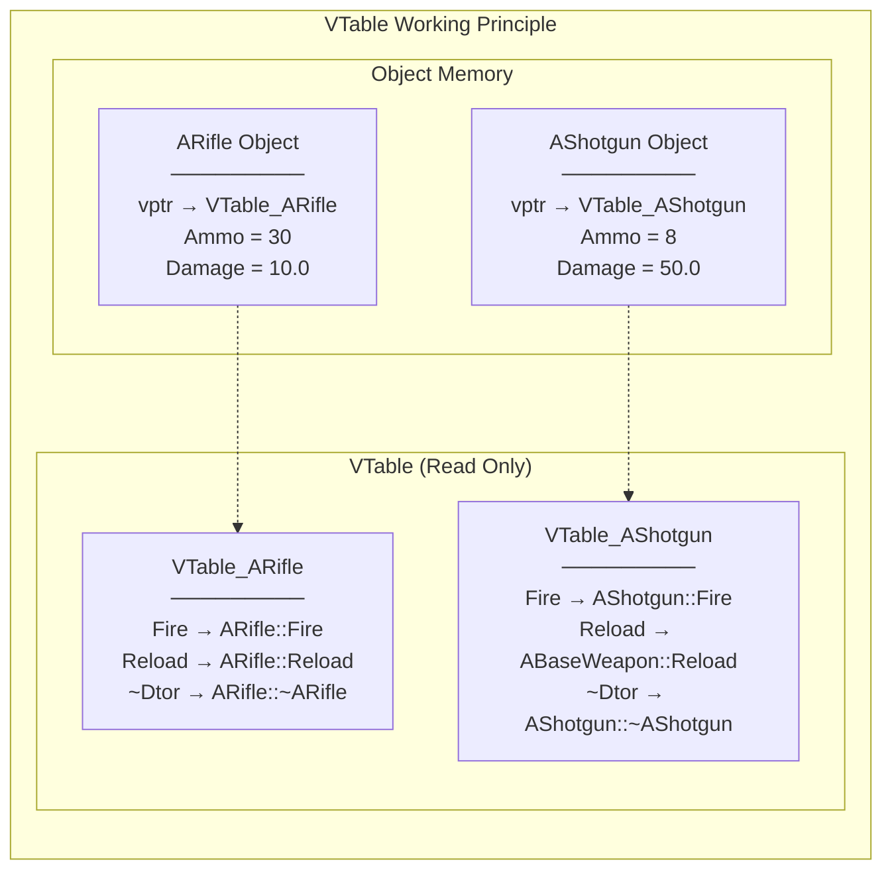

## Can You Read This Code?

When you open the damage handling code of a character in an Unreal project, you see something like this.

```cpp
// DamageableCharacter.h
UCLASS()
class MYGAME_API ADamageableCharacter : public ACharacter
{
    GENERATED_BODY()

public:
    ADamageableCharacter();

    virtual float TakeDamage(float DamageAmount, struct FDamageEvent const& DamageEvent,
        AController* EventInstigator, AActor* DamageCauser) override;

protected:
    virtual void BeginPlay() override;
    virtual void OnDeath();

    UPROPERTY(EditDefaultsOnly)
    float MaxHealth = 100.f;

    float CurrentHealth;
};

// EnemyCharacter.h
UCLASS()
class MYGAME_API AEnemyCharacter : public ADamageableCharacter
{
    GENERATED_BODY()

public:
    AEnemyCharacter();

protected:
    void OnDeath() override;
    virtual void DropLoot();
};
```

If you are a Unity developer, you might have these questions:

- `virtual float TakeDamage(...) override;` — `virtual` and `override` together? C# uses only one of them?
- `virtual void OnDeath();` — virtual without `= 0`? Isn't it an abstract method?
- `void OnDeath() override;` — Can I omit `virtual` in the child?
- `Super::BeginPlay()` — Where does this come from? Is it same as `base.`?

**In this lecture, we completely summarize C++'s inheritance/polymorphism mechanism.**

---

## Introduction - C#'s virtual and C++'s virtual are Different

Inheritance in C# is convenient. If you attach `virtual`, the child can `override`, and even without it, you can hide it with `new`. Most methods work well without `virtual`.

In C++, **`virtual` alone makes a completely different behavior**. If there is no `virtual`, calling with a parent pointer always executes the parent's function. Not the child's function. This is the difference between "Static Binding" and "Dynamic Binding", and you must understand this difference to read Unreal code.


---

## 1. Inheritance Basics - Almost Same as C# but Different

### 1-1. Inheritance Syntax Comparison

```cpp
// C++ — : public ParentClass
class AEnemy : public ACharacter
{
    // ...
};
```

```csharp
// C# — : ParentClass
class Enemy : Character
{
    // ...
}
```

| Feature | C# | C++ |
|------|-----|-----|
| Inheritance Syntax | `: BaseClass` | `: public BaseClass` |
| Inheritance Access Specifier | None (Always public) | `public` / `protected` / `private` |
| Multiple Inheritance | ❌ Class single inheritance only | **✅ Multiple inheritance possible** |
| Interface Multiple Implementation | ✅ | ✅ (Implemented as pure virtual class) |
| Parent Call | `base.Method()` | `Super::Method()` (Unreal) / `Base::Method()` (Pure C++) |

### 1-2. Inheritance Access Specifier — Concept Not in C#

```cpp
class AEnemy : public ACharacter      // Parent's public → public, protected → protected
class AEnemy : protected ACharacter   // Parent's public → protected
class AEnemy : private ACharacter     // Parent's public/protected → private
```

**In practice, 99.9% use `public` inheritance.** In Unreal, you rarely see inheritance access specifiers other than `public`. Just know "There is such a thing".

> **💬 Wait, Let's Know This**
>
> **Q. Why no inheritance access specifier in C#?**
>
> C# has different design philosophy. C# allows `public` inheritance only, and if access restriction is needed, implement interface explicitly. C++'s `protected`/`private` inheritance expresses "is-implemented-in-terms-of" relationship rather than "is-a", but in practice, it is better replaced by composition.

---

## 2. virtual and override - Core of the Core

### 2-1. What Happens Without virtual?

This is the biggest difference from C#. In C#, even without `virtual`, calling with child type executes child function. Not in C++.

```cpp
// Without virtual — Static Binding
class ABaseWeapon
{
public:
    void Fire()  // No virtual!
    {
        UE_LOG(LogTemp, Display, TEXT("BaseWeapon::Fire()"));
    }
};

class ARifle : public ABaseWeapon
{
public:
    void Fire()  // Define function with same name (Not override!)
    {
        UE_LOG(LogTemp, Display, TEXT("Rifle::Fire()"));
    }
};

// Test
ARifle* Rifle = new ARifle();
Rifle->Fire();              // "Rifle::Fire()" ← Child function because child type

ABaseWeapon* Weapon = Rifle; // Assign child object to parent pointer
Weapon->Fire();              // "BaseWeapon::Fire()" ← ❌ Parent function called!
```

```cpp
// With virtual — Dynamic Binding
class ABaseWeapon
{
public:
    virtual void Fire()  // With virtual!
    {
        UE_LOG(LogTemp, Display, TEXT("BaseWeapon::Fire()"));
    }
};

class ARifle : public ABaseWeapon
{
public:
    void Fire() override  // Override
    {
        UE_LOG(LogTemp, Display, TEXT("Rifle::Fire()"));
    }
};

// Test
ABaseWeapon* Weapon = new ARifle();
Weapon->Fire();  // "Rifle::Fire()" ← ✅ Actual type (ARifle) function called!
```



Comparing with C#:

| Situation | C# | C++ (No virtual) | C++ (With virtual) |
|------|-----|-------------------|-------------------|
| Call with Parent Type | Child function (if virtual) | **Parent Function!** | Child Function |
| Call with Child Type | Child Function | Child Function | Child Function |

### 2-2. override Keyword

In C++, `override` is an **optional** keyword added in C++11. Compiles without it. But **you must use it.**

```cpp
class ABaseWeapon
{
public:
    virtual void Fire();
    virtual void Reload();
};

class ARifle : public ABaseWeapon
{
public:
    // ❌ Without override — Compiles even with typo!
    void Fier()           // ⚠️ Typo! Becomes a new function (No warning!)
    {
    }

    // ✅ With override — Compiler catches typo
    void Fier() override  // ❌ Compile Error! "Fier does not exist in parent"
    {
    }

    void Fire() override  // ✅ Correct override
    {
    }
};
```

| Keyword | C# | C++ | Mandatory? |
|--------|-----|-----|----------|
| `virtual` | Optional (Allow child override) | Optional (Enable dynamic binding) | More important in C++ |
| `override` | **Mandatory** (Must when override) | **Optional** (C++11, but strongly recommended) | Good to use both |
| `abstract` / `= 0` | `abstract` | `= 0` | Function without implementation |
| `sealed` / `final` | `sealed` | `final` | Prohibit further override |

> **💬 Wait, Let's Know This**
>
> **Q. Can I use `virtual` and `override` together in C++?**
>
> Yes! A pattern often seen in Unreal code:
> ```cpp
> virtual void BeginPlay() override;  // "This function is virtual, and overrides parent"
> ```
> `virtual` means "This function can be overridden again by child", and `override` means "Redefining parent's virtual function". Actually in C++, once `virtual`, it stays virtual in child even without `virtual`. But **to clarify intent**, it is convention to use both in Unreal.
>
> **Q. Can I omit `virtual` in child?**
>
> Yes, technically function declared `virtual` once is automatically virtual in all children. But Unreal coding standard recommends **specifying `virtual` if child can be further overridden**, and **using only `override` or attaching `final` if final implementation**.

---

## 3. Pure Virtual Function - C#'s abstract

Same as C#'s `abstract` method. **Declaration only without implementation**, and child must implement.

```cpp
// C++ — Pure Virtual Function (= 0)
class ABaseWeapon
{
public:
    virtual void Fire() = 0;          // Pure virtual function — No implementation
    virtual void Reload() = 0;
    virtual FString GetName() const = 0;
};

// Cannot create ABaseWeapon directly!
// ABaseWeapon* Weapon = new ABaseWeapon();  // ❌ Compile Error!

class ARifle : public ABaseWeapon
{
public:
    void Fire() override { /* Rifle fire logic */ }
    void Reload() override { /* Reload logic */ }
    FString GetName() const override { return TEXT("Rifle"); }
};

ARifle* Rifle = new ARifle();  // ✅ Can create as all pure virtual functions implemented
```

```csharp
// C# — abstract
abstract class BaseWeapon
{
    public abstract void Fire();
    public abstract void Reload();
    public abstract string GetName();
}

class Rifle : BaseWeapon
{
    public override void Fire() { /* Fire */ }
    public override void Reload() { /* Reload */ }
    public override string GetName() => "Rifle";
}
```

| Feature | C# | C++ |
|------|-----|-----|
| Abstract Method Declaration | `abstract void Method();` | `virtual void Method() = 0;` |
| Abstract Class Indication | `abstract class` | Automatically abstract if at least 1 pure virtual function |
| Instance Creation | Impossible | Impossible |
| Class Keyword | `abstract class` mandatory | No separate keyword (Automatic if `= 0`) |

---

## 4. Virtual Destructor - Rule You Must Know

**You must attach `virtual` to destructor of inherited class.** In C# there is GC so no worry, but in C++ violating this rule **causes memory leak.**

```cpp
class ABaseWeapon
{
public:
    ~ABaseWeapon()  // ❌ No virtual!
    {
        UE_LOG(LogTemp, Display, TEXT("BaseWeapon Destroyed"));
    }
};

class ARifle : public ABaseWeapon
{
public:
    ARifle() { BulletBuffer = new uint8[1024]; }

    ~ARifle()
    {
        delete[] BulletBuffer;  // If this is not called, memory leak!
        UE_LOG(LogTemp, Display, TEXT("Rifle Destroyed"));
    }

private:
    uint8* BulletBuffer;
};

// Problem Situation
ABaseWeapon* Weapon = new ARifle();
delete Weapon;  // ❌ Only ~ABaseWeapon() called! ~ARifle() not called!
                // → BulletBuffer memory leak!
```

```cpp
class ABaseWeapon
{
public:
    virtual ~ABaseWeapon()  // ✅ virtual destructor!
    {
        UE_LOG(LogTemp, Display, TEXT("BaseWeapon Destroyed"));
    }
};

// Now safe
ABaseWeapon* Weapon = new ARifle();
delete Weapon;  // ✅ ~ARifle() called → ~ABaseWeapon() called (Child → Parent order)
```



**Rule: If a class has at least one `virtual` function, make destructor `virtual` too.**

In C# there is no such worry. GC collects all objects regardless of type. Important rule unique to C++.

| Situation | Destructor | Result |
|------|--------|------|
| delete with Parent Pointer + Non-virtual Destructor | `~Base()` | Child Destructor ❌ → Leak |
| delete with Parent Pointer + **Virtual Destructor** | `virtual ~Base()` | Child → Parent Order ✅ |
| delete with Child Type | Either | Normal Call |

> **💬 Wait, Let's Know This**
>
> **Q. Do I write `virtual ~AMyActor()` directly in Unreal?**
>
> Rarely. `UObject` family classes are managed by GC so no need to write destructor directly. `AActor`, `UActorComponent` etc. inherit `UObject`, whose destructor is already `virtual`. Developer doesn't need to care separately.
>
> However, if you need inheritance in **`F` prefix class (General C++ class)**, you must write `virtual` destructor directly.

---

## 5. VTable - Mechanism Hidden Behind virtual

In C#, runtime handles method calls automatically. In C++, mechanism called **VTable (Virtual Function Table)** is used. You don't see it in code directly, but can understand why `virtual` has cost.



**Operation Process:**
1. Object of class with `virtual` function has hidden **vptr (Virtual Function Pointer)**
2. vptr points to **VTable (Virtual Function Table)** of that class
3. Calling `virtual` function follows vptr → VTable → Actual Function
4. This process happens at runtime, so called **"Dynamic Binding"**

**Performance Cost:**
- Object size: One vptr (8 bytes, 64-bit) added
- Function call: 1 indirection added (Usually negligible)
- No inline: Compiler cannot inline virtual functions

```cpp
// If virtual exists
class AWeapon { virtual void Fire(); };  // sizeof = Members + 8(vptr)

// If no virtual
class FWeaponData { void Fire(); };      // sizeof = Members only
```

> **💬 Wait, Let's Know This**
>
> **Q. Should I save virtual because of VTable?**
>
> Overhead of virtual function in game development is **almost negligible**. Unless it's low-level operation called tens of thousands of times per second (math calc, physics simulation), no need to worry about virtual cost. This is why Unreal's `Tick()`, `BeginPlay()` etc. are all virtual.
>
> However, in extreme optimization situations requiring **Data Oriented Design (DOD)**, virtual might be avoided. This is very rare case.

---

## 6. final - Prohibit Further Inheritance/Override

Role same as C#'s `sealed`.

```cpp
// final class — Cannot inherit further
class APlayerCharacter final : public ACharacter
{
    // ...
};

// class ASuperPlayer : public APlayerCharacter { };  // ❌ Compile Error!

// final function — Cannot override further
class ABaseEnemy : public ACharacter
{
public:
    virtual void Attack();
    virtual void Die() final;  // Prohibit override in child
};

class ABossEnemy : public ABaseEnemy
{
public:
    void Attack() override;    // ✅ OK
    // void Die() override;    // ❌ Compile Error! final function
};
```

| C# | C++ | Meaning |
|----|-----|------|
| `sealed class` | `class Name final` | Prohibit class inheritance |
| `sealed override void Method()` | `void Method() override final` | Prohibit function override |

---

## 7. Interface - Implemented as Pure Virtual Class

C# has `interface` keyword, but C++ doesn't. Instead, use **class where all members are pure virtual functions** as interface.

```cpp
// C++ Interface Pattern — Pure Virtual Class
class IDamageable
{
public:
    virtual ~IDamageable() = default;  // Virtual Destructor
    virtual void TakeDamage(float Damage) = 0;
    virtual float GetHealth() const = 0;
    virtual bool IsDead() const = 0;
};

class IInteractable
{
public:
    virtual ~IInteractable() = default;
    virtual void Interact(AActor* Instigator) = 0;
    virtual FString GetInteractionText() const = 0;
};

// Multiple Implementation (Same as C# multiple interface implementation)
class AEnemyActor : public AActor, public IDamageable, public IInteractable
{
public:
    // IDamageable Implementation
    void TakeDamage(float Damage) override { /* ... */ }
    float GetHealth() const override { return Health; }
    bool IsDead() const override { return Health <= 0; }

    // IInteractable Implementation
    void Interact(AActor* Instigator) override { /* ... */ }
    FString GetInteractionText() const override { return TEXT("Investigate Enemy"); }

private:
    float Health = 100.f;
};
```

```csharp
// C# — Interface
interface IDamageable
{
    void TakeDamage(float damage);
    float GetHealth();
    bool IsDead();
}

interface IInteractable
{
    void Interact(GameObject instigator);
    string GetInteractionText();
}

class EnemyActor : MonoBehaviour, IDamageable, IInteractable
{
    // Implementation...
}
```

**Unreal Interface is a bit special.** Uses `UINTERFACE` macro to integrate with Unreal Reflection System:

```cpp
// Unreal Interface Declaration (Details in Lecture 7)
UINTERFACE(MinimalAPI)
class UDamageable : public UInterface
{
    GENERATED_BODY()
};

class IDamageable
{
    GENERATED_BODY()

public:
    virtual void TakeDamage(float Damage) = 0;
};

// Usage
UCLASS()
class AEnemy : public AActor, public IDamageable
{
    GENERATED_BODY()

public:
    void TakeDamage(float Damage) override;
};

// Interface Check
if (OtherActor->GetClass()->ImplementsInterface(UDamageable::StaticClass()))
{
    IDamageable* Damageable = Cast<IDamageable>(OtherActor);
    Damageable->TakeDamage(10.f);
}
```

| Feature | C# | C++ (Pure) | C++ (Unreal) |
|------|-----|-----------|-------------|
| Keyword | `interface` | None (Pure virtual class) | `UINTERFACE` Macro |
| Multiple Imp | ✅ | ✅ | ✅ |
| Member Variable | ❌ Impossible (Pre C# 8.0) | Possible (But unused) | Impossible (In `I` class) |
| Naming | `IName` | `IName` (Convention) | `UName` + `IName` (Pair) |

---

## 8. Dissecting Real Unreal Code - Super:: and Inheritance Pattern

### 8-1. Super:: — C#'s base.

In Unreal, `Super` is **typedef of parent class** automatically created by `GENERATED_BODY()` macro.

```cpp
// Inheriting ACharacter
class AMyCharacter : public ACharacter
{
    GENERATED_BODY()  // Inside this macro: typedef ACharacter Super;
};

// So Super:: is same as ACharacter::
void AMyCharacter::BeginPlay()
{
    Super::BeginPlay();  // = ACharacter::BeginPlay();
    // Same role as C#'s base.BeginPlay()
}
```

```csharp
// C# Comparison
protected override void Awake()
{
    base.Awake();  // Call parent Awake
}
```

| C# | C++ (Unreal) | C++ (Pure) |
|----|-------------|-----------|
| `base.Method()` | `Super::Method()` | `ParentClass::Method()` |

**Functions that MUST call `Super::` in Unreal:**
- `BeginPlay()` — Execute parent initialization logic
- `Tick()` — Usually call, but can be intentionally omitted
- `EndPlay()` — Execute parent cleanup logic
- `TakeDamage()` — Parent damage handling logic

```cpp
// ❌ If Super:: forgotten, parent function doesn't work
void AMyCharacter::BeginPlay()
{
    // Super::BeginPlay() missing!
    CurrentHealth = MaxHealth;
    // Parent(ACharacter)'s BeginPlay logic not executed → Bug!
}

// ✅ Correct Pattern
void AMyCharacter::BeginPlay()
{
    Super::BeginPlay();        // Always call parent first!
    CurrentHealth = MaxHealth;
}
```

### 8-2. Re-analyzing Initial Code

```cpp
// DamageableCharacter.h
UCLASS()
class MYGAME_API ADamageableCharacter : public ACharacter  // ① Inherit ACharacter
{
    GENERATED_BODY()  // ② Super = ACharacter (Auto typedef)

public:
    ADamageableCharacter();

    // ③ virtual + override: Redefine parent(AActor)'s TakeDamage, while child can also redefine
    virtual float TakeDamage(float DamageAmount, struct FDamageEvent const& DamageEvent,
        AController* EventInstigator, AActor* DamageCauser) override;

protected:
    // ④ virtual + override: Redefine ACharacter's BeginPlay, child can also redefine
    virtual void BeginPlay() override;

    // ⑤ virtual only: New virtual function (Not in parent, not = 0 → Has default impl)
    virtual void OnDeath();

    UPROPERTY(EditDefaultsOnly)
    float MaxHealth = 100.f;
    float CurrentHealth;
};

// EnemyCharacter.h
UCLASS()
class MYGAME_API AEnemyCharacter : public ADamageableCharacter  // ⑥ 2-step inheritance
{
    GENERATED_BODY()  // Super = ADamageableCharacter

public:
    AEnemyCharacter();

protected:
    // ⑦ override only: Redefine ADamageableCharacter's OnDeath
    //    Not using virtual means "Intent that child doesn't need to override further"
    void OnDeath() override;

    // ⑧ New virtual function
    virtual void DropLoot();
};
```

| No. | Pattern | Meaning |
|------|------|------|
| ③ | `virtual ... override` | Parent function redefine + Child can redefine too |
| ⑤ | `virtual void OnDeath()` | Define new virtual function (Has default impl) |
| ⑦ | `void OnDeath() override` | Redefine parent's virtual function (virtual omitted) |
| ⑧ | `virtual void DropLoot()` | New virtual function starting from this class |

---

## 9. Common Mistakes & Precautions

### Mistake 1: Attempting Override Without virtual

```cpp
class ABaseEnemy : public ACharacter
{
public:
    void OnHit(float Damage)  // ❌ No virtual!
    {
        Health -= Damage;
    }
};

class ABossEnemy : public ABaseEnemy
{
public:
    void OnHit(float Damage)  // "Hiding" not overriding!
    {
        Health -= Damage * 0.5f;  // Boss takes 50% damage
    }
};

ABaseEnemy* Enemy = new ABossEnemy();
Enemy->OnHit(100);  // Call ABaseEnemy::OnHit → No damage reduction!
```

**Solution**: Attach `virtual` to parent function, `override` to child.

### Mistake 2: Missing override Typo

```cpp
class AMyCharacter : public ACharacter
{
    virtual void BeginPlay() override;  // ✅

    virtual void beginPlay() override;  // ❌ Compile Error (Lowercase b)
    virtual void BeginPlay(int) override;  // ❌ Compile Error (Different param)
};
```

Without `override` keyword, both cases above would be created as **new functions**, and you would debug for a long time why `BeginPlay` is not called.

### Mistake 3: Missing Virtual Destructor

```cpp
// ❌ Dangerous Code
class FWeaponBase
{
public:
    ~FWeaponBase() {}  // No virtual!
};

class FRifle : public FWeaponBase
{
public:
    ~FRifle() { delete[] BulletData; }
    uint8* BulletData = new uint8[256];
};

FWeaponBase* Weapon = new FRifle();
delete Weapon;  // ~FRifle() not called → BulletData leak!
```

**Rule: If at least one `virtual` function exists, or intended to be inherited → `virtual ~ClassName()`**

### Mistake 4: Missing Super:: Call

```cpp
void AMyCharacter::EndPlay(const EEndPlayReason::Type EndPlayReason)
{
    // ❌ Super::EndPlay() not called!
    // Parent cleanup logic not executed, resource leak possible

    CleanupWeapon();
}

// ✅ Correct Pattern
void AMyCharacter::EndPlay(const EEndPlayReason::Type EndPlayReason)
{
    CleanupWeapon();
    Super::EndPlay(EndPlayReason);  // Call parent at last (EndPlay usually last)
}
```

**Pattern:**
- `BeginPlay()` → `Super::` first, My logic later
- `EndPlay()` → My cleanup first, `Super::` later
- `Tick()` → Depends on situation (Usually `Super::` first)

---

## Summary - Lecture 6 Checklist

After this lecture, you should be able to read the following in Unreal code:

- [ ] Know `virtual void Method()` "Enables dynamic binding"
- [ ] Know redefining function without `virtual` calls parent function from parent pointer
- [ ] Know `override` keyword prevents typo/signature mistakes
- [ ] Know `virtual void Method() = 0;` is same as C#'s `abstract`
- [ ] Know why `virtual ~ClassName()` is essential for inherited class
- [ ] Know what VTable is and that virtual performance cost is negligible
- [ ] Know `final` is same as C#'s `sealed`
- [ ] Know C++ implements interface as pure virtual class
- [ ] Know `Super::Method()` is same as C#'s `base.Method()`
- [ ] Know `Super` is automatically typedef-ed by `GENERATED_BODY()` macro
- [ ] Know pattern `Super::` first in `BeginPlay`, My logic first in `EndPlay`
- [ ] Can read Unreal pattern using `virtual ... override` together

---

## Next Lecture Preview

**Lecture 7: Magic of Unreal Macros - UCLASS, UPROPERTY, UFUNCTION**

`UCLASS()`, `UPROPERTY()`, `UFUNCTION()` seen most in Unreal code. These are **Unreal specific macros** not standard C++. Without these macros, no GC, no editor exposure, no Blueprint integration. We cover what `GENERATED_BODY()` does, difference between `UPROPERTY(EditAnywhere)` and `UPROPERTY(VisibleAnywhere)`, and why reflection system is needed.
