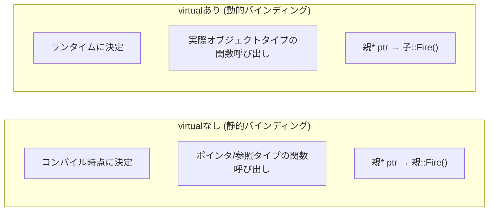
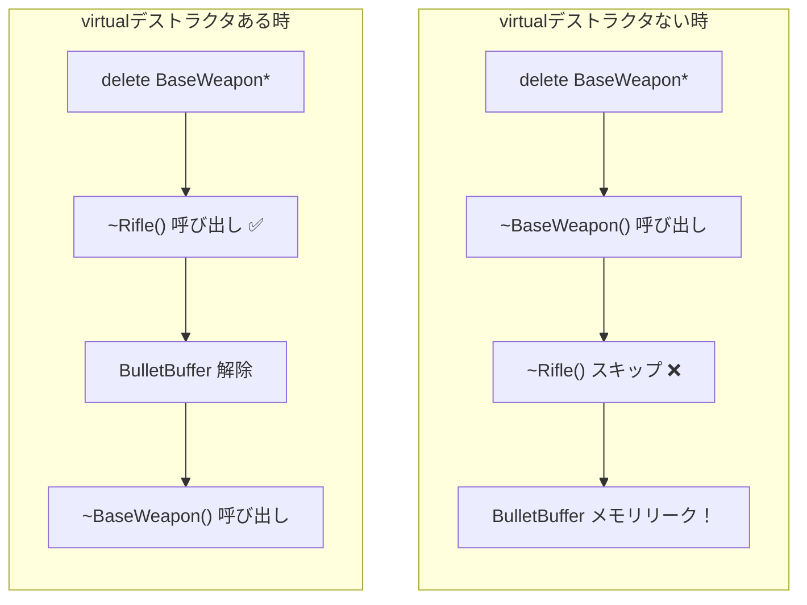
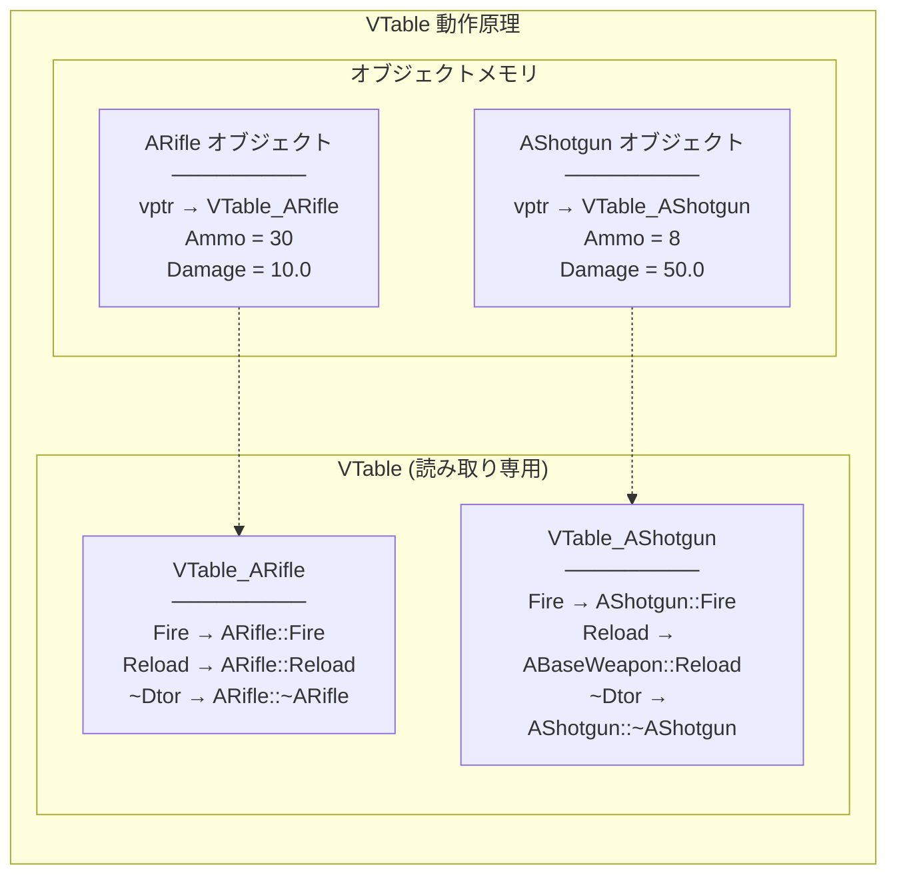

## このコード、読めますか？

Unrealプロジェクトでキャラクターのダメージ処理コードを開くと、こんなのが出てきます。

```cpp
// DamageableCharacter.h
UCLASS()
class MYGAME_API ADamageableCharacter : public ACharacter
{
    GENERATED_BODY()

public:
    ADamageableCharacter();

    virtual float TakeDamage(float DamageAmount, struct FDamageEvent const& DamageEvent,
        AController* EventInstigator, AActor* DamageCauser) override;

protected:
    virtual void BeginPlay() override;
    virtual void OnDeath();

    UPROPERTY(EditDefaultsOnly)
    float MaxHealth = 100.f;

    float CurrentHealth;
};

// EnemyCharacter.h
UCLASS()
class MYGAME_API AEnemyCharacter : public ADamageableCharacter
{
    GENERATED_BODY()

public:
    AEnemyCharacter();

protected:
    void OnDeath() override;
    virtual void DropLoot();
};
```

Unity開発者なら、こんな疑問が湧くでしょう：

- `virtual float TakeDamage(...) override;` — `virtual` と `override` が同時に？ C#ではどちらか一つだけ使うのに？
- `virtual void OnDeath();` — `= 0` がない virtual？ 抽象メソッドじゃないのかな？
- `void OnDeath() override;` — 子では `virtual` を付けなくてもいいの？
- `Super::BeginPlay()` — これはどこから来るの？ `base.` と同じものか？

**今回の講義でC++の継承/多態性メカニズムを完全に整理します。**

---

## 序論 - C#のvirtualとC++のvirtualは違う

C#で継承は楽です。`virtual` を付ければ子が `override` でき、付けなくても `new` で隠すことができます。大部分のメソッドは `virtual` なしでもよく動作します。

C++では **`virtual` 一つで完全に違う動作** になります。`virtual` がなければ親ポインタで呼び出すとき常に親の関数が実行されます。子の関数ではありません。これが「静的バインディング」と「動的バインディング」の違いですが、Unrealコードを読むにはこの違いを必ず理解しなければなりません。


---

## 1. 継承基本 - C#とほぼ同じだが違う点

### 1-1. 継承文法比較

```cpp
// C++ — : public 親クラス
class AEnemy : public ACharacter
{
    // ...
};
```

```csharp
// C# — : 親クラス
class Enemy : Character
{
    // ...
}
```

| 項目 | C# | C++ |
|------|-----|-----|
| 継承文法 | `: BaseClass` | `: public BaseClass` |
| 継承アクセス指定子 | なし (常にpublic) | `public` / `protected` / `private` |
| 多重継承 | ❌ クラスは単一継承のみ | **✅ 多重継承可能** |
| インターフェース多重実装 | ✅ | ✅ (純粋仮想クラスで実装) |
| 親呼び出し | `base.Method()` | `Super::Method()` (Unreal) / `Base::Method()` (純正C++) |

### 1-2. 継承アクセス指定子 — C#にない概念

```cpp
class AEnemy : public ACharacter      // 親のpublic → public, protected → protected
class AEnemy : protected ACharacter   // 親のpublic → protected
class AEnemy : private ACharacter     // 親のpublic/protected → private
```

**実務では 99.9% `public` 継承を使用します。** Unrealでは `public` 以外に他の継承アクセス指定子を見ることはほぼありません。「こんなものがあるんだ」程度に知っておけばいいです。

> **💬 ちょっと一言、これだけは知っておこう**
>
> **Q. C#で継承アクセス指定子がない理由は？**
>
> C#は設計哲学が違います。C#では `public` 継承だけ許可し、アクセス制限が必要ならインターフェースを明示的に実装します。C++の `protected`/`private` 継承は "is-a" より "is-implemented-in-terms-of" 関係を表現しますが、実務ではコンポジションで代替する方が良いです。

---

## 2. virtualとoverride - 核心中の核心

### 2-1. virtualがないとどうなるか？

これがC#と最も大きな違いです。C#では `virtual` なしでも子タイプで呼び出せば子関数が実行されます。C++ではそうではありません。

```cpp
// virtualない場合 — 静的バインディング
class ABaseWeapon
{
public:
    void Fire()  // virtualなし！
    {
        UE_LOG(LogTemp, Display, TEXT("BaseWeapon::Fire()"));
    }
};

class ARifle : public ABaseWeapon
{
public:
    void Fire()  // 同じ名前の関数定義 (オーバーライドではない！)
    {
        UE_LOG(LogTemp, Display, TEXT("Rifle::Fire()"));
    }
};

// テスト
ARifle* Rifle = new ARifle();
Rifle->Fire();              // "Rifle::Fire()" ← 子タイプだから子関数

ABaseWeapon* Weapon = Rifle; // 親ポインタに子オブジェクト代入
Weapon->Fire();              // "BaseWeapon::Fire()" ← ❌ 親関数が呼び出される！
```

```cpp
// virtualある場合 — 動的バインディング
class ABaseWeapon
{
public:
    virtual void Fire()  // virtualあり！
    {
        UE_LOG(LogTemp, Display, TEXT("BaseWeapon::Fire()"));
    }
};

class ARifle : public ABaseWeapon
{
public:
    void Fire() override  // オーバーライド
    {
        UE_LOG(LogTemp, Display, TEXT("Rifle::Fire()"));
    }
};

// テスト
ABaseWeapon* Weapon = new ARifle();
Weapon->Fire();  // "Rifle::Fire()" ← ✅ 実際のタイプ(ARifle)の関数呼び出し！
```



C#と比較すると：

| 状況 | C# | C++ (virtualなし) | C++ (virtualあり) |
|------|-----|-------------------|-------------------|
| 親タイプで呼び出し | 子関数 (virtual時) | **親関数！** | 子関数 |
| 子タイプで呼び出し | 子関数 | 子関数 | 子関数 |

### 2-2. overrideキーワード

C++で `override` はC++11に追加された **選択事項** キーワードです。書かなくてもコンパイルされます。しかし **必ず書くべきです。**

```cpp
class ABaseWeapon
{
public:
    virtual void Fire();
    virtual void Reload();
};

class ARifle : public ABaseWeapon
{
public:
    // ❌ overrideなし — 誤字があってもコンパイルされる！
    void Fier()           // ⚠️ 誤字！ 新しい関数になってしまう (警告なし！)
    {
    }

    // ✅ overrideあり — 誤字をコンパイラが捕まえる
    void Fier() override  // ❌ コンパイルエラー！ "Fierは親にありません"
    {
    }

    void Fire() override  // ✅ 正しいオーバーライド
    {
    }
};
```

| キーワード | C# | C++ | 必須可否 |
|--------|-----|-----|----------|
| `virtual` | 選択 (子がoverride可能に) | 選択 (動的バインディング活性化) | C++でもっと重要 |
| `override` | **必須** (override時必ず) | **選択** (C++11, だが強力推奨) | 両方書くのが良い |
| `abstract` / `= 0` | `abstract` | `= 0` | 実装ない関数 |
| `sealed` / `final` | `sealed` | `final` | 追加override禁止 |

> **💬 ちょっと一言、これだけは知っておこう**
>
> **Q. C++で `virtual` と `override` を同時に使えますか？**
>
> はい！ Unrealコードでよく見かけるパターンです：
> ```cpp
> virtual void BeginPlay() override;  // "この関数は仮想であり、親をオーバーライドする"
> ```
> `virtual` は「この関数も子が再びオーバーライドできる」という意味で、`override` は「親の仮想関数を再定義する」という意味です。実際にC++で一度 `virtual` なら子で `virtual` を書かなくても仮想関数として維持されます。しかし **意図を明確にするために** Unrealでは両方書くのが慣例です。
>
> **Q. 子で `virtual` を付けなくてもいいですか？**
>
> はい、技術的には一度 `virtual` で宣言された関数はすべての子で自動的に仮想関数です。しかしUnrealコーディング標準では **子がさらにオーバーライドされる可能性があるなら `virtual` を明示** し、**最終実装なら `override` だけ書くか `final` を付けること** を推奨します。

---

## 3. 純粋仮想関数 - C#のabstract

C#の `abstract` メソッドと同じです。**実装なしに宣言だけ** して、子が必ず実装しなければなりません。

```cpp
// C++ — 純粋仮想関数 (= 0)
class ABaseWeapon
{
public:
    virtual void Fire() = 0;          // 純粋仮想関数 — 実装なし
    virtual void Reload() = 0;
    virtual FString GetName() const = 0;
};

// ABaseWeapon 直接生成不可！
// ABaseWeapon* Weapon = new ABaseWeapon();  // ❌ コンパイルエラー！

class ARifle : public ABaseWeapon
{
public:
    void Fire() override { /* ライフル発射ロジック */ }
    void Reload() override { /* 装填ロジック */ }
    FString GetName() const override { return TEXT("Rifle"); }
};

ARifle* Rifle = new ARifle();  // ✅ すべての純粋仮想関数を実装したので生成可能
```

```csharp
// C# — abstract
abstract class BaseWeapon
{
    public abstract void Fire();
    public abstract void Reload();
    public abstract string GetName();
}

class Rifle : BaseWeapon
{
    public override void Fire() { /* 発射 */ }
    public override void Reload() { /* 装填 */ }
    public override string GetName() => "Rifle";
}
```

| 項目 | C# | C++ |
|------|-----|-----|
| 抽象メソッド宣言 | `abstract void Method();` | `virtual void Method() = 0;` |
| 抽象クラス表示 | `abstract class` | 純粋仮想関数が1個でもあれば自動的に抽象 |
| インスタンス生成 | 不可 | 不可 |
| クラスキーワード | `abstract class` 必須 | 別途キーワードなし (`= 0`なら自動) |

---

## 4. 仮想デストラクタ - 必ず知っておくべきルール

**継承されるクラスのデストラクタには必ず `virtual` を付けなければなりません。** C#ではGCがあって心配する必要ありませんが、C++ではこのルールを破ると **メモリがリークします。**

```cpp
class ABaseWeapon
{
public:
    ~ABaseWeapon()  // ❌ virtualなし！
    {
        UE_LOG(LogTemp, Display, TEXT("BaseWeapon 消滅"));
    }
};

class ARifle : public ABaseWeapon
{
public:
    ARifle() { BulletBuffer = new uint8[1024]; }

    ~ARifle()
    {
        delete[] BulletBuffer;  // これが呼び出されないとメモリリーク！
        UE_LOG(LogTemp, Display, TEXT("Rifle 消滅"));
    }

private:
    uint8* BulletBuffer;
};

// 問題状況
ABaseWeapon* Weapon = new ARifle();
delete Weapon;  // ❌ ~ABaseWeapon()だけ呼び出される！ ~ARifle()は呼び出されない！
                // → BulletBuffer メモリリーク！
```

```cpp
class ABaseWeapon
{
public:
    virtual ~ABaseWeapon()  // ✅ virtualデストラクタ！
    {
        UE_LOG(LogTemp, Display, TEXT("BaseWeapon 消滅"));
    }
};

// これで安全
ABaseWeapon* Weapon = new ARifle();
delete Weapon;  // ✅ ~ARifle() 呼び出し → ~ABaseWeapon() 呼び出し (子 → 親順序)
```



**ルール: 一つでも `virtual` 関数があるクラスはデストラクタも `virtual` にしろ。**

C#ではこの心配が全くありません。GCがすべてのオブジェクトをタイプに関係なく回収するからです。C++だけの重要なルールです。

| 状況 | デストラクタ | 結果 |
|------|--------|------|
| 親ポインタでdelete + 非仮想デストラクタ | `~Base()` | 子デストラクタ ❌ → リーク |
| 親ポインタでdelete + **仮想デストラクタ** | `virtual ~Base()` | 子 → 親順序で ✅ |
| 子タイプでdelete | どちらでも | 正常呼び出し |

> **💬 ちょっと一言、これだけは知っておこう**
>
> **Q. Unrealで `virtual ~AMyActor()` を直接書きますか？**
>
> ほぼ使いません。`UObject` 系列クラスはGCが管理するのでデストラクタを直接使うことがありません。`AActor`、`UActorComponent` などは `UObject` を継承しますが、これらのデストラクタはすでに `virtual` です。開発者が別に気を使う必要がありません。
>
> しかし **`F` 接頭辞クラス(一般C++クラス)** で継承が必要なら直接 `virtual` デストラクタを書かなければなりません。

---

## 5. VTable - virtualの後ろに隠されたメカニズム

C#ではランタイムがメソッド呼び出しを勝手に処理します。C++では **VTable(仮想関数テーブル)** というメカニズムが使われます。コードで直接見ることはありませんが、なぜ `virtual` にコストがあるのか理解できます。



**動作過程：**
1. `virtual` 関数があるクラスのオブジェクトには **vptr(仮想関数ポインタ)** が隠されています
2. vptrは該当クラスの **VTable(仮想関数テーブル)** を指します
3. `virtual` 関数を呼び出すと vptr → VTable → 実際関数の順に訪ねていきます
4. この過程がランタイムに起きるので **「動的バインディング」** と言います

**性能コスト：**
- オブジェクトサイズ：vptr一つ(8バイト, 64ビット)追加
- 関数呼び出し：間接参照1回追加（普通無視する水準）
- インライン不可：コンパイラがvirtual関数をインライン化できない

```cpp
// virtualがあれば
class AWeapon { virtual void Fire(); };  // sizeof = メンバ + 8(vptr)

// virtualがなければ
class FWeaponData { void Fire(); };      // sizeof = メンバのみ
```

> **💬 ちょっと一言、これだけは知っておこう**
>
> **Q. VTableのためにvirtualを節約すべきですか？**
>
> ゲーム開発でvirtual関数のオーバーヘッドは **ほぼ無視する水準** です。秒あたり数万回呼び出される低水準演算（数学計算、物理シミュレーション）でない以上、virtualコストは気にする必要ありません。Unrealの `Tick()`、`BeginPlay()` などがすべてvirtualな理由もこのためです。
>
> ただし **データ指向設計(DOD)** が必要な極限最適化状況ではvirtualを避けたりもします。これは非常に稀な場合です。

---

## 6. final - これ以上の継承/オーバーライド禁止

C#の `sealed` と同じ役割です。

```cpp
// final クラス — これ以上継承不可
class APlayerCharacter final : public ACharacter
{
    // ...
};

// class ASuperPlayer : public APlayerCharacter { };  // ❌ コンパイルエラー！

// final 関数 — これ以上オーバーライド不可
class ABaseEnemy : public ACharacter
{
public:
    virtual void Attack();
    virtual void Die() final;  // 子でオーバーライド禁止
};

class ABossEnemy : public ABaseEnemy
{
public:
    void Attack() override;    // ✅ OK
    // void Die() override;    // ❌ コンパイルエラー！ final関数
};
```

| C# | C++ | 意味 |
|----|-----|------|
| `sealed class` | `class Name final` | クラス継承禁止 |
| `sealed override void Method()` | `void Method() override final` | 関数オーバーライド禁止 |

---

## 7. インターフェース - 純粋仮想クラスで実装

C#には `interface` キーワードがありますが、C++にはありません。代わりに **すべてのメンバが純粋仮想関数であるクラス** をインターフェースのように使います。

```cpp
// C++ インターフェースパターン — 純粋仮想クラス
class IDamageable
{
public:
    virtual ~IDamageable() = default;  // 仮想デストラクタ
    virtual void TakeDamage(float Damage) = 0;
    virtual float GetHealth() const = 0;
    virtual bool IsDead() const = 0;
};

class IInteractable
{
public:
    virtual ~IInteractable() = default;
    virtual void Interact(AActor* Instigator) = 0;
    virtual FString GetInteractionText() const = 0;
};

// 多重実装 (C#の多重インターフェース実装と同一)
class AEnemyActor : public AActor, public IDamageable, public IInteractable
{
public:
    // IDamageable 実装
    void TakeDamage(float Damage) override { /* ... */ }
    float GetHealth() const override { return Health; }
    bool IsDead() const override { return Health <= 0; }

    // IInteractable 実装
    void Interact(AActor* Instigator) override { /* ... */ }
    FString GetInteractionText() const override { return TEXT("敵を調査する"); }

private:
    float Health = 100.f;
};
```

```csharp
// C# — インターフェース
interface IDamageable
{
    void TakeDamage(float damage);
    float GetHealth();
    bool IsDead();
}

interface IInteractable
{
    void Interact(GameObject instigator);
    string GetInteractionText();
}

class EnemyActor : MonoBehaviour, IDamageable, IInteractable
{
    // 実装...
}
```

**Unrealインターフェースは少し特別です。** Unrealリフレクションシステムと統合するために `UINTERFACE` マクロを使用します：

```cpp
// Unrealインターフェース宣言 (第7講で詳しく扱う)
UINTERFACE(MinimalAPI)
class UDamageable : public UInterface
{
    GENERATED_BODY()
};

class IDamageable
{
    GENERATED_BODY()

public:
    virtual void TakeDamage(float Damage) = 0;
};

// 使用
UCLASS()
class AEnemy : public AActor, public IDamageable
{
    GENERATED_BODY()

public:
    void TakeDamage(float Damage) override;
};

// インターフェースチェック
if (OtherActor->GetClass()->ImplementsInterface(UDamageable::StaticClass()))
{
    IDamageable* Damageable = Cast<IDamageable>(OtherActor);
    Damageable->TakeDamage(10.f);
}
```

| 項目 | C# | C++ (純正) | C++ (Unreal) |
|------|-----|-----------|-------------|
| キーワード | `interface` | なし (純粋仮想クラス) | `UINTERFACE` マクロ |
| 多重実装 | ✅ | ✅ | ✅ |
| メンバ変数 | ❌ 不可 (C# 8.0前) | 可能 (だが使わない) | 不可 (`I`クラスに) |
| ネーミング | `IName` | `IName` (慣例) | `UName` + `IName` (ペアで) |

---

## 8. Unreal実戦コード解剖 - Super::と継承パターン

### 8-1. Super:: — C#のbase.

Unrealで `Super` は `GENERATED_BODY()` マクロが自動的に作ってくれる **親クラスのtypedef** です。

```cpp
// ACharacterを継承すれば
class AMyCharacter : public ACharacter
{
    GENERATED_BODY()  // このマクロの中に: typedef ACharacter Super;
};

// だから Super:: は ACharacter:: と同じ
void AMyCharacter::BeginPlay()
{
    Super::BeginPlay();  // = ACharacter::BeginPlay();
    // C#の base.BeginPlay() と同一の役割
}
```

```csharp
// C# 比較
protected override void Awake()
{
    base.Awake();  // 親のAwake呼び出し
}
```

| C# | C++ (Unreal) | C++ (純正) |
|----|-------------|-----------|
| `base.Method()` | `Super::Method()` | `ParentClass::Method()` |

**Unrealで必ず `Super::` 呼び出さなければならない関数たち：**
- `BeginPlay()` — 親の初期化ロジック実行
- `Tick()` — 普通呼び出すが、意図的に省略することもできる
- `EndPlay()` — 親の整理ロジック実行
- `TakeDamage()` — 親のダメージ処理ロジック

```cpp
// ❌ Super:: 忘れると親機能動作しない
void AMyCharacter::BeginPlay()
{
    // Super::BeginPlay() なし！
    CurrentHealth = MaxHealth;
    // 親(ACharacter)のBeginPlayロジックが実行されない → バグ！
}

// ✅ 正しいパターン
void AMyCharacter::BeginPlay()
{
    Super::BeginPlay();        // 常に先に親呼び出し！
    CurrentHealth = MaxHealth;
}
```

### 8-2. 最初のコード再分析

```cpp
// DamageableCharacter.h
UCLASS()
class MYGAME_API ADamageableCharacter : public ACharacter  // ① ACharacter継承
{
    GENERATED_BODY()  // ② Super = ACharacter (自動typedef)

public:
    ADamageableCharacter();

    // ③ virtual + override: 親(AActor)のTakeDamageを再定義しながら、子も再定義可能
    virtual float TakeDamage(float DamageAmount, struct FDamageEvent const& DamageEvent,
        AController* EventInstigator, AActor* DamageCauser) override;

protected:
    // ④ virtual + override: ACharacterのBeginPlay再定義、子も再定義可能
    virtual void BeginPlay() override;

    // ⑤ virtualのみ: 新しい仮想関数 (親になし、= 0でない → 基本実装あり)
    virtual void OnDeath();

    UPROPERTY(EditDefaultsOnly)
    float MaxHealth = 100.f;
    float CurrentHealth;
};

// EnemyCharacter.h
UCLASS()
class MYGAME_API AEnemyCharacter : public ADamageableCharacter  // ⑥ 2段階継承
{
    GENERATED_BODY()  // Super = ADamageableCharacter

public:
    AEnemyCharacter();

protected:
    // ⑦ overrideのみ: ADamageableCharacterのOnDeath再定義
    //    virtualを使わなかったのは「これ以上子がoverrideする必要ない」という意図
    void OnDeath() override;

    // ⑧ 新しいvirtual関数
    virtual void DropLoot();
};
```

| 番号 | パターン | 意味 |
|------|------|------|
| ③ | `virtual ... override` | 親関数再定義 + 子も再定義可能 |
| ⑤ | `virtual void OnDeath()` | 新しい仮想関数定義 (基本実装あり) |
| ⑦ | `void OnDeath() override` | 親の仮想関数を再定義 (virtual省略) |
| ⑧ | `virtual void DropLoot()` | このクラスで始まる新しい仮想関数 |

---

## 9. よくある間違い & 注意事項

### 間違い 1: virtualなしでオーバーライド試行

```cpp
class ABaseEnemy : public ACharacter
{
public:
    void OnHit(float Damage)  // ❌ virtualなし！
    {
        Health -= Damage;
    }
};

class ABossEnemy : public ABaseEnemy
{
public:
    void OnHit(float Damage)  // オーバーライドではなく「隠す」！
    {
        Health -= Damage * 0.5f;  // ボスはダメージ50%減少
    }
};

ABaseEnemy* Enemy = new ABossEnemy();
Enemy->OnHit(100);  // ABaseEnemy::OnHit 呼び出し → ダメージ減少なし！
```

**解決**: 親関数に `virtual` を付け、子に `override` を付けてください。

### 間違い 2: override誤字を知らずに越える

```cpp
class AMyCharacter : public ACharacter
{
    virtual void BeginPlay() override;  // ✅

    virtual void beginPlay() override;  // ❌ コンパイルエラー (小文字b)
    virtual void BeginPlay(int) override;  // ❌ コンパイルエラー (パラメータ違う)
};
```

`override` キーワードがなければ上の二つの場合とも **新しい関数** として生成され、なぜ `BeginPlay` が呼び出されないのかしばらくデバッグしたでしょう。

### 間違い 3: 仮想デストラクタ漏れ

```cpp
// ❌ 危険なコード
class FWeaponBase
{
public:
    ~FWeaponBase() {}  // virtualなし！
};

class FRifle : public FWeaponBase
{
public:
    ~FRifle() { delete[] BulletData; }
    uint8* BulletData = new uint8[256];
};

FWeaponBase* Weapon = new FRifle();
delete Weapon;  // ~FRifle() 呼び出しなし → BulletData リーク！
```

**ルール: `virtual` 関数が一つでもあるか、継承される予定なら → `virtual ~ClassName()`**

### 間違い 4: Super:: 呼び出し漏れ

```cpp
void AMyCharacter::EndPlay(const EEndPlayReason::Type EndPlayReason)
{
    // ❌ Super::EndPlay() しない！
    // 親の整理ロジックが実行されずリソースリーク可能性

    CleanupWeapon();
}

// ✅ 正しいパターン
void AMyCharacter::EndPlay(const EEndPlayReason::Type EndPlayReason)
{
    CleanupWeapon();
    Super::EndPlay(EndPlayReason);  // 最後に親呼び出し (EndPlayは普通最後)
}
```

**パターン:**
- `BeginPlay()` → `Super::` 先、私のロジック後
- `EndPlay()` → 私の整理先、`Super::` 後
- `Tick()` → 状況により違う (普通 `Super::` 先)

---

## まとめ - 第6講チェックリスト

この講義を終えると、Unrealコードで以下を読めるようになっているはずです：

- [ ] `virtual void Method()` が「動的バインディングを活性化する」ということを知っている
- [ ] `virtual` なしで関数を再定義すれば親ポインタで親関数が呼び出されることを知っている
- [ ] `override` キーワードが誤字/シグネチャミスを防止する役割であることを知っている
- [ ] `virtual void Method() = 0;` がC#の `abstract` と同じであることを知っている
- [ ] `virtual ~ClassName()` がなぜ継承クラスに必須なのか知っている
- [ ] VTableが何でありvirtualの性能コストが無視する水準であることを知っている
- [ ] `final` がC#の `sealed` と同じ役割であることを知っている
- [ ] C++でインターフェースが純粋仮想クラスで実装されることを知っている
- [ ] `Super::Method()` がC#の `base.Method()` と同じであることを知っている
- [ ] `Super` が `GENERATED_BODY()` マクロによって自動的にtypedefされることを知っている
- [ ] `BeginPlay` では `Super::` 先、`EndPlay` では私のロジック先パターンを知っている
- [ ] `virtual ... override` を同時に使うUnrealパターンを読める

---

## 次回予告

**第7講：Unrealマクロの魔法 - UCLASS, UPROPERTY, UFUNCTION**

Unrealコードで最も多く見かける `UCLASS()`, `UPROPERTY()`, `UFUNCTION()`。これらはC++標準ではない **Unrealだけのマクロ** です。このマクロたちがなければGCも、エディタ露出も、ブループリント連動もできません。`GENERATED_BODY()` が何をするか、`UPROPERTY(EditAnywhere)` と `UPROPERTY(VisibleAnywhere)` の違いは何か、リフレクションシステムがなぜ必要なのか扱います。
