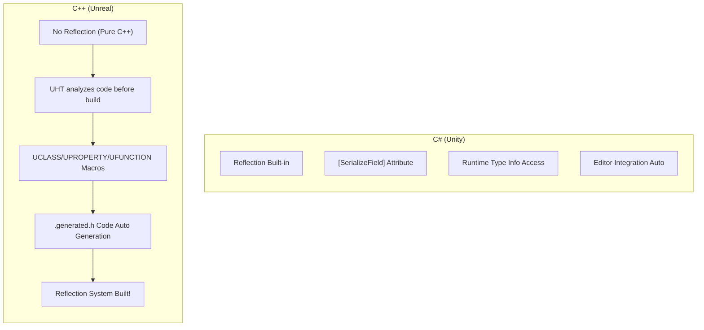
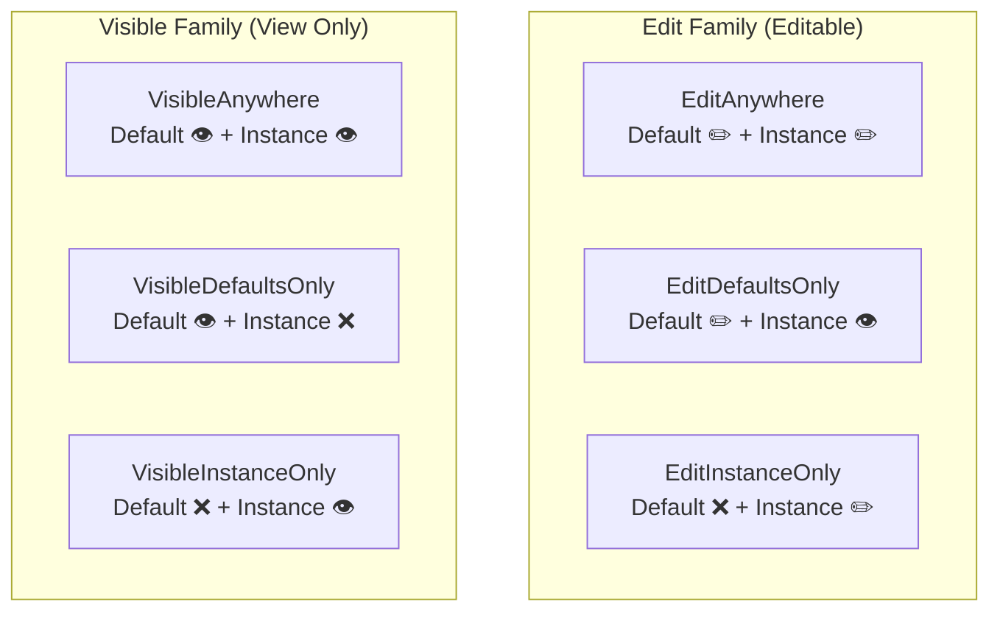

## Can You Read This Code?

When you open a weapon class in an Unreal project, you see something like this.

```cpp
// Weapon.h
#pragma once

#include "CoreMinimal.h"
#include "GameFramework/Actor.h"
#include "Weapon.generated.h"

UCLASS(Blueprintable)
class MYGAME_API AWeapon : public AActor
{
    GENERATED_BODY()

public:
    AWeapon();

    UFUNCTION(BlueprintCallable, Category = "Combat")
    void Fire();

    UFUNCTION(BlueprintPure, Category = "Combat")
    int32 GetCurrentAmmo() const;

    UFUNCTION(BlueprintImplementableEvent, Category = "Effects")
    void PlayFireEffect();

protected:
    UPROPERTY(VisibleAnywhere, BlueprintReadOnly, Category = "Components")
    USkeletalMeshComponent* WeaponMesh;

    UPROPERTY(EditDefaultsOnly, BlueprintReadOnly, Category = "Config")
    float Damage = 25.f;

    UPROPERTY(EditDefaultsOnly, BlueprintReadOnly, Category = "Config", meta = (ClampMin = "1"))
    int32 MaxAmmo = 30;

    UPROPERTY(BlueprintReadOnly, Category = "State")
    int32 CurrentAmmo;
};
```

If you are a Unity developer, you might have these questions:

- `UCLASS(Blueprintable)` — What is this? It's not C++ syntax?
- `GENERATED_BODY()` — What does this macro do?
- `Weapon.generated.h` — Where does this header come from?
- `UPROPERTY(EditDefaultsOnly, BlueprintReadOnly, Category = "Config")` — What are these inside the long parenthesis?
- `UFUNCTION(BlueprintImplementableEvent)` — Can a function exist without implementation?

**In this lecture, we completely summarize the Unreal macro system.**

---

## Introduction - Why Macros are Needed

Unlike C#, C++ does not have **Reflection**. In C#, you can read and write class fields and methods at runtime, but it's impossible in pure C++.

However, Unreal Engine needs these features:
- **Editor**: Need to expose variables to Inspector
- **Blueprint**: Need to call C++ functions from Blueprint
- **GC**: Need to track which UObject* are referenced
- **Serialization**: Need to save/load objects
- **Network**: Need to replicate variables over network

What makes all this possible is **UHT (Unreal Header Tool)** and **Reflection Macros**.



| C# (Unity) | C++ (Unreal) | Role |
|-------------|-------------|------|
| `[SerializeField]` | `UPROPERTY()` | Expose to Editor/Serialization |
| `[Header("Stats")]` | `Category = "Stats"` | Category Classification |
| `[Range(0, 100)]` | `meta = (ClampMin = "0", ClampMax = "100")` | Value Range Limit |
| `public` field | `UPROPERTY(BlueprintReadWrite)` | Read/Write from External |
| Reflection Built-in | `UCLASS()` + `GENERATED_BODY()` | Type Info Registration |

---

## 1. GENERATED_BODY() and .generated.h

### 1-1. What GENERATED_BODY() Does

`GENERATED_BODY()` is a macro that inserts code automatically generated by UHT. Internally it includes:

```cpp
// GENERATED_BODY() generates things like this
typedef ACharacter Super;            // Enable usage of Super::
typedef AMyCharacter ThisClass;      // Define ThisClass type
static UClass* StaticClass();        // Runtime Type Information
virtual UClass* GetClass() const;    // Return actual type
// + Serialization, Reflection, GC related codes...
```

**Rules:**
- **Must** be present in all `UCLASS`, `USTRUCT` classes
- Must be located on the **first line** of class body
- Comes above `public`/`private`/`protected`

### 1-2. .generated.h Header

```cpp
#pragma once

#include "CoreMinimal.h"
#include "GameFramework/Actor.h"
#include "Weapon.generated.h"  // ← Must be last #include!
```

`Weapon.generated.h` is a header automatically generated by UHT. It is generated before build, and should not be edited manually.

**Rule: `.generated.h` must always be the last `#include`.** Incorrect order causes compile error.

> **💬 Wait, Let's Know This**
>
> **Q. Why doesn't Unity have macros like this?**
>
> Because reflection is **built into the language** itself in C#. You can read field info with `typeof(MyClass).GetFields()`. C++ doesn't have this feature, so Unreal created a **build tool (UHT)** to mimic it.
>
> **Q. I sometimes see GENERATED_UCLASS_BODY() instead of GENERATED_BODY()?**
>
> `GENERATED_UCLASS_BODY()` is an old version macro. There are differences like constructor automatically becoming `public`. `GENERATED_BODY()` is recommended since late UE4, so use only `GENERATED_BODY()` in new code.

---

## 2. UCLASS - Registering Class to Engine

### 2-1. Basic Usage

```cpp
// Most basic UCLASS
UCLASS()
class MYGAME_API AMyActor : public AActor
{
    GENERATED_BODY()
};
```

`MYGAME_API` is a module export macro. Allows access to this class from other modules. Depends on project name (`MYGAME` is project name).

### 2-2. Frequently Used UCLASS Specifiers

```cpp
UCLASS(Blueprintable)                    // Can inherit in Blueprint
UCLASS(BlueprintType)                    // Can be used as variable type in Blueprint
UCLASS(Abstract)                         // Cannot instantiate directly (Child only)
UCLASS(NotBlueprintable)                 // Blueprint inheritance blocked
UCLASS(Transient)                        // Not saved to disk
UCLASS(Config=Game)                      // Link with .ini config file
```

| UCLASS Specifier | Unity Counterpart | Meaning |
|-------------|-----------|------|
| `Blueprintable` | MonoBehaviour (Default) | Can create BP child class |
| `BlueprintType` | Serializable Class | Use as BP variable type |
| `Abstract` | `abstract class` | Cannot create instance |
| `NotBlueprintable` | - | Block BP inheritance |

Most common combinations in practice:

```cpp
// Actor family — Usually used without specifier (Blueprintable by default)
UCLASS()
class AMyCharacter : public ACharacter { ... };

// Data Asset — BlueprintType mandatory
UCLASS(BlueprintType)
class UWeaponData : public UDataAsset { ... };

// Abstract Base — Direct usage prohibited
UCLASS(Abstract)
class ABaseProjectile : public AActor { ... };
```

---

## 3. UPROPERTY - Registering Variables to Editor/GC

**UPROPERTY is the most frequently used macro in Unreal.** It has two core roles:
1. **GC Tracking** — Protect UObject* pointer from being collected
2. **Editor/Blueprint Exposure** — Edit in Inspector or access in BP

### 3-1. GC Tracking — Most Important Role

```cpp
UCLASS()
class AMyCharacter : public ACharacter
{
    GENERATED_BODY()

private:
    // ❌ No UPROPERTY → GC doesn't know this ref → Target can be collected!
    UWeaponComponent* BadWeapon;

    // ✅ With UPROPERTY → GC tracks ref → Safe!
    UPROPERTY()
    UWeaponComponent* GoodWeapon;
};
```

**Rule: Always attach `UPROPERTY()` to `UObject*` pointer member variables.** Even without specifiers, parenthesis alone enable GC tracking.

C# doesn't have this worry. GC tracks all references automatically. In C++, you must explicitly tell GC "Track this pointer".

### 3-2. Editor Exposure — Edit vs Visible

```cpp
// Edit Family — Can edit value
UPROPERTY(EditAnywhere)        // Can edit both class default + instance
UPROPERTY(EditDefaultsOnly)    // Edit only in class default (Read-only in instance)
UPROPERTY(EditInstanceOnly)    // Edit only in instance (Not visible in default)

// Visible Family — View only (Cannot edit)
UPROPERTY(VisibleAnywhere)     // View only anywhere
UPROPERTY(VisibleDefaultsOnly) // View only in default
UPROPERTY(VisibleInstanceOnly) // View only in instance
```



**Practical Patterns:**

```cpp
// Balance value adjusted by designer → EditDefaultsOnly
UPROPERTY(EditDefaultsOnly, Category = "Stats")
float MaxHealth = 100.f;

// Value set differently per instance by designer → EditAnywhere
UPROPERTY(EditAnywhere, Category = "Config")
FName SpawnTag;

// Component created in constructor → VisibleAnywhere
UPROPERTY(VisibleAnywhere, Category = "Components")
UStaticMeshComponent* MeshComp;

// Runtime changing state value → No editor exposure needed
UPROPERTY()
float CurrentHealth;
```

| Situation | Recommended Specifier | Reason |
|------|-----------|------|
| Balance Value (HP, Damage) | `EditDefaultsOnly` | Set once in BP default |
| Per-Instance Setting | `EditAnywhere` | Different value for each instance placed in level |
| Component Pointer | `VisibleAnywhere` | Created in constructor so Edit X, View Only |
| Runtime State | `UPROPERTY()` or `BlueprintReadOnly` | GC Tracking + Exposure for debugging |

### 3-3. Blueprint Exposure

```cpp
UPROPERTY(BlueprintReadWrite)   // Read + Write in BP
UPROPERTY(BlueprintReadOnly)    // Read Only in BP
```

**Editor exposure and Blueprint exposure are independent.** Combine if both needed:

```cpp
// Most common combinations
UPROPERTY(EditDefaultsOnly, BlueprintReadOnly, Category = "Stats")
float MaxHealth = 100.f;

UPROPERTY(EditAnywhere, BlueprintReadWrite, Category = "Config")
float MoveSpeed = 600.f;

UPROPERTY(VisibleAnywhere, BlueprintReadOnly, Category = "Components")
UCameraComponent* Camera;
```

### 3-4. meta Specifiers

```cpp
// Value range limit (Editor slider + Code clamping)
UPROPERTY(EditAnywhere, meta = (ClampMin = "0", ClampMax = "100"))
int32 Percentage;

// Range limit in Editor UI only (Can exceed in code)
UPROPERTY(EditAnywhere, meta = (UIMin = "0", UIMax = "1000"))
float Damage;

// Edit with 3D widget in Editor
UPROPERTY(EditAnywhere, meta = (MakeEditWidget = true))
FVector TargetLocation;

// Add Tooltip
UPROPERTY(EditAnywhere, meta = (ToolTip = "Regen per second"))
float RegenRate = 1.f;
```

Unity Counterpart:

| Unity Attribute | Unreal UPROPERTY meta | Meaning |
|-----------------|---------------------|------|
| `[Range(0, 100)]` | `meta = (ClampMin = "0", ClampMax = "100")` | Value Range Limit |
| `[Tooltip("Desc")]` | `meta = (ToolTip = "Desc")` | Inspector Tooltip |
| `[Header("Section")]` | `Category = "Section"` | Category Classification |
| `[HideInInspector]` | `UPROPERTY()` only without editor specifier | Hide in Inspector |

> **💬 Wait, Let's Know This**
>
> **Q. Can't I use EditAnywhere for components?**
>
> If you use `EditAnywhere` for a component **pointer**, you can change the pointer itself to another component in the editor. This is almost never the intended behavior. Use `VisibleAnywhere` for component pointers, and edit component **properties** (material, size, etc.) by selecting the component in the editor.
>
> **Q. What happens without Category?**
>
> It goes into "Default" category when displayed in editor. Using Category organizes variables by section in Inspector. It's good to always use Category in team projects.

---

## 4. UFUNCTION - Registering Functions to Blueprint/Engine

### 4-1. BlueprintCallable — The Basic

```cpp
// Implement in C++, Call in Blueprint
UFUNCTION(BlueprintCallable, Category = "Combat")
void Fire();

UFUNCTION(BlueprintCallable, Category = "Combat")
void Reload();
```

Similar to calling `public` method from UnityEvent or editor button in Unity.

### 4-2. BlueprintPure — Function with Output Only

```cpp
// Return value without "Execution Pin" in Blueprint
UFUNCTION(BlueprintPure, Category = "Stats")
float GetHealthPercent() const;

UFUNCTION(BlueprintPure, Category = "Stats")
bool IsDead() const;

UFUNCTION(BlueprintPure, Category = "Stats")
int32 GetCurrentAmmo() const { return CurrentAmmo; }
```

`BlueprintPure` is used for **getter functions without side effects**. Connected only with data pins without execution pin in Blueprint.

| Specifier | In Blueprint | Usage |
|--------|-------------|------|
| `BlueprintCallable` | Has Exec Pin (Left/Right of node) | Function performing action |
| `BlueprintPure` | No Exec Pin (Data Pin only) | Getter returning value |

### 4-3. BlueprintImplementableEvent — Implement in BP Only

```cpp
// Declaration only in C++, Implementation in Blueprint
UFUNCTION(BlueprintImplementableEvent, Category = "Events")
void OnLevelUp();

UFUNCTION(BlueprintImplementableEvent, Category = "Effects")
void PlayHitEffect(FVector HitLocation);
```

**Do not write implementation in `.cpp` in C++!** Implementation of this function is done in Blueprint Editor.

```cpp
// Can call from C++
void AMyCharacter::GainExp(int32 Amount)
{
    Exp += Amount;
    if (Exp >= ExpToNextLevel)
    {
        Level++;
        OnLevelUp();  // ← Call function implemented in BP
    }
}
```

### 4-4. BlueprintNativeEvent — C++ Default Impl + BP Override

```cpp
// C++ provides default impl, BP can override
UFUNCTION(BlueprintNativeEvent, Category = "Combat")
float CalculateDamage(float BaseDamage);
```

Caution: C++ implementation is written in function with `_Implementation` suffix.

```cpp
// .cpp — _Implementation suffix!
float AMyCharacter::CalculateDamage_Implementation(float BaseDamage)
{
    // Default implementation: Apply defense
    return FMath::Max(0.f, BaseDamage - Defense);
}
```

If not overridden in Blueprint, C++ implementation is used; if overridden, Blueprint implementation is used.

| Specifier | C++ Impl | BP Impl | Usage |
|--------|---------|---------|------|
| `BlueprintCallable` | ✅ Mandatory | ❌ No | C++ Only Logic |
| `BlueprintImplementableEvent` | ❌ No | ✅ Mandatory | BP Only Event |
| `BlueprintNativeEvent` | ✅ (`_Implementation`) | ✅ (Override possible) | C++ Default + BP Customize |

```csharp
// Similar patterns in Unity
// BlueprintCallable ≈ public method
// BlueprintImplementableEvent ≈ UnityEvent / SendMessage
// BlueprintNativeEvent ≈ virtual method (override in child class)
```

> **💬 Wait, Let's Know This**
>
> **Q. Why is `_Implementation` suffix needed?**
>
> `BlueprintNativeEvent` has UHT auto-generate a wrapper function. When `CalculateDamage()` is called, wrapper selects "BP if override exists, otherwise C++ `_Implementation`". Due to this mechanism, direct implementation must be done in `_Implementation`.
>
> **Q. Can I call function from editor like `[ContextMenu("Fire")]` in C#?**
>
> Yes! Use `CallInEditor` specifier:
> ```cpp
> UFUNCTION(CallInEditor, Category = "Debug")
> void DebugSpawnEnemy();
> ```
> A button appears in editor detail panel, executing function when clicked.

---

## 5. USTRUCT - Registering Structs to Engine

`USTRUCT` is used as frequently as `UCLASS`. Needed when using data bundles in Blueprint.

```cpp
USTRUCT(BlueprintType)
struct FWeaponStats
{
    GENERATED_BODY()

    UPROPERTY(EditAnywhere, BlueprintReadWrite)
    float Damage = 10.f;

    UPROPERTY(EditAnywhere, BlueprintReadWrite)
    float FireRate = 0.1f;

    UPROPERTY(EditAnywhere, BlueprintReadWrite)
    int32 MaxAmmo = 30;

    UPROPERTY(EditAnywhere, BlueprintReadWrite)
    float ReloadTime = 2.f;
};

// Usage
UCLASS()
class AWeapon : public AActor
{
    GENERATED_BODY()

protected:
    UPROPERTY(EditDefaultsOnly, Category = "Config")
    FWeaponStats WeaponStats;  // Use struct as variable
};
```

```csharp
// Unity Counterpart
[System.Serializable]
public struct WeaponStats
{
    public float damage;
    public float fireRate;
    public int maxAmmo;
    public float reloadTime;
}
```

| Macro | Target | Prerequisite | GC Managed |
|--------|------|----------|---------|
| `UCLASS()` | Class | Must inherit `UObject` | ✅ |
| `USTRUCT()` | Struct | No `UObject` inheritance needed | ❌ (Value Type) |
| `UENUM()` | Enum | - | ❌ |

---

## 6. UENUM - Registering Enums to Blueprint

```cpp
UENUM(BlueprintType)
enum class EWeaponType : uint8
{
    Rifle      UMETA(DisplayName = "Rifle"),
    Shotgun    UMETA(DisplayName = "Shotgun"),
    Pistol     UMETA(DisplayName = "Pistol"),
    Sniper     UMETA(DisplayName = "Sniper Rifle")
};

// Usage
UPROPERTY(EditAnywhere, BlueprintReadWrite, Category = "Config")
EWeaponType WeaponType = EWeaponType::Rifle;
```

```csharp
// In Unity, just declaring enum as public auto-exposes it
public enum WeaponType
{
    Rifle,
    Shotgun,
    Pistol,
    Sniper
}
```

**Unreal Rules:**
- Declare enum based on `uint8` (Blueprint compatible)
- Use `E` prefix
- Set editor display name with `UMETA(DisplayName = "Display Name")`

---

## 7. Full Summary - Macro Combination Cheatsheet

```cpp
// ═══════════════════════════════════════════
// Unreal Macro Practical Cheatsheet
// ═══════════════════════════════════════════

// ── Class ──
UCLASS()                          // Basic
UCLASS(Blueprintable)             // Allow BP Inheritance
UCLASS(Abstract)                  // Prohibit Instance Creation

// ── Variable: Editor Exposure ──
UPROPERTY()                       // GC Tracking Only (Not visible in Editor)
UPROPERTY(EditAnywhere)           // Edit Anywhere
UPROPERTY(EditDefaultsOnly)       // Edit Default Only ← Balance Values
UPROPERTY(VisibleAnywhere)        // View Only ← Component Pointers

// ── Variable: Blueprint Exposure ──
UPROPERTY(BlueprintReadWrite)     // Read/Write in BP
UPROPERTY(BlueprintReadOnly)      // Read Only in BP

// ── Variable: Practical Combos ──
UPROPERTY(EditDefaultsOnly, BlueprintReadOnly, Category = "Stats")    // Balance Value
UPROPERTY(EditAnywhere, BlueprintReadWrite, Category = "Config")      // Config Value
UPROPERTY(VisibleAnywhere, BlueprintReadOnly, Category = "Components") // Component

// ── Function ──
UFUNCTION(BlueprintCallable)              // Callable in BP
UFUNCTION(BlueprintPure)                  // getter (No exec pin)
UFUNCTION(BlueprintImplementableEvent)    // Implement in BP only
UFUNCTION(BlueprintNativeEvent)           // C++ Default + BP Override

// ── Struct/Enum ──
USTRUCT(BlueprintType)            // Struct usable in BP
UENUM(BlueprintType)              // Enum usable in BP
```

---

## 8. Common Mistakes & Precautions

### Mistake 1: UObject* Pointer without UPROPERTY

```cpp
// ❌ Can be collected by GC!
UMyComponent* Weapon;

// ✅ GC tracking with UPROPERTY
UPROPERTY()
UMyComponent* Weapon;
```

This is the most common and fatal mistake. Crash happens **intermittently** instead of immediately, making debugging difficult.

### Mistake 2: .generated.h Order Error

```cpp
// ❌ .generated.h is not last
#include "Weapon.generated.h"
#include "Components/StaticMeshComponent.h"  // Error!

// ✅ .generated.h is always last
#include "Components/StaticMeshComponent.h"
#include "Weapon.generated.h"
```

### Mistake 3: Using EditAnywhere for Components

```cpp
// ❌ Dangerous to make component pointer editable
UPROPERTY(EditAnywhere)
UStaticMeshComponent* Mesh;  // Can change to other component in editor!

// ✅ Component pointer view only
UPROPERTY(VisibleAnywhere)
UStaticMeshComponent* Mesh;
```

### Mistake 4: Missing _Implementation in BlueprintNativeEvent

```cpp
// Declaration
UFUNCTION(BlueprintNativeEvent)
void OnHit(float Damage);

// ❌ Implementation with normal name
void AMyActor::OnHit(float Damage) { ... }  // Compile Error!

// ✅ _Implementation suffix
void AMyActor::OnHit_Implementation(float Damage) { ... }
```

---

## Summary - Lecture 7 Checklist

After this lecture, you should be able to read the following in Unreal code:

- [ ] Know `UCLASS()`, `UPROPERTY()`, `UFUNCTION()` are reflection macros
- [ ] Know `GENERATED_BODY()` generates Super typedef, reflection code
- [ ] Know `.generated.h` must be the last `#include`
- [ ] Know `UObject*` pointer without `UPROPERTY()` has GC risk
- [ ] Know difference between `EditAnywhere` / `EditDefaultsOnly` / `VisibleAnywhere`
- [ ] Know difference between `BlueprintReadWrite` vs `BlueprintReadOnly`
- [ ] Know difference between `BlueprintCallable` / `BlueprintPure` / `BlueprintImplementableEvent` / `BlueprintNativeEvent`
- [ ] Know `_Implementation` pattern of `BlueprintNativeEvent`
- [ ] Can read `USTRUCT(BlueprintType)` and `UENUM(BlueprintType)`
- [ ] Can read specifiers like `Category`, `meta = (ClampMin/ClampMax)`

---

## Next Lecture Preview

**Lecture 8: Unreal Class Hierarchy and Gameplay Framework**

Why `UObject → AActor → APawn → ACharacter` class tree is designed this way, what roles `GameMode`, `PlayerController`, `GameState` play, and order of `BeginPlay() → Tick() → EndPlay()` lifecycle. We also compare how Unreal's component architecture differs from Unity's.
