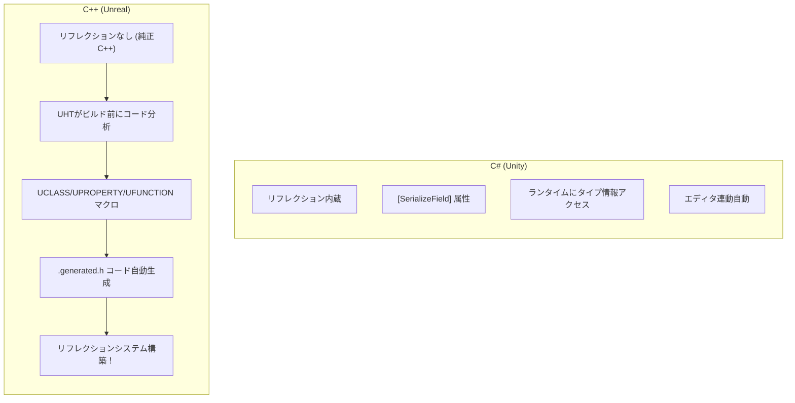
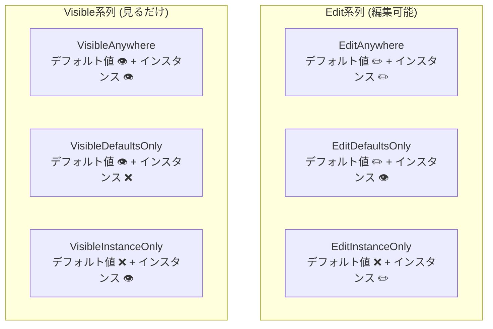

## このコード、読めますか？

Unrealプロジェクトで武器クラスを開くと、こんなのが出てきます。

```cpp
// Weapon.h
#pragma once

#include "CoreMinimal.h"
#include "GameFramework/Actor.h"
#include "Weapon.generated.h"

UCLASS(Blueprintable)
class MYGAME_API AWeapon : public AActor
{
    GENERATED_BODY()

public:
    AWeapon();

    UFUNCTION(BlueprintCallable, Category = "Combat")
    void Fire();

    UFUNCTION(BlueprintPure, Category = "Combat")
    int32 GetCurrentAmmo() const;

    UFUNCTION(BlueprintImplementableEvent, Category = "Effects")
    void PlayFireEffect();

protected:
    UPROPERTY(VisibleAnywhere, BlueprintReadOnly, Category = "Components")
    USkeletalMeshComponent* WeaponMesh;

    UPROPERTY(EditDefaultsOnly, BlueprintReadOnly, Category = "Config")
    float Damage = 25.f;

    UPROPERTY(EditDefaultsOnly, BlueprintReadOnly, Category = "Config", meta = (ClampMin = "1"))
    int32 MaxAmmo = 30;

    UPROPERTY(BlueprintReadOnly, Category = "State")
    int32 CurrentAmmo;
};
```

Unity開発者なら、こんな疑問が湧くでしょう：

- `UCLASS(Blueprintable)` — これは何？ C++文法じゃないけど？
- `GENERATED_BODY()` — このマクロは何をするの？
- `Weapon.generated.h` — このヘッダーはどこから来るの？
- `UPROPERTY(EditDefaultsOnly, BlueprintReadOnly, Category = "Config")` — この長い括弧の中のものは何？
- `UFUNCTION(BlueprintImplementableEvent)` — 関数なのに実装がなくてもいいの？

**今回の講義でUnrealマクロシステムを完全に整理します。**

---

## 序論 - なぜマクロが必要なのか

C++はC#と異なり **リフレクション(Reflection)** がありません。C#ではランタイムにクラスのフィールド、メソッド情報を読み書きできますが、純正C++では不可能です。

しかしUnreal Engineはこのような機能が必要です：
- **エディタ**: 変数をインスペクタに露出する必要がある
- **ブループリント**: C++関数をブループリントから呼び出す必要がある
- **GC**: どのUObject*が参照されているか追跡する必要がある
- **直列化**: オブジェクトを保存/ロードする必要がある
- **ネットワーク**: 変数をネットワークで複製する必要がある

これらすべてを可能にするのが **UHT(Unreal Header Tool)** と **リフレクションマクロ** です。



| C# (Unity) | C++ (Unreal) | 役割 |
|-------------|-------------|------|
| `[SerializeField]` | `UPROPERTY()` | エディタ/直列化に露出 |
| `[Header("Stats")]` | `Category = "Stats"` | カテゴリ分類 |
| `[Range(0, 100)]` | `meta = (ClampMin = "0", ClampMax = "100")` | 値範囲制限 |
| `public` フィールド | `UPROPERTY(BlueprintReadWrite)` | 外部から読み書き |
| リフレクション内蔵 | `UCLASS()` + `GENERATED_BODY()` | タイプ情報登録 |

---

## 1. GENERATED_BODY()と .generated.h

### 1-1. GENERATED_BODY()がすること

`GENERATED_BODY()` はUHTが自動生成したコードを挿入するマクロです。内部的に次を含みます：

```cpp
// GENERATED_BODY()が大体こんなものを生成
typedef ACharacter Super;            // Super:: 使用可能に
typedef AMyCharacter ThisClass;      // ThisClass タイプ定義
static UClass* StaticClass();        // ランタイムタイプ情報
virtual UClass* GetClass() const;    // 実際タイプ返却
// + 直列化、リフレクション、GC関連コードたち...
```

**ルール：**
- すべての `UCLASS`、`USTRUCT` クラスに **必ず** なければなりません
- クラス本文の **最初の行** に位置しなければなりません
- `public`/`private`/`protected` の上に来ます

### 1-2. .generated.h ヘッダー

```cpp
#pragma once

#include "CoreMinimal.h"
#include "GameFramework/Actor.h"
#include "Weapon.generated.h"  // ← 必ず最後の#include！
```

`Weapon.generated.h` はUHTが自動生成するヘッダーです。ビルド前に生成され、直接編集してはいけません。

**ルール：`.generated.h` は常に最後の `#include` でなければなりません。** 順序が違うとコンパイルエラーが発生します。

> **💬 ちょっと一言、これだけは知っておこう**
>
> **Q. Unityでこんなマクロみたいなのはなぜないのですか？**
>
> C#にはリフレクションが **言語自体に内蔵** されているからです。`typeof(MyClass).GetFields()` でフィールド情報を読めます。C++にはこんな機能がなくてUnrealが **ビルドツール(UHT)** を作って真似ているのです。
>
> **Q. GENERATED_BODY() の代わりに GENERATED_UCLASS_BODY() を見ることがありますが？**
>
> `GENERATED_UCLASS_BODY()` は旧バージョンマクロです。コンストラクタが自動的に `public` になるなど違いがあります。UE4後期から `GENERATED_BODY()` が推奨され、新しいコードでは `GENERATED_BODY()` だけ使用してください。

---

## 2. UCLASS - クラスをエンジンに登録

### 2-1. 基本使用法

```cpp
// 最も基本的なUCLASS
UCLASS()
class MYGAME_API AMyActor : public AActor
{
    GENERATED_BODY()
};
```

`MYGAME_API` はモジュールエクスポートマクロです。他のモジュールでこのクラスにアクセスできるようにします。プロジェクト名によって異なります（`MYGAME` はプロジェクト名）。

### 2-2. よく使うUCLASS指定子

```cpp
UCLASS(Blueprintable)                    // ブループリント継承可能
UCLASS(BlueprintType)                    // ブループリント変数タイプとして使用可能
UCLASS(Abstract)                         // 直接インスタンス化不可 (子のみ可能)
UCLASS(NotBlueprintable)                 // ブループリント継承不可
UCLASS(Transient)                        // ディスクに保存されない
UCLASS(Config=Game)                      // .ini設定ファイルと連動
```

| UCLASS指定子 | Unity対応 | 意味 |
|-------------|-----------|------|
| `Blueprintable` | MonoBehaviour (基本動作) | BP子クラス生成可能 |
| `BlueprintType` | 直列化可能クラス | BP変数タイプとして使用 |
| `Abstract` | `abstract class` | インスタンス生成不可 |
| `NotBlueprintable` | - | BP継承遮断 |

実務で最も一般的な組み合わせ：

```cpp
// Actor系列 — 普通指定子なしで使用 (基本でBlueprintable)
UCLASS()
class AMyCharacter : public ACharacter { ... };

// データアセット — BlueprintType必須
UCLASS(BlueprintType)
class UWeaponData : public UDataAsset { ... };

// 抽象ベース — 直接使用禁止
UCLASS(Abstract)
class ABaseProjectile : public AActor { ... };
```

---

## 3. UPROPERTY - 変数をエディタ/GCに登録

**UPROPERTYはUnrealで最もよく使うマクロです。** 二つの核心役割があります：
1. **GC追跡** — UObject*ポインタが回収されないように保護
2. **エディタ/ブループリント露出** — インスペクタで編集したりBPでアクセス

### 3-1. GC追跡 — 最も重要な役割

```cpp
UCLASS()
class AMyCharacter : public ACharacter
{
    GENERATED_BODY()

private:
    // ❌ UPROPERTYなし → GCがこの参照を知らない → 対象が回収される可能性がある！
    UWeaponComponent* BadWeapon;

    // ✅ UPROPERTYあり → GCが参照追跡 → 安全！
    UPROPERTY()
    UWeaponComponent* GoodWeapon;
};
```

**ルール：`UObject*` ポインタメンバ変数には必ず `UPROPERTY()` を付けてください。** 指定子がなくても括弧さえあればGC追跡になります。

C#ではこんな心配がありません。GCが勝手にすべての参照を追跡するからです。C++ではGCに「このポインタを追跡してくれ」と明示的に知らせなければなりません。

### 3-2. エディタ露出 — Edit vs Visible

```cpp
// Edit系列 — 値を編集できる
UPROPERTY(EditAnywhere)        // クラスデフォルト値 + インスタンス両方編集可能
UPROPERTY(EditDefaultsOnly)    // クラスデフォルト値でのみ編集 (インスタンスでは読み取り専用)
UPROPERTY(EditInstanceOnly)    // インスタンスでのみ編集 (デフォルト値では見えない)

// Visible系列 — 見るだけ可能 (編集不可)
UPROPERTY(VisibleAnywhere)     // どこでも見るだけ可能
UPROPERTY(VisibleDefaultsOnly) // デフォルト値でのみ見る
UPROPERTY(VisibleInstanceOnly) // インスタンスでのみ見る
```



**実務パターン：**

```cpp
// デザイナーが調整するバランス値 → EditDefaultsOnly
UPROPERTY(EditDefaultsOnly, Category = "Stats")
float MaxHealth = 100.f;

// デザイナーがインスタンスごとに違う設定をする値 → EditAnywhere
UPROPERTY(EditAnywhere, Category = "Config")
FName SpawnTag;

// コンストラクタで作るコンポーネント → VisibleAnywhere
UPROPERTY(VisibleAnywhere, Category = "Components")
UStaticMeshComponent* MeshComp;

// ランタイムに変わる状態値 → エディタ露出不要
UPROPERTY()
float CurrentHealth;
```

| 状況 | 推奨指定子 | 理由 |
|------|-----------|------|
| バランス数値 (HP, ダメージなど) | `EditDefaultsOnly` | BPデフォルト値で一度設定 |
| インスタンス別違う設定 | `EditAnywhere` | レベルに配置された各インスタンスごとに違う値 |
| コンポーネントポインタ | `VisibleAnywhere` | コンストラクタで作ったので編集 X, 見るだけ |
| ランタイム状態 | `UPROPERTY()` or `BlueprintReadOnly` | GC追跡 + デバッグ用露出 |

### 3-3. ブループリント露出

```cpp
UPROPERTY(BlueprintReadWrite)   // BPで読む + 書く
UPROPERTY(BlueprintReadOnly)    // BPで読むだけ可能
```

**エディタ露出とブループリント露出は独立的です。** 両方必要なら組み合わせます：

```cpp
// 最も一般的な組み合わせたち
UPROPERTY(EditDefaultsOnly, BlueprintReadOnly, Category = "Stats")
float MaxHealth = 100.f;

UPROPERTY(EditAnywhere, BlueprintReadWrite, Category = "Config")
float MoveSpeed = 600.f;

UPROPERTY(VisibleAnywhere, BlueprintReadOnly, Category = "Components")
UCameraComponent* Camera;
```

### 3-4. meta 指定子

```cpp
// 値範囲制限 (エディタスライダー + コードでもクランピング)
UPROPERTY(EditAnywhere, meta = (ClampMin = "0", ClampMax = "100"))
int32 Percentage;

// エディタUIでのみ範囲制限 (コードでは範囲外も可能)
UPROPERTY(EditAnywhere, meta = (UIMin = "0", UIMax = "1000"))
float Damage;

// エディタで3Dウィジェットで編集
UPROPERTY(EditAnywhere, meta = (MakeEditWidget = true))
FVector TargetLocation;

// ツールチップ追加
UPROPERTY(EditAnywhere, meta = (ToolTip = "秒あたり回復量"))
float RegenRate = 1.f;
```

Unity対応：

| Unity属性 | Unreal UPROPERTY meta | 意味 |
|-----------------|---------------------|------|
| `[Range(0, 100)]` | `meta = (ClampMin = "0", ClampMax = "100")` | 値範囲制限 |
| `[Tooltip("説明")]` | `meta = (ToolTip = "説明")` | インスペクタツールチップ |
| `[Header("セクション")]` | `Category = "セクション"` | カテゴリ分類 |
| `[HideInInspector]` | エディタ指定子なしで `UPROPERTY()` だけ | インスペクタで隠す |

> **💬 ちょっと一言、これだけは知っておこう**
>
> **Q. コンポーネントにEditAnywhereを使ってはいけませんか？**
>
> コンポーネント **ポインタ** に `EditAnywhere` を使うと、エディタでポインタ自体を他のコンポーネントに変えられるようになります。これはほぼ常に意図した動作ではありません。コンポーネントポインタには `VisibleAnywhere` を、コンポーネントの **属性**(マテリアル、サイズなど)はエディタでコンポーネントを選択して編集します。
>
> **Q. Categoryがないとどうなりますか？**
>
> エディタに表示されるとき「Default」カテゴリに入ります。Categoryを使えばインスペクタで変数がセクション別に整理されます。チームプロジェクトではCategoryを必ず使うのが良いです。

---

## 4. UFUNCTION - 関数をブループリント/エンジンに登録

### 4-1. BlueprintCallable — 最も基本

```cpp
// C++で実装し、ブループリントで呼び出し可能
UFUNCTION(BlueprintCallable, Category = "Combat")
void Fire();

UFUNCTION(BlueprintCallable, Category = "Combat")
void Reload();
```

Unityで `public` メソッドをUnityEventやエディタボタンから呼び出すのと似ています。

### 4-2. BlueprintPure — 出力だけある関数

```cpp
// ブループリントで「実行ピン」なしで値だけ返却
UFUNCTION(BlueprintPure, Category = "Stats")
float GetHealthPercent() const;

UFUNCTION(BlueprintPure, Category = "Stats")
bool IsDead() const;

UFUNCTION(BlueprintPure, Category = "Stats")
int32 GetCurrentAmmo() const { return CurrentAmmo; }
```

`BlueprintPure` は **副作用のないgetter関数** に使用します。ブループリントで実行ピンなしでデータピンだけで連結されます。

| 指定子 | ブループリントで | 用途 |
|--------|-------------|------|
| `BlueprintCallable` | 実行ピンあり (ノード左/右) | 動作を遂行する関数 |
| `BlueprintPure` | 実行ピンなし (データピンだけ) | 値を返すgetter |

### 4-3. BlueprintImplementableEvent — BPでのみ実装

```cpp
// C++で宣言のみ、実装はブループリントで
UFUNCTION(BlueprintImplementableEvent, Category = "Events")
void OnLevelUp();

UFUNCTION(BlueprintImplementableEvent, Category = "Effects")
void PlayHitEffect(FVector HitLocation);
```

**C++で `.cpp` に実装を書いてはいけません！** この関数の実装はブループリントエディタでします。

```cpp
// C++で呼び出しは可能
void AMyCharacter::GainExp(int32 Amount)
{
    Exp += Amount;
    if (Exp >= ExpToNextLevel)
    {
        Level++;
        OnLevelUp();  // ← BPで実装した関数呼び出し
    }
}
```

### 4-4. BlueprintNativeEvent — C++基本実装 + BPオーバーライド

```cpp
// C++で基本実装提供、BPでオーバーライド可能
UFUNCTION(BlueprintNativeEvent, Category = "Combat")
float CalculateDamage(float BaseDamage);
```

注意：C++実装は `_Implementation` 接尾辞が付いた関数に作成します。

```cpp
// .cpp — _Implementation 接尾辞！
float AMyCharacter::CalculateDamage_Implementation(float BaseDamage)
{
    // 基本実装: 防御力適用
    return FMath::Max(0.f, BaseDamage - Defense);
}
```

ブループリントでこの関数をオーバーライドしなければC++実装が使用され、オーバーライドすればブループリント実装が使用されます。

| 指定子 | C++実装 | BP実装 | 用途 |
|--------|---------|---------|------|
| `BlueprintCallable` | ✅ 必須 | ❌ 不可 | C++専用ロジック |
| `BlueprintImplementableEvent` | ❌ 不可 | ✅ 必須 | BP専用イベント |
| `BlueprintNativeEvent` | ✅ (`_Implementation`) | ✅ (オーバーライド可能) | C++基本 + BPカスタマイズ |

```csharp
// Unityで似たパターン
// BlueprintCallable ≈ public メソッド
// BlueprintImplementableEvent ≈ UnityEvent / SendMessage
// BlueprintNativeEvent ≈ virtual メソッド (子クラスでoverride)
```

> **💬 ちょっと一言、これだけは知っておこう**
>
> **Q. なぜ `_Implementation` 接尾辞が必要なのですか？**
>
> `BlueprintNativeEvent` はUHTがラッパー関数を自動生成します。`CalculateDamage()` を呼び出せばラッパーが「BPオーバーライドがあればBPを、なければC++ `_Implementation`を」選択します。このメカニズムのため直接実装は `_Implementation` にしなければなりません。
>
> **Q. C#の `[ContextMenu("Fire")]` のようにエディタで関数を呼び出せますか？**
>
> はい！ `CallInEditor` 指定子を使用します：
> ```cpp
> UFUNCTION(CallInEditor, Category = "Debug")
> void DebugSpawnEnemy();
> ```
> エディタ詳細パネルにボタンができ、クリックすれば関数が実行されます。

---

## 5. USTRUCT — 構造体をエンジンに登録

`UCLASS` と同じくらいよく使われるのが `USTRUCT` です。データ束をブループリントで使用するとき必要です。

```cpp
USTRUCT(BlueprintType)
struct FWeaponStats
{
    GENERATED_BODY()

    UPROPERTY(EditAnywhere, BlueprintReadWrite)
    float Damage = 10.f;

    UPROPERTY(EditAnywhere, BlueprintReadWrite)
    float FireRate = 0.1f;

    UPROPERTY(EditAnywhere, BlueprintReadWrite)
    int32 MaxAmmo = 30;

    UPROPERTY(EditAnywhere, BlueprintReadWrite)
    float ReloadTime = 2.f;
};

// 使用
UCLASS()
class AWeapon : public AActor
{
    GENERATED_BODY()

protected:
    UPROPERTY(EditDefaultsOnly, Category = "Config")
    FWeaponStats WeaponStats;  // 構造体を変数として使用
};
```

```csharp
// Unity対応
[System.Serializable]
public struct WeaponStats
{
    public float damage;
    public float fireRate;
    public int maxAmmo;
    public float reloadTime;
}
```

| マクロ | 対象 | 必須条件 | GC管理 |
|--------|------|----------|---------|
| `UCLASS()` | クラス | `UObject` 継承必要 | ✅ |
| `USTRUCT()` | 構造体 | `UObject` 継承不要 | ❌ (値タイプ) |
| `UENUM()` | 列挙型 | - | ❌ |

---

## 6. UENUM — 列挙型をブループリントに登録

```cpp
UENUM(BlueprintType)
enum class EWeaponType : uint8
{
    Rifle      UMETA(DisplayName = "ライフル"),
    Shotgun    UMETA(DisplayName = "ショットガン"),
    Pistol     UMETA(DisplayName = "拳銃"),
    Sniper     UMETA(DisplayName = "狙撃銃")
};

// 使用
UPROPERTY(EditAnywhere, BlueprintReadWrite, Category = "Config")
EWeaponType WeaponType = EWeaponType::Rifle;
```

```csharp
// Unityではenumをただpublicで宣言すれば自動露出
public enum WeaponType
{
    Rifle,
    Shotgun,
    Pistol,
    Sniper
}
```

**Unrealルール：**
- 列挙型は `uint8` ベースで宣言 (ブループリント互換)
- `E` 接頭辞使用
- `UMETA(DisplayName = "表示名")` でエディタ表示名設定

---

## 7. 全体要約 — マクロ組み合わせチートシート

```cpp
// ═══════════════════════════════════════════
// Unrealマクロ実戦チートシート
// ═══════════════════════════════════════════

// ── クラス ──
UCLASS()                          // 基本
UCLASS(Blueprintable)             // BP継承許可
UCLASS(Abstract)                  // インスタンス生成禁止

// ── 変数：エディタ露出 ──
UPROPERTY()                       // GC追跡のみ (エディタ見えない)
UPROPERTY(EditAnywhere)           // どこでも編集
UPROPERTY(EditDefaultsOnly)       // デフォルト値のみ編集 ← バランス数値
UPROPERTY(VisibleAnywhere)        // 見るだけ ← コンポーネントポインタ

// ── 変数：ブループリント露出 ──
UPROPERTY(BlueprintReadWrite)     // BPで読む/書く
UPROPERTY(BlueprintReadOnly)      // BPで読むだけ

// ── 変数：実戦組み合わせ ──
UPROPERTY(EditDefaultsOnly, BlueprintReadOnly, Category = "Stats")    // バランス値
UPROPERTY(EditAnywhere, BlueprintReadWrite, Category = "Config")      // 設定値
UPROPERTY(VisibleAnywhere, BlueprintReadOnly, Category = "Components") // コンポーネント

// ── 関数 ──
UFUNCTION(BlueprintCallable)              // BPで呼び出し可能
UFUNCTION(BlueprintPure)                  // getter (実行ピンなし)
UFUNCTION(BlueprintImplementableEvent)    // BPでのみ実装
UFUNCTION(BlueprintNativeEvent)           // C++基本 + BPオーバーライド

// ── 構造体/列挙型 ──
USTRUCT(BlueprintType)            // BPで使用可能な構造体
UENUM(BlueprintType)              // BPで使用可能な列挙型
```

---

## 8. よくある間違い & 注意事項

### 間違い 1: UPROPERTYないUObject*ポインタ

```cpp
// ❌ GCによって回収される可能性あり！
UMyComponent* Weapon;

// ✅ UPROPERTYでGC追跡
UPROPERTY()
UMyComponent* Weapon;
```

これが最もよくある致命的なミスです。クラッシュがすぐ起きず **間欠的に** 発生してデバッグが難しいです。

### 間違い 2: .generated.h 順序エラー

```cpp
// ❌ .generated.hが最後じゃない
#include "Weapon.generated.h"
#include "Components/StaticMeshComponent.h"  // エラー！

// ✅ .generated.hは常に最後
#include "Components/StaticMeshComponent.h"
#include "Weapon.generated.h"
```

### 間違い 3: コンポーネントにEditAnywhere使用

```cpp
// ❌ コンポーネントポインタを編集可能にすると危険
UPROPERTY(EditAnywhere)
UStaticMeshComponent* Mesh;  // エディタで他のコンポーネントに変えられる！

// ✅ コンポーネントポインタは見るだけ
UPROPERTY(VisibleAnywhere)
UStaticMeshComponent* Mesh;
```

### 間違い 4: BlueprintNativeEventで_Implementation漏れ

```cpp
// 宣言
UFUNCTION(BlueprintNativeEvent)
void OnHit(float Damage);

// ❌ 一般名で実装
void AMyActor::OnHit(float Damage) { ... }  // コンパイルエラー！

// ✅ _Implementation 接尾辞
void AMyActor::OnHit_Implementation(float Damage) { ... }
```

---

## まとめ - 第7講チェックリスト

この講義を終えると、Unrealコードで以下を読めるようになっているはずです：

- [ ] `UCLASS()`, `UPROPERTY()`, `UFUNCTION()` がリフレクションマクロであることを知っている
- [ ] `GENERATED_BODY()` がSuper typedef、リフレクションコードを生成することを知っている
- [ ] `.generated.h` が必ず最後の `#include` でなければならないことを知っている
- [ ] `UObject*` ポインタに `UPROPERTY()` がなければGC危険があることを知っている
- [ ] `EditAnywhere` / `EditDefaultsOnly` / `VisibleAnywhere` の違いを知っている
- [ ] `BlueprintReadWrite` vs `BlueprintReadOnly` の違いを知っている
- [ ] `BlueprintCallable` / `BlueprintPure` / `BlueprintImplementableEvent` / `BlueprintNativeEvent` の違いを知っている
- [ ] `BlueprintNativeEvent` の `_Implementation` パターンを知っている
- [ ] `USTRUCT(BlueprintType)` と `UENUM(BlueprintType)` を読める
- [ ] `Category`, `meta = (ClampMin/ClampMax)` など指定子を読める

---

## 次回予告

**第8講：Unrealクラス階層とゲームプレイフレームワーク**

`UObject → AActor → APawn → ACharacter` につながるクラスツリーがなぜこのように設計されたのか、`GameMode`, `PlayerController`, `GameState` はそれぞれどんな役割なのか、`BeginPlay() → Tick() → EndPlay()` ライフサイクルはどんな順序なのか扱います。UnrealのコンポーネントアーキテクチャがUnityのそれとどう違うのかも比較します。
