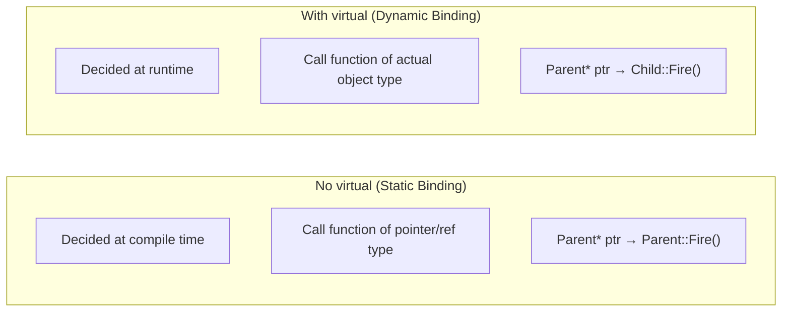
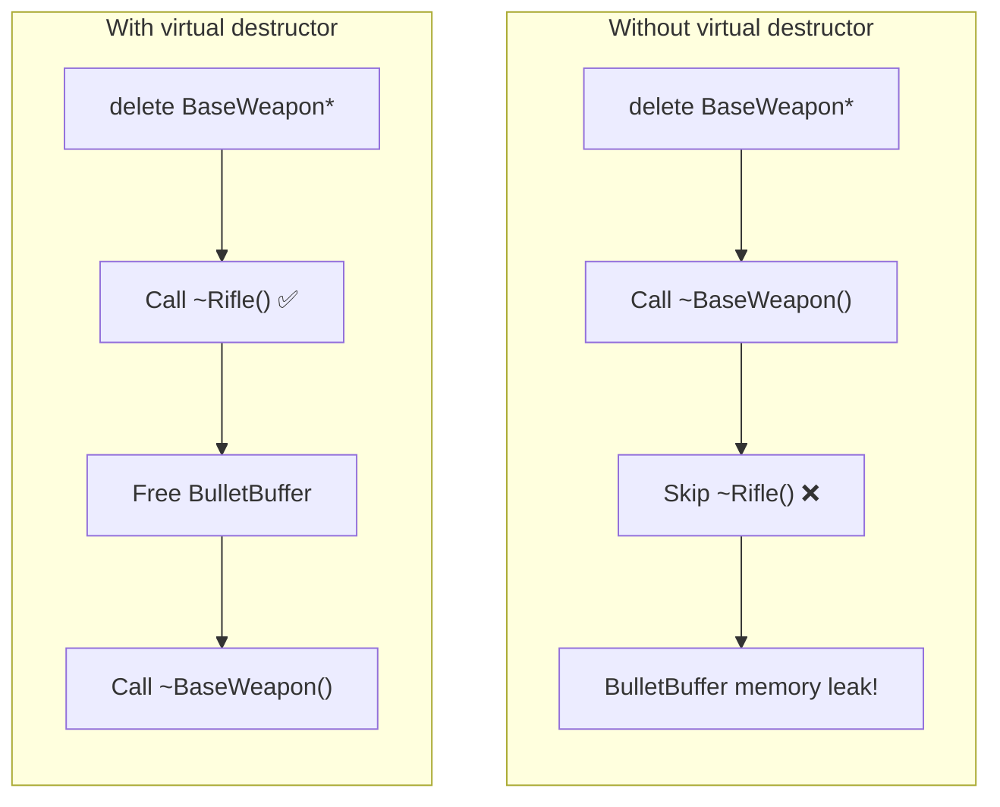
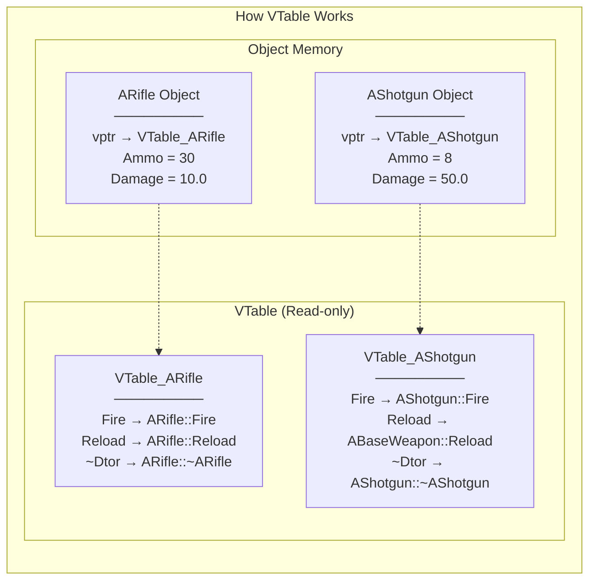

## Can You Read This Code?

In an Unreal project, you might see code like this for handling character damage:

```cpp
// DamageableCharacter.h
UCLASS()
class MYGAME_API ADamageableCharacter : public ACharacter
{
    GENERATED_BODY()

public:
    ADamageableCharacter();

    virtual float TakeDamage(float DamageAmount, struct FDamageEvent const& DamageEvent,
        AController* EventInstigator, AActor* DamageCauser) override;

protected:
    virtual void BeginPlay() override;
    virtual void OnDeath();

    UPROPERTY(EditDefaultsOnly)
    float MaxHealth = 100.f;

    float CurrentHealth;
};

// EnemyCharacter.h
UCLASS()
class MYGAME_API AEnemyCharacter : public ADamageableCharacter
{
    GENERATED_BODY()

public:
    AEnemyCharacter();

protected:
    void OnDeath() override;
    virtual void DropLoot();
};
```

As a Unity developer, you might have several questions:

- `virtual float TakeDamage(...) override;` — Both `virtual` and `override` together? In C#, you only use one.
- `virtual void OnDeath();` — `virtual` without `= 0`? Is this not an abstract method?
- `void OnDeath() override;` — Can I skip `virtual` in the child class?
- `Super::BeginPlay()` — Where does this come from? Is it the same as `base.`?

**In this lesson, we will thoroughly clarify the inheritance and polymorphism mechanisms in C++.**

---

## Introduction: 'virtual' in C# vs. C++

Inheritance in C# is straightforward. Adding `virtual` allows a child to `override` it, and even without it, you can hide it with `new`. Most methods work fine without `virtual`.

In C++, **`virtual` completely changes the behavior**. Without `virtual`, calling a function via a parent pointer will always execute the parent's implementation, not the child's. This is the difference between "Static Binding" and "Dynamic Binding," and understanding this is crucial for reading Unreal code.


---

## 1. Inheritance Basics: Similarities and Differences with C#

### 1-1. Syntax Comparison

```cpp
// C++ — : public ParentClass
class AEnemy : public ACharacter
{
    // ...
};
```

```csharp
// C# — : ParentClass
class Enemy : Character
{
    // ...
}
```

| Item | C# | C++ |
|------|-----|-----|
| Syntax | `: BaseClass` | `: public BaseClass` |
| Access Specifier | None (always public) | `public` / `protected` / `private` |
| Multiple Inheritance | ❌ Single inheritance only for classes | **✅ Supported** |
| Interface Implementation | ✅ | ✅ (Via pure virtual classes) |
| Parent Call | `base.Method()` | `Super::Method()` (Unreal) / `Base::Method()` (Native C++) |

### 1-2. Inheritance Access Specifiers — A Concept Absent in C#

```cpp
class AEnemy : public ACharacter      // Parent's public → public, protected → protected
class AEnemy : protected ACharacter   // Parent's public → protected
class AEnemy : private ACharacter     // Parent's public/protected → private
```

**In practice, `public` inheritance is used 99.9% of the time.** In Unreal, you will rarely see any specifier other than `public`. You just need to know they exist.

> **💬 Quick Note**
>
> **Q. Why are there no inheritance access specifiers in C#?**
>
> C# has a different design philosophy. It only allows `public` inheritance and uses explicit interface implementation if access restriction is needed. C++'s `protected`/`private` inheritance expresses an "is-implemented-in-terms-of" relationship rather than "is-a," which is usually better handled via composition in modern software engineering.

---

## 2. virtual and override - The Core Mechanism

### 2-1. What Happens Without 'virtual'?

This is the biggest difference from C#. In C#, even without `virtual`, calling via a child type executes the child's function. Not so in C++.

```cpp
// Without virtual — Static Binding
class ABaseWeapon
{
public:
    void Fire()  // No virtual!
    {
        UE_LOG(LogTemp, Display, TEXT("BaseWeapon::Fire()"));
    }
};

class ARifle : public ABaseWeapon
{
public:
    void Fire()  // Defines function with same name (Not an override!)
    {
        UE_LOG(LogTemp, Display, TEXT("Rifle::Fire()"));
    }
};

// Test
ARifle* Rifle = new ARifle();
Rifle->Fire();              // "Rifle::Fire()" ← Child type, child function

ABaseWeapon* Weapon = Rifle; // Assign child object to parent pointer
Weapon->Fire();              // "BaseWeapon::Fire()" ← ❌ Parent function is called!
```

```cpp
// With virtual — Dynamic Binding
class ABaseWeapon
{
public:
    virtual void Fire()  // Has virtual!
    {
        UE_LOG(LogTemp, Display, TEXT("BaseWeapon::Fire()"));
    }
};

class ARifle : public ABaseWeapon
{
public:
    void Fire() override  // Override
    {
        UE_LOG(LogTemp, Display, TEXT("Rifle::Fire()"));
    }
};

// Test
ABaseWeapon* Weapon = new ARifle();
Weapon->Fire();  // "Rifle::Fire()" ← ✅ Call function of actual type (ARifle)!
```



Comparison with C#:

| Situation | C# | C++ (No virtual) | C++ (With virtual) |
|------|-----|-------------------|-------------------|
| Call via Parent type | Child function (if virtual) | **Parent function!** | Child function |
| Call via Child type | Child function | Child function | Child function |

### 2-2. The 'override' Keyword

In C++, `override` is an **optional** keyword added in C++11. Code will compile without it, but **you should always use it.**

```cpp
class ABaseWeapon
{
public:
    virtual void Fire();
    virtual void Reload();
};

class ARifle : public ABaseWeapon
{
public:
    // ❌ Without override — Compiles even with a typo!
    void Fier()           // ⚠️ Typo! Becomes a brand new function (No warning!)
    {
    }

    // ✅ With override — Compiler catches the typo
    void Fier() override  // ❌ Compile Error! "Fier does not exist in parent"
    {
    }

    void Fire() override  // ✅ Correct override
    {
    }
};
```

| Keyword | C# | C++ | Requirement |
|--------|-----|-----|----------|
| `virtual` | Optional (to allow child override) | Optional (to enable dynamic binding) | More critical in C++ |
| `override` | **Mandatory** | **Optional** (C++11, but strongly recommended) | Use both for clarity |
| `abstract` / `= 0` | `abstract` | `= 0` | Function with no implementation |
| `sealed` / `final` | `sealed` | `final` | Prevent further overrides |

> **💬 Quick Note**
>
> **Q. Can I use `virtual` and `override` together in C++?**
>
> Yes! This is a very common pattern in Unreal code:
> ```cpp
> virtual void BeginPlay() override;  // "This function is virtual AND overrides the parent"
> ```
> `virtual` here means "this function can also be overridden by my children," and `override` means "I am redefining a parent's virtual function." While a function remains virtual in children once declared `virtual` in a parent, Unreal convention uses both to **make intent explicit**.
>
> **Q. Can I skip `virtual` in child classes?**
>
> Yes, technically a function declared `virtual` in a base class is automatically virtual in all derived classes. However, Unreal coding standards recommend **explicitly using `virtual` if children might override it further**, and **using `override` only (or `final`) if it's the final implementation**.

---

## 3. Pure Virtual Functions - C#'s abstract

Equivalent to `abstract` methods in C#. They are **declarations without implementation**, and child classes must implement them.

```cpp
// C++ — Pure Virtual Function (= 0)
class ABaseWeapon
{
public:
    virtual void Fire() = 0;          // Pure virtual — No implementation
    virtual void Reload() = 0;
    virtual FString GetName() const = 0;
};

// Cannot instantiate ABaseWeapon directly!
// ABaseWeapon* Weapon = new ABaseWeapon();  // ❌ Compile Error!

class ARifle : public ABaseWeapon
{
public:
    void Fire() override { /* Rifle fire logic */ }
    void Reload() override { /* Reload logic */ }
    FString GetName() const override { return TEXT("Rifle"); }
};

ARifle* Rifle = new ARifle();  // ✅ All pure virtuals implemented, so instantiation is possible
```

```csharp
// C# — abstract
abstract class BaseWeapon
{
    public abstract void Fire();
    public abstract void Reload();
    public abstract string GetName();
}

class Rifle : BaseWeapon
{
    public override void Fire() { /* Fire */ }
    public override void Reload() { /* Reload */ }
    public override string GetName() => "Rifle";
}
```

| Item | C# | C++ |
|------|-----|-----|
| Abstract Declaration | `abstract void Method();` | `virtual void Method() = 0;` |
| Abstract Class Indicator | `abstract class` | Automatically abstract if it has at least one `= 0` |
| Instantiation | Not allowed | Not allowed |
| Class Keyword | `abstract` required | No specific keyword (automatic via `= 0`) |

---

## 4. Virtual Destructors - A Mandatory Rule

**You must add `virtual` to the destructor of any class intended for inheritance.** In C#, you don't worry about this due to GC, but in C++, violating this rule **causes memory leaks.**

```cpp
class ABaseWeapon
{
public:
    ~ABaseWeapon()  // ❌ No virtual!
    {
        UE_LOG(LogTemp, Display, TEXT("BaseWeapon Destroyed"));
    }
};

class ARifle : public ABaseWeapon
{
public:
    ARifle() { BulletBuffer = new uint8[1024]; }

    ~ARifle()
    {
        delete[] BulletBuffer;  // If this isn't called, memory leaks!
        UE_LOG(LogTemp, Display, TEXT("Rifle Destroyed"));
    }

private:
    uint8* BulletBuffer;
};

// Problematic Situation
ABaseWeapon* Weapon = new ARifle();
delete Weapon;  // ❌ Only ~ABaseWeapon() is called! ~ARifle() is skipped!
                // → BulletBuffer memory leak!
```

```cpp
class ABaseWeapon
{
public:
    virtual ~ABaseWeapon()  // ✅ Virtual destructor!
    {
        UE_LOG(LogTemp, Display, TEXT("BaseWeapon Destroyed"));
    }
};

// Now safe
ABaseWeapon* Weapon = new ARifle();
delete Weapon;  // ✅ ~ARifle() called → ~ABaseWeapon() called (Child to Parent order)
```



**Rule: If a class has even one `virtual` function, make the destructor `virtual` too.**

C# handles this automatically because the GC collects objects based on their actual type. This is a critical C++-specific rule.

| Situation | Destructor | Result |
|------|--------|------|
| Delete via Parent pointer + Non-virtual | `~Base()` | Child destructor ❌ → Leak |
| Delete via Parent pointer + **Virtual** | `virtual ~Base()` | Child → Parent order ✅ |
| Delete via Child type | Either | Normal call |

> **💬 Quick Note**
>
> **Q. Do I manually write `virtual ~AMyActor()` in Unreal?**
>
> Rarely. Classes derived from `UObject` are managed by Unreal's garbage collector, so you rarely handle destructors manually. `AActor`, `UActorComponent`, etc., inherit from `UObject`, and their destructors are already `virtual`.
>
> However, if you need inheritance in **`F` prefix classes (plain C++ classes)**, you must manually use `virtual` destructors.

---

## 5. VTable - The Mechanism Behind virtual

In C#, the runtime handles method calls automatically. C++ uses a mechanism called the **VTable (Virtual Function Table)**. You won't see it in code, but understanding it helps explain why `virtual` has a cost.



**Workflow:**
1. Any object of a class with `virtual` functions has a hidden **vptr (virtual function pointer)**.
2. The vptr points to the **VTable (virtual function table)** for that class.
3. Calling a `virtual` function follows vptr → VTable → Actual Function.
4. Since this happens at runtime, it is called **"Dynamic Binding"**.

**Performance Cost:**
- Object size: Adds one vptr (8 bytes on 64-bit systems).
- Function call: One extra indirection (usually negligible).
- No inlining: The compiler cannot inline virtual functions.

```cpp
// With virtual
class AWeapon { virtual void Fire(); };  // sizeof = members + 8(vptr)

// Without virtual
class FWeaponData { void Fire(); };      // sizeof = members only
```

> **💬 Quick Note**
>
> **Q. Should I avoid `virtual` because of VTable overhead?**
>
> In game development, the overhead of virtual functions is **almost negligible**. Unless it's a low-level operation called tens of thousands of times per second (like math or physics simulation), the cost of `virtual` is not a concern. This is why Unreal's `Tick()`, `BeginPlay()`, etc., are all virtual.
>
> Avoiding `virtual` is only necessary in extreme optimization scenarios like **Data Oriented Design (DOD)**, which is rare for standard gameplay code.

---

## 6. final - Preventing Further Inheritance/Overrides

Equivalent to `sealed` in C#.

```cpp
// final class — No further inheritance
class APlayerCharacter final : public ACharacter
{
    // ...
};

// class ASuperPlayer : public APlayerCharacter { };  // ❌ Compile Error!

// final function — No further overrides
class ABaseEnemy : public ACharacter
{
public:
    virtual void Attack();
    virtual void Die() final;  // Prevent overrides in children
};

class ABossEnemy : public ABaseEnemy
{
public:
    void Attack() override;    // ✅ OK
    // void Die() override;    // ❌ Compile Error! final function
};
```

| C# | C++ | Meaning |
|----|-----|------|
| `sealed class` | `class Name final` | Prevent class inheritance |
| `sealed override void Method()` | `void Method() override final` | Prevent function overrides |

---

## 7. Interfaces - Implemented via Pure Virtual Classes

While C# has the `interface` keyword, C++ does not. Instead, a **class with only pure virtual functions** is used as an interface.

```cpp
// C++ Interface Pattern — Pure Virtual Class
class IDamageable
{
public:
    virtual ~IDamageable() = default;  // Virtual destructor
    virtual void TakeDamage(float Damage) = 0;
    virtual float GetHealth() const = 0;
    virtual bool IsDead() const = 0;
};

class IInteractable
{
public:
    virtual ~IInteractable() = default;
    virtual void Interact(AActor* Instigator) = 0;
    virtual FString GetInteractionText() const = 0;
};

// Multiple Implementation (Same as C# multiple interface implementation)
class AEnemyActor : public AActor, public IDamageable, public IInteractable
{
public:
    // IDamageable implementation
    void TakeDamage(float Damage) override { /* ... */ }
    float GetHealth() const override { return Health; }
    bool IsDead() const override { return Health <= 0; }

    // IInteractable implementation
    void Interact(AActor* Instigator) override { /* ... */ }
    FString GetInteractionText() const override { return TEXT("Inspect Enemy"); }

private:
    float Health = 100.f;
};
```

```csharp
// C# — Interface
interface IDamageable
{
    void TakeDamage(float damage);
    float GetHealth();
    bool IsDead();
}

interface IInteractable
{
    void Interact(GameObject instigator);
    string GetInteractionText();
}

class EnemyActor : MonoBehaviour, IDamageable, IInteractable
{
    // Implementation...
}
```

**Unreal Interfaces are special.** To integrate with the Unreal reflection system, they use the `UINTERFACE` macro:

```cpp
// Unreal Interface Declaration (Details in Lesson 7)
UINTERFACE(MinimalAPI)
class UDamageable : public UInterface
{
    GENERATED_BODY()
};

class IDamageable
{
    GENERATED_BODY()

public:
    virtual void TakeDamage(float Damage) = 0;
};

// Usage
UCLASS()
class AEnemy : public AActor, public IDamageable
{
    GENERATED_BODY()

public:
    void TakeDamage(float Damage) override;
};

// Interface Check
if (OtherActor->GetClass()->ImplementsInterface(UDamageable::StaticClass()))
{
    IDamageable* Damageable = Cast<IDamageable>(OtherActor);
    Damageable->TakeDamage(10.f);
}
```

| Item | C# | Native C++ | Unreal C++ |
|------|-----|-----------|-------------|
| Keyword | `interface` | None (Pure virtual class) | `UINTERFACE` macro |
| Multiple Implementation | ✅ | ✅ | ✅ |
| Member Variables | ❌ Not allowed (Pre-C# 8.0) | Allowed (but avoided) | Not allowed (in `I` class) |
| Naming | `IName` | `IName` (Convention) | `UName` + `IName` (Pair) |

---

## 8. Real-world Unreal Code Analysis - Super:: and Patterns

### 8-1. Super:: — C#'s base.

In Unreal, `Super` is a **typedef of the parent class** automatically created by the `GENERATED_BODY()` macro.

```cpp
// If inheriting from ACharacter
class AMyCharacter : public ACharacter
{
    GENERATED_BODY()  // Inside this macro: typedef ACharacter Super;
};

// Thus, Super:: is the same as ACharacter::
void AMyCharacter::BeginPlay()
{
    Super::BeginPlay();  // = ACharacter::BeginPlay();
    // Identical to base.BeginPlay() in C#
}
```

```csharp
// C# Comparison
protected override void Awake()
{
    base.Awake();  // Call parent Awake
}
```

| C# | Unreal C++ | Native C++ |
|----|-------------|-----------|
| `base.Method()` | `Super::Method()` | `ParentClass::Method()` |

**Functions where you MUST call `Super::` in Unreal:**
- `BeginPlay()` — Executes parent initialization logic.
- `Tick()` — Usually called, though can be omitted intentionally.
- `EndPlay()` — Executes parent cleanup logic.
- `TakeDamage()` — Parent damage processing logic.

```cpp
// ❌ Forgetting Super:: breaks parent functionality
void AMyCharacter::BeginPlay()
{
    // Missing Super::BeginPlay()!
    CurrentHealth = MaxHealth;
    // Parent (ACharacter) BeginPlay logic never runs → Bug!
}

// ✅ Correct Pattern
void AMyCharacter::BeginPlay()
{
    Super::BeginPlay();        // Always call parent first!
    CurrentHealth = MaxHealth;
}
```

### 8-2. Re-analyzing the Initial Code

```cpp
// DamageableCharacter.h
UCLASS()
class MYGAME_API ADamageableCharacter : public ACharacter  // ① Inherit from ACharacter
{
    GENERATED_BODY()  // ② Super = ACharacter (Automatic typedef)

public:
    ADamageableCharacter();

    // ③ virtual + override: Redefine parent (AActor) TakeDamage, allows further overrides
    virtual float TakeDamage(float DamageAmount, struct FDamageEvent const& DamageEvent,
        AController* EventInstigator, AActor* DamageCauser) override;

protected:
    // ④ virtual + override: Redefine ACharacter BeginPlay, allows further overrides
    virtual void BeginPlay() override;

    // ⑤ virtual only: New virtual function (Doesn't exist in parent, has default implementation)
    virtual void OnDeath();

    UPROPERTY(EditDefaultsOnly)
    float MaxHealth = 100.f;
    float CurrentHealth;
};

// EnemyCharacter.h
UCLASS()
class MYGAME_API AEnemyCharacter : public ADamageableCharacter  // ⑥ Level 2 inheritance
{
    GENERATED_BODY()  // Super = ADamageableCharacter

public:
    AEnemyCharacter();

protected:
    // ⑦ override only: Redefine ADamageableCharacter OnDeath
    //    Omitting virtual signals "no further overrides needed"
    void OnDeath() override;

    // ⑧ New virtual function
    virtual void DropLoot();
};
```

| Number | Pattern | Meaning |
|------|------|------|
| ③ | `virtual ... override` | Redefine parent function + Allow child overrides |
| ⑤ | `virtual void OnDeath()` | Define new virtual function (with default impl) |
| ⑦ | `void OnDeath() override` | Redefine parent virtual function (virtual omitted) |
| ⑧ | `virtual void DropLoot()` | New virtual function starting from this class |

---

## 9. Common Mistakes & Precautions

### Mistake 1: Attempting to Override Without 'virtual'

```cpp
class ABaseEnemy : public ACharacter
{
public:
    void OnHit(float Damage)  // ❌ No virtual!
    {
        Health -= Damage;
    }
};

class ABossEnemy : public ABaseEnemy
{
public:
    void OnHit(float Damage)  // This is "Hiding," not "Overriding"!
    {
        Health -= Damage * 0.5f;  // Boss takes 50% less damage
    }
};

ABaseEnemy* Enemy = new ABossEnemy();
Enemy->OnHit(100);  // ABaseEnemy::OnHit called → Damage reduction fails!
```

**Fix**: Add `virtual` to the parent function and `override` to the child.

### Mistake 2: Missing Typos in 'override'

```cpp
class AMyCharacter : public ACharacter
{
    virtual void BeginPlay() override;  // ✅

    virtual void beginPlay() override;  // ❌ Compile Error (lowercase 'b')
    virtual void BeginPlay(int) override;  // ❌ Compile Error (parameter mismatch)
};
```

Without the `override` keyword, these would simply create **new functions**, leaving you debugging for hours why `BeginPlay` isn't being called.

### Mistake 3: Missing Virtual Destructor

```cpp
// ❌ Dangerous Code
class FWeaponBase
{
public:
    ~FWeaponBase() {}  // No virtual!
};

class FRifle : public FWeaponBase
{
public:
    ~FRifle() { delete[] BulletData; }
    uint8* BulletData = new uint8[256];
};

FWeaponBase* Weapon = new FRifle();
delete Weapon;  // ~FRifle() NOT called → BulletData leaks!
```

**Rule: If a class has a `virtual` function or is intended for inheritance → `virtual ~ClassName()`**

### Mistake 4: Forgetting Super:: Calls

```cpp
void AMyCharacter::EndPlay(const EEndPlayReason::Type EndPlayReason)
{
    // ❌ Missing Super::EndPlay()!
    // Parent cleanup logic doesn't run, potential resource leak

    CleanupWeapon();
}

// ✅ Correct Pattern
void AMyCharacter::EndPlay(const EEndPlayReason::Type EndPlayReason)
{
    CleanupWeapon();
    Super::EndPlay(EndPlayReason);  // Call parent last (EndPlay is usually at the end)
}
```

**Patterns:**
- `BeginPlay()` → `Super::` first, then my logic.
- `EndPlay()` → My cleanup first, then `Super::`.
- `Tick()` → Varies (usually `Super::` first).

---

## Summary - Lesson 6 Checklist

After this lesson, you should be able to read the following in Unreal code:

- [ ] Understand that `virtual void Method()` enables "Dynamic Binding."
- [ ] Know that redefining a function without `virtual` results in the parent function being called via a parent pointer.
- [ ] Understand that the `override` keyword prevents typos and signature mismatches.
- [ ] Know that `virtual void Method() = 0;` is equivalent to C#'s `abstract`.
- [ ] Understand why `virtual ~ClassName()` is mandatory for inherited classes.
- [ ] Understand what a VTable is and that its performance cost is negligible.
- [ ] Understand that `final` serves the same role as C#'s `sealed`.
- [ ] Know that interfaces in C++ are implemented via pure virtual classes.
- [ ] Understand that `Super::Method()` is equivalent to C#'s `base.Method()`.
- [ ] Know that `Super` is automatically typedefed by the `GENERATED_BODY()` macro.
- [ ] Follow the pattern of `Super::` first in `BeginPlay` and your logic first in `EndPlay`.
- [ ] Read the Unreal pattern of using `virtual ... override` together.

---

## Next Up

**Lesson 7: Unreal Macro Magic - UCLASS, UPROPERTY, UFUNCTION**

We'll dive into the most common macros in Unreal code: `UCLASS()`, `UPROPERTY()`, and `UFUNCTION()`. These are **Unreal-specific macros**, not standard C++. Without them, you lose GC, editor exposure, and Blueprint integration. We'll cover what `GENERATED_BODY()` does, the difference between `EditAnywhere` and `VisibleAnywhere`, and why the reflection system is necessary.
