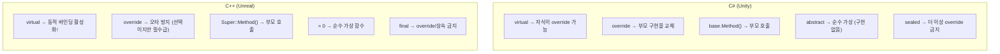
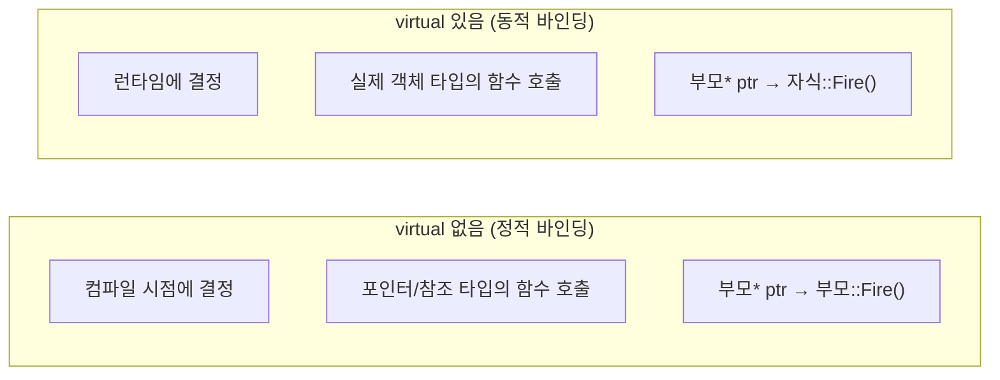
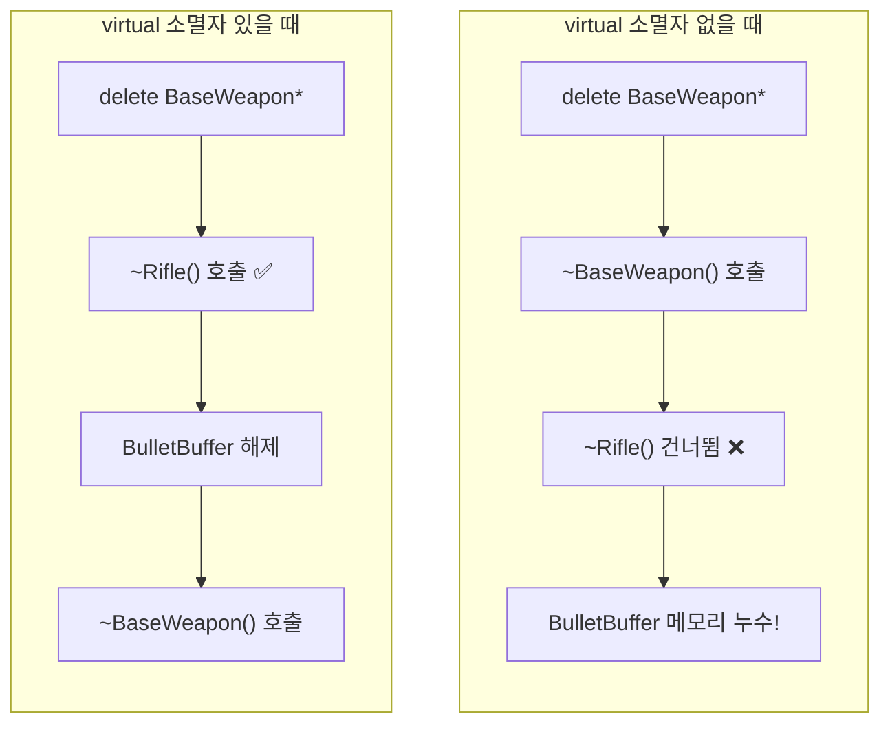
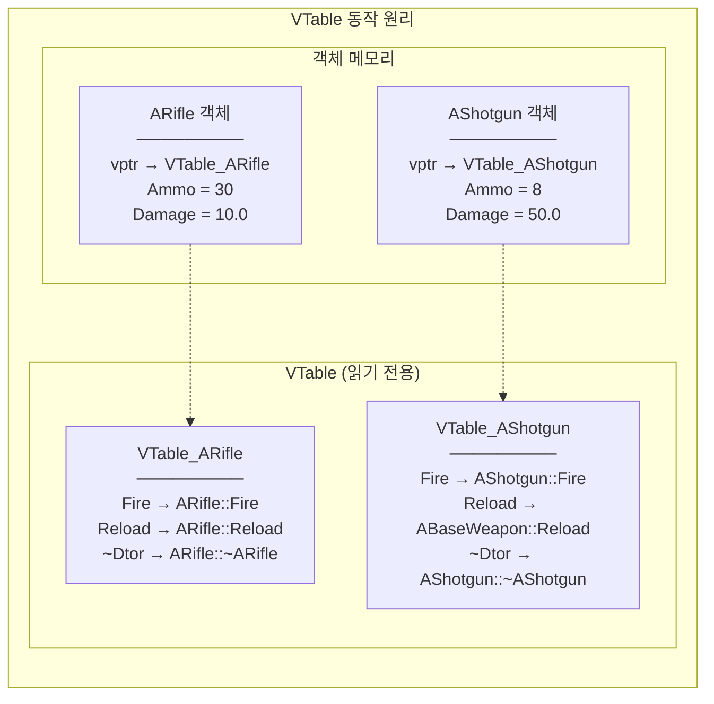

## 이 코드, 읽을 수 있나요?

언리얼 프로젝트에서 캐릭터의 데미지 처리 코드를 열면 이런 게 나옵니다.

```cpp
// DamageableCharacter.h
UCLASS()
class MYGAME_API ADamageableCharacter : public ACharacter
{
    GENERATED_BODY()

public:
    ADamageableCharacter();

    virtual float TakeDamage(float DamageAmount, struct FDamageEvent const& DamageEvent,
        AController* EventInstigator, AActor* DamageCauser) override;

protected:
    virtual void BeginPlay() override;
    virtual void OnDeath();

    UPROPERTY(EditDefaultsOnly)
    float MaxHealth = 100.f;

    float CurrentHealth;
};

// EnemyCharacter.h
UCLASS()
class MYGAME_API AEnemyCharacter : public ADamageableCharacter
{
    GENERATED_BODY()

public:
    AEnemyCharacter();

protected:
    void OnDeath() override;
    virtual void DropLoot();
};
```

유니티 개발자라면 이런 의문이 듭니다:

- `virtual float TakeDamage(...) override;` — `virtual`과 `override`가 동시에? C#에서는 둘 중 하나만 쓰는데?
- `virtual void OnDeath();` — `= 0`이 없는 virtual? 추상 메서드 아닌 건가?
- `void OnDeath() override;` — 자식에서는 `virtual`을 안 붙여도 되나?
- `Super::BeginPlay()` — 이건 어디서 오는 거지? `base.`와 같은 건가?

**이번 강에서 C++의 상속/다형성 메커니즘을 완전히 정리합니다.**

---

## 서론 - C#의 virtual과 C++의 virtual은 다르다

C#에서 상속은 편합니다. `virtual`을 붙이면 자식이 `override`할 수 있고, 안 붙여도 `new`로 숨길 수 있습니다. 대부분의 메서드는 `virtual` 없이도 잘 동작합니다.

C++에서는 **`virtual` 하나로 완전히 다른 동작**이 됩니다. `virtual`이 없으면 부모 포인터로 호출할 때 항상 부모의 함수가 실행됩니다. 자식의 함수가 아닙니다. 이것이 "정적 바인딩"과 "동적 바인딩"의 차이인데, 언리얼 코드를 읽으려면 이 차이를 반드시 이해해야 합니다.



---

## 1. 상속 기본 - C#과 거의 같지만 다른 점

### 1-1. 상속 문법 비교

```cpp
// C++ — : public 부모클래스
class AEnemy : public ACharacter
{
    // ...
};
```

```csharp
// C# — : 부모클래스
class Enemy : Character
{
    // ...
}
```

| 항목 | C# | C++ |
|------|-----|-----|
| 상속 문법 | `: BaseClass` | `: public BaseClass` |
| 상속 접근 지정자 | 없음 (항상 public) | `public` / `protected` / `private` |
| 다중 상속 | ❌ 클래스는 단일 상속만 | **✅ 다중 상속 가능** |
| 인터페이스 다중 구현 | ✅ | ✅ (순수 가상 클래스로 구현) |
| 부모 호출 | `base.Method()` | `Super::Method()` (언리얼) / `Base::Method()` (순정 C++) |

### 1-2. 상속 접근 지정자 — C#에 없는 개념

```cpp
class AEnemy : public ACharacter      // 부모의 public → public, protected → protected
class AEnemy : protected ACharacter   // 부모의 public → protected
class AEnemy : private ACharacter     // 부모의 public/protected → private
```

**실무에서는 99.9% `public` 상속을 사용합니다.** 언리얼에서는 `public` 외에 다른 상속 접근 지정자를 볼 일이 거의 없습니다. "이런 게 있구나" 정도만 알면 됩니다.

> **💬 잠깐, 이건 알고 가자**
>
> **Q. C#에서 상속 접근 지정자가 없는 이유는?**
>
> C#은 설계 철학이 다릅니다. C#에서는 `public` 상속만 허용하고, 접근 제한이 필요하면 인터페이스를 명시적으로 구현합니다. C++의 `protected`/`private` 상속은 "is-a"보다 "is-implemented-in-terms-of" 관계를 표현하는데, 실무에서는 컴포지션으로 대체하는 게 낫습니다.

---

## 2. virtual과 override - 핵심 중의 핵심

### 2-1. virtual이 없으면 어떻게 되나?

이것이 C#과 가장 큰 차이입니다. C#에서는 `virtual` 없이도 자식 타입으로 호출하면 자식 함수가 실행됩니다. C++에서는 아닙니다.

```cpp
// virtual 없는 경우 — 정적 바인딩
class ABaseWeapon
{
public:
    void Fire()  // virtual 없음!
    {
        UE_LOG(LogTemp, Display, TEXT("BaseWeapon::Fire()"));
    }
};

class ARifle : public ABaseWeapon
{
public:
    void Fire()  // 같은 이름의 함수 정의 (오버라이드가 아님!)
    {
        UE_LOG(LogTemp, Display, TEXT("Rifle::Fire()"));
    }
};

// 테스트
ARifle* Rifle = new ARifle();
Rifle->Fire();              // "Rifle::Fire()" ← 자식 타입이니까 자식 함수

ABaseWeapon* Weapon = Rifle; // 부모 포인터에 자식 객체 대입
Weapon->Fire();              // "BaseWeapon::Fire()" ← ❌ 부모 함수가 호출됨!
```

```cpp
// virtual 있는 경우 — 동적 바인딩
class ABaseWeapon
{
public:
    virtual void Fire()  // virtual 있음!
    {
        UE_LOG(LogTemp, Display, TEXT("BaseWeapon::Fire()"));
    }
};

class ARifle : public ABaseWeapon
{
public:
    void Fire() override  // 오버라이드
    {
        UE_LOG(LogTemp, Display, TEXT("Rifle::Fire()"));
    }
};

// 테스트
ABaseWeapon* Weapon = new ARifle();
Weapon->Fire();  // "Rifle::Fire()" ← ✅ 실제 타입(ARifle)의 함수 호출!
```



C#과 비교하면:

| 상황 | C# | C++ (virtual 없음) | C++ (virtual 있음) |
|------|-----|-------------------|-------------------|
| 부모 타입으로 호출 | 자식 함수 (virtual 시) | **부모 함수!** | 자식 함수 |
| 자식 타입으로 호출 | 자식 함수 | 자식 함수 | 자식 함수 |

### 2-2. override 키워드

C++에서 `override`는 C++11에 추가된 **선택사항** 키워드입니다. 안 써도 컴파일됩니다. 하지만 **반드시 써야 합니다.**

```cpp
class ABaseWeapon
{
public:
    virtual void Fire();
    virtual void Reload();
};

class ARifle : public ABaseWeapon
{
public:
    // ❌ override 없이 — 오타가 있어도 컴파일됨!
    void Fier()           // ⚠️ 오타! 새로운 함수가 되어버림 (경고 없음!)
    {
    }

    // ✅ override 있으면 — 오타를 컴파일러가 잡아줌
    void Fier() override  // ❌ 컴파일 에러! "Fier는 부모에 없습니다"
    {
    }

    void Fire() override  // ✅ 올바른 오버라이드
    {
    }
};
```

| 키워드 | C# | C++ | 필수 여부 |
|--------|-----|-----|----------|
| `virtual` | 선택 (자식이 override 가능하게) | 선택 (동적 바인딩 활성화) | C++에서 더 중요 |
| `override` | **필수** (override 시 반드시) | **선택** (C++11, 하지만 강력 권장) | 둘 다 쓰는 게 좋음 |
| `abstract` / `= 0` | `abstract` | `= 0` | 구현 없는 함수 |
| `sealed` / `final` | `sealed` | `final` | 추가 override 금지 |

> **💬 잠깐, 이건 알고 가자**
>
> **Q. C++에서 `virtual`과 `override`를 동시에 쓸 수 있나요?**
>
> 네! 언리얼 코드에서 자주 볼 수 있는 패턴입니다:
> ```cpp
> virtual void BeginPlay() override;  // "이 함수는 가상이고, 부모를 오버라이드한다"
> ```
> `virtual`은 "이 함수도 자식이 다시 오버라이드할 수 있다"는 의미이고, `override`는 "부모의 가상 함수를 재정의한다"는 의미입니다. 실제로 C++에서 한 번 `virtual`이면 자식에서 `virtual`을 안 써도 가상 함수로 유지됩니다. 하지만 **의도를 명확하게 하기 위해** 언리얼에서는 둘 다 쓰는 것이 관례입니다.
>
> **Q. 자식에서 `virtual`을 안 붙여도 되나요?**
>
> 네, 기술적으로는 한 번 `virtual`로 선언된 함수는 모든 자식에서 자동으로 가상 함수입니다. 하지만 언리얼 코딩 표준에서는 **자식이 더 오버라이드될 수 있다면 `virtual`을 명시**하고, **최종 구현이면 `override`만 쓰거나 `final`을 붙이는 것**을 권장합니다.

---

## 3. 순수 가상 함수 - C#의 abstract

C#의 `abstract` 메서드와 같습니다. **구현 없이 선언만** 하고, 자식이 반드시 구현해야 합니다.

```cpp
// C++ — 순수 가상 함수 (= 0)
class ABaseWeapon
{
public:
    virtual void Fire() = 0;          // 순수 가상 함수 — 구현 없음
    virtual void Reload() = 0;
    virtual FString GetName() const = 0;
};

// ABaseWeapon 직접 생성 불가!
// ABaseWeapon* Weapon = new ABaseWeapon();  // ❌ 컴파일 에러!

class ARifle : public ABaseWeapon
{
public:
    void Fire() override { /* 라이플 발사 로직 */ }
    void Reload() override { /* 장전 로직 */ }
    FString GetName() const override { return TEXT("Rifle"); }
};

ARifle* Rifle = new ARifle();  // ✅ 모든 순수 가상 함수를 구현했으므로 생성 가능
```

```csharp
// C# — abstract
abstract class BaseWeapon
{
    public abstract void Fire();
    public abstract void Reload();
    public abstract string GetName();
}

class Rifle : BaseWeapon
{
    public override void Fire() { /* 발사 */ }
    public override void Reload() { /* 장전 */ }
    public override string GetName() => "Rifle";
}
```

| 항목 | C# | C++ |
|------|-----|-----|
| 추상 메서드 선언 | `abstract void Method();` | `virtual void Method() = 0;` |
| 추상 클래스 표시 | `abstract class` | 순수 가상 함수가 1개라도 있으면 자동으로 추상 |
| 인스턴스 생성 | 불가 | 불가 |
| 클래스 키워드 | `abstract class` 필수 | 별도 키워드 없음 (`= 0`이면 자동) |

---

## 4. 가상 소멸자 - 반드시 알아야 하는 규칙

**상속되는 클래스의 소멸자에는 반드시 `virtual`을 붙여야 합니다.** C#에서는 GC가 있어서 걱정할 필요 없지만, C++에서는 이 규칙을 어기면 **메모리가 누수됩니다.**

```cpp
class ABaseWeapon
{
public:
    ~ABaseWeapon()  // ❌ virtual 없음!
    {
        UE_LOG(LogTemp, Display, TEXT("BaseWeapon 소멸"));
    }
};

class ARifle : public ABaseWeapon
{
public:
    ARifle() { BulletBuffer = new uint8[1024]; }

    ~ARifle()
    {
        delete[] BulletBuffer;  // 이게 호출되지 않으면 메모리 누수!
        UE_LOG(LogTemp, Display, TEXT("Rifle 소멸"));
    }

private:
    uint8* BulletBuffer;
};

// 문제 상황
ABaseWeapon* Weapon = new ARifle();
delete Weapon;  // ❌ ~ABaseWeapon()만 호출됨! ~ARifle()은 호출 안 됨!
                // → BulletBuffer 메모리 누수!
```

```cpp
class ABaseWeapon
{
public:
    virtual ~ABaseWeapon()  // ✅ virtual 소멸자!
    {
        UE_LOG(LogTemp, Display, TEXT("BaseWeapon 소멸"));
    }
};

// 이제 안전
ABaseWeapon* Weapon = new ARifle();
delete Weapon;  // ✅ ~ARifle() 호출 → ~ABaseWeapon() 호출 (자식 → 부모 순)
```



**규칙: 하나라도 `virtual` 함수가 있는 클래스는 소멸자도 `virtual`로 만들어라.**

C#에서는 이 걱정이 전혀 없습니다. GC가 모든 객체를 타입에 관계없이 수거하니까요. C++만의 중요한 규칙입니다.

| 상황 | 소멸자 | 결과 |
|------|--------|------|
| 부모 포인터로 delete + 비가상 소멸자 | `~Base()` | 자식 소멸자 ❌ → 누수 |
| 부모 포인터로 delete + **가상 소멸자** | `virtual ~Base()` | 자식 → 부모 순서로 ✅ |
| 자식 타입으로 delete | 어느 쪽이든 | 정상 호출 |

> **💬 잠깐, 이건 알고 가자**
>
> **Q. 언리얼에서 `virtual ~AMyActor()`를 직접 쓰나요?**
>
> 거의 안 씁니다. `UObject` 계열 클래스는 GC가 관리하므로 소멸자를 직접 쓸 일이 없습니다. `AActor`, `UActorComponent` 등은 `UObject`를 상속하는데, 이들의 소멸자는 이미 `virtual`입니다. 개발자가 따로 신경 쓸 필요가 없습니다.
>
> 하지만 **`F` 접두사 클래스(일반 C++ 클래스)**에서 상속이 필요하면 직접 `virtual` 소멸자를 써야 합니다.

---

## 5. VTable - virtual 뒤에 숨겨진 메커니즘

C#에서는 런타임이 메서드 호출을 알아서 처리합니다. C++에서는 **VTable(가상 함수 테이블)**이라는 메커니즘이 사용됩니다. 코드에서 직접 볼 일은 없지만, 왜 `virtual`에 비용이 있는지 이해할 수 있습니다.



**동작 과정:**
1. `virtual` 함수가 있는 클래스의 객체에는 **vptr(가상 함수 포인터)**이 숨겨져 있습니다
2. vptr은 해당 클래스의 **VTable(가상 함수 테이블)**을 가리킵니다
3. `virtual` 함수를 호출하면 vptr → VTable → 실제 함수 순으로 찾아갑니다
4. 이 과정이 런타임에 일어나므로 **"동적 바인딩"**이라고 합니다

**성능 비용:**
- 객체 크기: vptr 하나(8바이트, 64비트) 추가
- 함수 호출: 간접 참조 1번 추가 (보통 무시할 수준)
- 인라인 불가: 컴파일러가 virtual 함수를 인라인할 수 없음

```cpp
// virtual이 있으면
class AWeapon { virtual void Fire(); };  // sizeof = 멤버 + 8(vptr)

// virtual이 없으면
class FWeaponData { void Fire(); };      // sizeof = 멤버만
```

> **💬 잠깐, 이건 알고 가자**
>
> **Q. VTable 때문에 virtual을 아껴 써야 하나요?**
>
> 게임 개발에서 virtual 함수의 오버헤드는 **거의 무시할 수준**입니다. 초당 수만 번 호출되는 저수준 연산(수학 계산, 물리 시뮬레이션)이 아닌 이상, virtual 비용은 신경 쓸 필요 없습니다. 언리얼의 `Tick()`, `BeginPlay()` 등이 모두 virtual인 이유도 이 때문입니다.
>
> 다만 **데이터 지향 설계(DOD)**가 필요한 극한 최적화 상황에서는 virtual을 피하기도 합니다. 이건 매우 드문 경우입니다.

---

## 6. final - 더 이상의 상속/오버라이드 금지

C#의 `sealed`와 같은 역할입니다.

```cpp
// final 클래스 — 더 이상 상속 불가
class APlayerCharacter final : public ACharacter
{
    // ...
};

// class ASuperPlayer : public APlayerCharacter { };  // ❌ 컴파일 에러!

// final 함수 — 더 이상 오버라이드 불가
class ABaseEnemy : public ACharacter
{
public:
    virtual void Attack();
    virtual void Die() final;  // 자식에서 오버라이드 금지
};

class ABossEnemy : public ABaseEnemy
{
public:
    void Attack() override;    // ✅ OK
    // void Die() override;    // ❌ 컴파일 에러! final 함수
};
```

| C# | C++ | 의미 |
|----|-----|------|
| `sealed class` | `class Name final` | 클래스 상속 금지 |
| `sealed override void Method()` | `void Method() override final` | 함수 오버라이드 금지 |

---

## 7. 인터페이스 - 순수 가상 클래스로 구현

C#에는 `interface` 키워드가 있지만, C++에는 없습니다. 대신 **모든 멤버가 순수 가상 함수인 클래스**를 인터페이스처럼 사용합니다.

```cpp
// C++ 인터페이스 패턴 — 순수 가상 클래스
class IDamageable
{
public:
    virtual ~IDamageable() = default;  // 가상 소멸자
    virtual void TakeDamage(float Damage) = 0;
    virtual float GetHealth() const = 0;
    virtual bool IsDead() const = 0;
};

class IInteractable
{
public:
    virtual ~IInteractable() = default;
    virtual void Interact(AActor* Instigator) = 0;
    virtual FString GetInteractionText() const = 0;
};

// 다중 구현 (C#의 다중 인터페이스 구현과 동일)
class AEnemyActor : public AActor, public IDamageable, public IInteractable
{
public:
    // IDamageable 구현
    void TakeDamage(float Damage) override { /* ... */ }
    float GetHealth() const override { return Health; }
    bool IsDead() const override { return Health <= 0; }

    // IInteractable 구현
    void Interact(AActor* Instigator) override { /* ... */ }
    FString GetInteractionText() const override { return TEXT("적 조사하기"); }

private:
    float Health = 100.f;
};
```

```csharp
// C# — 인터페이스
interface IDamageable
{
    void TakeDamage(float damage);
    float GetHealth();
    bool IsDead();
}

interface IInteractable
{
    void Interact(GameObject instigator);
    string GetInteractionText();
}

class EnemyActor : MonoBehaviour, IDamageable, IInteractable
{
    // 구현...
}
```

**언리얼 인터페이스는 조금 특별합니다.** 언리얼 리플렉션 시스템과 통합하기 위해 `UINTERFACE` 매크로를 사용합니다:

```cpp
// 언리얼 인터페이스 선언 (7강에서 자세히 다룸)
UINTERFACE(MinimalAPI)
class UDamageable : public UInterface
{
    GENERATED_BODY()
};

class IDamageable
{
    GENERATED_BODY()

public:
    virtual void TakeDamage(float Damage) = 0;
};

// 사용
UCLASS()
class AEnemy : public AActor, public IDamageable
{
    GENERATED_BODY()

public:
    void TakeDamage(float Damage) override;
};

// 인터페이스 체크
if (OtherActor->GetClass()->ImplementsInterface(UDamageable::StaticClass()))
{
    IDamageable* Damageable = Cast<IDamageable>(OtherActor);
    Damageable->TakeDamage(10.f);
}
```

| 항목 | C# | C++ (순정) | C++ (언리얼) |
|------|-----|-----------|-------------|
| 키워드 | `interface` | 없음 (순수 가상 클래스) | `UINTERFACE` 매크로 |
| 다중 구현 | ✅ | ✅ | ✅ |
| 멤버 변수 | ❌ 불가 (C# 8.0 전) | 가능 (하지만 안 씀) | 불가 (`I` 클래스에) |
| 네이밍 | `IName` | `IName` (관례) | `UName` + `IName` (쌍으로) |

---

## 8. 언리얼 실전 코드 해부 - Super::와 상속 패턴

### 8-1. Super:: — C#의 base.

언리얼에서 `Super`는 `GENERATED_BODY()` 매크로가 자동으로 만들어주는 **부모 클래스의 typedef**입니다.

```cpp
// ACharacter를 상속하면
class AMyCharacter : public ACharacter
{
    GENERATED_BODY()  // 이 매크로 안에: typedef ACharacter Super;
};

// 그래서 Super::는 ACharacter::와 같음
void AMyCharacter::BeginPlay()
{
    Super::BeginPlay();  // = ACharacter::BeginPlay();
    // C#의 base.BeginPlay()와 동일한 역할
}
```

```csharp
// C# 비교
protected override void Awake()
{
    base.Awake();  // 부모의 Awake 호출
}
```

| C# | C++ (언리얼) | C++ (순정) |
|----|-------------|-----------|
| `base.Method()` | `Super::Method()` | `ParentClass::Method()` |

**언리얼에서 반드시 `Super::` 호출해야 하는 함수들:**
- `BeginPlay()` — 부모의 초기화 로직 실행
- `Tick()` — 보통 호출하지만, 의도적으로 생략할 수도 있음
- `EndPlay()` — 부모의 정리 로직 실행
- `TakeDamage()` — 부모의 데미지 처리 로직

```cpp
// ❌ Super:: 깜빡하면 부모 기능 동작 안 함
void AMyCharacter::BeginPlay()
{
    // Super::BeginPlay() 없음!
    CurrentHealth = MaxHealth;
    // 부모(ACharacter)의 BeginPlay 로직이 실행 안 됨 → 버그!
}

// ✅ 올바른 패턴
void AMyCharacter::BeginPlay()
{
    Super::BeginPlay();        // 항상 먼저 부모 호출!
    CurrentHealth = MaxHealth;
}
```

### 8-2. 맨 처음 코드 다시 분석

```cpp
// DamageableCharacter.h
UCLASS()
class MYGAME_API ADamageableCharacter : public ACharacter  // ① ACharacter 상속
{
    GENERATED_BODY()  // ② Super = ACharacter (자동 typedef)

public:
    ADamageableCharacter();

    // ③ virtual + override: 부모(AActor)의 TakeDamage를 재정의하면서, 자식도 재정의 가능
    virtual float TakeDamage(float DamageAmount, struct FDamageEvent const& DamageEvent,
        AController* EventInstigator, AActor* DamageCauser) override;

protected:
    // ④ virtual + override: ACharacter의 BeginPlay 재정의, 자식도 재정의 가능
    virtual void BeginPlay() override;

    // ⑤ virtual만: 새로운 가상 함수 (부모에 없음, = 0 아님 → 기본 구현 있음)
    virtual void OnDeath();

    UPROPERTY(EditDefaultsOnly)
    float MaxHealth = 100.f;
    float CurrentHealth;
};

// EnemyCharacter.h
UCLASS()
class MYGAME_API AEnemyCharacter : public ADamageableCharacter  // ⑥ 2단계 상속
{
    GENERATED_BODY()  // Super = ADamageableCharacter

public:
    AEnemyCharacter();

protected:
    // ⑦ override만: ADamageableCharacter의 OnDeath 재정의
    //    virtual을 안 쓴 건 "더 이상 자식이 override할 필요 없다"는 의도
    void OnDeath() override;

    // ⑧ 새로운 virtual 함수
    virtual void DropLoot();
};
```

| 번호 | 패턴 | 의미 |
|------|------|------|
| ③ | `virtual ... override` | 부모 함수 재정의 + 자식도 재정의 가능 |
| ⑤ | `virtual void OnDeath()` | 새로운 가상 함수 정의 (기본 구현 있음) |
| ⑦ | `void OnDeath() override` | 부모의 가상 함수를 재정의 (virtual 생략) |
| ⑧ | `virtual void DropLoot()` | 이 클래스에서 시작하는 새 가상 함수 |

---

## 9. 흔한 실수 & 주의사항

### 실수 1: virtual 없이 오버라이드 시도

```cpp
class ABaseEnemy : public ACharacter
{
public:
    void OnHit(float Damage)  // ❌ virtual 없음!
    {
        Health -= Damage;
    }
};

class ABossEnemy : public ABaseEnemy
{
public:
    void OnHit(float Damage)  // 오버라이드가 아닌 "숨기기"!
    {
        Health -= Damage * 0.5f;  // 보스는 데미지 50% 감소
    }
};

ABaseEnemy* Enemy = new ABossEnemy();
Enemy->OnHit(100);  // ABaseEnemy::OnHit 호출 → 데미지 감소 안 됨!
```

**해결**: 부모 함수에 `virtual`을 붙이고, 자식에 `override`를 붙이세요.

### 실수 2: override 오타를 모르고 넘어감

```cpp
class AMyCharacter : public ACharacter
{
    virtual void BeginPlay() override;  // ✅

    virtual void beginPlay() override;  // ❌ 컴파일 에러 (소문자 b)
    virtual void BeginPlay(int) override;  // ❌ 컴파일 에러 (파라미터 다름)
};
```

`override` 키워드가 없었다면 위 두 경우 모두 **새로운 함수**로 생성되어, 왜 `BeginPlay`가 호출 안 되는지 한참 디버깅했을 것입니다.

### 실수 3: 가상 소멸자 누락

```cpp
// ❌ 위험한 코드
class FWeaponBase
{
public:
    ~FWeaponBase() {}  // virtual 없음!
};

class FRifle : public FWeaponBase
{
public:
    ~FRifle() { delete[] BulletData; }
    uint8* BulletData = new uint8[256];
};

FWeaponBase* Weapon = new FRifle();
delete Weapon;  // ~FRifle() 호출 안 됨 → BulletData 누수!
```

**규칙: `virtual` 함수가 하나라도 있거나, 상속될 예정이면 → `virtual ~ClassName()`**

### 실수 4: Super:: 호출 누락

```cpp
void AMyCharacter::EndPlay(const EEndPlayReason::Type EndPlayReason)
{
    // ❌ Super::EndPlay() 안 함!
    // 부모의 정리 로직이 실행되지 않아 리소스 누수 가능

    CleanupWeapon();
}

// ✅ 올바른 패턴
void AMyCharacter::EndPlay(const EEndPlayReason::Type EndPlayReason)
{
    CleanupWeapon();
    Super::EndPlay(EndPlayReason);  // 마지막에 부모 호출 (EndPlay는 보통 마지막)
}
```

**패턴:**
- `BeginPlay()` → `Super::` 먼저, 내 로직 나중에
- `EndPlay()` → 내 정리 먼저, `Super::` 나중에
- `Tick()` → 상황에 따라 다름 (보통 `Super::` 먼저)

---

## 정리 - 6강 체크리스트

이 강을 마치면 언리얼 코드에서 다음을 읽을 수 있어야 합니다:

- [ ] `virtual void Method()`이 "동적 바인딩을 활성화한다"는 것을 안다
- [ ] `virtual` 없이 함수를 재정의하면 부모 포인터에서 부모 함수가 호출됨을 안다
- [ ] `override` 키워드가 오타/시그니처 실수를 방지하는 역할임을 안다
- [ ] `virtual void Method() = 0;`이 C#의 `abstract`와 같음을 안다
- [ ] `virtual ~ClassName()`이 왜 상속 클래스에 필수인지 안다
- [ ] VTable이 무엇이고 virtual의 성능 비용이 무시할 수준임을 안다
- [ ] `final`이 C#의 `sealed`와 같은 역할임을 안다
- [ ] C++에서 인터페이스가 순수 가상 클래스로 구현됨을 안다
- [ ] `Super::Method()`가 C#의 `base.Method()`와 같음을 안다
- [ ] `Super`가 `GENERATED_BODY()` 매크로에 의해 자동으로 typedef됨을 안다
- [ ] `BeginPlay`에서는 `Super::` 먼저, `EndPlay`에서는 내 로직 먼저 패턴을 안다
- [ ] `virtual ... override`를 동시에 쓰는 언리얼 패턴을 읽을 수 있다

---

## 다음 강 미리보기

**7강: 언리얼 매크로의 마법 - UCLASS, UPROPERTY, UFUNCTION**

언리얼 코드에서 가장 많이 보이는 `UCLASS()`, `UPROPERTY()`, `UFUNCTION()`. 이것들은 C++ 표준이 아닌 **언리얼만의 매크로**입니다. 이 매크로들이 없으면 GC도, 에디터 노출도, 블루프린트 연동도 안 됩니다. `GENERATED_BODY()`가 뭘 하는지, `UPROPERTY(EditAnywhere)`와 `UPROPERTY(VisibleAnywhere)`의 차이는 뭔지, 리플렉션 시스템이 왜 필요한지 다룹니다.
