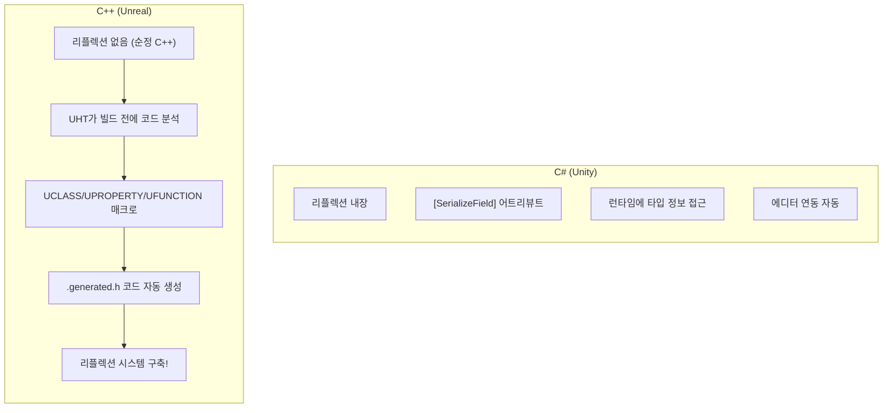
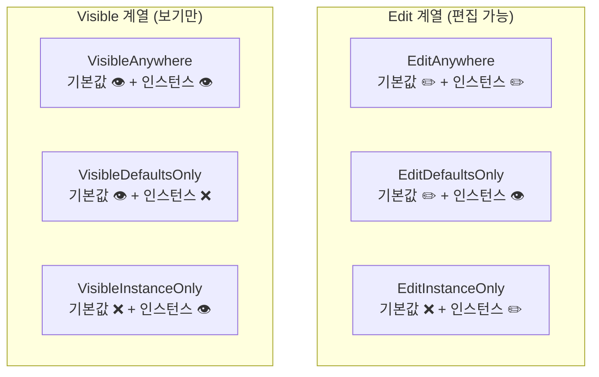

## 이 코드, 읽을 수 있나요?

언리얼 프로젝트에서 무기 클래스를 열면 이런 게 나옵니다.

```cpp
// Weapon.h
#pragma once

#include "CoreMinimal.h"
#include "GameFramework/Actor.h"
#include "Weapon.generated.h"

UCLASS(Blueprintable)
class MYGAME_API AWeapon : public AActor
{
    GENERATED_BODY()

public:
    AWeapon();

    UFUNCTION(BlueprintCallable, Category = "Combat")
    void Fire();

    UFUNCTION(BlueprintPure, Category = "Combat")
    int32 GetCurrentAmmo() const;

    UFUNCTION(BlueprintImplementableEvent, Category = "Effects")
    void PlayFireEffect();

protected:
    UPROPERTY(VisibleAnywhere, BlueprintReadOnly, Category = "Components")
    USkeletalMeshComponent* WeaponMesh;

    UPROPERTY(EditDefaultsOnly, BlueprintReadOnly, Category = "Config")
    float Damage = 25.f;

    UPROPERTY(EditDefaultsOnly, BlueprintReadOnly, Category = "Config", meta = (ClampMin = "1"))
    int32 MaxAmmo = 30;

    UPROPERTY(BlueprintReadOnly, Category = "State")
    int32 CurrentAmmo;
};
```

유니티 개발자라면 이런 의문이 듭니다:

- `UCLASS(Blueprintable)` — 이게 뭐지? C++ 문법이 아닌데?
- `GENERATED_BODY()` — 이 매크로는 뭘 하는 거지?
- `Weapon.generated.h` — 이 헤더는 어디서 오는 거지?
- `UPROPERTY(EditDefaultsOnly, BlueprintReadOnly, Category = "Config")` — 이 긴 괄호 안의 것들은 뭐지?
- `UFUNCTION(BlueprintImplementableEvent)` — 함수인데 구현이 없어도 되나?

**이번 강에서 언리얼 매크로 시스템을 완전히 정리합니다.**

---

## 서론 - 왜 매크로가 필요한가

C++은 C#과 달리 **리플렉션(Reflection)**이 없습니다. C#에서는 런타임에 클래스의 필드, 메서드 정보를 읽고 쓸 수 있지만, 순정 C++에서는 불가능합니다.

그런데 언리얼 엔진은 이런 기능이 필요합니다:
- **에디터**: 변수를 인스펙터에 노출해야 함
- **블루프린트**: C++ 함수를 블루프린트에서 호출해야 함
- **GC**: 어떤 UObject*가 참조되고 있는지 추적해야 함
- **직렬화**: 객체를 저장/로드해야 함
- **네트워크**: 변수를 네트워크로 복제해야 함

이 모든 것을 가능하게 하는 것이 **UHT(Unreal Header Tool)**와 **리플렉션 매크로**입니다.



| C# (Unity) | C++ (Unreal) | 역할 |
|-------------|-------------|------|
| `[SerializeField]` | `UPROPERTY()` | 에디터/직렬화에 노출 |
| `[Header("Stats")]` | `Category = "Stats"` | 카테고리 분류 |
| `[Range(0, 100)]` | `meta = (ClampMin = "0", ClampMax = "100")` | 값 범위 제한 |
| `public` 필드 | `UPROPERTY(BlueprintReadWrite)` | 외부에서 읽기/쓰기 |
| 리플렉션 내장 | `UCLASS()` + `GENERATED_BODY()` | 타입 정보 등록 |

---

## 1. GENERATED_BODY()와 .generated.h

### 1-1. GENERATED_BODY()가 하는 일

`GENERATED_BODY()`는 UHT가 자동 생성한 코드를 삽입하는 매크로입니다. 내부적으로 다음을 포함합니다:

```cpp
// GENERATED_BODY()가 대략 이런 것들을 생성
typedef ACharacter Super;            // Super:: 사용 가능하게
typedef AMyCharacter ThisClass;      // ThisClass 타입 정의
static UClass* StaticClass();        // 런타임 타입 정보
virtual UClass* GetClass() const;    // 실제 타입 반환
// + 직렬화, 리플렉션, GC 관련 코드들...
```

**규칙:**
- 모든 `UCLASS`, `USTRUCT` 클래스에 **반드시** 있어야 합니다
- 클래스 본문의 **첫 번째 줄**에 위치해야 합니다
- `public`/`private`/`protected` 위에 옵니다

### 1-2. .generated.h 헤더

```cpp
#pragma once

#include "CoreMinimal.h"
#include "GameFramework/Actor.h"
#include "Weapon.generated.h"  // ← 반드시 마지막 #include!
```

`Weapon.generated.h`는 UHT가 자동 생성하는 헤더입니다. 빌드 전에 생성되며, 직접 편집하면 안 됩니다.

**규칙: `.generated.h`는 항상 마지막 `#include`여야 합니다.** 순서가 틀리면 컴파일 에러가 발생합니다.

> **💬 잠깐, 이건 알고 가자**
>
> **Q. Unity에서 이런 매크로 같은 건 왜 없나요?**
>
> C#에는 리플렉션이 **언어 자체에 내장**되어 있기 때문입니다. `typeof(MyClass).GetFields()`로 필드 정보를 읽을 수 있죠. C++에는 이런 기능이 없어서 언리얼이 **빌드 도구(UHT)**를 만들어서 흉내 내는 것입니다.
>
> **Q. GENERATED_BODY() 대신 GENERATED_UCLASS_BODY()를 볼 때가 있는데요?**
>
> `GENERATED_UCLASS_BODY()`는 구 버전 매크로입니다. 생성자가 자동으로 `public`이 되는 등 차이가 있습니다. UE4 후기부터 `GENERATED_BODY()`가 권장되며, 새 코드에서는 `GENERATED_BODY()`만 사용하세요.

---

## 2. UCLASS - 클래스를 엔진에 등록

### 2-1. 기본 사용법

```cpp
// 가장 기본적인 UCLASS
UCLASS()
class MYGAME_API AMyActor : public AActor
{
    GENERATED_BODY()
};
```

`MYGAME_API`는 모듈 내보내기 매크로입니다. 다른 모듈에서 이 클래스에 접근할 수 있게 합니다. 프로젝트 이름에 따라 달라집니다 (`MYGAME`은 프로젝트 이름).

### 2-2. 자주 쓰는 UCLASS 지정자

```cpp
UCLASS(Blueprintable)                    // 블루프린트 상속 가능
UCLASS(BlueprintType)                    // 블루프린트 변수 타입으로 사용 가능
UCLASS(Abstract)                         // 직접 인스턴스화 불가 (자식만 가능)
UCLASS(NotBlueprintable)                 // 블루프린트 상속 불가
UCLASS(Transient)                        // 디스크에 저장 안 됨
UCLASS(Config=Game)                      // .ini 설정 파일과 연동
```

| UCLASS 지정자 | Unity 대응 | 의미 |
|-------------|-----------|------|
| `Blueprintable` | MonoBehaviour (기본 동작) | BP 자식 클래스 생성 가능 |
| `BlueprintType` | 직렬화 가능 클래스 | BP 변수 타입으로 사용 |
| `Abstract` | `abstract class` | 인스턴스 생성 불가 |
| `NotBlueprintable` | - | BP 상속 차단 |

실무에서 가장 흔한 조합:

```cpp
// Actor 계열 — 보통 지정자 없이 사용 (기본으로 Blueprintable)
UCLASS()
class AMyCharacter : public ACharacter { ... };

// 데이터 에셋 — BlueprintType 필수
UCLASS(BlueprintType)
class UWeaponData : public UDataAsset { ... };

// 추상 베이스 — 직접 사용 금지
UCLASS(Abstract)
class ABaseProjectile : public AActor { ... };
```

---

## 3. UPROPERTY - 변수를 에디터/GC에 등록

**UPROPERTY는 언리얼에서 가장 자주 쓰는 매크로입니다.** 두 가지 핵심 역할이 있습니다:
1. **GC 추적** — UObject* 포인터가 수거되지 않도록 보호
2. **에디터/블루프린트 노출** — 인스펙터에서 편집하거나 BP에서 접근

### 3-1. GC 추적 — 가장 중요한 역할

```cpp
UCLASS()
class AMyCharacter : public ACharacter
{
    GENERATED_BODY()

private:
    // ❌ UPROPERTY 없음 → GC가 이 참조를 모름 → 대상이 수거될 수 있음!
    UWeaponComponent* BadWeapon;

    // ✅ UPROPERTY 있음 → GC가 참조 추적 → 안전!
    UPROPERTY()
    UWeaponComponent* GoodWeapon;
};
```

**규칙: `UObject*` 포인터 멤버 변수에는 반드시 `UPROPERTY()`를 붙이세요.** 지정자가 없어도 괄호만 있으면 GC 추적이 됩니다.

C#에서는 이런 걱정이 없습니다. GC가 알아서 모든 참조를 추적하니까요. C++에서는 GC에게 "이 포인터를 추적해줘"라고 명시적으로 알려야 합니다.

### 3-2. 에디터 노출 — Edit vs Visible

```cpp
// Edit 계열 — 값을 편집할 수 있음
UPROPERTY(EditAnywhere)        // 클래스 기본값 + 인스턴스 모두 편집 가능
UPROPERTY(EditDefaultsOnly)    // 클래스 기본값에서만 편집 (인스턴스에서는 읽기 전용)
UPROPERTY(EditInstanceOnly)    // 인스턴스에서만 편집 (기본값에서는 안 보임)

// Visible 계열 — 보기만 가능 (편집 불가)
UPROPERTY(VisibleAnywhere)     // 어디서든 보기만 가능
UPROPERTY(VisibleDefaultsOnly) // 기본값에서만 보기
UPROPERTY(VisibleInstanceOnly) // 인스턴스에서만 보기
```



**실무 패턴:**

```cpp
// 디자이너가 조정하는 밸런스 값 → EditDefaultsOnly
UPROPERTY(EditDefaultsOnly, Category = "Stats")
float MaxHealth = 100.f;

// 디자이너가 인스턴스별로 다르게 설정할 값 → EditAnywhere
UPROPERTY(EditAnywhere, Category = "Config")
FName SpawnTag;

// 생성자에서 만드는 컴포넌트 → VisibleAnywhere
UPROPERTY(VisibleAnywhere, Category = "Components")
UStaticMeshComponent* MeshComp;

// 런타임에 바뀌는 상태 값 → 에디터 노출 불필요
UPROPERTY()
float CurrentHealth;
```

| 상황 | 추천 지정자 | 이유 |
|------|-----------|------|
| 밸런스 수치 (HP, 데미지 등) | `EditDefaultsOnly` | BP 기본값에서 한 번 설정 |
| 인스턴스별 다른 설정 | `EditAnywhere` | 레벨에 배치된 각 인스턴스마다 다른 값 |
| 컴포넌트 포인터 | `VisibleAnywhere` | 생성자에서 만들었으므로 편집 X, 보기만 |
| 런타임 상태 | `UPROPERTY()` or `BlueprintReadOnly` | GC 추적 + 디버깅용 노출 |

### 3-3. 블루프린트 노출

```cpp
UPROPERTY(BlueprintReadWrite)   // BP에서 읽기 + 쓰기
UPROPERTY(BlueprintReadOnly)    // BP에서 읽기만 가능
```

**에디터 노출과 블루프린트 노출은 독립적입니다.** 둘 다 필요하면 조합합니다:

```cpp
// 가장 흔한 조합들
UPROPERTY(EditDefaultsOnly, BlueprintReadOnly, Category = "Stats")
float MaxHealth = 100.f;

UPROPERTY(EditAnywhere, BlueprintReadWrite, Category = "Config")
float MoveSpeed = 600.f;

UPROPERTY(VisibleAnywhere, BlueprintReadOnly, Category = "Components")
UCameraComponent* Camera;
```

### 3-4. meta 지정자

```cpp
// 값 범위 제한 (에디터 슬라이더 + 코드에서도 클램핑)
UPROPERTY(EditAnywhere, meta = (ClampMin = "0", ClampMax = "100"))
int32 Percentage;

// 에디터 UI에서만 범위 제한 (코드에서는 범위 밖도 가능)
UPROPERTY(EditAnywhere, meta = (UIMin = "0", UIMax = "1000"))
float Damage;

// 에디터에서 3D 위젯으로 편집
UPROPERTY(EditAnywhere, meta = (MakeEditWidget = true))
FVector TargetLocation;

// 툴팁 추가
UPROPERTY(EditAnywhere, meta = (ToolTip = "초당 회복량"))
float RegenRate = 1.f;
```

Unity 대응:

| Unity 어트리뷰트 | Unreal UPROPERTY meta | 의미 |
|-----------------|---------------------|------|
| `[Range(0, 100)]` | `meta = (ClampMin = "0", ClampMax = "100")` | 값 범위 제한 |
| `[Tooltip("설명")]` | `meta = (ToolTip = "설명")` | 인스펙터 툴팁 |
| `[Header("섹션")]` | `Category = "섹션"` | 카테고리 분류 |
| `[HideInInspector]` | 에디터 지정자 없이 `UPROPERTY()` 만 | 인스펙터에서 숨김 |

> **💬 잠깐, 이건 알고 가자**
>
> **Q. 컴포넌트에 EditAnywhere를 쓰면 안 되나요?**
>
> 컴포넌트 **포인터**에 `EditAnywhere`를 쓰면, 에디터에서 포인터 자체를 다른 컴포넌트로 바꿀 수 있게 됩니다. 이건 거의 항상 의도한 동작이 아닙니다. 컴포넌트 포인터에는 `VisibleAnywhere`를, 컴포넌트의 **속성**(마테리얼, 크기 등)은 에디터에서 컴포넌트를 선택해서 편집합니다.
>
> **Q. Category가 없으면 어떻게 되나요?**
>
> 에디터에 표시될 때 "Default" 카테고리에 들어갑니다. Category를 쓰면 인스펙터에서 변수가 섹션별로 정리됩니다. 팀 프로젝트에서는 Category를 반드시 쓰는 것이 좋습니다.

---

## 4. UFUNCTION - 함수를 블루프린트/엔진에 등록

### 4-1. BlueprintCallable — 가장 기본

```cpp
// C++에서 구현하고, 블루프린트에서 호출 가능
UFUNCTION(BlueprintCallable, Category = "Combat")
void Fire();

UFUNCTION(BlueprintCallable, Category = "Combat")
void Reload();
```

Unity에서 `public` 메서드를 UnityEvent나 에디터 버튼에서 호출하는 것과 비슷합니다.

### 4-2. BlueprintPure — 출력만 있는 함수

```cpp
// 블루프린트에서 "실행 핀" 없이 값만 반환
UFUNCTION(BlueprintPure, Category = "Stats")
float GetHealthPercent() const;

UFUNCTION(BlueprintPure, Category = "Stats")
bool IsDead() const;

UFUNCTION(BlueprintPure, Category = "Stats")
int32 GetCurrentAmmo() const { return CurrentAmmo; }
```

`BlueprintPure`는 **부작용이 없는 getter 함수**에 사용합니다. 블루프린트에서 실행 핀 없이 데이터 핀만으로 연결됩니다.

| 지정자 | 블루프린트에서 | 용도 |
|--------|-------------|------|
| `BlueprintCallable` | 실행 핀 있음 (노드 왼쪽/오른쪽) | 동작을 수행하는 함수 |
| `BlueprintPure` | 실행 핀 없음 (데이터 핀만) | 값을 반환하는 getter |

### 4-3. BlueprintImplementableEvent — BP에서만 구현

```cpp
// C++에서 선언만, 구현은 블루프린트에서
UFUNCTION(BlueprintImplementableEvent, Category = "Events")
void OnLevelUp();

UFUNCTION(BlueprintImplementableEvent, Category = "Effects")
void PlayHitEffect(FVector HitLocation);
```

**C++에서 `.cpp`에 구현을 쓰면 안 됩니다!** 이 함수의 구현은 블루프린트 에디터에서 합니다.

```cpp
// C++에서 호출은 가능
void AMyCharacter::GainExp(int32 Amount)
{
    Exp += Amount;
    if (Exp >= ExpToNextLevel)
    {
        Level++;
        OnLevelUp();  // ← BP에서 구현한 함수 호출
    }
}
```

### 4-4. BlueprintNativeEvent — C++ 기본 구현 + BP 오버라이드

```cpp
// C++에서 기본 구현 제공, BP에서 오버라이드 가능
UFUNCTION(BlueprintNativeEvent, Category = "Combat")
float CalculateDamage(float BaseDamage);
```

주의: C++ 구현은 `_Implementation` 접미사가 붙은 함수에 작성합니다.

```cpp
// .cpp — _Implementation 접미사!
float AMyCharacter::CalculateDamage_Implementation(float BaseDamage)
{
    // 기본 구현: 방어력 적용
    return FMath::Max(0.f, BaseDamage - Defense);
}
```

블루프린트에서 이 함수를 오버라이드하지 않으면 C++ 구현이 사용되고, 오버라이드하면 블루프린트 구현이 사용됩니다.

| 지정자 | C++ 구현 | BP 구현 | 용도 |
|--------|---------|---------|------|
| `BlueprintCallable` | ✅ 필수 | ❌ 불가 | C++ 전용 로직 |
| `BlueprintImplementableEvent` | ❌ 불가 | ✅ 필수 | BP 전용 이벤트 |
| `BlueprintNativeEvent` | ✅ (`_Implementation`) | ✅ (오버라이드 가능) | C++ 기본 + BP 커스터마이즈 |

```csharp
// Unity에서 비슷한 패턴
// BlueprintCallable ≈ public 메서드
// BlueprintImplementableEvent ≈ UnityEvent / SendMessage
// BlueprintNativeEvent ≈ virtual 메서드 (자식 클래스에서 override)
```

> **💬 잠깐, 이건 알고 가자**
>
> **Q. 왜 `_Implementation` 접미사가 필요한가요?**
>
> `BlueprintNativeEvent`는 UHT가 래퍼 함수를 자동 생성합니다. `CalculateDamage()`를 호출하면 래퍼가 "BP 오버라이드가 있으면 BP를, 없으면 C++ `_Implementation`을" 선택합니다. 이 메커니즘 때문에 직접 구현은 `_Implementation`에 해야 합니다.
>
> **Q. C#의 `[ContextMenu("Fire")]`처럼 에디터에서 함수를 호출할 수 있나요?**
>
> 네! `CallInEditor` 지정자를 사용합니다:
> ```cpp
> UFUNCTION(CallInEditor, Category = "Debug")
> void DebugSpawnEnemy();
> ```
> 에디터 디테일 패널에 버튼이 생기고, 클릭하면 함수가 실행됩니다.

---

## 5. USTRUCT — 구조체를 엔진에 등록

`UCLASS`만큼 자주 쓰이는 것이 `USTRUCT`입니다. 데이터 묶음을 블루프린트에서 사용할 때 필요합니다.

```cpp
USTRUCT(BlueprintType)
struct FWeaponStats
{
    GENERATED_BODY()

    UPROPERTY(EditAnywhere, BlueprintReadWrite)
    float Damage = 10.f;

    UPROPERTY(EditAnywhere, BlueprintReadWrite)
    float FireRate = 0.1f;

    UPROPERTY(EditAnywhere, BlueprintReadWrite)
    int32 MaxAmmo = 30;

    UPROPERTY(EditAnywhere, BlueprintReadWrite)
    float ReloadTime = 2.f;
};

// 사용
UCLASS()
class AWeapon : public AActor
{
    GENERATED_BODY()

protected:
    UPROPERTY(EditDefaultsOnly, Category = "Config")
    FWeaponStats WeaponStats;  // 구조체를 변수로 사용
};
```

```csharp
// Unity 대응
[System.Serializable]
public struct WeaponStats
{
    public float damage;
    public float fireRate;
    public int maxAmmo;
    public float reloadTime;
}
```

| 매크로 | 대상 | 필수 조건 | GC 관리 |
|--------|------|----------|---------|
| `UCLASS()` | 클래스 | `UObject` 상속 필요 | ✅ |
| `USTRUCT()` | 구조체 | `UObject` 상속 불필요 | ❌ (값 타입) |
| `UENUM()` | 열거형 | - | ❌ |

---

## 6. UENUM — 열거형을 블루프린트에 등록

```cpp
UENUM(BlueprintType)
enum class EWeaponType : uint8
{
    Rifle      UMETA(DisplayName = "라이플"),
    Shotgun    UMETA(DisplayName = "샷건"),
    Pistol     UMETA(DisplayName = "권총"),
    Sniper     UMETA(DisplayName = "저격총")
};

// 사용
UPROPERTY(EditAnywhere, BlueprintReadWrite, Category = "Config")
EWeaponType WeaponType = EWeaponType::Rifle;
```

```csharp
// Unity에서는 enum을 그냥 public으로 선언하면 자동 노출
public enum WeaponType
{
    Rifle,
    Shotgun,
    Pistol,
    Sniper
}
```

**언리얼 규칙:**
- 열거형은 `uint8` 기반으로 선언 (블루프린트 호환)
- `E` 접두사 사용
- `UMETA(DisplayName = "표시이름")`으로 에디터 표시 이름 설정

---

## 7. 전체 요약 — 매크로 조합 치트시트

```cpp
// ═══════════════════════════════════════════
// 언리얼 매크로 실전 치트시트
// ═══════════════════════════════════════════

// ── 클래스 ──
UCLASS()                          // 기본
UCLASS(Blueprintable)             // BP 상속 허용
UCLASS(Abstract)                  // 인스턴스 생성 금지

// ── 변수: 에디터 노출 ──
UPROPERTY()                       // GC 추적만 (에디터 안 보임)
UPROPERTY(EditAnywhere)           // 어디서든 편집
UPROPERTY(EditDefaultsOnly)       // 기본값만 편집 ← 밸런스 수치
UPROPERTY(VisibleAnywhere)        // 보기만 ← 컴포넌트 포인터

// ── 변수: 블루프린트 노출 ──
UPROPERTY(BlueprintReadWrite)     // BP에서 읽기/쓰기
UPROPERTY(BlueprintReadOnly)      // BP에서 읽기만

// ── 변수: 실전 조합 ──
UPROPERTY(EditDefaultsOnly, BlueprintReadOnly, Category = "Stats")    // 밸런스 값
UPROPERTY(EditAnywhere, BlueprintReadWrite, Category = "Config")      // 설정 값
UPROPERTY(VisibleAnywhere, BlueprintReadOnly, Category = "Components") // 컴포넌트

// ── 함수 ──
UFUNCTION(BlueprintCallable)              // BP에서 호출 가능
UFUNCTION(BlueprintPure)                  // getter (실행 핀 없음)
UFUNCTION(BlueprintImplementableEvent)    // BP에서만 구현
UFUNCTION(BlueprintNativeEvent)           // C++ 기본 + BP 오버라이드

// ── 구조체/열거형 ──
USTRUCT(BlueprintType)            // BP에서 사용 가능한 구조체
UENUM(BlueprintType)              // BP에서 사용 가능한 열거형
```

---

## 8. 흔한 실수 & 주의사항

### 실수 1: UPROPERTY 없는 UObject* 포인터

```cpp
// ❌ GC에 의해 수거될 수 있음!
UMyComponent* Weapon;

// ✅ UPROPERTY로 GC 추적
UPROPERTY()
UMyComponent* Weapon;
```

이것이 가장 흔하고 치명적인 실수입니다. 크래시가 바로 나지 않고 **간헐적으로** 발생해서 디버깅이 어렵습니다.

### 실수 2: .generated.h 순서 오류

```cpp
// ❌ .generated.h가 마지막이 아님
#include "Weapon.generated.h"
#include "Components/StaticMeshComponent.h"  // 에러!

// ✅ .generated.h는 항상 마지막
#include "Components/StaticMeshComponent.h"
#include "Weapon.generated.h"
```

### 실수 3: 컴포넌트에 EditAnywhere 사용

```cpp
// ❌ 컴포넌트 포인터를 편집 가능하게 하면 위험
UPROPERTY(EditAnywhere)
UStaticMeshComponent* Mesh;  // 에디터에서 다른 컴포넌트로 바꿀 수 있음!

// ✅ 컴포넌트 포인터는 보기만
UPROPERTY(VisibleAnywhere)
UStaticMeshComponent* Mesh;
```

### 실수 4: BlueprintNativeEvent에서 _Implementation 누락

```cpp
// 선언
UFUNCTION(BlueprintNativeEvent)
void OnHit(float Damage);

// ❌ 일반 이름으로 구현
void AMyActor::OnHit(float Damage) { ... }  // 컴파일 에러!

// ✅ _Implementation 접미사
void AMyActor::OnHit_Implementation(float Damage) { ... }
```

---

## 정리 - 7강 체크리스트

이 강을 마치면 언리얼 코드에서 다음을 읽을 수 있어야 합니다:

- [ ] `UCLASS()`, `UPROPERTY()`, `UFUNCTION()`이 리플렉션 매크로라는 것을 안다
- [ ] `GENERATED_BODY()`가 Super typedef, 리플렉션 코드를 생성함을 안다
- [ ] `.generated.h`가 반드시 마지막 `#include`여야 함을 안다
- [ ] `UObject*` 포인터에 `UPROPERTY()`가 없으면 GC 위험이 있음을 안다
- [ ] `EditAnywhere` / `EditDefaultsOnly` / `VisibleAnywhere`의 차이를 안다
- [ ] `BlueprintReadWrite` vs `BlueprintReadOnly`의 차이를 안다
- [ ] `BlueprintCallable` / `BlueprintPure` / `BlueprintImplementableEvent` / `BlueprintNativeEvent`의 차이를 안다
- [ ] `BlueprintNativeEvent`의 `_Implementation` 패턴을 안다
- [ ] `USTRUCT(BlueprintType)`와 `UENUM(BlueprintType)`을 읽을 수 있다
- [ ] `Category`, `meta = (ClampMin/ClampMax)` 등 지정자를 읽을 수 있다

---

## 다음 강 미리보기

**8강: 언리얼 클래스 계층과 게임플레이 프레임워크**

`UObject → AActor → APawn → ACharacter`로 이어지는 클래스 트리가 왜 이렇게 설계되었는지, `GameMode`, `PlayerController`, `GameState`는 각각 무슨 역할인지, `BeginPlay() → Tick() → EndPlay()` 라이프사이클은 어떤 순서인지 다룹니다. 언리얼의 컴포넌트 아키텍처가 Unity의 그것과 어떻게 다른지도 비교합니다.
